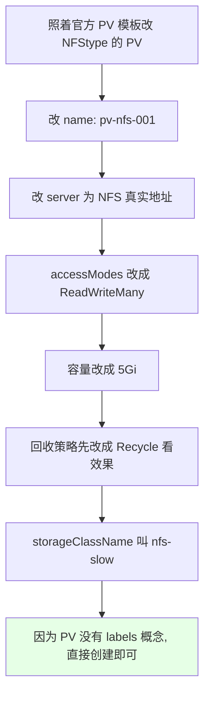
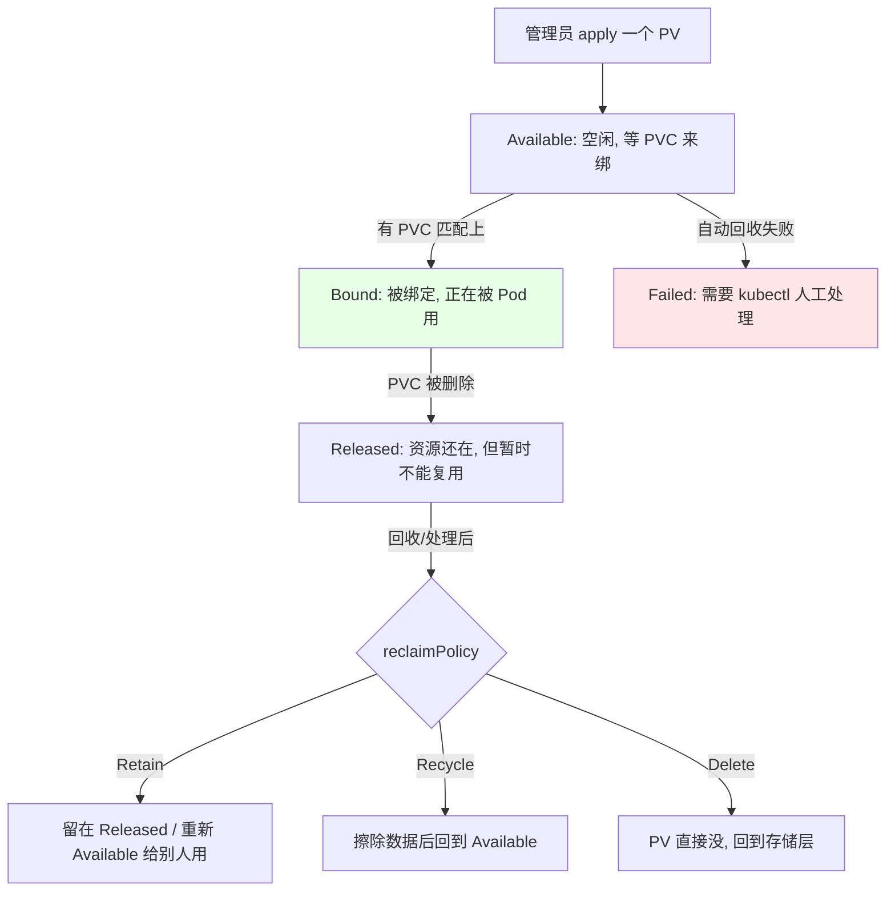
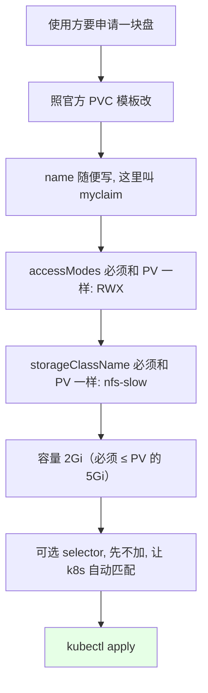
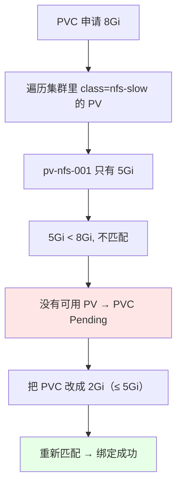
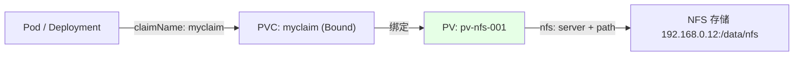
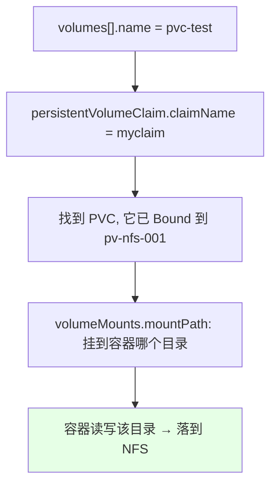
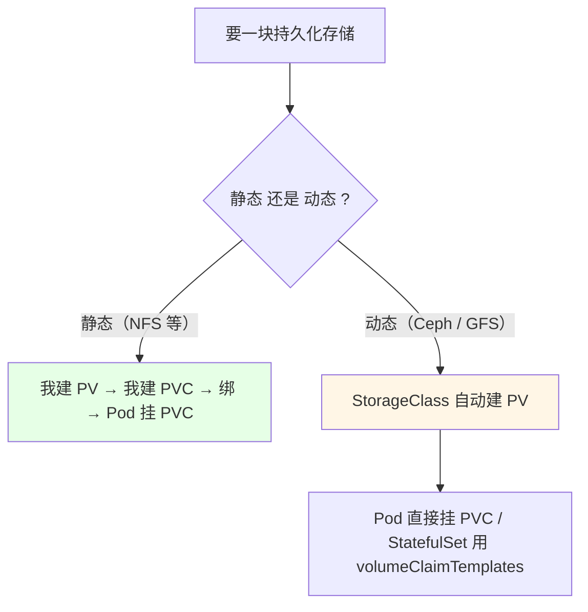

# Kubernetes 集群部署: PV 与 PVC 入门（从创建 PV 到 Pod 挂载实测的完整流程）

概念上节已经讲清楚了：管理员创建 PV 连后端存储，使用方写 PVC 申请，Pod 挂载 PVC。这一节把它**从头到尾跑一遍**，用真实的 NFS 类型的 PV 把链路打通：建 PV → 建 PVC → 绑定 → Deployment 挂载 → 进容器写文件 → 宿主机/NAS 侧立刻看到。

结论先摆，三步顺序不能乱：

1. **先 PV 后 PVC**：静态存储下 PV 由管理员先建好，PVC 才能申请到它；
2. **PVC 必须往小了申请**：容量可以小于 PV（5Gi 的 PV 申请 2Gi 没问题），**但绝不能大于 PV**，大于就匹配不到、一直 `Pending`；
3. **`storageClassName` 和 `accessModes` 必须和 PV 一致**，课程里实测把 8Gi 请求打上去，describe 直接提示「没找到这个 class 的 PV」；
4. **PVC 建好之后基本不改**（名字、容量都不让改），要改只能删了重建；
5. **Pod 侧写法固定**：`volumes[].persistentVolumeClaim.claimName` 写 PVC 名字，换后端存储时 Pod 清单一行都不用动。

## 纲要

- 准备：NFS 服务端已在跑
- 第一步：写一个 NFS 类型的 PV
- PV 的四种状态
- 第二步：写一个 PVC 申请存储
- 踩坑：8G 申请不到，改成 2G 才绑上
- 绑定后的现象：PV 变 Bound
- 第三步：Deployment 挂这个 PVC
- 实测：容器内写文件落到 NFS
- 静态与动态的使用方式对比

## 准备：NFS 服务端已在跑

```bash
# NFS 服务端在 node02 上, 导出目录 /data/nfs（前面章节已配好）
showmount -e 192.168.0.12
# Export list for 192.168.0.12:
# /data/nfs 192.168.0.0/24
```

## 第一步：写一个 NFS 类型的 PV

```yaml
apiVersion: v1
kind: PersistentVolume
metadata:
  name: pv-nfs-001
spec:
  capacity:
    storage: 5Gi
  accessModes:
  - ReadWriteMany
  persistentVolumeReclaimPolicy: Recycle
  storageClassName: nfs-slow
  nfs:
    server: 192.168.0.12
    path: /data/nfs
    readOnly: false
```



```bash
kubectl apply -f pv-nfs-001.yaml
kubectl get pv
# CAPACITY   ACCESS MODES   RECLAIM POLICY   STATUS      CLAIM   STORAGECLASS
# 5Gi        RWX            Recycle          Available             nfs-slow
```

```text
PV 的状态流转（kubectl get pv 的 STATUS 列）:

Available  ← 空闲, 还没有 PVC 认领, 可以被绑定  ← 刚创建出来就是它
Bound      ← 已经被某个 PVC 绑定, 正在被使用
Released   ← PVC 被删了, 但资源还没释放/不能被重新复用
Failed     ← 自动回收失败（如权限不够），需要人工介入处理
```



## 第二步：写一个 PVC 申请存储

```yaml
apiVersion: v1
kind: PersistentVolumeClaim
metadata:
  name: myclaim
  namespace: default
spec:
  accessModes:
  - ReadWriteMany
  storageClassName: nfs-slow
  resources:
    requests:
      storage: 2Gi
```



**匹配条件一条都不能差**：

| 条件 | PV 侧 | PVC 侧 | 不一致的后果 |
| --- | --- | --- | --- |
| `storageClassName` | `nfs-slow` | **必须 `nfs-slow`** | `Pending`，describe 报找不到 PV |
| `accessModes` | `ReadWriteMany` | 必须一致（可申请更小/更少） | `Pending`，匹配不到 |
| 容量 | `5Gi` | **≤ 5Gi**（这里要 `2Gi`） | 大于 PV 就绑不上 |
| selector | — | 可选，写死则只绑指定 PV | 加了就得精确命中 |

### 踩坑：8G 申请不到，改成 2G 才绑上

课程里先手一抖写了 8Gi，结果：

```bash
kubectl describe pvc myclaim
# 提示找不到 storageClassName 为 nfs-slow 的 PV（因为现有的只有 5Gi）
# 实际原因: 申请容量 8Gi > 可用 PV 5Gi
```

```text
为什么 8Gi 匹配不到 ?

集群里: PV pv-nfs-001 = 5Gi, class=nfs-slow, RWX
PVC myclaim = 2Gi  ✔ 匹配成功

PVC myclaim = 8Gi  ✘ 8 > 5, 没有任何 PV 装得下
                → STATUS 一直 Pending / 报无可用 PV
```



### PVC 创建后基本不能改

```bash
# 试一下直接改容量 —— 不让改
kubectl edit pvc myclaim
# 保存时报错: 部分字段（name / 容量）不可变

# 正确做法: 删掉重建
kubectl delete pvc myclaim
kubectl apply -f pvc-nfs.yaml
```

**PVC 的名字和 `requests.storage` 是不可变字段**，课程里实踩：edit 保存直接被拒，只能 `delete` 再 `apply`。所以写 PVC 时容量宁可先估小一点，后面靠扩容章节的方式处理。

## 绑定后的现象：PV 变 Bound

```bash
kubectl get pv
# 5Gi   RWX   Recycle   Bound   default/myclaim   nfs-slow
kubectl get pvc
# NAME      STATUS   VOLUME        CAPACITY   ACCESS MODES   STORAGECLASS
# myclaim   Bound    pv-nfs-001    5Gi        RWX            nfs-slow
```



`kubectl get pv` 的 CLAIM 列会显示出「namespace/ PVC名」，一眼就能看出**这块 PV 被谁占了**；PV 的 STATUS 也从 `Available` 变成了 `Bound`。

## 第三步：Deployment 挂这个 PVC

```yaml
apiVersion: apps/v1
kind: Deployment
metadata:
  name: demo-a-01
  labels:
    app: demo-a-01
spec:
  replicas: 1
  selector:
    matchLabels:
      app: demo-a-01
  template:
    metadata:
      labels:
        app: demo-a-01
    spec:
      containers:
      - name: nginx
        image: nginx:1.15.2
        imagePullPolicy: IfNotPresent
        volumeMounts:
        - name: pvc-test
          mountPath: /usr/share/nginx/html
      volumes:
      - name: pvc-test
        persistentVolumeClaim:
          claimName: myclaim
```

```text
Deployment 里挂 PVC 的三层名字要一一对上:

demo-a-01 (Deployment)
└── Pod
    └── spec.volumes
        └── - name: pvc-test          ← 卷名, 自己随便起
            └── persistentVolumeClaim:
                └── claimName: myclaim  ← 必须是 PVC 的真实名字
                    │
                    ▼  这条链是 k8s 自动连好的
                    PV: pv-nfs-001 → NFS: /data/nfs
```



## 实测：容器内写文件落到 NFS

```bash
# 1. 起应用（课程里是 nginx 容器, 挂到 /usr/share/nginx/html）
kubectl apply -f demo-deploy.yaml
kubectl get pod -o wide

# 2. 进容器看挂载
# 下面命令中的变量按你的集群环境赋值后再执行
kubectl exec -it $POD -- df -h

# 3. 写一个文件进去
kubectl exec -it $POD -- sh -c "echo 12345 > /usr/share/nginx/html/a"

# 4. 到 NFS 服务端看 —— 文件已经在了
ls -l /data/nfs
# -rw-r--r-- 1 root root 5 ... a
```

```text
读写链路实测结果:

容器 nginx (kubectl exec)
   │  echo 12345 > /usr/share/nginx/html/a
   ▼
volumeMounts: /usr/share/nginx/html
   │  volumes[].persistentVolumeClaim.claimName = myclaim
   ▼
PVC myclaim (Bound → pv-nfs-001)
   │
   ▼
PV pv-nfs-001 → nfs.server 192.168.0.12 + path /data/nfs
   │
   ▼
NFS 服务端 /data/nfs/a  ← ls 直接看到, 说明挂载成功
```

课程里还特意点了一句：**PVC 类型的 volume 写法，和之前 volume 直接写 `nfs` 的写法长得一模一样**，只是把 `nfs:` 换成了 `persistentVolumeClaim: claimName:`。所以不管后端是 NFS、Ceph 还是云盘，**PVC 这层的使用方式都是固定写法**，差别只在「创建 PV 时的那段 yaml 长什么样」。

## 静态与动态的使用方式对比

```text
静态存储（本节做的, NFS 属于这一类）:

1. 管理员手写一个 PV 的 yaml, apply 进去
2. 使用方写一个 PVC, storageClassName 对上
3. k8s 自动把 PVC 绑到匹配的 PV
4. Pod 的 volumes 写 persistentVolumeClaim + claimName
5. PVC 删了, PV 按回收策略处理（本节设的是 Recycle）

动态存储（Ceph / GFS, 下一章）:

1. 不需要手写 PV（StorageClass 会自动申请）
2. 甚至 StatefulSet 这类连 PVC 都不用自己写（volumeClaimTemplates）
3. PVC 删了, PV 一般跟着一起删
```



| 环节 | 静态存储 | 动态存储 |
| --- | --- | --- |
| 要手动写 PV 吗 | **要** | 不要，自动创建 |
| 要手动写 PVC 吗 | 要 | 一般要（StatefulSet 内置） |
| PVC 删了 PV 还在吗 | 按回收策略（`Retain` 在） | 一般一起删 |
| 本节能否演示 | 能（只有 NFS） | 环境里没有，下章再讲 |

## API 速览

| 能力 | 做法 | 关键点 |
| --- | --- | --- |
| 看 PV 状态 | `kubectl get pv` | STATUS 有 Available / Bound / Released / Failed |
| 看 PV 被谁占用 | `kubectl get pv` 的 CLAIM 列 | 显示 `namespace/PVC名` |
| 看 PVC | `kubectl get pvc` | STATUS 为 `Bound` 才算成功 |
| 排查绑不上 | `kubectl describe pvc <PVC>` | 看 Events 提示找不到可用 PV |
| 创建 PV | `kubectl apply -f pv.yaml` | PV 无 namespace |
| 创建 PVC | `kubectl apply -f pvc.yaml` | 必须写 namespace |
| 看 Pod 挂了什么 | `kubectl describe pod <Pod>` | 看 Volumes / Mounts 段 |
| 看容器内挂载点 | `kubectl exec -it <Pod> -- df -h` | 确认目录挂上来了 |
| PVC 改字段 | `kubectl edit pvc` | **name / 容量不可变**，只能删了重建 |
| 清理 | `kubectl delete -f <文件>` | 注意回收策略对数据的影响 |
| 查动态存储 | `kubectl get sc` | 动态存储入口（下章） |

## Demo 示例

```bash
# 1. PV（管理员）
cat <<'EOF' > pv-nfs-001.yaml
apiVersion: v1
kind: PersistentVolume
metadata:
  name: pv-nfs-001
spec:
  capacity:
    storage: 5Gi
  accessModes:
  - ReadWriteMany
  persistentVolumeReclaimPolicy: Recycle
  storageClassName: nfs-slow
  nfs:
    server: 192.168.0.12
    path: /data/nfs
    readOnly: false
EOF
kubectl apply -f pv-nfs-001.yaml
kubectl get pv

# 2. PVC（使用方）—— 容量 2Gi, 千万别写超 5Gi
cat <<'EOF' > pvc-nfs.yaml
apiVersion: v1
kind: PersistentVolumeClaim
metadata:
  name: myclaim
  namespace: default
spec:
  accessModes:
  - ReadWriteMany
  storageClassName: nfs-slow
  resources:
    requests:
      storage: 2Gi
EOF
kubectl apply -f pvc-nfs.yaml
kubectl get pvc
kubectl describe pvc myclaim

# 3. Deployment 挂载这个 PVC
kubectl apply -f demo-deploy.yaml
kubectl get pod -o wide

# 4. 写文件验证
kubectl exec -it demo-a-01-xxx -- sh -c "echo 12345 > /usr/share/nginx/html/a"

# 5. 到 NFS 服务端看结果
ls -l /data/nfs
cat /data/nfs/a
```

```text
三步链路的时序（静态存储固定套路）:

t0  管理员: kubectl apply pv-nfs-001.yaml
     → PV 状态 Available, class=nfs-slow, 5Gi, RWX

t1  使用方: kubectl apply pvc-nfs.yaml (2Gi, nfs-slow, RWX)
     → k8s 匹配 class + 容量 + 访问模式
     → PVC Bound, PV 也变 Bound (claim = default/myclaim)

t2  开发: Deployment 的 volumes 写 persistentVolumeClaim.claimName=myclaim
     → Pod 调度起来, volumeMounts 把 PVC 挂进容器目录

t3  验证: 容器里写 /usr/share/nginx/html/a
     → NFS 服务端 /data/nfs/a 立刻可见
```

### 总结

- **静态存储就是固定三步**：先由管理员手建 PV（`nfs: server + path`），再由使用方建 PVC 用 `storageClassName` 去匹配，最后 Pod 的 `volumes` 写 `persistentVolumeClaim.claimName` 把 PVC 挂进容器 —— 课程里实测这套链路完全打通，容器内写的文件在 NFS 服务端直接可见；
- **PVC 的匹配是「三个条件同时满足」**：`storageClassName` 相同、`accessModes` 一致、**容量不超过 PV**；课程里先写了 8Gi，因为 PV 只有 5Gi，`describe` 直接报找不到 PV，改成 2Gi 才绑上；
- **容量只能往小申请不能往大要**（5Gi 的 PV 可以供 2Gi 的 PVC，反过来不行），而且 **PVC 的 name 和 `requests.storage` 是不可变字段**，`kubectl edit` 保存会被拒，只能删了重建；
- **PV 的 STATUS 四种状态要会看**：`Available`（空闲可绑）、`Bound`（被 PVC 占了）、`Released`（PVC 删了但资源没释放）、`Failed`（自动回收失败，得人工处理）；`kubectl get pv` 的 CLAIM 列显示 `namespace/PVC名`，一眼看出被谁占；
- **PVC 类型的 volume 写法对所有后端存储都一样**（`persistentVolumeClaim: claimName:`），差别只在创建 PV 时那一段 yaml —— 原理通了之后换存储只是查一遍配置模板；
- **动态存储不用自己建 PV**（Ceph / GFS 下一章讲），那时 PV 自动生、PVC 删掉 PV 一般也跟着走；本节因为环境里只有 NFS，先按静态这套跑通。

