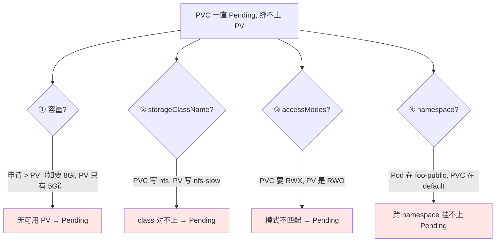
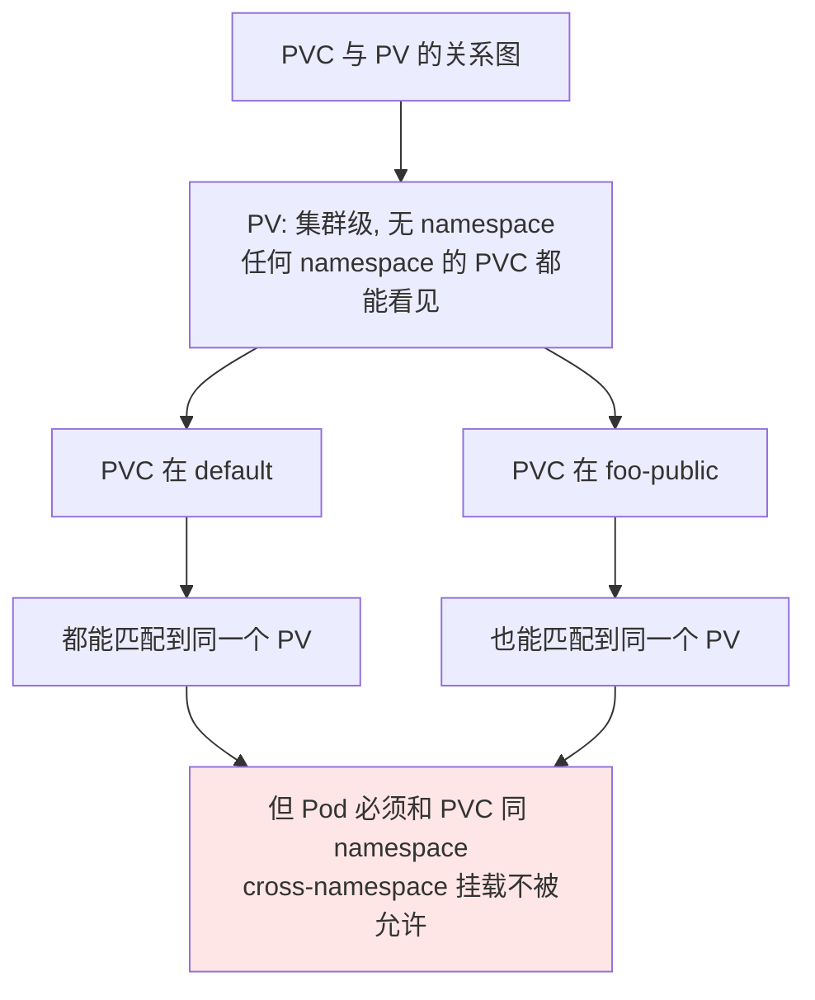
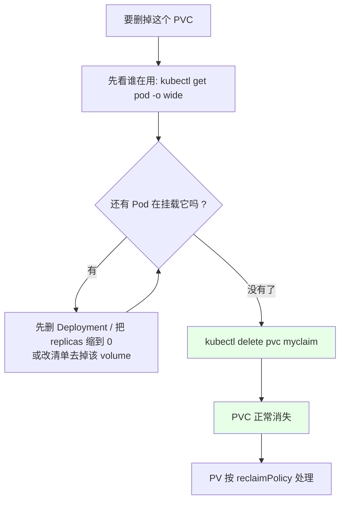
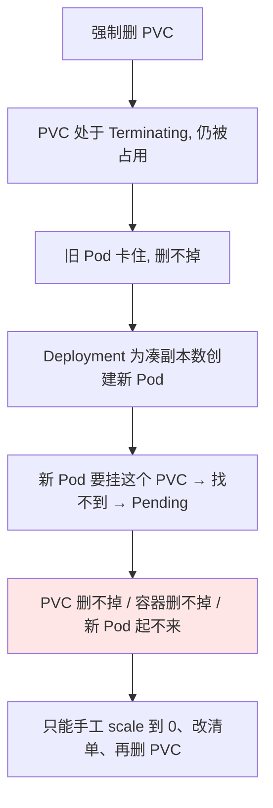
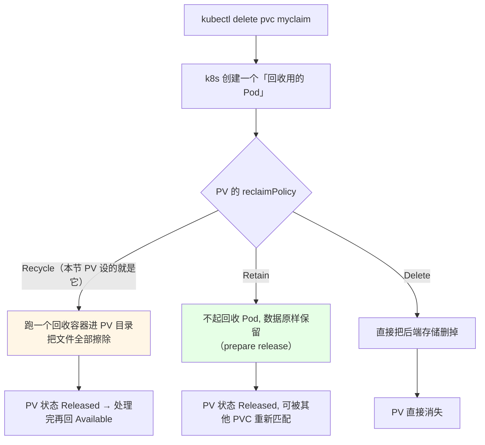
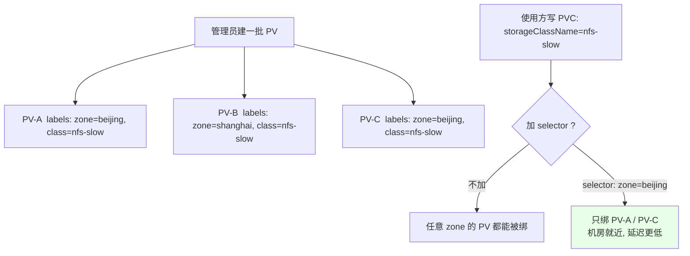
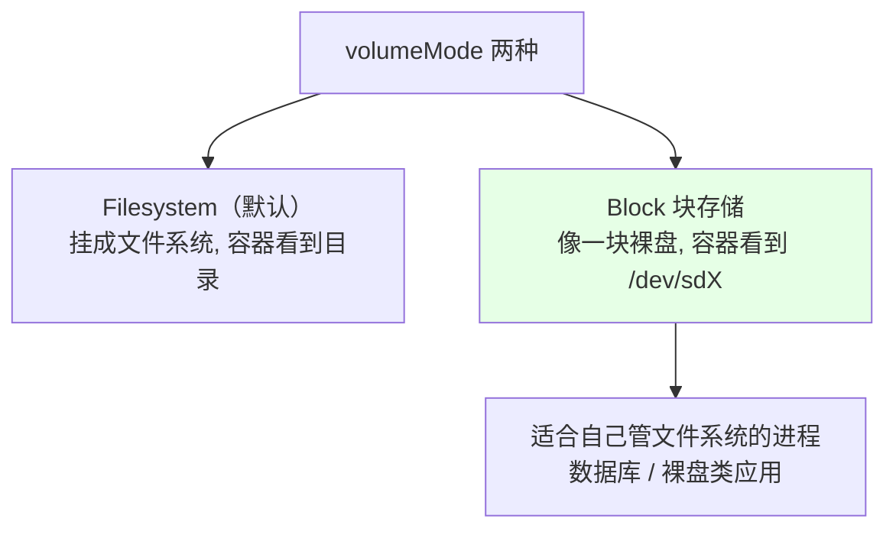
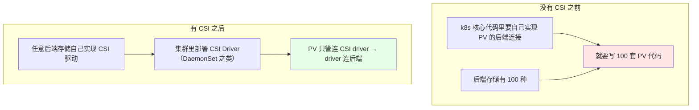
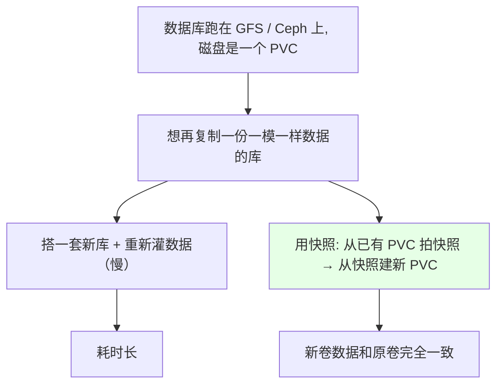

# Kubernetes 集群部署: PV 与 PVC 补充（绑不上与删除卡死的排查、selector 分配、CSI 与快照）

上节把 PV / PVC 从创建到挂载跑通了。这一节补的是**实操里真正会卡住人的部分**：PVC 一直 `Pending` 绑不上怎么办、PVC 删不掉卡在 `Terminating` 怎么破、删除 PVC 时 k8s 到底在背后干什么、怎么用 `selector` 把 PV 按机房区域分配、以及 CSI 标准和快照（VolumeSnapshot）是怎么回事。

结论先摆：

1. **PVC 一直 `Pending` 只有四个原因**：容量申请**大于** PV、`storageClassName` 不一致、`accessModes` 不一致、**PVC 与 Pod 不在同一个 namespace**；
2. **删除 PVC 前必须先删掉使用它的容器 / Deployment**，否则 PVC 会被占用卡在 `Terminating`；
3. **强制强删非常坑**：Deployment 为了凑副本数会新建 Pod，新 Pod 找不到正在删除的 PVC → 又 `Pending`，最后「PVC 删不掉、容器删不掉、新 Pod 也起不来」；
4. **删 PVC 时 k8s 会额外起一个「回收 Pod」按回收策略处理 PV**：`Recycle` 会擦数据、`Retain` 不起回收 Pod、`Delete` 直接删 PV；
5. **`selector` 让 PV 按标签（如机房区域）分配**：一批 PV 的 `storageClassName` 相同、label 不同，PVC 加 `selector` 只挑自己区域的那块；
6. **CSI 是存储插件化的标准**，快照（1.17+ 且只支持 CSI）能从一个已有 PVC 克隆出一模一样的卷，用来复制数据库。

## 纲要

- PVC 一直 Pending 的四个原因
- 删除 PVC 的正确顺序
- 强删 PVC 引发的连环 Pending
- 删除 PVC 时 k8s 在背后做的事（回收 Pod）
- PV 无 namespace，PVC 有 namespace
- 用 selector 按区域分配 PV
- 块存储 Block 形态
- CSI 标准解决了什么问题
- 快照与克隆 PVC

## PVC 一直 Pending 的四个原因



| 原因 | 现象 | 排查做法 |
| --- | --- | --- |
| **容量大于 PV** | 最常见；`describe pvc` 提示找不到可用 PV | `kubectl get pv` 核对比容量，往小了改 |
| **`storageClassName` 不一致** | class 名字差一个字就绑不上 | 两边必须写的一样 |
| **`accessModes` 不一致** | 要 RWX、PV 只有 RWO | 把两边的访问模式对齐 |
| **跨 namespace** | **PV 是集群级（无 namespace），但 PVC 有 namespace**，Pod 必须和 PVC 同 namespace | 给 Pod 的清单补 `-n <同一命名空间>` |



## 删除 PVC 的正确顺序

```text
错误顺序（课程里实踩）:

1. kubectl delete pvc myclaim        ← PVC 正在被 Pod 用
2. PVC 卡在 Terminating, 删不掉
3. kubectl delete deployment demo    ← Deployment 删了, 但会补新 Pod
4. 新 Pod 找不到 PVC（正在删除中）→ Pending
5. 结果: PVC 删不掉, Pod 起不来, 恶性循环


正确顺序:

1. kubectl scale deployment demo --replicas=0   （或先改清单去掉 PVC 挂载）
2. 确认所有用这个 PVC 的 Pod 都停了
3. kubectl delete pvc myclaim        ← 干净地删掉
4. （可选）确认 PV 按回收策略被处理
```



```bash
# 1. 看谁在用它
POD=demo-a-01-xxx
kubectl get pods -o wide
kubectl describe pod "$POD" | grep -i claim

# 2. 先把它使用的控制器收掉（或缩容）
kubectl scale deployment demo-a-01 --replicas=0

# 3. 确认没有 Pod 占用后, 再删 PVC
kubectl delete pvc myclaim

# 4. 看 PV 接下来怎么处理
kubectl get pv
```

## 强删 PVC 引发的连环 Pending

课程里把 PVC 强行删掉后的现场是这样的：

```text
时间线（这是强删的真实后果, 务必避坑）:

t0  kubectl delete pvc myclaim --force
    → PVC 进入 Terminating, 但因为仍被占用, 一直删不掉

t1 kubectl delete deployment demo
    → Deployment 会为了达到期望副本数, 补一个新的 Pod

t2 新 Pod 起来后要挂 myclaim
    → 但 PVC 还在 Terminating / 已删
    → 新 Pod 一直 Pending

t3 结果: PVC 删不掉, 旧容器删不掉, 新 Pod 也起不来
    → 集群进入「资源僵死」, 只能手工清理
```



**正确心态**：既然你决定手动删 PVC，就说明这个容器不用它了 —— 那就**先把容器 / Deployment 彻底删掉或更新掉**，再删 PVC。课程里最后的处置也是：把 Deployment 的 volume 去掉、Pod 全删、再删 PVC，等旧的被垃圾回收掉才干净。

## 删除 PVC 时 k8s 在背后做的事（回收 Pod）



```bash
# 删除 PVC 后观察 PV 状态变化
kubectl delete pvc myclaim
kubectl get pv pv-nfs-001
# 1) Released（PVC 已删, 资源还在）
# 2) 回收完成后 → Available（又变成空闲, 其他 Pending 的 PVC 可以来绑）
```

课程里实踩的一点：**回收 Pod 的镜像如果拉不下来，回收就会失败**，PV 会一直停在 `Released` 甚至带上「回收失败」的标签，这时只能人工介入处理 —— 所以生产上给 PV 设 `Recycle` 是有风险的。

```text
三种回收策略对删除 PVC 的响应:

Recycle  删除 PVC → 起回收 Pod → 清空目录 → PV 变 Released → 可回收复用
          └── 前提: 后端支持回收, 且回收 Pod 镜像能拉下来

Retain   删除 PVC → 什么都不做, 数据保留 → PV  Released, 可被其他 PVC 挂载
          └── 静态存储首选（NFS 没必要清空）

Delete   删除 PVC → 后端存储一起删 → PV 消失
          └── 动态存储默认
```

## 用 selector 按区域分配 PV

**PV 也能打标签**（`metadata.labels`），`selector` 的用法和 Deployment / Service 里那套完全一致：

```text
场景: 集群里有好几类 PV, storageClassName 都一样（都叫 nfs-slow）
      但分别位于不同机房 / 区域

PV-nfs-beijing   labels: zone: beijing
PV-nfs-shanghai  labels: zone: shanghai
PV-nfs-ssd       labels: stability: high

↓

PVC 里写 selector: zone = beijing
↓
只挑中北京那几块 PV, 不会挑走 Shanghai 的
```



```yaml
# PV 上打标签
apiVersion: v1
kind: PersistentVolume
metadata:
  name: pv-nfs-beijing
  labels:
    zone: beijing
spec:
  capacity:
    storage: 5Gi
  accessModes:
  - ReadWriteMany
  storageClassName: nfs-slow
  persistentVolumeReclaimPolicy: Retain
  nfs:
    server: 192.168.0.12
    path: /data/nfs
    readOnly: false
```

```yaml
# PVC 里用 selector 指定区域
apiVersion: v1
kind: PersistentVolumeClaim
metadata:
  name: myclaim
  namespace: default
spec:
  accessModes:
  - ReadWriteMany
  storageClassName: nfs-slow
  selector:
    matchLabels:
      zone: beijing
  resources:
    requests:
      storage: 2Gi
```

| 用法 | 写法 | 说明 |
| --- | --- | --- |
| 精确匹配 | `selector.matchLabels: {zone: beijing}` | 一对一 |
| 集合 / 正则匹配 | `selector.matchExpressions` | key/operator/values，如 `In` / `NotIn` / `Exists` |
| 不加 selector | — | class 相同就随机挑一个可用的 PV |

## 块存储 Block 形态



```yaml
# PVC 侧写法（写法固定, 和后端类型无关）
apiVersion: v1
kind: PersistentVolumeClaim
metadata:
  name: block-pvc
spec:
  accessModes:
  - ReadWriteOnce
  volumeMode: Block
  storageClassName: slow
  resources:
    requests:
      storage: 1Gi
```

要记住课程里那句：**无论后端是什么存储，只要 PV 创建成功了，PVC 的写法都是这一套**（访问模式 + `volumeMode` + 请求大小），差别只在「创建 PV 的那段 yaml 长什么样」。

## CSI 标准解决了什么问题



| 维度 | 内置 PV 实现 | CSI |
| --- | --- | --- |
| 新存储接入 | 改 k8s 核心代码 | 第三方写驱动即可，官方页面允许在核心代码外开发 |
| 维护成本 | 100 种后端 = 100 套代码 | 驱动各管各的 |
| 能力（快照等） | 基本没有 | **快照、扩容都在 CSI 层实现** |

```yaml
# PV 通过 CSI 驱动连接后端（字段真实）
apiVersion: v1
kind: PersistentVolume
metadata:
  name: pv-csi
spec:
  capacity:
    storage: 10Gi
  accessModes:
  - ReadWriteOnce
  storageClassName: csi-sc
  csi:
    driver: nfs.csi.k8s.io
    volumeHandle: nfs-server-01
    fsType: nfs
```

## 快照与克隆 PVC



| 项目 | 说明 |
| --- | --- |
| 版本要求 | **1.17 以上**（快照功能较新，还在 beta 阶段） |
| 支持范围 | **只支持 CSI 标准的 volume / driver** |
| 开启方式 | 需要在 kube-apiserver 和 kubelet 上打开对应的 feature gate（课程里强调要开开关） |
| 用法 | 先建 `VolumeSnapshot`，再从这个快照建新 PVC |
| 典型场景 | 复制数据库、出问题回滚到某个时刻的数据 |

```yaml
# 1. 对已有 PVC 拍一个快照
apiVersion: snapshot.storage.k8s.io/v1beta1
kind: VolumeSnapshot
metadata:
  name: db-snap
spec:
  source:
    persistentVolumeClaimName: db-data
```

```yaml
# 2. 从这个快照建一个新 PVC（复制出一模一样的数据卷）
apiVersion: v1
kind: PersistentVolumeClaim
metadata:
  name: db-data-clone
spec:
  accessModes:
  - ReadWriteOnce
  storageClassName: csi-sc
  dataSource:
    apiGroup: snapshot.storage.k8s.io
    kind: VolumeSnapshot
    name: db-snap
  resources:
    requests:
      storage: 10Gi
```

课程里的判断：快照这类功能「用的人还不知道多不多」，目前属于比较新的能力，**先知道原理和开启方式，等生产真需要（复制库、回滚）时再深挖**。

## API 速览

| 能力 | 做法 | 关键点 |
| --- | --- | --- |
| 查 PVC 为什么 Pending | `kubectl describe pvc <PVC>` | 看 Events 与匹配条件 |
| 核对比容量 | `kubectl get pv` | 申请容量 ≤ PV 容量 |
| 看谁在用这个 PVC | `kubectl describe pod <Pod>` | 看 Volumes 段的 claimName |
| 停掉占用方 | `kubectl scale deploy <名称> --replicas=0` | 删 PVC 前的必经步骤 |
| 正常删 PVC | `kubectl delete pvc <PVC>` | 前面把容器收干净 |
| 看 PV 回收过程 | `kubectl get pv` 的 STATUS | Released / Failed |
| PV 打标签 | yaml 里写 `metadata.labels` | 配合 PVC 的 `selector` |
| 按区域选 PV | PVC 的 `spec.selector` | `matchLabels` / `matchExpressions` |
| 看 CSI 驱动 | `kubectl get csidriver` / `kubectl get pods -n kube-system` | CSI driver 以 DaemonSet 形式部署 |
| 块存储 | PVC 里 `volumeMode: Block` | 容器拿到裸盘而不是目录 |
| 快照 | `VolumeSnapshot` + PVC 的 `dataSource` | 1.17+，只支持 CSI，需开 feature gate |

## Demo 示例

```bash
# 1. 复现 Pending: 申请 8Gi（PV 只有 5Gi）
kubectl apply -f pvc-8gi.yaml
kubectl describe pvc bigclaim
# 提示 class=nfs-slow 下没有可用 PV → 一直 Pending

# 2. 修掉: 改成 2Gi 并带上区域 selector
kubectl delete pvc bigclaim
kubectl apply -f pvc-ok.yaml
kubectl get pvc
# myclaim   Bound   pv-nfs-beijing   5Gi   RWX   nfs-slow

# 3. 想删这个 PVC —— 先看谁在用
kubectl get pods -o wide
kubectl scale deployment demo-a-01 --replicas=0

# 4. 确认干净后删 PVC
kubectl get pvc
kubectl delete pvc myclaim

# 5. 观察 PV 的回收轨迹
kubectl get pv pv-nfs-beijing -o wide
kubectl describe pv pv-nfs-beijing
# STATUS: Released（等回收处理）
# 之后回收完成 → Available, 其他 Pending 的 PVC 可以接管
```

```text
删除一个 PVC 的完整操作顺序（照着做, 别跳步）:

kubectl get pvc -n <命名空间>
kubectl get pod -o wide                      ← 找占用方
kubectl scale deployment <名称> --replicas=0 ← 先收容器
kubectl get pod                              ← 确认没有 Pod 在用
kubectl delete pvc <PVC> -n <命名空间>        ← 这时才删得掉
kubectl get pv                               ← 看 released → available
```

### 总结

- **PVC 一直 `Pending` 就查这四条**：容量申请**大于** PV、`storageClassName` 不一致、`accessModes` 不一致、Pod 与 PVC **不在同一 namespace**；其中「跨 namespace」最隐蔽（PV 是集群级无 namespace，但 PVC 有 namespace 隔离）；
- **删除 PVC 之前必须先处理掉使用它的容器 / Deployment**（先 `scale --replicas=0` 或改清单去掉 volume），直接删 PVC 会卡在 `Terminating`；
- **强删 PVC 会引发连环事故**：Deployment 补新的 Pod → 新 Pod 找不到正在删除的 PVC → `Pending` → 最后 PVC 删不掉、旧容器删不掉、新 Pod 起不来，只能手工清理；
- **删 PVC 时 k8s 会额外起一个「回收 Pod」按 `reclaimPolicy` 处理 PV**：`Recycle` 擦数据、`Retain` 不起回收 Pod 直接留在 `Released`、`Delete` 连 PV 一起删；课程里遇到回收 Pod 镜像拉不下来导致 PV 一直 `Released`，所以生产上 `Recycle` 有风险；
- **`selector` 把 PV 按标签（机房区域、稳定性）分配**：一批 PV 的 `storageClassName` 相同、`labels` 不同（如 `zone: beijing`），PVC 加 `selector.matchLabels` 就只绑自己区域那块，写法和 Deployment / Service 的 selector 一样；
- **块存储是 `volumeMode: Block`**（裸盘），但 **PVC 的写法对所有后端都固定**（accessModes + volumeMode + 请求大小），换存储只换 PV 那段 yaml；CSI 让第三方驱动替代「改 k8s 核心代码」，快照（1.17+，仅 CSI）则能从已有 PVC 克隆出一模一样的数据卷，用来复制数据库。

