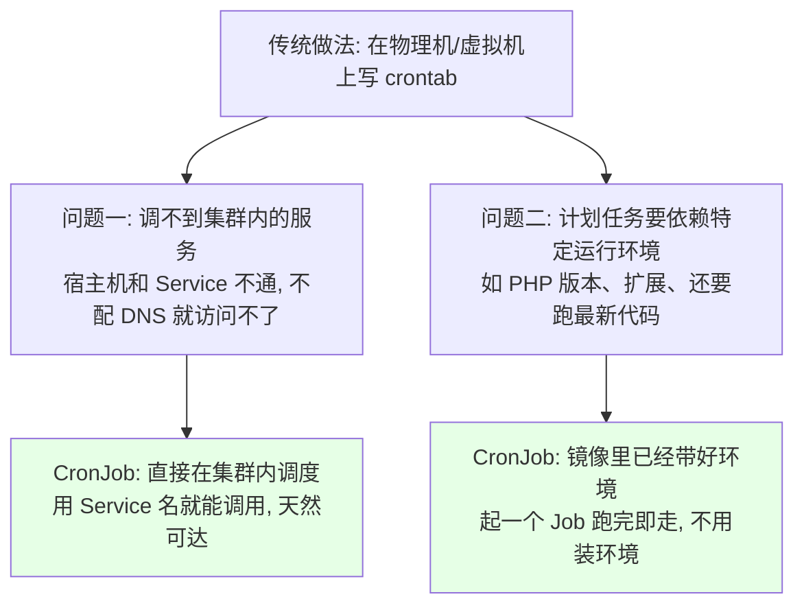
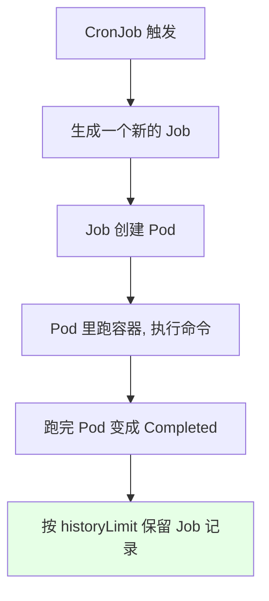
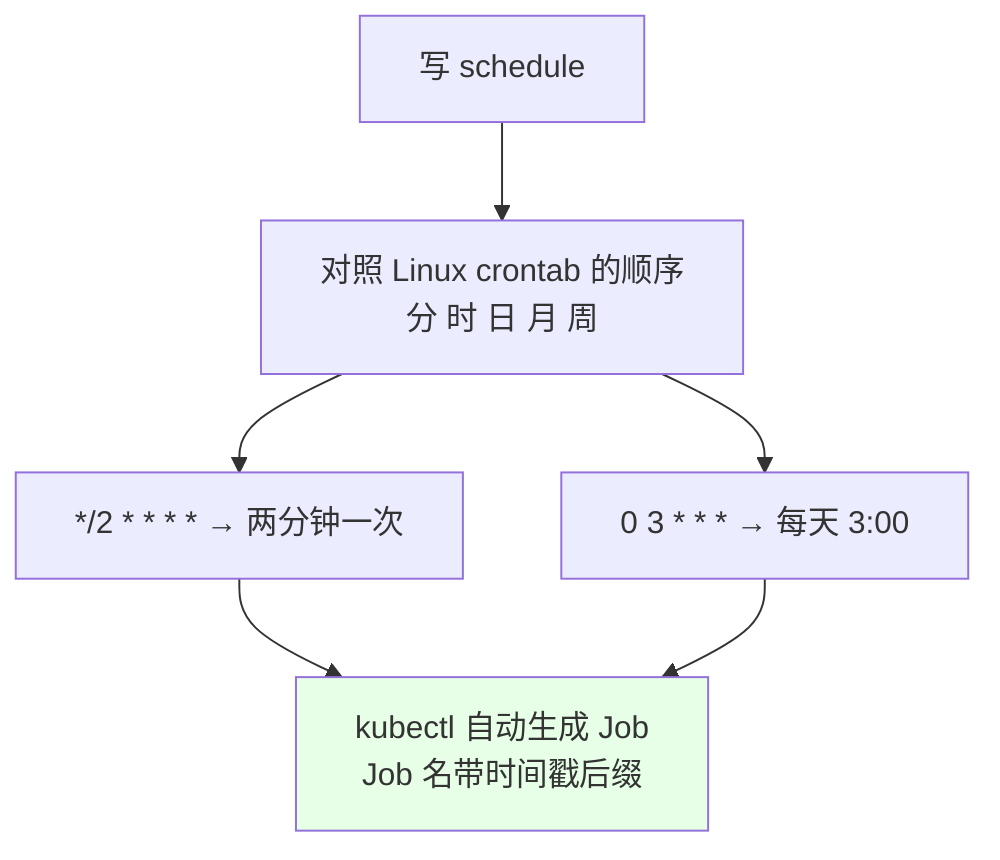
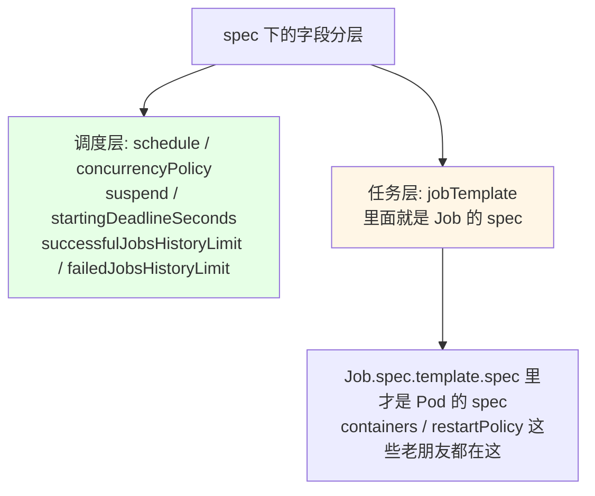
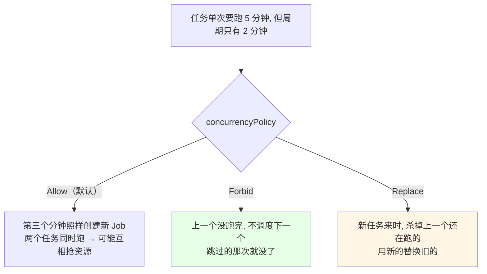
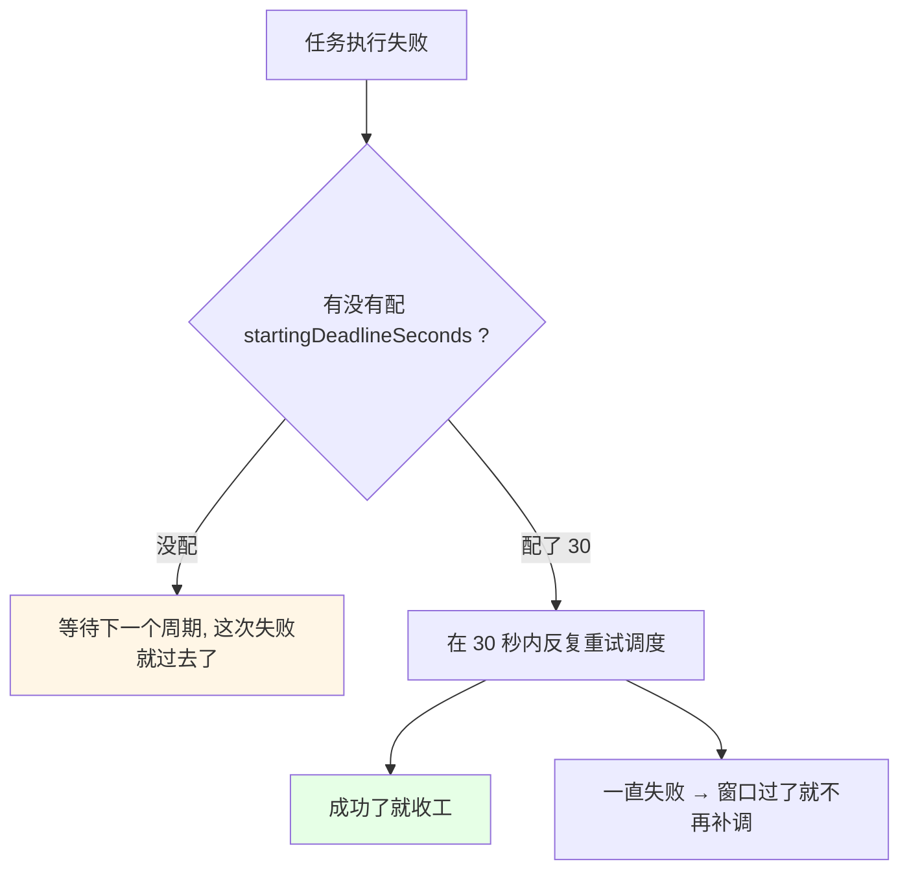
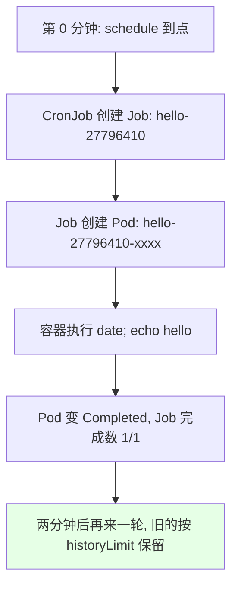
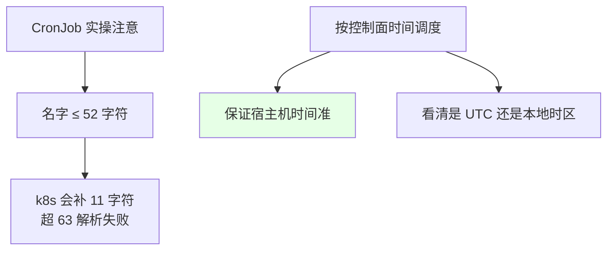

# Kubernetes 集群部署: CronJob 计划任务（类 Linux 的定时任务如何跑进容器，并发策略解读）

存储这块（volumes / PV / PVC）告一段落，接下来进到「让集群自己干活」的部分。**CronJob 计划任务**就是 k8s 里的 Linux `crontab` —— 周期性调度一个一次性任务，和宿主机上那个「分时日月周」的写法完全一样。

结论先摆：

1. **CronJob 是 Job 之上的一层调度器**：CronJob → 按 `schedule` 生成 Job → Job 再起 Pod，所以调度器**看不见 Pod，只看得见 Job**；
2. **为什么不用宿主机 crontab 替代**：宿主机调不到集群里的 Service（宿主机和 Service 不通，除非配 DNS），而且计划任务常常依赖特定运行环境（PHP 版本、扩展、最新代码），**直接用带好环境的镜像起 Job 最省事**；
3. **`concurrencyPolicy` 三种**：`Allow`（默认，并发跑）、`Forbid`（上一个没跑完就**不调度**下一个）、`Replace`（上一个没跑完就**杀掉**换新的）；
4. **`startingDeadlineSeconds` 是「失败补救窗口」**：配了它，任务在窗口内失败会被反复重试直到成功；不配，失败基本就过去了；
5. **两个实操坑**：CronJob 名字 **不能超过 52 个字符**（k8s 自己会补 11 字符后缀，超 63 字符解析不了）；**调度用的时间是控制面所在机器的时间**，容器时间与宿主机差 8 小时（UTC）会导致「看着时间不对」。

## 纲要

- 计划任务在 Linux 上怎么做，为什么搬到 k8s
- CronJob 与 Job 的层次关系
- 用 kubrun 直接跑一个最小样例
- schedule 写法：分时日月周
- 完整清单逐字段解读
- 并发策略三种
- startingDeadlineSeconds 与失败重试
- suspend 暂停调度
- 实测：两分钟跑一次，时间是「控制面时间」
- 命名长度与时区两个坑

## 计划任务在 Linux 上怎么做，为什么搬到 k8s



```text
用宿主机 crontab 的两道坎, CronJob 都没了:

宿主机 crontab
├── 计划任务 curl/service 名 → 宿主机 → 集群内 Service
│   └── 不通（除非额外配 DNS / 暴露）
└── 要跑 PHP 脚本 → 得先在机器上装 PHP + 扩展 + 拉最新代码

CronJob（用镜像）
├── 调度发生在集群内 → Service 名直接可达
└── php-apache:1.0 镜像里环境现成, 起容器跑完就完事
```



**CronJob 与 Job 的层次**：

| 层 | 作用 | 看到的资源 |
| --- | --- | --- |
| **CronJob** | 按周期调度，生成 Job | Job（不是 Pod） |
| **Job** | 管一次性任务，负责跑到结束 / 重试 | Pod |
| **Pod** | 真正跑容器的地方 | 容器 |

所以排障顺序是 `kubectl get cronjob` → `kubectl get job` → `kubectl get pod`，**不要一上来就只看 Pod**。

## 用 kubectl run 直接跑一个最小样例

课程里是直接用一行命令起的：

```bash
kubectl run hello \
  --schedule="*/2 * * * *" \
  --image=busybox:1.32 \
  --restart=OnFailure \
  -- /bin/sh -c "date; echo hello from k8s"
```

```text
这条命令对应的四个要素:

--schedule="*/2 * * * *"   ← 分时日月周: 每两分钟执行一次
--image=busybox:1.32       ← 用哪个镜像（镜像里环境现成）
--restart=OnFailure        ← 失败才重启, 成功不重启
-- /bin/sh -c "..."        ← 计划任务本身要执行的命令
```

```bash
# 看调度情况: 还没到点的时候, Job / Pod 都还没有
kubectl get cronjob
kubectl get job
```

## schedule 写法：分时日月周

```text
CronJob 的 schedule 和 Linux crontab 一模一样, 都是「分时日月周」:

┌─────── 分 (0 - 59)
│ ┌───── 时 (0 - 23)
│ │ ┌─── 日 (1 - 31)
│ │ │ ┌─ 月 (1 - 12)
│ │ │ │ ┌ 周 (0 - 6, 0 是周日)
│ │ │ │ │
* * * * *      ← 每分执行一次

*/2 * * * *    ← 每两分钟执行一次
0 * * * *      ← 每小时整点
30 3 * * *     ← 每天凌晨 3:30
0 1 * * 1      ← 每周一凌晨 1:00（周 1 = 周一）
```



## 完整清单逐字段解读

```yaml
apiVersion: batch/v1beta1
kind: CronJob
metadata:
  name: hello
spec:
  schedule: "*/2 * * * *"
  concurrencyPolicy: Forbid
  suspend: false
  startingDeadlineSeconds: 30
  successfulJobsHistoryLimit: 3
  failedJobsHistoryLimit: 1
  jobTemplate:
    spec:
      template:
        spec:
          containers:
          - name: hello
            image: busybox:1.32
            imagePullPolicy: IfNotPresent
            args:
            - /bin/sh
            - -c
            - date; echo hello from k8s
          restartPolicy: OnFailure
```



| 字段 | 作用 | 要点 |
| --- | --- | --- |
| `spec.schedule` | 周期表达式（分时日月周） | 与 crontab 完全一致，必须写 |
| `spec.jobTemplate` | 要跑的任务长什么样 | 里面套的就是 Job/Pod 的 spec |
| `spec.concurrencyPolicy` | 并发策略 | `Allow` / `Forbid` / `Replace`，默认 `Allow` |
| `spec.suspend` | 是否挂起 | `true` = 先别调度，任务暂停用 |
| `spec.startingDeadlineSeconds` | 启动截止时间 / 失败补救窗口 | 窗口内失败会一直重试到成功 |
| `spec.successfulJobsHistoryLimit` | 保留成功几个 Job | 建议留长点（如 3~10）便于回看 |
| `spec.failedJobsHistoryLimit` | 保留失败几个 Job | **失败时肯定要去看，别设 0** |
| `spec.containers[].image` | 用哪个镜像 | 镜像里环境现成 |
| `spec.restartPolicy` | 容器重启策略 | 与 Pod 一致：`Never` / `OnFailure` / `Always` |

```bash
# 看详细信息时, 这几个字段从上往下依次出现
kubectl describe cronjob hello
# Name: hello
# Schedule: */2 * * * *
# Concurrency Policy: Forbid
# Suspend: false
# Starting Deadline Seconds: 30
# Successful Jobs History Limit: 3
# Failed Jobs History Limit: 1
```

## 并发策略三种



| 策略 | 行为 | 适合场景 |
| --- | --- | --- |
| `Allow` | 允许并发，同时跑多份 | 任务短、允许重叠 |
| `Forbid` | 上一个没结束就不起新的 | **最常见**，避免重复处理数据 |
| `Replace` | 新任务直接替换（杀掉）旧的 | 只认最新一次结果 |

课程里的建议：**不需要并发就一定要配 `Forbid`**，不然会攒一堆重叠任务。

## startingDeadlineSeconds 与失败重试

```text
不配 startingDeadlineSeconds（默认）:

t=0    任务失败
t=0    不会再调度了, 这次就这么过去了


配了 startingDeadlineSeconds: 30:

t=0    任务失败
t=5    还在这个窗口内 → 再调一次
t=10   还在这个窗口内 → 再调一次
...    一直重试, 直到成功或超出窗口
```



```text
这个参数怎么配, 按业务定:

├── 幂等的任务（刷统计、同步快照）→ 配长一点, 失败自动补跑
└── 一次性任务（发一次通知就完）→ 可以不配, 失败了等下一轮
```

## suspend 暂停调度

```bash
# 临时把这个 CronJob 挂起来（不用删掉重建）
kubectl patch cronjob hello -p '{"spec":{"suspend":true}}'

# 改回来
kubectl patch cronjob hello -p '{"spec":{"suspend":false}}'
```

配了 `suspend: true`，调度器就跳过它，**已有的 Job 不受影响，只是不再生成新的** —— 想临时停掉某个任务时，这比删删改改省事得多。

## 实测：两分钟跑一次，时间是「控制面时间」

```bash
# 1. 看 CronJob
kubectl get cronjob
# NAME    SCHEDULE      SUSPEND   ACTIVE   LAST SCHEDULE   AGE
# hello   */2 * * * *   False     1        47s             5m

# 2. 看它造出来的 Job（名字带时间戳）
kubectl get job
# COMPLETIONS   DURATION   AGE
# 1/1           3s         2m

# 3. 看 Pod: 跑完就是 Completed
kubectl get pod
# NAME              STATUS      RESTARTS   AGE
# hello-27796410-xxxx   Completed   0          2m

# 4. 看日志确认内容执行了
kubectl logs hello-27796410-xxxx
# Fri Oct  3 07:50:00 UTC 2026
# hello from k8s
```



**两条实测观察：**

1. **执行时间有偏差（几秒）** —— 因为「启动容器是需要时间的」，从调度到容器真跑起来之间有一段延迟；课程里也说 Linux 上的 crontab 同样存在时差。**一般计划任务对秒级精度没要求，个别任务要实时再单独权衡**；
2. **容器内打印的时间和预期差了 8 小时** —— 课程里 `date` 出来是 07:50，宿主机已经是 15:50，正好是 UTC 时差。原因是 **CronJob 的调度时间用的是 kube-controller-manager 所在容器的时间**。

```text
时区问题的处理:

CronJob 的 schedule 判定发生在控制面（kube-controller-manager）

情况一: 控制面容器直接用宿主机时区
        └── 那就和宿主机一致, 保证宿主机时间对即可 ✅

情况二: 控制面跑在容器里, 时间是 UTC
        └── 比北京时间差 8 小时, 看起来"时间不对"
        └── 要么修控制面容器时区, 要么按 UTC 去写 schedule
```

课程里的判断：**只要保证宿主机（或控制面所在容器）的时间是准的，时区问题就不用管**。

## 命名长度与时区两个坑

```text
坑一: 名字长度

CronJob 的名字不能超过 52 个字符
   └── k8s 会自己在后面补 11 个字符（Job 名会再带时间戳后缀）
   └── 加起来超过 63 个字符就会解析失败 / 特别慢

   所以起名字别图长: hello、backup-db、sync-order 这种短名字就够


坑二: 时间

CronJob 按控制面的时间调度, 不是业务 Pod 的时间
   └── 控制面 UTC → 比北京早 8 小时
   └── 保证宿主机 / 控制面容器时间正确是根本
```



## API 速览

| 能力 | 做法 | 关键点 |
| --- | --- | --- |
| 快速起一个 | `kubectl run <名> --schedule="*/2 * * * *" --image=<镜像>` | 课程演示的一行命令 |
| 看调度计划 | `kubectl get cronjob` | SCHEDULE / SUSPEND / ACTIVE / LAST SCHEDULE |
| 看字段详情 | `kubectl describe cronjob <名>` | 能看到 historyLimit、deadline 等 |
| 造出来的任务 | `kubectl get job` | Job 名带时间戳 |
| 看实际执行 | `kubectl get pod` + `kubectl logs` | 跑完是 `Completed` |
| 暂停调度 | `kubectl patch cronjob <名> -p '{"spec":{"suspend":true}}'` | 不删重建就能停 |
| 改并发策略 | 改 `spec.concurrencyPolicy` | Allow / Forbid / Replace |
| 设置失败补救 | `spec.startingDeadlineSeconds` | 窗口内失败自动重试 |
| 保留记录数 | `successfulJobsHistoryLimit` / `failedJobsHistoryLimit` | 失败记录别设 0 |
| 清理 | `kubectl delete cronjob <名>` | 已产生的 Job/Pod 不会自动消失 |

schedule 表达式速查：

| 表达式 | 含义 |
| --- | --- |
| `*/2 * * * *` | 每 2 分钟 |
| `0 * * * *` | 每小时整点 |
| `30 3 * * *` | 每天 03:30 |
| `0 1 * * 1` | 每周一 01:00 |
| `0 0 1 * *` | 每月 1 号 |

## Demo 示例

```bash
# 1. 一行命令先跑起来（每两分钟一次, busybox 打日期）
kubectl run hello --schedule="*/2 * * * *" --image=busybox:1.32 \
  --restart=OnFailure -- /bin/sh -c "date; echo hello from k8s"

# 2. 看调度情况（刚起还没有 Job）
kubectl get cronjob
kubectl get job

# 3. 等一个周期后查看
kubectl get cronjob
kubectl get job
kubectl get pod
kubectl logs hello-27796410-xxxx

# 4. 正式清单（前面那段 yaml）用 apply 也可以
kubectl apply -f cronjob-hello.yaml
kubectl describe cronjob hello

# 5. 临时停掉再恢复
kubectl patch cronjob hello -p '{"spec":{"suspend":true}}'
kubectl patch cronjob hello -p '{"spec":{"suspend":false}}'

# 6. 清理
kubectl delete cronjob hello
```

```text
一次任务从调度到结束的完整链路:

t=00:00  CronJob 到点 → 创建 Job(hello-27796410)
t=00:00  Job 创建 Pod(hello-27796410-xxxx)
t=00:00  拉取镜像（首次会慢, 之后的 Job 就快了）
t=00:03  容器执行 date; echo hello from k8s
t=00:03  Pod → Completed, Job → COMPLETIONS 1/1
t=00:59  CronJob 把它计入 successfulJobsHistoryLimit
t=02:00  下一轮调度开始, 旧 Job 按 historyLimit 清理
```

### 总结

- **CronJob 就是 k8s 里的 crontab**（`分时日月周` 写法与 Linux 完全一致），它是 **Job 之上的调度层**：CronJob 按 `schedule` 生成 Job，Job 再起 Pod，所以排障要看 `get cronjob → get job → get pod` 三层；
- **不用宿主机 crontab 的理由有两条**：宿主机调不到集群内的 Service（不配 DNS 就不通），而计划任务常依赖特定运行环境（PHP 版本、扩展、最新代码）—— **直接用带好环境的镜像起 Job，环境现成、免安装**；
- **`concurrencyPolicy` 三选一**：`Allow`（默认，允许并发重叠）、`Forbid`（上一个没跑完就不调度下一个，**最常用**）、`Replace`（杀掉旧的换新的）；
- **`startingDeadlineSeconds` 是失败补救窗口**：配了之后窗口内失败会反复重试到成功，不配就等下一轮；`spec.suspend` 可以一行 patch 直接把调度暂停，不用删重建；
- **两个必记的坑**：**CronJob 名字不能超过 52 个字符**（k8s 会补 11 字符，超 63 就解析失败），以及 **schedule 判定用的是控制面（kube-controller-manager）的时间**，容器时间与宿主机差 8 小时（UTC）是正常的，保证宿主机 / 控制面容器时间准即可；
- **实测现象要能解释**：跑完的 Pod 是 `Completed`（不是 Running），Job 名带时间戳；两分钟内会有几秒偏差是因为**启动容器本身要时间**，一般计划任务对精度没那么敏感。

