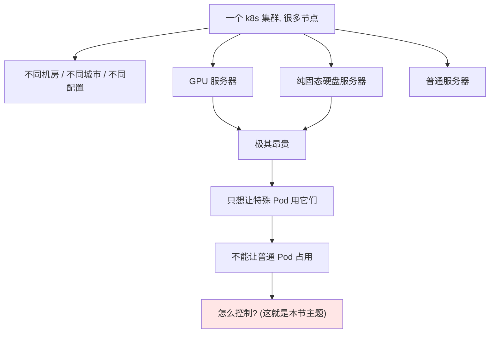
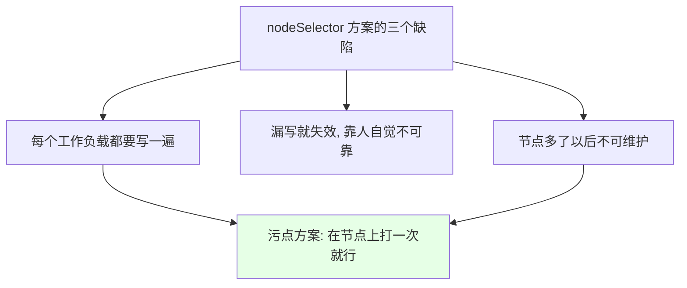
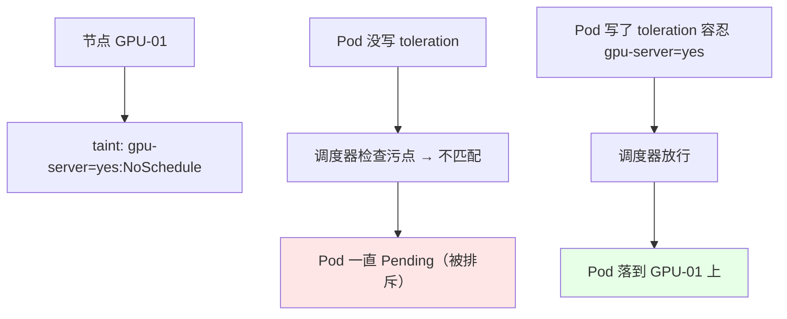
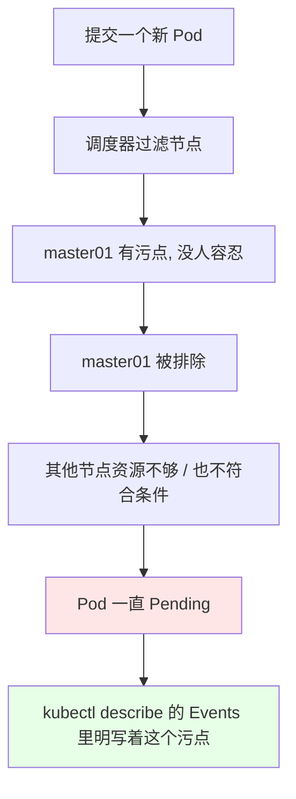
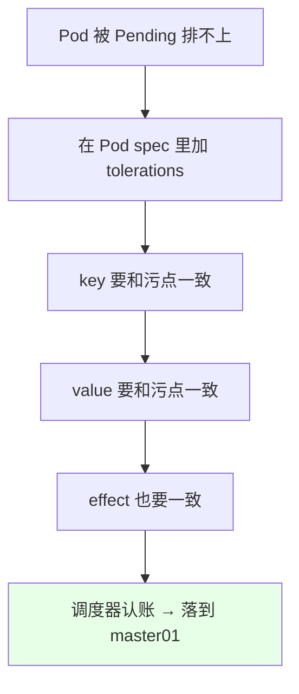
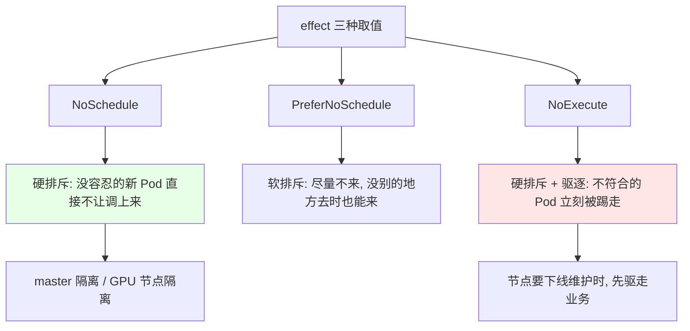
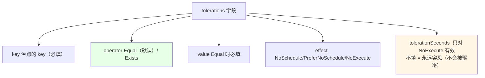
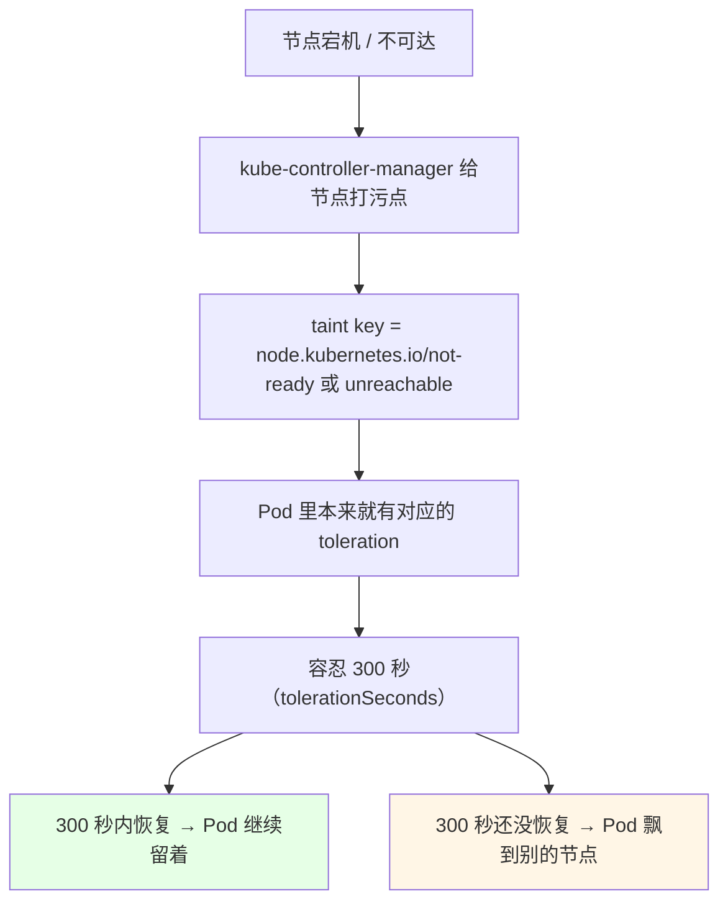
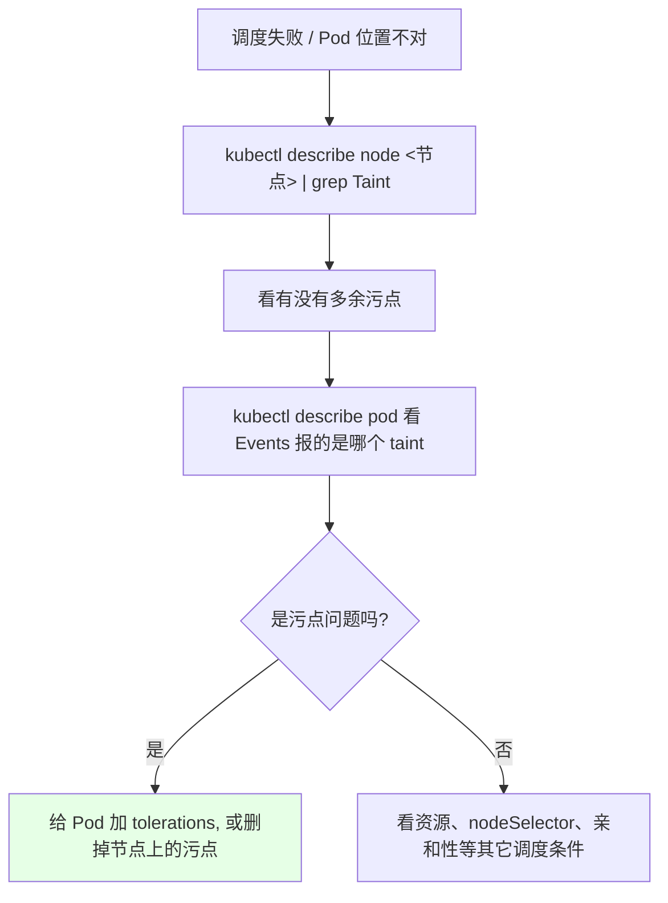

# Kubernetes 集群部署: Taint 与 Toleration 入门（用污点排斥、用容忍声明来控住调度）

上一节的 PV / PVC、CronJob 属于「能用」，这一节开始是 k8s 里**最难的两块之一**（另一块是网络）。这一节讲的 **污点（Taint）与容忍（Toleration）**，解决的是集群里一个非常现实的问题：**节点是异构的**。

结论先摆：

1. **nodeSelector 的毛病**：要给 GPU 服务器、纯 SSD 服务器做隔离，得给每个 Deployment 都写 `nodeSelector`，**谁忘写了 Pod 就飘上去了**；
2. **反过来打污点**：在节点上打一个「污点」= 声明「**不符合我的 Pod 别调到我这儿**」，**打一次，全集群生效，不用改任何业务清单**；
3. **容忍写在 Pod 上**：Pod 声明「我能容忍这个污点」才可能被调度上去；**一个节点打多个污点，必须全部被容忍才能上去**；
4. **三种 effect**：`NoSchedule`（新的不调度）、`PreferNoSchedule`（尽量不调度，软的）、`NoExecute`（**立刻驱逐**已有的）；
5. **master 节点天生就该打污点**：业务 Pod 不该跑到控制面上（影响 master 性能，master 一变更 Pod 就挂）；
6. **删除污点在语句末尾加 `-`**，和 label 一样；**`operator: Exists` 可以容忍某个 key 的所有值**。

## 纲要

- 异构节点带来的调度难题
- nodeSelector 方案的三个缺陷
- 污点与容忍的形象类比
- 给 master 打第一个污点
- NoSchedule：新的 Pod 进不来
- 给 Deployment 加容忍，Pod 才飘上去
- 三种 effect 对比
- NoExecute 的即时驱逐效果
- tolerations 字段完整写法
- 节点异常时的默认容忍
- 删污点与常用排错

## 异构节点带来的调度难题



```text
用 nodeSelector 做隔离的老办法:

给 GPU 节点打标签:  gpu-server=yes
给 SSD 节点打标签:  ssd-server=yes
给普通节点打标签:  normal=yes

每个业务 Deployment 都要写:
    nodeSelector:
        normal: yes

缺陷:
├── 每个 Deployment / StatefulSet 都得写一遍
├── 有人忘写了 → Pod 直接飘到 GPU 节点上
└── 越多的资源对象, 越容易漏
```



| 维度 | `nodeSelector` | `Taint` + `Toleration` |
| --- | --- | --- |
| 打在哪 | **Pod 的清单里** | **节点上（kubectl taint）** |
| 谁改 | 每个业务团队 | 集群管理员 |
| 漏配后果 | **Pod 可能调到贵机器上** | 打过污点的节点上没人能调度 |
| 对已有 Pod | 不影响 | `NoExecute` 会**驱逐** |
| 是否需要匹配 | 需要 label/selector 对上 | 需要 toleration 对上 |

## 污点与容忍的形象类比

```text
label（标签）   = 给节点贴个「我是谁」的牌子      → 吸引 Pod（selector 来挑）
taint（污点）   = 给节点贴个「不符合我别来」的条子 → 排斥 Pod

对比:
  label   是 服务器 → 打标签, Pod 用 nodeSelector 主动选它
  taint   是 服务器 → 打污点, Pod 用 toleration 声明能忍它

关键点: 一个节点可以打很多个污点
        → 必须把这所有的污点都容忍了, Pod 才能调度上来
```



**排斥方在节点上，声明方在 Pod 上**，两边对上才能调度 —— 这就是 Taint & Toleration 的全套逻辑。

## 给 master 打第一个污点

生产上有条铁律：**master 节点不该跑业务 Pod**（既影响控制面性能，master 一变更业务 Pod 就跟着晃）。用污点一行搞定：

```bash
# 给 master01 打一个污点（key=value:effect）
kubectl taint nodes k8s-master01 node-role.kubernetes.io/master=:NoSchedule

# 打完看节点上的污点
kubectl describe node k8s-master01 | grep -A3 Taint
# Taints:             node-role.kubernetes.io/master:NoSchedule
```

```text
一条 taint 语句的三个部分:

kubectl taint nodes <节点名> <key>=<value>:<effect>
                        │       │        └─ NoSchedule / NoExecute / PreferNoSchedule
                        │       └─ value 可以省略（只写 key:effect 也合法）
                        └─ key 自己起, 例如 gpu-server、ssd-server
```

> 课程里演示时用的是自定义 key/value（例如 `master=test`），效果完全一样 —— **taint 的 key 和 value 名字可以自己定**，爱叫啥叫啥。

## NoSchedule：新的 Pod 进不来

打完污点之后再起 Pod 看看：

```bash
kubectl run demo --image=busybox:1.32 -- sleep 3600
kubectl describe pod demo
# Events:
#   Warning  FailedScheduling  pod has unbound PersistentVolumeClaim ...
#   Warning  FailedScheduling  node(s) had taint {node-role.kubernetes.io/master: NoSchedule}
```



这里要分清 **`NoSchedule` 和驱逐的区别**：

- `NoSchedule`：**只拦新来的 Pod**，**已经在节点上跑着的 Pod 不受影响**；
- 课程里第二次打污点时误用了 `NoExecute`，结果**原来跑在 master 上的容器立刻进入删除状态** —— 这就是 `NoExecute` 的效果。

## 给 Deployment 加容忍，Pod 才飘上去

```yaml
apiVersion: apps/v1
kind: Deployment
metadata:
  name: demo
  labels:
    app: demo
spec:
  replicas: 2
  selector:
    matchLabels:
      app: demo
  template:
    metadata:
      labels:
        app: demo
    spec:
      tolerations:
      - key: "node-role.kubernetes.io/master"
        operator: "Equal"
        value: ""
        effect: "NoSchedule"
      containers:
      - name: busybox
        image: busybox:1.32
        imagePullPolicy: IfNotPresent
        command: ["sleep", "3600"]
```



三个字段必须**三处全对**（key / value / effect），才算是容忍住了同一个污点 —— 课程里也验证了：**key、value、effect 有任何一项不同，都不算同一个污点**。

```bash
# 打完污点后, 带 nodeSelector 的 Pod 会一直 Pending
# 加了上面的 tolerations 之后, 容器成功落到 k8s-master01 上
kubectl get pods -o wide
# NODE 列显示 k8s-master01 —— 说明污点被容忍了
```

## 三种 effect 对比



| effect | 对新 Pod | 对**已存在**的 Pod | 典型用途 |
| --- | --- | --- | --- |
| `NoSchedule` | 不允许调度 | **不动** | master 隔离、GPU 节点隔离 |
| `PreferNoSchedule` | 尽量不调度（软） | 不动 | 「来了也认，但先给别人」 |
| `NoExecute` | 不允许调度 | **立即驱逐** | 节点下线、故障隔离 |

## NoExecute 的即时驱逐效果

```bash
# 换个 effect 再打一次
kubectl taint nodes k8s-master01 node-role.kubernetes.io/master=:NoExecute

# 原来跑在 master01 上的容器立刻进入 Terminating / Deleting
kubectl get pods -o wide
```

```text
NoExecute 的驱逐过程:

master01 打上 NoExecute 污点
   ↓
调度器扫描 master01 上已存在的 Pod
   ↓
这些 Pod 都没有 toleration
   ↓
立刻被驱逐 → 状态变 Terminating → 被删除
   ↓
如果它们的Deployment 还在, 又会重新调度（但没地方去 → Pending）
```

课程里观察到的现象很典型：一部分 Pod 因为**配了 nodeSelector 只能选那一个节点**，于是**一直 Pending 卡着下不来**；另一部分没写 nodeSelector 的则直接被删掉了。**这就是为什么改 effect 前一定要先看清楚哪个 Pod 卡在哪。**

## tolerations 字段完整写法

```yaml
spec:
  tolerations:
  - key: "gpu-server"
    operator: "Equal"          # 默认就是 Equal
    value: "yes"
    effect: "NoSchedule"
    tolerationSeconds: 3600    # 只对接 NoExecute: 3600 秒后才驱逐
```



两种 operator 的差别很重要：

| `operator` | 语义 | 是否要写 `value` | 示例 |
| --- | --- | --- | --- |
| `Equal`（默认） | key + value + effect **全都相等**才算容忍 | **要写** | `key: gpu-server, value: yes` |
| `Exists` | 只要 **key 存在**就容忍，**忽略 value** | 不写（留空） | `key: node-role.kubernetes.io/master` |

> 课程里的用法：默认就用 `Equal`，先把「key / value / effect」三个写成一样，配对成功 Pod 就上去了。

## 节点异常时的默认容忍

```bash
# 看 Pod 上被自动加的 toleration
kubectl get pod demo -o yaml
```

```yaml
# k8s 自动加的两个默认容忍（每个 Pod 都有）
spec:
  tolerations:
  - key: node.kubernetes.io/not-ready
    operator: Exists
    effect: NoExecute
    tolerationSeconds: 300
  - key: node.kubernetes.io/unreachable
    operator: Exists
    effect: NoExecute
    tolerationSeconds: 300
```



课程里点得很清楚：这是**每个 Pod 默认自带**的容忍，**`tolerationSeconds: 300` 可以自己改**，节点故障后的等待窗口就由它决定。

## 删污点与常用排错

```bash
# 删除污点: 在语句末尾加 - （和 label 一样）
kubectl taint nodes k8s-master01 node-role.kubernetes.io/master:NoSchedule-

# 确认污点没了
kubectl describe node k8s-master01 | grep -A2 Taints
# Taints:             <none>

# 临时让 Pod 能调到 master 上（调试用）
kubectl run demo --image=busybox:1.32 -- sleep 3600 \
  --overrides='{"spec":{"tolerations":[{"key":"node-role.kubernetes.io/master","operator":"Exists","effect":"NoSchedule"}]}}'
```

```text
污点相关排错清单:

现象 1: Pod 一直 Pending
   └── kubectl describe pod → Events 里 "had taint {xxx: NoSchedule}"
   └── 说明节点有污点, 你没容忍 → 加 tolerations

现象 2: Pod 被赶下 master
   └── 有人打了 NoExecute → 已存在 Pod 立刻驱逐
   └── 要么删这个污点, 要么给 Pod 加 toleration

现象 3: 想让 Pod 只跑 GPU 节点
   └── GPU 节点打 taint(gpu-server=yes:NoSchedule)
   └── GPU 的 Pod 写 toleration: key=gpu-server, value=yes
   └── 其余 Pod 自动被 GPU 节点排斥, 不用逐个加 nodeSelector

现象 4: 加了 toleration 还是 Pending
   └── key / value / effect 三者必须完全一致
   └── value 写一个字符都不对
```



## API 速览

| 能力 | 做法 | 关键点 |
| --- | --- | --- |
| 给节点打污点 | `kubectl taint nodes <节点> <key>=<value>:<effect>` | value 可省略 |
| 打三种 effect | `NoSchedule` / `PreferNoSchedule` / `NoExecute` | 只有 NoExecute 会驱逐 |
| 删污点 | `kubectl taint nodes <节点> <key>:<effect>-` | **末尾加短横线** |
| 看节点污点 | `kubectl describe node <节点>` | 看 Taints 那几行 |
| 给 Pod 加容忍 | yaml 里写 `spec.tolerations` | key / value / effect 要全对 |
| 容忍某 key 所有值 | `operator: Exists` 且**不写 value** | 匹配更宽松 |
| 控制驱逐等待 | `tolerationSeconds: <秒>` | 只对 `NoExecute` 有效 |
| 容忍一个节点的所有污点 | tolerations 里逐条写，或 `operator: Exists` 覆盖 | 节点有多个污点要全容忍 |
| 看调度失败原因 | `kubectl describe pod <Pod>` | Events 直接点名 taint |
| 临时生效 | `--overrides='{"spec":{"tolerations":[...]}}'` | 调试用 |

tolerations 字段速查：

| 字段 | 必填 | 说明 |
| --- | --- | --- |
| `key` | 是 | 与污点 key 相同 |
| `operator` | 否（默认 `Equal`） | `Equal` / `Exists` |
| `value` | `Equal` 时必填 | 与污点 value 相同 |
| `effect` | 否（默认匹配所有） | 与污点 effect 相同 |
| `tolerationSeconds` | 否 | 仅对 `NoExecute` 有效 |

## Demo 示例

```bash
# 1. 看现在 master01 上有没有污点（kubeadm 装的可能自带一个）
kubectl describe node k8s-master01 | grep -A2 Taint

# 2. 给它打一个自定义污点（value 可省略）
kubectl taint nodes k8s-master01 node-role.kubernetes.io/master=:NoSchedule

# 3. 起一个普通 Pod —— 应该排不上
kubectl run demo --image=busybox:1.32 -- sleep 3600
kubectl describe pod demo

# 4. 用 tolerations 覆盖 的方式把它调上来
kubectl run demo --image=busybox:1.32 -- sleep 3600 \
  --overrides='{"spec":{"tolerations":[{"key":"node-role.kubernetes.io/master","operator":"Exists","effect":"NoSchedule"}]}}'
kubectl get pods -o wide

# 5. 换成 NoExecute 感受一下驱逐
kubectl taint nodes k8s-master01 node-role.kubernetes.io/master=:NoExecute
kubectl get pods -o wide
kubectl get pods

# 6. 删掉这个污点, 恢复原状
kubectl taint nodes k8s-master01 node-role.kubernetes.io/master:NoExecute-
kubectl describe node k8s-master01 | grep -A2 Taint
```

```text
一次完整的污点实验记录:

初始   master01 上跑了两个业务容器（测试环境节点不够, 课程里也是这样）
t=1    kubectl taint nodes k8s-master01 node-role.kubernetes.io/master=:NoSchedule
        → 新建的 Pod 排不上, Events 报 taint 不匹配
t=2    给 Deployment 加 tolerations (key/value/effect 三处全对)
        → 两个容器成功落到 k8s-master01 上
t=3    把 effect 改成 NoExecute 再打一次
        → 正在跑的容器立刻进入删除状态
        → 带 nodeSelector 的那个卡在 Pending 下不来
t=4    kubectl taint nodes k8s-master01 node-role.kubernetes.io/master:NoExecute-
        → 污点没了, Pending 的 Pod 重新调度成功
```

### 总结

- **污点（Taint）打在节点上表示「排斥」，容忍（Toleration）写在 Pod 上表示「声明能忍」**；它解决的是**异构节点隔离**（GPU 机、纯 SSD 机太贵不想被普通 Pod 占、master 不该跑业务），比给每个 Deployment 写 `nodeSelector` 可靠得多 —— 打一次，**全集群生效、业务清单零改动**；
- **`NoSchedule` 只拦新 Pod，已在跑的 Pod 不受影响；`NoExecute` 会立刻把不符合的 Pod 驱逐掉；`PreferNoSchedule` 是软排斥**，课程里实测把 effect 改成 `NoExecute` 后，master01 上原来跑着的容器马上进入删除状态；
- **容忍必须「key + value + effect 三处全对」**才算容忍住同一个污点，任何一个字段不一样都不算；`operator: Exists` 可以不写 value、容忍某个 key 的所有值；
- **一个节点可以打多个污点，必须全部被容忍 Pod 才能上去**；master 上打 `node-role.kubernetes.io/master:NoSchedule` 是生产常态；
- **每个 Pod 默认自带两个 `NoExecute` 容忍**（`node.kubernetes.io/not-ready` / `unreachable`），节点故障后 **300 秒**（`tolerationSeconds`）才飘走，这个窗口可以自己改；
- **删污点是语句末尾加 `-`**（和 label 一样），排障先看 `kubectl describe node` 的 Taints、再看 `kubectl describe pod` 的 Events —— Events 里会直接点名是哪个 taint 把你拦了。

