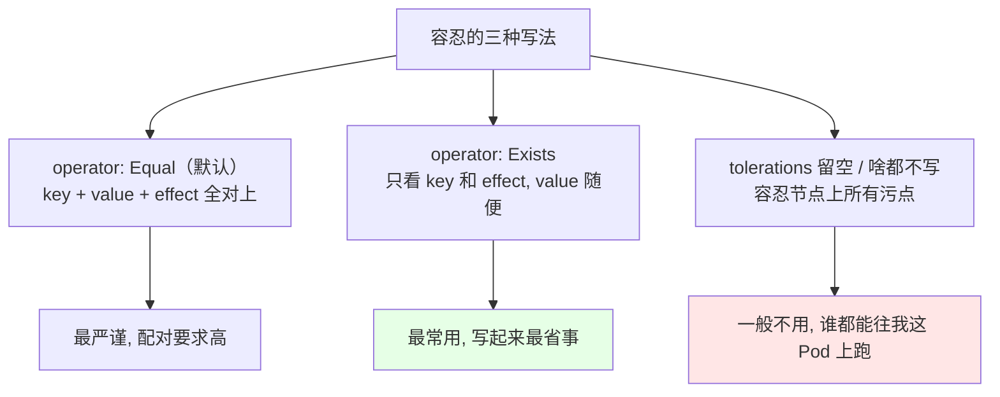
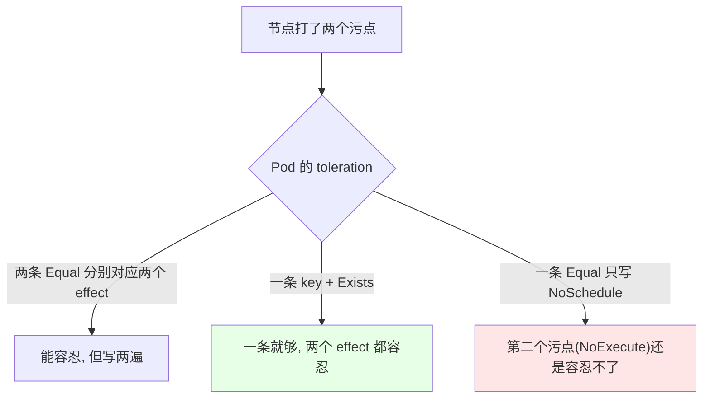
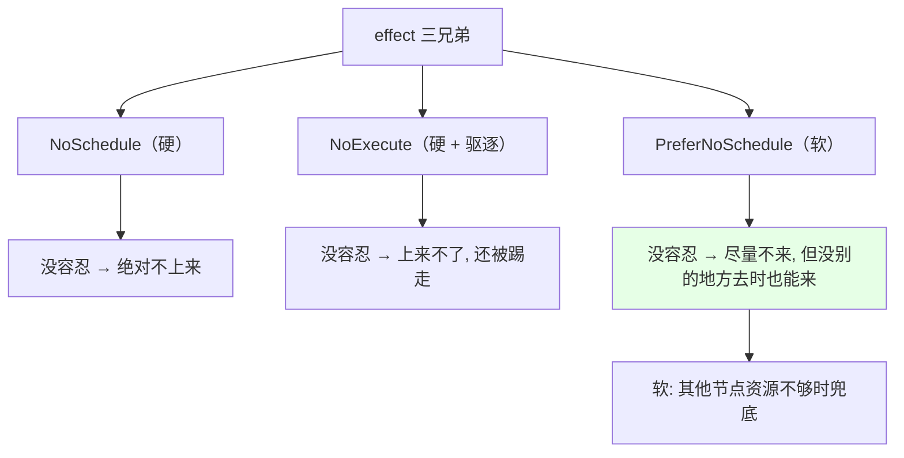
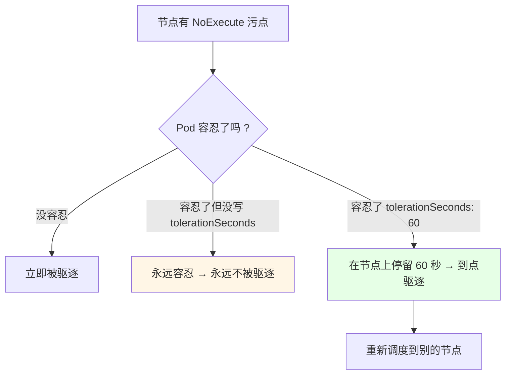
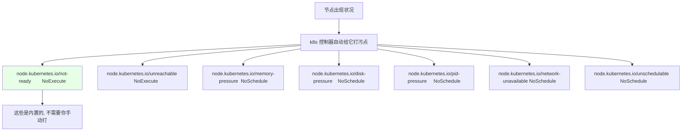
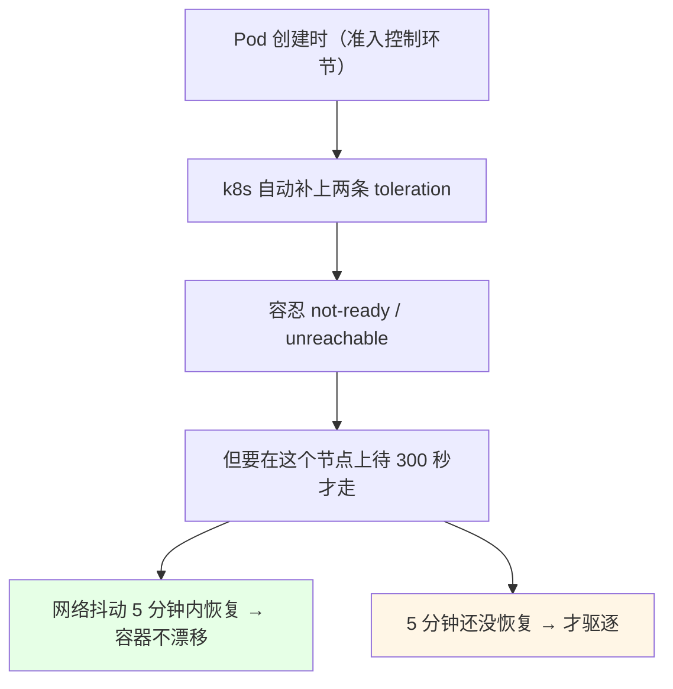
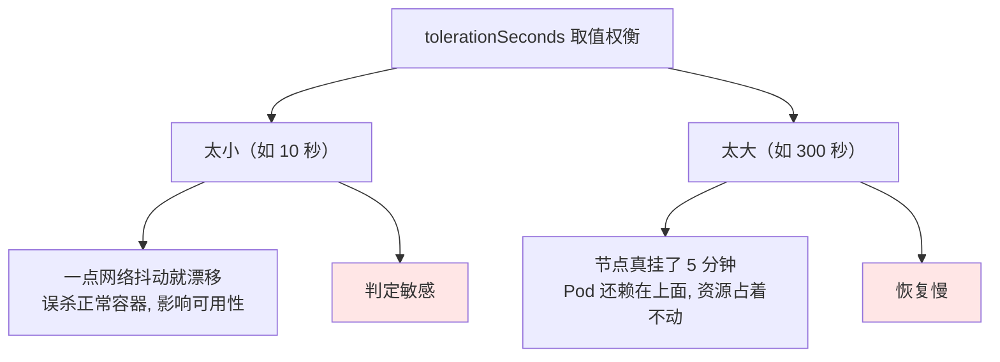
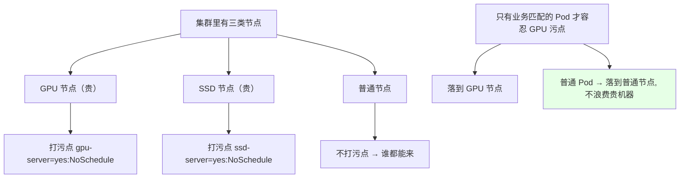

# Kubernetes 集群部署: Taint 与 Toleration 补充（容忍写法的三种形态、软污点与 tolerationSeconds 调优）

上一节把污点和容忍的用法跑通了，知道「key / value / effect 三处对上才能容忍」。这一节补的是**写法层面的三种形态**和**两个调优参数**：`Exists` 怎么偷懒、`PreferNoSchedule` 这种「软污点」是什么意思、`tolerationSeconds` 怎么控制「在坏节点上还能赖多久」。

结论先摆：

1. ** tolerations 有三种写法**：`Equal`（全匹配，默认）、`Exists`（只认 key + effect，**忽略 value**）、**什么都不写**（容忍一切污点，极少用）；
2. **同一个 key 打多个污点（不同 effect）时，写一个 `key` + `Exists` 就全容忍了**，不必手写好几条；
3. **`PreferNoSchedule` 是软污点**：尽量不调度到你这儿，但**别的节点资源不够时 Pod 还是能上来**；`NoSchedule` / `NoExecute` 是硬性的；
4. **`tolerationSeconds` 只对 `NoExecute` 生效**：配了 `60`，容忍方只能在坏节点上待 60 秒就被驱逐；**不配 = 永远容忍、永不驱逐**；
5. **节点异常时 k8s 自动打的内置污点**（`not-ready` / `unreachable` 等）和**Pod 被自动加的两个默认容忍**（300 秒）配对工作，这是防止「网络抖动误杀容器」的关键设计；
6. **`tolerationSeconds` 一般调到 10~60 秒**，太高会「节点都挂五分钟了 Pod 还在上面」，太低会误判抖动。

## 纲要

- 三种容忍写法对照
- 一个 key 对应多个污点怎么写
- 软污点 PreferNoSchedule
- tolerationSeconds 手动配置实战
- 节点异常时自动打的内置污点
- 准入控制自动加的两个默认容忍
- 300 秒该怎么调
- 生产用途：GPU / SSD 节点隔离

## 三种容忍写法对照



```yaml
# 写法一: Equal（严匹配, 默认 operator）
spec:
  tolerations:
  - key: "mastertest"
    operator: "Equal"
    value: "test"
    effect: "NoSchedule"
```

```yaml
# 写法二: Exists —— 我只认 key 和 effect, value 是啥都行
spec:
  tolerations:
  - key: "mastertest"
    operator: "Exists"
    effect: "NoSchedule"
```

```yaml
# 写法三: 只写 key + Exists, 连 effect 都不写
#          → 这个 key 的所有 effect（NoSchedule / NoExecute / PreferNoSchedule）都能容忍
spec:
  tolerations:
  - key: "mastertest"
    operator: "Exists"
```

```yaml
# 写法四: 空 tolerations —— Pod 容忍节点上任何污点
spec:
  tolerations:
  - {}
```

| 写法 | 匹配范围 | 要写 value 吗 | 适合场景 |
| --- | --- | --- | --- |
| `Equal`（默认） | key + value + effect 全等 | **要** | 精确控制，怕误容忍 |
| `Exists` | 只匹配 key（+ 指定 effect） | 不写 | 只认 key、value 会变的场景 |
| 只写 key + `Exists` | 该 key 的**所有 effect** | 不写 | **一个 key 多个污点时最省事** |
| `- {}` | 所有污点 | 不写 | 极少数情况，课程里也说不常用 |

```text
课程里搭建的两个污点（同一个 key, 两个不同 effect）:

节点 master01 上:
  taint-1:  mastertest=test:NoSchedule
  taint-2:  mastertest=test:NoExecute

旧写法（两条都要写）:
  tolerations:
  - {key: mastertest, operator: Equal, value: test, effect: NoSchedule}
  - {key: mastertest, operator: Equal, value: test, effect: NoExecute}

新写法（一条搞定）:
  tolerations:
  - {key: mastertest, operator: Exists}
```



## 软污点 PreferNoSchedule



```bash
# 打个软污点试试: 不影响调度, 只是「优先别来」
kubectl taint nodes k8s-master01 dedicated=test:PreferNoSchedule
```

| effect | 强制性 | 没其他节点可去时 |
| --- | --- | --- |
| `NoSchedule` | **硬** | 也不能来，Pod 一直 Pending |
| `NoExecute` | **硬** | 立即驱逐 |
| `PreferNoSchedule` | **软** | **能来**（兜底） |

课程里特别点了一句：**亲和性那章也有同样的软/硬之分** —— `preferred` 是软的、`required` 是硬的，`PreferNoSchedule` 和它们是一套语言。

## tolerationSeconds 手动配置实战

```yaml
spec:
  tolerations:
  - key: "mastertest"
    operator: "Equal"
    value: "test"
    effect: "NoExecute"
    tolerationSeconds: 60     # 只在节点上待 60 秒
```



| `tolerationSeconds` | 行为 |
| --- | --- |
| 不写 | **永远容忍**，主机坏了 Pod 也赖着不走 |
| `60` | 停留 60 秒后被驱逐（课程实测） |
| `300` | k8s 给默认值，停留 5 分钟 |
| `0` | 等同于立即驱逐 |

```text
课程实测时间线（tolerationSeconds: 60）:

t=0     kubectl taint nodes k8s-master01 mastertest=test:NoExecute
        → Pod 容忍了这个污点, 所以没有立刻消失
t=60    60 秒到
        → kubectl get pod → 状态变成 Deleting / Terminating
t=61    Pod 被驱逐, 重新调度
        → 落到 node02 / master03 上
```

课程里还演示了「Pod 卡在删除态」的中间态：因为还挂着 `NoSchedule` 污点，被赶下来的 Pod **又会被调度回这个节点**（软硬污点叠加时的怪现象），把 `NoSchedule` 那个污点也去掉之后才真正飘走。

## 节点异常时自动打的内置污点



| 内置污点 key | effect | 触发条件 |
| --- | --- | --- |
| `node.kubernetes.io/not-ready` | `NoExecute` | **节点还没 Ready**（新加节点、启动中） |
| `node.kubernetes.io/unreachable` | `NoExecute` | **kubelet 不可达**（网络抖动最常见） |
| `node.kubernetes.io/memory-pressure` | `NoSchedule` | 内存吃紧 |
| `node.kubernetes.io/disk-pressure` | `NoSchedule` | 磁盘空间不足 |
| `node.kubernetes.io/pid-pressure` | `NoSchedule` | 进程数压力 |
| `node.kubernetes.io/network-unavailable` | `NoSchedule` | 网络不通 |
| `node.kubernetes.io/unschedulable` | `NoSchedule` | 节点被手工设为不可调度 |

课程里强调这些**都是按节点状态自动加的**，官方页面有完整列表；**GPU / SSD 这种业务污点则必须是人手动打**（`kubectl taint`）。

## 准入控制自动加的两个默认容忍

```yaml
# 随便 describe 一个跑起来的 Pod, 它自带这么两条 tolerations
spec:
  tolerations:
  - key: node.kubernetes.io/not-ready
    operator: Exists
    effect: NoExecute
    tolerationSeconds: 300
  - key: node.kubernetes.io/unreachable
    operator: Exists
    effect: NoExecute
    tolerationSeconds: 300
```



```text
为什么是 300 秒?（防误杀设计）

场景: 节点其实很健康, 服务也正常
      只因为网络抖动, 没来得及向 master 汇报状态
      → master 把它标成 NotReady / unreachable
      → 立刻加 NoExecute 污点
      → 容器立刻被赶走 ❌ 冤枉

有了 300 秒宽限:
      master 打上污点, 但容器能再待 5 分钟
      → 5 分钟内自己恢复上报 → 污点撤掉, 容器继续跑 ✅
      → 5 分钟还没恢复 → 才是真挂了, 这时候才飘走
```

课程里点明这是**准入控制阶段**干的（准入控制在后面的章节会专门讲），而且**这个操作是 master 端（控制面）做的，和节点上的 kubelet 无关**。

## 300 秒该怎么调

```bash
# 查看一个 Pod 上实际生效的默认容忍
# 下面命令中的变量按你的集群环境赋值后再执行
kubectl get pod $POD -o yaml | grep -A5 tolerations
```



| 取值 | 好处 | 坏处 |
| --- | --- | --- |
| **10~60 秒**（课程建议） | 抖动快速恢复、真挂了很快漂移 | 判定略敏感 |
| 300 秒（默认） | 几乎不误杀 | 节点真挂了 Pod 占着不动太久 |
| 太大（5 分钟以上） | 不误杀 | 故障恢复慢，调度迟迟不放量 |

```text
课程里给的建议:

服务器基本在同一区域 / 同城 → 不会出现 5 分钟级别的网络波动
所以不用设 300 秒那么长

生产取值区间: 10 ~ 60 秒
   ├── 太高 → 节点挂了五分钟, Pod 还赖着, 白白占资源
   └── 太低 → 一次抖动就把容器赶走, 反而影响可用性
```

**按业务定**：可用率要求极高的，就往小调（30 秒）；怕误杀的往大一点，但别超过一两分钟。

## 生产用途：GPU / SSD 节点隔离

```text
生产上污点最常见的两个用法:

GPU 服务器（很贵）
├── kubectl taint nodes gpu-01 gpu-server=yes:NoSchedule
└── 只有写了 toleration(key=gpu-server, value=yes) 的 Pod 才能调上去
    其他普通 Pod 自动被 GPU 节点排斥, 不浪费它的资源

纯 SSD 服务器（很贵）
├── kubectl taint nodes ssd-01 ssd-server=yes:NoSchedule
└── 同理: 只有匹配的 Pod 才用得上

master 节点
└── kubectl taint nodes k8s-master01 node-role.kubernetes.io/master=:NoSchedule
    └── 业务 Pod 一律不上控制面
```



## API 速览

| 能力 | 做法 | 关键点 |
| --- | --- | --- |
| 容忍指定 value | `operator: Equal` + `value` | 默认写法，三个字段全对 |
| 忽略 value 容忍 | `operator: Exists` | 只认 key + effect |
| 容忍某 key 所有 effect | `operator: Exists` 且不写 effect | **最省事**，一个 key 多个污点专用 |
| 容忍一切污点 | `tolerations: [{}]` | 极少用 |
| 软污点 | `PreferNoSchedule` | 硬脏点用 `NoSchedule` / `NoExecute` |
| 控制停留时长 | `tolerationSeconds: 60` | **只对 `NoExecute` 有效** |
| 手动打业务污点 | `kubectl taint nodes <节点> <key>=<value>:<effect>` | GPU / SSD / master |
| 手动删污点 | `kubectl taint nodes <节点> <key>:<effect>-` | 末尾加 `-` |
| 看内置污点 | `kubectl describe node <节点>` | Taints 行会列出当前所有 |
| 看 Pod 的默认容忍 | `kubectl get pod <Pod> -o yaml` | 自带 not-ready / unreachable 两条 |
| 调宽限时间 | 改 `tolerationSeconds`（或改 kubelet 参数） | 建议 10~60 秒 |

toleration 字段速查：

| 字段 | 说明 |
| --- | --- |
| `key` | 污点 key；`Exists` 时只要它存在 |
| `operator` | `Equal`（默认）/ `Exists` |
| `value` | `Equal` 必填 |
| `effect` | 留空 = 匹配该 key 的所有 effect |
| `tolerationSeconds` | 仅 `NoExecute` 有效；不填 = 永不驱逐 |

## Demo 示例

```bash
# 1. 节点上打两个同一 key、不同 effect 的污点
kubectl taint nodes k8s-master01 mastertest=test:NoSchedule
kubectl taint nodes k8s-master01 mastertest=test:NoExecute

# 2. 一条 toleration 同时容忍两个 effect
kubectl run demo --image=busybox:1.32 -- sleep 3600 \
  --overrides='{"spec":{"tolerations":[{"key":"mastertest","operator":"Exists"}]}}'
kubectl get pods -o wide

# 3. 加 tolerationSeconds 感受「到点被赶走」
kubectl run demo --image=busybox:1.32 -- sleep 3600 \
  --overrides='{"spec":{"tolerations":[{"key":"mastertest","operator":"Exists","effect":"NoExecute","tolerationSeconds":60}]}}'
kubectl get pods -o wide
kubectl get pods
# 等 60 秒 → Pod 进入 Deleting → 重新调度到别的节点

# 4. 看节点的内置污点（把某节点压测或摘掉 kubelet 后观察）
kubectl describe node k8s-master01 | grep -A5 Taints

# 5. 看 Pod 上被自动补的默认容忍
kubectl get pod demo -o yaml | grep -A6 tolerations

# 6. 清理
kubectl taint nodes k8s-master01 mastertest:NoExecute-
kubectl taint nodes k8s-master01 mastertest:NoSchedule-
kubectl delete pod demo
```

```text
一次 tolerationSeconds 实验的完整记录:

t=0    kubectl taint nodes k8s-master01 mastertest=test:NoExecute
        Pod 写了 tolerationSeconds: 60, 所以没有被立刻赶走

t=0~60  Pod 老老实实待在 master01 上（kubectl get pod 看得到）

t=60   Pod 状态变 Deleting / Terminating

t=61   Pod 被驱逐, 重新调度
        → 落到 node02 或 master03（看了下有哪些节点空着）

备注   Pod 卡在删除态时是因为还挂着 NoSchedule 那个污点
       把 NoSchedule 污点也删掉, 它才真正飘走
```

### 总结

- **容忍有三种写法**：`Equal`（默认，key + value + effect 全对）、`Exists`（只认 key 和 effect、**value 随便**）、**只写 key + `Exists`**（容忍该 key 的所有 effect，一个 key 打两个污点时一条就够）；还有 `tolerations: [{}]` 这种「容忍一切」的写法，**课程里也说不常用**；
- **`PreferNoSchedule` 是软污点**：不像 `NoSchedule` / `NoExecute` 那么强制，**别的节点实在没资源时 Pod 还是能落到它上面**，和亲和性章节里 `preferred`（软）/ `required`（硬）是同一套语言；
- **`tolerationSeconds` 只对 `NoExecute` 生效**：不写 = 永远容忍、主机坏了 Pod 也赖着；写 `60` = 只能在这个节点上待 60 秒才被驱逐（课程实测 60 秒后 Pod 变 Deleting 再重新调度）；
- **节点异常时 k8s 会自动打内置污点**（`not-ready`、`unreachable` 是 `NoExecute`，`memory-pressure`、`disk-pressure`、`pid-pressure`、`network-unavailable`、`unschedulable` 是 `NoSchedule`），**业务用的 GPU / SSD 污点必须人手 `kubectl taint` 打**；
- **每个 Pod 都会被准入控制自动加两条 `NoExecute` 容忍**（`not-ready` / `unreachable` + `tolerationSeconds: 300`），这是**防止网络抖动误杀容器**的设计：5 分钟内自己恢复就不漂，超过才走；这个操作是控制面做的，跟节点上的 kubelet 无关；
- **`tolerationSeconds` 建议调到 10~60 秒**：同区域 / 同城集群不会出 5 分钟级别的网络波动，300 秒太长（真挂了 Pod 还占着资源），太小又容易一次抖动就漂移。

