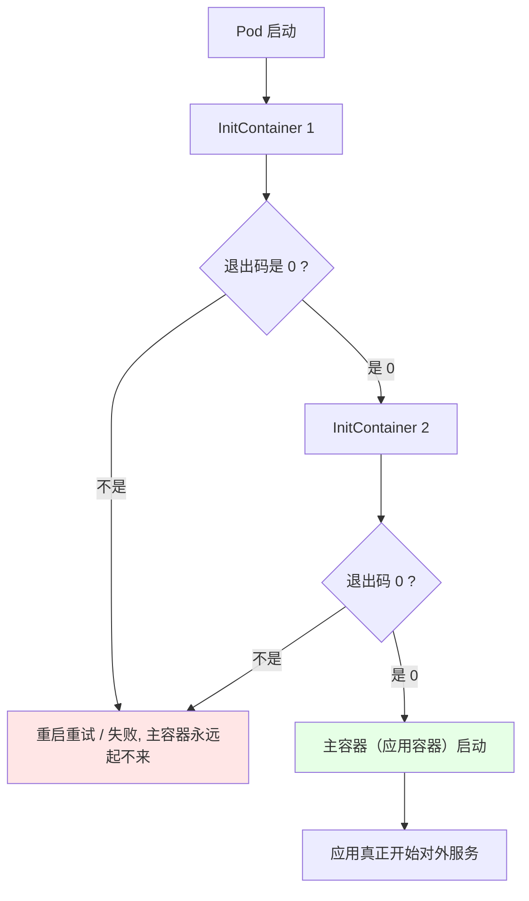
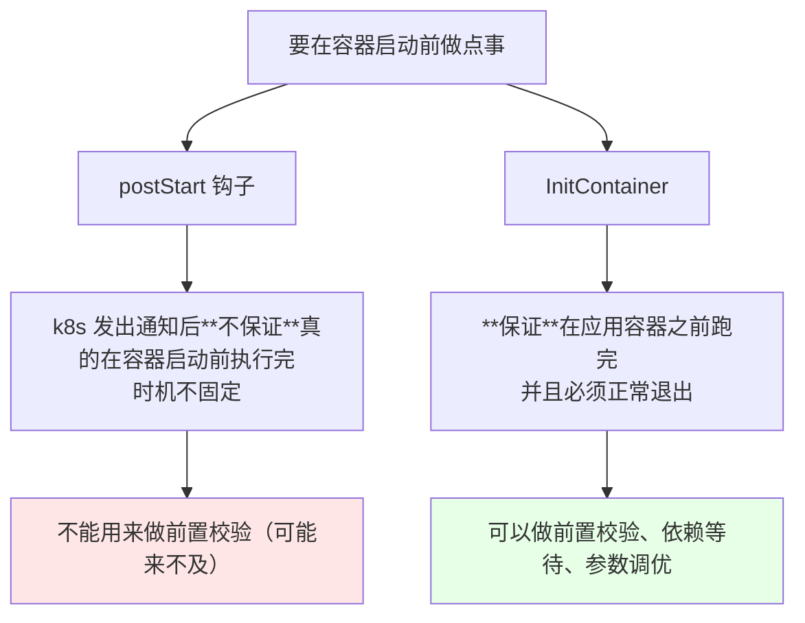
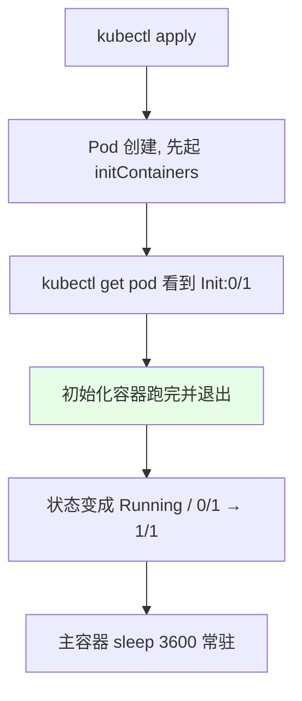
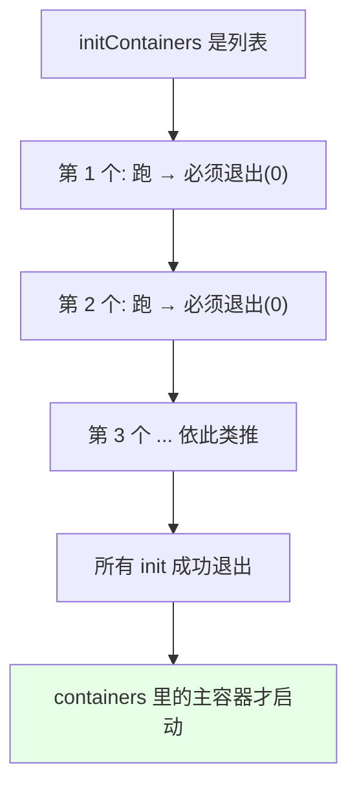
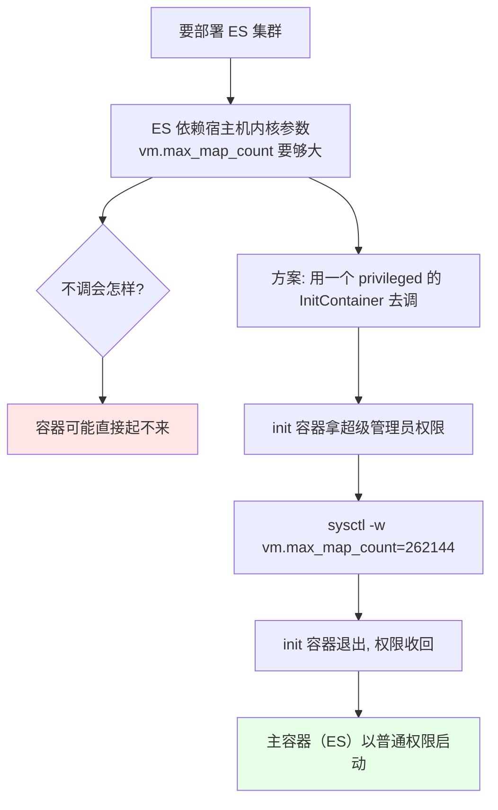
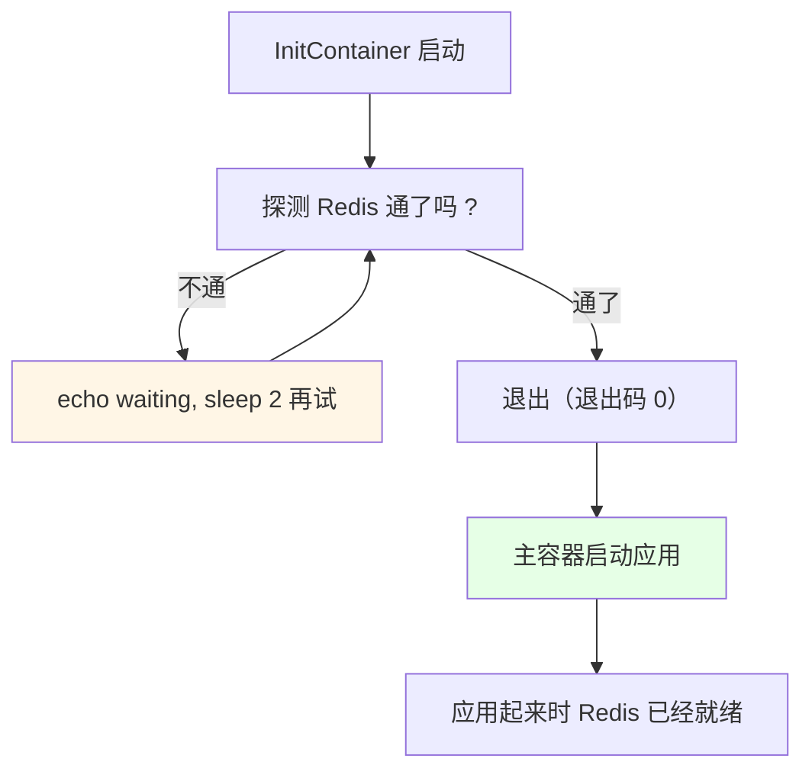
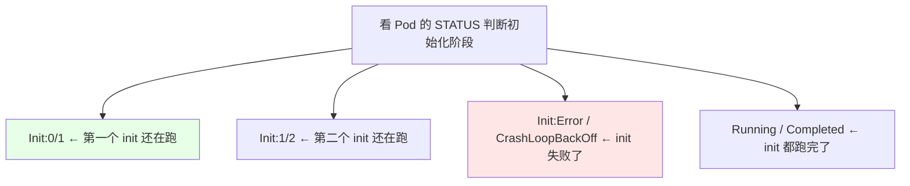

# Kubernetes 集群部署: InitContainer 初始化容器（启动前的预处理与强依赖等待）

上节污点与容忍刚讲完，它是「控制 Pod 去哪儿」；这节的 **InitContainer 初始化容器**是「**让 Pod 起来之前先干点事**」。

结论先摆：

1. **InitContainer 在应用容器启动之前跑**，而且**必须成功退出**，主容器才会被启动 —— 不退出，下面的容器就起不来；
2. **比 `postStart` 靠谱**：`postStart` 是钩子，**不保证**在容器真正启动之前执行；InitContainer 则是**保证先跑完**；
3. **多个 InitContainer 从上往下按顺序执行**，前一个成功才跑下一个，全跑完才起主容器；
4. **经典用法一：提权做一次性动作**，比如 ES 集群需要调内核参数 `vm.max_map_count`，先用一个 **privileged（超级管理员权限）** 的初始化容器改完就退出，主容器不用一直挂着特权（**一直用高权限跑容器很危险，被人攻破就能干危险操作**）；
5. **经典用法二：等依赖就绪**，应用强依赖 Redis / RabbitMQ 时，在 InitContainer 里写循环探测，「连上了才走，连不上就一直等」；
6. **其他预处理**：touch 文件、改目录权限、往共享卷写初始化内容。

## 纲要

- InitContainer 是什么
- 与 postStart 钩子的关键区别
- 与 postStart 的执行时序对比
- 第一个实验：一个最简 InitContainer
- 多个 InitContainer 的顺序执行
- 用法一：特权容器调内核参数（ES 场景）
- 用法二：循环等待强依赖服务就绪
- 用法三：往共享卷写文件 / 改权限
- 状态字段与不支持的字段
- 常见排错

## InitContainer 是什么



```text
一个 Pod 里的容器分两组:

spec.initContainers   ← 初始化容器（先跑, 跑完就退）
   ├── 按顺序从上往下执行
   └── 全部成功退出后 → 才轮到主容器

spec.containers       ← 应用容器（常驻）
   └── 上面都跑完了才启动
```

**InitContainer 原本支持 `containers` 里绝大多数参数**，但有一部分是不支持的（尤其是和「生命周期」相关的钩子），因为它存在的意义就是「一定要退出」。

## 与 postStart 钩子的关键区别



| 对比项 | `postStart` | `initContainers` |
| --- | --- | --- |
| 在哪写 | `lifecycle.postStart`（容器钩子里） | Pod 级 `spec.initContainers` |
| 执行时机 | **不保证**在容器启动前 | **保证**在应用容器之前 |
| 是否阻塞 | 不阻塞主流程 | **阻塞**，跑完才起主容器 |
| 失败影响 | 看钩子实现 | 主容器直接起不来 |
| 能做循环等待吗 | 勉强 | **天然适合** |

课程里那句话很关键：**`postStart` 不保证它会在应用容器之前跑完，而 InitContainer 一定会在容器启动之前运行** —— 所以「必须前置完成」的活儿得交给它。

## 第一个实验：一个最简 InitContainer

```yaml
apiVersion: v1
kind: Pod
metadata:
  name: init-demo
  labels:
    app: init-demo
spec:
  initContainers:
  - name: init-msg
    image: busybox:1.32
    imagePullPolicy: IfNotPresent
    command: ['sh', '-c', 'echo "初始化容器执行完毕"']
  containers:
  - name: main
    image: busybox:1.32
    imagePullPolicy: IfNotPresent
    command: ["sleep", "3600"]
```

```bash
kubectl apply -f init-demo.yaml
kubectl get pod
# NAME        READY   STATUS     RESTARTS   AGE
# init-demo   0/1     Init:0/1   0          5s     ← 正在做初始化
# init-demo   0/1     Running    0          8s     ← 初始化完, 主容器起来了
```



课程里补了一句实操细节：**初始化跑得太快时来不及看日志**，可以把它改成 `sleep 10`（故意慢下来）再看 `kubectl logs`，或者**往挂载的 volume 里写内容**再进主容器去 `cat`。

## 多个 InitContainer 的顺序执行

```yaml
spec:
  initContainers:
  - name: init-first
    image: busybox:1.32
    command: ['sh', '-c', 'echo first > /tmp/order.txt']
    volumeMounts:
    - name: data
      mountPath: /tmp
  - name: init-second
    image: busybox:1.32
    command: ['sh', '-c', 'echo second >> /tmp/order.txt']
    volumeMounts:
    - name: data
      mountPath: /tmp
  containers:
  - name: main
    image: busybox:1.32
    command: ["sleep", "3600"]
    volumeMounts:
    - name: data
      mountPath: /tmp
  volumes:
  - name: data
    emptyDir: {}
```

```text
多个 initContainer 的执行顺序（从上往下）：

init-first   → 写 first         ┐
                                 ├── 同一个 emptyDir, 主容器能连起来看
init-second  → 追加 second      ┘
                    ↓ 都退出
main         → 看到 /tmp/order.txt 里是「first」和「second」两行
```



| 顺序 | 行为 |
| --- | --- |
| 从上往下 | 数组下标顺序，先 0 后 1 |
| 必须全部成功 | 任何一个非正常退出，后面的都不跑 |
| 共享 volume | 前后 init 与主容器**共享同一个卷**，文件能接力传递 |

## 用法一：特权容器调内核参数（ES 场景）



```yaml
apiVersion: v1
kind: Pod
metadata:
  name: es-demo
spec:
  initContainers:
  - name: set-sysctl
    image: alpine:3.12
    imagePullPolicy: IfNotPresent
    command: ["sysctl", "-w", "vm.max_map_count=262144"]
    securityContext:
      privileged: true
  containers:
  - name: elasticsearch
    image: elasticsearch:6.8.12
    imagePullPolicy: IfNotPresent
    ports:
    - containerPort: 9200
```

```text
这个写法的关键取舍:

❌ 错误做法: 主容器一直用 privileged 跑
   └── 容器被攻破就能做危险操作, 风险常驻

✅ 正确做法: 只有 InitContainer 期间拿特权
   ├── init 容器: privileged: true → 调内核
   ├── 调完退出, 容器结束
   └── 主容器: 普通权限 → 安全
```

课程里提到的官方示例（ES 的 deployment）里就是这个结构：`initContainers` 配了一个改内核值的动作，配 `privileged` 选项，主容器则不必带高权限。

## 用法二：循环等待强依赖服务就绪

```yaml
apiVersion: v1
kind: Pod
metadata:
  name: app-with-dep
spec:
  initContainers:
  - name: wait-for-redis
    image: busybox:1.32
    imagePullPolicy: IfNotPresent
    command:
    - sh
    - -c
    - |
      until ping -c 1 redis.default.svc.cluster.local >/dev/null 2>&1; do
        echo "waiting for redis..."
        sleep 2
      done
      echo "redis is up, start app"
  containers:
  - name: app
    image: myapp:1.0
    imagePullPolicy: IfNotPresent
```



```text
这个循环是 InitContainer 最典型的用法:

应用（如 Redis / RabbitMQ 强依赖场景）
   └── 必须等它真起来了才能起来

写成 initContainer:
   until 连上了才退出; 连不上就一直等

对比直接在应用里改:
   └── 得在业务代码里加 sleep 重试, 污染业务代码
```

## 用法三：往共享卷写文件 / 改目录权限

```yaml
spec:
  initContainers:
  - name: init-data
    image: busybox:1.32
    imagePullPolicy: IfNotPresent
    command: ['sh', '-c', 'touch /tmp/init.flag; chmod 777 /tmp']
    volumeMounts:
    - name: data
      mountPath: /tmp
  containers:
  - name: main
    image: nginx:1.15.2
    volumeMounts:
    - name: data
      mountPath: /tmp
  volumes:
  - name: data
    emptyDir: {}
```

课程里的实测过程（比单纯 `echo` 更能看清「初始化确实跑了」）：

1. InitContainer 往挂载的 NFS 卷 `/tmp` 里 `echo` 一行 → 主容器里 `cat` 能看到；
2. 因为 Pod 被**触发了两次**（重建了一次），第一次写的那行还在 → 说明**初始化是重新跑的**；
3. 把命令里的 `>` 改成 `>>`，累计写了三行 → 证明**每次启动都会完整重跑一遍初始化**。

```text
实测记录（共享卷 /tmp 是 NFS）:

第 1 次启动:  init 写一条 → 主容器 cat 看到 1 行
第 2 次启动:  init 又写一条 → 主容器 cat 看到 2 行（因为重建, 文件还在 NFS 上）
把 > 改成 >>: 再启动 → 共 3 行

结论: 每次 Pod 起来, initContainers 都会完整重跑一遍
```

## 状态字段与不支持的字段

```bash
kubectl get pod init-demo
# 初始化中:  STATUS = Init:0/1
# 初始化失败重试中:  Init:Error / Init:CrashLoopBackOff
# 全部完成:  Running
```



| STATUS 显示 | 含义 |
| --- | --- |
| `Init:0/1` | 正在跑第 1 个（共 1 个）初始化容器 |
| `Init:1/2` | 前 1 个成功，正在跑第 2 个 |
| `Init:Error` | 初始化失败，正在重试 |
| `Init:CrashLoopBackOff` | 初始化容器一直崩、反复重启 |
| `Running` | 初始化全部完成，主容器已启动 |

**InitContainer 不支持（或受限）的部分**：和生命周期相关的字段（比如容器钩子一类的设置）在它身上不可用 —— **它的使命就是「跑完退出」**，所以「不退出就不往下走」是硬性约束，不存在「边跑边等」的选项。

## 常见排错

| 现象 | 原因 | 处理 |
| --- | --- | --- |
| Pod 一直 `Init:0/1` | init 容器**没退出**（命令是常驻的，比如少了 `sleep` 之外的收尾） | 检查命令是否跑完就结束 |
| `Init:Error` / `CrashLoopBackOff` | init 退出码非 0（依赖没就绪、命令不存在） | `kubectl logs <Pod> -c <init名>` 看日志 |
| 主容器怎么都不起 | 前面有 init 卡住 | 先看 `describe pod` 里的 Init Containers 段 |
| init 里改的内核参数不生效 | 特权/权限没配上，或参数被节点禁止 | 用 `privileged: true` 或改用 `securityContext.sysctls` |
| 想看 init 日志但一闪而过 | 太快了 | 故意加 `sleep`，或用共享卷写标记文件 |
| 初始化里的文件主容器看不到 | 没挂同一个 volume | 两边都写 `volumeMounts` 指向同一个卷 |

## API 速览

| 能力 | 做法 | 关键点 |
| --- | --- | --- |
| 定义初始化容器 | `spec.initContainers`（数组） | 在 `containers` 之前 |
| 按顺序执行 | 数组顺序 | 前一个退出 0 才跑下一个 |
| 看初始化进度 | `kubectl get pod` 的 STATUS | `Init:0/1`、`Init:1/2` |
| 单独看 init 日志 | `kubectl logs <Pod> -c <init容器名>` | 必须带 `-c` |
| 提权一次性动作 | `securityContext: {privileged: true}` | 用完就退出，别让主容器一直特权 |
| 等依赖 | init 里 `until ...; sleep 2; done` | 连不上一直等 |
| 初始化间传文件 | 共享 `volumes` + `volumeMounts` | 同一个 emptyDir/NFS |
| 追加写而非覆盖 | 命令里用 `>>` | 方便验证「是否重跑」 |
| 故意拖慢看日志 | 命令里加 `sleep 10` | 课程里的观察技巧 |
| 清理 | `kubectl delete -f <文件>` | init 容器没有常驻实例要处理 |

initContainers 关键字段：

| 字段 | 作用 |
| --- | --- |
| `spec.initContainers` | 初始化容器列表（按顺序） |
| `.command` / `.args` | 要执行的命令 |
| `.imagePullPolicy` | 拉取策略，常用 `IfNotPresent` |
| `.securityContext.privileged` | 是否特权容器（改内核参数时用） |
| `.volumeMounts` | 挂载卷，与主容器共享数据 |
| `.resources` | 资源配额（init 期间占用，跑完释放） |

## Demo 示例

```bash
# 1. 一个最简 init（打印 + 故意 sleep 慢一点方便观察）
cat <<'EOF' > init-demo.yaml
apiVersion: v1
kind: Pod
metadata:
  name: init-demo
spec:
  initContainers:
  - name: init-msg
    image: busybox:1.32
    imagePullPolicy: IfNotPresent
    command: ['sh', '-c', 'echo "初始化容器执行完毕"; sleep 5']
  containers:
  - name: main
    image: busybox:1.32
    imagePullPolicy: IfNotPresent
    command: ["sleep", "3600"]
EOF
kubectl apply -f init-demo.yaml
kubectl get pod
kubectl logs init-demo -c init-msg

# 2. 多个 init 顺序执行 + 共享卷
kubectl apply -f init-order.yaml
kubectl exec -it init-demo -- cat /tmp/order.txt
# first
# second

# 3. 等 Redis 起来再起应用
kubectl apply -f app-with-dep.yaml
kubectl get pod
kubectl logs app-with-dep -c wait-for-redis
# waiting for redis...
# waiting for redis...
# redis is up, start app

# 4. 清理
kubectl delete -f init-demo.yaml
```

```text
Pod 启动时序总图（-init 的生命周期位置）:

Pod 创建
  ↓
initContainers[0]  ──跑── 退出(0)
  ↓
initContainers[1]  ──跑── 退出(0)
  ↓
containers[0]（应用容器）── 常驻运行
  ↓
postStart / preStop 钩子（在容器生命周期里）
  ↓
Pod 退出 → init 阶段不重来, 只有重建 Pod 才会再跑一遍
```

### 总结

- **InitContainer 是在应用容器启动之前运行的初始化容器，必须成功退出主容器才会启动**；多个 initContainer **从上往下按顺序执行**，前一个退出码为 0 才跑下一个，全部跑完才起主容器；
- **它比 `postStart` 可靠**：`postStart` 是钩子、**不保证**在容器真正启动前跑完；InitContainer 则是**保证先跑完**，所以「必须前置完成」的活儿（前置校验、依赖等待、参数调优）都应该交给它；
- **提权做一次性动作是最经典的用法**：部署 ES 这类要调内核参数的应用时，用一个 `privileged: true` 的初始化容器去 `sysctl -w vm.max_map_count=262144`，**跑完就退出，权限立刻收回** —— 绝不能让主容器一直挂高权限（容器被攻破就能做危险操作）；
- **强依赖场景的标配是「循环探测」**：应用依赖 Redis / RabbitMQ 时，在 initContainer 里写 `until ping ...; sleep 2; done`，连不上就一直等，连上才退出，比在业务代码里塞重试干净；
- **实测要点**：init 里往共享卷（NFS / emptyDir）写文件、主容器 `cat` 能看到，文件会自动**累加**（说明每次 Pod 重建 init 都会完整重跑一遍）；初始化跑太快时看不到日志，就故意 `sleep` 或用 `kubectl logs -c <init名>` 抓；
- **排障看 STATUS**：`Init:0/1` / `Init:1/2` 表示还在初始化，`Init:Error` / `Init:CrashLoopBackOff` 表示初始化失败（用 `describe pod` 看 Init Containers 段、`logs -c` 看日志），一直停在 `Init:0/1` 通常是 **init 命令没退出**。

