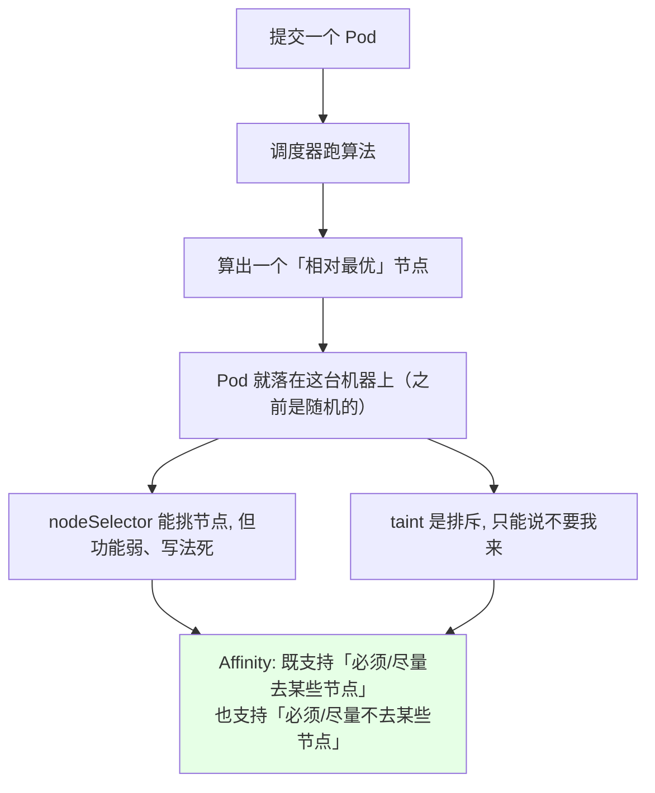
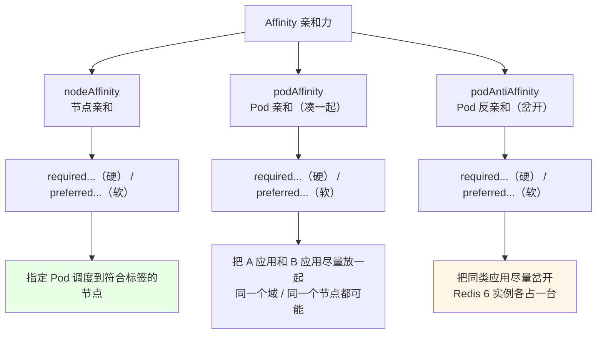
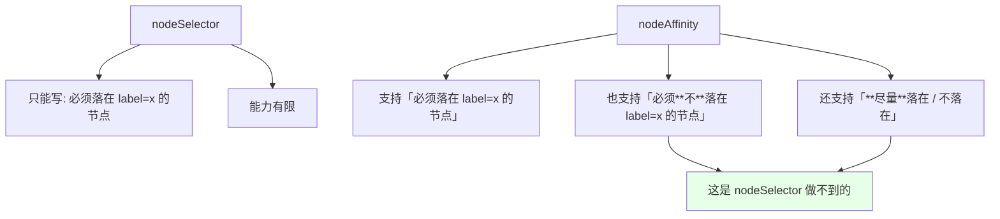
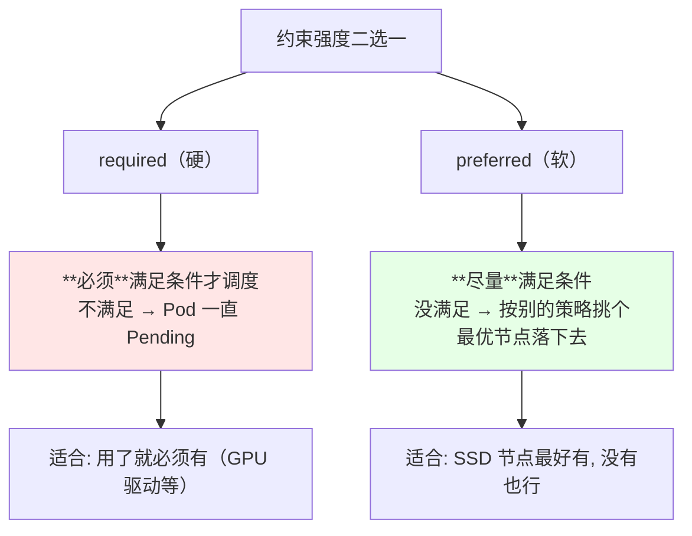
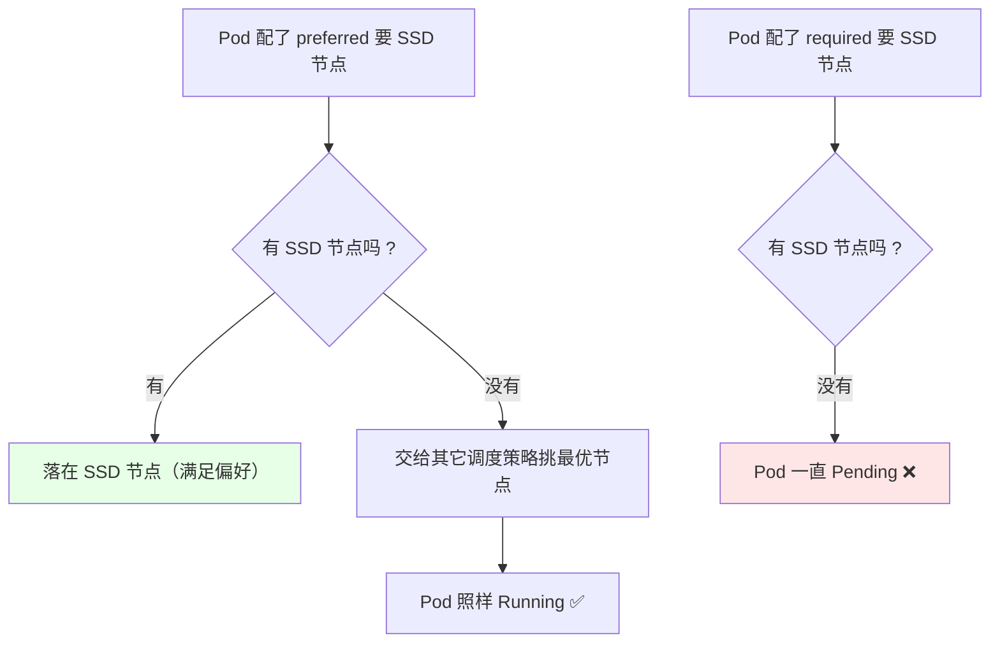
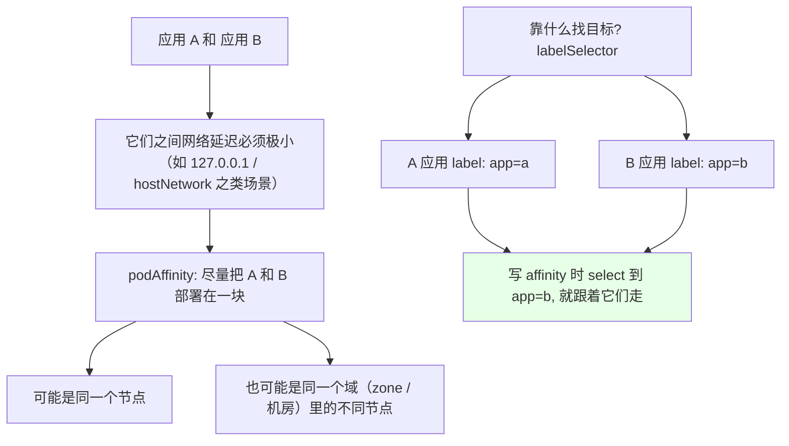
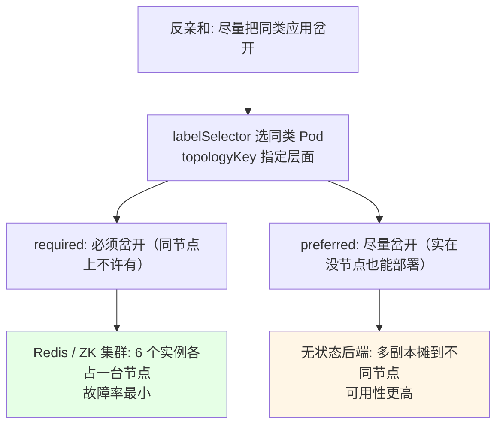
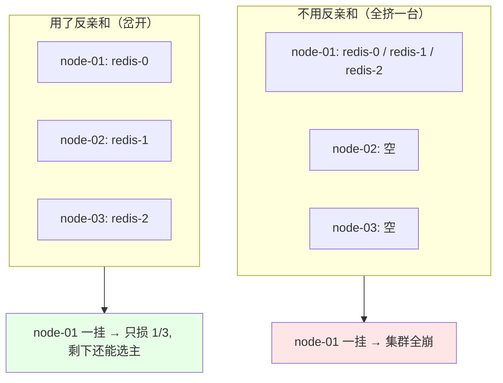
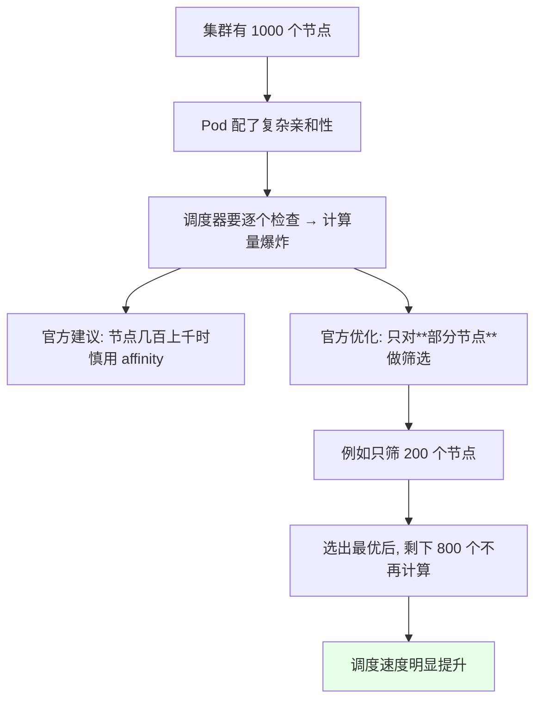

# Kubernetes 集群部署: Affinity 亲和力入门（三类亲和力与硬软两种约束的概念）

前面部署应用都是**随机调度** —— 调度器按算法算一个「相对最优」的节点就扔上去。`nodeSelector` 和「污点」虽然能干预，但不够强大也不够灵活。这一节讲的 **Affinity（亲和力）** 就是来补这个缺口的。

结论先摆：

1. **Affinity 分三类**：**nodeAffinity（节点亲和）**、**podAffinity（Pod 亲和，「尽量凑一起」）**、**podAntiAffinity（Pod 反亲和，「尽量岔开」）**；
2. **`nodeSelector` 迟早被 affinity 取代** —— affinity **包含了 nodeSelector 的全部功能**，而且更强；
3. **每一类又分「硬 / 软」两种**：`required...` 是**硬约束**（不满足就不调度），`preferred...` 是**软约束**（尽量满足，实在不行按别的策略挑个最优节点）；
4. **Pod 亲和/反亲和都用 `labelSelector` 选目标 Pod 的标签**来关联，靠的是「大家都打了 label」；
5. **反亲和用得比亲和多**：搭 Redis / ZK 集群时希望 6 个实例**分布在不同节点**上降低故障率；无状态后端多副本也最好摊开，可用性更高；
6. **注意性能**：节点规模到几百上千时，亲和性（尤其 Pod 反亲和）会让调度计算明显变长，官方给的优化思路是**只对部分节点做筛选**，选出候选就收工。

## 纲要

- 调度本来是随机的，需要更强的控制手段
- 三类亲和力全景
- nodeAffinity：取代 nodeSelector
- 硬约束 required 与软约束 preferred
- SSD 节点的 prefers 例子
- podAffinity：把两类应用凑一块
- podAntiAffinity：把同类应用岔开
- 反亲和的典型场景：Redis / ZK / 无状态后端
- 需要的节点筛选与性能
- 三类亲和力对比表

## 调度本来是随机的，需要更强的控制手段



```text
nodeSelector 的能力边界:

✅ 只能表达: 「我只在打了某标签的节点上跑」
❌ 表达不了: 「我尽量跑在……, 实在不行也行」
❌ 表达不了: 「不要跑在打了我这个标签的节点上」
❌ 表达不了: 「要跟某个 Pod 凑一块 / 岔开」
```

## 三类亲和力全景



| 类型 | 作用对象 | 一句话 | 典型场景 |
| --- | --- | --- | --- |
| **nodeAffinity** | 节点 | 挑符合标签的节点 | SSD / GPU 节点优先 |
| **podAffinity** | Pod（靠 label 找） | **尽量凑一块** | 网络延迟敏感的 A/B 服务 |
| **podAntiAffinity** | Pod（靠 label 找） | **尽量岔开** | Redis / ZK 集群、多副本高可用 |

## nodeAffinity：取代 nodeSelector



| 能力 | `nodeSelector` | `nodeAffinity` |
| --- | --- | --- |
| 必须落在某类节点 | ✅ | ✅ |
| **必须不落在**某类节点 | ❌ | ✅（required 支持） |
| 尽量落在某类节点 | ❌ | ✅（preferred） |
| 尽量不落在某类节点 | ❌ | ✅（preferred） |
| 会被逐步废弃吗 | **是的，会被取代** | 不会 |

## 硬约束 required 与软约束 preferred



### SSD 节点的 prefers 例子

课程里的例子很直观：

```text
场景: 有一个存储应用, 想跑在 SSD 节点上

配 required（硬）:
  SSD 节点全挂 / 全不满足 → 没有任何节点能落 → Pod 一直 Pending ❌

配 preferred（软）:
  SSD 节点都在 → 落 SSD 节点 ✅
  SSD 节点全挂了 → 自动落到其他「最优」节点上 ✅
```



## podAffinity：把两类应用凑一块



```yaml
spec:
  affinity:
    podAffinity:
      requiredDuringSchedulingIgnoredDuringExecution:
      - labelSelector:
          matchExpressions:
          - key: app
            operator: In
            values:
            - b
        topologyKey: kubernetes.io/hostname
```

**关键：`topologyKey` 决定「一起」的粒度**（同一个节点？同一个域？）。亲和性里的「凑一块」**可能是同一节点，也可能是同一域里的不同节点**，这一点要记清楚。

## podAntiAffinity：把同类应用岔开



## 反亲和的典型场景：Redis / ZK / 无状态后端

```text
课程里点明: 反亲和用得比亲和还多

场景一: Redis 集群 / ZK 集群
  起 6 个 Redis 实例组成集群
  → 最好的做法: 6 个实例分布在 6 台不同节点上
  → 一个节点挂了只影响 1/6, 故障率最小
  → 用 podAntiAffinity

场景二: 无状态后端（Deployment 多副本）
  起 3 个副本, 随便摊到哪台都行
  → 但最好摊开: 节点挂了不至于整个服务没了
  → 用 podAntiAffinity（preferred 即可）

场景三: 一个项目里的 A 应用 + B 应用
  有强依赖 / 低延迟 → 用 podAffinity 凑一块
```



## 需要的节点筛选与性能



| 规模 | 建议 |
| --- | --- |
| 几十台以内 | 放心用，亲和 / 反亲和都无所谓性能 |
| **几百 ~ 上千台** | **谨慎用**，调度耗时会变长 |
| 大规模 + 必须要用 | 缩小候选集（只筛部分节点），别让调度器全量计算 |

课程里那句判断很实在：**k8s 官方建议节点数超过一千（或好几百）就不建议用 affinity 了**，因为它要经过一系列计算才能把 Pod 放到「合适的节点」上。

## 三类亲和力对比表

| 维度 | nodeAffinity | podAffinity | podAntiAffinity |
| --- | --- | --- | --- |
| 作用对象 | **节点**（看节点 label） | **Pod**（看 Pod 的 label） | **Pod**（看 Pod 的 label） |
| 目标 | 落 / 不落某些节点 | 跟某类 Pod 凑一起 | 跟某类 Pod 岔开 |
| 匹配依据 | 节点 label | `labelSelector` | `labelSelector` |
| 范围控制 | 节点本身 | `topologyKey`（节点 / 域） | `topologyKey`（节点 / 域） |
| 硬约束 | `requiredDuringSchedulingIgnoredDuringExecution` | 同左 | 同左 |
| 软约束 | `preferredDuringSchedulingIgnoredDuringExecution` | 同左 | 同左 |
| 用得多吗 | 中 | 少 | **多**（Redis / ZK / 多副本） |

> 名字虽然长（比如 `requiredDuringSchedulingIgnoredDuringExecution`），**别被名字吓到** —— 拆开就是「**硬要求 + 调度期生效 + 执行期忽略**」：调度时才卡，已经上去的 Pod 不会因为节点标签后来变了就被赶走。

## API 速览

| 能力 | 做法 | 关键点 |
| --- | --- | --- |
| 节点硬亲和 | `spec.affinity.nodeAffinity.requiredDuringSchedulingIgnoredDuringExecution` | 不满足 → Pending |
| 节点软亲和 | `spec.affinity.nodeAffinity.preferredDuringSchedulingIgnoredDuringExecution` | 尽量满足 |
| Pod 亲和 | `spec.affinity.podAffinity...` | 凑一起 |
| Pod 反亲和 | `spec.affinity.podAntiAffinity...` | 岔开，用得最多 |
| 选目标 Pod | `labelSelector.matchLabels` / `matchExpressions` | 按标签找 |
| 定粒度 | `topologyKey`（如 `kubernetes.io/hostname`） | 同节点还是同域 |
| 看节点标签 | `kubectl get node --show-labels` | 亲和条件都靠它 |
| 看 Pod 标签 | `kubectl get pod --show-labels` | 反亲和靠它匹配 |
| 看调度失败原因 | `kubectl describe pod` 的 Events | 亲和规则不满足会点名 |
| 规模大时提速 | 缩小候选节点集合 | 官方给的优化方向 |

亲和力字段速查：

| 字段 | 含义 |
| --- | --- |
| `spec.affinity.nodeAffinity` | 节点亲和（替代 nodeSelector） |
| `spec.affinity.podAffinity` | Pod 亲和（凑一起） |
| `spec.affinity.podAntiAffinity` | Pod 反亲和（岔开） |
| `requiredDuringSchedulingIgnoredDuringExecution` | **硬**约束，调度期必须满足 |
| `preferredDuringSchedulingIgnoredDuringExecution` | **软**约束，权重 + 尽量满足 |
| `labelSelector` | 用标签选中目标节点 / 目标 Pod |
| `topologyKey` | 「一起 / 岔开」判定在哪个层面（主机 / 域） |

## Demo 示例

```bash
# 1. 先看节点上有哪些标签可供亲和条件用
kubectl get node --show-labels

# 2. 给节点打个标签（模拟 SSD / GPU 节点）
kubectl label node k8s-node02 disk=ssd

# 3. 一个带节点软亲和的 Pod（没有 SSD 节点也能起来）
kubectl apply -f pod-affinity.yaml
kubectl get pod -o wide

# 4. 一个带反亲和的 Deployment（3 副本岔开到不同节点）
kubectl apply -f redis-anti-affinity.yaml
kubectl get pods -o wide
# NODE 列应该看到三个不同的节点

# 5. 看调度事件
POD=storage
kubectl describe pod "$POD"
kubectl get pods --show-labels
```

```yaml
# pod-affinity.yaml —— 节点软亲和（尽量上 SSD 节点）
apiVersion: v1
kind: Pod
metadata:
  name: storage
spec:
  affinity:
    nodeAffinity:
      preferredDuringSchedulingIgnoredDuringExecution:
      - weight: 1
        preference:
          matchExpressions:
          - key: disk
            operator: In
            values:
            - ssd
  containers:
  - name: app
    image: busybox:1.32
    imagePullPolicy: IfNotPresent
    command: ["sleep", "3600"]
```

```yaml
# redis-anti-affinity.yaml —— 反亲和（同类 Pod 岔开）
apiVersion: apps/v1
kind: Deployment
metadata:
  name: redis
  labels:
    app: redis
spec:
  replicas: 3
  selector:
    matchLabels:
      app: redis
  template:
    metadata:
      labels:
        app: redis
    spec:
      affinity:
        podAntiAffinity:
          preferredDuringSchedulingIgnoredDuringExecution:
          - weight: 100
            podAffinityTerm:
              labelSelector:
                matchExpressions:
                - key: app
                  operator: In
                  values:
                  - redis
              topologyKey: kubernetes.io/hostname
      containers:
      - name: redis
        image: redis:6.0
        imagePullPolicy: IfNotPresent
```

```text
反亲和生效前后的对比（3 副本 Deployment）:

未配置反亲和（可能挤在一起）
└── node-01  redis-0 / redis-1 / redis-2   ← 挂一台全崩

配置了 preferred 反亲和
├── node-01  redis-0
├── node-02  redis-1
└── node-03  redis-2   ← 挂一台只损 1/3
```

### 总结

- **Affinity 是 nodeSelector 的加强替代**（nodeSelector 迟早被它取代），它**既支持「必须/尽量落在符合条件的节点」也支持「必须/尽量不落在」**，还能表达「跟某类 Pod 凑一起 / 岔开」；
- **三类亲和力**：`nodeAffinity`（看节点标签，挑节点）、`podAffinity`（**凑一起**，给低延迟强依赖的 A/B 应用用）、`podAntiAffinity`（**岔开**，把同类应用分布到不同节点）；
- **每类都有硬软两种**：`required...` 是**硬的**（不满足就 Pending，适合「用了就必须有」），`preferred...` 是**软的**（尽量满足，实在没有就按其他策略挑最优节点落下去，适合「有 SSD 最好，没有也行」）；
- **Pod 亲和/反亲和靠 `labelSelector` 选目标 Pod 的标签**，再靠 `topologyKey` 决定「凑 / 岔」的粒度是**同一个节点**还是**同一个域里的不同节点**；
- **反亲和用得比亲和多**：Redis / ZK 集群的 6 个实例分布到 6 台机器（挂一台只损 1/6），无状态后端多副本也最好摊开（可用率更高）；
- **名字长不可怕**：`requiredDuringSchedulingIgnoredDuringExecution` 就是「调度期硬性要求 + 执行期忽略（节点标签后来变了不赶人）」；**节点规模到几百上千时要慎用亲和性**，官方给的提速办法是只对部分节点做筛选，选出候选就收工。

