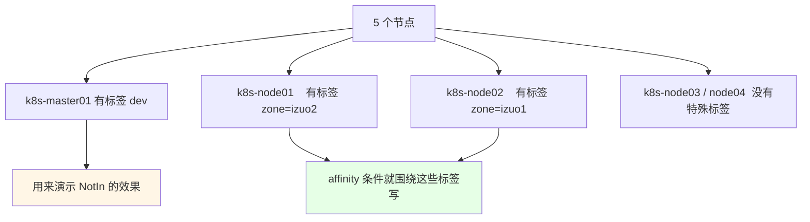
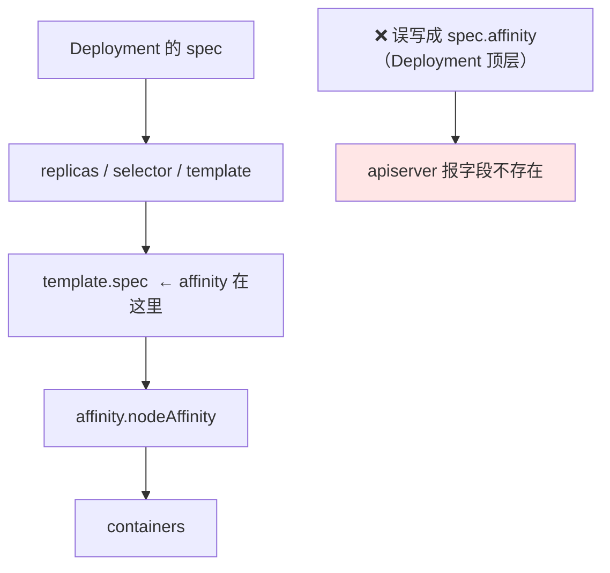
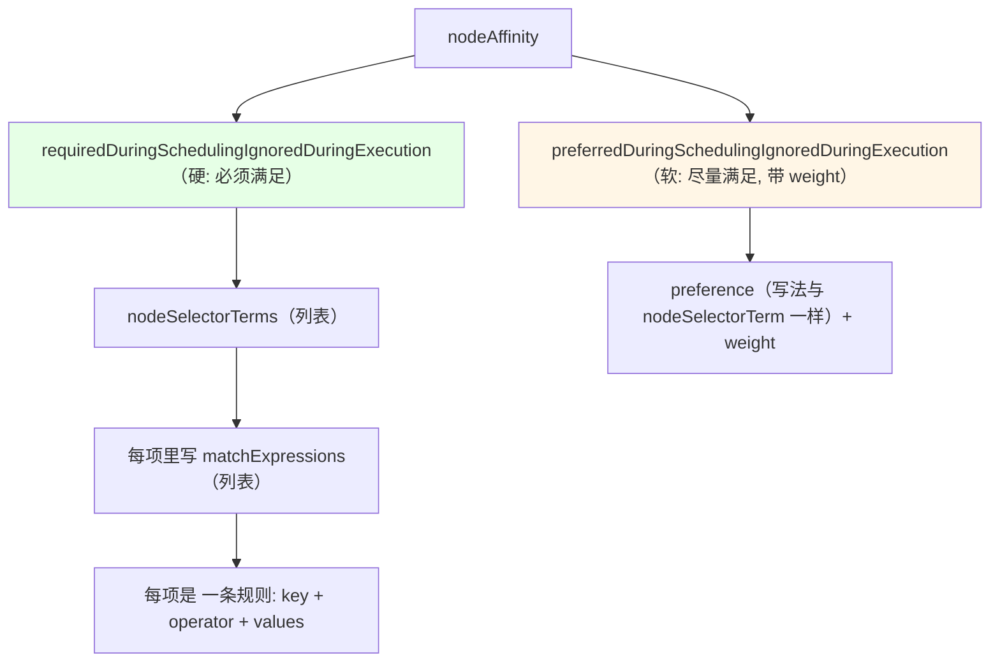
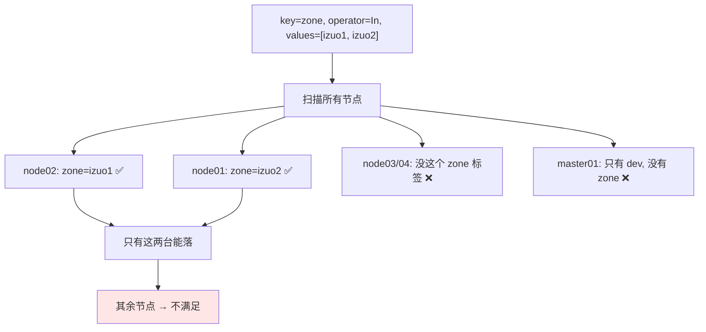
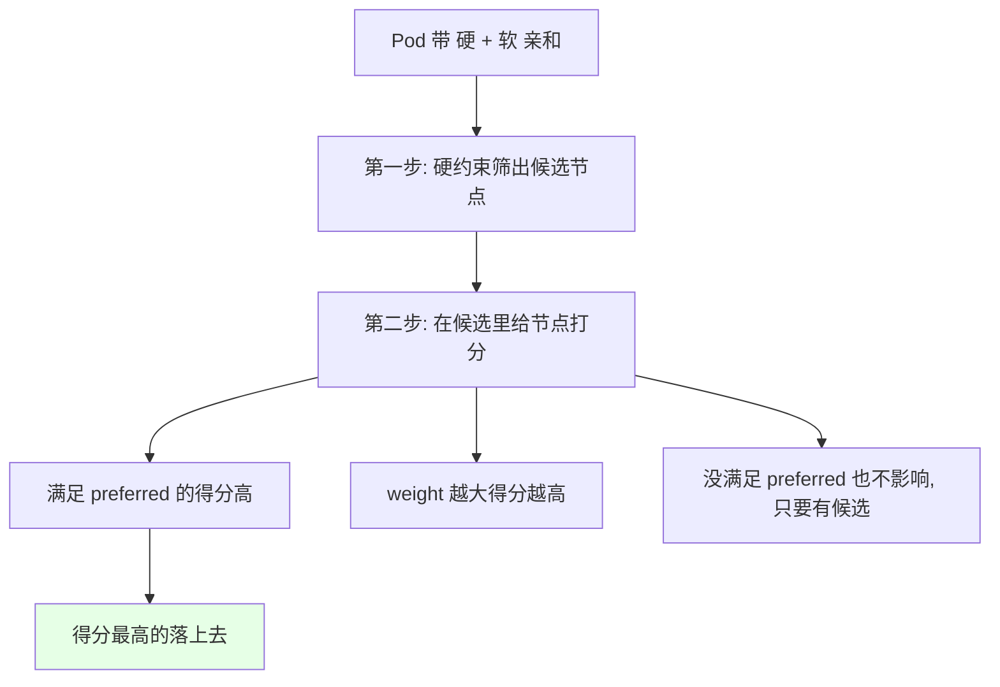
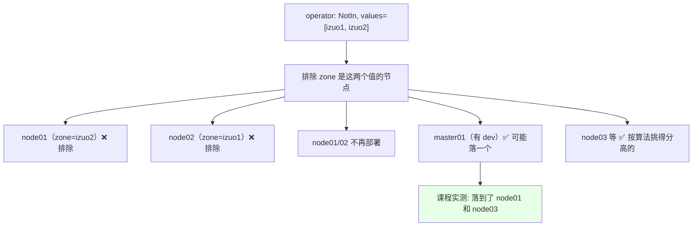
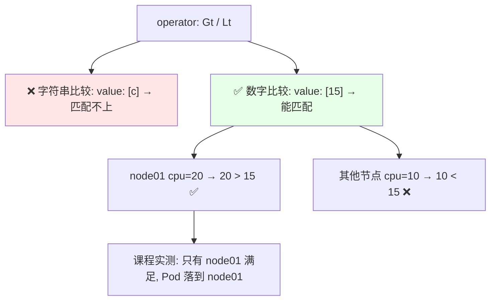
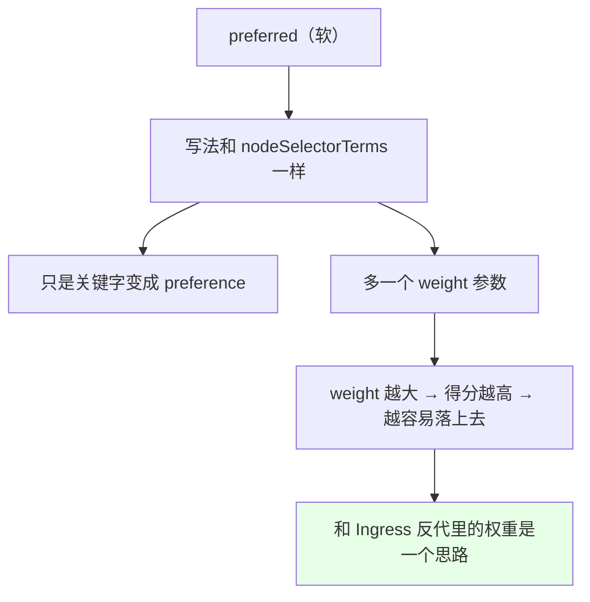

# Kubernetes 集群部署: NodeAffinity 使用（节点亲和字段写法逐条实测）

上一节讲的是亲和力的**概念**（三类 + 硬软两种），这一节动手把 **nodeAffinity** 真正写出来跑一遍。字段实在太多，课程里连官网页面都打不开只能照抄模板 —— 但抄完要明白每一行为什么这么写。

结论先摆：

1. **`affinity` 写在 `spec.template.spec` 里（Pod 的 spec 下）**，不是 Deployment 的 `spec` 顶层；写成 `spec.affinity` 会报错 —— 课程里就是在这儿翻车重来的；
2. **`required` 与 `preferred` 的写法几乎一样**，唯一区别是 preferred 多一个 **`weight`（权重）**，权重越大得分越高、越容易落上去；
3. **`operator` 六种**：`In` / `NotIn`（value 要写，是个**切片**）、`Exists` / `DoesNotExist`（**不用写 value**）、`Gt` / `Lt`（**只能比数字**，字符串比较实测不生效）；
4. **多条 `nodeSelectorTerms` 之间是「或」关系，同一条里的多个 `matchExpressions` 是「与」关系**；
5. **硬约束（`required`）是「先过筛再打分」**：先必须落在满足条件的节点上，再尽满量去满足 preferred；标签删掉就 `Pending`；**软约束找不到也会落到别的节点**；
6. **`NotIn` / `Exists` 实测**：`NotIn` 会让 Pod 落到「没有该标签」的节点；`Exists` 只看 key 不看 value，标签一删立刻 `Pending`。

## 纲要

- 先给节点打标签
- affinity 的正确位置（附踩坑）
- required 的字段骨架
- In：必须落在满足条件的节点上
- 硬 + 软的组合：「先过筛，再打分」
- NotIn：反过来「不要落在……」
- Exists / DoesNotExist：只看 key 不看 value
- Gt / Lt：只支持数字比较（踩坑）
- preferred 与 weight
- operator 速查与常见排错

## 先给节点打标签

```bash
# 看现有节点和标签（大部分是内置的）
kubectl get node
kubectl get node --show-labels

# 课程环境一共 5 个节点，自己手动打几个业务标签
kubectl label node k8s-node02 zone=izuo1
kubectl label node k8s-node01 zone=izuo2
kubectl label node k8s-master01 dev
kubectl get node --show-labels
```



## affinity 的正确位置（附踩坑）



```yaml
apiVersion: apps/v1
kind: Deployment
metadata:
  name: demo
spec:
  replicas: 2
  selector:
    matchLabels:
      app: demo
  template:
    metadata:
      labels:
        app: demo
    spec:
      affinity:          ← 注意: 在 Pod 模板的 spec 下
        nodeAffinity:
          requiredDuringSchedulingIgnoredDuringExecution:
            nodeSelectorTerms:
            - matchExpressions:
              - key: zone
                operator: In
                values:
                - izuo1
                - izuo2
      containers:
      - name: demo
        image: busybox:1.32
        imagePullPolicy: IfNotPresent
        command: ["sleep", "3600"]
```

```text
yaml 层级（写错了编辑器里对齐就露馅）:

Deployment.spec
├── replicas / selector        ← 控制器级
└── template.spec              ← Pod 级
    ├── affinity               ← 亲和性在这儿
    │   └── nodeAffinity
    │       └── requiredDuringSchedulingIgnoredDuringExecution
    │           └── nodeSelectorTerms
    │               └── matchExpressions
    │                   ├── key
    │                   ├── operator
    │                   └── values
    └── containers             ← 与 affinity 平级, 要对齐
```

课程里踩的坑：一开始把 `affinity` 写到 `spec` 顶层了（还误以为是 Deployment），保存报字段不存在，**只能在 `template.spec` 下改，containers 要和 affinity 对齐**。

## required 的字段骨架



| 层级 | 关键字 | 关系 |
| --- | --- | --- |
| 最外层 | `nodeAffinity` | — |
| 强度 | `required...` / `preferred...` | 硬 / 软 |
| 硬 | `nodeSelectorTerms`（数组） | **之间是「或」** |
| 条件 | `matchExpressions`（数组） | **之间是「与」** |
| 单条件 | `key` + `operator` + `values` | — |

## In：必须落在满足条件的节点上

```yaml
      affinity:
        nodeAffinity:
          requiredDuringSchedulingIgnoredDuringExecution:
            nodeSelectorTerms:
            - matchExpressions:
              - key: zone
                operator: In
                values:
                - izuo1
                - izuo2
```



**`values` 是个切片**：写了两个值，意思就是「**落在 izuo1 或 izuo2 上都行**」，匹配到任意一个就满足 —— 因为一个标签可能对应多台节点，所以「满足多个条件里的任意一个节点」即可。

## 硬 + 软的组合：「先过筛，再打分」

```yaml
      affinity:
        nodeAffinity:
          requiredDuringSchedulingIgnoredDuringExecution:
            nodeSelectorTerms:
            - matchExpressions:
              - key: zone
                operator: In
                values: [izuo1, izuo2]
          preferredDuringSchedulingIgnoredDuringExecution:
          - weight: 1
            preference:
              matchExpressions:
              - key: dev
                operator: In
                values: [yes]
```

```text
课程实测（两条条件同时写）:

硬性:  必须落在 zone=izuo1 或 izuo2 的节点上
软性:  在此基础之上, 尽量再满足「有 dev 标签的节点」

实验结果: Pod 还是落在 node01 和 node02 上

结论: 两条规则是「合作 / 叠加」关系, 不是二选一
      → 先满足硬的(筛出 node01/node02)
      → 再在候选里尽量满足软的(哪个得分高落哪个)
      → 如果某些节点还有别的软条件(preferred), 优先满足权重高的
```



如果**只配了 preferred 而节点标签全被删掉**，Pod **照样能起**（落到其他最优节点）；而 **required 找不到匹配节点就直接 `Pending`** —— 这是两者最本质的区别。

## NotIn：反过来「不要落在……」

```yaml
            nodeSelectorTerms:
            - matchExpressions:
              - key: zone
                operator: NotIn
                values: [izuo1, izuo2]
```



用 `required` + `NotIn` 的效果就是：**不在这些节点上部署**（nodeSelector 做不到这件事），符合条件的节点里再按分数选。

## Exists / DoesNotExist：只看 key 不写 value

```yaml
            nodeSelectorTerms:
            - matchExpressions:
              - key: zone
                operator: Exists
```

```text
Exists 的特点（课程实测）:

条件: 只要节点上有 zone 这个 key 就行, value 是啥无所谓
   ├── node01: zone=izuo2  ✅
   ├── node02: zone=izuo1  ✅
   └── master01 / node03: 没这个 key ❌

实测结果: Pod 落在 node01 和 node02（正好只有这两台有 zone key）


DoesNotExist: 反过来 —— 只要没有这个 key 就匹配
```

写 `Exists` 时 **`values` 不用写**（写了也忽略）。课程里把那两个 label 删掉后再来一次，硬约束下**一个新 `Pending`、一个匹配不到** —— 再次证明 **required 是强一致性的，节点标签一变就没地方落了**；换成 preferred 则完全不影响。

## Gt / Lt：只支持数字比较（踩坑）

```yaml
            matchExpressions:
            - key: cpu
              operator: Gt
              values: ["15"]
```



课程里试了半天才确认：**`Gt` / `Lt` 对字母不支持**（以为能比字符串，实际匹配不上），**只有数字能比较**。所以这俩 operator 用得很少，一般用 `In` / `Exists`。

## preferred 与 weight

```yaml
      affinity:
        nodeAffinity:
          preferredDuringSchedulingIgnoredDuringExecution:
          - weight: 100
            preference:
              matchExpressions:
              - key: zone
                operator: In
                values: [izuo1]
          - weight: 10
            preference:
              matchExpressions:
              - key: dev
                operator: Exists
```



| 对比 | `required` | `preferred` |
| --- | --- | --- |
| 关键字 | `requiredDuringSchedulingIgnoredDuringExecution` | `preferredDuringSchedulingIgnoredDuringExecution` |
| 匹配体 | `nodeSelectorTerms` | `preference` |
| 有 `weight` 吗 | 无 | **有** |
| 找不到匹配 | **Pending** | 照样落到别的节点 |
| 节点标签后来变了 | `IgnoredDuringExecution`，已上去的 Pod 不赶 | 同左 |

## operator 速查

| operator | `values` 要不要写 | 含义 | 实测 |
| --- | --- | --- | --- |
| `In` | **要**（切片） | key 的值在这些 value 里 | 落 node01 / node02 |
| `NotIn` | **要**（切片） | key 的值**不**在这些 value 里 | 落 node01 / node03（避开 izuo1/2） |
| `Exists` | **不用写** | 节点上有这个 key 就匹配（不看 value） | 落有 zone 的节点 |
| `DoesNotExist` | 不用写 | 节点上**没有**这个 key 才匹配 | 落在没 zone 的节点 |
| `Gt` | 要（数字） | 值 **大于** 指定值 | 只有 node01（cpu=20 > 15） |
| `Lt` | 要（数字） | 值 **小于** 指定值 | 同数字比较 |

## 常见排错

| 现象 | 原因 | 处理 |
| --- | --- | --- |
| 保存清单报字段不存在 | `affinity` 写到了 Deployment 的 `spec` 顶层 | **挪到 `spec.template.spec` 下**，和 containers 对齐 |
| Pod 一直 `Pending` | `required` 找不到匹配节点（标签没打 / 被删） | `describe pod` 看 Events，`kubectl label node` 补标签 |
| 想「尽量」而不是「必须」 | 用了 `required` | 换成 `preferred`，并给 `weight` |
| `Gt` / `Lt` 一直匹配不上 | 拿字符串去比了 | **改用数字**做 value |
| `Exists` 却没匹配上 | 节点上根本没这个 key | 先 `kubectl label node` 打标签 |
| 两条条件互相抵消，落点不直观 | 硬 + 软叠加的得分逻辑 | 记住「先过筛、再打分」，用 `describe pod` 看具体提示 |
| yaml 缩进对不上导致报错 | `containers` 与 `affinity` 没对齐 | 编辑器里对着 `template.spec` 层级重排 |

## API 速览

| 能力 | 做法 | 关键点 |
| --- | --- | --- |
| 打节点标签 | `kubectl label node <节点> <key>=<value>` | 亲和条件全靠它 |
| 删节点标签 | `kubectl label node <节点> <key>-` | 硬约束下会直接 Pending |
| 看标签 | `kubectl get node --show-labels` | — |
| 写硬约束 | `nodeAffinity.requiredDuringSchedulingIgnoredDuringExecution.nodeSelectorTerms` | 找不到 → Pending |
| 写软约束 | `nodeAffinity.preferredDuringSchedulingIgnoredDuringExecution[].weight + preference` | 带权重，找不到也能落 |
| 位置 | `spec.template.spec.affinity` | **不要写到 Deployment spec 顶层** |
| 或关系 | 多条 `nodeSelectorTerms` | 满足任意一条 |
| 与关系 | 同一条里的多个 `matchExpressions` | 全部满足 |
| 排除法 | `operator: NotIn` | nodeSelector 做不到 |
| 看失败原因 | `kubectl describe pod` 的 Events | 会点名是哪个条件没满足 |

## Demo 示例

```bash
# 1. 打标签
kubectl label node k8s-node02 zone=izuo1
kubectl label node k8s-node01 zone=izuo2
kubectl label node k8s-master01 dev
kubectl get node --show-labels

# 2. required + In: 只落 izuo1 / izuo2 的节点
kubectl apply -f affinity-required.yaml
kubectl get pods -o wide

# 3. 硬 + 软叠加: 先过筛再打分
kubectl apply -f affinity-required-preferred.yaml
kubectl get pods -o wide

# 4. NotIn: 避开 izuo1 / izuo2
kubectl apply -f affinity-notin.yaml
kubectl get pods -o wide

# 5. Exists: 只看 key, value 不写
kubectl apply -f affinity-exists.yaml
kubectl get pods -o wide

# 6. 删掉标签, 观察硬约束 Pending
kubectl label node k8s-node01 zone-
kubectl label node k8s-node02 zone-
kubectl get pod
POD=demo-xxx
kubectl describe pod "$POD"

# 7. 清理
kubectl delete -f affinity-required-preferred.yaml
```

```text
逐个 operator 的落点实测记录:

条件                                  落点
─────────────────────────────────────────────
key=zone, In, [izuo1, izuo2]          node01 + node02
  + preferred(dev exists)             还是 node01 + node02（先过筛再打分）
key=zone, NotIn, [izuo1, izuo2]       node01 + node03（避开这两台）
key=zone, Exists                       node01 + node02（只有这两台有 zone key）
key=zone, In, 把两台的 zone 删掉      Pending（硬约束强一致）
key=zone, In, 换成 preferred（软）    照常落别的节点, 不影响
key=cpu, Gt, ["15"]                   只有 node01（cpu=20 > 15）
key=cpu, Gt, ["c"]                    匹配不上（字符串不支持比较）
```

### 总结

- **`affinity` 必须写在 `spec.template.spec`（Pod 的 spec）下**，和 `containers` 平级；写成 Deployment 的 `spec.affinity` 会直接报字段不存在 —— 课程里就是在这儿翻车重敲的；
- **`required` 与 `preferred` 结构几乎一模一样**，区别只在关键字（`nodeSelectorTerms` vs `preference`）和 **preferred 多一个 `weight`（权重越大得分越高、越容易落）**；**required 找不到节点就 Pending，preferred 找不到照样落在别的节点**；
- **`operator` 六种要分清**：`In` / `NotIn` 的 `values` 是**切片**（满足任一即可，`In` 落 node01+node02，`NotIn` 落 node01+node03），`Exists` / `DoesNotExist` **不用写 value**（`Exists` 只认 key 不认值），`Gt` / `Lt` **只支持数字比较**（课程实测拿字符串去比匹配不上）；
- **多条 `nodeSelectorTerms` 是「或」、同一条里多个 `matchExpressions` 是「与」**；硬 + 软同时写是**叠加关系**：先满足硬约束筛出候选，再在候选里按 `weight` / 其他策略打分成最优；
- **`NotIn` 和 `Exists` 是 nodeSelector 做不到的能力**（「不要落在某类节点上」「只要求有这个 key」），这是 affinity 取代 nodeSelector 的核心原因；
- **节点标签一删，硬约束立刻 `Pending`**（`kubectl describe pod` 的 Events 会点名条件），而 preferred 完全不受影响 —— 生产上「能不硬就别硬」，除非这个资源确实非它不可。

