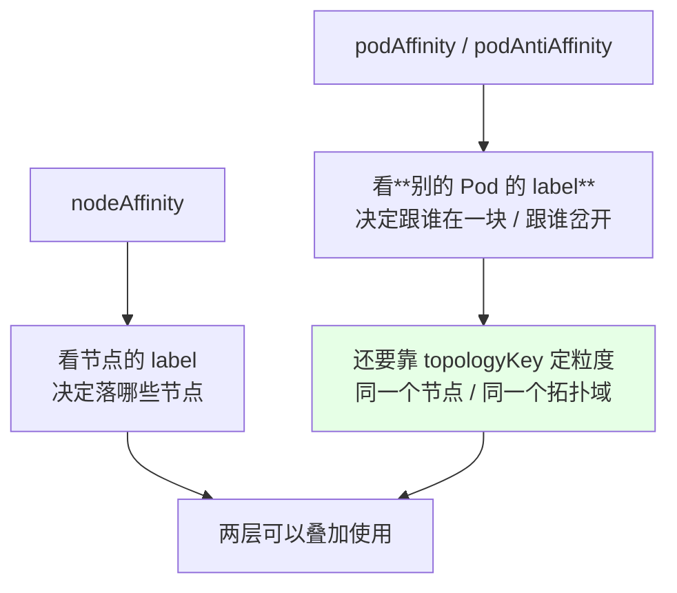
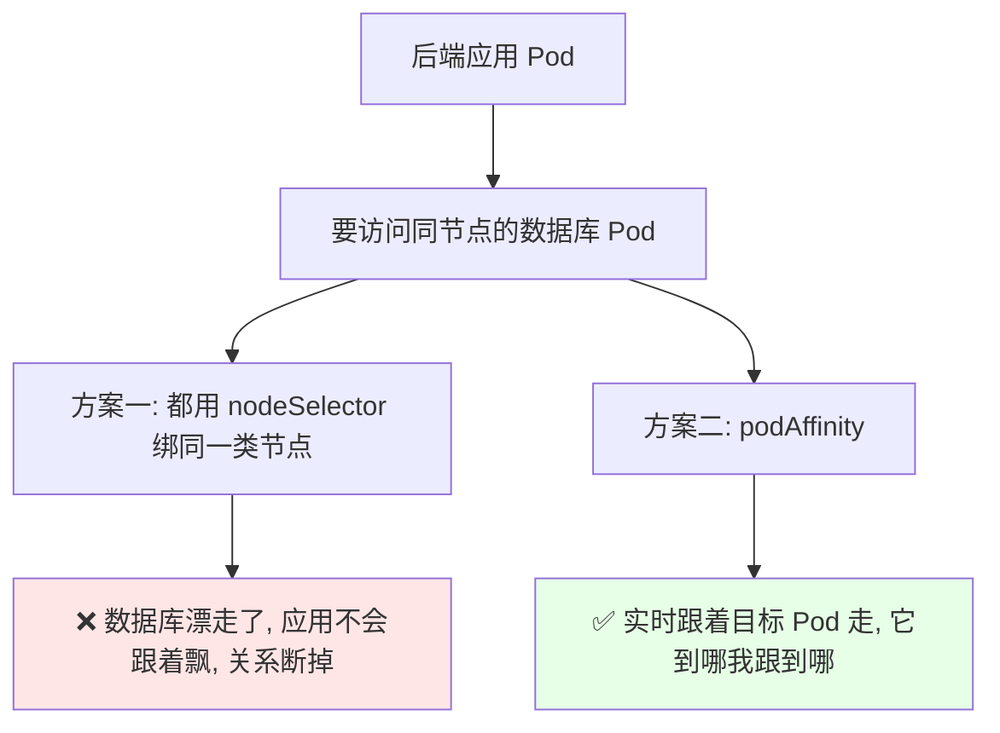
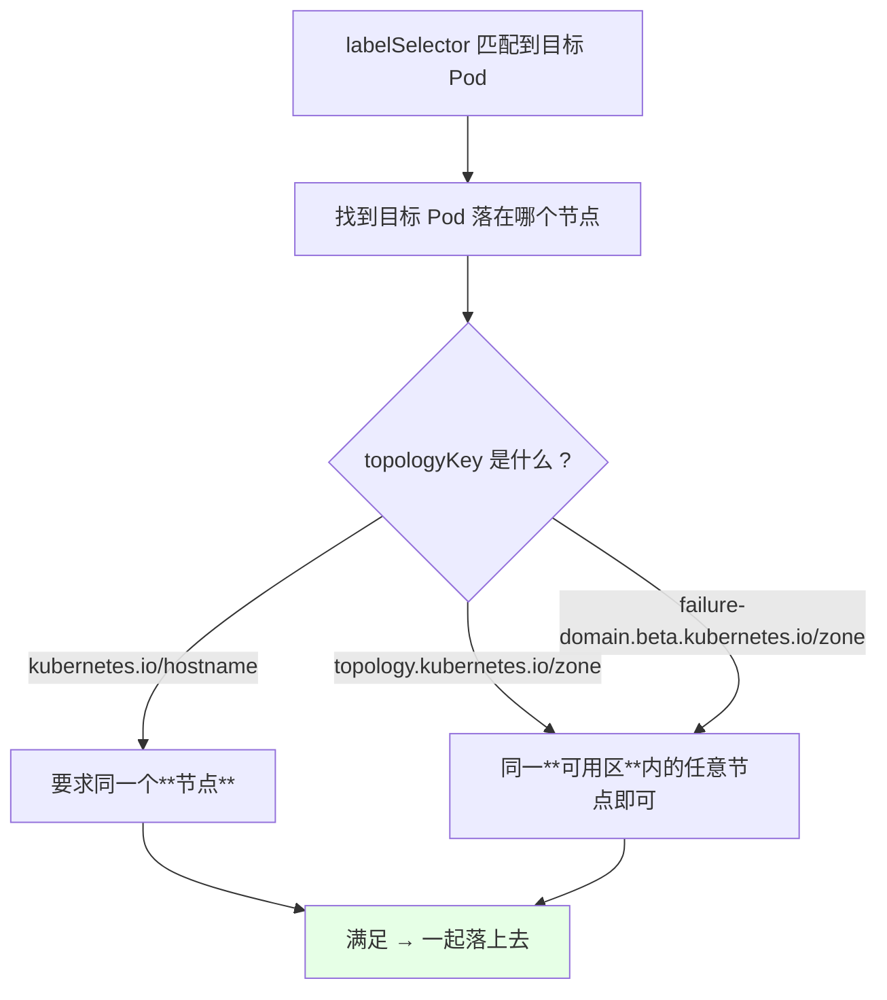
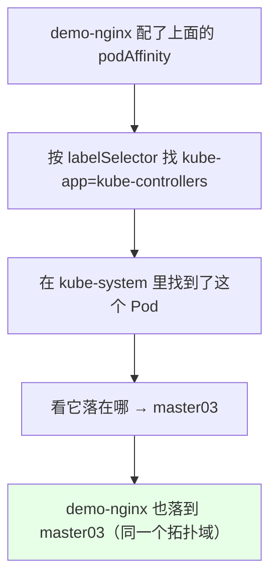
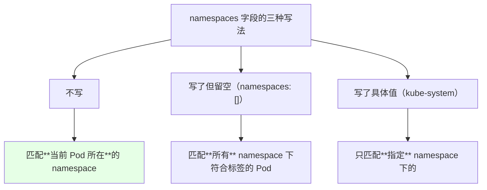
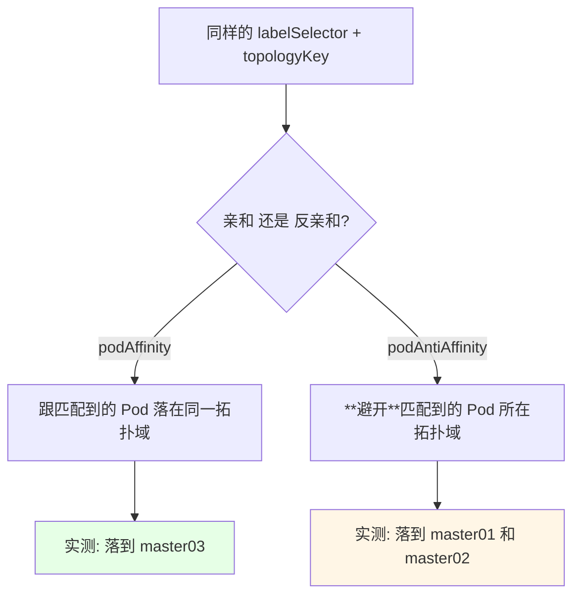
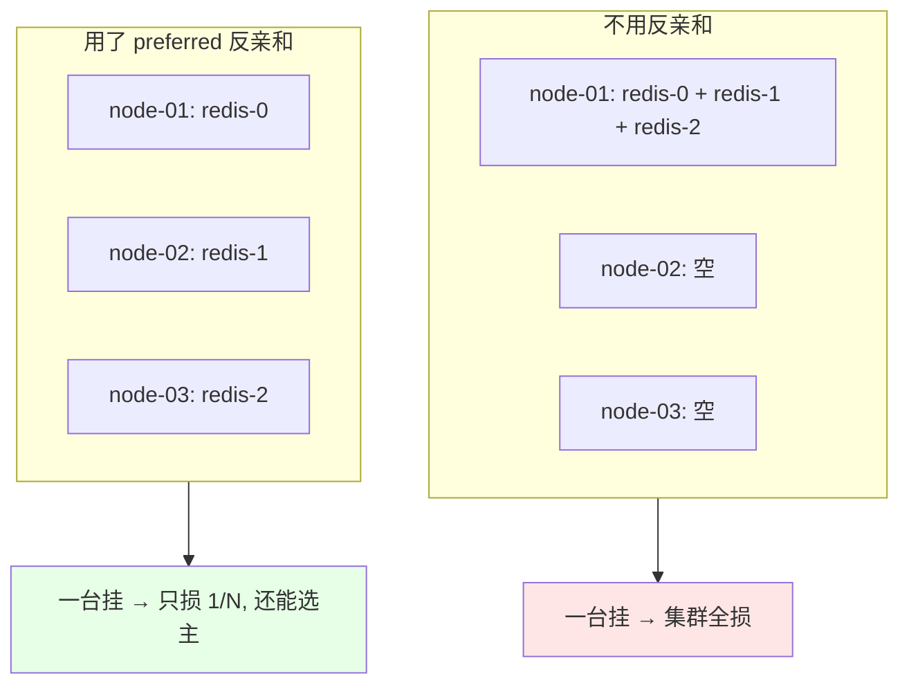
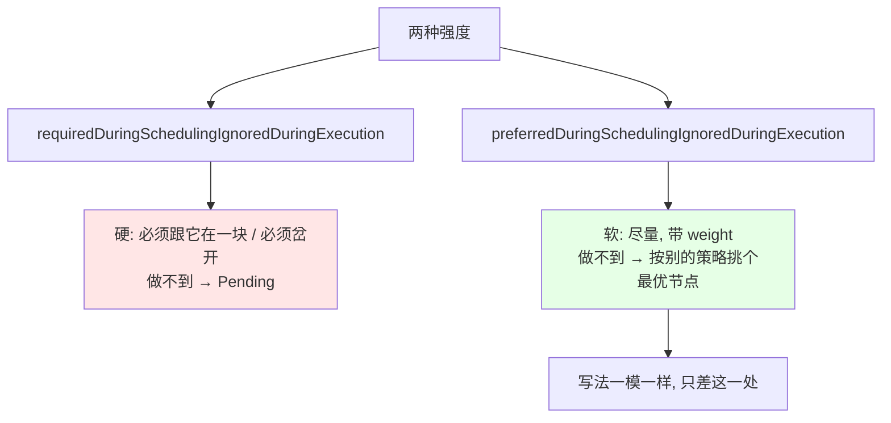
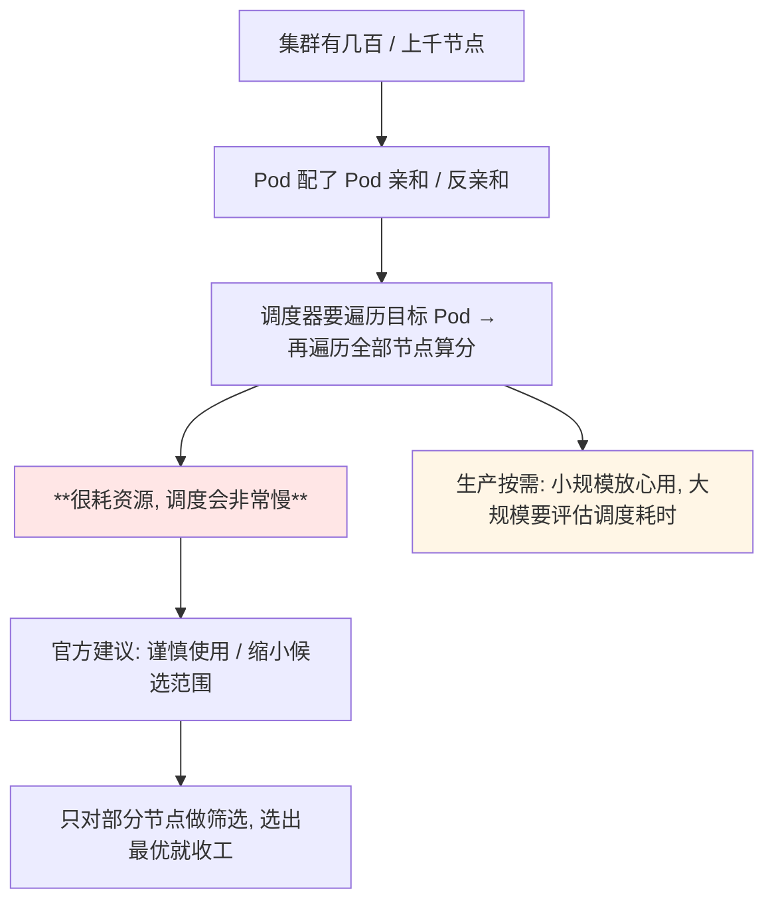

# Kubernetes 集群部署: Pod 亲和与反亲和（跨容器关联的写法、拓扑域与命名空间匹配）

上节把 **nodeAffinity（节点亲和）** 讲完了 —— 它解决的是「Pod 该落在**哪些节点**」。这一节的 **podAffinity / podAntiAffinity** 解决的是更细的一层：「**我的 Pod 该跟哪几个 Pod 在一块 / 该避开哪几个 Pod**」。

结论先摆：

1. **podAffinity 把我的 Pod 和「指定标签的那些 Pod」尽量部署在同一拓扑域**；**podAntiAffinity 反过来，尽量岔开**；
2. **为什么不用 nodeSelector 凑一块**：数据库靠 nodeSelector 绑了节点后，**数据库一旦漂移，应用不会跟着一起过去**；而 Pod 亲和是**实时跟着目标 Pod 走**；
3. **四个关键字段**：`labelSelector`（选谁）、`topologyKey`（同节点还是同域）、`namespaces`（在哪些 namespace 里找）、required / preferred（硬软）；
4. **`namespaces` 三种写法**：写了但**留空** = 匹配所有 namespace；写了具体值 = 只匹配那个 namespace；**不写 = 匹配当前 Pod 所在的 namespace**；
5. **反亲和用得比亲和多**：Redis / ZK / RabbitMQ 集群希望各副本分布在**不同节点**，同业务多副本也要岔开，可用性才高；
6. **节点几百上千就慎用**，这套算法很耗资源，调度会明显变慢。

## 纲要

- 从节点亲和到 Pod 亲和：多了一层关联
- 场景：应用要跟数据库凑一块
- podAffinity 的字段结构
- 实战：跟 kube-system 里的 Pod 凑一起
- namespaces 的三种写法
- podAntiAffinity：反过来用
- 反亲和的主战场：Redis / ZK / MQ 集群
- 硬 required 与软 preferred
- 拓扑域与性能提醒

## 从节点亲和到 Pod 亲和：多了一层关联



| 对比 | nodeAffinity | podAffinity / podAntiAffinity |
| --- | --- | --- |
| 参照物 | **节点**标签 | **Pod** 标签 |
| 目标 | 落在 / 不落在某些节点 | 跟某类 Pod 一起 / 岔开 |
| 额外字段 | — | **`topologyKey` + `namespaces`** |
| 目标会不会动 | 节点不变 | **目标 Pod 漂移它会跟着走** |

## 场景：应用要跟数据库凑一块



课程里的例子：想让 `demo-nginx` 跟集群里的 `busybox` 部署在一块 —— busybox 上打了标签 `region=beijing`，那就按这个标签把两者绑起来。

## podAffinity 的字段结构

```yaml
apiVersion: v1
kind: Pod
metadata:
  name: demo-nginx
  labels:
    app: demo-nginx
spec:
  affinity:
    podAffinity:
      requiredDuringSchedulingIgnoredDuringExecution:
      - labelSelector:
          matchExpressions:
          - key: region
            operator: In
            values:
            - beijing
        topologyKey: kubernetes.io/hostname
        namespaces: []
  containers:
  - name: nginx
    image: nginx:1.15.2
```

```text
podAffinity 的结构（一层套一层）:

spec.affinity.podAffinity
└── requiredDuringSchedulingIgnoredDuringExecution   ← 硬
    └── []                                           ← 列表
        ├── labelSelector                            ← 选哪些目标 Pod（按 label）
        │   └── matchExpressions / matchLabels
        ├── namespaces                               ← 去哪些 namespace 里找（可留空/不写）
        └── topologyKey                              ← 「在一块」的粒度
```



> 课程里也提醒：**「同一拓扑域」不一定是同一个节点**，同一个域里的不同节点也算 —— 这一层具体怎么用，后面拓扑域那节再细讲。

## 实战：跟 kube-system 里的 Pod 凑一起

```bash
# 先看看系统组件 Pod 在哪、标签是什么
kubectl get pods -n kube-system -o wide
# kube-controller-manager 之类跑在 master03 上
kubectl get pod --show-labels -n kube-system
```

```yaml
      affinity:
        podAffinity:
          requiredDuringSchedulingIgnoredDuringExecution:
          - labelSelector:
              matchExpressions:
              - key: kube-app
                operator: In
                values:
                - kube-controllers
            topologyKey: kubernetes.io/hostname
            namespaces:
            - kube-system
```



```text
课程实测:

kube-controller-manager 这个 Pod 落在 master03 上
   demo-nginx 配了 podAffinity 指向 kube-system 下
   kube-app=kube-controllers 的 Pod
   → demo-nginx 也被调度到了 master03

说明: 亲和是「跟着目标 Pod 走」, 目标在哪我上哪
```

## namespaces 的三种写法



| 写法 | 匹配范围 | 例子 |
| --- | --- | --- |
| **不写** | 当前 Pod 所在 namespace | 同业务多副本互相反亲和时最常用 |
| `namespaces: []`（留空） | **所有** namespace | 想跟任意 namespace 下的组件凑一起 |
| `namespaces: [kube-system]` | 只找 kube-system | 上面那个跟控制器管理器凑一起的例子 |

**亲和关系可以跨 namespace** —— 关键点就是靠 `namespaces` 控制「去哪儿找目标 Pod」。

## podAntiAffinity：反过来用

```yaml
      affinity:
        podAntiAffinity:
          requiredDuringSchedulingIgnoredDuringExecution:
          - labelSelector:
              matchExpressions:
              - key: kube-app
                operator: In
                values:
                - kube-controllers
            topologyKey: kubernetes.io/hostname
            namespaces:
            - kube-system
```



**写法几乎一模一样，只差一个关键字**（`podAffinity` → `podAntiAffinity`），但效果完全相反。

## 反亲和的主战场：Redis / ZK / MQ 集群

```yaml
apiVersion: apps/v1
kind: Deployment
metadata:
  name: demo-nginx
  labels:
    app: demo-nginx
spec:
  replicas: 2
  selector:
    matchLabels:
      app: demo-nginx
  template:
    metadata:
      labels:
        app: demo-nginx
    spec:
      affinity:
        podAntiAffinity:
          preferredDuringSchedulingIgnoredDuringExecution:
          - weight: 100
            podAffinityTerm:
              labelSelector:
                matchExpressions:
                - key: app
                  operator: In
                  values:
                  - demo-nginx
              topologyKey: kubernetes.io/hostname
      containers:
      - name: nginx
        image: nginx:1.15.2
```

```text
课程实测（两个副本）:

配置反亲和前:  可能两个副本都挤在同一台节点
配置反亲和后:  一个落 master01, 一个落 master02（两台不同节点）
```



课程里列的场景：

- **Redis 集群 / ZK 集群 / RabbitMQ 集群** —— 希望副本分散在不同节点，提高可用率；
- **同一类业务应用的多副本** —— 尽量岔开，节点挂了不影响整体；
- 注意 **`namespace` 不写就是当前 namespace**，所以「同业务互相反亲和」的写法特别简洁。

## 硬 required 与软 preferred



| 强度 | 关键字 | 匹配体 | `weight` | 做不到时 |
| --- | --- | --- | --- | --- |
| 硬 | `required...` | `podAffinityTerm` | 无 | `Pending` |
| 软 | `preferred...` | `podAffinityTerm` | **有** | 落别的节点 |

## 拓扑域与性能提醒



| 节点规模 | 建议 |
| --- | --- |
| 几十台 | 随便用，亲和 / 反亲和都无所谓 |
| 几百台 | **慎用**，调度耗时会上来 |
| 上千台 | 尽量别用，非用不可就**缩小筛选节点范围** |

## API 速览

| 能力 | 做法 | 关键点 |
| --- | --- | --- |
| Pod 亲和 | `spec.affinity.podAffinity` | 跟目标 Pod 凑一起 |
| Pod 反亲和 | `spec.affinity.podAntiAffinity` | 避开目标 Pod，用得更多 |
| 选目标 | `labelSelector.matchExpressions` | 按目标 Pod 的 label |
| 定粒度 | `topologyKey: kubernetes.io/hostname` | 同节点 / 同域（后面章节细讲） |
| 跨 namespace | `namespaces: []`（留空） | 匹配**所有** namespace |
| 只找某个 ns | `namespaces: [kube-system]` | — |
| 当前 namespace | **不写 `namespaces`** | 同业务互反亲和最常用 |
| 硬 / 软 | `required...` / `preferred...` | 软的多一个 `weight` |
| 看目标 Pod | `kubectl get pod --show-labels -n kube-system` | 先知道标签才能写条件 |
| 看调度结果 | `kubectl get pods -o wide` | 应看到分散在不同节点 |
| 看失败原因 | `kubectl describe pod` 的 Events | 亲和条件不满足会点名 |

字段速查：

| 字段 | 作用 |
| --- | --- |
| `spec.affinity.podAffinity` / `podAntiAffinity` | 亲和 / 反亲和 |
| `requiredDuringSchedulingIgnoredDuringExecution` | 硬约束 |
| `preferredDuringSchedulingIgnoredDuringExecution` | 软约束 + `weight` |
| `.podAffinityTerm.labelSelector` | 按 label 选中目标 Pod |
| `.podAffinityTerm.topologyKey` | 「一起 / 岔开」的判定层面 |
| `.podAffinityTerm.namespaces` | 去哪些 namespace 找目标 |

## Demo 示例

```bash
# 1. 看系统组件 Pod 在哪个节点、标签是什么
kubectl get pods -n kube-system -o wide
kubectl get pod --show-labels -n kube-system

# 2. 跟 kube-system 里的控制器凑一块（跨 namespace）
kubectl apply -f pod-affinity.yaml
kubectl get pods -o wide
# demo-nginx 应该和 kube-controller-manager 在同一个节点上

# 3. 改成反亲和: 避开它
kubectl apply -f pod-anti-affinity.yaml
kubectl get pods -o wide
# 应该落到别的节点上

# 4. 同业务多副本反亲和（不写 namespace = 当前 namespace）
kubectl apply -f nginx-anti-affinity.yaml
kubectl get pods -o wide
# 两个副本落在两个不同节点

# 5. 看调度事件
POD=demo-nginx-xxx
kubectl describe pod "$POD"
kubectl delete -f pod-affinity.yaml
```

```yaml
# pod-affinity.yaml —— 跨 namespace 亲和（跟 kube-controllers 凑一块）
apiVersion: v1
kind: Pod
metadata:
  name: demo-nginx
  labels:
    app: demo-nginx
spec:
  affinity:
    podAffinity:
      requiredDuringSchedulingIgnoredDuringExecution:
      - labelSelector:
          matchExpressions:
          - key: kube-app
            operator: In
            values:
            - kube-controllers
        topologyKey: kubernetes.io/hostname
        namespaces:
        - kube-system
  containers:
  - name: nginx
    image: nginx:1.15.2
    imagePullPolicy: IfNotPresent
```

```yaml
# nginx-anti-affinity.yaml —— 同业务多副本岔开（当前 namespace）
apiVersion: apps/v1
kind: Deployment
metadata:
  name: demo-nginx
  labels:
    app: demo-nginx
spec:
  replicas: 2
  selector:
    matchLabels:
      app: demo-nginx
  template:
    metadata:
      labels:
        app: demo-nginx
    spec:
      affinity:
        podAntiAffinity:
          preferredDuringSchedulingIgnoredDuringExecution:
          - weight: 100
            podAffinityTerm:
              labelSelector:
                matchExpressions:
                - key: app
                  operator: In
                  values:
                  - demo-nginx
              topologyKey: kubernetes.io/hostname
      containers:
      - name: nginx
        image: nginx:1.15.2
        imagePullPolicy: IfNotPresent
```

```text
实测对照表:

配置                                        结果
─────────────────────────────────────────────────────
podAffinity → kube-system/kube-controllers    → master03（跟它同节点）
podAntiAffinity → 同上                          → master01 + master02
同业务 preferred 反亲和（2 副本）              → 两个不同节点
```

### 总结

- **podAffinity 是「跟目标 Pod 凑一起」，podAntiAffinity 是「跟目标 Pod 岔开」**，写法几乎一模一样，只差 `podAffinity` 和 `podAntiAffinity` 一个关键字；
- **为什么不用 nodeSelector 让应用跟数据库凑一起**：nodeSelector 只是「绑节点」，**数据库一旦漂移应用不会跟着走**；Pod 亲和是**实时跟着目标 Pod 走到哪跟到哪**；
- **`labelSelector` 选目标、`topologyKey` 定粒度（同节点还是同域）、`namespaces` 定搜索范围** —— 三个字段缺一不可；`topologyKey` 是「同拓扑域」而不是严格「同节点」；
- **`namespaces` 三种写法要记牢**：不写 = **当前 namespace**（同业务互反亲和最常用）、`namespaces: []` 留空 = **所有 namespace**、写具体值 = 只找那个 namespace，所以**亲和关系天然可以跨 namespace**；
- **反亲和用得比亲和多**：Redis / ZK / RabbitMQ 集群的副本要分散到不同节点、同业务多副本也要岔开，课程实测两个副本用 preferred 反亲和后落到了两台不同机器上；
- **required 是硬（做不到 Pending）、preferred 是软（做不到按别的策略挑最优节点，多一个 `weight` 权重）**；**节点几百上千务必慎用这套算法**，调度会明显变慢，非用不可就缩小筛选范围。

