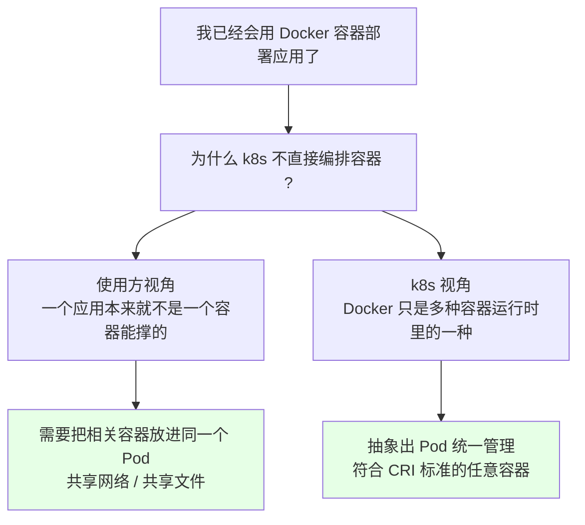
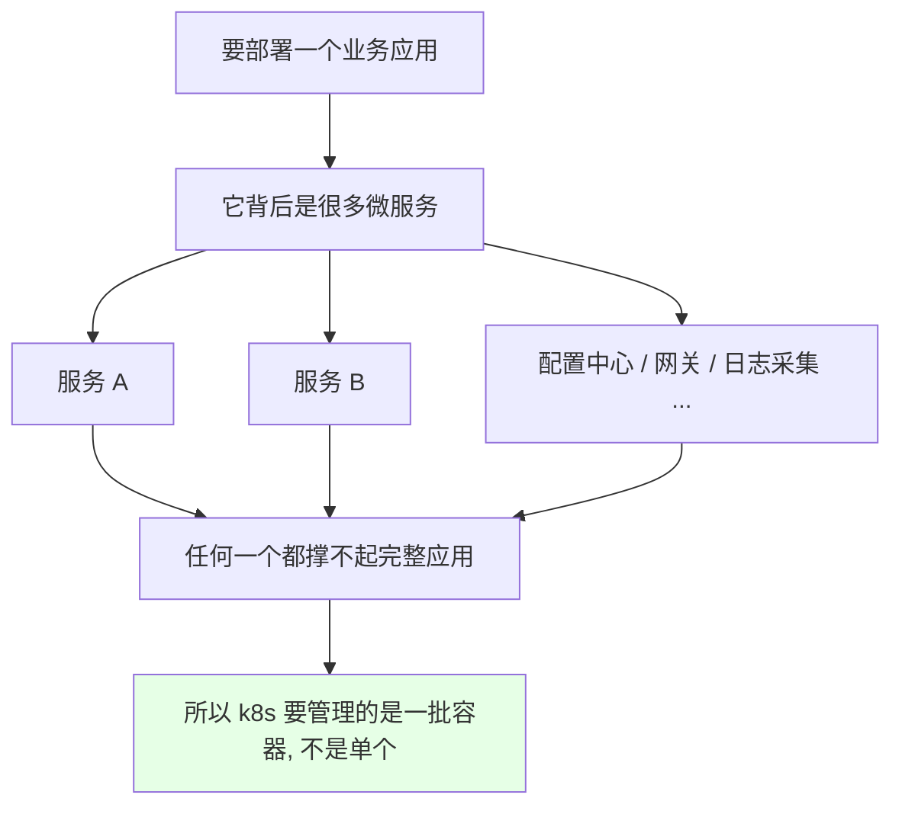
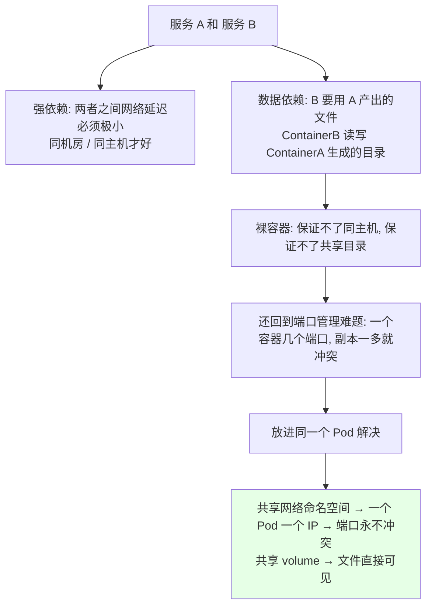
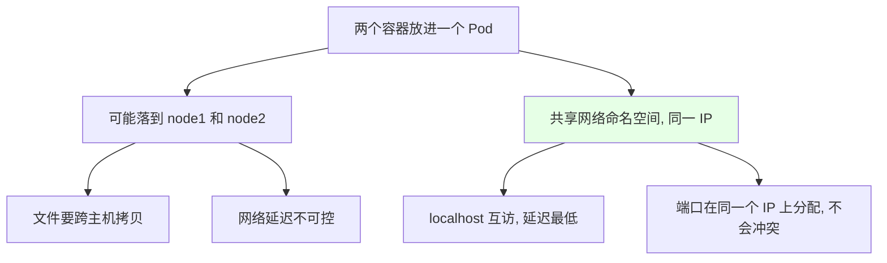
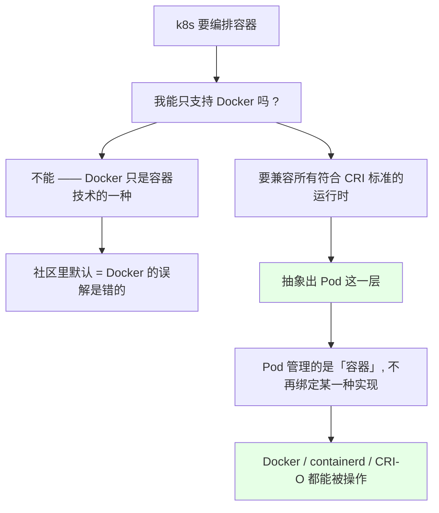
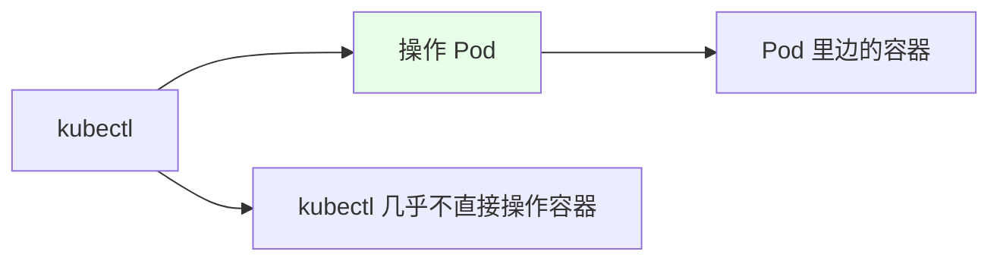

# Kubernetes 集群部署: 为什么要引入 Pod（从使用方与容器运行时两个视角看 Pod 的由来）

前面已经知道 Pod 是用来「管理容器」的。但很多人会卡在同一个问题：**既然已经有 Docker 容器了，为什么 k8s 不直接编排容器，非要再套一层 Pod？**

这一节就把这个问题讲透。答案有两条线索：

- **使用方视角**：一个真实应用往往不是一个容器能撑起来的，A 服务和 B 服务之间有强依赖（网络延迟必须极小、B 要用 A 产出的文件），而裸容器**保证不了它们同主机、共享目录、低延迟**，还会回到「端口怎么管」的老问题；
- **k8s 视角**：k8s 要做的是**兼容多种容器运行时**（Docker 只是其中一种，还有 containerd、CRI-O……），它不能只编排 Docker，于是抽象出 Pod 这层，统一调度和管理**符合 CRI 标准的任意容器**。

结论先摆：

1. **Pod 是 k8s 调度的最小单元**，一个 Pod 里的容器共享网络命名空间（一个 Pod 一个 IP，**端口永远不会冲突**）和 volume；
2. **强依赖 + 延迟敏感 + 数据耦合**的容器应该放进同一个 Pod，性能和可管理性都更好；
3. **k8s 不是只编排 Docker**，`containerd`、`CRI-O` 等符合 CRI 标准的运行时它都支持 —— 甚至可以不装 Docker 直接用 containerd；
4. **生产里几乎不直接操作容器，操作的就是 Pod**，`kubectl` 用得最多的对象也是 Pod。

## 纲要

- 问题：有 Docker 了，为什么还要 Pod
- 使用方视角一：一个应用不是单个容器能撑的
- 使用方视角二：强依赖的两个容器怎么办
- 裸容器直接编排的四个坑
- Pod 的解法：共享网络 + 共享 volume
- k8s 视角：要兼容多种容器运行时
- CRI 标准与容器运行时家族
- 生产里的操作对象就是 Pod

## 问题：有 Docker 了，为什么还要 Pod



## 使用方视角一：一个应用不是单个容器能撑的



现实里一个应用由一堆微服务组成，单靠一个容器（哪怕做了多进程）既不利于伸缩也不利于维护。k8s 要面对的是**一批有关系的容器**，而不是孤零零一个。

## 使用方视角二：强依赖的两个容器怎么办



典型场景：

| 场景 | 两个容器的关系 | Pod 的解法 |
| --- | --- | --- |
| 应用 + 日志采集 | flume/filebeat 要读应用写出的日志 | 共享 volume，同 Pod 直接读 |
| 应用 + sidecar 代理 | 代理要拦应用的出入流量 | 同网络命名空间，`localhost` 互访 |
| 主容器 + 侧车工具 | 后者给前者装依赖、初始化配置 | 共享 volume 传文件 |

## 裸容器直接编排的四个坑

```text
如果 k8s 直接编排裸容器, 会面临这四个问题:

问题一: 不能保证 A 和 B 落在同一台宿主机
        └── 跨主机 → 网络延迟变大, 强依赖场景不可接受

问题二: 不能保证两个容器共享同一个目录
        └── A 产生的文件 B 读不到, 得再挂一套存储绕

问题三: 不能保证那种极低延迟的访问
        └── 用 gRPC / RPC 跨主机调, 延迟和抖动都不好控

问题四: 端口回到老问题 —— 容器多了, 端口很难管
        └── 每个容器开几个端口? 副本一大就冲突
```



放进同一个 Pod 之后：**Pod 有唯一 IP**，这个 IP 是 Pod 级别的，一个 Pod 里的所有容器共用它 —— 于是**端口号永远不会冲突**，这是从使用方角度最直接的好处。

## Pod 的解法：共享网络 + 共享 volume

```yaml
apiVersion: v1
kind: Pod
metadata:
  name: pod-demo
  labels:
    app: pod-demo
spec:
  containers:
  - name: app
    image: busybox:1.32
    command: ["sh", "-c", "sleep 3600"]
    volumeMounts:
    - name: shared-data
      mountPath: /data
  - name: sidecar
    image: busybox:1.32
    command: ["sh", "-c", "sleep 3600"]
    volumeMounts:
    - name: shared-data
      mountPath: /backup
  volumes:
  - name: shared-data
    emptyDir: {}
```

```text
一个 Pod 里两个容器共享的东西:

pod-demo (IP: 10.244.1.20)   ← 唯一 IP, 整个 Pod 只有一个
├── 容器 app                  ← 写 /data
│   └── volumeMounts: /data   ┐
│                             ├── 同一个 emptyDir volume
├── 容器 sidecar              │   两边都可见
    └── volumeMounts: /backup ┘
```

| 共享维度 | 裸容器 | 同一个 Pod 里 |
| --- | --- | --- |
| 网络 | 各自 IP，跨主机要走网络栈 | **共享网络命名空间，一个 Pod 一个 IP** |
| 端口 | 各自占用，副本多就冲突 | 同一 IP 下分配，**永不冲突** |
| 文件 | 各读各的文件系统 | 共享 volume，`localhost` 之外直接 `/opt` 可见 |
| 调度 | 各自选节点 | **作为一个整体被调度到同一个节点** |
| 生命周期 | 各自重启 | 一起起、一起退（`initContainers` 先跑完再起主容器） |

## k8s 视角：要兼容多种容器运行时



课程里给的查法：k8s 官网上 `Getting started` → `Product environments` → `Container runtimes` 那一页，列的就是 k8s 支持的各种符合 **CRI（Container Runtime Interface）** 标准的容器技术。

```text
k8s 官网 Container runtimes 页面列出的运行时家族:

├── Docker              ← 最常用, 但只是其中一种
├── containerd          ← 可以不装 Docker 直接用这个
├── CRI-O               ← 后面章节会遇到
└── 其他符合 CRI 标准的 runtime
```

| 运行时 | 说明 | 是否必须装 Docker |
| --- | --- | --- |
| **containerd** | 目前最主流，Docker 底层也在用它 | 否 |
| **CRI-O** | 轻量级，专门给 k8s 用，Red Hat 生态常用 | 否 |
| **Docker** | 老牌方案，1.24 之后 kubelet 不再内置 dockershim 直连 | — |

关键结论：**「一提到容器就想到 Docker」是不对的**，Docker 只是容器技术的一种软件。所以 k8s 没有直接去操作某个容器的实现，而是先抽象出 **Pod**，由 Pod 去统一管理符合标准的容器。

## 生产里的操作对象就是 Pod



用 Docker 的时候有 `docker` 客户端去操作服务端、操作镜像、启动容器；在 k8s 里**几乎全部通过 `kubectl` 操作集群、操作 Pod** —— 而对 Pod 的操作量是最大的。

```bash
# 平时最常敲的就是这几个
kubectl get pod
kubectl describe pod pod-demo
kubectl exec -it pod-demo -c app -- sh
kubectl delete pod pod-demo
```

```text
所以: 为什么一定要把 Pod 学好 ?

├── k8s 里对 Pod 的操作是最多的
├── 所有工作负载（Deployment / StatefulSet / DaemonSet）
│   └── 都是靠 Pod 模板(template) 来描述 Pod 的
├── 排障第一现场也在 Pod: 事件、状态、探针、日志
└── kubectl 学得再多, 落点还是 Pod
```

下一节就开始正式讲**怎么启动一个 Pod**、Pod 的定义长什么样。

## API 速览

| 能力 | 做法 | 关键点 |
| --- | --- | --- |
| 看能力范围 | k8s 官网 `Container runtimes` 页 | 支持哪些运行时看这里 |
| 查支持的运行时 | `kubectl get nodes -o wide` | `CONTAINER-RUNTIME` 列显示节点实际用的 |
| 创建 Pod | `kubectl apply -f <清单>` | 清单里 `containers` 是数组，可以放多个 |
| 看 Pod 内容器 | `kubectl get pod <Pod> -o jsonpath` | 一次看完整 spec |
| 进指定容器 | `kubectl exec -it <Pod> -c <容器名> -- sh` | 多容器必须带 `-c` |
| 看 Pod IP | `kubectl get pod -o wide` | 一个 Pod 只有一个 IP |
| 看 Pod 内共享目录 | `kubectl exec -it <Pod> -- df -h` | 验证 emptyDir 是否共享 |
| 删除 Pod | `kubectl delete pod <Pod>` | 由控制器重建才是常态 |

Pod 关键字段：

| 字段 | 作用 |
| --- | --- |
| `spec.containers` | 容器列表，可以放多个（强依赖的放一起） |
| `spec.initContainers` | 初始化容器，先跑完再起主容器 |
| `spec.volumes` | Pod 级卷，供本 Pod 所有容器共享 |
| `spec.containers[].volumeMounts` | 把卷挂到容器内哪个路径 |
| `metadata.labels` | 供 selector 挑选，控制器靠它认 Pod |
| `status.podIP` | 运行时自动生成的 Pod 唯一 IP |

## Demo 示例

```bash
# 1. 提交上文的 pod-demo（两个容器共享 emptyDir）
kubectl apply -f pod-demo.yaml
kubectl get pod -o wide
# 注意只有一个 IP, 不是两个

# 2. 在 app 容器里写文件到 /data
kubectl exec -it pod-demo -c app -- touch /data/from-app

# 3. 在 sidecar 容器里看同一个 volume
kubectl exec -it pod-demo -c sidecar -- ls /backup
# from-app
# 同一份数据, 两个容器都看得见

# 4. 验证端口不冲突: 两个容器各起一个同端口监听
kubectl exec -it pod-demo -c app -- sh -c "echo app > /data/pid"
kubectl exec -it pod-demo -c app -- nc -l -p 8080 -k -vv &
kubectl exec -it pod-demo -c sidecar -- nc -l -p 8080 -k -vv &
# 两个都起得来, 因为它们共享同一个网络命名空间, 端口在 Pod 级别分配
```

```text
Pod 与「多个独立容器」的对比:

方式一: 两个独立容器（裸容器思路）
├── 容器 A  10.244.1.10:8080
├── 容器 B  10.244.2.20:8080   ← 不同节点, 延迟上升
├── 文件不共享, 需要额外挂载存储
└── 端口仍可能撞（副本一多）

方式二: 一个 Pod 放两个容器（k8s 思路）
├── Pod IP  10.244.1.20
│   ├── 容器 A  监听 8080
│   └── 容器 B  监听 8080   ← 同一个 IP 下, 由 k8s 保证不冲突
├── 共享 emptyDir, 文件直接互通
└── 调度时作为一个整体落到同一个节点
```

### 总结

- **Pod 存在的第一个理由是「使用方需要」**：真实应用不是一个容器能撑的，A/B 服务之间可能**网络延迟必须极小、还要共享文件**，而裸容器**保证不了同主机、共享目录和低延迟**，端口管理也会退回老问题；同一 Pod 内的容器**共享网络命名空间（一个 Pod 一个 IP）和 volume**，端口永不冲突，性能和可管理性都最好。
- **Pod 存在的第二个理由是「k8s 需要中立」**：k8s 不能只编排 Docker，**containerd、CRI-O** 等符合 CRI 标准的运行时它都得支持（甚至可以完全不装 Docker），所以抽象出 Pod 这层去统一管理任意容器实现。
- **「容器 = Docker」是误解**，Docker 只是容器技术的一种；想看支持清单去 k8s 官网的 `Container runtimes` 页面。
- **生产里几乎不直接操作容器，操作的就是 Pod** —— `kubectl` 用得最多的对象就是 Pod，所有工作负载也都是靠 Pod 模板来描述它。
- **下一步**：Pod 能解释了，紧接着就是**怎么真正定义一个 Pod**、把清单写对。

