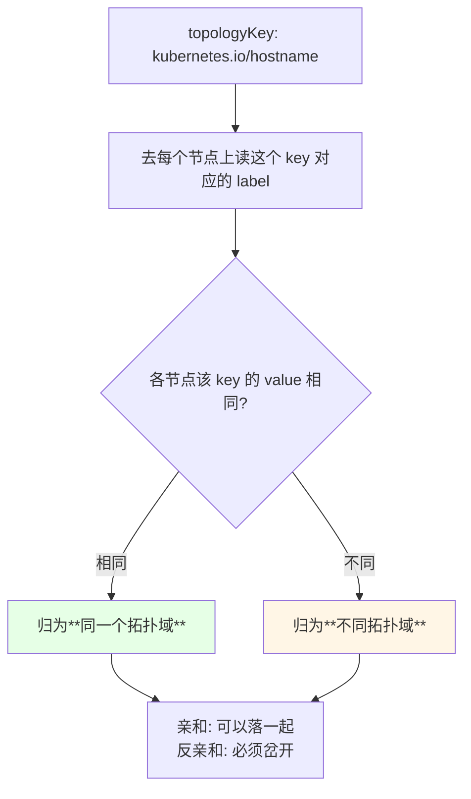
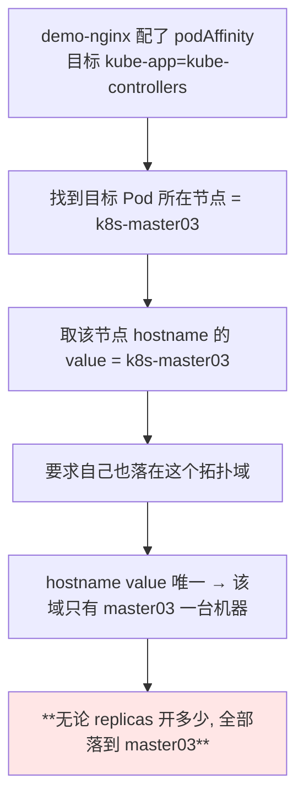
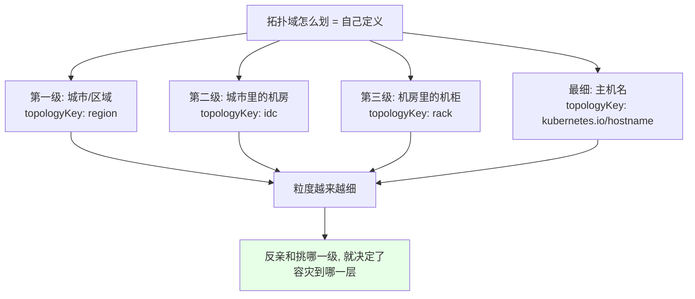
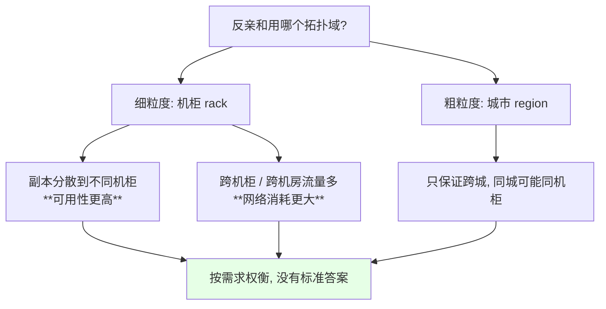
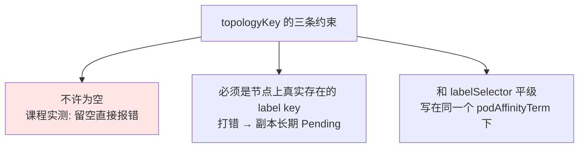

# Kubernetes 集群部署: Topology 拓扑域（hostname 为何让所有 Pod 挤到一台机器、以及按机柜/机房/城市三级划分）

前面写亲和时一直带着一个 `topologyKey: kubernetes.io/hostname` 却没解释。**这个值在 Kubernetes 里被称为「拓扑域」**，它决定了「**和谁在一块 / 跟谁岔开**」到底按什么粒度判定 —— 粒度定错了，反亲和会失效，亲和会把所有副本吸到同一台机器上。

结论先摆：

1. **`topologyKey` 的取值就是节点 label 的 key**，拓扑域是按这个 key 的 **value 相同与否**来划界的；value 相同算同一个域，**value 不同就是不同域**；
2. **`kubernetes.io/hostname` 是 K8s 装完自动给每个节点打的标签**，key 一样、**value 是主机名且天然互不相同** → **每个节点各成一个拓扑域**；
3. 所以配了 `topologyKey: kubernetes.io/hostname` 的 **Pod 亲和会把所有副本吸到目标 Pod 那唯一一台机器上**，replicas 开多大都白搭，这是真实踩过的坑；
4. 拓扑域**不是只有 hostname 一种玩法**：区域 → 城市 → 机房 → 机柜 → 服务器类型，全都能当 key，**粒度由自己定义**；
5. **反亲和配上粗粒度拓扑域**（比如一个机房一个域）才能真做到「跨机柜容灾」；**粒度越细可用性越高、网络开销也越大**。

## 纲要

- 拓扑域到底是什么：按 label 的 value 划界
- hostname 是每个节点一个域的直接原因
- 为什么 Pod 亲和会把副本全吸到一台机器
- 拓扑域的三级划分：城市 / 机房 / 机柜
- 还能按什么划：机柜、服务器类型、可用区
- 反亲和 pick 粗还是细：可用性与网络开销的取舍
- topologyKey 的写法约束

## 拓扑域到底是什么：按 label 的 value 划界



课程里的原话总结成一句话：**「这个 key 或者是这个 value 不一样，它就属于不同的拓扑域」**。注意判断依据是 **value**，key 本身只决定「拿哪一套标签来比」。

## hostname 是每个节点一个域的直接原因

Kubernetes 安装完会**自动给每个节点打上一个带主机名的 label**，可以直接看：

```bash
kubectl get nodes --show-labels | tr ',' '\n' | grep hostname
# kubernetes.io/hostname=k8s-master01
# kubernetes.io/hostname=k8s-master02
# kubernetes.io/hostname=k8s-master03
# kubernetes.io/hostname=k8s-node01
# kubernetes.io/hostname=k8s-node02
```

```text
五个节点、按 kubernetes.io/hostname 划分的结果:

kubernetes.io/hostname  (key 全部相同)
├── k8s-master01         value= k8s-master01  ← 拓扑域 1
├── k8s-master02         value= k8s-master02  ← 拓扑域 2
├── k8s-master03         value= k8s-master03  ← 拓扑域 3
├── k8s-node01           value= k8s-node01    ← 拓扑域 4
└── k8s-node02           value= k8s-node02    ← 拓扑域 5

结论: 每个节点独占一个拓扑域（因为主机名不可能重复）
```

| 节点的 label | key | value | 拓扑域归属 |
| --- | --- | --- | --- |
| master01 | `kubernetes.io/hostname` | `k8s-master01` | 域 1 |
| master02 | `kubernetes.io/hostname` | `k8s-master02` | 域 2 |
| node01 | `kubernetes.io/hostname` | `k8s-node01` | 域 4 |
| node02 | `kubernetes.io/hostname` | `k8s-node02` | 域 5 |

**主机名天然唯一** —— 这一条决定了后面那个「全挤一台机器」的现象。

## 为什么 Pod 亲和会把副本全吸到一台机器

上一反亲和实验用的是 `kube-app=kube-controllers`（即 `kube-controller-manager`），它落在 **k8s-master03**：

```yaml
spec:
  affinity:
    podAffinity:
      requiredDuringSchedulingIgnoredDuringExecution:
      - labelSelector:
          matchExpressions:
          - key: kube-app
            operator: In
            values:
            - kube-controllers
        topologyKey: kubernetes.io/hostname
        namespaces:
        - kube-system
```



> 课程里明确提醒：**「因为拓扑域的值是唯一的，所以说你的容器无论创建多少个节点，它都是部署在 k8s-master03 上面」**。用 Pod 亲和配 hostname 拓扑域前，一定要想清楚这层含义。

| 配置 | 拓扑域粒度 | 实际效果 |
| --- | --- | --- |
| `podAffinity` + `hostname` | 一台机器一个域 | 所有副本**全挤**到目标所在机器 |
| `podAntiAffinity` + `hostname` | 一台机器一个域 | 每个节点最多一个副本 |
| `podAntiAffinity` + 机房级 key | 一个机房一个域 | 每个机房一个副本（跨机房容灾） |

## 拓扑域的三级划分：城市 / 机房 / 机柜

拓扑域不是只能按主机名划，**完全是自己定义出来的**。课程里画的层级是这样：

```text
按业务自定义的三级拓扑域:

region（城市）                          ← 粗粒度
├── beijing
│   ├── 大兴机房                         ← 中粒度
│   │   ├── 机柜 1
│   │   ├── 机柜 2
│   │   └── 机柜 3                       ← 细粒度
│   └── 海淀机房
│       ├── 机柜 1
│       └── 机柜 2
└── shanghai
    ├── 浦东机房
    │   ├── 机柜 1
    │   └── 机柜 2
    └── 松江机房
        └── 机柜 1
```



节点 label 自己打上去即可：

```bash
kubectl label node k8s-master01 rack=rack1
kubectl label node k8s-node01   rack=rack1
kubectl label node k8s-master02 rack=rack2
kubectl label node k8s-node02   rack=rack2
kubectl label node k8s-master03 rack=rack3

# 对应的拓扑域配置
# topologyKey: rack
```

## 还能按什么划：机柜、服务器类型、可用区

课程里给的思路很直接 —— **「绑定的不是唯一的」**就行，粒度怎么设都是自己的事：

| 划分维度 | 示例 topologyKey | 适用场景 |
| --- | --- | --- |
| 主机名 | `kubernetes.io/hostname` | 默认形态，一个节点一个域 |
| 可用区 | `topology.kubernetes.io/zone` | 云上跨 AZ 容灾的标准做法 |
| 区域 | `topology.kubernetes.io/region` | 跨地域（北京 / 上海） |
| 机房 | 自定义 `idc` | 同城多机房 |
| 机柜 | 自定义 `rack` | 同机房内避开同一个机柜断电 / 交换机故障 |
| 服务器类型 | 自定义 `machine-type` | 区分高配 / 低配、Windows / Linux |

课程里特别举例说：**同一个机柜里有很多服务器，可以按服务器的不同再划一层**（比如按服务器类型划分高配和低配、Windows 服务器和 Linux 服务器），虽然更细、用得少，但确实可行。

## 反亲和 pick 粗还是细：可用性与网络开销的取舍



课程的原话是：**「我们可以让它部署在不同的机房，然后部署在不同机房的不同机柜，这样的话它的可用性是不是更高；当然这样的话，可能它的网络消耗可能会更大，这个是按自己的需求去定义」**。

## topologyKey 的写法约束



| 约束 | 说明 | 违反后果 |
| --- | --- | --- |
| 不能为空 | `topologyKey: ""` 不接受 | 校验直接报错，apply 不进去 |
| 必须是 label 的 key | 节点上得真有这个标签 | 打错了匹配不到域，硬约束下 Pod `Pending` |
| 位置要对 | 与 `labelSelector` 同级，在 `podAffinityTerm` 下面 | 字段层级错会报 unknown field |

## API 速览

| 能力 | 做法 | 关键点 |
| --- | --- | --- |
| 看节点自带 label | `kubectl get nodes --show-labels` | `kubernetes.io/hostname` 安装完自动就有 |
| 自定义拓扑域 | `kubectl label node <NODE> rack=rack1` | key 就是 topologyKey，value 决定同域与否 |
| 指定拓扑域 | `topologyKey: rack` | 写在 `podAffinityTerm` 下，与 `labelSelector` 平级 |
| 最细粒度 | `topologyKey: kubernetes.io/hostname` | 一个节点一域，**亲和会把副本全吸到一台** |
| 跨可用区 | `topologyKey: topology.kubernetes.io/zone` | 云上标准形态 |
| 跨机房 | 自定义 `idc` label + `topologyKey: idc` | 同城多机房容灾 |
| 删标签 | `kubectl label node <NODE> rack-` | 减号结尾表示删除 |
| 查 Pending 原因 | `kubectl describe pod <POD>` | Events 里会点明不满足的亲和 / 拓扑条件 |

字段速查：

| 字段 | 作用 |
| --- | --- |
| `spec.affinity.podAffinity[].topologyKey` | 亲和判定的拓扑域维度 |
| `spec.affinity.podAntiAffinity[].topologyKey` | 反亲和判定的拓扑域维度 |
| `spec.affinity.nodeAffinity` | 节点亲和（不涉及 topologyKey） |
| `.podAffinityTerm.labelSelector` | 选中「参照的那些 Pod」 |
| `.podAffinityTerm.namespaces` | 参照 Pod 的搜索范围 |
| `.podAffinityTerm.topologyKey` | **必须非空**，上面两个与它平级 |

## Demo 示例

```bash
# 1. 看每个节点的 hostname label —— 这就是默认的拓扑域依据
kubectl get nodes --show-labels | tr ',' '\n' | grep "kubernetes.io/hostname"

# 2. 按机柜打标签，三个节点分成三个机柜（三个拓扑域）
NODE1=k8s-master01
NODE2=k8s-node01
NODE3=k8s-master03
kubectl label node "$NODE1" rack=rack1
kubectl label node "$NODE2" rack=rack2
kubectl label node "$NODE3" rack=rack3
kubectl get nodes -L rack

# 3. 验证 hostname 拓扑域下亲和会把副本全吸到目标机器
kubectl apply -f pod-affinity-hostname.yaml
kubectl get pods -o wide
# 副本再多, 也应该全部落在目标 Pod 所在的那一个节点上

# 4. 换成机柜级拓扑域做反亲和 —— 每个机柜一个副本
kubectl apply -f nginx-anti-affinity-rack.yaml
kubectl get pods -o wide
# 副本应分散到不同 rack 的节点上

# 5. 撕掉标签复原
kubectl label node "$NODE1" rack-
kubectl label node "$NODE2" rack-
kubectl label node "$NODE3" rack-
```

```yaml
# pod-affinity-hostname.yaml —— hostname 拓扑域的陷阱示范
apiVersion: v1
kind: Pod
metadata:
  name: demo-nginx
  labels:
    app: demo-nginx
spec:
  affinity:
    podAffinity:
      requiredDuringSchedulingIgnoredDuringExecution:
      - labelSelector:
          matchExpressions:
          - key: kube-app
            operator: In
            values:
            - kube-controllers
        topologyKey: kubernetes.io/hostname
        namespaces:
        - kube-system
  containers:
  - name: nginx
    image: nginx:1.15.2
    imagePullPolicy: IfNotPresent
```

```yaml
# nginx-anti-affinity-rack.yaml —— 换成机柜级拓扑域
apiVersion: apps/v1
kind: Deployment
metadata:
  name: demo-nginx
  labels:
    app: demo-nginx
spec:
  replicas: 3
  selector:
    matchLabels:
      app: demo-nginx
  template:
    metadata:
      labels:
        app: demo-nginx
    spec:
      affinity:
        podAntiAffinity:
          requiredDuringSchedulingIgnoredDuringExecution:
          - labelSelector:
              matchExpressions:
              - key: app
                operator: In
                values:
                - demo-nginx
            topologyKey: rack
      containers:
      - name: nginx
        image: nginx:1.15.2
        imagePullPolicy: IfNotPresent
```

```text
同一个 topologyKey 在不同粒度下的对照:

topologyKeyValue              域的数量(5 节点)   反亲和时副本分布
────────────────────────────────────────────────────────────────
kubernetes.io/hostname        5 个域             每节点 1 个, 最多 5 副本
rack (3 个机柜)                3 个域             每机柜 1 个, 最多 3 副本
idc  (2 个机房)                2 个域             每机房 1 个, 最多 2 副本
region (1 个城市)              1 个域             全城只能放 1 个副本
```

### 总结

- **拓扑域就是 `topologyKey` 指向的那个节点 label**：key 相同、**value 不同即不同域**，`topologyKey` 本身是每个 Pod 亲和项里必填且不能为空的字段；
- **`kubernetes.io/hostname` 是 K8s 装完自动打的标签，value 是主机名且天然唯一 → 每个节点独占一个拓扑域**；
- 正因为 hostname 域唯一，**配了 `podAffinity` + `hostname` 后无论建多少个副本都会落到目标 Pod 那一台机器上**，这是要提前想清楚的坑；
- **拓扑域的粒度完全自定义**：城市 → 机房 → 机柜 → 服务器类型（高配/低配、Windows/Linux）都能当 key，自己打 label 即可；
- **反亲和挑的拓扑域越细，可用性越高、网络消耗也越大**（跨机柜甚至跨机房），课程原话是「这是按自己的需求去定义」，没有标准答案；
- **`topologyKey` 必须是节点上真实存在的 label key、不许留空、与 `labelSelector` 平级写在 `podAffinityTerm` 下面**，写错会让副本长期 `Pending`。

