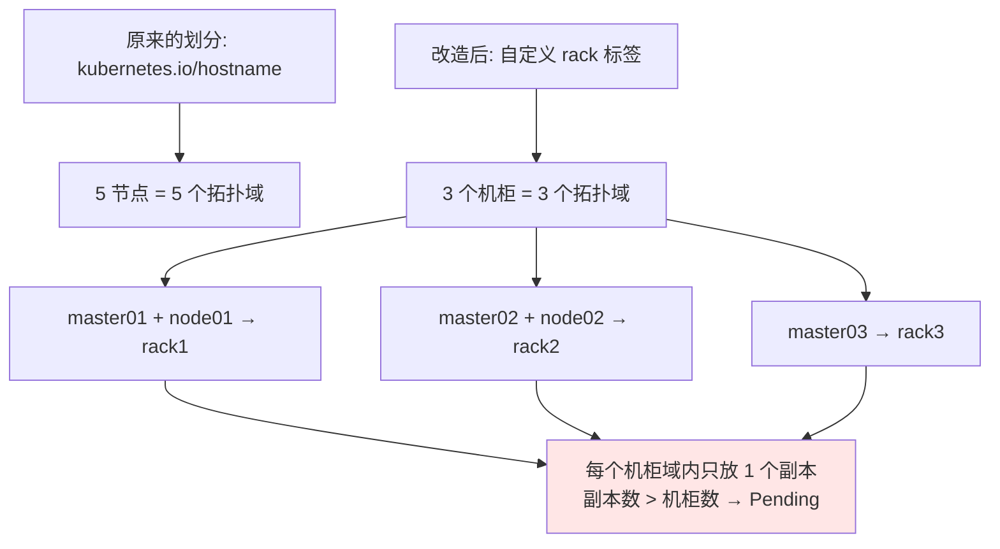
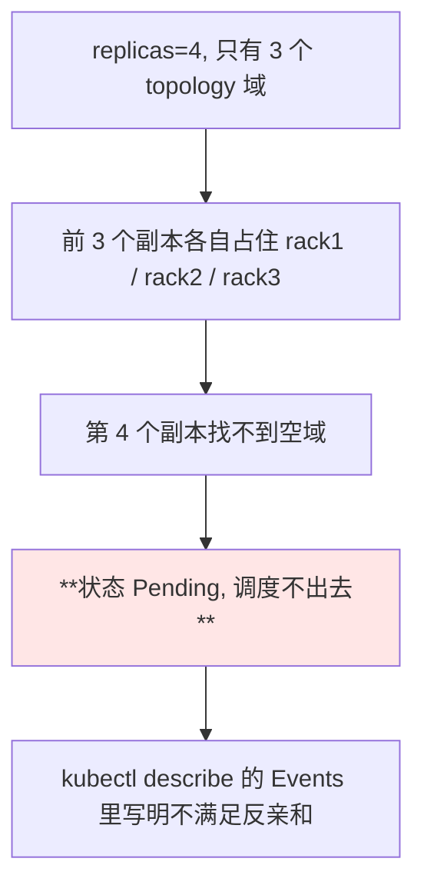
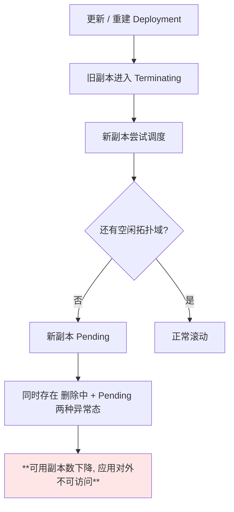
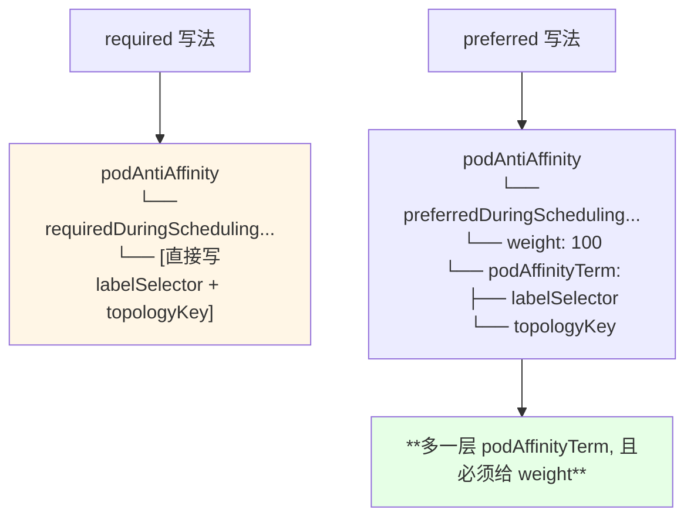
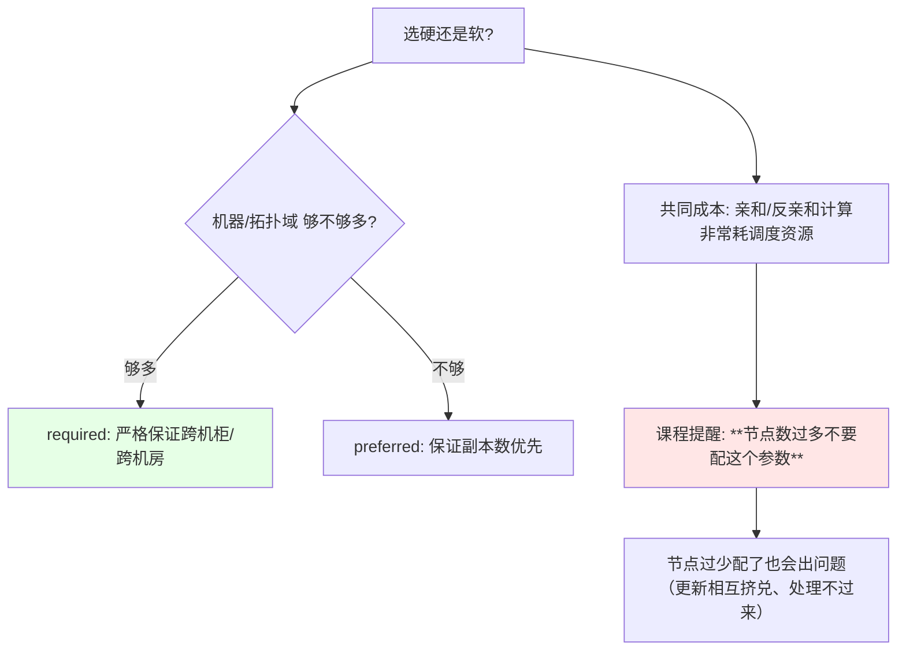

# Kubernetes 集群部署: 用 Topology 实现多地多机房部署（机柜级拓扑域实测、副本 Pending 与软硬反亲和）

上一节讲清了拓扑域的概念，这一节把它真正用起来：**把 topologyKey 从默认的 `hostname` 换成自定义的「机柜」标签**，模拟「一个机房三个机柜」的多机房部署模型。

结论先摆：

1. **拓扑域的划分完全由自己的 label 决定** —— 给节点打上 `rack=1/2/3`，`topologyKey: rack` 后就是「一个机柜一个域」；
2. **硬反亲和（required）+ 3 个机柜，副本数开到 4 就一定 Pending** —— 每个域只能放一个，第 4 个没地方去；
3. 更狠的是：**此时有的副本处于删除状态、有的 Pending，应用对外就已经不可用了**，机器不多时划分粒度一定要留余地；
4. **改成软反亲和（preferred）后副本可以叠在一个机柜里**，条件满足不了时为了保证副本数，也会在同一拓扑域多放一个；
5. **preferred 的字段结构跟 required 不一样**：下面是 `weight` 与 `podAffinityTerm` 平级，漏写 `weight` 会直接报错；
6. 这套算法**很耗调度资源、算得比较慢**，节点多的时候要谨慎配置。

## 纲要

- 实验目标：一个机房三个机柜
- 给节点打机柜标签
- 改写 Deployment 为机柜级拓扑域
- 实测一：硬反亲和第四个副本 Pending
- 硬反亲和下的可用性塌方
- 改成软反亲和 preferred
- preferred 的字段坑：weight 与 podAffinityTerm 平级
- 实测二：同一机柜放下两个副本
- 软硬反亲和的取舍与调度开销

## 实验目标：一个机房三个机柜

上一节的反亲和用的是 `kubernetes.io/hostname`，value 各不相同，所以每个节点一个域、副本必然分散在不同机器上。这次换成自定义维度的推演：



对应的物理形态：

```text
一个机房 / 三个机柜的拓扑域模型:

idc-beijing（机房）
├── rack1（机柜一 —— 拓扑域 A）
│   ├── k8s-master01
│   └── k8s-node01
├── rack2（机柜二 —— 拓扑域 B）
│   ├── k8s-master02
│   └── k8s-node02
└── rack3（机柜三 —— 拓扑域 C）
    └── k8s-master03
```

## 给节点打机柜标签

打标签这一步就是「定义拓扑域」的全部动作：

```bash
kubectl label node k8s-master01 rack=1
kubectl label node k8s-node01   rack=1
kubectl label node k8s-master02 rack=2
kubectl label node k8s-node02   rack=2
kubectl label node k8s-master03 rack=3
kubectl get nodes -L rack
```

> 课程里演示用的 key 直接写成了中文「机柜」，作者自己也说「不要像我这么随便」 —— **生产环境建议统一用小写英文 key**（`rack` / `idc` / `region`），避免出现编码与可读性问题。

| 节点 | `rack` value | 拓扑域 |
| --- | --- | --- |
| k8s-master01 | `1` | 机柜一 |
| k8s-node01 | `1` | 机柜一 |
| k8s-master02 | `2` | 机柜二 |
| k8s-node02 | `2` | 机柜二 |
| k8s-master03 | `3` | 机柜三 |

注意 **master01 和 node01 同 value → 同属一个拓扑域**，这是与 hostname 划分最大的区别。

## 改写 Deployment 为机柜级拓扑域

只要把 `topologyKey` 指到自己打的 key 上：

```yaml
      affinity:
        podAntiAffinity:
          requiredDuringSchedulingIgnoredDuringExecution:
          - labelSelector:
              matchExpressions:
              - key: app
                operator: In
                values:
                - demo-nginx
            topologyKey: rack
```

```text
语义翻译:

在这个机柜拓扑域里, 只能部署一个 app=demo-nginx 的应用
   rack=1 是一个拓扑域 → 最多 1 个副本
   rack=2 是一个拓扑域 → 最多 1 个副本
   rack=3 是一个拓扑域 → 最多 1 个副本
   ⇒ 理论容量 = 3 个副本（不管机器有多少台）
```

## 实测一：硬反亲和第四个副本 Pending

把 Deployment 扩到 4 个副本：

```bash
kubectl scale deploy demo-nginx --replicas=4
kubectl get pods -o wide
```



```text
课程实测输出（示意）:

NAME                          READY   STATUS    NODE
demo-nginx-aaaa                1/1     Running   k8s-master01   (rack1)
demo-nginx-bbbb                1/1     Running   k8s-node02     (rack2)
demo-nginx-cccc                1/1     Running   k8s-master03   (rack3)
demo-nginx-dddd                0/1     Pending   <none>

结论: 每个机柜只有一个的情况下, 第四个副本没有可用拓扑域
```

## 硬反亲和下的可用性塌方

更麻烦的情况出现在**滚动更新期间** —— 旧的在删、新的调度不出去：



> 课程里留下了那句提醒：**「你们机器不多的时候玩这个拓扑域一定要注意一下 —— 像这种三个是删除状态、两个是 Pending 的这种情况，你的应用应该是不能访问了」**。所以机柜级（甚至机房级）硬反亲和要么机器足够多，要么就退到软反亲和。

## 改成软反亲和 preferred

把 `required` 换成 `preferred`，同一个机柜就可以放下两个副本：

```yaml
      affinity:
        podAntiAffinity:
          preferredDuringSchedulingIgnoredDuringExecution:
          - weight: 100
            podAffinityTerm:
              labelSelector:
                matchExpressions:
                - key: app
                  operator: In
                  values:
                  - demo-nginx
              topologyKey: rack
```

| 对比 | 硬 `required` | 软 `preferred` |
| --- | --- | --- |
| 满足不了时 | **Pending**，宁缺毋滥 | 退而求其次，**同域也放** |
| 副本数保证 | 不一定达标 | **优先保证副本数** |
| 额外字段 | 无 | **`weight`** |
| 适用 | 机器充裕、策略必须守 | 机器少、可用性别无退路 |

## preferred 的字段坑：weight 与 podAffinityTerm 平级

课程在改这段配置时翻车了两次 —— 这正是 `required` / `preferred` 写法不一致造成的：



```text
两种写法的层级差异:

required（硬性）
└── podAntiAffinity
    └── requiredDuringSchedulingIgnoredDuringExecution
        └── - labelSelector
              topologyKey            ← 同一级

preferred（软性）
└── podAntiAffinity
    └── preferredDuringSchedulingIgnoredDuringExecution
        └── - weight: 100            ← ① 必须写
              podAffinityTerm:       ← ② 多包一层
                labelSelector
                topologyKey
```

课程原话：**「它是 `weight` 和 `podAffinityTerm` 对齐的，少了一个字段」**。漏 `weight` 时 Deployment 会直接拒绝保存；另外 `topologyKey` **留空也是不允许的**。

## 实测二：同一机柜放下两个副本

改成软反亲和后重新扩容到 4：

```bash
kubectl scale deploy demo-nginx --replicas=4
kubectl get pods -o wide
```

```text
课程实测输出（示意）:

NAME                          READY   STATUS    NODE
demo-nginx-aaaa                1/1     Running   k8s-master01   (rack1)
demo-nginx-bbbb                1/1     Running   k8s-node01     (rack1)  ← 同一机柜叠了 2 个
demo-nginx-cccc                1/1     Running   k8s-node02     (rack2)
demo-nginx-dddd                1/1     Running   k8s-master03   (rack3)

结论: 没有 Pending 了 —— 软反亲和「尽量岔开」, 岔不开就同域放
```

> 课程里还提到：改完之后 Deployment **触发了一次滚动更新，要等它更新完**才看得到最终分布；节点太少时这个过程会明显变慢。

## 软硬反亲和的取舍与调度开销



| 场景 | 建议 |
| --- | --- |
| 节点/机柜充裕，要求跨机柜容灾 | `required` 硬反亲和 |
| 机器少但副本数不能少 | `preferred` 软反亲和 |
| 集群规模大（几百上千节点） | **慎用**，调度会明显变慢 |
| 更新时卡在删除态 | 课程做法：`kubectl delete pod <POD> --force --grace-period=0` 强制清掉 |

## API 速览

| 能力 | 做法 | 关键点 |
| --- | --- | --- |
| 打拓扑域标签 | `kubectl label node <NODE> rack=1` | 同 value 即同域 |
| 删除标签 | `kubectl label node <NODE> rack-` | 减号结尾 |
| 指定自定义拓扑域 | `topologyKey: rack` | 与内置 `hostname` 用法一致 |
| 硬反亲和 | `requiredDuringSchedulingIgnoredDuringExecution` | 不满足 → Pending |
| 软反亲和 | `preferredDuringSchedulingIgnoredDuringExecution` | 需 `weight` + `podAffinityTerm` |
| 看分布在哪个域 | `kubectl get pods -o wide` | 配合 `-L rack` 看节点标签 |
| 看 Pending 原因 | `kubectl describe pod <POD>` | Events 点名 affinity 不满足 |
| 扩容验证 | `kubectl scale deploy demo-nginx --replicas=4` | 超过域数量第四副本 Pending |
| 强制清理卡死副本 | `kubectl delete pod <POD> --force --grace-period=0` | 更新大面积卡住时用 |

字段速查：

| 字段 | 作用 |
| --- | --- |
| `topologyKey` | 拓扑域依据的 label key，**不允许为空** |
| `podAntiAffinity.required...` | 硬：必须岔开，否则不调度 |
| `podAntiAffinity.preferred...` | 软：尽量岔开，允许妥协 |
| `.weight` | 软策略权重，与 `podAffinityTerm` 平级 |
| `.podAffinityTerm` | 软策略里真正包 `labelSelector` + `topologyKey` 的那一层 |

## Demo 示例

```bash
# 1. 按机柜给节点打标签（三个机柜 = 三个拓扑域）
kubectl label node k8s-master01 rack=1
kubectl label node k8s-node01   rack=1
kubectl label node k8s-master02 rack=2
kubectl label node k8s-node02   rack=2
kubectl label node k8s-master03 rack=3
kubectl get nodes -L rack

# 2. 部署硬反亲和版本（每个机柜最多一个副本）
kubectl apply -f anti-affinity-rack-required.yaml
kubectl get pods -o wide

# 3. 扩到 4 个副本 —— 第四个应 Pending
kubectl scale deploy demo-nginx --replicas=4
kubectl get pods -o wide
POD=$(kubectl get pods -l app=demo-nginx --field-selector=status.phase=Pending -o name | head -1)
kubectl describe "$POD" | tail -20

# 4. 改成软反亲和后再扩到 4 —— 同一机柜可叠放
kubectl apply -f anti-affinity-rack-preferred.yaml
kubectl scale deploy demo-nginx --replicas=4
kubectl get pods -o wide

# 5. 收摊
kubectl delete deploy demo-nginx
kubectl label node k8s-master01 rack-
kubectl label node k8s-node01   rack-
kubectl label node k8s-master02 rack-
kubectl label node k8s-node02   rack-
kubectl label node k8s-master03 rack-
```

```yaml
# anti-affinity-rack-required.yaml —— 硬：一个机柜一个副本
apiVersion: apps/v1
kind: Deployment
metadata:
  name: demo-nginx
  labels:
    app: demo-nginx
spec:
  replicas: 3
  selector:
    matchLabels:
      app: demo-nginx
  template:
    metadata:
      labels:
        app: demo-nginx
    spec:
      affinity:
        podAntiAffinity:
          requiredDuringSchedulingIgnoredDuringExecution:
          - labelSelector:
              matchExpressions:
              - key: app
                operator: In
                values:
                - demo-nginx
            topologyKey: rack
      containers:
      - name: nginx
        image: nginx:1.15.2
        imagePullPolicy: IfNotPresent
```

```yaml
# anti-affinity-rack-preferred.yaml —— 软：尽量岔开, 岔不开就同柜放
apiVersion: apps/v1
kind: Deployment
metadata:
  name: demo-nginx
  labels:
    app: demo-nginx
spec:
  replicas: 3
  selector:
    matchLabels:
      app: demo-nginx
  template:
    metadata:
      labels:
        app: demo-nginx
    spec:
      affinity:
        podAntiAffinity:
          preferredDuringSchedulingIgnoredDuringExecution:
          - weight: 100
            podAffinityTerm:
              labelSelector:
                matchExpressions:
                - key: app
                  operator: In
                  values:
                  - demo-nginx
              topologyKey: rack
      containers:
      - name: nginx
        image: nginx:1.15.2
        imagePullPolicy: IfNotPresent
```

```text
3 个机柜拓扑域下的容量对照:

replicas   硬 required                软 preferred
────────────────────────────────────────────────────────
3          3 个机柜各 1 个, 全部 Running  同左
4          3 个 Running + 1 个 Pending   4 个 Running, 某机柜叠 2 个
5          同上, Pending 累积到 2 个       5 个 Running, 继续叠放
```

### 总结

- **定义拓扑域就是给节点打标签**：`rack=1` 的两个节点算同一个域，把 `topologyKey` 指到这个 key，`podAntiAffinity` 就变成「一个机柜一个副本」的多地多机房模型；
- **硬反亲和下副本数不能超过拓扑域数量** —— 3 个机柜开 4 个副本，第 4 个必然 `Pending`，这是机器不多时最容易撞上的坑；
- **最危险的是滚动更新期**：旧的 Terminating、新的 Pending 同时存在，**可用副本掉下去，应用直接不可访问**；
- **改成软反亲和（preferred）后可以同柜叠放**，代价是放弃「绝对跨柜」的保证，换来对副本数的保障；
- **preferred 的层级比 required 多一层**：`weight` 与 `podAffinityTerm` 平级，`labelSelector` 和 `topologyKey` 要缩进到 `podAffinityTerm` 下面；漏 `weight` 直接报错，`topologyKey` 也不许为空；
- **亲和 / 反亲和这套算法非常耗调度资源**：集群规模大时谨慎使用，节点太少配上反而会在更新时相互挤兑、处理不过来。

