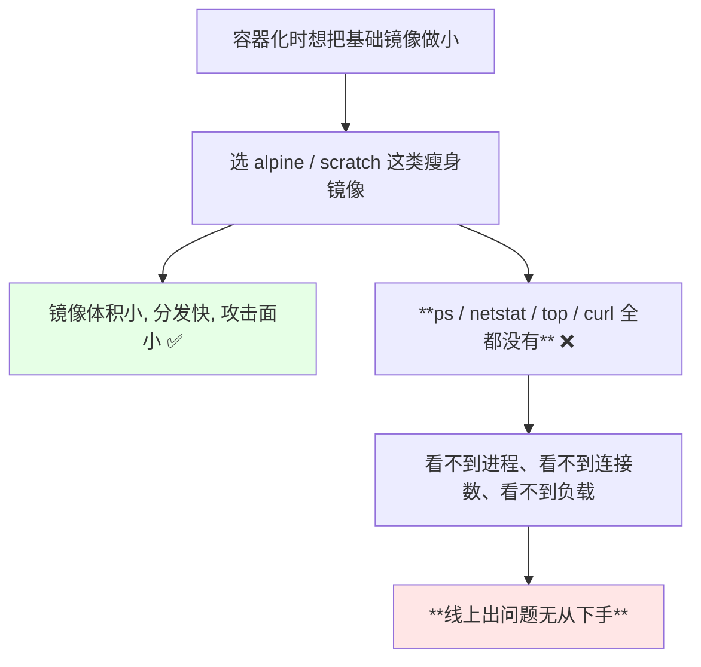
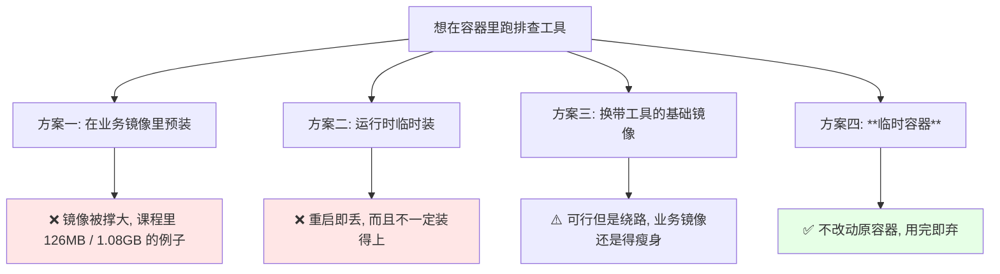
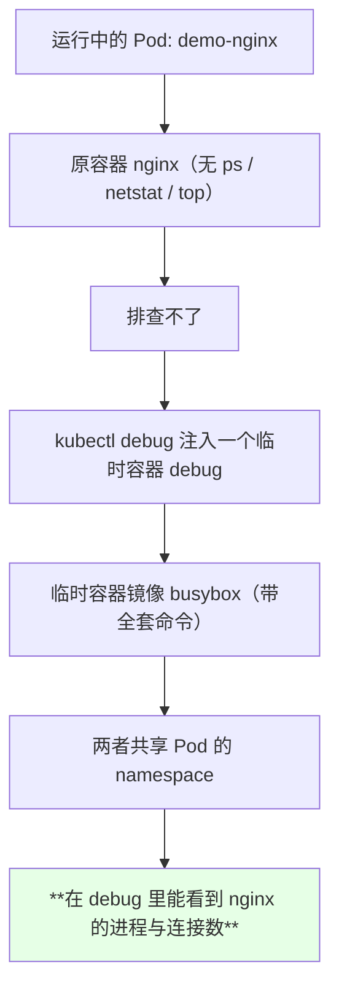
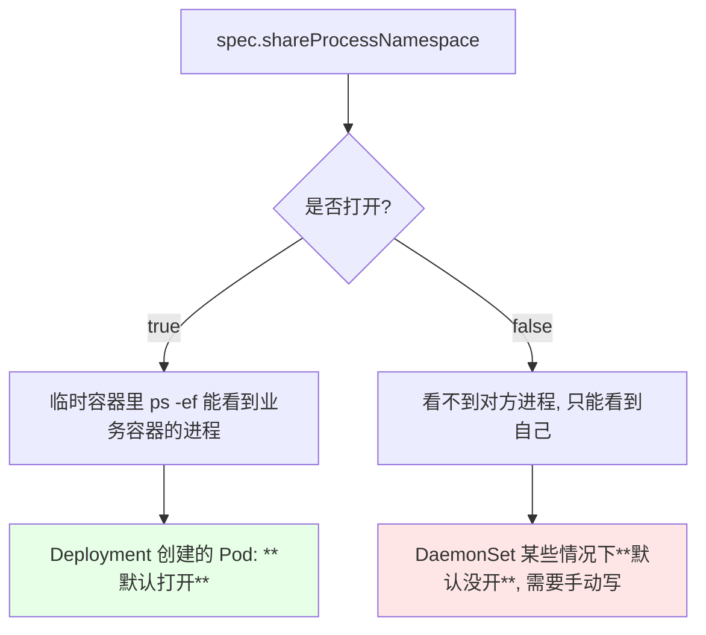
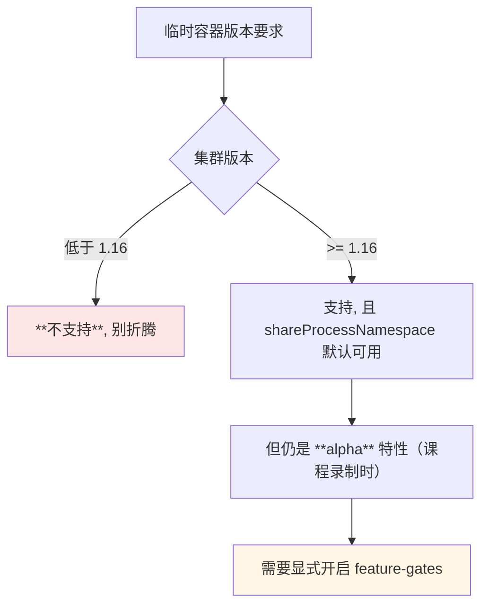
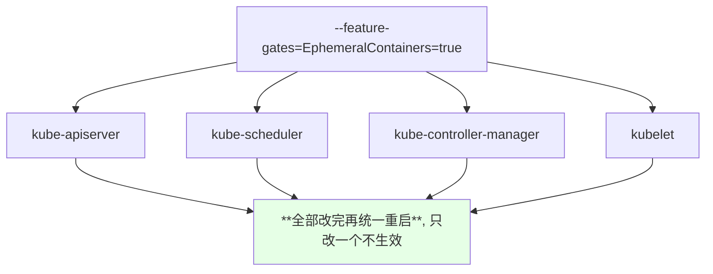
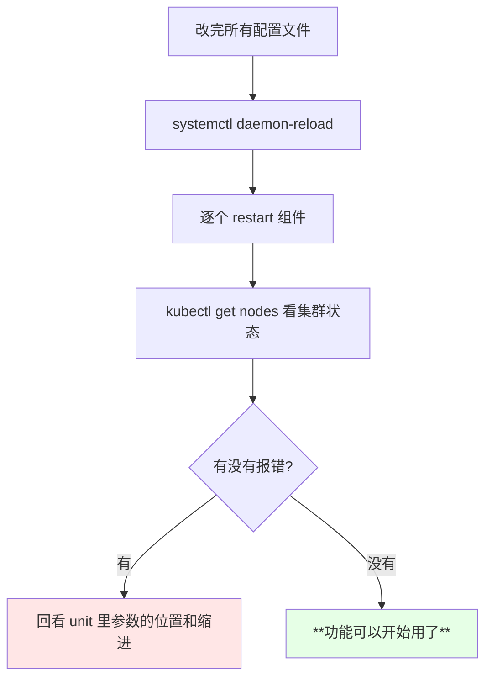

# Kubernetes 集群部署: 临时容器概念与配置（为什么小镜像没法排错、EphemeralContainers 的 feature-gates 全组件开启）

一句话讲清痛点：**镜像越小越好部署，越小越没法排错**。alpine、scratch 这类精简基础镜像里连 `ps`、`netstat`、`top` 都没有，进程看不到、连接数看不到，线上出问题只能干瞪眼。Kubernetes 的**临时容器（Ephemeral Container）**就是专为这件事设计的。

结论先摆：

1. **把排查工具塞进业务镜像会撑大镜像**，而且临时装的工具**重启就没**，都不是好办法；
2. **临时容器 = 往已有 Pod 里临时插一个带有全套工具的容器**，不必改动原有容器、也不会触发 Pod 重启；
3. 它靠的是 Pod 内**共享 namespace**——重点是 `shareProcessNamespace`，进程、PID、各类资源都能看到；
4. **1.16 以下不支持**，1.16 及以上的 Deployment 里 `shareProcessNamespace` **默认打开**（DaemonSet 不一定，得手动确认）；
5. 课程演示时它还是 **alpha 特性**，要在 **apiserver / scheduler / controller-manager / kubelet 全部组件**上通过 feature-gates 打开；
6. 二进制集群改 systemd 的 unit 文件 + kubelet 的 KubeletConfiguration，**多窗口编辑务必注意缩进位置一致**，参数建议追加在末尾。

## 纲要

- 小而没法排错：alpine / scratch 的代价
- 三条路都走不通：装进镜像、临时装、换基础镜像
- 临时容器是什么：往 Pod 里插一个工具容器
- 靠什么看到进程：shareProcessNamespace
- 版本门槛：1.16 起才支持
- feature-gates：所有控制面组件都要开
- kubelet 用单独的 KubeletConfiguration 文件配
- 改完 daemon-reload 并重启
- 编辑多窗口的两个坑
- 顺带的替代方案：直接用带工具的基础镜像

## 小而没法排错：alpine / scratch 的代价



课程里举的例子很具体：

| 能力 | 精简业务镜像 | 带工具的镜像 |
| --- | --- | --- |
| `ps` | 没有 | 有 |
| `netstat` | 没有 | 有 |
| `top` | 没有 | 有 |
| Java 的 `jstack` / `jmap` | 没有 | 需要额外塞进去 |

## 三条路都走不通：装进镜像、临时装、换基础镜像



课程里顺手看了一组镜像体积，很能说明问题：

```text
课程里看到的镜像体积对照:

带完整工具的业务镜像         ≈ 126 MB
集成了数据库的 runner 镜像    ≈ 1.08 GB
busybox                       ≈ 1.15 MB
scratch 系                    ≈ 740 KB（基本什么都没有）

⇒ 排查工具一旦塞进去, 镜像体积直接翻倍甚至放大十倍
```

## 临时容器是什么：往 Pod 里插一个工具容器



几个必须记住的性质：

| 性质 | 说明 |
| --- | --- |
| **不改动原容器** | 不需要重建镜像、不需要改 Deployment |
| **不触发重启** | 课程实测：`kubectl get pod` 上看不到任何变化 |
| **不能被覆盖** | 注入一次之后再注入同名临时容器会失败，只能**删掉 Pod 重建** |
| **重启后消失** | 临时容器终究是临时的，Pod 重建后要**重新注入** |
| **镜像建议内网** | 课程明确提醒别用公网镜像，拉不下来很被动 |

## 靠什么看到进程：shareProcessNamespace

临时容器之所以能「隔山打牛」看到隔壁容器的进程，靠的就是 Pod 内的命名空间共享。

```text
Pod 内部的共享关系:

Pod
├── 业务容器 nginx            ← 没有 ps / netstat / top
├── 临时容器 debug（busybox）  ← 有全套命令
└── 共享层
    ├── PID namespace   ← shareProcessNamespace 打开后可见对方进程
    ├── 网络 namespace   ← 共享同一份网络连接
    └── 各类资源视图

开关: spec.shareProcessNamespace
     新版本 Deployment 已经默认打开
```



> 课程里的实测结论：**Deployment 是默认打开 `shareProcessNamespace` 的，DaemonSet 不一定** —— 作者在 DaemonSet 上第一次也看不到进程，手动给 Pod 加上该参数后就能看到了。StatefulSet 的情况作者没有实测，需要自己验证。

## 版本门槛：1.16 起才支持



## feature-gates：所有控制面组件都要开

alpha 特性不会默认生效，必须手动打开。**注意是整个集群的组件都要开**，漏掉一个就不生效：

```text
需要加 --feature-gates 的位置（二进制集群）:

/etc/systemd/system/
├── kube-apiserver.service              ← 改
├── kube-scheduler.service              ← 改
├── kube-controller-manager.service      ← 改
└── kubelet
    ├── kubelet.service                  ← 改
    └── kubelet 的 KubeletConfiguration  ← 改（推荐方式）
```



| 组件 | 改哪里 | 追加内容 |
| --- | --- | --- |
| kube-apiserver | systemd unit 的启动命令行 | `--feature-gates=EphemeralContainers=true` |
| kube-scheduler | 同上 | 同上 |
| kube-controller-manager | 同上 | 同上 |
| kubelet | unit + KubeletConfiguration | 两份都要有 |

多个 feature gate 之间**用逗号隔开**即可：

```bash
--feature-gates=EphemeralContainers=true,AnotherGate=true
```

课程里给出的典型追加形态（加到启动参数末尾）：

```bash
  --feature-gates=EphemeralContainers=true
```

## kubelet 用单独的 KubeletConfiguration 文件配

除了 unit 里的命令行，kubelet 还有一份**单独的配置文件**，课程提到「这种配置文件现在是 K8s 比较推荐的方式」：

```yaml
apiVersion: kubelet.config.k8s.io/v1beta1
kind: KubeletConfiguration
featureGates:
  EphemeralContainers: true
```

对比两种配置载体：

| 载体 | 写法 | 适用 |
| --- | --- | --- |
| 命令行参数 | `--feature-gates=EphemeralContainers=true` | 二进制 systemd 集群的传统做法 |
| KubeletConfiguration | `featureGates: {EphemeralContainers: true}` | **官方推荐**，kubelet 侧 |

## 改完 daemon-reload 并重启

二进制集群的标准动作：

```bash
systemctl daemon-reload
systemctl restart kube-apiserver
systemctl restart kube-controller-manager
systemctl restart kube-scheduler
systemctl restart kubelet
kubectl get nodes
```



也可以把所有改动一次改完，最后只 `daemon-reload` 一遍 —— 课程作者第二次就是这么做的。

## 编辑多窗口的两个坑

课程作者同时开了多个窗口编辑，专门强调了两条经验：

```text
多主机编辑 checklist:

1. 每个窗口里光标的位置必须一致
   └─ 否则粘贴的参数会落到别人的配置项里, 直接把组件配坏
2. 新加的参数一律放到**最后面**, 别插到前面
   └─ 作者踩过一次, 放前面会出问题（具体症状已忘）
3. 多个 feature-gate 之间用**逗号**隔开, 注意换行符别丢
```

## 顺带的替代方案：直接用带工具的基础镜像

如果集群版本不够、或者不想动 feature gate，课程也给了退路：

| 方案 | 做法 | 代价 |
| --- | --- | --- |
| 换 alpine 系基础镜像 | 自带常用工具，体积也不大 | 比 scratch 大一些 |
| 用 busybox 当 sidecar | 镜像才 1.15MB | 需要长期占用一个容器 |
| 临时容器 | `kubectl debug` 注入 | **要 1.16+ 且开 feature gate** |

## API 速览

| 能力 | 做法 | 关键点 |
| --- | --- | --- |
| 手动开启共享 | Pod spec 里写 `shareProcessNamespace: true` | DaemonSet 可能需要手写 |
| 查当前 gate 状态 | kube-apiserver 启动参数里 grep feature | alpha 默认 false |
| 开启临时容器特性 | `--feature-gates=EphemeralContainers=true` | **所有组件**都要加 |
| kubelet 侧写法 | KubeletConfiguration 的 `featureGates` 段 | 官方推荐方式 |
| 多个 gate | 逗号隔开 | 别漏换行 |
| 重载配置 | `systemctl daemon-reload && systemctl restart <组件>` | 改完必须做 |
| 注入临时容器 | `kubectl debug -it <POD> --image=busybox:1.28 --target=<容器>` | 详见下一节 |

字段速查：

| 字段 / 参数 | 位置 | 作用 |
| --- | --- | --- |
| `spec.shareProcessNamespace` | Pod / PodTemplate | 容器内共享 PID namespace |
| `spec.ephemeralContainers` | Pod（只读，由 debug 写入） | 注入进来的临时容器列表 |
| `--feature-gates=EphemeralContainers=true` | apiserver / scheduler / controller-manager / kubelet | 打开 alpha 特性 |
| `featureGates.EphemeralContainers` | KubeletConfiguration | kubelet 侧的等价写法 |

## Demo 示例

```bash
# 1. 在二进制集群的控制面节点上改 apiserver 的 unit
vi /etc/systemd/system/kube-apiserver.service
# 在启动参数末尾追加一行:
#   --feature-gates=EphemeralContainers=true

# 2. scheduler / controller-manager 同样处理
vi /etc/systemd/system/kube-scheduler.service
vi /etc/systemd/system/kube-controller-manager.service

# 3. kubelet 除了 unit, 还要改 KubeletConfiguration
vi /var/lib/kubelet/config.yaml
# featureGates:
#   EphemeralContainers: true

# 4. 重载并重启（也可以全部改完后统一执行一遍）
systemctl daemon-reload
systemctl restart kube-apiserver
systemctl restart kube-controller-manager
systemctl restart kube-scheduler
systemctl restart kubelet

# 5. 验证集群没有跑歪
kubectl get nodes
kubectl get pods -n kube-system

# 6. 顺手确认业务 Pod 的 shareProcessNamespace 情况
NS=default
POD=$(kubectl get pods -n "$NS" -o name | head -1)
kubectl get "$POD" -n "$NS" -o yaml | grep shareProcessNamespace
```

```yaml
# /var/lib/kubelet/config.yaml —— kubelet 侧推荐写法
apiVersion: kubelet.config.k8s.io/v1beta1
kind: KubeletConfiguration
featureGates:
  EphemeralContainers: true
```

```yaml
# share-process-namespace.yaml —— DaemonSet 上手动开启共享
apiVersion: apps/v1
kind: DaemonSet
metadata:
  name: demo-ds
  labels:
    app: demo-ds
spec:
  selector:
    matchLabels:
      app: demo-ds
  template:
    metadata:
      labels:
        app: demo-ds
    spec:
      shareProcessNamespace: true
      containers:
      - name: nginx
        image: nginx:1.15.2
        imagePullPolicy: IfNotPresent
```

```text
配置检查清单:

组件                        是否要加 feature-gates   遗漏后果
──────────────────────────────────────────────────────────
kube-apiserver              是                       特性不生效
kube-scheduler              是                       特性不生效
kube-controller-manager     是                       特性不生效
kubelet (unit)              是                       特性不生效
kubelet (KubeletConfiguration) 是（推荐）             可能不生效
```

### 总结

- **容器化为了瘦身选用 alpine / scratch，代价是 `ps`、`netstat`、`top` 全都没有**，业务容器大多也不会内置这些排查工具，出问题无从下手；
- **把工具塞进镜像会把体积撑大**（课程里看过 126MB 甚至 1.08GB 的例子），**临时安装则重启即丢**，两条路都不可取；
- **临时容器是在运行中的 Pod 上临时插一个带工具的容器**：不改原容器、**不触发重启**、看 `kubectl get pod` 毫无变化，用完即弃；
- **能看到隔壁容器的进程靠 `shareProcessNamespace`**：新版本的 Deployment 已经默认打开，**DaemonSet 不一定，需要手动写到 Pod spec 里**（StatefulSet 课程未实测）；
- **版本门槛 1.16**，课程录制时仍是 alpha，**必须在 apiserver / scheduler / controller-manager / kubelet 上全部加 `--feature-gates=EphemeralContainers=true`**，kubelet 侧推荐再写到 KubeletConfiguration 的 `featureGates` 段；
- **改完必须 `systemctl daemon-reload` 再逐个重启**；多窗口编辑时注意光标位置一致、**新参数一律追加到末尾**、多个 gate 用逗号隔开 —— 这些都是作者当场踩过的。

