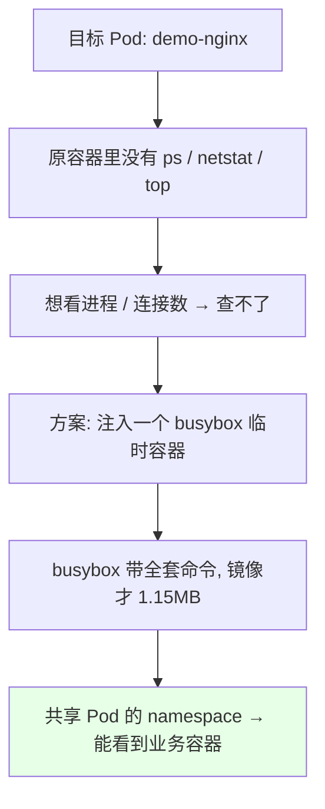
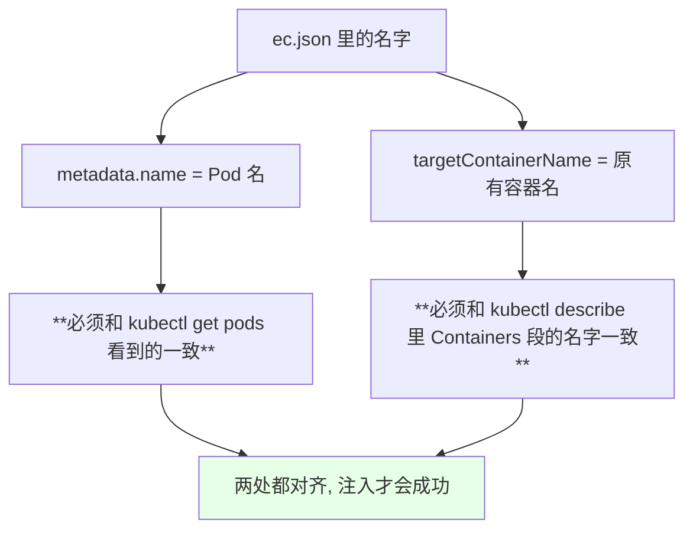
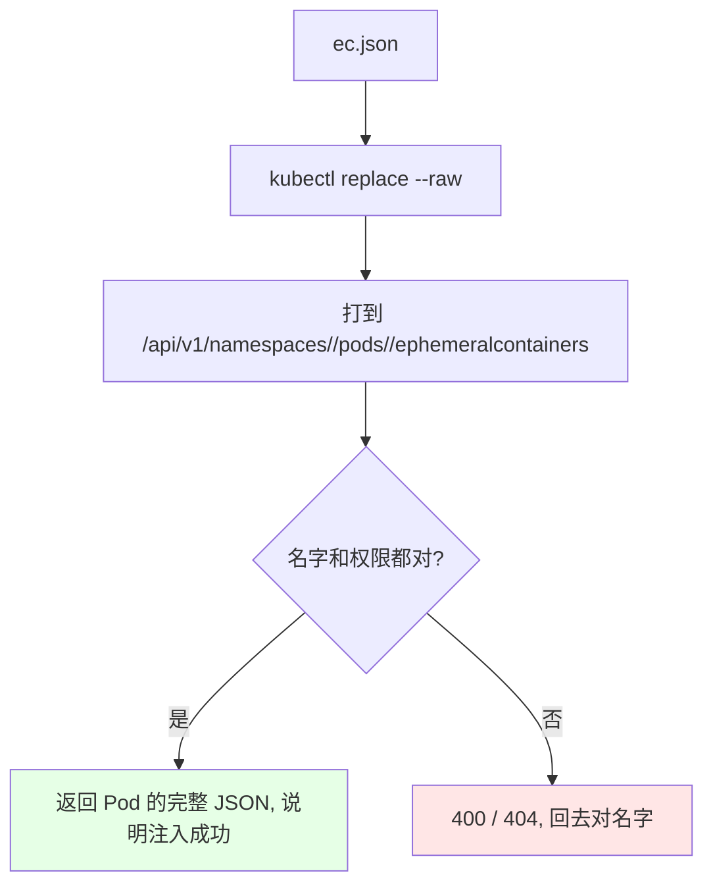
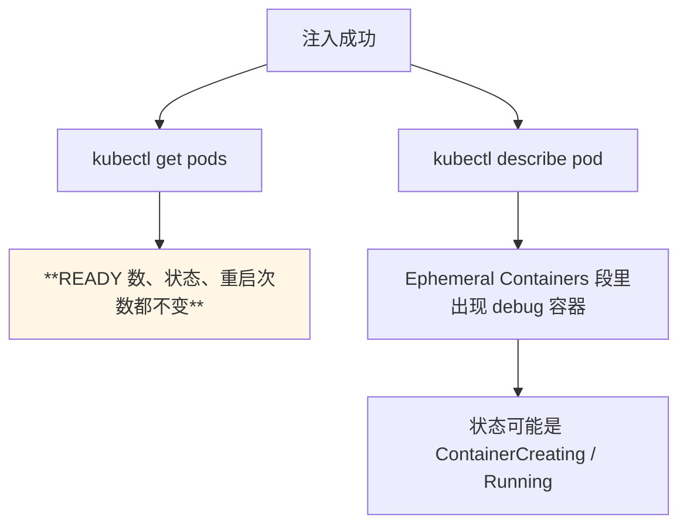
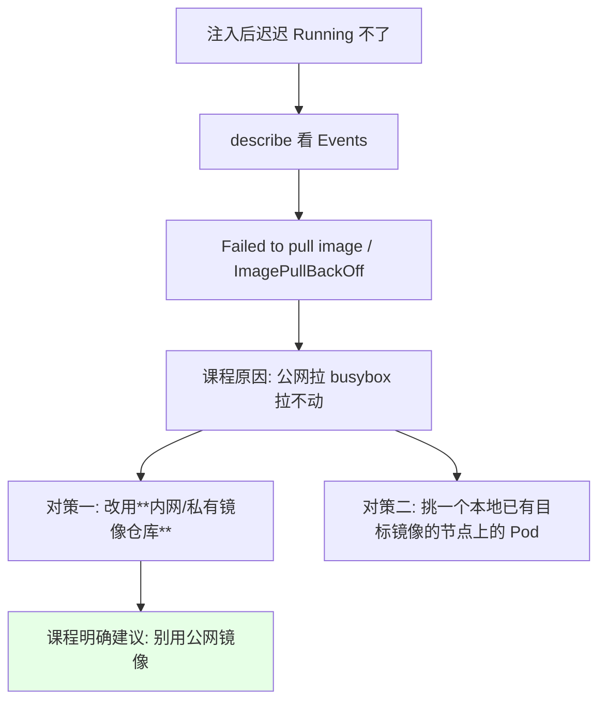
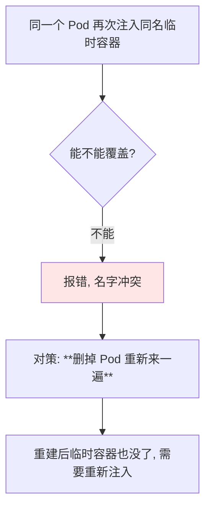
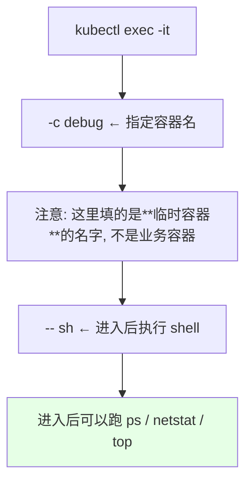
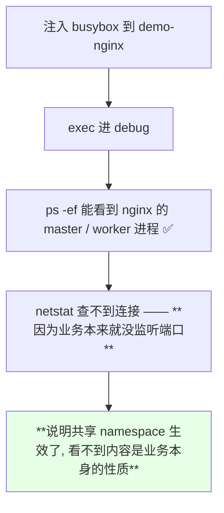
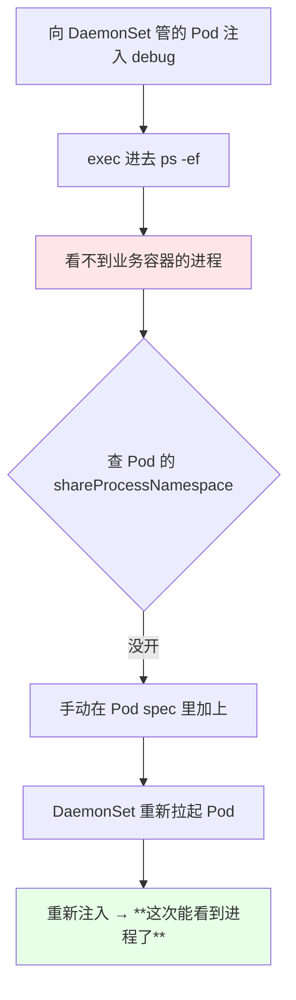

# Kubernetes 集群部署: 使用临时容器在线 debug（EphemeralContainers 注入配置、exec 排错与不可覆盖的坑）

上一节把 feature-gates 全打开了，这一节真正动手：**写一份临时容器的 JSON 配置，用 API 把它注入到运行中的 Pod 里，再 exec 进去看原本看不见的进程和连接数**。

结论先摆：

1. 注入方式是**写一份描述 EphemeralContainers 的 JSON，再通过 `kubectl replace --raw` 打到 Pod 的子资源上**；
2. JSON 里两个名字必须对上：**最外层 `metadata.name` 是 Pod 名**，`targetContainerName` 是**原有容器的名字**；临时容器自己的名字叫 `debug`（后面 exec 要用它）；
3. **注入不会造成 Pod 重启** —— `kubectl get pod` 上完全看不出变化，只有 `describe` 才看得到新加的那一段；
4. **临时容器不可被覆盖**：名字撞了再注入会失败，只能删掉 Pod 重来；镜像 tag 写错也只能重建；
5. **`kubectl exec -it <POD> -c debug -- sh`** 进的是临时容器，`-c` 后面必须是临时容器的名字；
6. **能不能看到业务容器的进程，取决于 `shareProcessNamespace`**：Deployment 默认开，**DaemonSet 不少情况下没开**，看不到进程时先查这个字段。

## 纲要

- 先看要注入的目标 Pod
- 写一份临时容器的 JSON 配置
- 两个名字必须对上：Pod 名与 targetContainerName
- 用 replace --raw 注入
- 注入后：get 看不出，describe 才看得到
- 镜像拉不动的现场与换策略
- 临时容器不能被覆盖
- exec 进临时容器
- 实测一：nginx Pod 里 ps 只看到 sleep
- 实测二：DaemonSet 看不到进程的真因
- 调试流程与注意事项

## 先看要注入的目标 Pod

课程里的目标是 `default` 命名空间下一个什么工具都没有的 `demo-nginx`：

```bash
kubectl get pods
kubectl get pods -o wide
kubectl exec -it demo-nginx-xxxx -- sh
# sh: ps: not found
# sh: netstat: not found
# sh: top: not found
```



## 写一份临时容器的 JSON 配置

课程里用的是 `ec.json` 这种形式 —— 一个 `kind: EphemeralContainers` 的资源描述：

```json
{
  "apiVersion": "v1",
  "kind": "EphemeralContainers",
  "metadata": {
    "name": "demo-nginx-xxxx"
  },
  "ephemeralContainers": [
    {
      "name": "debug",
      "command": ["sh"],
      "image": "busybox:1.28",
      "imagePullPolicy": "IfNotPresent",
      "targetContainerName": "nginx",
      "stdin": true,
      "tty": true
    }
  ]
}
```

```text
ec.json 的结构:

EphemeralContainers
├── metadata.name            ← **目标 Pod 的名字**
└── ephemeralContainers[]
    ├── name                 ← 临时容器自己的名字, 例如 debug
    ├── command              ← 常驻命令 ["sh"], 防止容器起来就退出
    ├── image                ← 带工具的镜像, 例如 busybox:1.28
    ├── imagePullPolicy      ← IfNotPresent, 优先用节点本地镜像
    ├── targetContainerName  ← **原有容器的名字**
    └── stdin / tty          ← 为 exec 交互做准备
```

字段对照：

| 字段 | 填什么 | 踩坑点 |
| --- | --- | --- |
| `metadata.name` | **Pod 名** | 填错直接注入到别的 Pod 或报 404 |
| `ephemeralContainers[].name` | 临时容器名（如 `debug`） | exec 时 `-c` 要用这个名字 |
| `image` | `busybox:1.28` | tag 写错会拉错镜像 |
| `imagePullPolicy` | `IfNotPresent` | 优先用节点本地已有镜像 |
| `command` | `["sh"]` | 不给常驻命令会起来就退出 |
| `targetContainerName` | **原有容器名** | 名字对不上就注不进去 |

## 两个名字必须对上：Pod 名与 targetContainerName



> 课程原话：**「注入到这个 Pod 里面……然后它的命令呢就是 `sh`，image 就是 busybox……容器的名称，这个容器的名称要和这个 `ec.json` 里面是对应的才可以」**。

取这两个名字的标准姿势：

```bash
POD=$(kubectl get pods -l app=demo-nginx -o jsonpath='{.items[0].metadata.name}')
kubectl get pod "$POD" -o jsonpath='{.spec.containers[*].name}'
# nginx        ← 这就是 targetContainerName
```

## 用 replace --raw 注入

注入走的是 Pod 的 `ephemeralcontainers` 子资源：

```bash
NS=default
POD=$(kubectl get pods -n "$NS" -l app=demo-nginx -o jsonpath='{.items[0].metadata.name}')
kubectl replace --raw "/api/v1/namespaces/$NS/pods/$POD/ephemeralcontainers" -f ec.json
```



| 环节 | 说明 |
| --- | --- |
| HTTP 方法 | `replace`（不是 `create`，也不是 `patch`） |
| 路径 | `/api/v1/namespaces/<NS>/pods/<POD>/ephemeralcontainers` |
| 请求体 | 上面那份 `ec.json` |
| 成功返回 | Pod 的完整 JSON（能看到 ephemeralContainers 段） |

## 注入后：get 看不出，describe 才看得到



> 课程里说得很明确：**「你在这个上面看是没有任何变化的，因为它也不会造成重启」** —— 这是临时容器最大的价值：排障动作对业务零扰动。

```text
describe 里新增的一段（示意）:

Ephemeral Containers:
  debug:
    Image:        busybox:1.28
    Command:      ["sh"]
    State:        Running
    Ready:        True
```

## 镜像拉不动的现场与换策略

课程现场遇到的第一个阻碍是镜像拉不下来（环境网络问题）：



第二个坑是**镜像 tag 写错**：作者把 image 写成 `busybox`（默认 latest），而节点本地其实只有 `busybox:1.28`。

| 现象 | 原因 | 处理 |
| --- | --- | --- |
| `ImagePullBackOff` | 拉取不到 / tag 与本地不一致 | 改对 tag，或换到有镜像的节点 |
| 一直 `ContainerCreating` | 正在拉镜像 | 等一等，或换 Nextcloud 内网源 |
| 卡住不动 | 环境资源不足（课程里作者开了 5 台 3G 虚拟机） | 清理无用 Pod |

## 临时容器不能被覆盖



> 课程原话：**「可以防止注入完一次之后就不能覆盖了……不能被覆盖，那我们就是简单一点吧，直接把它删掉」**。

这一点直接决定了排障姿势：**一次性把镜像和命令写对**，写错就重建；另外 **Pod 一旦重建，临时容器随之消失，要重新注入**。

## exec 进临时容器

容器 Running 之后，用 `-c` 指定临时容器的名字进去：

```bash
POD=$(kubectl get pods -l app=demo-nginx -o jsonpath='{.items[0].metadata.name}')
kubectl exec -it "$POD" -c debug -- sh
```



| 参数 | 含义 |
| --- | --- |
| `-it` | 交互式 + 分配 TTY |
| `-c debug` | **进入名为 `debug` 的那个容器** |
| `-- sh` | 进去后执行命令（这里是 sh） |

## 实测一：nginx Pod 里 ps 只看到 sleep

课程的第一次实测是这样的：

```text
进入 debug 容器后:

/ # ps -ef
PID   USER     TIME  COMMAND
    1 root      ...  nginx: master process ...
    ...
    N root      ...  sleep 3600        ← 业务容器里跑的那条命令

/ # netstat -an
（输出为空 —— 因为 demo-nginx 什么服务都没起）
```



> 这一步要区分清楚：**看不到进程是 `shareProcessNamespace` 没开；看得到进程但 netstat 空，是业务本身没起监听。**

## 实测二：DaemonSet 看不到进程的真因

课程又把目标换成了 kube-system 下的 calico-kube-controllers，结果 **`ps` 看不到对方的进程**，排查后结论是：



| 工作负载 | `shareProcessNamespace` 默认状态 | 处理 |
| --- | --- | --- |
| **Deployment** | **默认打开** | 直接用，无需额外配置 |
| **DaemonSet** | **课程实测没默认打开** | Pod spec 里手写 `shareProcessNamespace: true` |
| StatefulSet | 课程未实测 | 需要自己验证 |

> 课程作者也说这是他第一次在 DaemonSet 上试：「Deployments 不需要（默认已开），DaemonSet 需要单独开启，StatefulSet 我就不知道了，你们自己去试一下」。

## 调试流程与注意事项

```text
一次完整的临时容器排障:

1. 确认集群版本 >= 1.16 且 feature-gates 已开    （上一节）
2. kubectl get pods 找到目标 Pod
3. 取 Pod 名 + 容器名（targetContainerName）
4. 写 ec.json（镜像 tag 写全, command 用 ["sh"]）
5. kubectl replace --raw ... -f ec.json
6. describe 确认 debug 容器 Running
7. kubectl exec -it <POD> -c debug -- sh
8. ps -ef / netstat -an / top 排错
   └─ 看不到进程 → 查 shareProcessNamespace
9. 用完即弃: Pod 重建后自然消失
```

| 注意事项 | 说明 |
| --- | --- |
| 不可覆盖 | 同名再注入会失败，写错就只能删 Pod 重来 |
| 重启即丢 | Pod 重建后临时容器消失 |
| 镜像用内网 | 课程明确提醒别用公网镜像 |
| 一次性写对 | 因为不可覆盖，配置前先确认 tag 和容器名 |
| 业务零扰动 | 不重启、不改镜像，`get pod` 上看不出变化 |

## API 速览

| 能力 | 做法 | 关键点 |
| --- | --- | --- |
| 取 Pod 名 | `kubectl get pods -o jsonpath='{.items[0].metadata.name}'` | 填进 `metadata.name` |
| 取容器名 | `kubectl get pod <POD> -o jsonpath='{.spec.containers[*].name}'` | 填进 `targetContainerName` |
| 注入临时容器 | `kubectl replace --raw "/api/v1/namespaces/<NS>/pods/<POD>/ephemeralcontainers" -f ec.json` | **replace 不是 create** |
| 看注入结果 | `kubectl describe pod <POD>` | 看 Ephemeral Containers 段 |
| 进临时容器 | `kubectl exec -it <POD> -c debug -- sh` | `-c` 填临时容器名 |
| 查共享是否开 | `kubectl get pod <POD> -o yaml` 找 `shareProcessNamespace` | DaemonSet 可能没开 |
| 手动开共享 | Pod spec 写 `shareProcessNamespace: true` | DaemonSet 需要手写 |
| 排网络 | 容器内 `netstat -an` | busybox 自带 |
| 排进程 | 容器内 `ps -ef` | 依赖 `shareProcessNamespace` |

字段速查：

| 字段 | 作用 |
| --- | --- |
| `spec.ephemeralContainers[].name` | 临时容器名，exec 的 `-c` 要用 |
| `spec.ephemeralContainers[].image` | 带工具的镜像 |
| `spec.ephemeralContainers[].command` | 常驻命令，避免起来即退出 |
| `spec.ephemeralContainers[].targetContainerName` | 指定跟哪个原容器关联 |
| `spec.shareProcessNamespace` | 能否看到对方进程的总开关 |

## Demo 示例

```bash
# 1. 找目标 Pod 与原容器名
NS=default
POD=$(kubectl get pods -n "$NS" -l app=demo-nginx -o jsonpath='{.items[0].metadata.name}')
echo "$POD"
kubectl get pod "$POD" -n "$NS" -o jsonpath='{.spec.containers[*].name}'; echo

# 2. 先把 Pod 名与原容器名填进 ec.json（见下面的示例文件）
#    metadata.name        = 上面取到的 POD
#    targetContainerName  = 上面取到的容器名

# 3. 注入
kubectl replace --raw "/api/v1/namespaces/$NS/pods/$POD/ephemeralcontainers" -f ec.json

# 4. 确认注入结果（注意 get pods 看不出变化，必须用 describe）
kubectl get pods -n "$NS"
kubectl describe pod "$POD" -n "$NS" | tail -25

# 5. 进入临时容器排错
kubectl exec -it "$POD" -n "$NS" -c debug -- sh
# / # ps -ef
# / # netstat -an

# 6. kube-system 下的 Pod 同理，只改 NS 与名字
NS2=kube-system
POD2=$(kubectl get pods -n "$NS2" -o jsonpath='{.items[0].metadata.name}')
kubectl replace --raw "/api/v1/namespaces/$NS2/pods/$POD2/ephemeralcontainers" -f ec-system.json
kubectl describe pod "$POD2" -n "$NS2" | tail -25
kubectl exec -it "$POD2" -n "$NS2" -c debug -- sh
```

```json
{
  "apiVersion": "v1",
  "kind": "EphemeralContainers",
  "metadata": {
    "name": "demo-nginx-xxxx"
  },
  "ephemeralContainers": [
    {
      "name": "debug",
      "command": ["sh"],
      "image": "busybox:1.28",
      "imagePullPolicy": "IfNotPresent",
      "targetContainerName": "nginx",
      "stdin": true,
      "tty": true
    }
  ]
}
```

```yaml
# daemonset-share-process.yaml —— DaemonSet 上手动开启进程共享
apiVersion: apps/v1
kind: DaemonSet
metadata:
  name: demo-ds
  labels:
    app: demo-ds
spec:
  selector:
    matchLabels:
      app: demo-ds
  template:
    metadata:
      labels:
        app: demo-ds
    spec:
      shareProcessNamespace: true
      containers:
      - name: nginx
        image: nginx:1.15.2
        imagePullPolicy: IfNotPresent
```

```text
排障对照表:

现象                              判定                         处理
────────────────────────────────────────────────────────────────────
注入后 describe 看不到新容器       失败了                        检查两个名字
一直是 ContainerCreating        正在拉镜像                     换内网源 / 等
ImagePullBackOff                 tag 错或拉不动                 改对 tag
能进去但 ps 看不到业务进程         shareProcessNamespace 没开     手写开启
能 ps 但 netstat 为空             业务本身没监听                 不是配置问题
再注入报错                        同名不可覆盖                   删 Pod 重来
```

### 总结

- **注入靠的是写一份 EphemeralContainers JSON + `kubectl replace --raw` 打到 Pod 的 `ephemeralcontainers` 子资源**，注意是 `replace` 不是 `create`；
- **两个名字必须对齐**：`metadata.name` 是目标 Pod 名、`targetContainerName` 是原容器名，临时容器自己的名字（如 `debug`）则用于后续 exec 的 `-c`；
- **注入不会造成重启**：`kubectl get pods` 完全看不出变化，只有 `kubectl describe` 才显示 Ephemeral Containers 段 —— 这对线上排障极其关键；
- **临时容器不能被覆盖**：同名再注入会失败，镜像 tag 写错也只能删掉 Pod 重来，所以要**一次性把镜像和名字写对**；
- **能不能看到业务容器的进程取决于 `shareProcessNamespace`**：Deployment 默认打开，**DaemonSet 课程实测默认没开，需要手写到 Pod spec**（StatefulSet 作者未验证）；
- 区分两种「看不到」：**看不到进程是 `shareProcessNamespace` 没开；看得到进程但 `netstat` 为空则是业务本身没起监听**；镜像一律建议走内网仓库，别用公网。

