# Kubernetes 集群部署: RBAC 权限管理概念（四类顶级资源、Role 与 ClusterRole 的唯一区别、绑定与 ServiceAccount）

RBAC 是 Kubernetes 里最常用的一套权限模型。一句话概括它的价值：**控制到「某个用户只能访问某个 namespace 的某一类资源、只能做某几个操作」** —— 粒度足够细，写起来也就是几段 YAML。

结论先摆：

1. **RBAC 全称 Role-Based Access Control，基于角色的访问控制**：企业里按「个人 → 角色 → 资源」的思路做权限；
2. **四类顶级资源**：`Role`、`ClusterRole`、`RoleBinding`、`ClusterRoleBinding`；
3. **Role 是 namespace 隔离的，ClusterRole 作用于整个集群** —— 这是两者**唯一的区别**，`rules` 写法完全一样；
4. **Role / ClusterRole 只有「允许」规则，没有拒绝规则**，只能叠加允许；
5. 权限定义好还不够，必须靠 **RoleBinding / ClusterRoleBinding 绑到 user / group / ServiceAccount** 上才生效；
6. **Kubernetes 本身没有 user / group 这类资源**，所以实际最常用的是 **ServiceAccount + token**（不依赖任何第三方组件）。

## 纲要

- 先看集群里 RBAC 有没有启用
- RBAC 是什么：基于角色的访问控制
- 四类顶级资源
- Role：namespace 内的权限集合
- 读一份真实的 Role：ingress-nginx
- resourceNames：粒度收敛到单个资源
- ClusterRole：只有作用域不同
- 读一份真实的 ClusterRole：view
- Role 还是 ClusterRole：怎么选
- RoleBinding：把角色绑到人身上
- ServiceAccount 与 Pod 的身份
- 管理员是怎么来的：admin-user 的完整链路
- Secret 里的 token 与 Dashboard 登录
- K8s 没有 user，只有第三方或 token
- basic-auth-file 为什么不好用

## 先看集群里 RBAC 有没有启用

二进制/Dashboard 那套集群装完，RBAC 认证方式就已经打开了。apiserver 的授权模式里能看到它：

```bash
ps aux | grep kube-apiserver | tr ' ' '\n' | grep authorization
# --authorization-mode=Node,RBAC
```

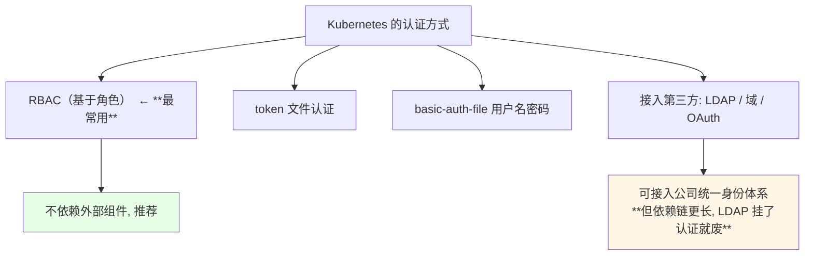

> 课程里也提到：`courses` 里讲到的 Jenkins 同样使用这种基于角色的权限管理方式 —— **按单个用户指定固定权限，力度分得更细**。

## RBAC 是什么：基于角色的访问控制

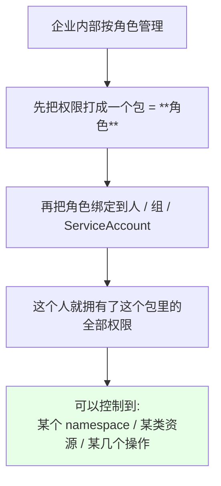

在 Kubernetes 里具体能管到这几件事：

| 控制维度 | 例子 |
| --- | --- |
| 哪些 namespace | 只能访问 `test` namespace |
| 哪些资源类型 | 只能动 `deployment` / `service` |
| 哪些单个资源 | 只能动名为 `my-config` 的这个 ConfigMap |
| 哪些操作 | 增 / 删 / 改 / 查（对应 `create` / `delete` / `update` / `get`） |

## 四类顶级资源

```text
RBAC 的四类顶级资源:

Kubernetes RBAC
├── Role                  ← 角色（namespace 级）: 定义「能干什么」
├── ClusterRole           ← 集群角色（集群级）: 定义「能干什么」
├── RoleBinding           ← 角色绑定（namespace 级）: 把角色绑给谁
└── ClusterRoleBinding    ← 集群角色绑定（集群级）: 把角色绑给谁
```

| 资源 | 作用域 | 干什么 |
| --- | --- | --- |
| `Role` | 单个 namespace | 定义一组权限规则 |
| `ClusterRole` | 整个集群 | 定义一组权限规则（写法与 Role 完全一致） |
| `RoleBinding` | 单个 namespace | 把 Role / ClusterRole 绑到主体 |
| `ClusterRoleBinding` | 整个集群 | 把 ClusterRole 绑到主体 |

创建方式和其它资源一样 —— **既能写 YAML 文件 apply，也能用 `kubectl create`**：

```bash
NAME=demo-view-binding
ROLE=demo-view-role
NS=demo-ns
SA=demo-sa
kubectl create rolebinding "$NAME" --role="$ROLE" --serviceaccount="$NS:$SA"
kubectl get roles,clusterroles,rolebindings,clusterrolebindings -A
```

## Role：namespace 内的权限集合

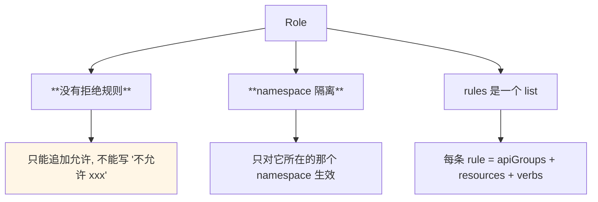

两条铁律必须记住：

| 特性 | 说明 |
| --- | --- |
| **无拒绝规则** | Role 里只能写「允许」，不存在 deny 语义 |
| **namespace 隔离** | 定义的查看 / create / update 权限只在本 namespace 内有效，不会波及别处 |

## 读一份真实的 Role：ingress-nginx

集群里现成的例子最直接 —— 看 `ingress-nginx` 命名空间下的 Role：

```bash
kubectl get role -n ingress-nginx
kubectl get role nginx-ingress-role -n ingress-nginx -o yaml
```

```yaml
rules:
- apiGroups:
  - ""
  resources:
  - configmaps
  - secrets
  - namespaces
  verbs:
  - get
- apiGroups:
  - ""
  resources:
  - configmaps
  resourceNames:
  - ingress-controller-leader-nginx
  verbs:
  - get
  - update
- apiGroups:
  - ""
  resources:
  - configmaps
  verbs:
  - create
- apiGroups:
  - ""
  resources:
  - endpoints
  verbs:
  - get
```

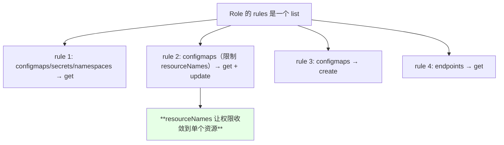

逐条翻译：

| rule | 作用对象 | 允许的操作 |
| --- | --- | --- |
| 1 | `configmaps`、`secrets`、`namespaces` | 只能 `get`（查看） |
| 2 | 名为 `ingress-controller-leader-nginx` 的**那一个** ConfigMap | `get`、`update` |
| 3 | 所有 `configmaps` | `create`（创建） |
| 4 | `endpoints` | `get` |

**一个 `apiGroups` 就是一个权限集合**：`apiGroups` 指定资源属于哪个组（核心组写 `""`），`resources` 指定哪些资源类型，`verbs` 指定能做什么。

## resourceNames：粒度收敛到单个资源

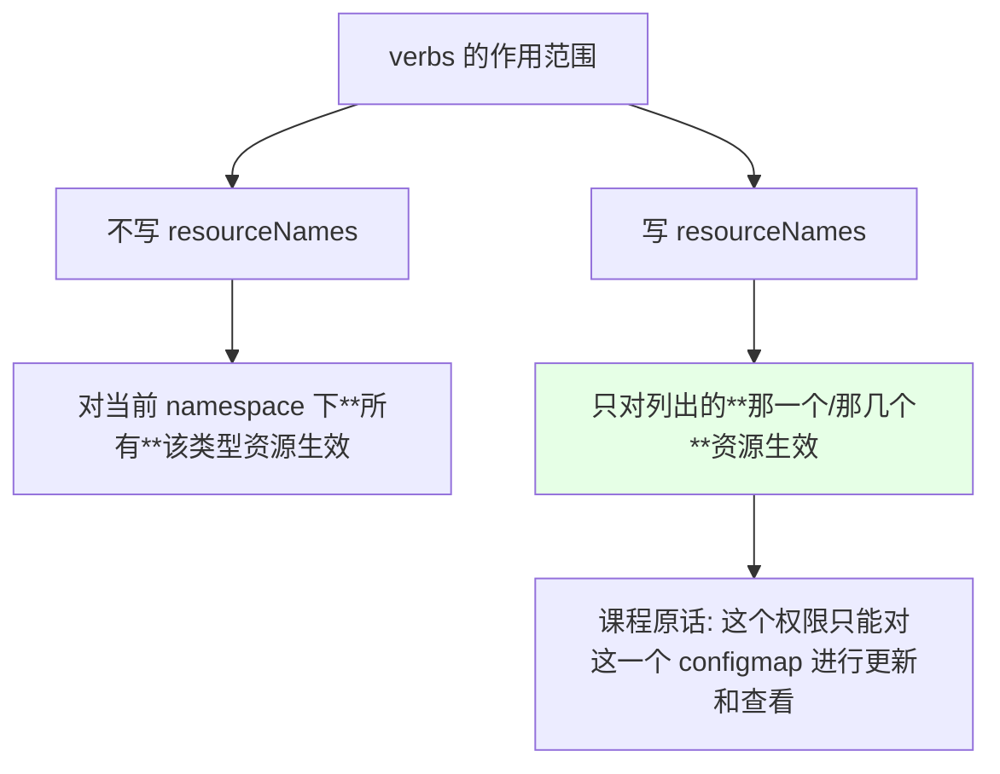

> 同名 Issue 在写业务 Role 时特别容易忽略：**只要某一类资源里有一个敏感项，就该用 `resourceNames` 收口**，否则 `get` 会把整个 namespace 的同类型资源一起放出去。

## ClusterRole：只有作用域不同

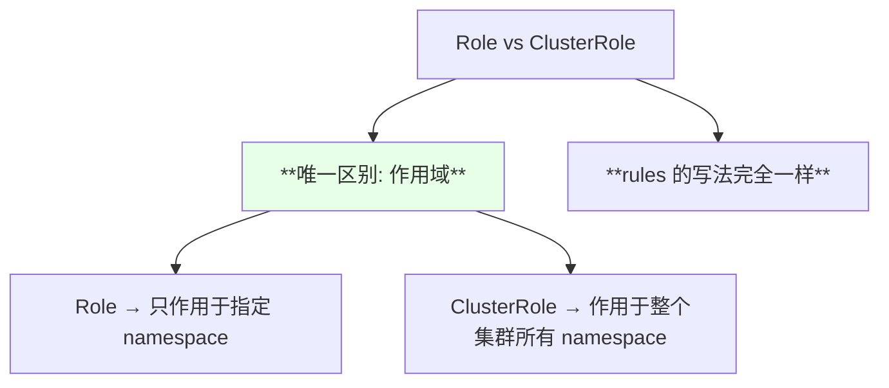

课程原话：**「这个 Role 呢和 ClusterRole 呢，它的唯一区别就是一个作用于 namespace、一个作用于整个集群」**，规则字段的写法是一模一样的。

## 读一份真实的 ClusterRole：view

集群内置的 `view` 角色是可以对整个集群做只读的角色：

```bash
kubectl get clusterrole view -o yaml
```

```yaml
rules:
- apiGroups:
  - ""
  resources:
  - endpoints
  - nodes
  - persistentvolumeclaims
  - persistentvolumeclaims/status
  - replicationcontrollers/scale
  - services/status
  - pods/log
  verbs:
  - get
  - list
  - watch
```

其中的「下级资源」写法值得留意：

```text
resources 里那些带斜杠的下级资源:

persistentvolumeclaims/status     PVC 的 status 子资源
replicationcontrollers/scale      RC 的 scale 子资源
services/status                   Service 的 status 子资源
pods/log                          Pod 的日志（平时最常用）
pods/exec                         Pod 里执行命令
```

| verb | 含义 |
| --- | --- |
| `get` | 查看单个资源 |
| `list` | 把资源全部列出来 |
| `watch` | 动态监听（就是 `kubectl get xxx -w` 那种连续查看） |

## Role 还是 ClusterRole：怎么选

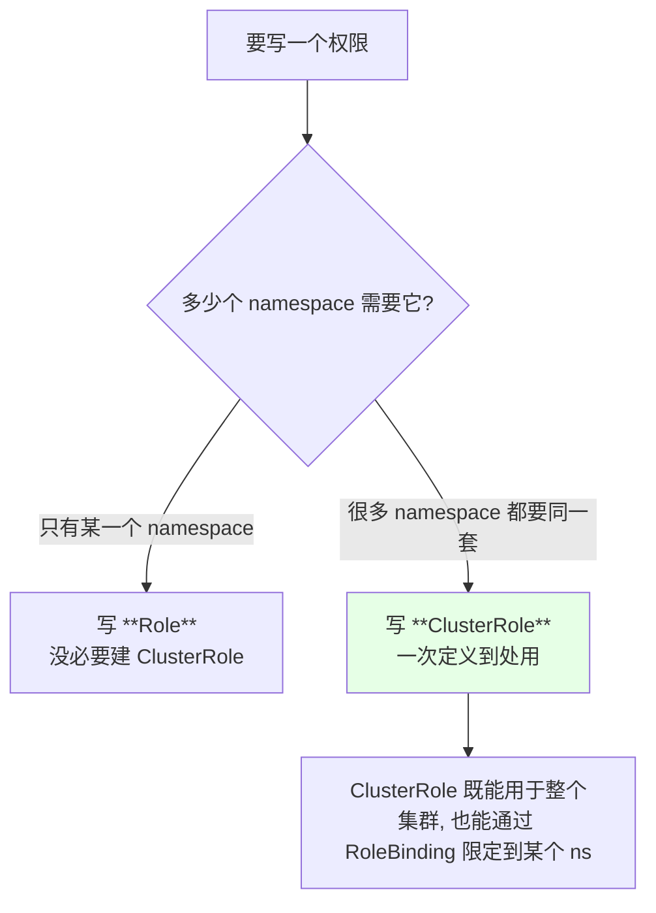

> ClusterRole 并不是「必须作用于整个集群」—— **它最终作用于谁，取决于你用 RoleBinding 还是 ClusterRoleBinding 去绑**。这一点是理解 RBAC 的关键。

## RoleBinding：把角色绑到人身上

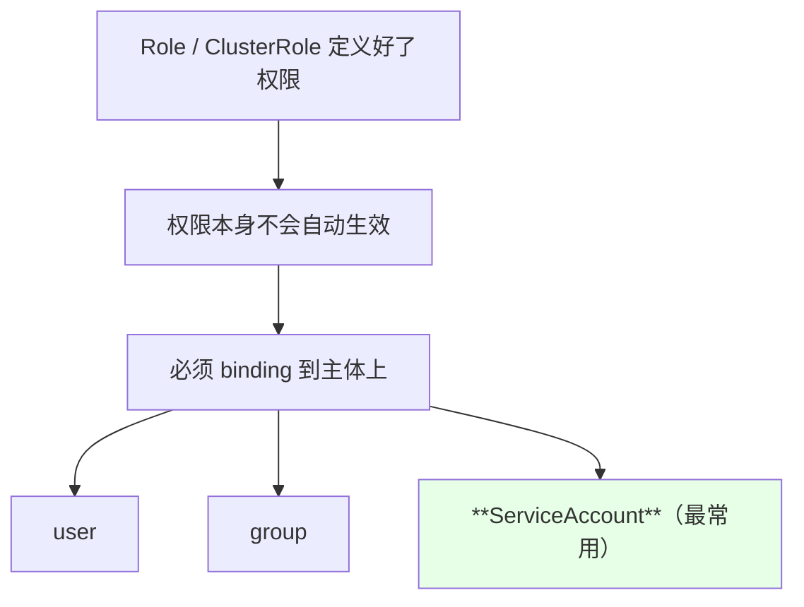

看 `ingress-nginx` 的 RoleBinding：

```bash
kubectl get rolebinding -n ingress-nginx -o yaml
```

```yaml
kind: RoleBinding
metadata:
  name: nginx-ingress-role-nisa-binding
  namespace: ingress-nginx
roleRef:
  apiGroup: rbac.authorization.k8s.io
  kind: Role
  name: nginx-ingress-role
subjects:
- kind: ServiceAccount
  name: nginx-ingress-serviceaccount
  namespace: ingress-nginx
```

```text
这条绑定关系翻译过来:

在 ingress-nginx 这个 namespace 内,
把名为 nginx-ingress-role 的 Role
绑定到 nginx-ingress-serviceaccount 这个 ServiceAccount 上
⇒ 这个 sa 就具有了该 Role 的全部权限
```

| 绑定 | 作用域 | 通常绑什么角色 |
| --- | --- | --- |
| `RoleBinding` | 只在该 namespace 内生效 | Role 或 ClusterRole 都行 |
| `ClusterRoleBinding` | 对所有 namespace 生效 | ClusterRole |

> RoleBinding 里的 `subjects` 也可以指定**其它 namespace 的 ServiceAccount** —— 跨 ns 授权就是靠这个。

## ServiceAccount 与 Pod 的身份

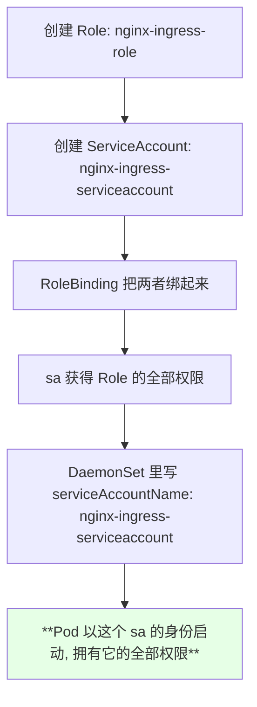

看一眼 ingress-nginx 的 DaemonSet：

```yaml
spec:
  template:
    spec:
      serviceAccountName: nginx-ingress-serviceaccount
      containers:
      - name: nginx-ingress-controller
        image: quay.io/kubernetes-ingress-controller/nginx-ingress-controller:0.26.1
```

```text
整条链路:

Role（权限）
   ↓ RoleBinding
ServiceAccount（身份）
   ↓ Pod spec.serviceAccountName
Pod（运行时拥有了这些权限）
```

**不指定 `serviceAccountName` 的话，Pod 会以 default 这个 ServiceAccount 启动，而 default 基本没有任何权限。**

## 管理员是怎么来的：admin-user 的完整链路

装 Dashboard 之后创建的管理员用户，本质就是下面这一套：

```bash
kubectl get clusterrolebinding admin-user -o yaml
kubectl get sa -n kube-system
kubectl get clusterrole cluster-admin -o yaml
```

```yaml
apiVersion: rbac.authorization.k8s.io/v1
kind: ClusterRoleBinding
metadata:
  name: admin-user
roleRef:
  apiGroup: rbac.authorization.k8s.io
  kind: ClusterRole
  name: cluster-admin
subjects:
- kind: ServiceAccount
  name: admin-user
  namespace: kube-system
```

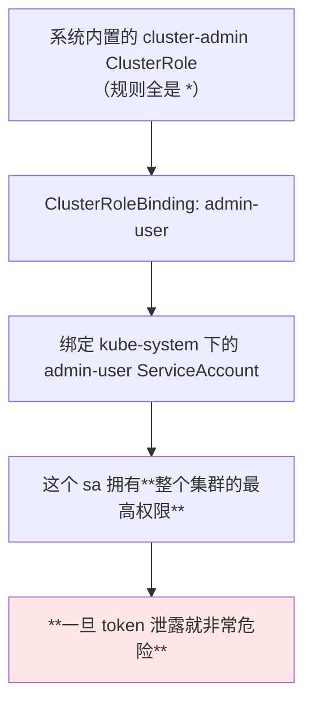

`cluster-admin` 的权限规则长这样：

```yaml
rules:
- apiGroups:
  - "*"
  resources:
  - "*"
  verbs:
  - "*"
- nonResourceURLs:
  - "*"
  verbs:
  - "*"
```

| `*` 出现在哪 | 含义 |
| --- | --- |
| `apiGroups: ["*"]` | 所有 API 组 |
| `resources: ["*"]` | 所有资源 |
| `verbs: ["*"]` | 所有操作 |
| `nonResourceURLs: ["*"]` | 所有下级 / 非资源端点 |

课程原话：**「这个权限是非常非常高的，用的时候千万不能遗漏，一旦泄露就很危险」**。

## Secret 里的 token 与 Dashboard 登录

创建一个 ServiceAccount 之后，**会生成一个以 SA 名开头的 Secret**，里面带着 token（注意：Kubernetes **1.24+ 不再自动创建** SA 的 token Secret，需改用 `kubectl create token <sa名>` 临时签发，或走 TokenRequest API）：

```bash
kubectl create sa test
kubectl get secret
kubectl describe secret test-token-xxxxx
```

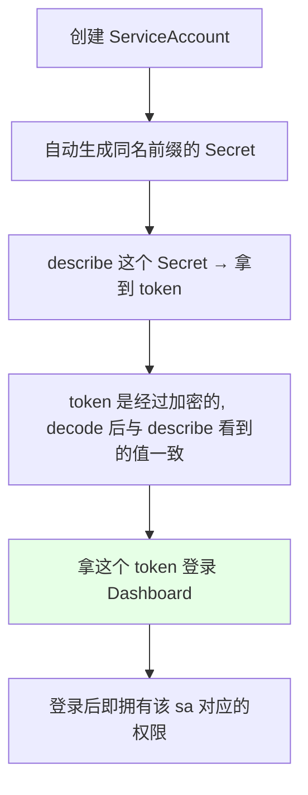

实际用途非常明确 —— 课程里讲的场景：

```text
为什么要给开发配权限:

开发的 Pod 部署在 K8s 上之后, 开发**根本不知道自己的应用跑在哪台机器上**
   ⇒ 想看日志 / 执行命令 / 做 debug, 只能进容器
   ⇒ 但没人希望开发直接 ssh 服务器

于是: 用 RBAC 建一套只读/受限的 Role, 绑给一个 SA
      把 SA 的 token 给到开发
      ⇒ 开发在 Dashboard（kubernetes-dashboard）上看日志、执行命令
        完全不用登服务器
```

| 环境 | 通常做法 |
| --- | --- |
| 生产集群 | 一般有日志收集（ELK），去 ELK 看日志 |
| 开发 / 测试集群 | 没有完整日志体系，让开发用 Dashboard 更方便 |

> 但要注意：**任何人都不该一直用 `cluster-admin`** —— 课程原话「我们不可能给每个人用这个 cluster-admin 的」，正确做法是照着同样的流程创建一堆细分的 Role / ClusterRole 给不同的人。

## K8s 没有 user，只有第三方或 token

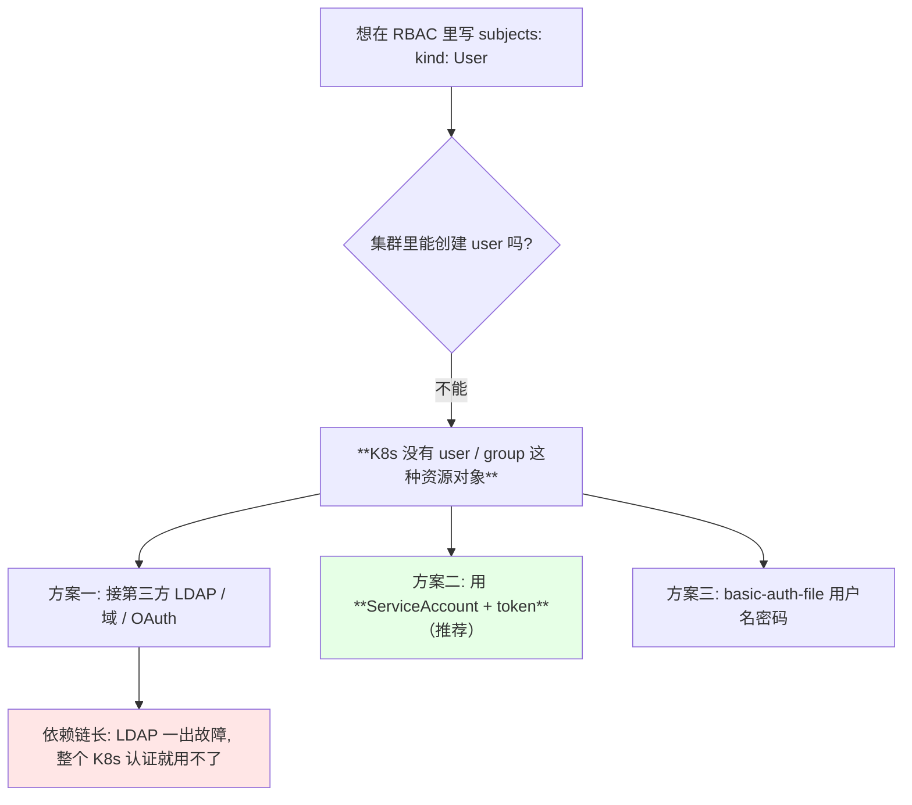

课程结论：**「更倾向于使用 ServiceAccount 进行验证，使用 token 进行登录，这种方式是最好的 —— 它不依赖任何第三方的工具就可以实现权限认证」**。

## basic-auth-file 为什么不好用

Dashboard 默认只启用了 token 认证，想用账号密码得额外打开 basic auth，而它有个硬伤：

```text
basic-auth-file 的格式（每行一个账号）:

密码,用户名,用户ID,"组1,组2,组3"

例:
xxxxpasswd,devuser,10001,"dev,ops"
```

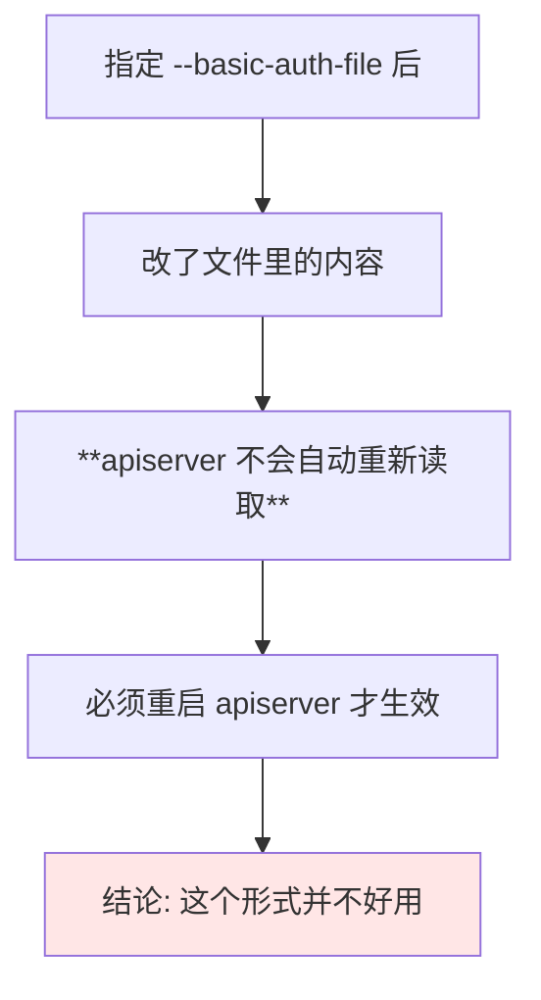

| 方案 | 是否自动热加载 | 推荐度 |
| --- | --- | --- |
| ServiceAccount token | 天然支持 | **推荐** |
| basic-auth-file | **必须重启 apiserver** | 不推荐 |
| 第三方 LDAP / OAuth | 依赖外部组件 | 看公司基建 |

## API 速览

| 能力 | 做法 | 关键点 |
| --- | --- | --- |
| 确认 RBAC 已启用 | 看 apiserver 的 `--authorization-mode` | 含 `RBAC` 即可 |
| 看四类资源 | `kubectl get roles,clusterroles,rolebindings,clusterrolebindings -A` | — |
| 看某个角色 | `kubectl get role <NAME> -n <NS> -o yaml` | 重点看 `rules` |
| 看集群角色 | `kubectl get clusterrole <NAME> -o yaml` | 与 Role 写法一致 |
| 看绑定关系 | `kubectl get rolebinding <NAME> -n <NS> -o yaml` | 看 `roleRef` 与 `subjects` |
| 查权限是否生效 | `kubectl auth can-i get pods --as=system:serviceaccount:<NS>:<SA>` | 排权限问题的利器 |
| 创建 ServiceAccount | `kubectl create sa <NAME>` | 会自动生成 token Secret |
| 取 token | `kubectl describe secret <SA>-token-xxxx` | 用于 Dashboard 登录 |
| 给 Pod 指定身份 | Pod spec 里 `serviceAccountName` | 不写就用 default |
|查 Default 权限 | default sa 几乎无权限 | 这是「Pod 里 kubectl 报 403」的根因 |

字段速查：

| 字段 | 作用 |
| --- | --- |
| `rules[].apiGroups` | 资源所属的 API 组，核心组写 `""` |
| `rules[].resources` | 资源类型，可写子资源如 `pods/log` |
| `rules[].verbs` | 允许的操作：`get` / `list` / `watch` / `create` / `update` / `delete` |
| `rules[].resourceNames` | **把权限收敛到指定的那一个资源上** |
| `roleRef` | Binding 里指向哪个 Role / ClusterRole |
| `subjects[]` | 绑定到谁：`User` / `Group` / `ServiceAccount` |
| `serviceAccountName` | Pod 以哪个 sa 的身份运行 |

## Demo 示例

```bash
# 1. 确认集群启用了 RBAC
ps aux | grep kube-apiserver | tr ' ' '\n' | grep authorization

# 2. 看集群里现成的 Role / ClusterRole
kubectl get roles -A
kubectl get clusterroles | head -20
kubectl get role nginx-ingress-role -n ingress-nginx -o yaml

# 3. 看绑定关系
kubectl get rolebinding -n ingress-nginx -o yaml
kubectl get clusterrolebinding admin-user -o yaml

# 4. 看内置 view / cluster-admin 的权限差异
kubectl get clusterrole view -o yaml
kubectl get clusterrole cluster-admin -o yaml

# 5. 写一个只给角度看与更新的 Role（见 rb-demo.yaml）并验证
kubectl create ns demo-ns
kubectl apply -f rb-demo.yaml
kubectl auth can-i get pods -n demo-ns --as=system:serviceaccount:demo-ns:demo-sa
kubectl auth can-i create deployments -n demo-ns --as=system:serviceaccount:demo-ns:demo-sa

# 6. 建 sa 拿 token（给 Dashboard 登录用）
kubectl create sa test
kubectl get secret | grep test
SECRET=$(kubectl get sa test -o jsonpath='{.secrets[0].name}')
kubectl describe secret "$SECRET"

# 7. 看 Pod 用的是哪个 sa
NS=ingress-nginx
POD=$(kubectl get pods -n "$NS" -o jsonpath='{.items[0].metadata.name}')
kubectl get pod "$POD" -n "$NS" -o jsonpath='{.spec.serviceAccountName}'; echo
```

```yaml
# rb-demo.yaml —— 一个只读+受限更新的完整 RBAC 示例
apiVersion: v1
kind: ServiceAccount
metadata:
  name: demo-sa
  namespace: demo-ns
---
apiVersion: rbac.authorization.k8s.io/v1
kind: Role
metadata:
  name: demo-view-role
  namespace: demo-ns
rules:
# 对 pods / services / configmaps 只有查看权
- apiGroups:
  - ""
  resources:
  - pods
  - pods/log
  - services
  - configmaps
  verbs:
  - get
  - list
  - watch
# 对 deployments 可以更新
- apiGroups:
  - apps
  resources:
  - deployments
  verbs:
  - get
  - list
  - update
# 用 resourceNames 把权限收敛到单个 ConfigMap
- apiGroups:
  - ""
  resources:
  - configmaps
  resourceNames:
  - demo-config
  verbs:
  - get
  - update
---
apiVersion: rbac.authorization.k8s.io/v1
kind: RoleBinding
metadata:
  name: demo-view-binding
  namespace: demo-ns
roleRef:
  apiGroup: rbac.authorization.k8s.io
  kind: Role
  name: demo-view-role
subjects:
- kind: ServiceAccount
  name: demo-sa
  namespace: demo-ns
---
apiVersion: apps/v1
kind: Deployment
metadata:
  name: demo-nginx
  namespace: demo-ns
  labels:
    app: demo-nginx
spec:
  replicas: 1
  selector:
    matchLabels:
      app: demo-nginx
  template:
    metadata:
      labels:
        app: demo-nginx
    spec:
      serviceAccountName: demo-sa
      containers:
      - name: nginx
        image: nginx:1.15.2
        imagePullPolicy: IfNotPresent
```

```text
四类资源的一张对照图:

                 定义权限                    把权限绑出去
                ─────────                ──────────────
namespace 级    Role                      RoleBinding
集群级          ClusterRole               ClusterRoleBinding

rules 写法 → 两边完全一致（唯一区别是作用域）
绑定主体 → User / Group / ServiceAccount
ClusterRole 也能被 RoleBinding 绑 → 于是可以只在单 namespace 生效
```

### 总结

- **RBAC 是 K8s 最常用的权限模型，四类顶级资源**：`Role`、`ClusterRole`、`RoleBinding`、`ClusterRoleBinding`，既能写 YAML 也能用 `kubectl create` 造；
- **Role 与 ClusterRole 的唯一区别就是作用域**（前者 namespace 隔离、后者作用于整个集群），`rules` 的写法**完全一样**；ClusterRole 最终作用在哪，取决于用 RoleBinding 还是 ClusterRoleBinding 去绑；
- **Role 里没有拒绝规则，只能追加允许**；一条 rule 由 `apiGroups` + `resources` + `verbs` 组成，**`resourceNames` 能把权限进一步收敛到单个资源**，`pods/log`、`pods/exec`、`xxx/status` 这类斜杠写法代表子资源；
- **权限不会自动生效，必须 binding 到 user / group / ServiceAccount 上**：`roleRef` 指角色、`subjects` 指被授权方，也可以跨 namespace 指定 ServiceAccount；
- **Pod 通过 `serviceAccountName` 声明身份，从而获得该 sa 的全部权限**，不写就用基本无权限的 default —— 这是「Pod 里执行 kubectl 报 403」的根因；
- **Kubernetes 本身没有 user / group 资源**，因此推荐 **ServiceAccount + token 登录 Dashboard**（不依赖第三方）；basic-auth-file 必须重启 apiserver 才生效、很不好用；`cluster-admin` 权限是整个集群的 `*` 全集，**千万不能随手发给所有人**。

