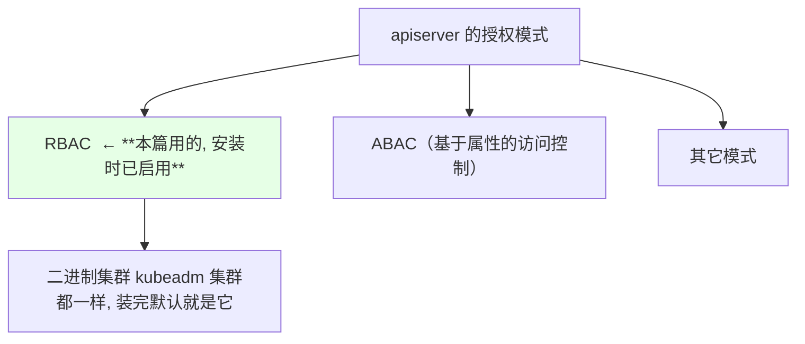
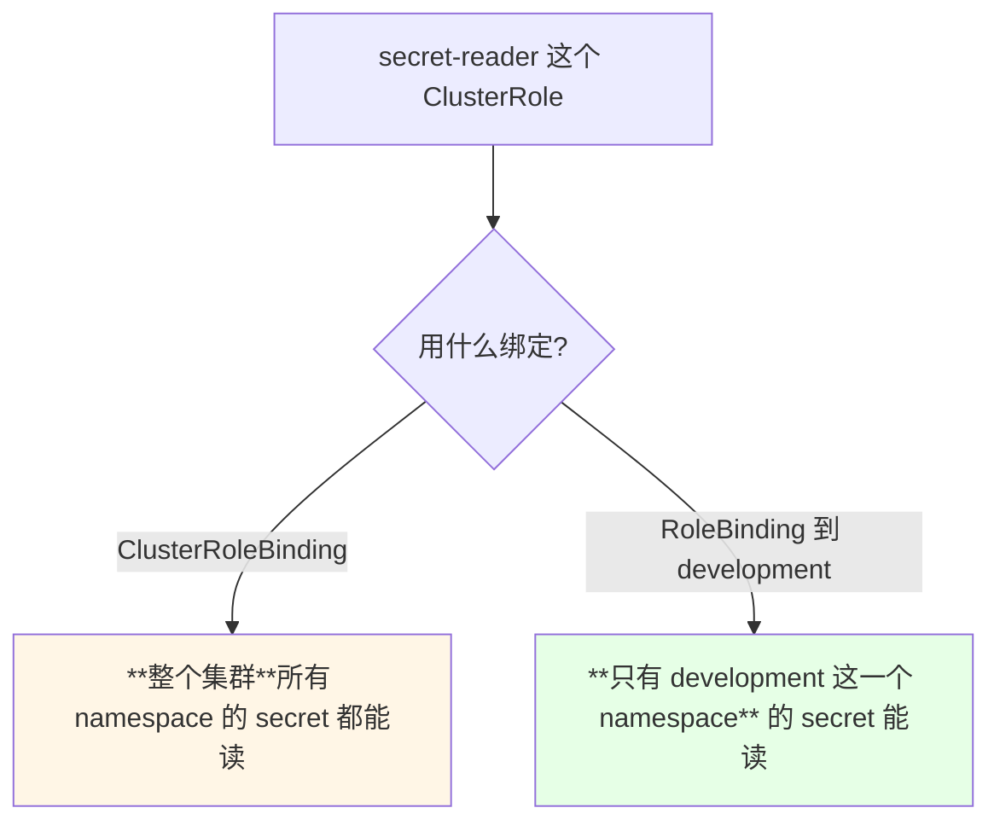
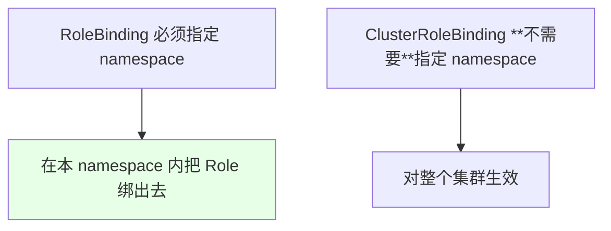
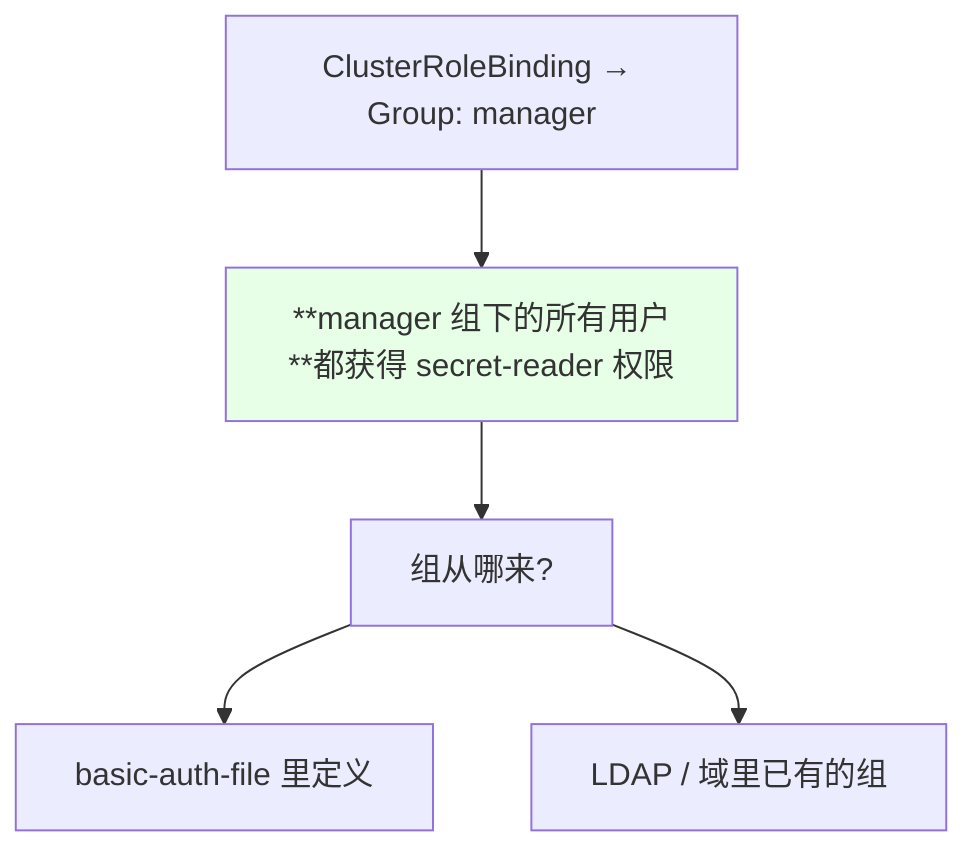
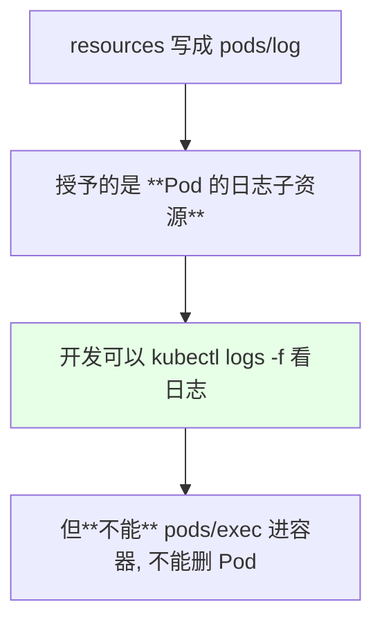
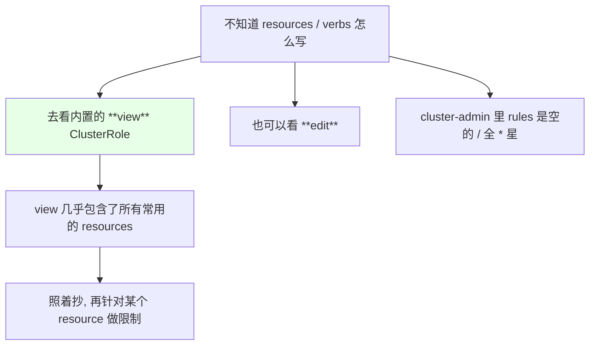
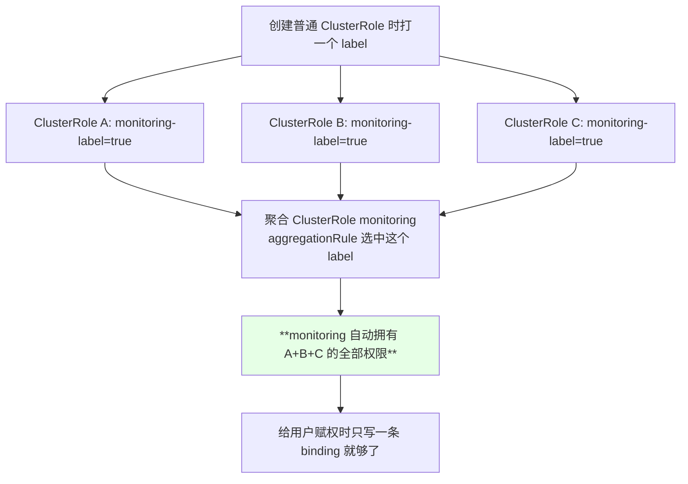
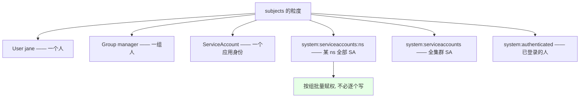
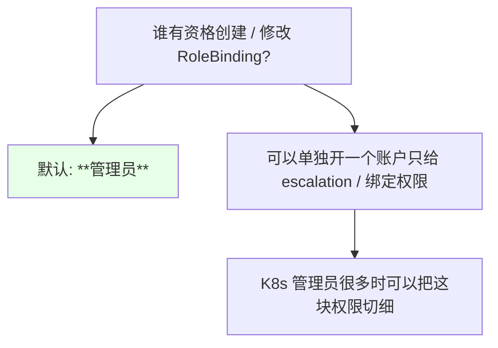
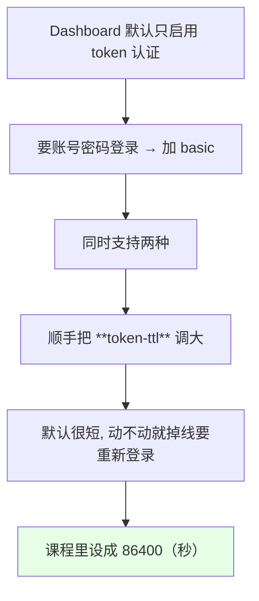

# Kubernetes 集群部署: RBAC 使用（官方写法拆解、subjects 的九种绑定形态与聚合 ClusterRole）

上一篇讲了 RBAC 的四个对象是干什么的，这一篇顺着官方文档的常见写法往下走：**每种权限到底怎么写、绑定用户的 `subjects` 有哪几种形态、`aggregate` 标签又是怎么把一堆角色合成一个的**。

结论先摆：

1. **apiserver 启动时 `--authorization-mode=RBAC`**（也有 ABAC 等其它模式），二进制安装时就已经启用了；
2. **Role / ClusterRole 的 `rules` 写法是同一套**，区别只在作用域；**不知道 `resources` 该写什么就去抄内置的 `view` 角色**，它几乎囊括了所有常用资源；
3. **下级资源用斜杠写**（`pods/log`、`deployments/scale`），给开发开「看日志」权限就靠它；
4. **`resourceNames` 能把权限精确收敛到单个对象**（比如某一个 ConfigMap）；
5. **`subjects` 是切片，可以写多个**：User / Group / ServiceAccount，还有 `system:serviceaccounts` 这种组级写法，能一次性给某 namespace 下所有 SA 赋权；
6. **聚合 ClusterRole 靠 label 把多个角色的权限合并**，配合一条 binding 就能给一个人塞很多权限；
7. **Dashboard 提前把 basic 认证打开时顺手把 `--token-ttl` 调大**（默认很短，动不动就掉线）。

## 纲要

- 前提：apiserver 已经启用 RBAC
- 写法一：default 命名空间下只读 Pod 的 Role
- 写法二：secret-reader 这个 ClusterRole
- RoleBinding 绑 User：jane 的例子
- ClusterRole 用 RoleBinding 绑：只在一个 ns 生效
- ClusterRoleBinding 绑 Group：整个组一起拿权限
- 下级资源：pods/log 给开发看日志
- resourceNames：精确到单个 ConfigMap
- 不知道 resources 写什么就看 view
- 聚合 ClusterRole：用 label 把权限合并
- apiGroups 什么时候才写
- subjects 的九种形态
- RoleBinding 本身谁能改
- Dashboard 的 basic 认证与 token-ttl

## 前提：apiserver 已经启用 RBAC

```bash
ps aux | grep kube-apiserver | tr ' ' '\n' | grep authorization
# --authorization-mode=Node,RBAC
```



## 写法一：default 命名空间下只读 Pod 的 Role

官方第一个示例（role example）：在 `default` namespace 建一个角色，只对 Pod 有 `get` / `watch` / `list` 权限。

```yaml
apiVersion: rbac.authorization.k8s.io/v1
kind: Role
metadata:
  namespace: default
  name: pod-reader
rules:
- apiGroups:
  - ""
  resources:
  - pods
  verbs:
  - get
  - watch
  - list
```

```text
role 的最简三段式:

metadata.namespace   ← Role 一定有 namespace（ClusterRole 则没有）
rules[].resources    ← 对什么资源：pods
rules[].verbs        ← 能做什么：get / watch / list
```

| 字段 | 值 | 含义 |
| --- | --- | --- |
| `apiGroups: [""]` | 空串 | 核心 API 组（Pod / Service / ConfigMap 都在这里） |
| `resources: ["pods"]` | pods | 资源类型 |
| `verbs` | get/watch/list | 只读，不含增删改 |

## 写法二：secret-reader 这个 ClusterRole

把作用域提到集群级，就变成了对**所有 namespace 下的 Secret** 都可读：

```yaml
apiVersion: rbac.authorization.k8s.io/v1
kind: ClusterRole
metadata:
  name: secret-reader
rules:
- apiGroups:
  - ""
  resources:
  - secrets
  verbs:
  - get
  - watch
  - list
```



> 这是理解 RBAC 最关键的一点：**ClusterRole 不是「必然作用于整个集群」，它最终作用于多少 namespace，由 Binding 的类型（RoleBinding 还是 ClusterRoleBinding）以及 Binding 所在的 namespace 决定。**

## RoleBinding 绑 User：jane 的例子

把刚才那个 `pod-reader` 绑给一个叫 `jane` 的用户：

```yaml
apiVersion: rbac.authorization.k8s.io/v1
kind: RoleBinding
metadata:
  name: read-pods
  namespace: default
subjects:
- kind: User
  name: jane
  apiGroup: rbac.authorization.k8s.io
roleRef:
  kind: Role
  name: pod-reader
  apiGroup: rbac.authorization.k8s.io
```



| Binding | 是否写 `metadata.namespace` | 生效范围 |
| --- | --- | --- |
| `RoleBinding` | **必须写** | 只在这一个 namespace |
| `ClusterRoleBinding` | **不写** | 整个集群 |

> 这里的 `jane` 可能来自自己定义的 basic-auth-file，也可能来自 LDAP / 域这类第三方 —— **Kubernetes 本身不认识这个用户，只负责按名字匹配**。

## ClusterRole 用 RoleBinding 绑：只在一个 ns 生效

官方的另一个例子：把 `secret-reader` 这个 ClusterRole，通过 **RoleBinding** 绑到 `development` namespace 下的 `dave` 用户：

```yaml
apiVersion: rbac.authorization.k8s.io/v1
kind: RoleBinding
metadata:
  name: read-secrets
  namespace: development
subjects:
- kind: User
  name: dave
  apiGroup: rbac.authorization.k8s.io
roleRef:
  kind: ClusterRole
  name: secret-reader
  apiGroup: rbac.authorization.k8s.io
```

```text
⇒ dave 只能读 development 这个 namespace 下的 secret
   其它 namespace 的 secret 一律看不到
```

**这是最推荐的生产用法：**一个通用的 ClusterRole 定义一次，在每个 namespace 里用 RoleBinding 分别绑给不同的人，不用重复写规则。

## ClusterRoleBinding 绑 Group：整个组一起拿权限

换成 ClusterRoleBinding，绑给一个叫 `manager` 的组：

```yaml
apiVersion: rbac.authorization.k8s.io/v1
kind: ClusterRoleBinding
metadata:
  name: read-secrets-global
subjects:
- kind: Group
  name: manager
  apiGroup: rbac.authorization.k8s.io
roleRef:
  kind: ClusterRole
  name: secret-reader
  apiGroup: rbac.authorization.k8s.io
```



| 绑定对象 | 效果 |
| --- | --- |
| `User: jane` | 只有 jane 一个人 |
| `Group: manager` | manager 组下的**所有人** |
| `ServiceAccount` | 某个具体的 SA |

## 下级资源：pods/log 给开发看日志

这类只读权限的典型场景是：**开发要能在 Dashboard 里 `kubectl logs -f` 看容器日志**。

```yaml
apiVersion: rbac.authorization.k8s.io/v1
kind: Role
metadata:
  namespace: default
  name: logs-reader
rules:
- apiGroups:
  - ""
  resources:
  - pods
  - pods/log
  verbs:
  - get
  - list
```



> 管理员用户当然什么日志都能看，但对别人来说要显式授予 —— **给开发开账户看容器日志，就是靠 `pods/log` + `get` + `list`**。

| 子资源写法 | 用途 |
| --- | --- |
| `pods/log` | 查看 Pod 日志 |
| `pods/exec` | 进容器执行命令（敏感，慎给） |
| `deployments/scale` | 扩缩容 Deployment |
| `xxx/status` | 更新状态子资源 |

## resourceNames：精确到单个 ConfigMap

```yaml
apiVersion: rbac.authorization.k8s.io/v1
kind: Role
metadata:
  namespace: default
  name: configmap-updater
rules:
- apiGroups:
  - ""
  resources:
  - configmaps
  resourceNames:
  - my-configmap
  verbs:
  - update
  - get
```

```text
效果:

这个 Role 对 configmaps 有 update + get 权限
   但**只对名为 my-configmap 的那一个 ConfigMap 生效**
   ⇒ 这就是「比较细粒度的权限划分」
```

## 不知道 resources 写什么就看 view

写 Role 卡壳最常遇到的是：**某个资源到底叫什么名字、verbs 该配哪几个**。



```bash
kubectl get clusterrole view -o yaml | less
kubectl get clusterrole edit -o yaml | less
```

| 内置角色 | 内容 |
| --- | --- |
| `view` | 只读，**resource 列表最全，抄它的资源名最省事** |
| `edit` | 可读写，同样是一份很好的模板 |
| `cluster-admin` | 全是 `*`，看不到具体 resources，不适合抄 |

## 聚合 ClusterRole：用 label 把权限合并



写法示意：

```yaml
# 1. 先给普通 ClusterRole 打标签（自己的监控类角色）
apiVersion: rbac.authorization.k8s.io/v1
kind: ClusterRole
metadata:
  name: monitoring-a
  labels:
    rbac.example.com/aggregate-to-monitoring: "true"
rules:
- apiGroups:
  - ""
  resources:
  - pods
  - services
  verbs:
  - get
  - list
  - watch
---
# 2. 聚合角色：不含具体 rules, 用 aggregationRule 选出同标签的角色
apiVersion: rbac.authorization.k8s.io/v1
kind: ClusterRole
metadata:
  name: monitoring
aggregationRule:
  clusterRoleSelectors:
  - matchLabels:
      rbac.example.com/aggregate-to-monitoring: "true"
rules: []
```

查看时可以用 `-l` 过滤自己打的标签：

```bash
kubectl get clusterroles -l rbac.example.com/aggregate-to-monitoring=true
kubectl get clusterrole monitoring -o yaml
```

> 聚合出来的角色会把所有符合标签的 ClusterRole 都归并进来，`verbs` 往往是 `get / list / watch / create / update / patch / delete` 一大串 —— **一个对象就能代表一堆权限**。

## apiGroups 什么时候才写

```mermaid
flowchart TD
    A["rules[].apiGroups 怎么填"] --> B["核心资源（Pod/Service/ConfigMap/Secret）"]
    B --> C["写 **\"\"**（空串）"]
    A --> D["apps 组（Deployment/StatefulSet）"]
    D --> E["写 **apps**"]
    A --> F["batch / extensions 这类"]
    F --> G["写对应的组名"]
    style C fill:#e6ffe6
```

> 课程原话：**「这个 apiGroup 一般情况下大部分都不写（核心组用空串），只有一些 extensions 或者 batch 的内容才会写」**。

## subjects 的九种形态

`subjects` 是切片，可以写多个。官方文档给的形式汇总：

| 形态 | 写法 | 作用范围 |
| --- | --- | --- |
| 单个用户 | `kind: User, name: alice` | 指定的那一个人 |
| 邮箱形式用户 | `kind: User, name: jane@example.com` | 同上 |
| 组 | `kind: Group, name: frontend-admins` | 组下所有用户 |
| 某个 SA | `kind: ServiceAccount, name: default, namespace: kube-system` | 该 namespace 下这个 SA |
| 当前 ns 的 SA | `kind: ServiceAccount, name: default`（**不写 namespace**） | 当前 namespace |
| 某 ns 下**所有** SA | `kind: Group, name: system:serviceaccounts:<NS>` | 该 ns 的每个 SA 各自获得权限 |
| 全集群所有 SA | `kind: Group, name: system:serviceaccounts` | 所有 namespace 的 SA |
| 已认证用户 | `kind: Group, name: system:authenticated` | 通过认证的所有用户 |
| 未认证用户 | `kind: Group, name: system:unauthenticated` | 一般**不给任何权限** |

```text
"给某 namespace 下所有 ServiceAccount 赋权" 的典型写法:

subjects:
- kind: Group
  name: system:serviceaccounts:development
  apiGroup: rbac.authorization.k8s.io

⇒ development 下有多少个 SA, 就有多少个 SA 获得这套权限
⇒ 做 Dashboard token 验证时非常有用 —— 不用一个一个赋
```



> `system:authenticated` 指登录过 / 通过认证的用户（比如用账号密码登录成功的）；加上 `system:unauthenticated` 就等于所有用户了。**未认证用户一般不给任何权限。**

## RoleBinding 本身谁能改



> 官方文档里这类「restrictions on role binding creation or update」的例子，用意就是：**把「能改权限」这件事本身也纳入 RBAC 管控**。

另外，`kubectl create` 也能直接造角色和绑定，不必写 YAML：

```bash
kubectl create clusterrole pod-reader --verb=get,list,watch --resource=pods
kubectl create rolebinding read-pods --clusterrole=pod-reader --user=jane --namespace=default
```

## Dashboard 的 basic 认证与 token-ttl

课程在结尾提前改了 Dashboard 的配置，为下章做铺垫：



对应 Dashboard 容器的启动参数：

```yaml
        args:
        - --authentication-mode=basic,token
        - --token-ttl=86400
```

```text
静态密码文件（basic-auth-file）的格式:

password,user,uid,"group"
password2,user2,10002,"group1,group2"

一行一个账号, 可以写多行
⇒ 写成 dotfile 交给 apiserver 的 --basic-auth-file
```

| 方案 | 改了要不要重启 apiserver | 生产建议 |
| --- | --- | --- |
| **ServiceAccount + token** | 不需要，**可动态创建 / 删除用户并赋权** | **推荐** |
| basic-auth-file | **必须重启 apiserver 才生效** | 不建议 |

> 官方文档原话大意：**密码改动后不重启 API server 就不生效**（`cannot be changed without restarting API server`）。课程也明确说：**「这个方式下一章会讲，但生产环境中还是不建议用」**。

顺带一提 Dashboard 的证书：**它自动生成自签证书，浏览器访问会报 HTTPS 证书未通过验证、被 Chrome 直接拒绝**。解决办法是配浏览器放行，或者换成公司自己的证书。

## API 速览

| 能力 | 做法 | 关键点 |
| --- | --- | --- |
| 看内置角色当模板 | `kubectl get clusterrole view -o yaml` | resource 名字最全 |
| 看 edit 角色 | `kubectl get clusterrole edit -o yaml` | 可读写模板 |
| 命令行造角色 | `kubectl create clusterrole <NAME> --verb=... --resource=...` | 快速调试 |
| 命令行造绑定 | `kubectl create rolebinding <NAME> --clusterrole=... --user=...` | RoleBinding 要带 `-n` |
| 验证权限 | `kubectl auth can-i <verb> <resource> -n <NS> --as=...` | 排权限必用 |
| 按标签查角色 | `kubectl get clusterroles -l <label>=true` | 聚合 ClusterRole 用 |
| 看聚合结果 | `kubectl get clusterrole monitoring -o yaml` | rules 会被自动填充 |
| 给开发开看日志 | resources 加 `pods/log`，verbs 加 `get`/`list` | 最常用的一条 |
| 精确到单对象 | `resourceNames` | 把权限收拢到指定对象 |

字段速查：

| 字段 | 作用 |
| --- | --- |
| `rules[].apiGroups` | 核心组 `""`，apps 组 `apps`，batch 组 `batch` |
| `rules[].resources` | 资源类型，可写 `pods/log` 这类子资源 |
| `rules[].verbs` | `get` / `list` / `watch` / `create` / `update` / `patch` / `delete` |
| `rules[].resourceNames` | **收敛到指定的那一个资源对象** |
| `aggregationRule.clusterRoleSelectors` | 聚合 ClusterRole 的标签选择器 |
| `metadata.labels` | 被聚合的普通 ClusterRole 上打的标签 |
| `subjects[]` | User / Group / ServiceAccount，**切片可写多个** |
| `roleRef` | 指向被绑定的 Role / ClusterRole |

## Demo 示例

```bash
# 1. 确认 RBAC 已启用
ps aux | grep kube-apiserver | tr ' ' '\n' | grep authorization

# 2. 抄内置 view 角色, 看看 pods/log 这类子资源怎么写
kubectl get clusterrole view -o yaml | grep -A6 "pods/log"

# 3. 命令行快速造一对 Role / RoleBinding
kubectl create ns demo-ns
kubectl create role pod-reader --verb=get,list,watch --resource=pods -n demo-ns
kubectl create rolebinding read-pods --role=pod-reader --user=jane -n demo-ns
kubectl get role,rolebinding -n demo-ns

# 4. 给开发开「只能看日志」的权限（应用 rbac-dev-logs.yaml 后验证）
kubectl apply -f rbac-dev-logs.yaml
kubectl auth can-i get pods/log -n demo-ns --as=devuser
kubectl auth can-i create pods -n demo-ns --as=devuser

# 5. 创建两条带标签的 ClusterRole + 一个聚合 ClusterRole
kubectl apply -f aggregate-clusterroles.yaml
kubectl get clusterroles -l rbac.example.com/aggregate-to-monitoring=true
kubectl get clusterrole monitoring -o yaml

# 6. 给某 namespace 下所有 ServiceAccount 一次性赋权
kubectl apply -f sa-group-binding.yaml
kubectl describe rolebinding sa-group-binding -n demo-ns

# 7. Dashboard 侧: 同时开 basic 与 token, 并把 token 有效期放宽
#    args: ["--authentication-mode=basic,token", "--token-ttl=86400"]
NS=kubernetes-dashboard
POD=$(kubectl get pods -n "$NS" -o jsonpath='{.items[0].metadata.name}')
kubectl get pod "$POD" -n "$NS" -o yaml | grep -A5 "args:"
```

```yaml
# rbac-dev-logs.yaml —— 给开发只读日志 + 精确的 ConfigMap 更新权限
apiVersion: rbac.authorization.k8s.io/v1
kind: Role
metadata:
  name: logs-reader
  namespace: demo-ns
rules:
- apiGroups:
  - ""
  resources:
  - pods
  - pods/log
  verbs:
  - get
  - list
- apiGroups:
  - ""
  resources:
  - configmaps
  resourceNames:
  - my-configmap
  verbs:
  - get
  - update
---
apiVersion: rbac.authorization.k8s.io/v1
kind: RoleBinding
metadata:
  name: dev-logs-binding
  namespace: demo-ns
subjects:
- kind: User
  name: devuser
  apiGroup: rbac.authorization.k8s.io
- kind: Group
  name: devs
  apiGroup: rbac.authorization.k8s.io
roleRef:
  kind: Role
  name: logs-reader
  apiGroup: rbac.authorization.k8s.io
```

```yaml
# aggregate-clusterroles.yaml —— 聚合 ClusterRole 的完整演示
apiVersion: rbac.authorization.k8s.io/v1
kind: ClusterRole
metadata:
  name: monitoring-a
  labels:
    rbac.example.com/aggregate-to-monitoring: "true"
rules:
- apiGroups:
  - ""
  resources:
  - pods
  - services
  verbs:
  - get
  - list
  - watch
---
apiVersion: rbac.authorization.k8s.io/v1
kind: ClusterRole
metadata:
  name: monitoring-b
  labels:
    rbac.example.com/aggregate-to-monitoring: "true"
rules:
- apiGroups:
  - ""
  resources:
  - nodes
  verbs:
  - get
  - list
---
apiVersion: rbac.authorization.k8s.io/v1
kind: ClusterRole
metadata:
  name: monitoring
aggregationRule:
  clusterRoleSelectors:
  - matchLabels:
      rbac.example.com/aggregate-to-monitoring: "true"
rules: []
```

```yaml
# sa-group-binding.yaml —— 一次性给某 namespace 下所有 ServiceAccount 赋权
apiVersion: rbac.authorization.k8s.io/v1
kind: RoleBinding
metadata:
  name: sa-group-binding
  namespace: demo-ns
subjects:
- kind: Group
  name: system:serviceaccounts:demo-ns
  apiGroup: rbac.authorization.k8s.io
roleRef:
  kind: ClusterRole
  name: secret-reader
  apiGroup: rbac.authorization.k8s.io
```

```text
ClusterRole 作用域取决于绑定的那张图:

         ClusterRole secret-reader
         ┌──── ClusterRoleBinding ────→ 整个集群所有 ns 的 secret
         │
         └──── RoleBinding(-n development) ──→ 只 development 的 secret

聚合 ClusterRole:
         monitoring-a (label 命中)  ┐
         monitoring-b (label 命中)  ├→ monitoring 自动合并权限
         monitoring-c (label 命中)  ┘
```

### 总结

- **RBAC 在 apiserver 侧以 `--authorization-mode=RBAC` 启用**（还有 ABAC 等其它模式），二进制集群安装时就已经配好了；
- **Role 与 ClusterRole 的 `rules` 是同一套写法**，只是作用域不同；**ClusterRole 被 ClusterRoleBinding 绑就是全集群、被 RoleBinding 绑就只在那一个 namespace 生效** —— 这是最推荐的复用方式；
- **``resources`` 不知道写什么就去抄内置的 `view` 角色**（`edit` 也行），它几乎囊括所有常用资源；**子资源用斜杠写**（`pods/log`、`deployments/scale`），给开发开看日志权限就是 `pods/log` + `get`/`list`；
- **`resourceNames` 是权限收口的利器**，能把 `update` / `get` 精确到某单个对象；
- **`subjects` 是切片、可写多个**，形态包括 User / Group / ServiceAccount，还有 `system:serviceaccounts:<NS>`（某 ns 全部 SA）、`system:serviceaccounts`（全集群 SA）、`system:authenticated` 等；**Group 形态尤其适合 Dashboard token 场景，不用逐个赋权**；
- **聚合 ClusterRole 通过 `aggregationRule.clusterRoleSelectors` 匹配带同类 label 的 ClusterRole，把权限自动合并**，一条 binding 就能塞下很多权限；
- **Dashboard 若要支持账号密码得加 basic 认证并顺手放大 `--token-ttl`**（默认极短，频繁掉线）；但 **basic-auth-file 改完必须重启 apiserver 才生效，生产不推荐**，还是应该用 **ServiceAccount + token**，可以动态建删用户与赋权。

