# Kubernetes 集群部署: 定义一个 Pod（Pod 资源清单字段逐条解读与创建流程）

Pod 的概念讲完了，这一节动手**把它定义出来**：从一份完整的 Pod yaml 出发，把每一段字段是干什么的、哪些必填、哪些能省，一路过一遍，最后真正 `kubectl create` 起来看状态、看标签、看日志，再删掉。

结论先摆：

1. **建议一律用 yaml 创建资源**，不要用一长串 `kubectl run` 参数 —— yaml **可追溯、可写到不同 namespace、配置项一目了然**（json 那一堆花括号看久了会晕）；
2. **`apiVersion` + `kind` 是两个不可少的顶字段**；1.16 之后几乎所有 `extensions/v1beta1` 都废弃了，统一用 v1（如 Deployment 也是 `apps/v1`）；
3. **`metadata.name` 要符合 DNS-1035 标准**：小写字母、不能有大写/特殊字符/下划线、**不能以数字开头**，横线可以；
4. **`namespace` 一般不在文件里写，改用 `-n` 参数指定** —— 同一份文件要创建到不同 namespace 时不用改文件；
5. **`spec.containers` 是数组（至少一个），`initContainers` 也是数组（可多个）**，每个容器 `name` 不能重复；横线代表一条切片元素、同级元素对齐；
6. **生产里几乎不用裸 Pod 部署应用**（没有弹性、升级、回滚），实际都用 Deployment / StatefulSet / DaemonSet；但 **Pod 的每个配置项一定要会**，因为它会原样搬到工作负载的 Pod 模板里用。

## 纲要

- 为什么用 yaml 而不是命令行
- Pod 清单的整体骨架
- apiVersion 与 kind：必填的两行
- metadata：name / namespace / labels / annotations
- spec 之下：initContainers 与 containers
- 容器字段：name / image / imagePullPolicy
- command 与 args：entrypoint 与 CMD
- workingDir / volumeMounts / ports
- env 环境变量
- resources 请求与限制
- 三个探针与 lifecycle
- restartPolicy / nodeSelector / imagePullSecrets / hostNetwork / volumes
- 精简一份可提交的清单
- 创建、观察、删除的完整流程

## 为什么用 yaml 而不是命令行

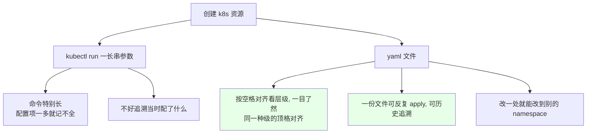

```text
yaml 的层级怎么读（就是靠空格对齐）:

apiVersion: v1          ← 一级
kind: Pod               ← 一级
metadata:               ← 一级
  name: nginx-demo      ← 二级（比 metadata 多两空格）
  labels:               ← 二级
    app: nginx          ← 三级
spec:                   ← 一级
  containers:           ← 二级
  - name: nginx         ← 二级+横杠 = 切片元素, 与 containers 同级
    image: nginx        ← 三级
```

## Pod 清单的整体骨架

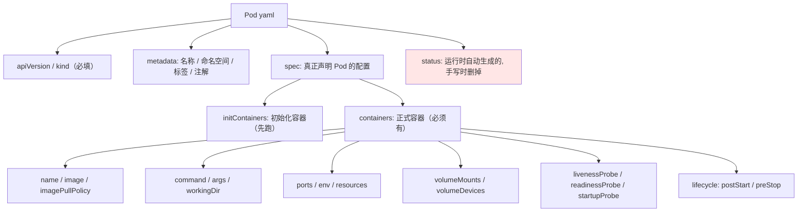

```text
一份 Pod 清单的完整字段树:

├── apiVersion: v1                      ← 必填
├── kind: Pod                           ← 必填
├── metadata
│   ├── name                            ← 必填, 符合 DNS-1035
│   ├── namespace                       ← 一般不用 -n 指定
│   ├── labels                          ← app=nginx, role=frontend
│   └── annotations                     ← 随便写, 无格式要求
└── spec                                ← 真正声明的地方
    ├── initContainers                  ← 数组, 可多个, 启动前跑
    ├── containers                      ← 数组, 至少 1 个
    │   ├── name                        ← 容器内唯一
    │   ├── image                       ← 镜像地址
    │   ├── imagePullPolicy             ← IfNotPresent / Always / Never
    │   ├── command                     ← 相当于 entrypoint
    │   ├── args                        ← 相当于 CMD
    │   ├── workingDir                  ← 工作目录
    │   ├── ports                       ← 切片, 可多个
    │   ├── env                         ← 切片, map 形式
    │   ├── resources                   ← requests / limits
    │   ├── volumeMounts                ← 挂载点
    │   ├── livenessProbe / readinessProbe / startupProbe
    │   └── lifecycle                   ← postStart / preStop
    ├── restartPolicy                   ← Always / OnFailure / Never
    ├── nodeSelector                    ← 按节点标签选节点
    ├── imagePullSecrets                ← 私有仓库账号密码
    ├── hostNetwork                     ← 用宿主机网络
    └── volumes                         ← 存储卷
```

## apiVersion 与 kind：必填的两行

```yaml
apiVersion: v1
kind: Pod
```

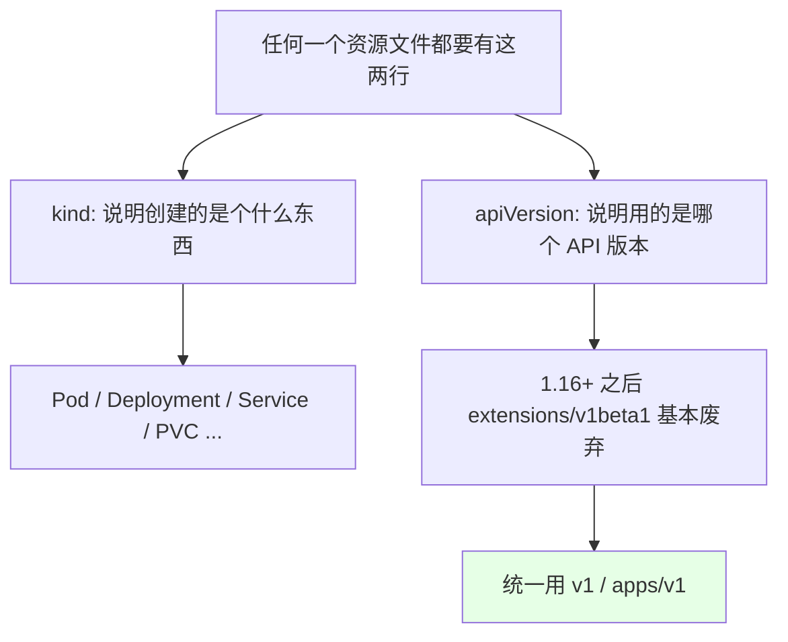

| 版本 | 说明 |
| --- | --- |
| `extensions/v1beta1` | 老版本，1.16 之后基本全部废弃 |
| `v1` | **Pod / Service / ConfigMap / PVC 等核心资源** |
| `apps/v1` | **Deployment / StatefulSet / DaemonSet / ReplicaSet** |

所以课程里那句：**1.16 之后几乎所有 extension 都放弃了，都是用 v1**。

## metadata：name / namespace / labels / annotations

```yaml
metadata:
  name: nginx-demo
  namespace: default
  labels:
    app: nginx
    role: frontend
  annotations:
    k8s.easymehub.cn/version: "1.15.2"
    gitcommit: abc123def
```

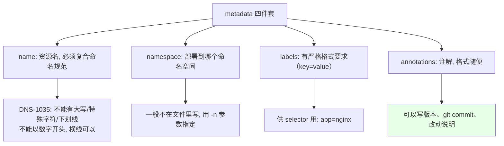

**`labels` 与 `annotations` 的区别**是这一节的考点：

| 字段 | 格式要求 | 用途 |
| --- | --- | --- |
| `labels` | **严格**，`key=value` 形式（`app=nginx`） | 供 selector 筛选、控制器认领 |
| `annotations` | **没有任何格式要求**，大写、中文、多行都行 | 写备注（如当前 nginx 版本、发版对应的 git commit） |

```bash
# namespace 一般不在 yaml 里写, 用命令参数
kubectl create -f nginx-demo.yaml -n foo-public

# 命名空间不存在就先建
kubectl create namespace nsname
```

> 课程里的做法：把 yaml 里的 `namespace` 那行**注释掉**，因为同一个 Pod 模板可能要创建到不同 namespace，写死在文件里改起来麻烦。

## 容器字段：name / image / imagePullPolicy

```yaml
  containers:
  - name: nginx
    image: nginx:1.15.2
    imagePullPolicy: IfNotPresent
```

```text
数组（切片）的写法要点:

- 横线开头 = 一个切片元素
- 多个横线元素之间是对齐的, 属于同级
- containers 和 initContainers 都是数组, 说明「可以配置多个」
- 一个 initContainer 的配置体里, 又可以是两个容器配置的「壳」
```

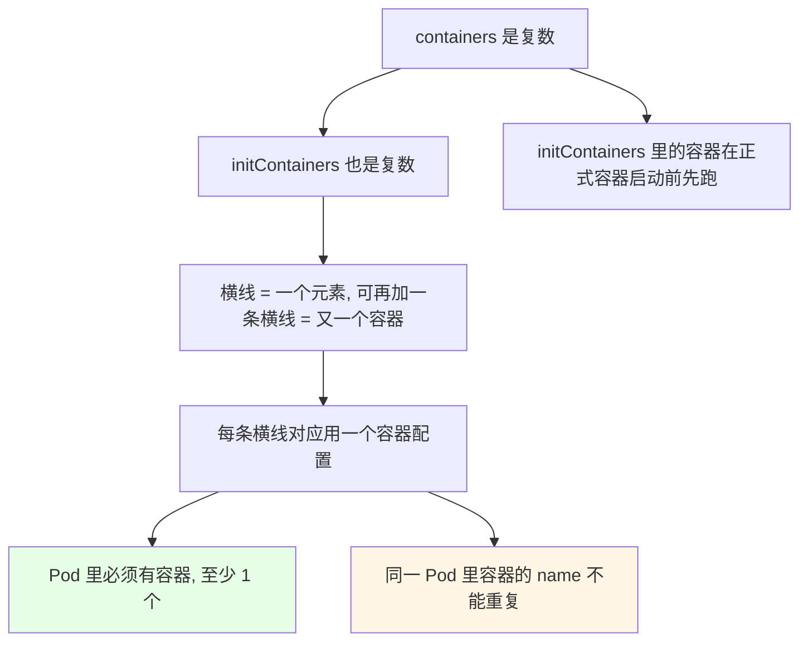

| `imagePullPolicy` | 行为 | 适用 |
| --- | --- | --- |
| `IfNotPresent` | **宿主机有就不拉**，省时间 | 最常用（生产、固定版本） |
| `Always` | 无论有没有都去拉 | 镜像 tag 是 `latest` 时默认就是它 |
| `Never` | 从不拉取，只用本地已有镜像 | 离线环境 |

关于 `image`：

- **不带 registry 前缀（不加 URL）就默认从 Docker Hub 官方源拉**；
- **生产一般用自己的镜像仓库（私有仓库）**，业务镜像**最好不要放到公网上**，容易造成代码泄露；
- 私有仓库的账号密码要配 **`imagePullSecrets`**（后面 Secret 章节讲）。

`command` 与 `args` 是另一组重点：

```yaml
    command: ["nginx", "-g", "daemon off;"]
    # 或 args 形式
    args: ["-g", "daemon off;"]
```

```mermaid
flowchart TD
    A["容器里必须有前台进程"] --> B["nginx 默认是后台 daemon"]
    B --> C1["不写前台启动 → 命令一执行完容器就退出了"]
    C1 --> C2["所以要 nginx -g \"daemon off;\" 让它前台跑"]
    A --> D["command ≈ 镜像里的 ENTRYPOINT"]
    A --> E["args ≈ 镜像里的 CMD"]
    style C2 fill:#e6ffe6
```

课程里的取舍：**做业务镜像时可以把启动命令打进镜像**（那就不用在 yaml 里写 `command`）；没打进去的话 **yaml 里一定要配上 `command`**。

## ports / env / workingDir / volumeMounts

```yaml
    workingDir: /usr/share/nginx/html
    ports:
    - name: http
      containerPort: 80
      protocol: TCP
    - name: https
      containerPort: 443
      protocol: TCP
    env:
    - name: TZ
      value: Asia/Shanghai
    - name: LANG
      value: en_US.UTF-8
    volumeMounts:
    - name: data
      mountPath: /data
```

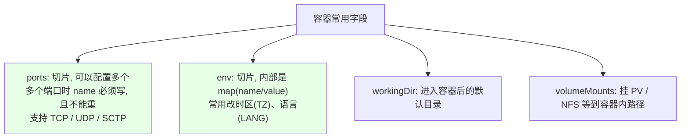

> **ports 的坑**：配置多个端口时**一定要写 `name`**，而且名字不能重复，否则可能起不来。

## resources：请求与限制

```yaml
    resources:
      requests:
        cpu: 100m
        memory: 128Mi
      limits:
        cpu: 1000m
        memory: 512Mi
```

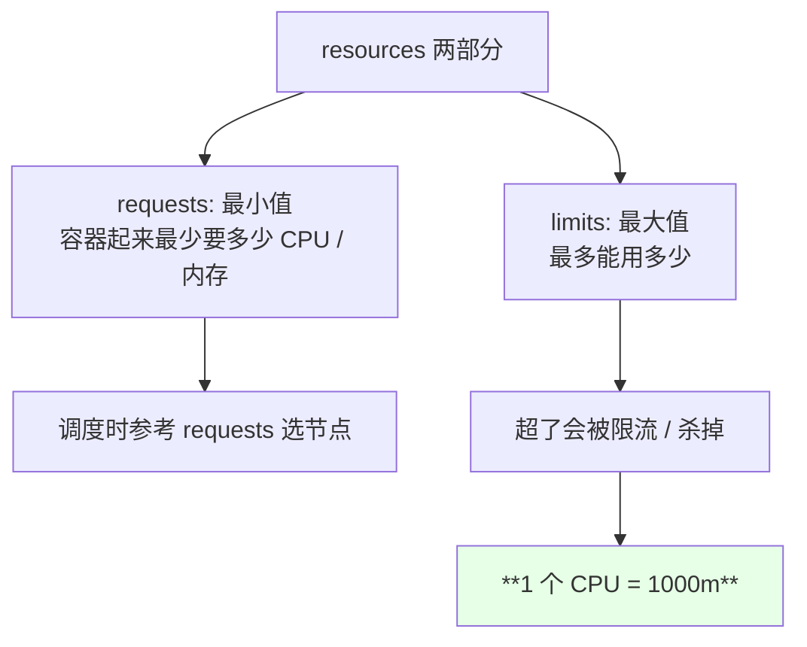

课程提醒两个点：**`1 CPU = 1000m`**（所以 `100m` = 0.1 核）；资源这块的完整玩法（QoS 那一套）后面有专门章节讲。

## 三个探针与 lifecycle

```yaml
    startupProbe:
      httpGet:
        path: /
        port: 80
    readinessProbe:
      httpGet:
        path: /
        port: 80
    livenessProbe:
      tcpSocket:
        port: 80
    lifecycle:
      postStart:
        exec:
          command: ["/bin/sh", "-c", "echo started"]
      preStop:
        exec:
          command: ["/bin/sh", "-c", "sleep 10"]
```

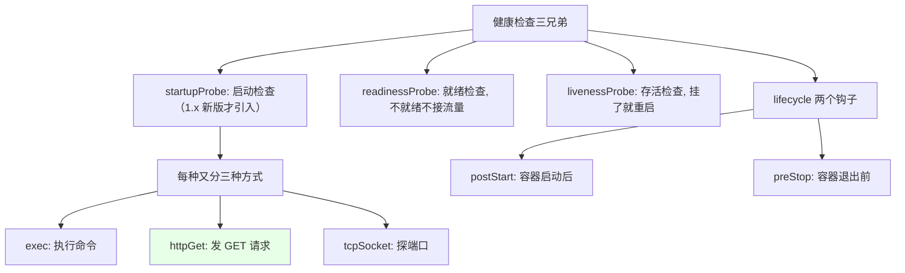

这几个字段课程里都**先不展开**（后面有专门的探针课时和零宕机课时），但位置要先认得。

## 其他 spec 字段

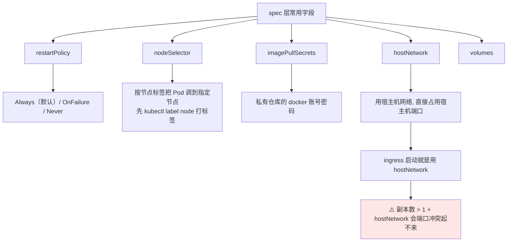

| 字段 | 取值 / 说明 |
| --- | --- |
| `restartPolicy` | `Always`（默认，容器故障/没起来自动重启）、`OnFailure`（异常退出码非 0 才重启）、`Never`（从不重启） |
| `nodeSelector` | 如 `region: shanghai`，配合 `kubectl label node` 使用 |
| `imagePullSecrets` | 私有仓库账号密码（Secret 章节展开） |
| `hostNetwork: true` | 用宿主机网络、**直接占宿主机的 80 端口**；副本 > 1 会端口冲突 |
| `volumes` | 存储卷配置（存储章节展开） |

`nodeSelector` 的用法：

```bash
# 先看节点标签
kubectl get node --show-labels
# 给节点打标签
kubectl label node k8s-node01 region=shanghai
# yaml 里写
#   nodeSelector:
#     region: shanghai
# → Pod 只会调度到带这个标签的节点
```

## 精简一份可提交的清单

```yaml
apiVersion: v1
kind: Pod
metadata:
  name: nginx-demo
  labels:
    app: nginx
    role: frontend
spec:
  containers:
  - name: nginx
    image: nginx:1.15.2
    imagePullPolicy: IfNotPresent
    command: ["nginx", "-g", "daemon off;"]
    ports:
    - name: http
      containerPort: 80
```

```text
从完整清单到精简清单（课程里的取舍）:

没有配置           → 原因
────────────────────────────────────────────
initContainers     → 有单独课时, 本节先不管
volumes            → 存储章节再讲
resources          → QoS 章节再讲（配置写起来大, 先省）
探针 probes        → 后面专门课时
lifecycle          → 后面专门课时
namespace          → 改用 -n 参数指定
```

## 创建、观察、删除的完整流程

```bash
# 1. 用清单创建（create：同名的会报错）
kubectl create -f nginx-demo.yaml
# Error from server (AlreadyExists): pods "nginx-demo" already exists

# 2. 已经存在还想改配置 → 用 apply 替换
kubectl apply -f nginx-demo.yaml

# 3. 看状态（刚起时是 ContainerCreating = 正在拉镜像）
kubectl get pod
# NAME         READY   STATUS              RESTARTS   AGE
# nginx-demo   0/1     ContainerCreating   0          10s
# nginx-demo   1/1     Running             0          30s

# 4. 看标签有没有生效
kubectl get pod --show-labels
# app=nginx,role=frontend

# 5. 看日志（这条镜像没请求, 所以没日志）
kubectl logs -f nginx-demo

# 6. 删掉（大概等 30 秒走完清理）
kubectl delete pod nginx-demo
```

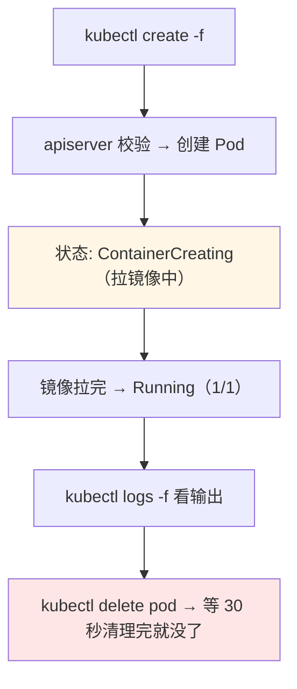

```bash
# 创建到别的 namespace
kubectl create -f nginx-demo.yaml -n foo-public
# 没有这个 namespace 就先建
kubectl create namespace nsname
kubectl create -f nginx-demo.yaml -n nsname
# 文件里已经有的 Pod 再创建一次 → 报 AlreadyExists
# 改了配置（比如加个 replicas=2）再 apply → 提示已被配置, 但其实没生效
```

```text
create 与 apply 在 Pod 上的区别:

kubectl create -f
   ├── 资源已存在 → 直接报错 AlreadyExists
   └── 适合一次性新建

kubectl apply -f
   ├── 不存在 → 创建
   └── 已存在 → 相当于 replace 覆盖
   └── 但 Pod 的部分字段不可变, 改了也不会生效
```

## 生产里的真实用法

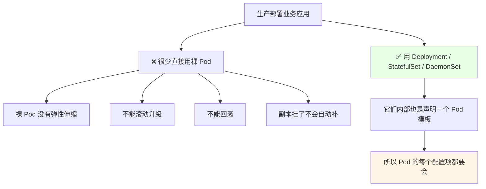

```text
裸 Pod 的定位:

✅ 适合: 调试程序时临时起一个
❌ 不适合: 部署生产业务

生产用:
├── Deployment   ← 无状态
├── StatefulSet  ← 有状态
└── DaemonSet    ← 每节点一个

这三者内部都有「pod 模板」, 本次学的每个字段
（image / ports / env / resources / probes ...）
直接搬到 template.spec 里就能用
```

## API 速览

| 能力 | 做法 | 关键点 |
| --- | --- | --- |
| 用清单创建 | `kubectl create -f <文件>` | 同名会报 AlreadyExists |
| 已存在改配置 | `kubectl apply -f <文件>` | 部分字段不可变 |
| 指定 namespace | `kubectl create -f <文件> -n <命名空间>` | **推荐用它，文件里别写死** |
| 建命名空间 | `kubectl create namespace <名>` | 没有就先建 |
| 看状态 | `kubectl get pod` | 看 STATUS（ContainerCreating → Running） |
| 看标签 | `kubectl get pod --show-labels` | 验证 labels 有没有写对 |
| 看日志 | `kubectl logs -f <Pod>` | 多容器要带 `-c` |
| 删除 | `kubectl delete pod <Pod>` | 大约 30 秒走完 |
| 看节点标签 | `kubectl get node --show-labels` | 配合 nodeSelector |
| 打节点标签 | `kubectl label node <节点> <key>=<value>` | — |
| 建镜像密钥 | `imagePullSecrets`（Secret 章节） | 私有仓库用 |

Pod 字段速查：

| 字段 | 必填 | 说明 |
| --- | --- | --- |
| `apiVersion` / `kind` | **是** | 1.16+ 统一 v1 |
| `metadata.name` | **是** | DNS-1035：小写、无下划线、非数字开头 |
| `spec.containers` | **是** | 数组，至少 1 个，name 唯一 |
| `spec.initContainers` | 否 | 数组，启动前跑 |
| `image` | **是** | 不带地址默认 Docker Hub |
| `imagePullPolicy` | 否 | IfNotPresent / Always / Never |
| `command` / `args` | 否 | ENTRYPOINT / CMD，容器必须有前台进程 |
| `ports` | 否 | 多端口时 **name 必写且唯一** |
| `env` | 否 | 切片 + name/value |
| `resources` | 否 | requests / limits，**1 CPU = 1000m** |
| `restartPolicy` | 否 | Always（默认）/ OnFailure / Never |
| `nodeSelector` | 否 | 按节点标签选节点 |
| `hostNetwork` | 否 | 占宿主机端口，副本 >1 会冲突 |
| `status` | — | 运行时自动生成，手写清单删掉 |

## Demo 示例

```bash
# 1. 准备一个 namespace
kubectl create namespace nsname

# 2. 用精简清单创建（namespace 用 -n 指定, 文件里不写死）
kubectl create -f nginx-demo.yaml -n nsname

# 3. 观察状态
kubectl get pod -n nsname
kubectl get pod -n nsname --show-labels

# 4. 重复创建会报错, 改用 apply
kubectl create -f nginx-demo.yaml -n nsname
kubectl apply -f nginx-demo.yaml -n nsname

# 5. 看日志 / 访问测试
kubectl logs -f nginx-demo -n nsname

# 6. 清理
kubectl delete -f nginx-demo.yaml -n nsname
kubectl delete namespace nsname
```

```text
一次创建 Pod 的完整落地过程:

1. 写 yaml（apiVersion / kind / metadata / spec 四块）
2. kubectl create -f xxx.yaml
      └── 同名 → AlreadyExists, 要换名字或用 apply
3. kubectl get pod
      └── ContainerCreating（正在拉镜像）
      └── Running（拉完 + 前台进程跑住）
4. kubectl get pod --show-labels
      └── 看到 app=nginx, role=frontend
5. kubectl logs -f nginx-demo
6. kubectl delete pod nginx-demo
      └── 约 30 秒后彻底消失
```

### 总结

- **一律用 yaml 创建资源**：按空格对齐的层级比 json 的花括号清晰得多，**可追溯、一份文件能重复 apply、还能用 `-n` 参数丢到不同 namespace**，比一长串 `kubectl run` 参数靠谱；
- **`apiVersion` + `kind` 是必填的两行**，1.16 之后 `extensions/v1beta1` 基本全废弃，核心资源用 `v1`、工作负载用 `apps/v1`；
- **`metadata.name` 要符合 DNS-1035**（小写、无大写无特殊字符无下划线、**不能数字开头**）；**`namespace` 建议别写进文件，用 `-n` 指定**；`labels` 格式严格（`app=nginx`，供 selector 用），**`annotations` 完全自由**（写版本、git commit、改动说明都行）；
- **容器段是数组**：`containers` 至少 1 个且 name 唯一，`initContainers` 可多个且在正式容器启动前跑；**`image` 不带地址默认走 Docker Hub，业务镜像走私有仓库别放公网**；`imagePullPolicy` 最常用 `IfNotPresent`，`latest` 默认 `Always`；
- **`command` ≈ ENTRYPOINT、`args` ≈ CMD**，容器里**必须有前台进程**（nginx 要写 `nginx -g "daemon off;"`），否则命令一跑完容器就退出了；多端口时 `ports` 的 **`name` 必写且不能重**；`resources` 里 **1 CPU = 1000m**；
- **生产几乎不用裸 Pod**（没有弹性、滚动升级、回滚、自愈），业务一律交给 Deployment / StatefulSet / DaemonSet —— 但它们内部都是「声明一个 Pod 模板」，所以**本次学的每个 Pod 配置项都必须会，直接搬到 `template.spec` 里用**。

