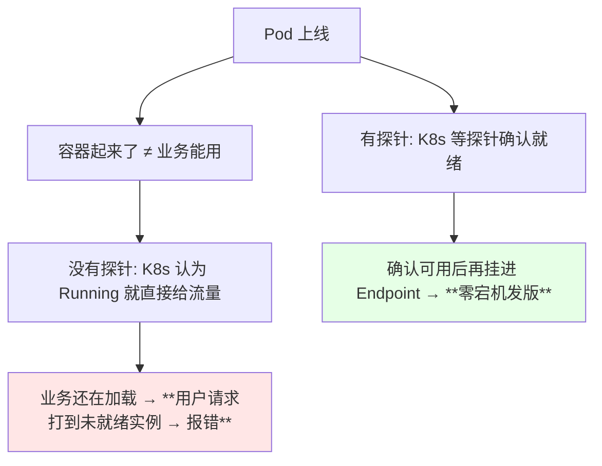
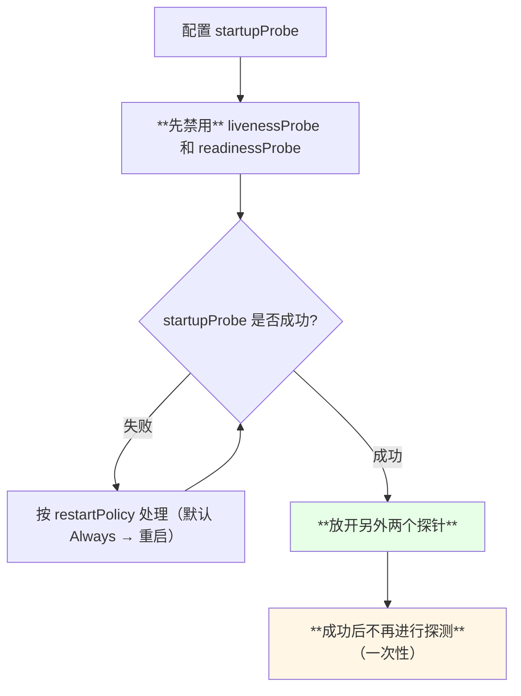
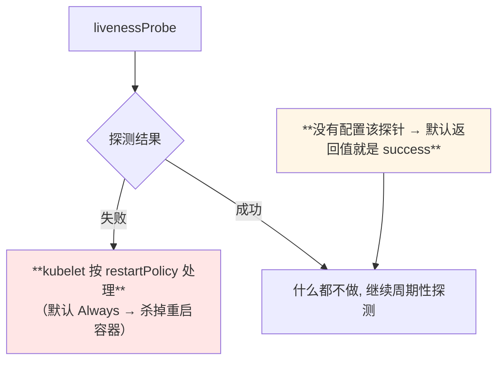
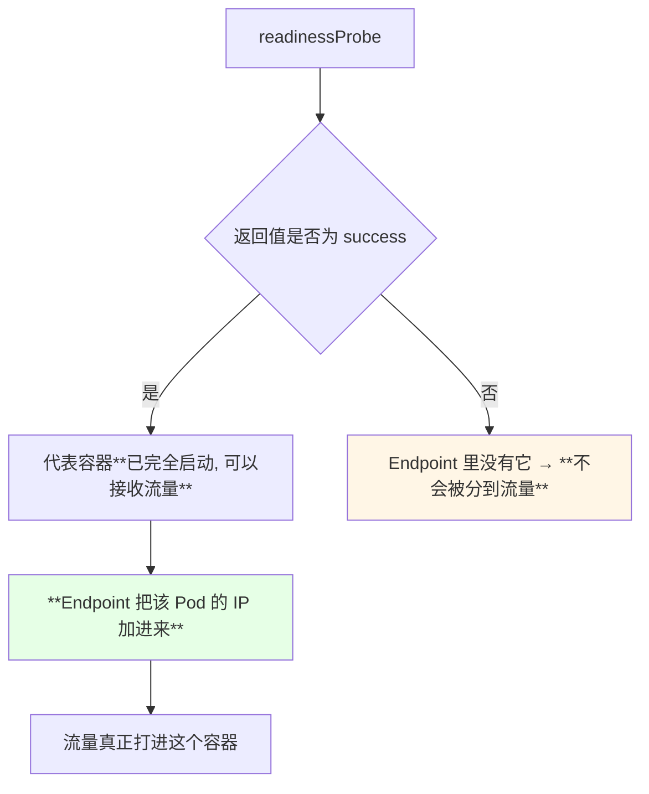
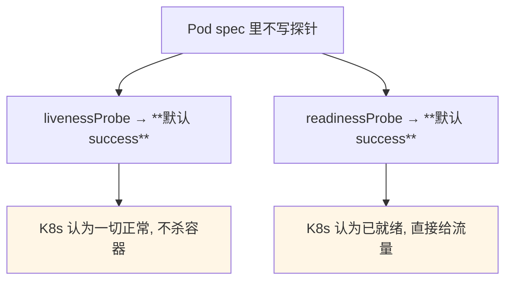
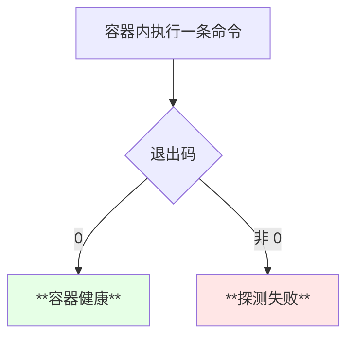
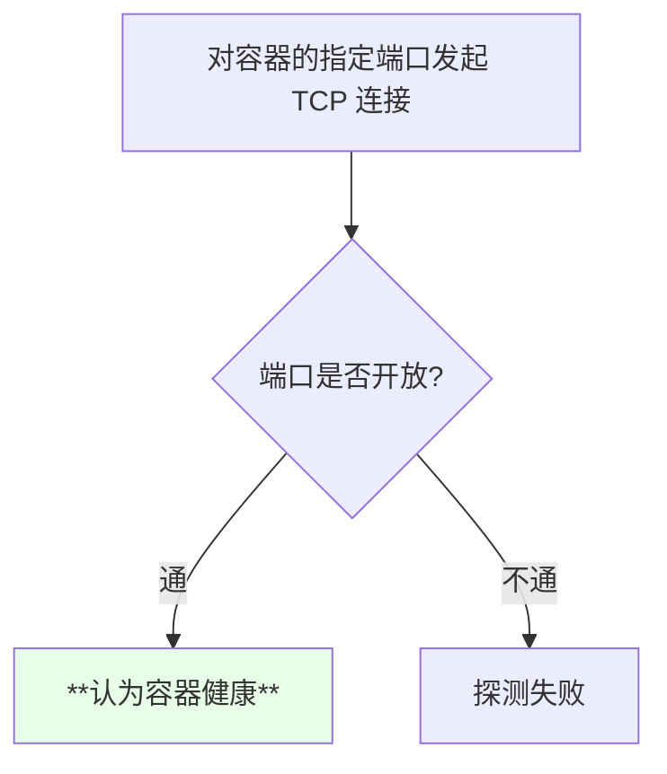
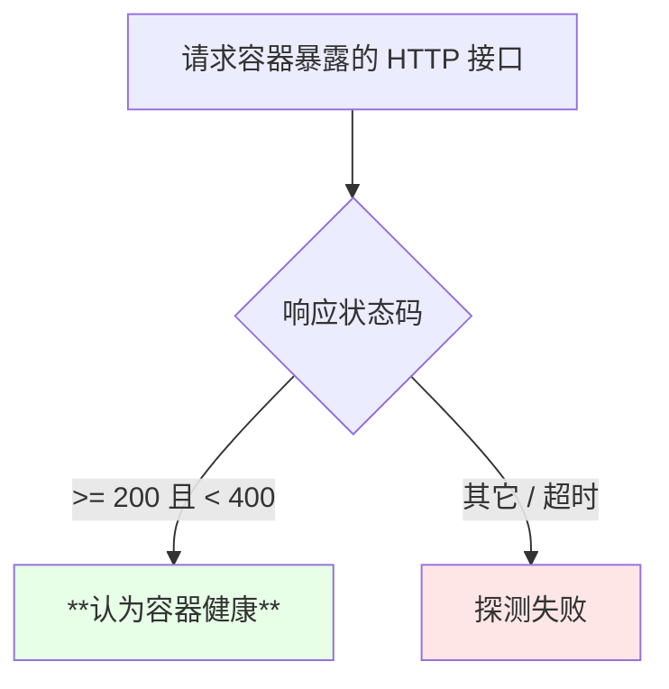
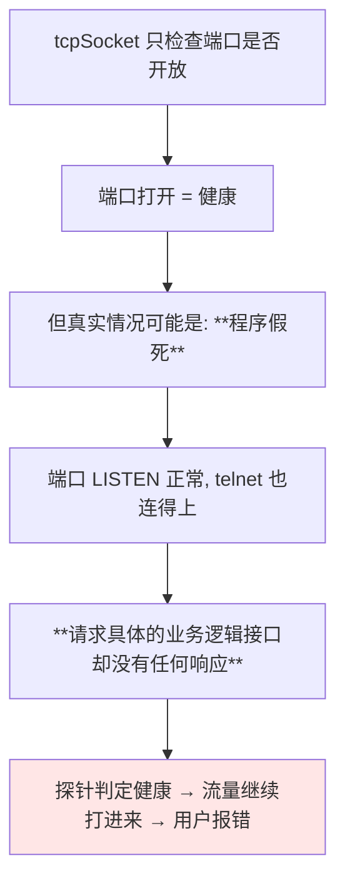
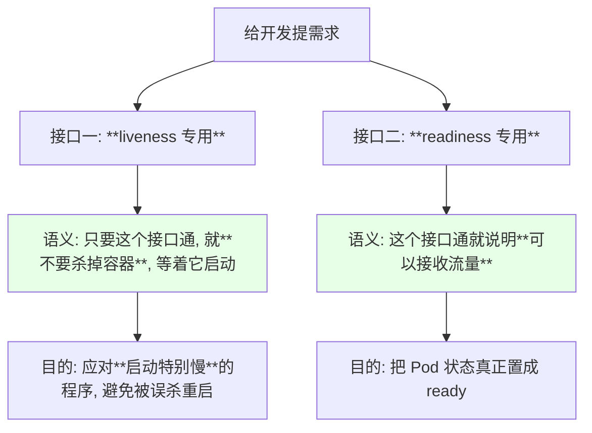

# Kubernetes 集群部署: 零宕机发布必备的 Pod 三种探针（startupProbe / livenessProbe / readinessProbe 与三种检测方式）

Pod 的资源清单里，**探针（probe）**和生命周期钩子这两块是重中之重 —— 课程原话：**「把这两个方面运用好的话，我们可以实现零宕机地去发版」**。这一节先把三种探针讲透。

结论先摆：

1. **三种探针**：`startupProbe`（判断应用是否启动完成）、`livenessProbe`（判断容器是否还在运行）、`readinessProbe`（判断程序是否健康、能否接流量）；
2. **`startupProbe` 是 1.16 才引入的**，之前只有 liveness 和 readiness 两个，发现扛不住复杂生产场景才补的；
3. **配了 `startupProbe` 会先把另外两个探针禁用掉**，成功后才放它们上线，而且 **startupProbe 成功之后就再也不探测了**；
4. **两个「默认 success」**：`livenessProbe`、`readinessProbe` **不配置的话默认返回值就是 success**，等于不检查；
5. **`readinessProbe` 返回成功才会把 Pod IP 写进 Endpoint**，流量才会真正打进来 —— 这是零宕机的关键开关；
6. **三种检测方式**：`exec`（容器内执行命令，退出码 0 为健康）、`tcpSocket`（端口通即为健康）、**`httpGet`（生产最常用、最可靠）**；
7. **tcpSocket 不可靠**：端口通不代表业务可用（**程序假死**），生产应该让开发暴露两个健康检查接口走 httpGet。

## 纲要

- 为什么探针是零宕机的基础
- startupProbe：1.16 才有的启动探针
- livenessProbe：容器还在不在
- readinessProbe：能不能接流量
- 不配置时默认 success
- 检测方式一：ExecAction
- 检测方式二：TCPSocketAction
- 检测方式三：HTTPGetAction（生产首选）
- 为什么 tcpSocket 不可靠：程序假死
- 让开发暴露两个健康检查接口
- 三种探针与三种检测方式的关系

## 为什么探针是零宕机的基础



> 探针 + 生命周期钩子是实现零宕机发版的两个抓手，这一节讲探针，下一节讲生命周期。

## startupProbe：1.16 才有的启动探针



| 特性 | 说明 |
| --- | --- |
| 引入版本 | **Kubernetes 1.16** |
| 作用 | **判断容器内的应用程序有没有启动完成** |
| 与其它探针的关系 | 存在期间**先禁用** readiness 和 liveness |
| 成功之后 | **不再执行**，一次性探针 |
| 失败之后 | 依据 Pod 的**重启策略**做相应处理 |

课程原话：**「K8s 1.16 版本后新加的探测方式，用于判断容器内应用程序是否启动。如果配置了 startupProbe，就会先禁止其他的探测，直到它成功为止；成功后将不再进行探测」**。

## livenessProbe：容器还在不在



| 项目 | 内容 |
| --- | --- |
| 语义 | **探测容器是否在运行** |
| 失败后果 | kubelet 按重启策略处理（通常是重启） |
| 未配置时 | **默认 success**（等于不做检查） |

## readinessProbe：能不能接流量



| 项目 | 内容 |
| --- | --- |
| 语义 | **探测容器内的程序是否健康 / 是否准备好服务** |
| 成功后果 | Endpoint 纳入该 Pod IP，**开始接流量** |
| 成功的前提 | 容器已完全启动且程序能处理逻辑 |
| 未配置时 | **默认 success**（同样等于不检查） |

> 一句话区分：**liveness 决定「要不要杀掉重启」，readiness 决定「要不要给它流量」**。这两件事互不等价 —— 一个正在跑但还在预热的进程，应该 liveness 过、readiness 不过。

## 不配置时默认 success



这就是为什么**「容器起来了但服务不可用」**这种事故屡见不鲜 —— 什么都不写，K8s 一律按「健康」处理。

## 检测方式一：ExecAction

在容器内执行一条命令，**退出码为 0 即认为容器健康**。

```yaml
        livenessProbe:
          exec:
            command:
            - cat
            - /tmp/healthy
          initialDelaySeconds: 5
          periodSeconds: 5
```



用命令自己验证一遍这个判定逻辑：

```bash
ls /tmp
echo $?          # 0  → 命令执行成功

ls /tmp/nonexistent-dir-xyz
echo $?          # 非 0 → 目录不存在
```

| 命令 | 退出码 | 判定 |
| --- | --- | --- |
| `ls /tmp` | 0 | 健康 |
| `ls /tmp/不存在` | 非 0 | 不健康 |

## 检测方式二：TCPSocketAction

**通过 TCP 连接检查容器内的端口是否通**，通就认为健康。

```yaml
        readinessProbe:
          tcpSocket:
            port: 80
          initialDelaySeconds: 5
          periodSeconds: 10
```



等价的人工验证方式就是 `netstat` 看端口、`telnet` 试连通：

```bash
telnet localhost 2379
netstat -lntp | head
```

## 检测方式三：HTTPGetAction（生产首选）

**通过应用程序暴露的 HTTP 地址来检测程序是否正常**，状态码 **大于等于 200 且小于 400** 认为健康。

```yaml
        readinessProbe:
          httpGet:
            path: /healthz
            port: 8080
            scheme: HTTP
          initialDelaySeconds: 10
          periodSeconds: 5
```



三种检测方式横向对比：

| 检测方式 | 判定依据 | 可靠性 | 适用 |
| --- | --- | --- | --- |
| `exec` | 命令退出码是否为 0 | 中 | 命令好判断的场合，灵活 |
| `tcpSocket` | 端口是否开放 | **低**（会误判） | 端口即代表的简单服务 |
| **`httpGet`** | HTTP 状态码 200~399 | **高** | **生产首选** |

## 为什么 tcpSocket 不可靠：程序假死



> 课程原话：**「TCPSocket 会有个什么情况呢 —— 明明我的端口是起来的，它就是不能连接，这就是一种程序假死的现象……所以说 TCPSocket 是不可靠的，最可靠的还是 HTTPGet」**。

## 让开发暴露两个健康检查接口

课程给了非常具体的落地建议 —— **让开发在代码里暴露两个健康检查端点**，分别对应 liveness 和 readiness：



| 给谁用 | 接口语义 | 探针配置建议 |
| --- | --- | --- |
| liveness | 「进程活着」 | 失败才重启；**启动慢的程序给它足够宽松的超时 / 次数** |
| readiness | 「可以干活」 | 失败就摘流量，不影响容器本身 |

> Spring Boot 2 之后的版本**原生支持这两种检测方式**（Spring Cloud 同理），只需要把端点暴露出来，**用 `httpGet` 去请求这个端口即可**；两个健康检查都返回 true 说明应用已经起来、可以接流量了。

## 三种探针与三种检测方式的关系

```text
探针（按「什么时候用」分）              检测方式（按「怎么探测」分）
──────────────────────────            ───────────────────────────
探针组
├── startupProbe   1.16+             探测组
│   ├── 判断应用是否启动完成          ├── exec        容器内跑命令
│   ├── 存在时先禁用另外两个          │   └── 退出码 0 = 健康
│   └── 成功后不再探测                ├── tcpSocket   连 TCP 端口
├── livenessProbe                     │   ├── 端口通 = 健康
│   ├── 判断容器是否还在运行          │   └── 有「程序假死」盲区
│   ├── 失败按重启策略处理            └── httpGet     请求 HTTP 接口
│   └── 不配置默认 success                ├── 2xx / 3xx = 健康
└── readinessProbe                        └── **生产最可靠**
    ├── 判断程序是否健康
    ├── 成功才把 IP 写进 Endpoint
    └── 不配置默认 success
```

> 注意：**任意一种探针都可以搭配任意一种检测方式**，两者是正交的两个维度，别混为一谈。

## API 速览

| 能力 | 做法 | 关键点 |
| --- | --- | --- |
| 看探针有没有配 | `kubectl get pod <POD> -o yaml` 找 `livenessProbe` 段 | 不配默认是 success |
| 看 Pod 是否 ready | `kubectl get pods` 的 READY 列 | 由 readinessProbe 决定 |
| 看 Endpoint 里有没有它 | `kubectl get endpoints <SVC>` | readiness 通过才会出现 IP |
| 看为什么被重启 | `kubectl describe pod <POD>` 的 Events | liveness 失败会写明 |
| 单次命令退出码验证 | 命令后接 `echo $?` | 理解 exec 探测的判定依据 |
| 端口连通验证 | `telnet <HOST> <PORT>` | 理解 tcpSocket 的判定依据 |
| 接口验证 | `curl -o /dev/null -w "%{http_code}" http://<IP>:<PORT>/healthz` | 理解 httpGet 的判定依据 |
| 容器卡住时看日志 | `kubectl logs <POD> -c <CONTAINER> --previous` | 看上一次崩溃前的输出 |

字段速查：

| 字段 | 作用 |
| --- | --- |
| `spec.containers[].startupProbe` | 启动探针，**1.16+**，存在时禁用另两个探针 |
| `spec.containers[].livenessProbe` | 存活探针，失败按重启策略处理 |
| `spec.containers[].readinessProbe` | 就绪探针，成功才进 Endpoint |
| `.exec.command` | exec 方式要执行的命令 |
| `.tcpSocket.port` | tcpSocket 方式要连的端口 |
| `.httpGet.path` / `.httpGet.port` / `.httpGet.scheme` | httpGet 方式的三要素 |
| `initialDelaySeconds` | 容器启动后多久开始第一次探测 |
| `periodSeconds` | 每隔多久探测一次 |
| `failureThreshold` / `successThreshold` | 连续失败 / 成功几次才改变判定 |

## Demo 示例

```bash
# 1. 先理解 exec 方式的判定: 看退出码
ls /tmp
echo $?
ls /tmp/definitely-not-exist
echo $?

# 2. 理解 tcpSocket: 端口连不连得上
telnet localhost 2379

# 3. 理解 httpGet: 看状态码落在哪个区间
#    2xx / 3xx 视为健康, 其余视为失败
curl -o /dev/null -s -w "%{http_code}\n" http://127.0.0.1:8080/healthz

# 4. 部署带三种检测方式的探针示例
kubectl apply -f probes-demo.yaml
kubectl get pods -w

# 5. 看 Pod 的 ready 状态与 Endpoint
NS=default
POD=$(kubectl get pods -n "$NS" -l app=probe-demo -o jsonpath='{.items[0].metadata.name}')
kubectl get pod "$POD" -n "$NS"
kubectl describe pod "$POD" -n "$NS" | tail -30

# 6. 故意把探针指向一个不存在的路径, 观察容器被重启
kubectl delete pod "$POD" -n "$NS"
kubectl apply -f probes-bad-readiness.yaml
kubectl get pods -n "$NS" -w
kubectl describe pod "$POD" -n "$NS" | grep -A5 Events
```

```yaml
# probes-demo.yaml —— 三种检测方式各来一份（演示用, 别同时写到同一个容器）
apiVersion: v1
kind: Pod
metadata:
  name: probe-demo
  labels:
    app: probe-demo
spec:
  containers:
  - name: nginx
    image: nginx:1.15.2
    imagePullPolicy: IfNotPresent
    ports:
    - containerPort: 80
    # 方式一: exec —— 命令退出码为 0 即健康
    livenessProbe:
      exec:
        command:
        - ls
        - /usr/share/nginx/html
      initialDelaySeconds: 5
      periodSeconds: 10
    # 方式二: tcpSocket —— 80 端口连得上即健康（有假死盲区）
    readinessProbe:
      tcpSocket:
        port: 80
      initialDelaySeconds: 5
      periodSeconds: 5
```

```yaml
# probes-bad-readiness.yaml —— httpGet 指向不存在的路径, 观察探针失败
apiVersion: v1
kind: Pod
metadata:
  name: probe-demo
  labels:
    app: probe-demo
spec:
  containers:
  - name: nginx
    image: nginx:1.15.2
    imagePullPolicy: IfNotPresent
    ports:
    - containerPort: 80
    readinessProbe:
      httpGet:
        path: /not-exist-healthz
        port: 80
      initialDelaySeconds: 3
      periodSeconds: 3
```

```text
探针与 Endpoint 的联动:

readinessProbe 失败 → Endpoint 里删掉这个 Pod IP → 流量不再打进来
readinessProbe 成功 → Endpoint 里加入这个 Pod IP → 开始接流量

livenessProbe 失败  → kubelet 按 restartPolicy 处理 → 容器重启
livenessProbe 未配置 → 默认 success → 永远不会被判死

startupProbe 存在   → 先把上面两个探针禁用掉
startupProbe 成功   → 放开上面两个探针, 并且自己不再执行
```

### 总结

- **探针 + 生命周期钩子是零宕机发版的两大抓手**；探针解决的是「容器起来了不等于业务能用」这个根本问题；
- **三种探针各有分工**：`startupProbe`（1.16 引入，判断应用是否启动完成）、`livenessProbe`（判断容器是否还在运行，失败按重启策略处理）、`readinessProbe`（判断能否接流量，成功才会把 Pod IP 写进 Endpoint）；
- **配了 `startupProbe` 会先禁用 liveness 和 readiness**，直到它成功为止，**且成功后不再探测**（一次性），避免启动慢的程序被误杀；
- **livenessProbe 和 readinessProbe 在不配置时默认返回值都是 success** —— 什么都不写等于完全不检查，这是「容器起来了但服务不可用」的根源；
- **三种检测方式**：`exec`（命令退出码 0 为健康）、`tcpSocket`（端口通为健康）、`httpGet`（状态码 200~399 为健康，**生产最可靠**）；
- **`tcpSocket` 有「程序假死」的盲区**：端口通不代表业务能响应，所以生产应该**让开发暴露两个健康检查接口**（一个给 liveness 表示「别杀我」，一个给 readiness 表示「可以接流量」），用 httpGet 去请求它们。

