# Kubernetes 集群部署: 零宕机必备的 StartupProbe（慢启动应用的探针困境、五个超时参数与 CoreDNS 的双接口做法）

上一节讲了三种探针的分工，这一节回答一个很实际的问题：**已经有了 liveness 和 readiness，为什么 1.16 还要再加一个 startupProbe？** 答案藏在慢启动应用里。

结论先摆：

1. **CoreDNS 的做法很值得抄**：`livenessProbe` 打 8080 的 `/health`（告诉 K8s 别杀我），`readinessProbe` 打 8181 的 `/ready`（告诉 K8s 可以给我流量）；
2. **只有 liveness + readiness 的两个死局**：一是 readiness 一直不过但 liveness 正常 → 容器不重启也接不了流量，多副本全这样服务就挂了；二是**慢启动应用会陷入「超时被杀 → 重启 → 再超时」的死循环**；
3. **把超时放宽不是解法**：`failureThreshold × periodSeconds × timeoutSeconds` 算出来的重启延迟能到 250 秒，真出问题时应用已经宕机四分钟；
4. **`startupProbe` 就是为此而生**：先把另外两个探针禁用掉，**只跑到一次成功就彻底退出**，把「启动判定」和「运行期判定」彻底解耦；
5. 五个探针参数都要克制：`initialDelaySeconds` 别太长否则拖慢滚动发布、`timeoutSeconds` 一般 1~2 秒、`failureThreshold` 建议 2（设 1 会误判、设太大又拖慢重启）；
6. **Java 这类慢启动应用不要图省事用 `pgrep java` 当 startupProbe**（进程起来得太快，等于没判），**应该单独暴露一个「初始化完成」接口**。

## 纲要

- 抄作业：CoreDNS 的两个健康检查接口
- 为什么 CoreDNS 要区分 8080 和 8181
- 简单的 nginx 用什么方式检测
- 只有两个探针时的死局一：不重启也不接流量
- 死局二：慢启动应用的重启死循环
- 把超时放宽为什么不行
- 探针的五个参数与取值建议
- startupProbe 登场：为什么它能解开死循环
- 实测：故意配错接口看容器被重启
- 改成 tcpSocket：nginx 的简化判定
- Java 应用的误区：别用 pgrep 当启动探针
- 三个接口还是两个接口
- 版本低于 1.16 怎么办

## 抄作业：CoreDNS 的两个健康检查接口

先看集群里云原生组件自己是怎么做健康检查的：

```bash
kubectl get deployment -n kube-system
# coredns / metrics-server / calico-kube-controllers
kubectl edit deployment coredns -n kube-system
```

> 注意：**`kubectl edit` 后面不跟名称会把所有同类资源都打开**，一定要指定名字。

CoreDNS 的探针是这么写的：

```yaml
    containers:
    - name: coredns
      livenessProbe:
        httpGet:
          path: /health
          port: 8080
          scheme: HTTP
        initialDelaySeconds: 60
        periodSeconds: 10
        timeoutSeconds: 5
        successThreshold: 1
        failureThreshold: 5
      readinessProbe:
        httpGet:
          path: /ready
          port: 8181
          scheme: HTTP
        initialDelaySeconds: 0
        periodSeconds: 10
        timeoutSeconds: 5
        successThreshold: 1
        failureThreshold: 5
```

```text
CoreDNS 的两张健康卡:

GET 8080/health   → 给 liveness 用   「我还活着, 别杀我」
GET 8181/ready    → 给 readiness 用  「我准备好了, 给我流量」
```

| 接口 | 端口 / 路径 | 服务哪个探针 | 语义 |
| --- | --- | --- | --- |
| `/health` | 8080 | **livenessProbe** | 程序在跑，不要重启容器 |
| `/ready` | 8181 | **readinessProbe** | 可以接流量，把我加进 Endpoint |

## 为什么 CoreDNS 要区分 8080 和 8181

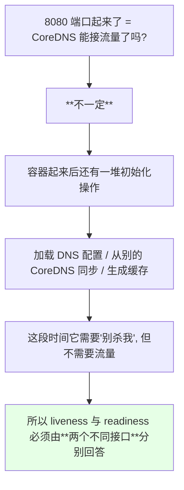

课程原话：**「我的端口起来了，你先不要杀我，因为我还有一些初始化操作……我们什么时候能接受流量呢？那又提供了一个 8181 的 `/ready`，这个接口通了你就把 Endpoint 把我加上，我就可以接受流量了」**。

> 这条经验要直接推给开发：**自己公司的业务应用开发，一定要弄清楚 liveness 和 readiness 分别该怎么配**。

## 简单的 nginx 用什么方式检测

不是所有应用都要两个接口。nginx 这种「端口起来就能干活」的，用 `tcpSocket` 就够了：

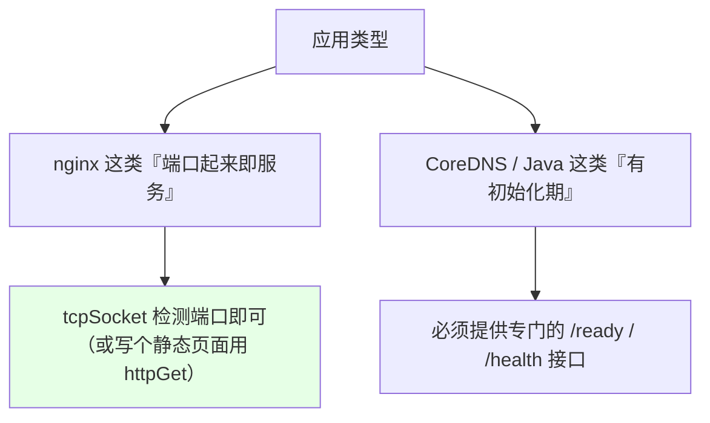

> **要灵活运用** —— 检测方式没有标准答案，能实现零宕机发布就是好配置。

## 只有两个探针时的死局一：不重启也不接流量

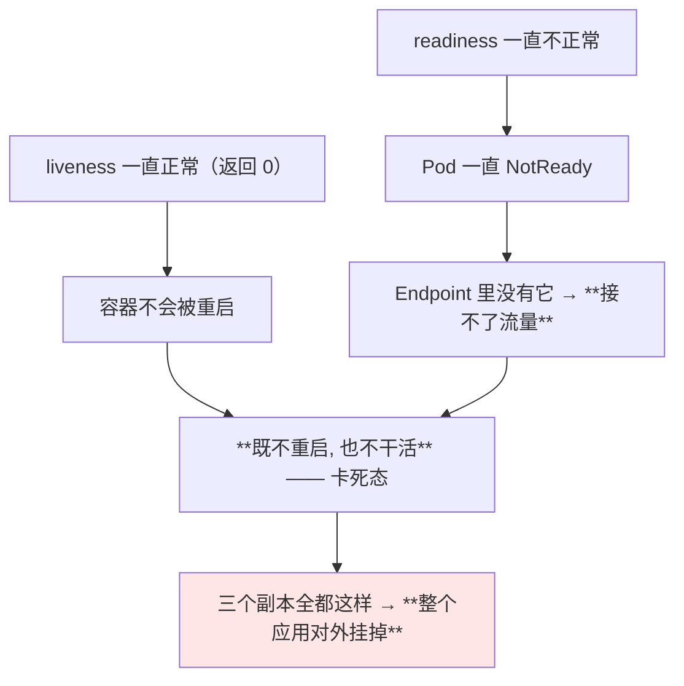

> 课程对这个局面描述得很直白：**「它的容器不会被重启掉，但是因为 readiness 不为 0，它就一直处于不可接受流量的状态；如果三个副本都处于这种状态，你的应用就挂了」**。

## 死局二：慢启动应用的重启死循环

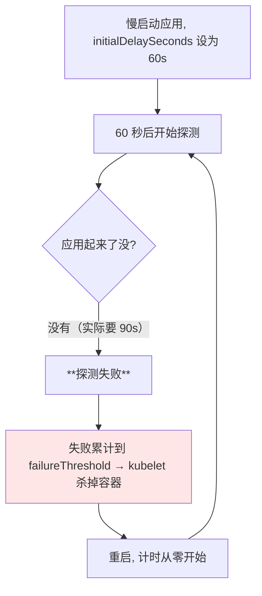

> 一旦应用启动耗时超过探针配置的容忍上限，就进入 **「杀掉 → 重启 → 再杀 → 再重启」的循环**，永远起不来。

## 把超时放宽为什么不行

有人会说：那我把间隔和次数都放大不就行了？代价是灾难性的：

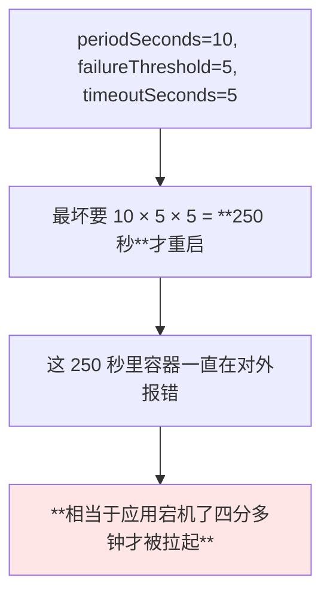

另一个同样危险的方向：**`initialDelaySeconds` 设得过长** —— 每次滚动发布都要干等这个时间，发布周期被显著拖慢。

| 想解决的问题 | 想到的办法 | 副作用 |
| --- | --- | --- |
| 慢启动别被误杀 | 放大 `initialDelaySeconds` | **拖长滚动发布周期** |
| 探测别误判 | 放大 `failureThreshold` | **真故障时几百秒才重启** |
| **正解** | **单独用 `startupProbe`** | 无副作用，成功即退出 |

## 探针的五个参数与取值建议

```text
探针的通用参数:

spec.containers[].livenessProbe
├── initialDelaySeconds   初始化时间, 等多久才开始第一次探测
├── periodSeconds         检查间隔, 多久探测一次
├── timeoutSeconds        单次探测的超时时间
├── successThreshold      连续成功几次才算健康
└── failureThreshold      连续失败几次才算不健康
```

| 参数 | 含义 | 课程建议 |
| --- | --- | --- |
| `initialDelaySeconds` | 容器启动后多久才第一次探测 | **不建议太长** —— 会拖长滚动发布周期 |
| `timeoutSeconds` | 一次请求多久算超时 | **一般 1~2 秒**；健康接口通常是毫秒级，超 1 秒没返回说明接口本身有问题 |
| `periodSeconds` | 多久检测一次 | 按实际情况，例如 5 秒或 10 秒 |
| `successThreshold` | 连续成功几次才判定健康 | **1 或 2**，设太大会拉长进入 ready 的周期 |
| `failureThreshold` | 连续失败几次才判定异常 | **建议 2**；设 1 可能因网络波动误判，设 5 则要几十秒才重启 |

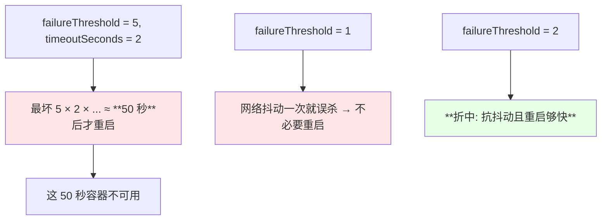

> 一句话规律：**这些参数没有标准值，但都遵循同一个原则 —— 既不能让它误判，也不能让真故障拖太久。**

## startupProbe 登场：为什么它能解开死循环

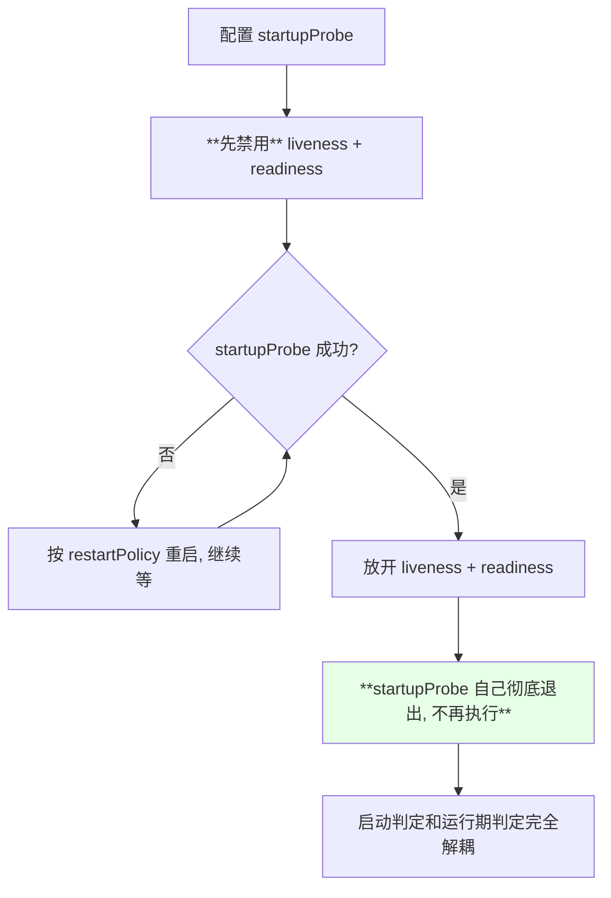

| 对比 | startupProbe | liveness / readiness |
| --- | --- | --- |
| 执行时机 | 容器刚启动那一段 | 容器整个生命周期 |
| 是否禁用其它探针 | **存在时就禁用另外两个** | 否 |
| 成功后 | **不再执行** | 持续循环检测 |
| 关注的问题 | 「启动完了没」 | 「还活着吗 / 能干活吗」 |
| 版本要求 | **1.16+** | 一直有 |

> 课程总结：**「容器启动过程特别慢时，不建议把这个健康检查配在 liveness 和 readiness 里，建议配在 startupProbe 里 —— 一旦判定成功就不会再执行，不会引起长时间的不可用」**。

## 实测：故意配错接口看容器被重启

课程现场给 Pod 配了一个指向不存在路径的 startupProbe：

```yaml
spec:
  containers:
  - name: nginx
    image: nginx:1.15.2
    startupProbe:
      httpGet:
        path: /not-exist-start
        port: 80
      failureThreshold: 3
      periodSeconds: 10
```

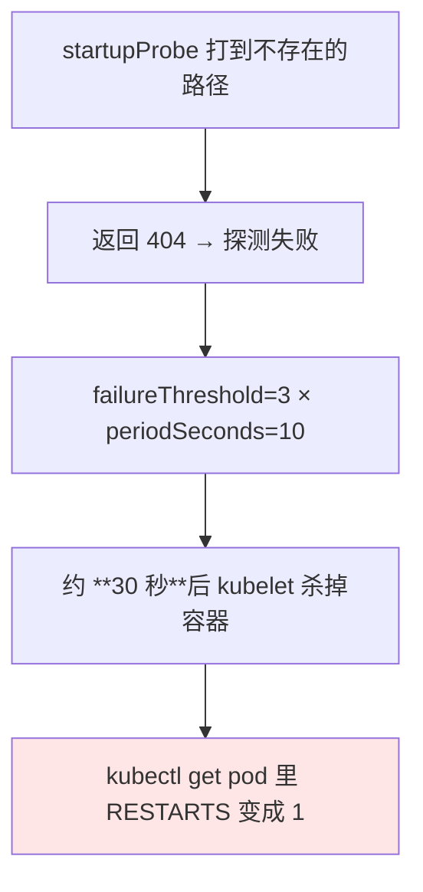

```bash
NS=default
POD=$(kubectl get pods -n "$NS" -o jsonpath='{.items[0].metadata.name}')
kubectl describe pod "$POD" -n "$NS"
# Events: Startup probe failed: HTTP probe failed with statuscode: 404
kubectl get pods -n "$NS" -w
# NAME       READY   STATUS    RESTARTS
# probe-demo 0/1     Running   1
```

```text
课程实测输出（关键片段）:

Events:
  Type     Reason     Message
  Warning  Unhealthy  Startup probe failed:
                      HTTP probe failed with statuscode: 404

NAME        READY   STATUS    RESTARTS
probe-demo  0/1     Running   1        ← 健康检查没过, 已被重启一次
```

> 顺带一个实际操作提醒：**Pod 有时不能直接用 `replace` / `apply` 覆盖**（尤其改探针这类字段），即使替换成功也未必能触发滚动更新 —— **保险做法是删掉重建**。高级资源（Deployment 等）才可以正常 apply。

## 改成 tcpSocket：nginx 的简化判定

因为实验用的是 nginx，**端口通即代表服务可用**，所以换成 `tcpSocket` 就能过：

```yaml
    startupProbe:
      tcpSocket:
        port: 80
      failureThreshold: 3
      periodSeconds: 10
```

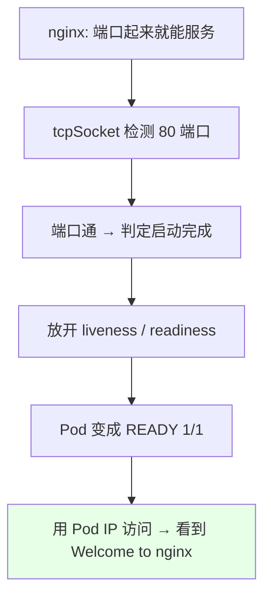

> **这条只适用于 nginx 这类简单服务** —— 自己开发的业务应用必须单独写判定接口，不能照抄。

```bash
NS=default
POD=$(kubectl get pods -n "$NS" -o jsonpath='{.items[0].metadata.name}')
POD_IP=$(kubectl get pod "$POD" -n "$NS" -o jsonpath='{.status.podIP}')
curl "http://$POD_IP"
# Welcome to nginx
```

顺带发现：nginx 这个镜像是**瘦身过的**，exec 进去连 `ps`、`wget` 都没有 —— 又一次印证了「排错工具要单独想办法」。

## Java 应用的误区：别用 pgrep 当启动探针

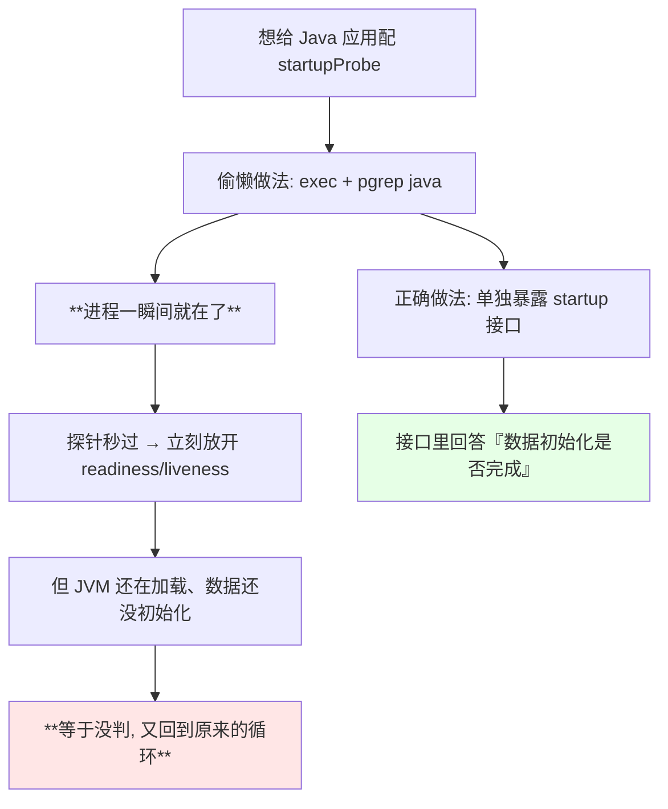

> 课程作者一开始提议用 `pgrep java`，但自己立刻否掉了：**「进程立马就会在，又会进入到那两个东西里面造成循环，所以还是要提供一个 startupProbe 的接口」**。

## 三个接口还是两个接口

```text
完整的健康检查接口体系:

接口一 START /started     → startupProbe    「初始化完成了」
接口二 LIST /health       → livenessProbe   「我还活着, 别杀我」
接口三 READY /ready       → readinessProbe  「我能干活了, 给流量」
```

| 探针 | 期望接口回答的问题 |
| --- | --- |
| `startupProbe` | **初始化 / 数据加载完成了没有** |
| `livenessProbe` | 进程是否还在正常运行 |
| `readinessProbe` | 是否可以接收并处理请求 |

> 课程原话：**「那你就要写三个接口了」** —— 只有这样才能把「慢启动」「活着」「能干活」三件事彻底分开判断。

## 版本低于 1.16 怎么办

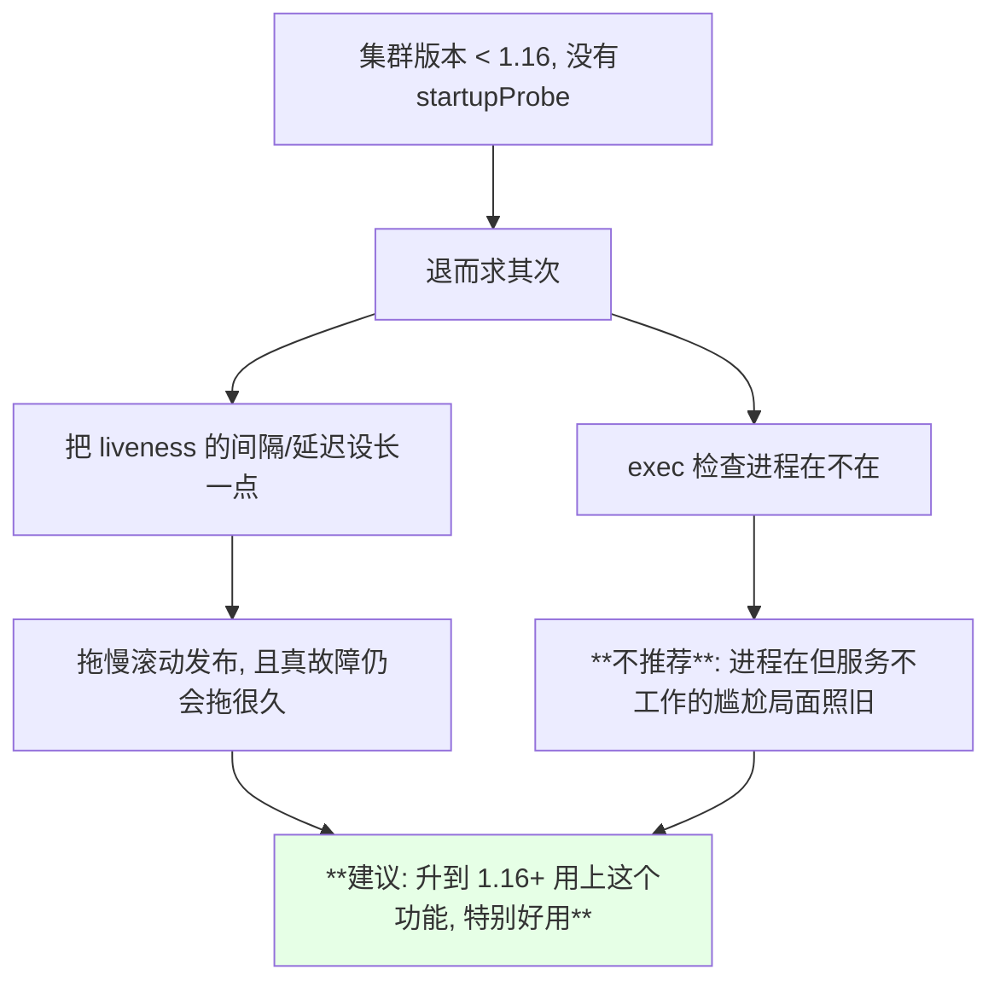

## API 速览

| 能力 | 做法 | 关键点 |
| --- | --- | --- |
| 在线编辑 Deployment | `kubectl edit deployment <NAME> -n <NS>` | **必须带名字**，否则打开全部 |
| 看探针失败原因 | `kubectl describe pod <POD>` 的 Events | 会写明 probe 类型与状态码 |
| 看重启次数 | `kubectl get pods -w` 的 RESTARTS 列 | 探针持续失败会累加 |
| 验证服务可用 | `curl http://<POD_IP>` | Pod ready 后才会通 |
| 看 Pod IP | `kubectl get pod <POD> -o jsonpath='{.status.podIP}'` | — |
| 改探针不生效时 | 删掉 Pod 重建 | Pod 有时 replace/apply 不生效 |
| 看探针完整参数 | `kubectl get pod <POD> -o yaml` | 未写的字段 K8s 会补默认值 |

字段速查：

| 字段 | 作用 | 取值建议 |
| --- | --- | --- |
| `initialDelaySeconds` | 启动后多久开始探测 | 不宜太长 |
| `periodSeconds` | 检测间隔 | 5~10 秒 |
| `timeoutSeconds` | 单次超时 | **1~2 秒** |
| `successThreshold` | 连续成功几次判定健康 | 1~2 |
| `failureThreshold` | 连续失败几次判定异常 | **2** |
| `failureThreshold`（startup） | 慢启动场景可放宽 | 配合最长启动时间算 |

## Demo 示例

```bash
# 1. 看 CoreDNS 的两个健康检查接口是怎么配的
kubectl edit deployment coredns -n kube-system

# 2. 部署一个故意打错接口的 startupProbe, 观察重启
NS=default
kubectl apply -f startup-bad.yaml
kubectl get pods -n "$NS" -w

POD=$(kubectl get pods -n "$NS" -l app=probe-startup -o jsonpath='{.items[0].metadata.name}')
kubectl describe pod "$POD" -n "$NS" | grep -A8 Events

# 3. 改成 tcpSocket 后应该能起来（nginx 端口通即可）
kubectl delete pod "$POD" -n "$NS"      # Pod 有时 apply 覆盖不了, 先删
kubectl apply -f startup-ok.yaml
kubectl get pods -n "$NS" -w

# 4. 拿到 Pod IP 验证服务真的可用
POD_IP=$(kubectl get pod "$POD" -n "$NS" -o jsonpath='{.status.podIP}')
curl "http://$POD_IP"

# 5. 清理
kubectl delete -f startup-ok.yaml
```

```yaml
# startup-bad.yaml —— startupProbe 打到不存在的路径, 必然被重启
apiVersion: v1
kind: Pod
metadata:
  name: probe-startup
  labels:
    app: probe-startup
spec:
  containers:
  - name: nginx
    image: nginx:1.15.2
    imagePullPolicy: IfNotPresent
    ports:
    - containerPort: 80
    startupProbe:
      httpGet:
        path: /not-exist-start
        port: 80
      failureThreshold: 3
      periodSeconds: 10
      timeoutSeconds: 2
```

```yaml
# startup-ok.yaml —— nginx 用 tcpSocket 判定启动完成
apiVersion: v1
kind: Pod
metadata:
  name: probe-startup
  labels:
    app: probe-startup
spec:
  containers:
  - name: nginx
    image: nginx:1.15.2
    imagePullPolicy: IfNotPresent
    ports:
    - containerPort: 80
    startupProbe:
      tcpSocket:
        port: 80
      failureThreshold: 3
      periodSeconds: 10
      timeoutSeconds: 2
    livenessProbe:
      httpGet:
        path: /
        port: 80
      initialDelaySeconds: 10
      periodSeconds: 10
      timeoutSeconds: 2
      failureThreshold: 2
    readinessProbe:
      httpGet:
        path: /
        port: 80
      initialDelaySeconds: 5
      periodSeconds: 5
      timeoutSeconds: 2
      failureThreshold: 2
```

```text
重启延迟的算术题（为什么不能随便放大参数）:

periodSeconds=10, failureThreshold=5, timeoutSeconds=5
    → 最坏 10 × 5 × 5 = 250 秒才重启
    → 这 4 分钟里容器持续不可用

failureThreshold=5, timeoutSeconds=2
    → 最坏约 50 秒才重启
    → 依然太慢

failureThreshold=2, timeoutSeconds=1~2
    → 秒级响应, 又能扛住一次网络抖动
```

### 总结

- **CoreDNS 是健康检查的范本**：8080 的 `/health` 服务 liveness（别杀我）、8181 的 `/ready` 服务 readiness（给流量），因为**端口起来 ≠ 能接流量，中间还有加载 DNS 配置、同步、生成缓存这些初始化动作**；
- **只有 liveness + readiness 会撞上两个死局**：readiness 一直不过但 liveness 正常 → **既不重启也不接流量**的卡死态；慢启动应用 → **超时被杀 → 重启 → 再超时的死循环**；
- **把参数放大不是解法**：`failureThreshold × periodSeconds × timeoutSeconds` 能算出 250 秒的宕机窗口，而 `initialDelaySeconds` 过长又会拖慢滚动发布；
- **五个参数都要克制**：`timeoutSeconds` 一般 1~2 秒（健康接口是毫秒级）、`failureThreshold` 建议 2（设 1 会误判、设 5 太慢）、`successThreshold` 设 1~2；
- **`startupProbe` 通过「先禁用另两个探针 + 成功即彻底退出」把启动判定与运行期判定解耦**，是 1.16 之后解决慢启动的正解；
- **Java 这类应用不要图省事用 `pgrep java` 当 startupProbe**（进程起来太快等于没判），**应该单独暴露「初始化完成」接口** —— 完整形态是 **startup / liveness / readiness 三个接口**；版本低于 1.16 建议升级，而不是把 liveness 间隔硬拉长。

