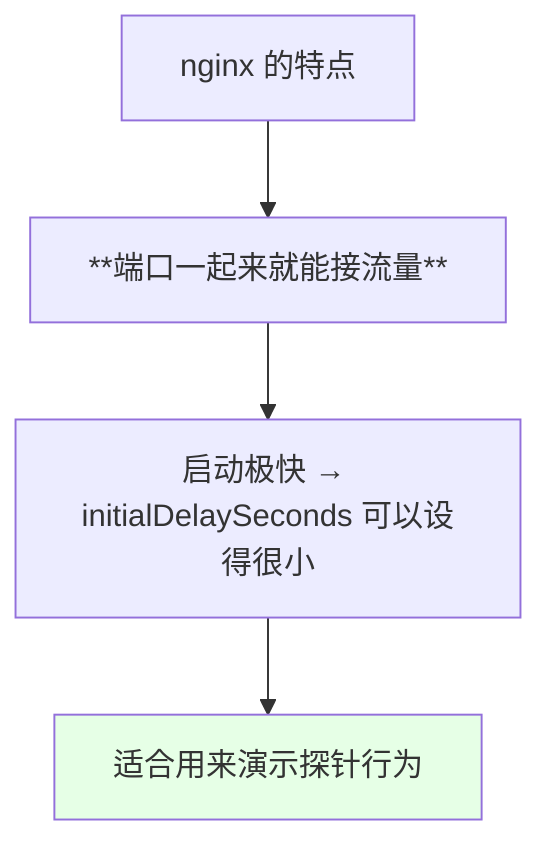
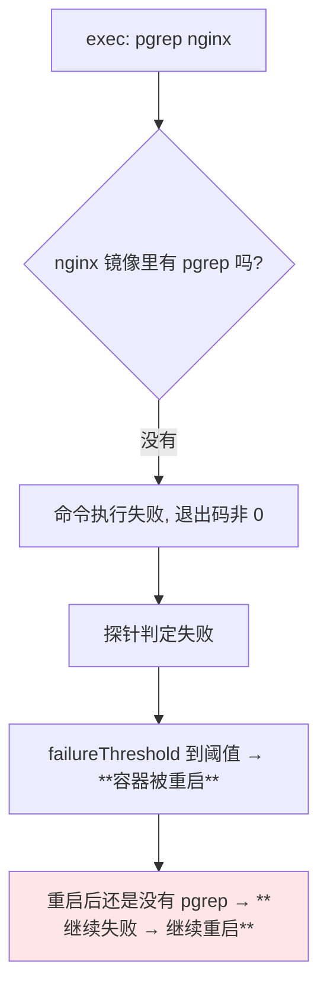
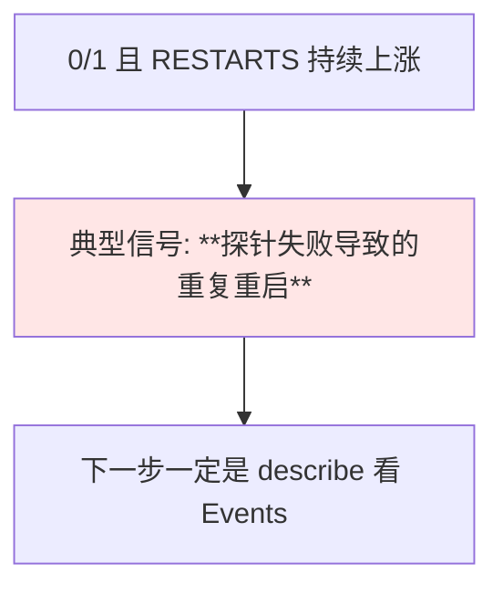
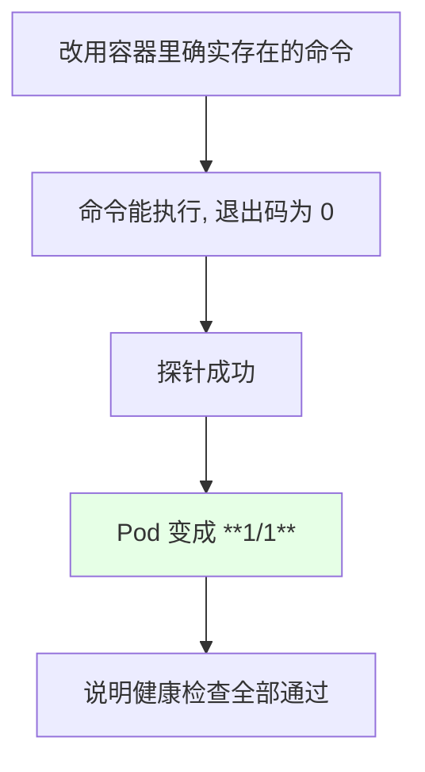
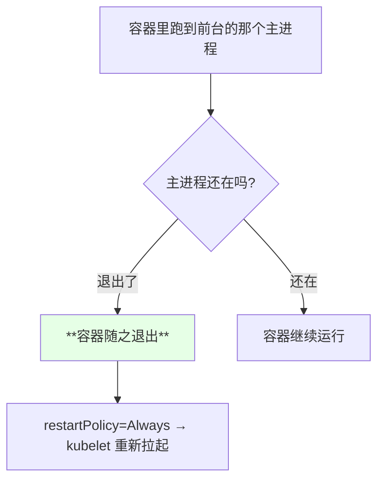
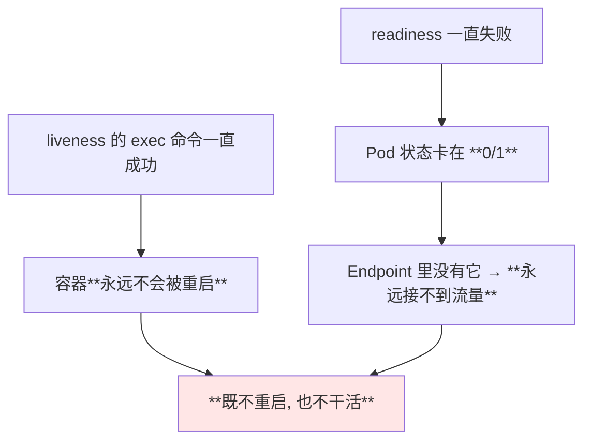
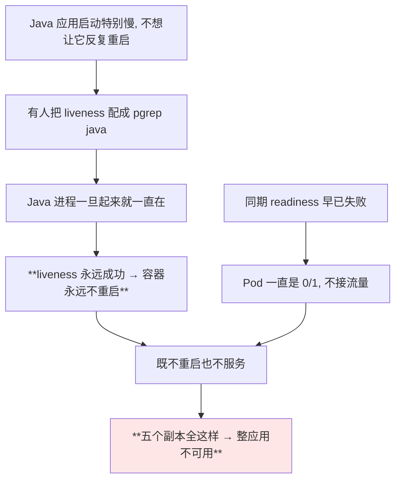
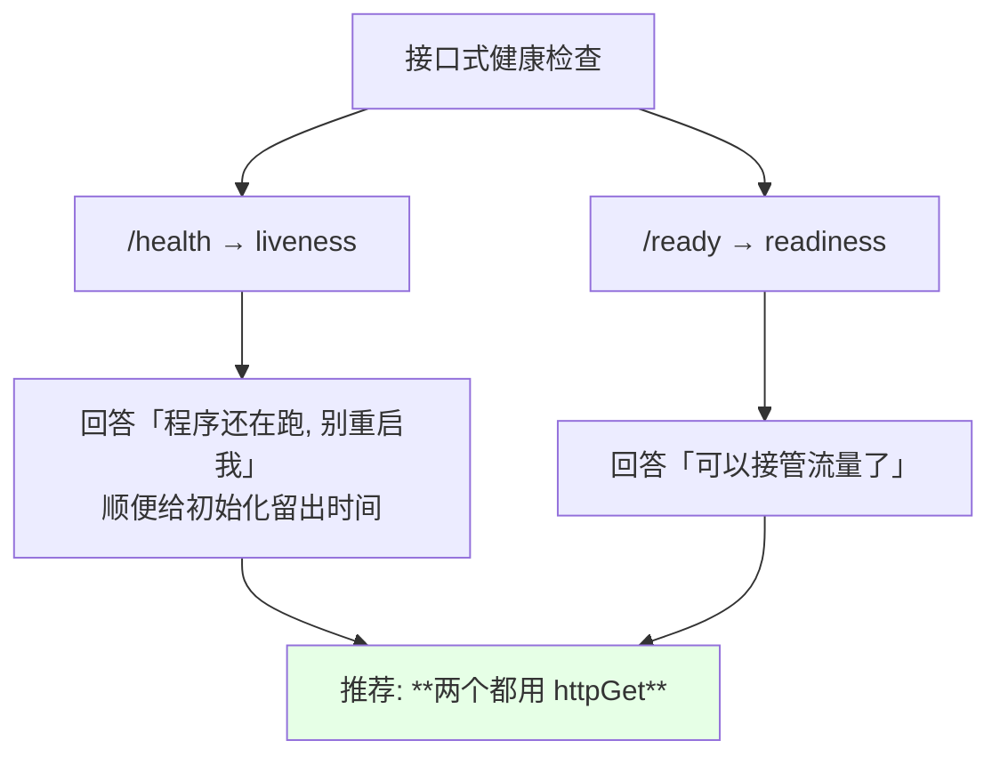
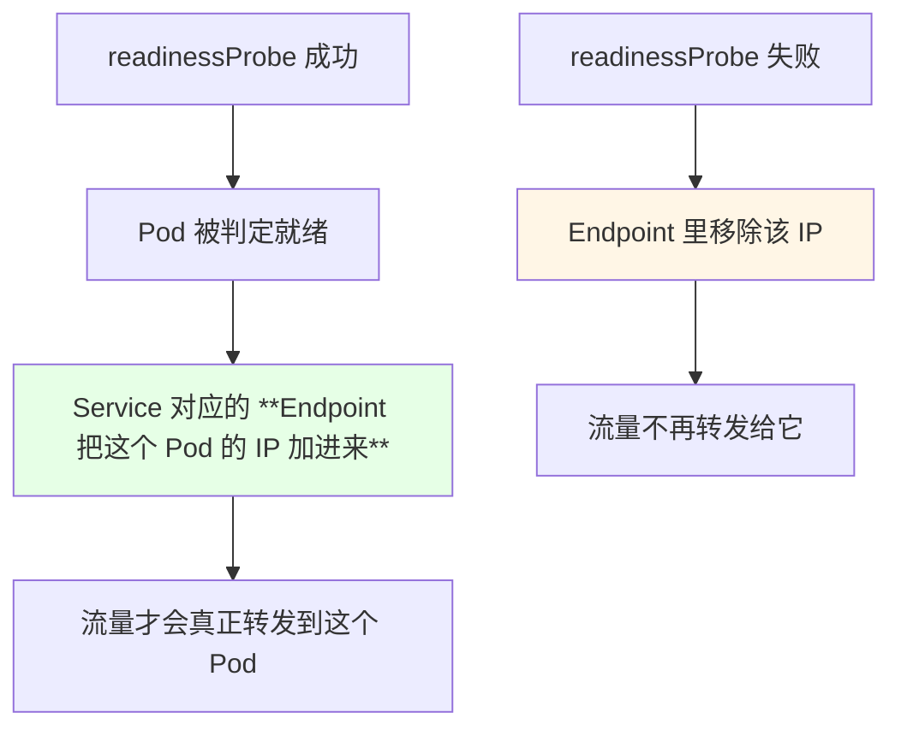

# Kubernetes 集群部署: Liveness 与 Readiness 的实战配置（exec 命令缺失导致重启、以及 pgrep java 的致命写法）

前两节把探针的概念和 startupProbe 讲完了，这一节动手配 liveness 与 readiness，并把课程里实测出来的**两个最具代表性的错误写法**摆出来。

结论先摆：

1. **`exec` 探测有个隐藏前提：容器里必须有这条命令** —— 用 `pgrep nginx` 当 liveness，nginx 镜像里根本没 pgrep，探针一路失败、容器**不断重启**；
2. **Pod 不支持 `replace` 覆盖**，改探针要先删再建；Deployment / StatefulSet 这些高级资源才可以直接 replace；
3. **把 nginx 主进程停掉（`nginx -s stop`）容器会立刻重启** —— 因为主进程退出就是容器退出；
4. **最推荐的方案是两个探针都用接口式（`httpGet`）**，像 CoreDNS 那样 `/health` 配 liveness、`/ready` 配 readiness；
5. **千万不要用 `pgrep java` 当 liveness**：Java 进程一直在，liveness 永远成功，容器就永远不重启；而 readiness 可能早已失败 —— 于是**五个副本全是 0/1、不接流量也不重启，整个应用对外不可用**；
6. `httpGet` 还可以带**自定义请求头**（name / value），给有鉴权的健康接口留了口子。

## 纲要

- 环境说明：为什么用 nginx 演示
- 错误写法一：exec 用了容器里没有的命令
- 现场：RESTARTS 从 1 涨到 2
- describe 才是看探针失败原因的地方
- 换成容器里确实存在的命令
- Pod 不能 replace：删掉重建
- Pod 用得少，但配置项是通用的
- 主进程退出会触发容器重启
- 停掉 nginx 主进程的实测
- liveness 正常但 readiness 失败的僵局
- 错误写法二：pgrep java 的致命后果
- 正解：两个都改成接口式健康检查
- httpGet 还能带自定义请求头
- Endpoint 与 Service 的关系

## 环境说明：为什么用 nginx 演示



为了演示效果明显，课程刻意把参数压到最小：

| 参数 | 演示取值 | 说明 |
| --- | --- | --- |
| `initialDelaySeconds` | **3** | nginx 启动特别快，3 秒足够 |
| `periodSeconds` | **2** | 快速产出结果 |
| `failureThreshold` | **1** | 尽快看到重启（**生产不要设 1，会误判**） |
| `timeoutSeconds` | 短 | 快速失败 |

> 生产环境千万别照抄这几个值，这里只是为了「尽快演示」。

## 错误写法一：exec 用了容器里没有的命令

最初的思路：

```yaml
    livenessProbe:
      exec:
        command:
        - pgrep
        - nginx
      initialDelaySeconds: 3
      periodSeconds: 2
      failureThreshold: 1
```



> 课程反复提醒：**「我们在使用 exec 执行命令的时候，一定要注意，它有可能这个容器里面没有命令」**。上一节也验证过 nginx 是瘦身镜像，`ps`、`wget` 都没有，`pgrep` 自然也没有。

## 现场：RESTARTS 从 1 涨到 2

```bash
kubectl get pods -w
```

```text
NAME            READY   STATUS    RESTARTS
liveness-demo   0/1     Running   0
liveness-demo   0/1     Running   1     ← 已经开始重启
liveness-demo   0/1     Running   2     ← 又重启了
```



## describe 才是看探针失败原因的地方

```bash
NS=default
POD=$(kubectl get pods -n "$NS" -l app=liveness-demo -o jsonpath='{.items[0].metadata.name}')
kubectl describe pod "$POD" -n "$NS"
```

```text
Events:
  Type     Reason     Message
  Warning  Unhealthy  Liveness probe failed:
                      OCI runtime exec failed: exec failed:
                      unable to start container process:
                      exec: "pgrep": executable file not found in $PATH
```

> 报错信息里直接点明 **「没有这个命令」** —— 这是 exec 类探针最常见的翻车方式，而且 `kubectl get pod` 完全看不出原因，**必须 describe**。

## 换成容器里确实存在的命令

```yaml
    livenessProbe:
      exec:
        command:
        - ls
        - /
      initialDelaySeconds: 3
      periodSeconds: 2
      failureThreshold: 1
```



> 课程特地强调：**「这里改成 `ls` 只是举例子，你们生产环境一定不要用 `ls`」** —— `ls` 根本不能代表业务健康，只是为了证明「命令存在与否」这件事。

## Pod 不能 replace：删掉重建

```bash
kubectl replace -f liveness-demo.yaml
# Error ... cannot replace ...
kubectl delete -f liveness-demo.yaml
kubectl apply -f liveness-demo.yaml
```

```text
能不能直接 replace / apply 覆盖:

资源类型          能否 replace / apply 覆盖
─────────────────────────────────────────
Pod               ❌ 常常不成功, 只能删掉重建
Deployment        ✅ 可以直接 replace
StatefulSet       ✅ 可以直接 replace
DaemonSet         ✅ 可以直接 replace
```

> 课程原话：**「Monition 是不能 replace 的，你的其他高级资源比如 StatefulSet、DaemonSet 是可以直接 replace 的」**。

顺带点明一个事实：**Pod 在生产中直接用得很少**，但这几节课讲的**健康检查、配置这些项在高级资源里是通用的**，写在 Deployment 的 `template.spec` 下即可。

## 主进程退出会触发容器重启



## 停掉 nginx 主进程的实测

课程在容器里手动把 nginx 停掉：

```bash
kubectl exec -it liveness-demo -- nginx -s stop
kubectl get pods -w
```

```text
NAME            READY   STATUS    RESTARTS
liveness-demo   0/1     Running   1     ← 又重启了

原因: nginx 主进程退出 → 容器退出 → 被重新拉起
（注意: 这不是探针判定的结果, 是主进程退出本身导致的）
```

> 这里要分清两种重启：**探针失败导致的 kill+restart**，与**主进程自己退出导致的容器退出**。nginx 这个例子属于后者。

```bash
kubectl describe pod liveness-demo | tail -20
# 会看到容器因主进程退出而结束的记录
```

## liveness 正常但 readiness 失败的僵局

课程想演示但当时没法稳定复现的场景，值得单独画出来：



| 探针 | 状态 | 后果 |
| --- | --- | --- |
| liveness | 成功 | 容器不被重启 |
| readiness | 失败 | 状态 0/1，不接流量 |
| **合起来** | — | **僵死的不可用实例** |

## 错误写法二：pgrep java 的致命后果

这是课程明确点名的 **「非常错误的配置方法」**：

```yaml
    # 千万别这么写
    livenessProbe:
      exec:
        command:
        - pgrep
        - java
```



```text
五副本全军覆没的推演:

replica-0   liveness=OK(pgrep)  readiness=FAIL  → 0/1  不接流量 不重启
replica-1   liveness=OK(pgrep)  readiness=FAIL  → 0/1  不接流量 不重启
replica-2   liveness=OK(pgrep)  readiness=FAIL  → 0/1  不接流量 不重启
replica-3   liveness=OK(pgrep)  readiness=FAIL  → 0/1  不接流量 不重启
replica-4   liveness=OK(pgrep)  readiness=FAIL  → 0/1  不接流量 不重启
────────────────────────────────────────────────────
结果: 没有任何一个副本能处理请求, 而 K8s 认为一切正常不会自愈
```

> 课程原话：**「它就会出现个什么问题呢 —— readiness 接口明明已经返回不正常了，但是因为 liveness 配的是 pgrep java、进程一直都在，它就会一直处于 0/1 的状态；如果你的副本有五个，每个副本都是这种状态，你就造成这个应用是不可用的」**。

**结论：不要用 pgrep 这类「只验进程存在」的方式，一定要用接口式的健康检查，那才比较可靠。**

## 正解：两个都改成接口式健康检查

```yaml
    containers:
    - name: app
      image: myapp:1.0.0
      livenessProbe:
        httpGet:
          path: /health
          port: 8080
        initialDelaySeconds: 10
        periodSeconds: 10
        timeoutSeconds: 2
        failureThreshold: 2
      readinessProbe:
        httpGet:
          path: /ready
          port: 8080
        initialDelaySeconds: 5
        periodSeconds: 5
        timeoutSeconds: 2
        failureThreshold: 2
```



抄 CoreDNS 就行：

| 应用 | liveness 接口 | readiness 接口 |
| --- | --- | --- |
| CoreDNS | `8080/health` | `8181/ready` |
| 自己的业务 | 自己实现的 `/health` | 自己实现的 `/ready` |

> 两个接口的区别要跟开发讲清楚：**liveness 那个「只要通就别杀我」（防止慢启动进入死循环），readiness 那个「通了就代表能接流量」**。

## httpGet 还能带自定义请求头

`httpGet` 支持配 **HTTP 请求头**（name / value 成对）：

```yaml
      readinessProbe:
        httpGet:
          path: /ready
          port: 8080
          httpHeaders:
          - name: X-Custom-Header
            value: healthz-check
```

```text
httpGet 的可配项:

httpGet
├── path         请求路径
├── port         端口（或 port 名）
├── scheme       HTTP / HTTPS
└── httpHeaders  自定义请求头
    ├── name
    └── value
```

| 字段 | 用途 |
| --- | --- |
| `httpGet.httpHeaders[].name` | 请求头的名字 |
| `httpGet.httpHeaders[].value` | 请求头的值 |

> 有鉴权或者分流需求的健康接口，可以靠这个带一个标记头过去。

## Endpoint 与 Service 的关系



> 课程当时没给 Pod 配 Service，所以看不到 Endpoint。**Endpoint 会把「可用的 Pod 的 IP 地址」聚合起来** —— 这是 readiness 真正生效的地方，后面讲 Service 时还会展开。

## API 速览

| 能力 | 做法 | 关键点 |
| --- | --- | --- |
| 看重启次数 | `kubectl get pods -w` 的 RESTARTS 列 | 持续上涨 = 探针失败 |
| 看探针失败原因 | `kubectl describe pod <POD>` 的 Events | **必须看这里** |
| 验证容器里有没有某命令 | `kubectl exec -it <POD> -- which <CMD>` | exec 探针前置检查 |
| 手动停主进程做验证 | `kubectl exec -it <POD> -- nginx -s stop` | 主进程退出即容器退出 |
| 替换 Pod 失败时 | 先 `kubectl delete -f xxx.yaml` 再 apply | Pod 不支持 replace |
| 高级资源替换 | Deployment / StatefulSet 可直接 replace | 无需删除 |
| 看 Endpoint | `kubectl get endpoints <SVC>` | 需要 Pod 挂在 Service 后 |
| 给健康接口加头 | `httpGet.httpHeaders` | name / value 成对 |

字段速查：

| 字段 | 作用 |
| --- | --- |
| `exec.command` | 容器内执行的命令，退出码 0 为健康 |
| `httpGet.path` / `port` / `scheme` | HTTP 探测三要素 |
| `httpGet.httpHeaders[]` | 自定义请求头 |
| `initialDelaySeconds` | 启动后多久开始探测 |
| `periodSeconds` | 探测间隔 |
| `timeoutSeconds` | 单次超时，建议 1~2 秒 |
| `failureThreshold` | 失败几次判定异常，建议 2 |
| `successThreshold` | 成功几次判定健康，1~2 |

## Demo 示例

```bash
# 1. 先确认容器里有没有打算用的命令（这一步别省）
NS=default
kubectl run probe-check --image=nginx:1.15.2 --command -- sleep 600
kubectl exec -it probe-check -- which pgrep
kubectl exec -it probe-check -- which ls
kubectl delete pod probe-check

# 2. 部署 exec 探针写错命令的版本 —— 观察持续重启
kubectl apply -f liveness-exec-bad.yaml
kubectl get pods -n "$NS" -w
POD=$(kubectl get pods -n "$NS" -l app=liveness-demo -o jsonpath='{.items[0].metadata.name}')
kubectl describe pod "$POD" -n "$NS" | tail -20

# 3. Pod 不支持 replace, 先删再建
kubectl replace -f liveness-exec-bad.yaml     # 会失败
kubectl delete -f liveness-exec-bad.yaml
kubectl apply -f liveness-exec-ok.yaml
kubectl get pods -n "$NS"

# 4. 手动停掉主进程, 看容器被拉起
kubectl exec -it "$POD" -n "$NS" -- nginx -s stop
kubectl get pods -n "$NS" -w

# 5. 收摊, 换成接口式（推荐形态）
kubectl delete -f liveness-exec-ok.yaml
kubectl apply -f liveness-http.yaml
kubectl get pods -n "$NS"
kubectl delete -f liveness-http.yaml
```

```yaml
# liveness-exec-bad.yaml —— 用了容器里不存在的命令, 必然持续重启（反面示例）
apiVersion: v1
kind: Pod
metadata:
  name: liveness-demo
  labels:
    app: liveness-demo
spec:
  containers:
  - name: nginx
    image: nginx:1.15.2
    imagePullPolicy: IfNotPresent
    ports:
    - containerPort: 80
    livenessProbe:
      exec:
        command:
        - pgrep
        - nginx
      initialDelaySeconds: 3
      periodSeconds: 2
      timeoutSeconds: 1
      failureThreshold: 1
```

```yaml
# liveness-exec-ok.yaml —— 换成容器里确实存在的命令（仅为演示, 生产别用 ls）
apiVersion: v1
kind: Pod
metadata:
  name: liveness-demo
  labels:
    app: liveness-demo
spec:
  containers:
  - name: nginx
    image: nginx:1.15.2
    imagePullPolicy: IfNotPresent
    ports:
    - containerPort: 80
    livenessProbe:
      exec:
        command:
        - ls
        - /usr/share/nginx/html
      initialDelaySeconds: 3
      periodSeconds: 2
      timeoutSeconds: 1
      failureThreshold: 2
    readinessProbe:
      tcpSocket:
        port: 80
      initialDelaySeconds: 3
      periodSeconds: 2
      timeoutSeconds: 1
      failureThreshold: 2
```

```yaml
# liveness-http.yaml —— 推荐的接口式健康检查（带自定义请求头）
apiVersion: v1
kind: Pod
metadata:
  name: liveness-demo
  labels:
    app: liveness-demo
spec:
  containers:
  - name: nginx
    image: nginx:1.15.2
    imagePullPolicy: IfNotPresent
    ports:
    - containerPort: 80
    livenessProbe:
      httpGet:
        path: /
        port: 80
        httpHeaders:
        - name: X-Probe-Source
          value: liveness
      initialDelaySeconds: 5
      periodSeconds: 10
      timeoutSeconds: 2
      failureThreshold: 2
    readinessProbe:
      httpGet:
        path: /
        port: 80
        httpHeaders:
        - name: X-Probe-Source
          value: readiness
      initialDelaySeconds: 3
      periodSeconds: 5
      timeoutSeconds: 2
      failureThreshold: 2
```

```text
两种断气方式的对照:

case 1: liveness OK + readiness FAIL
        → 0/1, 不重启, 不接流量 → 副本全这样 = 应用不可用
        → 典型成因: liveness 用了 pgrep 这种「只验进程存在」的写法

case 2: 主进程自己退出（nginx -s stop）
        → 容器随之退出 → restartPolicy 拉起
        → 与探针无关, 是容器运行时的基本行为

推荐配置: 两个探针全部用 httpGet, 分别打 /health 与 /ready
```

### 总结

- **`exec` 探测的前提是容器里得有这条命令**：课程用 `pgrep nginx` 当 liveness，nginx 镜像里压根没有 pgrep，于是探针一路失败、RESTARTS 从 1 涨到 2，**只有 `describe` 的 Events 才写明「executable file not found」**；
- **`get pods` 只能看到「在重启」，看不到「为什么重启」** —— 排探针问题第一步永远是 `kubectl describe pod`；
- **Pod 不支持 `replace` 覆盖**，改配置要先删再建；**Deployment / StatefulSet / DaemonSet 这些高级资源可以直接 replace**，而健康检查这些配置项在它们里面是完全通用的；
- **主进程退出 = 容器退出 = 被 restartPolicy 拉起**，这与探针判定是两条独立的路径（演示中 `nginx -s stop` 属于前者）；
- **千万不要用 `pgrep java` 当 liveness** —— 进程一直在导致容器永不重启，而 readiness 可能早已失败，**五个副本全陷入 0/1 不接流量也不重启的状态，整个应用对外不可用**；
- **正解是两个探针都用接口式 `httpGet`**（抄 CoreDNS：liveness 打 `/health`、readiness 打 `/ready`），`httpGet` 还支持通过 `httpHeaders` 带自定义请求头；readiness 真正生效的地方是 **Endpoint 把就绪 Pod 的 IP 加进来**。

