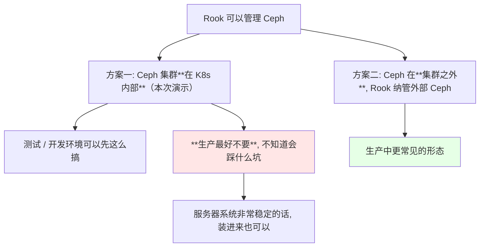
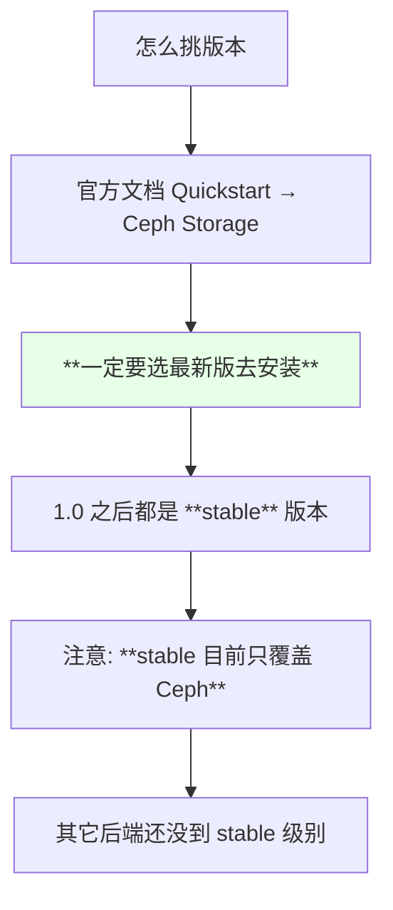
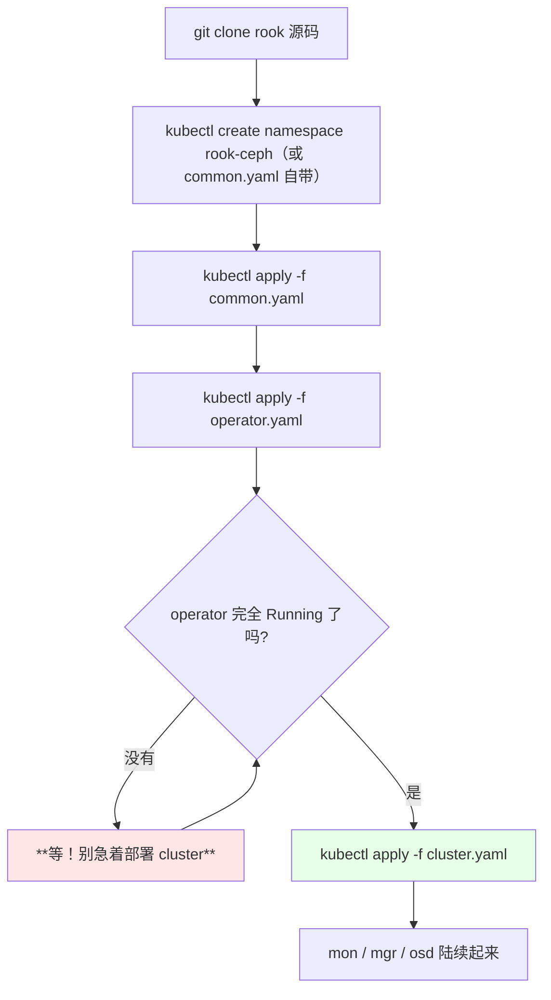
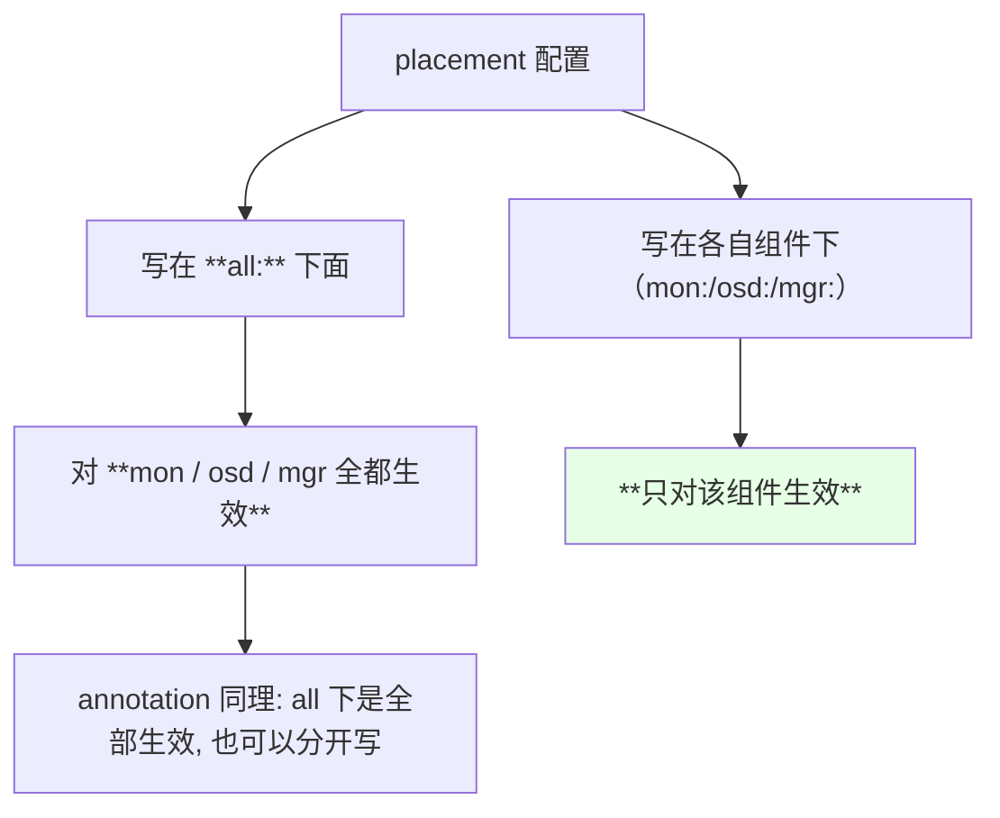
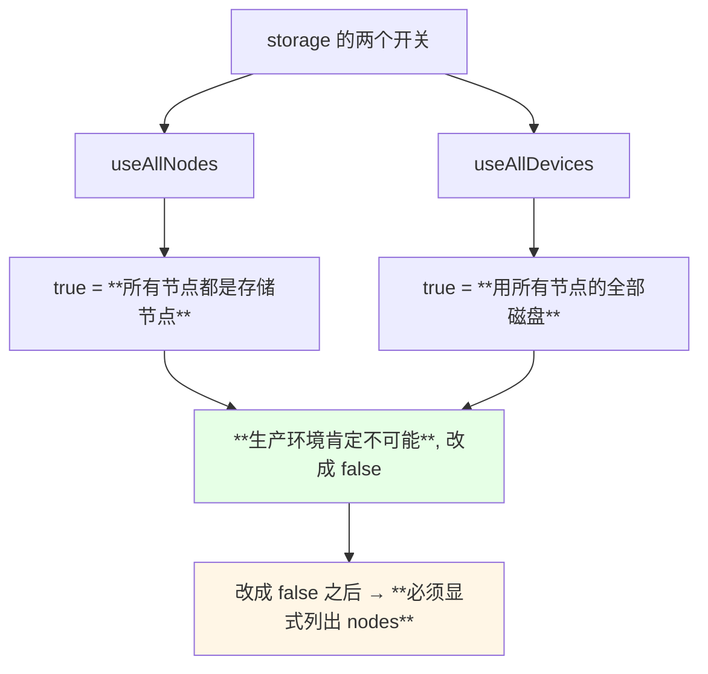
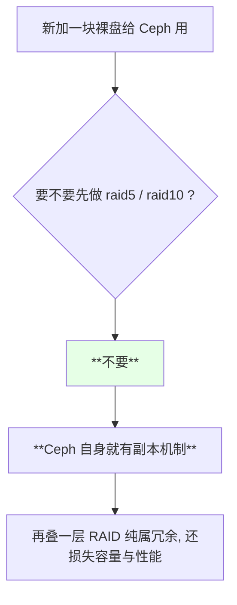
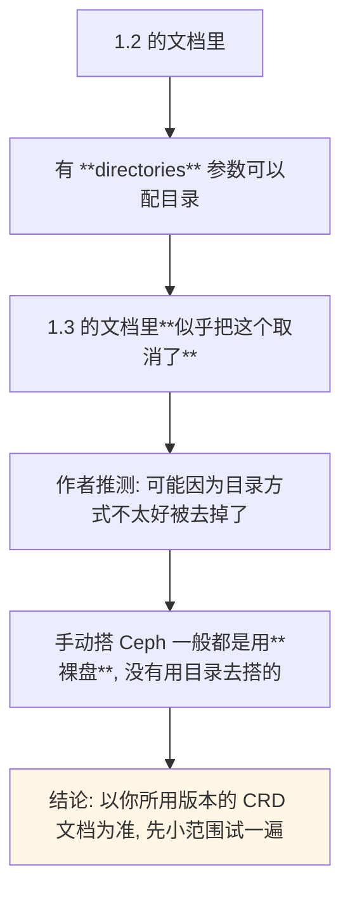
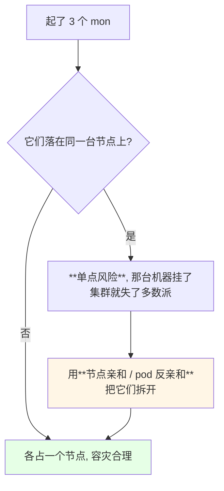
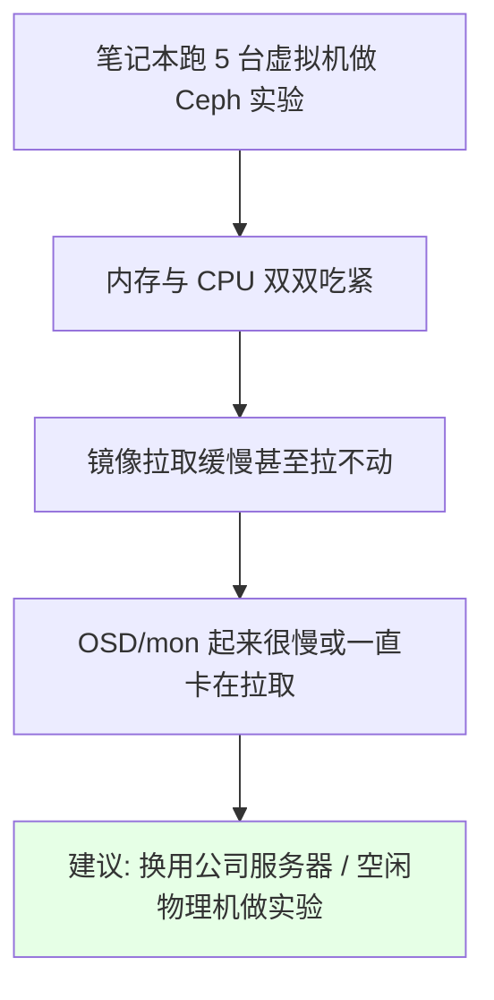

# Kubernetes 集群部署: Rook 部署实记（operator 先起来、cluster 后部署，以及存储节点用裸盘还是目录的取舍）

上一节介绍了 Rook 的作用，这一节把它装起来。核心就一句话：**Rook 的安装本身非常简单，真正要想清楚的是「哪些节点、哪些盘真正参与存储」**。

结论先摆：

1. **演示是把 Ceph 装在 Kubernetes 集群内部**；生产环境可以把 Ceph 放在集群之外，**Rook 同样能管理外部 Ceph**；
2. 课程作者的态度很明确：**生产环境最好不要把 Ceph 装到 K8s 内部**（「不知道你会遇到什么坑」），但 Rook 本来就是为云原生设计的，系统够稳定的话装进来也可以；
3. **安装动作只有两步**：先把源码拉下来 → 依次 apply operator 和 cluster，**中间必须等 operator 完全起来**；
4. **所有组件都装进 `rook-ceph` 这个 namespace**；
5. **1.0 之后都是 stable 版本，但 stable 只覆盖 Ceph**，其它存储后端还没到 stable 级别；
6. **storage 段是最该改的地方**：`useAllNodes`（所有节点都当存储节点）和 `useAllDevices`（用所有磁盘）在生产肯定不成立，都要改成 `false` 再显式列出存储节点；
7. **做存储节点的裸盘不要组 RAID**（raid5 / raid10 都不需要），**Ceph 自身就有副本机制**。

## 纲要

- Ceph 装进 K8s 还是放在外面
- 版本怎么选：stable 与 quickstart
- 拉源码与目录结构
- 两步走：operator 先、cluster 后
- rook-ceph 命名空间与 rook-agent
- mon / MGR / dashboard
- 节点亲和与 annotation 的「全局 vs 分组件」
- resources：测试不配、生产给够
- storage 段：useAllNodes 与 useAllDevices 必须改成 false
- 显式指定存储节点：裸盘与目录两种方式
- 为什么存储盘不要做 RAID
- dataDirHostPath 与 directories 的版本差异
- 让 mon 分散在不同节点
- 实验环境的资源现实

## Ceph 装进 K8s 还是放在外面



> 课程原话：**「生产环境最好不要把 Ceph 装到 K8s 内部，因为不知道你会遇到什么坑；当然如果你们服务器系统非常稳定的话，其实装在 K8s 里面也是可以的，毕竟 Rook 是为云原生设计的」**。

## 版本怎么选：stable 与 quickstart



| 事实 | 说明 |
| --- | --- |
| stable 起点 | **1.0 之后**都是 stable |
| stable 覆盖范围 | **目前只支持 Ceph** |
| 安装入口 | Quickstart → **Ceph Storage** |
| 版本迭代 | 课程录制时刚从 1.2 跳到 1.3 |

> 既然决定用云原生存储，**就选 Rook**。

## 拉源码与目录结构

```bash
git clone https://github.com/rook/rook.git
cd rook/cluster/examples/kubernetes/ceph
ls
# common.yaml  operator.yaml  cluster.yaml  ...
```

```text
配置项所在目录:

rook/
└── cluster/
    └── examples/
        └── kubernetes/
            └── ceph/
                ├── common.yaml       ← CRD / RBAC / namespace 等公共资源
                ├── operator.yaml     ← Rook operator
                ├── cluster.yaml      ← **CephCluster，改得最多的一份**
                └── ...

注意: 文档路径会变（早期是 cluster/test, 后来改成 cluster）
     以你拉下来的实际目录为准
```

## 两步走：operator 先、cluster 后



> 课程反复强调：**「等你的 operator 起来之后，你再部署这个（cluster）……等里边那个完全启动之后，然后再部署」**。顺序错了，后面那一坨资源会因为 CRD / operator 没就绪而拉不起来。

```bash
kubectl get pods -n rook-ceph -w
# 看到 rook-ceph-operator-xxx  Running 之后再往下走
```

## rook-ceph 命名空间与 rook-agent

```text
rook-ceph namespace 里通常会有这些角色:

rook-ceph
├── rook-ceph-operator        ← 大脑，负责编排
├── rook-discover             ← 发现节点上的磁盘
├── rook-ceph-mon-a/b/c       ← monitor，数量可配
├── rook-ceph-mgr-a           ← manager（可不开）
├── rook-ceph-osd-xxx         ← OSD，真正落盘的地方
└── rook-ceph-mds-xxx         ← 文件系统元数据（共享文件系统类型才需要）
```

| 组件 | 作用 | 备注 |
| --- | --- | --- |
| operator | 编排整个 Ceph 集群 | **必须最先 Ready** |
| **rook-agent / discover** | **每个节点起一个**，负责发现磁盘 | 架构图里讲过的那个 agent |
| mon | 维护集群状态（演示配 3 个） | 生产可以起更多 |
| mgr | 管理面 | 演示环境不需要就关掉 |
| dashboard | **Ceph 的管理界面** | 配置项里可开关 |
| osd | 真正存数据的进程 | 与「哪些节点哪些盘」直接相关 |

## mon / MGR / dashboard

```yaml
  mon:
    count: 3
    allowMultiplePerNode: false
  mgr:
    enabled: false            # 演示环境先不开
  dashboard:
    enabled: true             # Ceph 的管理界面
```

| 配置项 | 演示取值 | 生产建议 |
| --- | --- | --- |
| `mon.count` | **3** | 可以按规模起更多（一般奇数个） |
| MGR | **关闭** | 按需开启 |
| dashboard | 可开 | Ceph 的管理界面，建议在内网开放 |

## 节点亲和与 annotation 的「全局 vs 分组件」



```yaml
  placement:
    all:                      # 这里写的 mon / osd / mgr 都吃
      nodeAffinity: {}
      tolerations: []
      podAffinity: {}
      podAntiAffinity: {}
    mon:                      # 只给 mon 单独配
      nodeAffinity: {}
```

> 课程直接点明：**「all 就是对所有的都生效，比如说 mon、osd 或者 mgr 都生效；如果你配单独的，就直接在这下面指定就可以」**。

## resources：测试不配、生产给够

```yaml
  resources:
    mon:
      requests:
        cpu: "1"
        memory: 4Gi
      limits:
        cpu: "2"
        memory: 8Gi
```

| 环境 | 建议 |
| --- | --- |
| 测试环境 | **可以先不配**，省资源 |
| 生产环境 | **按官方文档配，最好给大一点**（尤其是 CPU 不要压得太狠） |

> 课程的建议是直白的：**测试环境可以先不配，生产环境按官方文档配，而且最好比示例给得再宽一些**。

## storage 段：useAllNodes 与 useAllDevices 必须改成 false

这是整个配置里**最该动手的两行**：

```yaml
  storage:
    useAllNodes: false        # ← 改成 false
    useAllDevices: false      # ← 改成 false
```



| 开关 | 默认值含义 | 生产取舍 |
| --- | --- | --- |
| `useAllNodes` | 所有节点都是存储节点 | **改成 false** |
| `useAllDevices` | 使用所有磁盘 | **改成 false** |

> **一旦两个都为 false，就必须在下面把存储节点逐一写出来**，否则 Ceph 一个 OSD 也起不来。

## 显式指定存储节点：裸盘与目录两种方式

课程里的存储节点安排：

```text
本次实验的存储节点:

k8s-master03
└── /dev/sdb        ← **一块新加的裸盘**（什么都没动过）

k8s-node02
└── /data/cephdata  ← **宿主机上的一个目录**（提前创建好的）
```

```yaml
  storage:
    useAllNodes: false
    useAllDevices: false
    nodes:
    - name: "k8s-master03"
      devices:
      - name: "sdb"
    - name: "k8s-node02"
      directories:
      - path: "/data/cephdata"
```

| 方式 | 写法 | 特点 |
| --- | --- | --- |
| **裸盘** | `devices: [{name: sdb}]` | 手动搭 Ceph 时的标准做法 |
| **目录** | `directories: [{path: /data/cephdata}]` | **直接用宿主机目录**，课程认为「可能性能比较好一点」 |
| PVC | 也可以用 PVC | 另一种可选形态 |

> `nodes[].name` 填的是**主机名**，与节点上 `kubernetes.io/hostname` 这个 label 的值一一对应 —— 直接写主机名即可。

## 为什么存储盘不要做 RAID



> 课程原话：**「因为 Ceph 是有自己的副本的，所以你不需要做 raid5 或者 raid10 这一类的东西，你直接用裸盘就可以」**。

## dataDirHostPath 与 directories 的版本差异



| 版本 | 目录方式 |
| --- | --- |
| 1.2 | 有 `directories` 参数 |
| 1.3 | 作者没找到该项，**疑似被移除** |

> 课程作者很坦诚：**「这个是刚出来的新版本，我还没有看他的 changelog，我也不知道他做了哪些改变」** —— 遇到这种跨版本差异，**不要硬套老配置**，先查看对应版本的 CRD 文档（`CephCluster` 的那份），确认字段还在不在。

另外 `dataDirHostPath` 是**数据保存目录**，保持默认即可：

```yaml
  dataDirHostPath: /var/lib/rook
```

## 让 mon 分散在不同节点



> cluster.yaml 里没写这段，**官方文档给了示例**（course 里指的也是那份 CRD / cluster 文档）。做法是给 mon 单独配 `podAntiAffinity` 或节点亲和，让多个 mon 尽量分布在不同节点。

除了 storage 之外，修改频率最高的就是这几处：

| 改得多的地方 | 改得少的 |
| --- | --- |
| **`storage` 节点配置** | `resources` 之后的其余项 |
| **`resources`**（生产必备） | `annotation` |
| **亲和 / 反亲和**（生产常配） | 其它杂项 |

## 实验环境的资源现实

```text
课程作者的实验环境:

一台笔记本跑 **5 台虚拟机**, 每台约 3~4G 内存 → 总计约 20G
结果: CPU 一度飙到 60+, 机器扛不住

临时处理办法:
  把 master02 / master03 上的 kube-apiserver、kube-controller-manager 关掉
  只保留 master01 干活
  etcd 也占了不小的 CPU, 必要时把 etcd 成员降到单节点

结论: 有条件请用**公司的服务器**做这类实验
```



> 课程结尾也提到，**当时镜像没拉下来、这一節没演示完整**，下一节接着做。

## API 速览

| 能力 | 做法 | 关键点 |
| --- | --- | --- |
| 看 rook-ceph 里的东西 | `kubectl get pods -n rook-ceph` | 判据是 operator 先 Ready |
| 盯进度 | `kubectl get pods -n rook-ceph -w` | — |
| 看 CephCluster 资源 | `kubectl get cephcluster -n rook-ceph` | 定义在 common.yaml 的 CRD 里 |
| 看 CRD 字段说明 | 官方文档的 CephCluster CRD 页面 | **跨版本差异要先查这里** |
| 看节点的主机名 label | `kubectl get nodes --show-labels \| grep hostname` | `nodes[].name` 要与之对应 |
| 看磁盘 | `lsblk` / `fdisk -l` | 找没被占用过的裸盘 |
| 确认裸盘没被格式化 | `lsblk -f` | 有文件系统的不能直接用 |
| 看 operator 日志 | `kubectl logs -n rook-ceph deploy/rook-ceph-operator -f` | 起不来先看这里 |

字段速查：

| 字段 | 作用 |
| --- | --- |
| `spec.mon.count` | monitor 数量，演示为 3 |
| `spec.mgr.enabled` | 是否起 mgr，演示为 false |
| `spec.dashboard.enabled` | Ceph 管理界面开关 |
| `spec.dataDirHostPath` | 数据保存目录，保持默认 |
| `spec.storage.useAllNodes` | 是否所有节点都当存储节点，**生产改 false** |
| `spec.storage.useAllDevices` | 是否用所有磁盘，**生产改 false** |
| `spec.storage.nodes[].name` | **主机名**，对应 `kubernetes.io/hostname` |
| `spec.storage.nodes[].devices[].name` | 用哪块裸盘 |
| `spec.storage.nodes[].directories[].path` | 用哪个宿主机目录（**注意版本支持情况**） |
| `spec.placement.all` | 对 mon / osd / mgr **全部生效**的调度规则 |

## Demo 示例

```bash
# 1. 拉源码, 进到 ceph 示例目录
git clone https://github.com/rook/rook.git
cd rook/cluster/examples/kubernetes/ceph
ls

# 2. 先建公共 CRD / RBAC / namespace
kubectl apply -f common.yaml
kubectl get ns rook-ceph

# 3. 起 operator
kubectl apply -f operator.yaml
kubectl get pods -n rook-ceph -w
# 必须看到 rook-ceph-operator-xxx  Running 才继续

# 4. 先在存储节点上准备好资源
#    k8s-master03: 一块未格式化的裸盘 /dev/sdb（不做 RAID）
#    k8s-node02:   提前 mkdir -p /data/cephdata
lsblk -f

# 5. 确认主机名与节点的 hostname label 一致
kubectl get nodes --show-labels | tr ',' '\n' | grep hostname

# 6. 改 cluster.yaml（useAllNodes/useAllDevices 置 false + 列出 nodes）后部署
kubectl apply -f cluster.yaml
kubectl get pods -n rook-ceph -w

# 7. 看 CephCluster 状态
kubectl get cephcluster -n rook-ceph
kubectl describe cephcluster rook-ceph -n rook-ceph

# 8. 起不来就看 operator 日志
kubectl logs -n rook-ceph deploy/rook-ceph-operator -f
```

```yaml
# cluster.yaml —— 关键改造片段（storage 段是重点）
apiVersion: ceph.rook.io/v1
kind: CephCluster
metadata:
  name: rook-ceph
  namespace: rook-ceph
spec:
  dataDirHostPath: /var/lib/rook
  cephVersion:
    image: ceph/ceph:v14.2.8
    allowUnsupported: false
  mon:
    count: 3
    allowMultiplePerNode: false
  mgr:
    enabled: false
  dashboard:
    enabled: true
  network:
    hostNetwork: false
  placement:
    all:                       # 对 mon / osd / mgr 全生效
      nodeAffinity: {}
      tolerations: []
      podAffinity: {}
      podAntiAffinity: {}
  storage:
    useAllNodes: false         # ← 生产一定改 false
    useAllDevices: false       # ← 生产一定改 false
    nodes:
    - name: "k8s-master03"
      devices:
      - name: "sdb"
    - name: "k8s-node02"
      directories:
      - path: "/data/cephdata"
```

```yaml
# mon 反亲和示例 —— 让多个 mon 不要挤在同一台节点
spec:
  placement:
    mon:
      podAntiAffinity:
        preferredDuringSchedulingIgnoredDuringExecution:
        - weight: 100
          podAffinityTerm:
            labelSelector:
              matchExpressions:
              - key: app
                operator: In
                values:
                - rook-ceph-mon
            topologyKey: kubernetes.io/hostname
```

```text
两种形态的取舍:

Ceph 装在 K8s 内部
├── 适用: 测试 / 开发环境
└── 生产: 作者明确不建议（不知道会踩什么坑）

Ceph 在集群外, Rook 纳管
├── 适用: 生产更常见的形态
└── 好处: 存储面与业务面风险隔离
```

### 总结

- **演示是把 Ceph 装进 K8s 集群内部，但作者明确不建议生产这么做**（「不知道你会遇到什么坑」）；Rook 本身**也能管理集群外部的 Ceph**，那是生产里更常见的形态；
- **安装只有两步且很简单**：拉源码 → 依次 apply `common.yaml`、`operator.yaml`、`cluster.yaml，**中间必须等 operator 完全 Running**，否则后面的资源起不来；所有组件落在 `rook-ceph` 命名空间里；
- **版本要选最新版**（1.0 之后都是 stable，但 **stable 目前只覆盖 Ceph**）；**`cluster/test` 这类文档路径会变**，以实际拉下来的目录和对应版本的 CRD 文档为准；
- **storage 段是改动重点**：`useAllNodes` 和 `useAllDevices` 在生产都必须改成 `false`，然后**显式列出存储节点**（`nodes[].name` 写主机名，对应 `kubernetes.io/hostname`）；
- **给 Ceph 用的盘必须是裸盘且不组 RAID** —— **Ceph 自身有副本机制**，raid5 / raid10 纯属冗余；目录方式（`directories`）在 1.2 可用、**1.3 疑似被移除**，用之前务必查对应版本的 CRD 文档；
- **`placement.all` 下的调度规则对 mon / osd / mgr 全部生效**，也可以在每个组件下单独配；**3 个 mon 建议用亲和/反亲和拆到不同节点**；最后是现实提醒 —— 这类实验吃内存和 CPU，**有条件请用公司服务器**。

