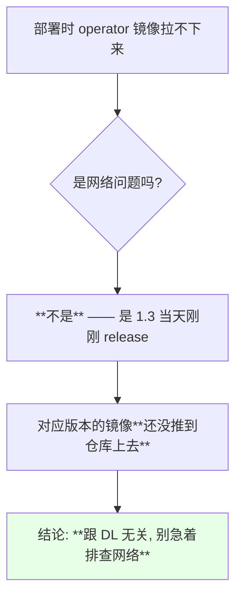
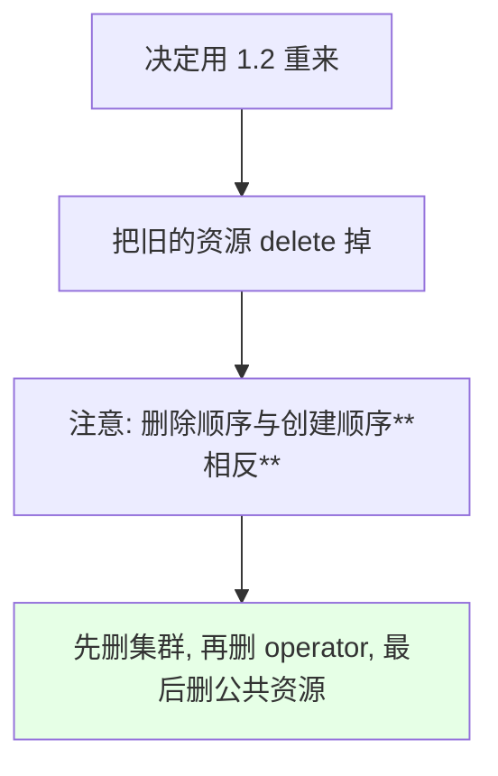
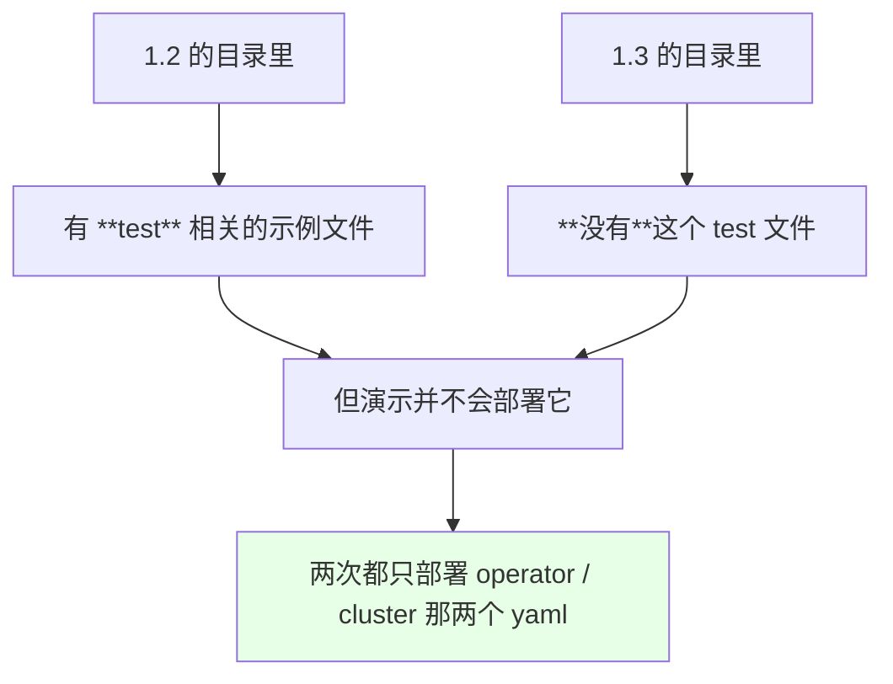
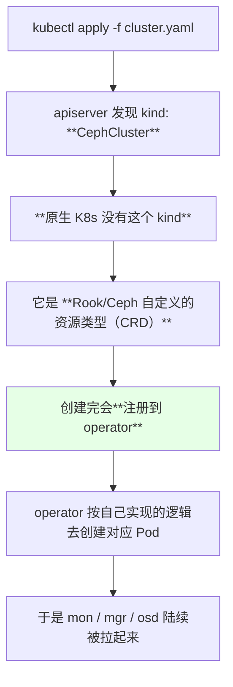
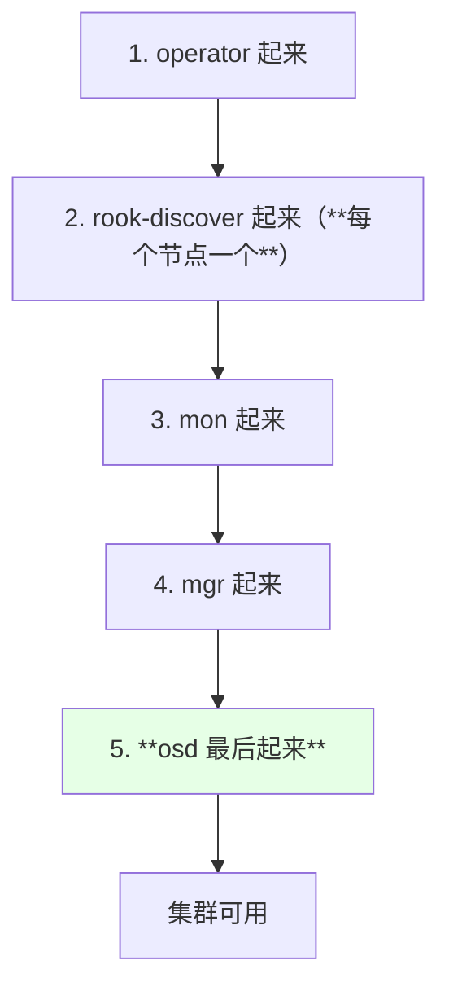
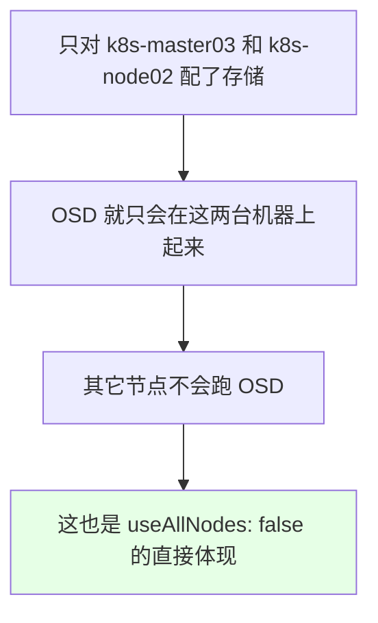
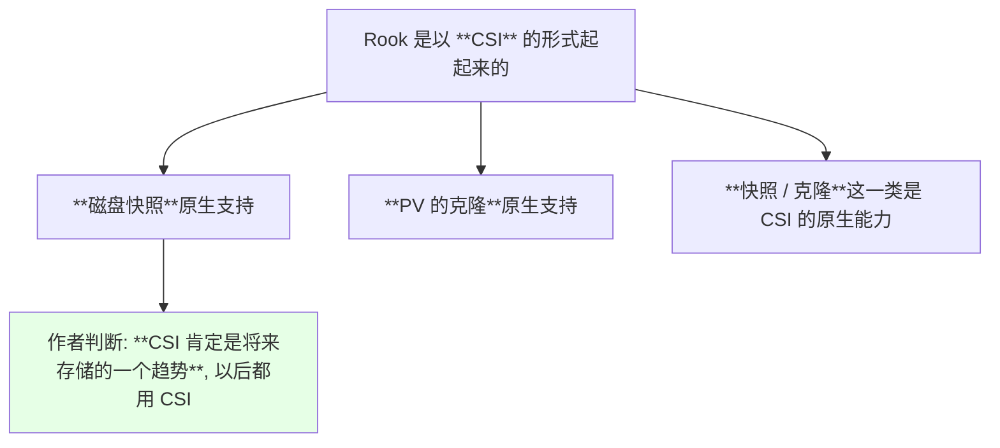
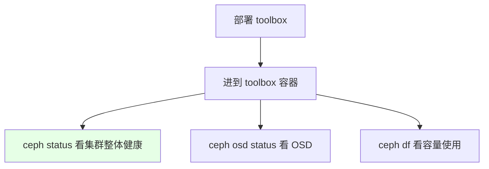
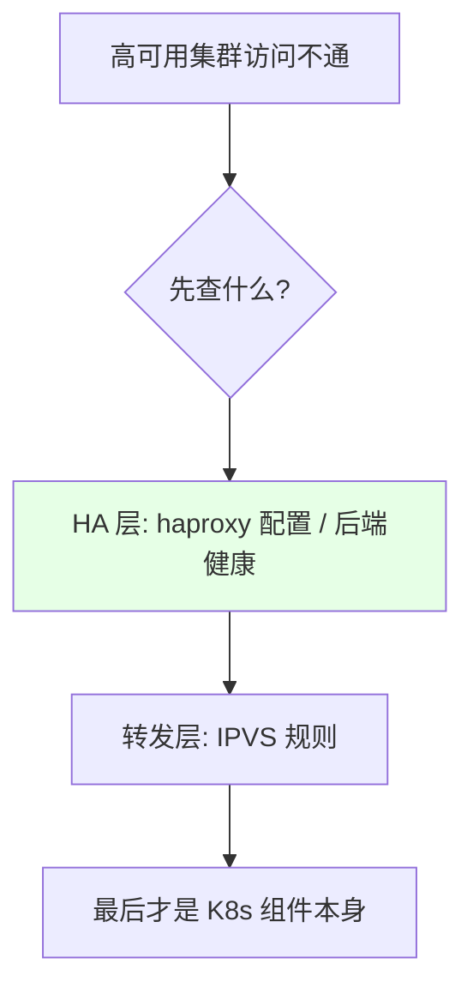

# Kubernetes 集群部署: 用 Rook 把 Ceph 集群最终搭起来（CephCluster 是 CRD、组件启动顺序与 toolbox 验收）

上一节卡在镜像拉不下来 —— **原因是当天刚 release 的 1.3 版本镜像还没推上去**。这一节回到 1.2 版本真正把集群跑起来，顺带把过程中**最能体现 Rook 本质**的几件事讲清楚：`CephCluster` 到底是个什么东西、为什么是以 CSI 的形式在跑、各个组件的启动顺序。

结论先摆：

1. **新版本刚 release 的当天，镜像可能还没推到仓库** —— 拉不下来不一定是网络问题，**先怀疑版本太新**；
2. **`CephCluster` 这个 kind 在原生 Kubernetes 里根本不存在**，它是 Rook/Ceph **自定义的 CRD**，创建完注册到 operator 上，**由 operator 按自己的逻辑去拉起真正的 Pod**；
3. **安装时会注册一大批 CRD**：CephBlockPool（块存储的池）、CephFilesystem（文件系统）、NFS 等；
4. **组件是有先后顺序的**：operator → rook-discover（每节点一个）→ mon → mgr → **OSD 最后**；
5. **OSD 只会在你指定的存储节点上出现**（本次是 k8s-master03 与 k8s-node02）；
6. **它是以 CSI 的形式跑起来的** —— 作者判断 **CSI 是未来存储的趋势**，而且**磁盘快照、PV 克隆都是原生支持**的；
7. 最后部署一个 **toolbox**，用它查 `ceph status`。

## 纲要

- 为什么 1.3 镜像拉不下来
- 回退到 1.2 并把旧部署清干净
- common.yaml 铺的是什么：namespace 与一大堆 RBAC
- 1.2 与 1.3 目录结构的小差异
- cluster.yaml 这次改了哪些
- kind: CephCluster —— 原生 K8s 没有的这个类型
- CRD 一览：CephBlockPool / CephFilesystem / NFS
- 组件启动顺序：operator → discover → mon → mgr → osd
- OSD 只在你指定的存储节点上出现
- 为什么是 CSI：趋势与能力
- toolbox：用它验收 Ceph 状态
- course 里那次环境故障的根因
- 全流程小结

## 为什么 1.3 镜像拉不下来



| 现象 | 真因 |
| --- | --- |
| `ImagePullBackOff` / 拉取卡住 | **当天新 release 的版本，镜像未同步** |

> 课程原话：**「昨天那个镜像拉不下来，是因为 1.3 是我们讲课的时候刚刚 release 的一个版本，它的镜像还没有推上去」**。过一段时间再看自然就好了 —— 这也是「要不要追最新版」的一个现实代价。

## 回退到 1.2 并把旧部署清干净

```bash
# 按当初部署的反方向 delete 一遍
kubectl delete -f cluster.yaml
kubectl delete -f operator.yaml
kubectl delete -f common.yaml
```



> 课程做法：**「我这边已经把之前那些都删掉了，你们也不用删，把昨天那些文件再执行一遍 delete 就可以」**。

## common.yaml 铺的是什么：namespace 与一大堆 RBAC

```bash
kubectl apply -f common.yaml
# namespace/rook-ceph created
# clusterrole.rbac.authorization.k8s.io/rook-ceph-global created
# clusterrolebinding... rolebinding... serviceaccount...
```

```text
common.yaml 铺出来的东西:

rook-ceph（namespace）
├── ClusterRole        ← 一大堆权限
├── ClusterRoleBinding
├── RoleBinding
├── ServiceAccount
└── CRD（各种自定义资源）
```

> 课程现场点评：**「他创建了一个 namespace，下面就是一大堆一大堆权限，就是 ClusterRole、ClusterRole 还有 RoleBinding 这一类的东西」**。

## 1.2 与 1.3 目录结构的小差异



> 结论：**文档路径会随版本变，安装方法本身不变** —— 别被多出来/少掉的示例文件带偏。

## cluster.yaml 这次改了哪些

```text
本次对 cluster.yaml 的修改清单:

├── dataDirHostPath         ← 数据目录（保持默认）
├── mon.count               ← 演示改**成一个**（生产建议 3 个并分散节点）
├── dashboard.enabled       ← **打开**（后面要用；这是 Ceph MGR 自带的 Web 面板，依赖 mgr 组件先起来，别和 mgr 本身混淆）
├── placement（亲和）        ← 生产: mon / mgr 尽量部署在**不同节点**
├── resources              ← 生产: 按官方建议配; 演示先不配（机器没资源）
├── storage.useAllNodes    ← 改成 **false**
├── storage.useAllDevices  ← 改成 **false**
└── storage.nodes          ← **打开并显式列出**:
    ├── k8s-master03        → 裸盘 sdb
    └── k8s-node02          → 目录 /data/cephdata
```

| 配置项 | 演示取值 | 生产建议 |
| --- | --- | --- |
| `mon.count` | 1 | **3（奇数）且分散到不同节点** |
| `dashboard.enabled` | true | 按需（内网开放） |
| `placement` | 不配 | **mon / mgr 分散部署** |
| `resources` | 不配（资源不够） | **按官方建议给足** |
| `useAllNodes` / `useAllDevices` | false | false |

> 磁盘/目录名**还可以写成正则**（磁盘数量多时很方便），例如统一匹配 `sd*` 这类写法。

## kind: CephCluster —— 原生 K8s 没有的这个类型

```yaml
apiVersion: ceph.rook.io/v1
kind: CephCluster
metadata:
  name: rook-ceph
  namespace: rook-ceph
```



> 课程解释得很清楚：**「这个 kind 呢，在 K8s 中是没有的，它们是自定义的一个资源文件类型；创建完以后会注册到它的 operator 里面，operator 会根据他自己的一些逻辑去创建」**。

这就是为什么 **operator 必须先 Ready** —— CRD 只是定义，**真正干活的是 operator 的那套控制循环**。

## CRD 一览：CephBlockPool / CephFilesystem / NFS

```bash
kubectl get crd | grep ceph
```

```text
rook 注册的 CRD（示意）:

CRD
├── cephclusters.ceph.rook.io        ← 集群本体（本篇用的）
├── cephblockpools.ceph.rook.io      ← **块存储的「池子」**
├── cephfilesystems.ceph.rook.io     ← 文件系统类型存储
├── cephnfses.ceph.rook.io           ← NFS
├── cephobjectstores.ceph.rook.io    ← 对象存储
└── ...
```

| CRD | 用途 |
| --- | --- |
| `CephCluster` | 描述整个 Ceph 集群 |
| **`CephBlockPool`** | **块存储的池**，后面建 block storage 会用到 |
| `CephFilesystem` | 共享文件系统类型的存储 |
| `CephNFS` | NFS 相关 |

> 后续章节里「创建块存储 / 共享文件系统」本质就是**创建这些 CRD 对象 + 一个 StorageClass**。

## 组件启动顺序：operator → discover → mon → mgr → osd



| 顺序 | 组件 | 备注 |
| --- | --- | --- |
| 1 | `rook-ceph-operator` | 必须先 Ready |
| 2 | `rook-discover` | **每个节点起一个**，发现磁盘 |
| 3 | `rook-ceph-mon-*` | 集群状态维护 |
| 4 | `rook-ceph-mgr-*` | 管理面 |
| 5 | `rook-ceph-osd-*` | **真正落盘，起得最慢** |

> 课程里明确：「operate 已经起来了，operator 起来之后 discover 也起来了，这是在每一个节点上面起了一个进程；之后它会起 OSD 还有 monitor」。

## OSD 只在你指定的存储节点上出现



```bash
kubectl get pods -n rook-ceph -o wide | grep osd
```

```text
官网示例中部署完成应有的组件（示意）:

rook-ceph-mon-a/b/c
rook-ceph-mgr-a
rook-ceph-osd-0/1/2
rook-discover-xxxxx
rook-ceph-agent-xxxxx     ← 课程作者观察到: **这个版本里没有了**（版本差异）
```

> 版本差异提醒：作者看着官网例子发现 **agent 进程没了** —— **「这版本不一样就没了」**。遇到文档与实际不符，先看版本号。

## 为什么是 CSI：趋势与能力



> 后面的课时会演示**磁盘快照**的实际使用。

## toolbox：用它验收 Ceph 状态

官方还提供了一个 **toolbox**（示例目录里的 toolbox yaml），里面可以直接跑 `ceph` 命令：

```bash
kubectl apply -f toolbox.yaml
kubectl get pods -n rook-ceph | grep tools
TOOLS=$(kubectl get pods -n rook-ceph -l app=rook-ceph-tools -o jsonpath='{.items[0].metadata.name}')
kubectl exec -it -n rook-ceph "$TOOLS" -- ceph status
kubectl exec -it -n rook-ceph "$TOOLS" -- ceph osd status
kubectl exec -it -n rook-ceph "$TOOLS" -- ceph df
```



> 到这一步，**整个 Rook + Ceph 系统就搭建完成了**。后面要做的就是建池、建 StorageClass、让应用申请存储。

## course 里那次环境故障的根因

课程中途作者的集群突然不通了，这里把根因记下来 —— 属于他自己的环境问题，但排查思路值得借鉴：

```text
故障链路:

作者前一天把 master02 / master03 上的 kube-apiserver 关掉（省资源）
   ↓
节点又经常重启
   ↓
**haproxy 那一块出问题**
   ↓
IPVS 转发不通 → 整个集群访问异常
   ↓
处理: 把 haproxy 的配置改掉才恢复
```



> 课程也提醒：**「这个问题你们应该没有，不需要考虑」** —— 但「先查负载均衡再查组件」这条顺序是通用的。

另外，作者环境 CPU 一度飙到 **86%**，导致 OSD 起得非常慢。**这是资源不足造成的，不是配置问题**。

## 全流程小结

```text
Rook + Ceph 完整安装流程:

1. git clone rook 源码, 进到 cluster/examples/kubernetes/ceph
2. kubectl apply -f common.yaml           ← namespace + RBAC + CRD
3. kubectl apply -f operator.yaml         ← operator 必须 Ready
4. 改 cluster.yaml
   - useAllNodes / useAllDevices = false
   - storage.nodes 显式列出存储节点（主机名 + 裸盘名 / 目录）
   - mon.count（生产 3 个并分散）
   - dashboard / resources / placement（按需）
5. kubectl apply -f cluster.yaml          ← kind: CephCluster（CRD）
6. 等 discover → mon → mgr → osd 陆续起来
7. kubectl apply -f toolbox.yaml           ← 验收: ceph status
```

## API 速览

| 能力 | 做法 | 关键点 |
| --- | --- | --- |
| 清理重来 | `kubectl delete -f` 逐个删 | **顺序与创建相反** |
| 看 CRD | `kubectl get crd \| grep ceph` | CephCluster / CephBlockPool 等 |
| 看 CephCluster | `kubectl get cephcluster -n rook-ceph` | 自定义资源 |
| 看组件 | `kubectl get pods -n rook-ceph -o wide` | 观察 OSD 落在哪些节点 |
| 看 OSD | `kubectl get pods -n rook-ceph \| grep osd` | 起得最慢 |
| 看 operator 日志 | `kubectl logs -n rook-ceph deploy/rook-ceph-operator -f` | 起不来看这里 |
| 进 toolbox | `kubectl exec -it -n rook-ceph <TOOLS> -- ceph status` | 验收集群 |
| 看容量 | toolbox 里 `ceph df` | — |
| 看集群名字 | `kubectl get cephcluster -n rook-ceph` | 后面 StorageClass 要引用 |

字段速查：

| 字段 | 作用 |
| --- | --- |
| `kind: CephCluster` | Rook 自定义资源，**原生 K8s 没有** |
| `spec.mon.count` | mon 数量，演示 1、生产 3 |
| `spec.dashboard.enabled` | Ceph 管理界面 |
| `spec.placement` | 各组件的亲和 / 容忍规则 |
| `spec.resources` | 生产按官方建议给足 |
| `spec.storage.nodes[]` | 显式指定存储节点 |

## Demo 示例

```bash
# 1. 按相反顺序清理旧部署
kubectl delete -f cluster.yaml
kubectl delete -f operator.yaml
kubectl delete -f common.yaml

# 2. 拉 1.2 版本源码并进入示例目录
git clone https://github.com/rook/rook.git
cd rook/cluster/examples/kubernetes/ceph

# 3. 铺公共资源的部分（namespace + RBAC + CRD）
kubectl apply -f common.yaml
kubectl get ns rook-ceph
kubectl get crd | grep ceph

# 4. 起 operator，务必等它 Ready
kubectl apply -f operator.yaml
kubectl get pods -n rook-ceph -w

# 5. 改完 cluster.yaml 后部署集群（见下方片段）
kubectl apply -f cluster.yaml
kubectl get pods -n rook-ceph -w
# 顺序: operator → discover → mon → mgr → osd

# 6. 确认 OSD 只落在存储节点上
kubectl get pods -n rook-ceph -o wide | grep osd

# 7. 出问题就看 operator 日志
kubectl logs -n rook-ceph deploy/rook-ceph-operator -f

# 8. 部署 toolbox 并验收
kubectl apply -f toolbox.yaml
TOOLS=$(kubectl get pods -n rook-ceph -l app=rook-ceph-tools -o jsonpath='{.items[0].metadata.name}')
kubectl exec -it -n rook-ceph "$TOOLS" -- ceph status
```

```yaml
# cluster.yaml —— 演示环境的最终形态
apiVersion: ceph.rook.io/v1
kind: CephCluster
metadata:
  name: rook-ceph
  namespace: rook-ceph
spec:
  dataDirHostPath: /var/lib/rook
  mon:
    count: 1                 # 演示改成 1；生产建议 3 并分散
    allowMultiplePerNode: false
  dashboard:
    enabled: true            # 后面要用到的管理界面
  mgr:
    enabled: false
  storage:
    useAllNodes: false
    useAllDevices: false
    nodes:
    - name: "k8s-master03"
      devices:
      - name: "sdb"          # 裸盘，不做 RAID
    - name: "k8s-node02"
      directories:
      - path: "/data/cephdata"
```

```yaml
# toolbox.yaml —— 用于验收的 ceph 工具容器
apiVersion: apps/v1
kind: Deployment
metadata:
  name: rook-ceph-tools
  namespace: rook-ceph
  labels:
    app: rook-ceph-tools
spec:
  replicas: 1
  selector:
    matchLabels:
      app: rook-ceph-tools
  template:
    metadata:
      labels:
        app: rook-ceph-tools
    spec:
      containers:
      - name: rook-ceph-tools
        image: rook/ceph:v1.2.7
        imagePullPolicy: IfNotPresent
        command: ["sleep", "infinity"]
        env:
        - name: ROOK_CEPH_USERNAME
          valueFrom:
            secretKeyRef:
              name: rook-ceph-mon
              key: ceph-username
        - name: ROOK_CEPH_SECRET
          valueFrom:
            secretKeyRef:
              name: rook-ceph-mon
              key: ceph-secret
```

```text
组件与职责对照:

rook-ceph-operator       大脑, 处理 CRD → Pod 的编排（**必须最先起**）
rook-discover           每个节点一个, 发现可用磁盘
rook-ceph-mon-*         维护集群状态（quorum）
rook-ceph-mgr-*         管理面 / dashboard 数据
rook-ceph-osd-*         **真正的数据落盘进程**（起得最慢）
rook-ceph-tools         验收用的 ceph 命令行工具
```

### 总结

- **新 release 的版本当天镜像可能还没推到仓库** —— 拉不下来时先怀疑「版本太新」，而不是网络；课程就是因为 1.3 当天刚 release 才回退到 1.2 重来；
- **清理要按「创建顺序的相反方向」删**（cluster → operator → common），然后同一套步骤再来一遍即可；
- **`CephCluster` 是 Rook 自定义的 CRD，原生 K8s 没有这个 kind**，apply 之后注册到 operator，**由 operator 的控制逻辑去拉起真正的 Pod** —— 这正是 operator 必须先 Ready 的原因；
- **安装会注册一大批 CRD**：`CephCluster`、`CephBlockPool`（块存储的池）、`CephFilesystem`（共享文件系统）、`CephNFS` 等，后续建存储就是创建这些对象；
- **组件启动有明确顺序**：operator → **rook-discover（每节点一个）** → mon → mgr → **OSD 最慢且最后**；**OSD 只会在你显式指定的存储节点上出现**；
- **Rook 以 CSI 的形式运行**，作者判断 **CSI 是未来存储的趋势**，且**磁盘快照、PV 克隆都是原生支持**；最后用官方的 **toolbox** 跑 `ceph status` / `ceph osd status` / `ceph df` 验收，至此整个 Rook + Ceph 系统搭建完成。

