# Kubernetes 集群部署: 创建块存储类型的动态存储（CephBlockPool 副本与失败域、StorageClass 与 StatefulSet 的 volumeClaimTemplates）

Ceph 搭起来了，接下来是真正用它。使用方式分三种：**块存储、文件存储、对象存储**，其中**用得最多的是块存储和文件存储**。这一节先把块存储讲透。

结论先摆：

1. **块存储 = 单个容器挂载一块独立存储**（RWO 那种语义）：Redis 集群 6 个实例各挂一块、数据各不相同；没有持久化，集群出问题就恢复不了；
2. **文件存储 = 多个 Pod 挂同一块存储、实现文件共享**（RWX 语义）：三个前端都要展示同一个用户头像，必须连同一份数据；
3. **对象存储**需要应用写代码直连，课程里用得不多，所以只讲前两种；
4. **用块存储要两步**：先建一个 Ceph 的**池（CephBlockPool）**，再建指向这个池的 **StorageClass**；
5. **`replicated.size` 是副本数**（测试环境设 1），**`failureDomain` 决定副本怎么分散**：`host` 表示副本必须落在不同节点（默认，容灾好），`osd` 则可能都落在同一台机的不同 OSD 上（容灾差）；
6. **动态存储的 `reclaimPolicy` 一般用 `Delete`** —— PVC 都删了，留着 PV 也没用；
7. **StorageClass 没有 namespace 限制**，任何 namespace 的应用都能调用；
8. **StatefulSet 挂动态存储要靠 `volumeClaimTemplates`**，跟 Deployment 的写法不一样。

## 纲要

- Ceph 的三种使用方式
- 块存储：一个容器一块存储
- 文件存储：多个 Pod 共享一份数据
- 对象存储：为什么要写代码
- 用块存储的第一步：建池
- replicated.size：副本数
- failureDomain：host 还是 osd
- 生产要多配 mon / mgr / osd
- 自定义 kind 怎么查
- 第二步：建 StorageClass
- fstype 用 xfs
- reclaimPolicy 为什么用 Delete
- StorageClass 没有 namespace 限制
- StatefulSet 的 volumeClaimTemplates
- 两者的对比：什么时候用哪个

## Ceph 的三种使用方式

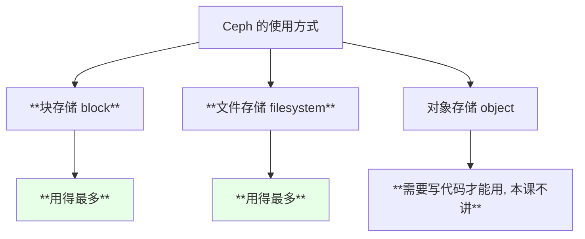

| 类型 | 语义 | 典型场景 |
| --- | --- | --- |
| **块存储** | 单容器挂一块独立盘（类似 RWO） | Redis / MySQL / Kafka 这类有状态实例 |
| **文件存储** | 多 Pod 共享同一份数据（类似 RWX） | 前端静态资源、用户头像等需要共享的文件 |
| 对象存储 | 应用直连、写代码调用 | 本課不涉及 |

## 块存储：一个容器一块存储

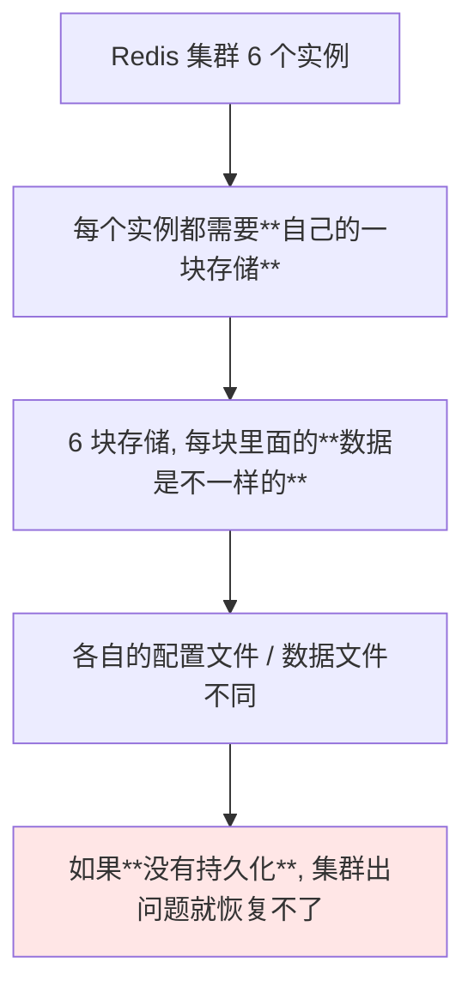

> 课程原话：**「搭一个 Redis 集群，假如有六个实例，它每个实例是不是都要有块存储啊？如果没有存储的话，这个集群出了问题就恢复不了」**。

```text
Redis 集群的六块存储:

redis-0  →  PVC → PV → 独立块设备   （数据 A）
redis-1  →  PVC → PV → 独立块设备   （数据 B）
redis-2  →  PVC → PV → 独立块设备   （数据 C）
...
每个实例各挂一块, 互不相干
```

> 块存储其实也支持多个容器挂载，那在使用形态上就比较接近文件存储了。

## 文件存储：多个 Pod 共享一份数据

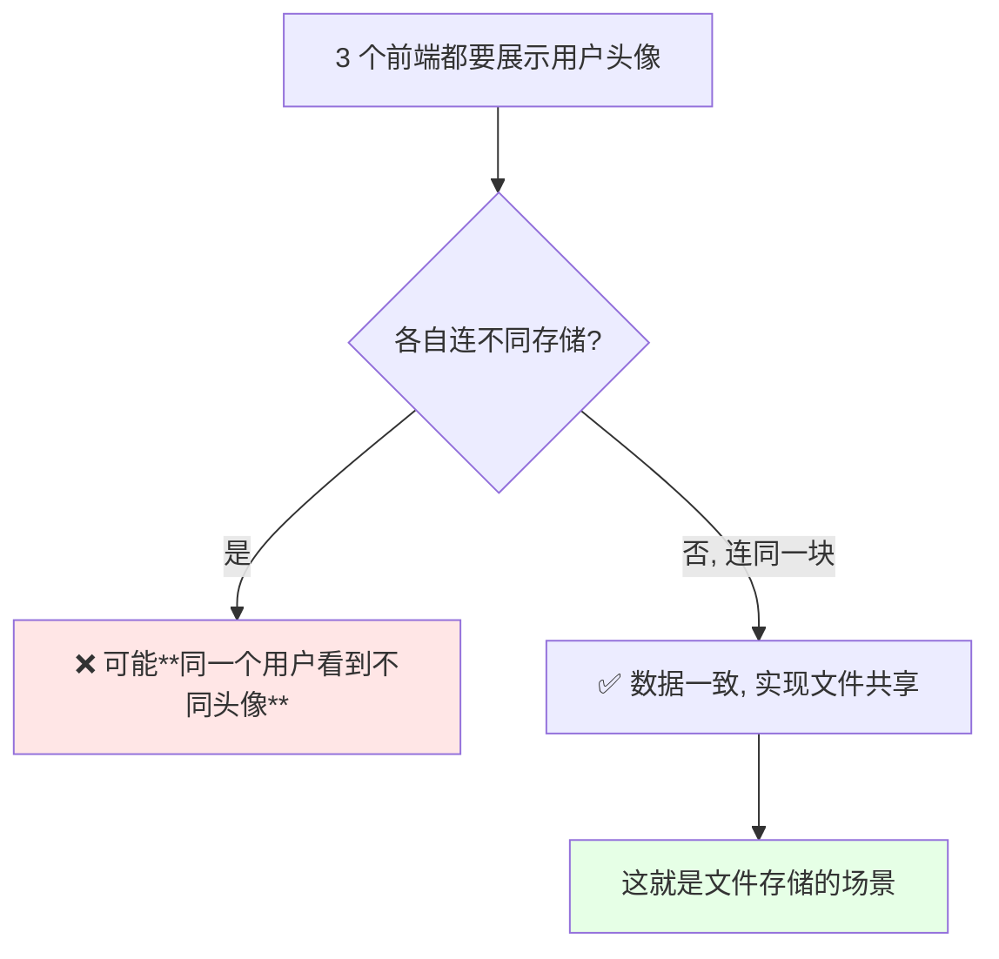

| 场景 | 选哪种 |
| --- | --- |
| 每个实例独立数据（Redis / MQ / DB） | **块存储** |
| 多实例共享同一份文件（头像 / 静态资源） | **文件存储** |

## 对象存储：为什么要写代码

> **对象存储一般是应用程序直连的，需要编写代码才能使用** —— 所以它不在本課范围之内，只讲块存储和文件存储两种。

## 用块存储的第一步：建池

```yaml
apiVersion: ceph.rook.io/v1
kind: CephBlockPool
metadata:
  name: ceph-block-pool
  namespace: rook-ceph
spec:
  failureDomain: host
  replicated:
    size: 1
```

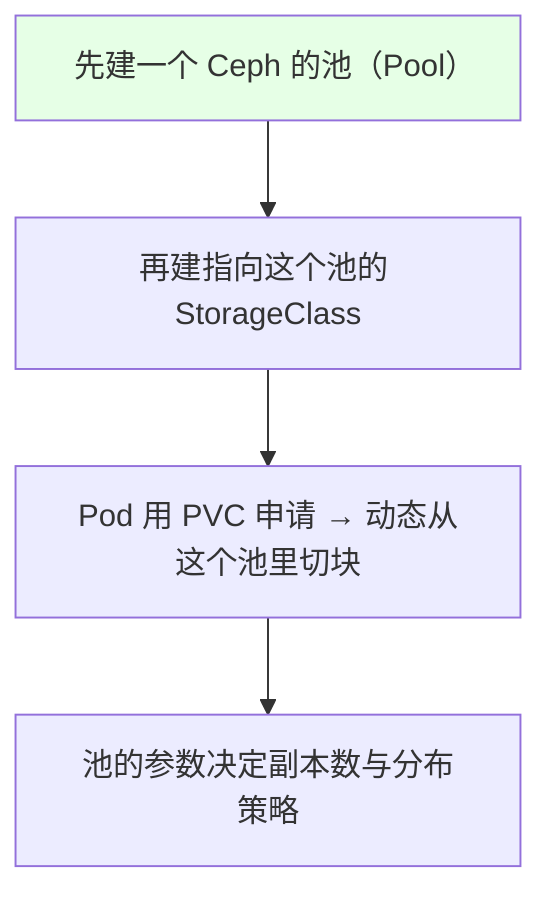

> 如果 Ceph 是搭在 K8s 集群**之外**的，那就需要**在集群之外专门建一个用于 K8s 的池**。

## replicated.size：副本数

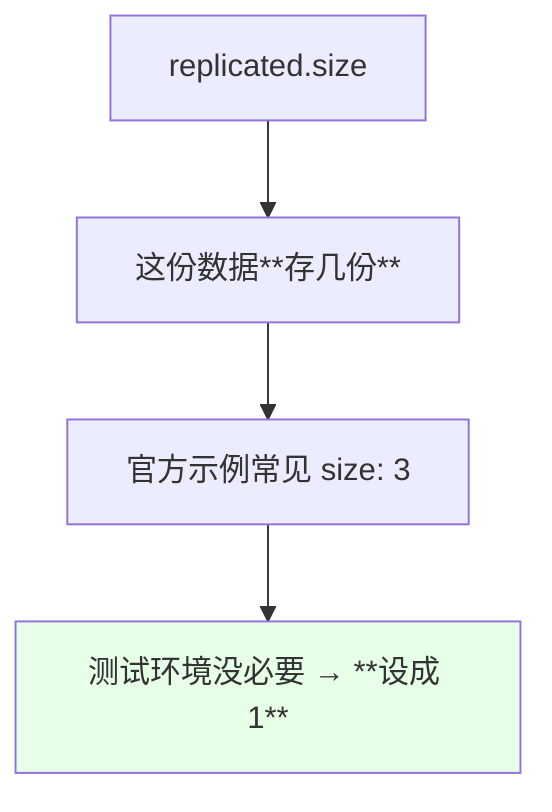

| 环境 | size 取值 | 理由 |
| --- | --- | --- |
| 生产 | **3** | 容忍多点故障 |
| 演示 / 测试 | **1** | 省资源 |

## failureDomain：host 还是 osd

这是本课程讲得最细的一个参数：

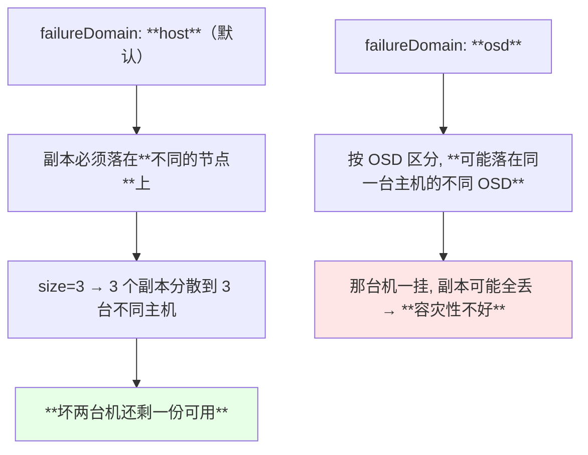

```text
假设 5 个存储节点, size=3, failureDomain=host:

存储集群（5 个节点）
├── node-01   ├── 副本 1     ← 落这里
├── node-02   ├── 副本 2     ← 落这里
├── node-03   └── 副本 3     ← 落这里
├── node-04
└── node-05

⇒ 三个副本必须分散到 3 台不同主机
⇒ 任意两台主机宕机, 仍有一份完整数据可用
⇒ 三台全宕那肯定救不回来
```

| `failureDomain` | 分散粒度 | 容灾 | 备注 |
| --- | --- | --- | --- |
| **`host`（默认）** | 不同主机 | **好** | 推荐 |
| `osd` | 不同 OSD | 差 | 单机多 OSD 时副本可能挤在一台机器上 |

> 课程原话：**「默认 host 是什么意思呢 —— 如果你 size 设成 3，那你的副本就必须在不同的三个节点上。就算你有两个主机宕机了，它的副本数还是有一个可以用的。OSD 就没有这个好，它可能分配到同一个宿主机上的 OSD 上，那容量性不是很好」**。

## 生产要多配 mon / mgr / osd

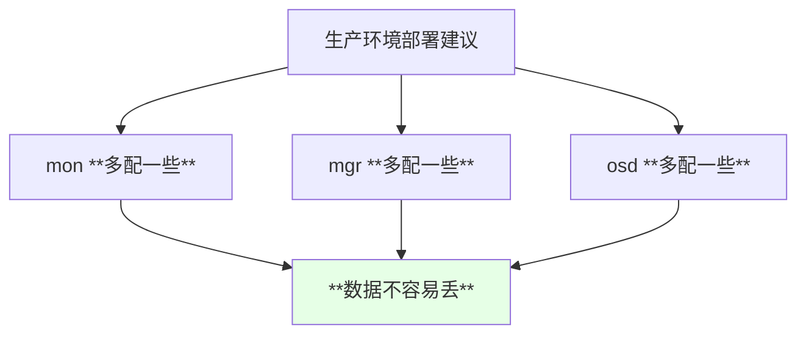

> 课程明确：**「你们在自己的服务器上搭的话，MON、MGR、OSD 一定要多配一些，这样的话数据它不会容易丢」**。演示环境因为机器资源有限只配了最小值。

## 自定义 kind 怎么查

`CephBlockPool` 也是 Rook 的 CRD，所以可以直接 get：

```bash
kubectl get cephblockpool -n rook-ceph
kubectl describe cephblockpool ceph-block-pool -n rook-ceph
```

```text
注意:

kubectl get cephblockpool
   └─ 这是**自定义 kind**
   └─ 如果集群里没装 Rook / Ceph, 这条命令是**执行不了的**
```

## 第二步：建 StorageClass

```yaml
apiVersion: storage.k8s.io/v1
kind: StorageClass
metadata:
  name: rook-ceph-block
provisioner: rook-ceph.rbd.csi.ceph.com
parameters:
  clusterID: rook-ceph
  pool: ceph-block-pool
  imageFormat: "2"
  imageFeatures: layering
  csi.storage.k8s.io/provisioner-secret-name: rook-csi-rbd-provisioner
  csi.storage.k8s.io/provisioner-secret-namespace: rook-ceph
  csi.storage.k8s.io/node-stage-secret-name: rook-csi-rbd-node
  csi.storage.k8s.io/node-stage-secret-namespace: rook-ceph
  fstype: xfs
reclaimPolicy: Delete
```

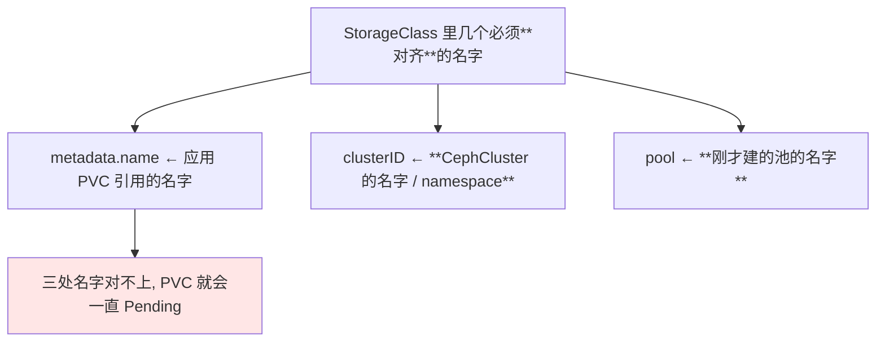

| 字段 | 取值要点 |
| --- | --- |
| `metadata.name` | 后面 PVC 的 `storageClassName` 要写它 |
| `clusterID` | **和之前创建的 CephCluster 名字一致**（rook-ceph） |
| `pool` | **和刚才建的池的名字一致** |
| `fstype` | **xfs** |
| `reclaimPolicy` | **Delete** |

## fstype 用 xfs

> **现在默认应该都是 xfs 文件系统**（比较流行、和 Ceph RBD 搭配常用），所以 StorageClass 里直接写 `fstype: xfs`。

## reclaimPolicy 为什么用 Delete

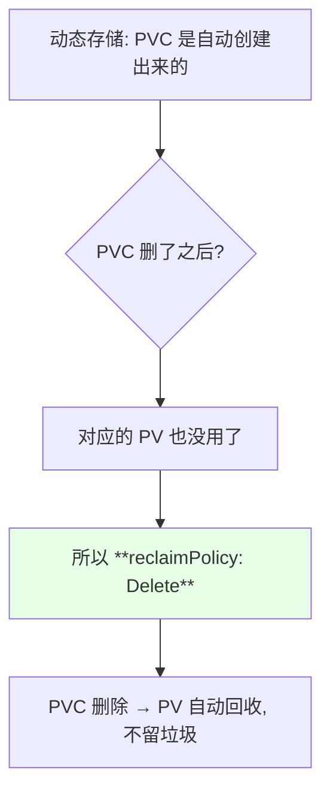

> 课程原话：**「动态存储一般都用 Delete，因为为什么呢 —— 你的 PVC 删掉了，那你还留着 PV 干嘛呢？」**

| 策略 | 适用 |
| --- | --- |
| **Delete** | **动态存储的标准选择** |
| Retain | 想留着数据做兜底的场景 |

## StorageClass 没有 namespace 限制

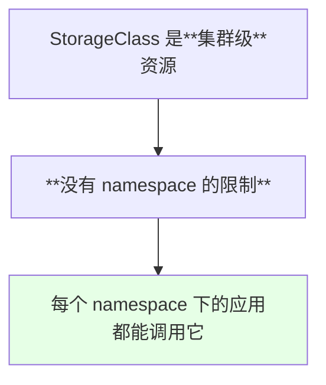

> 课程明确提到这点：**「storageclass 是没有 namespace 限制的，因为每一个空间、每个 namespace 的应用都可以调用」**。

## StatefulSet 的 volumeClaimTemplates

这是之前遗留没讲的一块：**StatefulSet 挂动态存储和 Deployment 完全不一样**，因为它**单独有一个 `volumeClaimTemplates` 配置**。

```yaml
apiVersion: apps/v1
kind: StatefulSet
metadata:
  name: redis
spec:
  serviceName: redis-headless
  replicas: 3
  selector:
    matchLabels:
      app: redis
  template:
    metadata:
      labels:
        app: redis
    spec:
      containers:
      - name: redis
        image: redis:5.0.5-alpine
        imagePullPolicy: IfNotPresent
        volumeMounts:
        - name: redis-data
          mountPath: /data
  volumeClaimTemplates:
  - metadata:
      name: redis-data
    spec:
      storageClassName: rook-ceph-block
      accessModes: ["ReadWriteOnce"]
      resources:
        requests:
          storage: 1Gi
```

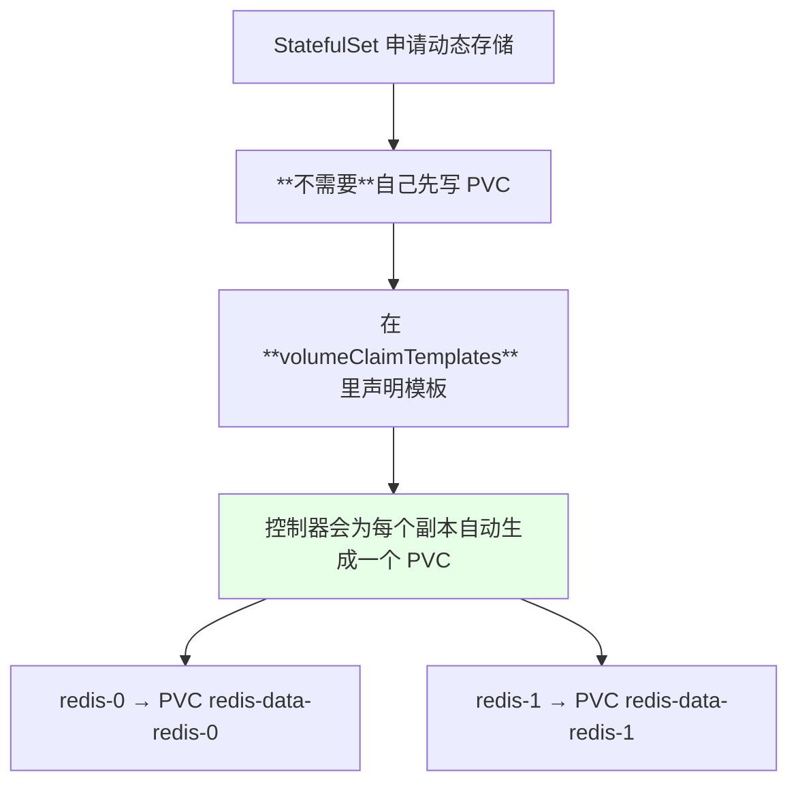

| 对比 | Deployment | **StatefulSet** |
| --- | --- | --- |
| PVC 怎么写 | 自己写一个 PVC 再被 Pod 引用 | **写在 `volumeClaimTemplates` 里** |
| 每个副本的存储 | 共享同一个 PVC | **每个副本一份独立的 PVC** |
| 适合场景 | 无状态 | **有状态（Redis / MQ / DB）** |

> 这正是上一节「块存储给 Redis 用」的落地方式：**6 个实例 → 6 份独立的 PVC → 6 块独立的存储**。

## 两者的对比：什么时候用哪个

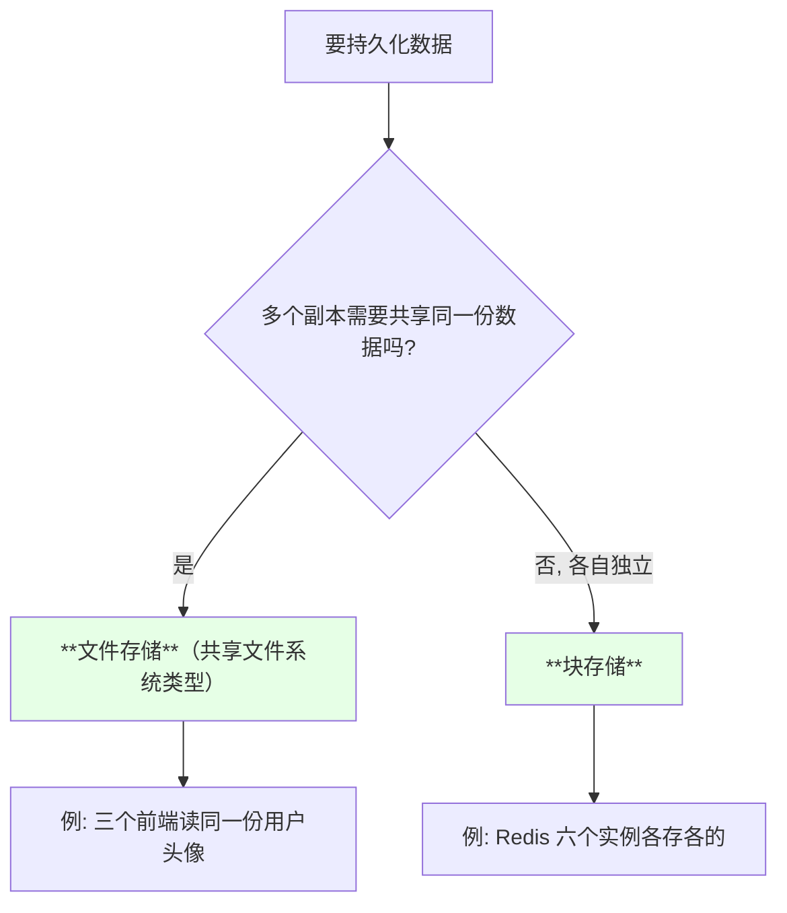

| 诉求 | 存储类型 | 访问模式 |
| --- | --- | --- |
| 单个容器独占读写 | **块存储** | ReadWriteOnce |
| 多 Pod 共享读写 | **文件存储** | ReadWriteMany |

## API 速览

| 能力 | 做法 | 关键点 |
| --- | --- | --- |
| 看池 | `kubectl get cephblockpool -n rook-ceph` | **自定义 CRD**，没装 Rook 执行不了 |
| 看 StorageClass | `kubectl get sc` | 集群级，无 namespace |
| 看 PVC | `kubectl get pvc -n <NS>` | 动态存储会自动创建 PV |
| 看 PV | `kubectl get pv` | 与 PVC 一一绑定 |
| 看 StatefulSet 自动生成的 PVC | `kubectl get pvc -n <NS>` | 命名形如 `模板名-<sts名>-<序号>` |
| 查 PVC 卡住的原因 | `kubectl describe pvc <PVC>` | 名字对不上会在这里暴露 |
| 看回收策略 | `kubectl get sc <SC> -o yaml` | 动态存储应为 Delete |

字段速查：

| 字段 | 作用 |
| --- | --- |
| `CephBlockPool.spec.replicated.size` | **副本数**，测试 1 / 生产 3 |
| `CephBlockPool.spec.failureDomain` | `host`（推荐）/ `osd` |
| `StorageClass.parameters.clusterID` | 与 CephCluster 名字一致 |
| `StorageClass.parameters.pool` | 与池名一致 |
| `StorageClass.parameters.fstype` | **xfs** |
| `StorageClass.reclaimPolicy` | **Delete** |
| `StorageClass.provisioner` | CSI driver 标识 |
| `volumeClaimTemplates[].spec.storageClassName` | StatefulSet 引用的 SC |

## Demo 示例

```bash
# 1. 先在集群外的目录准备好, 进到 rook ceph 示例目录
cd rook/cluster/examples/kubernetes/ceph

# 2. 建池（改好 size 与 failureDomain）
kubectl apply -f ceph-block-pool.yaml

# 3. 用自定义 kind 查看（没装 Rook 的话这条命令跑不了）
kubectl get cephblockpool -n rook-ceph
kubectl describe cephblockpool ceph-block-pool -n rook-ceph

# 4. 建 StorageClass（注意三个名字要对齐）
kubectl apply -f ceph-block-sc.yaml
kubectl get sc
kubectl get sc rook-ceph-block -o yaml

# 5. 部署一个带 volumeClaimTemplates 的 StatefulSet 验证
kubectl apply -f redis-sts.yaml
kubectl get pods -w

# 6. 看自动生成的 PVC 与 PV
NS=default
kubectl get pvc -n "$NS"
kubectl get pv

# 7. PVC 卡住时查原因
PVC=$(kubectl get pvc -n "$NS" -o jsonpath='{.items[0].metadata.name}')
kubectl describe pvc "$PVC" -n "$NS"

# 8. 清理时观察 PV 是否被回收
kubectl delete -f redis-sts.yaml
kubectl get pv
```

```yaml
# ceph-block-pool.yaml —— 块存储的池
apiVersion: ceph.rook.io/v1
kind: CephBlockPool
metadata:
  name: ceph-block-pool
  namespace: rook-ceph
spec:
  failureDomain: host        # host=副本分散到不同主机（推荐）；osd=按 OSD 分散
  replicated:
    size: 1                  # 测试环境 1；生产 3
```

```yaml
# ceph-block-sc.yaml —— 指向该池的 StorageClass
apiVersion: storage.k8s.io/v1
kind: StorageClass
metadata:
  name: rook-ceph-block
provisioner: rook-ceph.rbd.csi.ceph.com
reclaimPolicy: Delete        # 动态存储一般用 Delete
parameters:
  clusterID: rook-ceph       # 与 CephCluster 名字一致
  pool: ceph-block-pool      # 与上面的池名一致
  imageFormat: "2"
  imageFeatures: layering
  fstype: xfs                # 现在默认都用 xfs
  csi.storage.k8s.io/provisioner-secret-name: rook-csi-rbd-provisioner
  csi.storage.k8s.io/provisioner-secret-namespace: rook-ceph
  csi.storage.k8s.io/node-stage-secret-name: rook-csi-rbd-node
  csi.storage.k8s.io/node-stage-secret-namespace: rook-ceph
```

```yaml
# redis-sts.yaml —— StatefulSet 挂动态存储（靠 volumeClaimTemplates）
apiVersion: apps/v1
kind: StatefulSet
metadata:
  name: redis
  labels:
    app: redis
spec:
  serviceName: redis-headless
  replicas: 3
  selector:
    matchLabels:
      app: redis
  template:
    metadata:
      labels:
        app: redis
    spec:
      containers:
      - name: redis
        image: redis:5.0.5-alpine
        imagePullPolicy: IfNotPresent
        command:
        - sh
        - -c
        - redis-server --appendonly yes
        ports:
        - containerPort: 6379
        volumeMounts:
        - name: redis-data
          mountPath: /data
        readinessProbe:
          tcpSocket:
            port: 6379
          initialDelaySeconds: 5
          periodSeconds: 5
  volumeClaimTemplates:
  - metadata:
      name: redis-data
    spec:
      storageClassName: rook-ceph-block
      accessModes:
      - ReadWriteOnce
      resources:
        requests:
          storage: 1Gi
```

```text
三种使用方式的一张表:

类型          语义                    谁挂                典型场景
──────────────────────────────────────────────────────────
块存储        单容器独立读写           一个 Pod            Redis / DB 各副本独立数据
文件存储      多 Pod 共享读写          多个 Pod            头像 / 静态资源共享
对象存储      应用代码直连             应用直连           本课不讲

StatefulSet 的申请方式:
   volumeClaimTemplates → 每个副本自动生成一份独立 PVC
```

### 总结

- **Ceph 的使用方式分块存储 / 文件存储 / 对象存储**，其中**用得最多的是块存储和文件存储**；对象存储**需要应用写代码直连**，本課不涉及；
- **块存储是「单个容器挂一块独立存储」**（类似 RWO），典型是 **Redis 集群 6 个实例各挂一块、数据各不相同**，**没做持久化集群出问题就恢复不了**；**文件存储是「多个 Pod 挂同一块存储实现共享」**（类似 RWX），典型是**三个前端共享同一份用户头像**；
- **用块存储两步走**：先建 **CephBlockPool（池）**，再建指向该池的 **StorageClass**；三个名字必须对齐（SC 名、clusterID、pool 名），否则 PVC 会一直 Pending；
- **`replicated.size` 是副本数**（生产 3、测试 1）；**`failureDomain` 决定副本怎么分散** —— **`host`（默认）保证副本落在不同主机**，坏两台还剩一份；**`osd` 可能把副本挤在同一台机的不同 OSD 上，容灾性差**；
- **`fstype` 用 xfs，`reclaimPolicy` 用 `Delete`**（动态存储的标准选择：PVC 都删了，PV 留着没意义）；**StorageClass 是集群级资源，没有 namespace 限制**；
- **StatefulSet 申请动态存储靠 `volumeClaimTemplates`**，与 Deployment 手写 PVC 完全不同 —— 控制器会**为每个副本自动生成一份独立 PVC**，正好对应「Redis 六个实例六块存储」的需求；生产环境还要记得 **mon / mgr / osd 都多配一些**，数据才不容易丢。

