# Kubernetes 集群部署: StatefulSet 动态申请存储（volumeClaimTemplates 不可编辑、每副本独立 PVC 与删除后的回收行为）

上一节讲到 StatefulSet 靠 `volumeClaimTemplates` 申请动态存储，这一节把它实际跑一遍，并把过程中最扎心的两个事实记下来：**这块配置一旦定下来就改不了**，以及**删掉 StatefulSet 之后 PVC 不会跟着消失**。

结论先摆：

1. **StatefulSet 必须配一个 headless Service**，这是它和 Deployment 的第一个不同；
2. **`volumeClaimTemplates` 一旦创建就不可编辑**（改了保存不了），**存储大小这种字段是改不动的** —— 所以一开始就得规划好；
3. **PVC 是自动生成的**：只写一个模板，StatefulSet 控制器会按 `<模板名>-<sts名>-<序号>` 的规则为每个副本生成一份独立 PVC，再各自申请一块 PV；
4. **每个副本挂的是各自的存储，文件不共享** —— 在 redis-0 里写的文件，进 redis-1 看不到；
5. **StatefulSet 是有序创建的**：第一个副本没起来，第二个根本不会被创建（这也是演示卡住的原因）；
6. **删掉 StatefulSet 后 PVC 不会被自动清理**，需要手动删；而**手动删掉 PVC 之后 PV 也会被回收** —— 因为 StorageClass 的 `reclaimPolicy` 是 `Delete`。

## 纲要

- 在页面上搭一个 StatefulSet
- headless Service 是必需的
- volumeClaimTemplates 的三类字段
- accessModes：为什么有状态服务用 RWO
- volumeMode：Filesystem 还是 Block
- 不可编辑：改大小都保存不了
- 自动生成的 PVC 与 PV
- 名字不会重复的机制
- 扩副本：每扩一个再申请一块
- 有序创建：第一个没起来第二个不会动
- 实测：两个副本的文件不共享
- 删除后的资源去向

## 在页面上搭一个 StatefulSet

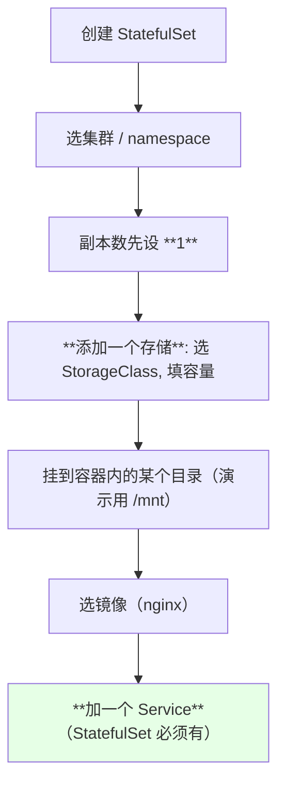

> 演示时容量填得很小（**1~10 Gi 之间即可，别开太大**），目的只是验证「动态申请」这条链路。

## headless Service 是必需的

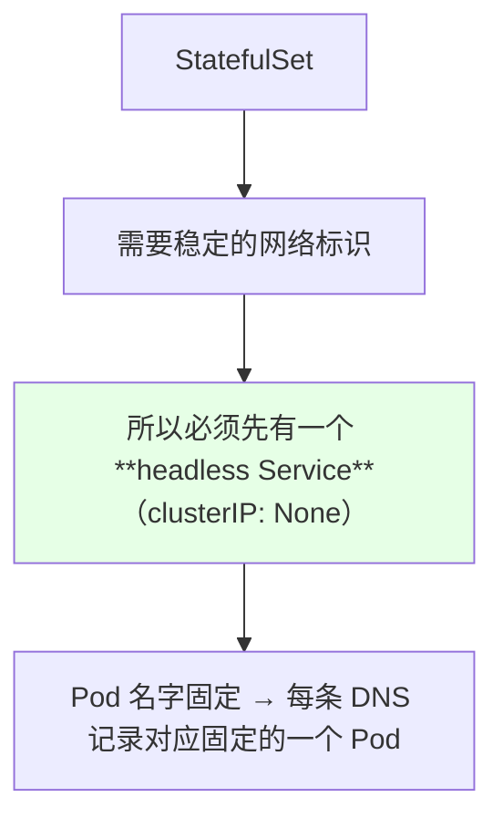

```yaml
apiVersion: v1
kind: Service
metadata:
  name: nginx-headless
  labels:
    app: nginx
spec:
  clusterIP: None            # ← headless 的关键
  ports:
  - port: 80
    name: web
  selector:
    app: nginx
```

| 对比 | Deployment | StatefulSet |
| --- | --- | --- |
| 是否需要 Service | 不一定 | **通常需要 headless Service** |
| Pod 名字 | 随机后缀 | **固定且有序** |
| 存储申请方式 | 手写 PVC | **`volumeClaimTemplates`** |

## volumeClaimTemplates 的三类字段

```text
volumeClaimTemplates 的构成:

volumeClaimTemplates[]
├── metadata.name            ← 模板名, 生成 PVC 时的前缀
└── spec
    ├── accessModes          ← 读写模式（RWO / RWX）
    ├── volumeMode           ← **挂载类型: Filesystem / Block**
    ├── resources.requests   ← 申请多大（storage）
    └── storageClassName     ← 指向哪个 StorageClass（rook-ceph-block）
```

| 字段 | 演示取值 | 说明 |
| --- | --- | --- |
| `metadata.name` | `data` | 生成 PVC 的前缀 |
| `accessModes` | `ReadWriteOnce` | 有状态服务一般用 RWO |
| `volumeMode` | `Filesystem` | 也可以改成 Block |
| `resources.requests.storage` | `1Gi` | **注意：改不了** |
| `storageClassName` | `rook-ceph-block` | 上一节建的 SC |

> **`volumeClaimTemplates` 只有 StatefulSet 有，其它资源没有** —— 这是它和 Deployment 的关键差别。

## accessModes：为什么有状态服务用 RWO

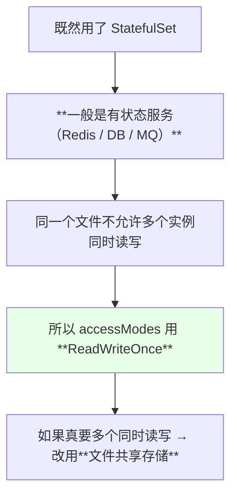

| 访问模式 | 语义 | 适用 |
| --- | --- | --- |
| **ReadWriteOnce** | 单节点读写 | **有状态服务的默认选择** |
| ReadWriteMany | 多节点读写 | 需要文件共享时用文件存储 |

## volumeMode：Filesystem 还是 Block

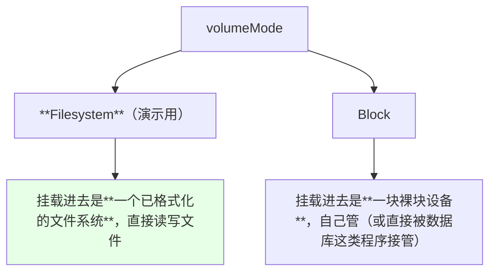

> 课程原话：**「这个是挂载的类型，可以设成文件存储，就是以文件形式挂载进去；也可以设成块存储挂载」** —— 之前讲 PV 时已经讲过这个区别。

## 不可编辑：改大小都保存不了

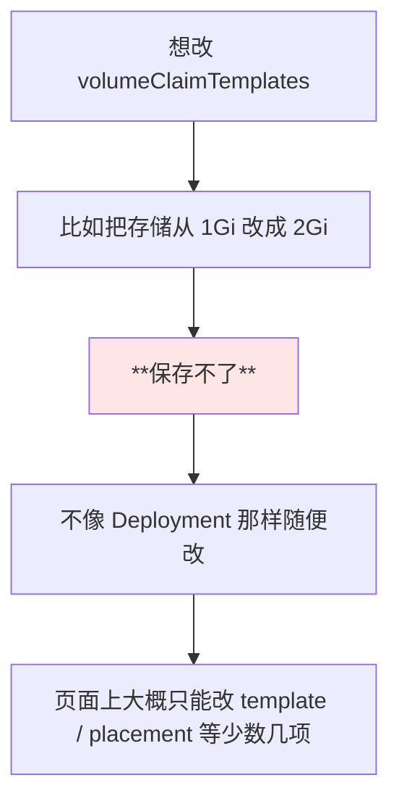

> 课程反复强调：**「这个玩意儿是不可编辑的，它不像 Deployment 或 PVC，这个东西是不能编辑的，你编辑是保存不了的」**。

这条的工程含义很直接：**容量、StorageClass、volumeMode 这些要在创建前定好**，事后想动只能重建 StatefulSet（而且重建还会牵扯到已有的 PVC 与数据）。

## 自动生成的 PVC 与 PV

```bash
kubectl get pvc
kubectl get pv
```

```text
之前我们**并没有手动创建** PVC
   ↓ 它就是利用动态存储直接创建了一个 PVC
   ↓ 这个 PVC 又通过 StorageClass 申请了一个 PV
```

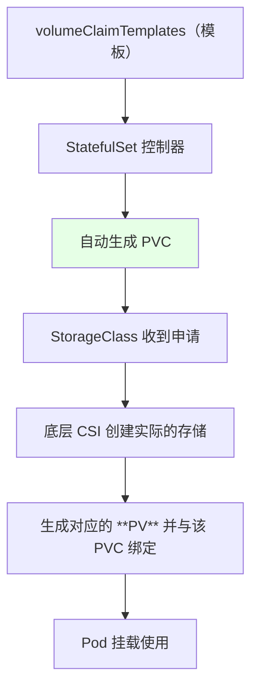

## 名字不会重复的机制

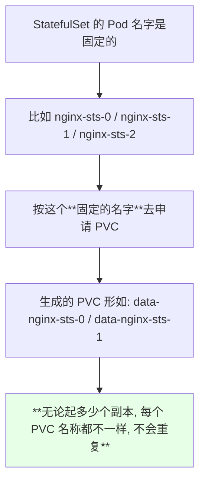

```text
副本 - PVC - PV 的对应关系:

nginx-sts-0  →  PVC data-nginx-sts-0  →  PV No.1   （独立一块存储）
nginx-sts-1  →  PVC data-nginx-sts-1  →  PV No.2   （独立一块存储）
nginx-sts-2  →  PVC data-nginx-sts-2  →  PV No.3   （独立一块存储）
```

## 扩副本：每扩一个再申请一块

```bash
kubectl scale sts nginx-sts --replicas=2
kubectl get pvc
kubectl get pv
```

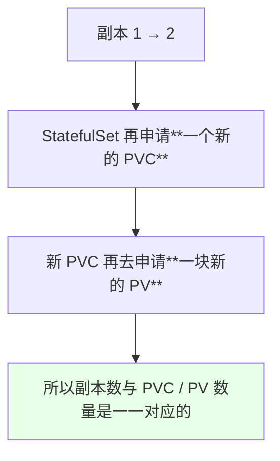

> 课程里演示时先把镜像拉取策略改成 `IfNotPresent`（避免因为拉不到镜像卡住），然后再扩副本。

## 有序创建：第一个没起来第二个不会动

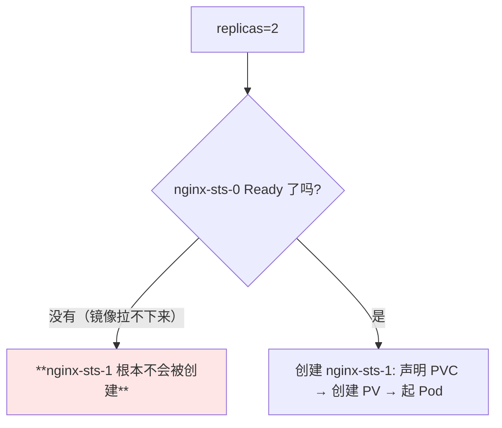

> 这是**之前讲过的 StatefulSet 机制**：**第一个容器没有创建成功，第二个是不会被创建的**。演示时因为镜像没拉下来，第二个副本一直没出现，所以作者把它删掉重来了一次。

```bash
kubectl describe pod nginx-sts-1
# 会看到正在 WaitingForFirstConsumer / Bound 之类的 PVC 相关事件
```

## 实测：两个副本的文件不共享

```bash
# 进第一个副本写个文件
kubectl exec -it nginx-sts-0 -- sh -c "echo hello > /mnt/testfile"

# 进第二个副本看
kubectl exec -it nginx-sts-1 -- sh -c "ls /mnt"
# 看不到 testfile
```

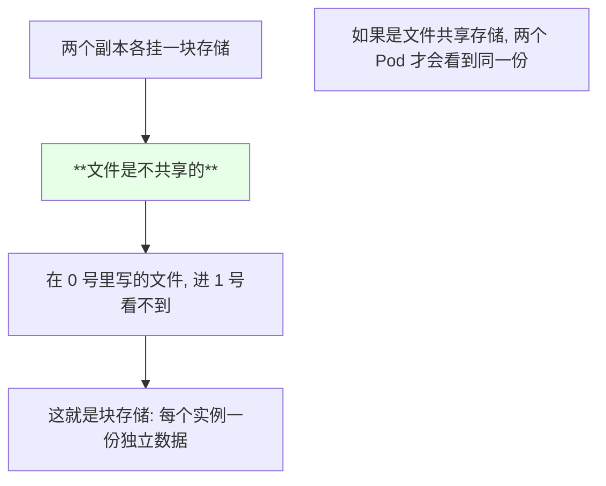

```text
实测结论:

nginx-sts-0  /mnt/testfile   ← 写成功
nginx-sts-1  /mnt/           ← 空的
```

> 这也直接印证了上一节的选择逻辑：**Redis 集群六个实例要各存各的数据 → 用块存储；要想共享 → 用文件存储。**

底层看的话，存储是以 **rbd 设备**挂进来的（`dev/rbd0` 挂到 `/mnt` 下）。

## 删除后的资源去向

```bash
kubectl delete sts nginx-sts
kubectl get pvc      # 还在！
kubectl delete pvc data-nginx-sts-0
kubectl get pv       # 也被删掉了
```

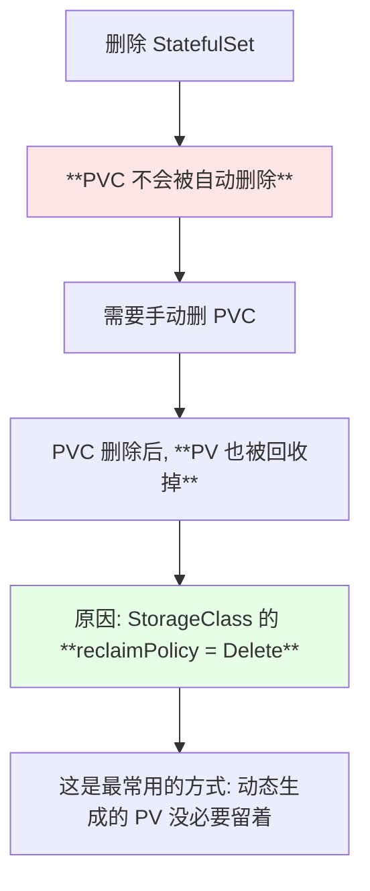

| 动作 | 结果 |
| --- | --- |
| 删 StatefulSet | **PVC 保留**（不会被自动删） |
| 手动删 PVC | **PV 被回收**（因为 reclaimPolicy 是 Delete） |

> 课程解释得很清楚：**「PVC 和 StatefulSet 其实是申请完之后就不是同一类资源了，所以不会被一起删掉；而 PV 被删掉是因为我们刚才说的 StorageClass 的回收策略是 Delete」**。

## API 速览

| 能力 | 做法 | 关键点 |
| --- | --- | --- |
| 看 StatefulSet | `kubectl get sts` | — |
| 看自动生成的 PVC | `kubectl get pvc` | 命名形如 `<模板名>-<sts名>-<序号>` |
| 看绑定的 PV | `kubectl get pv` | 与 PVC 一一对应 |
| 扩副本 | `kubectl scale sts <NAME> --replicas=N` | 每扩一个多一块 PV |
| 排第二个副本不起 | `kubectl describe pod <STS>-1` | 多半是第一个没 Ready |
| 看挂载情况 | `kubectl exec -it <POD> -- df -h` | 看 /mnt 对应的设备 |
| 删 PVC | `kubectl delete pvc <PVC>` | 手动操作，STS 不会代劳 |
| 看回收策略 | `kubectl get sc <SC> -o yaml` | Delete / Retain |

字段速查：

| 字段 | 作用 |
| --- | --- |
| `spec.serviceName` | 指向 headless Service |
| `spec.volumeClaimTemplates[].metadata.name` | PVC 名字前缀 |
| `.spec.accessModes` | ReadWriteOnce / ReadWriteMany |
| `.spec.volumeMode` | **Filesystem / Block** |
| `.spec.storageClassName` | 指向 StorageClass |
| `.spec.resources.requests.storage` | 容量，**创建后不可改** |
| Service `spec.clusterIP: None` | headless 的标志 |

## Demo 示例

```bash
# 1. 先确认 SC 存在
kubectl get sc
NS=default
SC=rook-ceph-block

# 2. 部署 headless Service + StatefulSet
kubectl apply -f nginx-headless.yaml
kubectl apply -f nginx-sts.yaml

# 3. 观察自动生成的 PVC / PV
kubectl get pods -w
kubectl get pvc -n "$NS"
kubectl get pv

# 4. 扩容到两个副本 —— 会再生成一份 PVC 和一块 PV
kubectl scale sts nginx-sts --replicas=2
kubectl get pvc -n "$NS"
kubectl get pv

# 5. 验证两个副本的存储不共享
kubectl exec -it nginx-sts-0 -- sh -c "echo hello > /mnt/testfile"
kubectl exec -it nginx-sts-1 -- sh -c "ls -l /mnt"
# 第二个副本里看不到 testfile

# 6. 看挂载的设备
kubectl exec -it nginx-sts-0 -- df -h | grep mnt

# 7. 删除 StatefulSet, 观察 PVC 仍在
kubectl delete sts nginx-sts
kubectl get pvc -n "$NS"

# 8. 手动删 PVC, 观察 PV 被回收（reclaimPolicy=Delete）
kubectl delete pvc data-nginx-sts-0 -n "$NS"
kubectl get pv
```

```yaml
# nginx-headless.yaml —— StatefulSet 依赖的 headless Service
apiVersion: v1
kind: Service
metadata:
  name: nginx-headless
  labels:
    app: nginx
spec:
  clusterIP: None
  ports:
  - port: 80
    name: web
  selector:
    app: nginx
```

```yaml
# nginx-sts.yaml —— 带 volumeClaimTemplates 的 StatefulSet
apiVersion: apps/v1
kind: StatefulSet
metadata:
  name: nginx-sts
  labels:
    app: nginx
spec:
  serviceName: nginx-headless
  replicas: 1
  selector:
    matchLabels:
      app: nginx
  template:
    metadata:
      labels:
        app: nginx
    spec:
      containers:
      - name: nginx
        image: nginx:1.15.2
        imagePullPolicy: IfNotPresent
        volumeMounts:
        - name: data
          mountPath: /mnt
  volumeClaimTemplates:
  - metadata:
      name: data
    spec:
      storageClassName: rook-ceph-block
      accessModes:
      - ReadWriteOnce          # 有状态服务一般用 RWO
      volumeMode: Filesystem   # 也可以改成 Block
      resources:
        requests:
          storage: 1Gi         # 注意: 一旦创建不可编辑
```

```text
生命周期对照:

创建 STS  →  自动生成 PVC  →  自动申请 PV  →  Pod 挂载
删 STS    →  PVC **保留**               →  需要手动删
删 PVC    →  PV **被回收**（reclaimPolicy=Delete）

副本 Storage 关系:
nginx-sts-0  data-nginx-sts-0  →  独立一块（互不共享）
nginx-sts-1  data-nginx-sts-1  →  独立一块（互不共享）
```

### 总结

- **StatefulSet 需要配一个 headless Service**（`clusterIP: None`），Pod 名字固定有序，这是它能按名字去申请固定 PVC 的前提；
- **`volumeClaimTemplates` 只有 StatefulSet 有**，字段包含名称、`accessModes`、`volumeMode`（**Filesystem / Block**）、`storageClassName` 和容量；
- **这块配置创建后不可编辑** —— 想改容量都保存不了，页面上大概只有 template / placement 等少数几项能改，所以**容量和类型要在创建前规划好**；
- **PVC 与 PV 都是自动生成的**：写一个模板 → 控制器按 `<模板名>-<sts名>-<序号>` 为每个副本生成独立 PVC → StorageClass 再申请一块 PV，**副本越多 PVC/PV 越多，名字不会重复**；
- **两个副本挂的是各自的块存储，文件不共享**（0 号写的文件在 1 号里看不到）；要共享就得换文件共享存储 —— 这正是「Redis 六个实例各存各的」的正确形态；
- **StatefulSet 有序创建**：第一个副本没 Ready，第二个根本不会被创建；**删除 StatefulSet 后 PVC 不会被清理**（需要手动删），而**手动删 PVC 会连带回收 PV，因为 StorageClass 的 `reclaimPolicy` 是 `Delete`** —— 这是动态存储最常用的策略。

