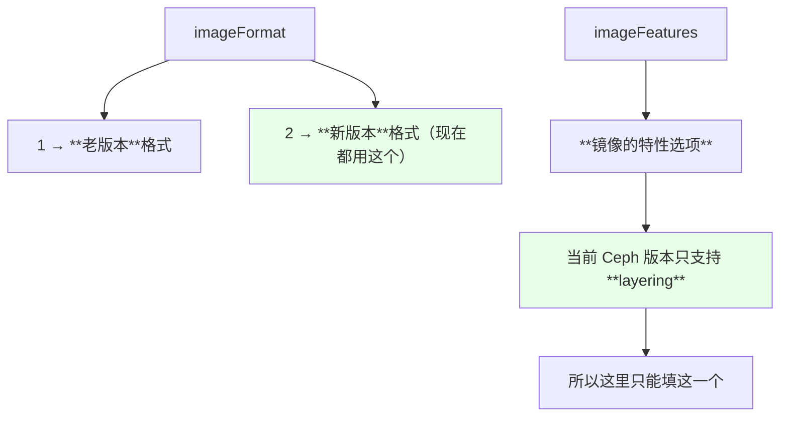
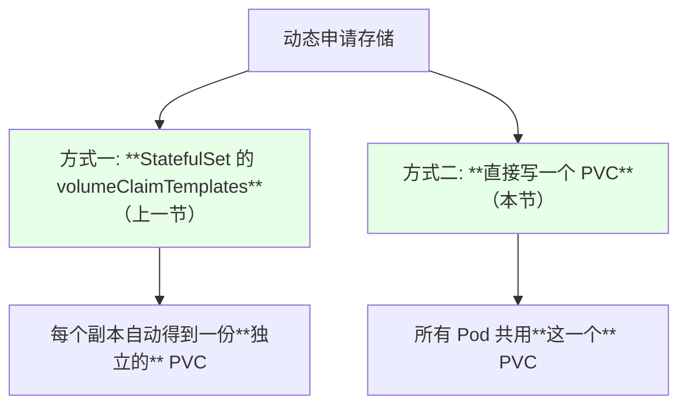
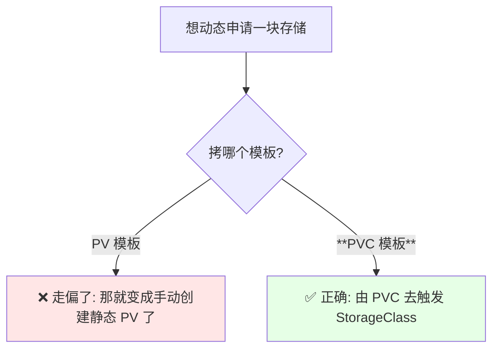
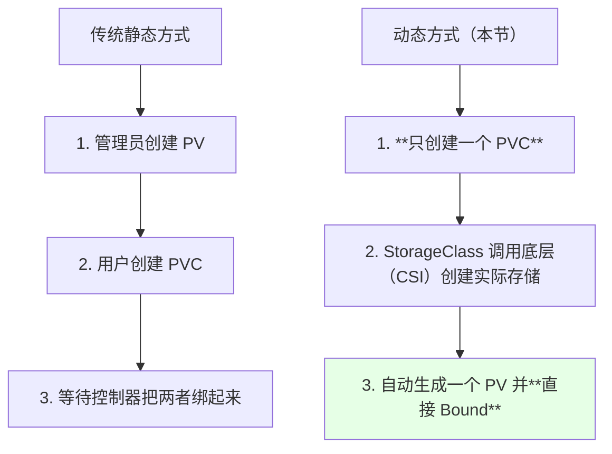
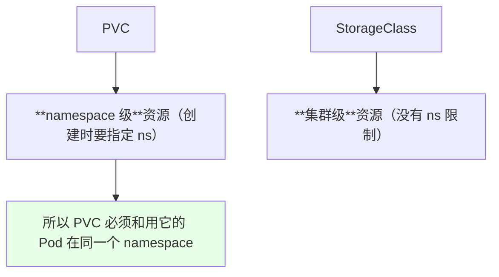
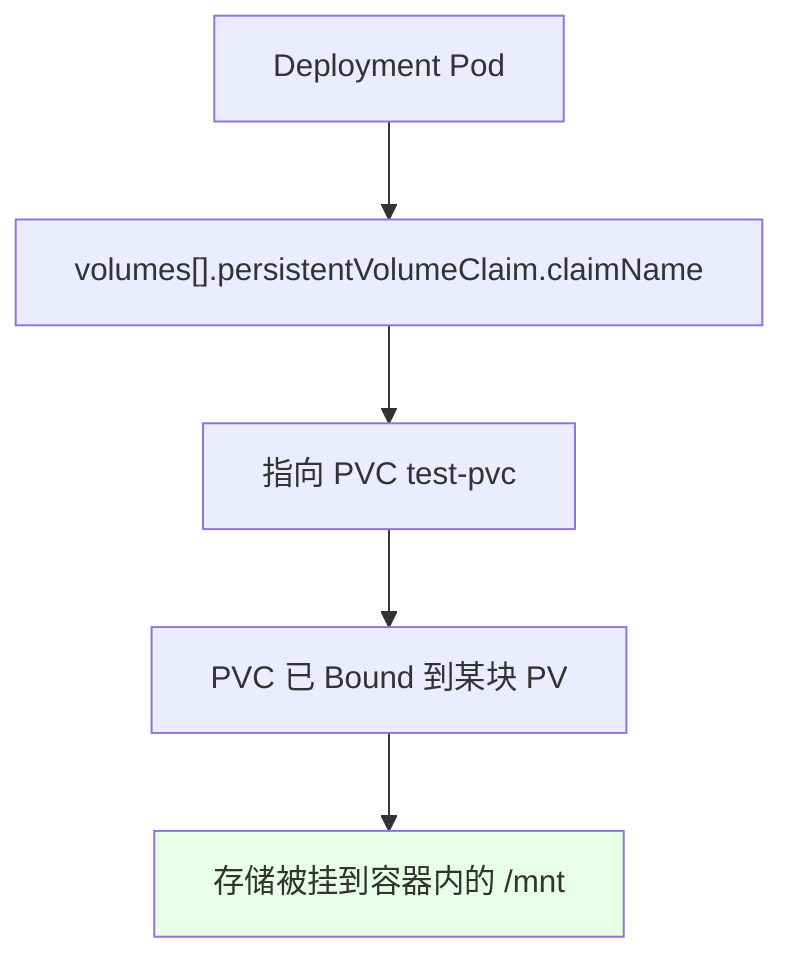
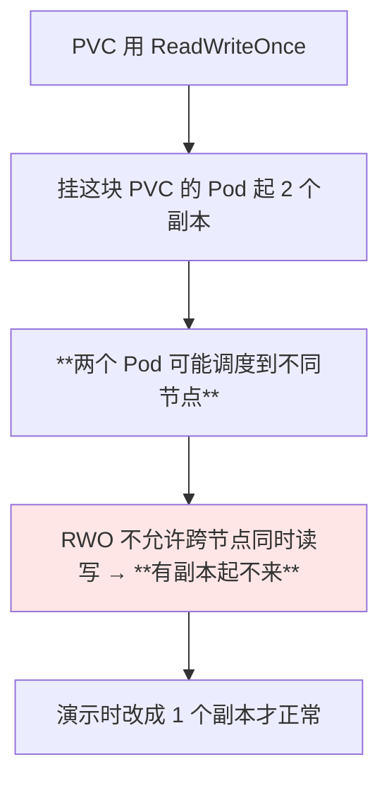
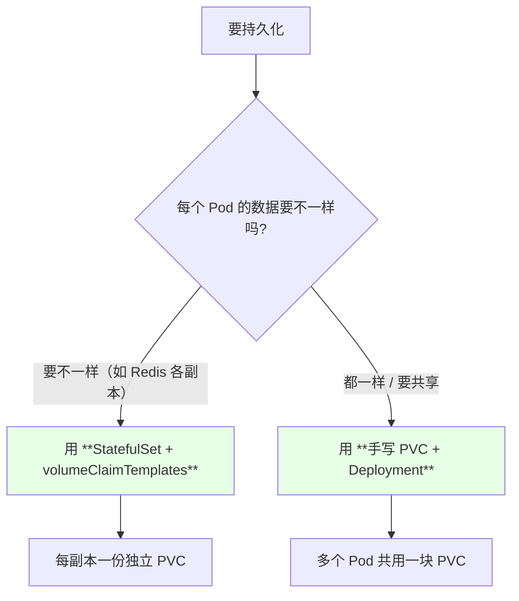

# Kubernetes 集群部署: 用 PVC 动态申请存储（imageFormat / imageFeatures 两个参数，以及一步到位的动态绑定）

上一节用 StatefulSet 的 `volumeClaimTemplates` 申请了动态存储，这一节讲更通用的一条路：**直接写一个 PVC，由 StorageClass 自动创建 PV 并完成绑定** —— Deployment、DaemonSet、StatefulSet 都能这么用。顺带把 StorageClass 里那两个当时没细说的参数补上。

结论先摆：

1. **`imageFormat`：1 是老版本、2 是新版本**，现在统一用 **2**；
2. **`imageFeatures`**：是镜像的特性，课程用的 Ceph 版本**只支持 `layering`**，所以只能写这一个；
3. **用 PVC 动态申请存储只要一步** —— **不用先建 PV 再建 PVC 再等绑定**，创建一个 PVC 就自动生成底层存储并完成 Bound；
4. **PVC 是 namespace 级资源**，创建时要指定 namespace；
5. **Deployment 挂 PVC 就看三个地方**：访问模式、容量、`storageClassName`；
6. **Deployment 里是 `volumes[].persistentVolumeClaim.claimName` 指向 PVC 名**；
7. **多个 Pod 共享同一份数据**用这种方式可以，但 **RWO 的 PVC 起多个副本会有问题**；
8. **每个 Pod 的数据要互不相同，还是要用 StatefulSet 的 `volumeClaimTemplates`**。

## 纲要

- 先补两个参数：imageFormat 与 imageFeatures
- 动态申请的两种方式回顾
- 拷贝的是 PVC 模板，不是 PV 模板
- PVC 的三要素
- 创建出来就是 Bound：省掉了哪一步
- PVC 是 namespace 级资源
- Deployment 怎么挂这个 PVC
- 导出后的 yaml 长什么样
- RWO 的 PVC 起多副本的问题
- 共享还是独享：怎么选
- 两种方式的分工

## 先补两个参数：imageFormat 与 imageFeatures

上一节建 StorageClass 时留了两个没细说的参数，这里补上：

```yaml
parameters:
  imageFormat: "2"
  imageFeatures: layering
```

| 参数 | 含义 | 取值 |
| --- | --- | --- |
| **`imageFormat`** | **镜像格式** | **1 = 老版本，2 = 新版本，现在都用 2** |
| **`imageFeatures`** | 镜像的特性 | 课程所用 Ceph 版本**只支持 `layering`** |



> 课程作者也很坦白：**「这两个我从网上查了一下，好像是镜像的格式，一是老版本、二是新版本，好像现在都是用二；imageFeatures 好像是 image 的特征，咱们用的是 CN 七或者八，好像只支持 layering」**。这两个属于 Ceph / 磁盘文件自身的特性，想深究可以继续往 Ceph 文档里查。

## 动态申请的两种方式回顾



| 方式 | 适用 | 数据关系 |
| --- | --- | --- |
| `volumeClaimTemplates` | **只有 StatefulSet 有** | 每副本一份，互不相同 |
| **手写 PVC** | Deployment / DaemonSet / StatefulSet 都行 | **多 Pod 共享同一块** |

## 拷贝的是 PVC 模板，不是 PV 模板

课程现场作者自己搞错了一次，值得记下来：



> 作者原话：**「哎我错了，这个是 PV 的，我们搞错了 —— 我们应该拷贝 PVC，用 PVC 去动态申请一块 PV」**。

以前用 NFS 时是**先创建 PV、再创建 PVC、两者再绑定**（两个过程）；**现在只要写一个 PVC** 就够了。

## PVC 的三要素

```yaml
kind: PersistentVolumeClaim
apiVersion: v1
metadata:
  name: test-pvc
  namespace: default
spec:
  accessModes:
  - ReadWriteOnce
  volumeMode: Filesystem
  resources:
    requests:
      storage: 1Gi
  storageClassName: rook-ceph-block
```

```text
写 PVC 主要看这四个地方:

PVC
├── accessModes        ← 访问模式（RWO / RWX）
├── volumeMode         ← Filesystem / Block
├── resources.requests ← 申请多大
└── storageClassName   ← **指向哪个 StorageClass**
```

| 字段 | 演示取值 | 说明 |
| --- | --- | --- |
| `accessModes` | `ReadWriteOnce` | **块存储设 RWO 比较好**；RWX 也可以但得看后端 |
| `volumeMode` | `Filesystem`（也可 Block） | 挂载类型 |
| `resources.requests.storage` | `1Gi` | 容量 |
| `storageClassName` | `rook-ceph-block` | **填上一节建的 SC 名称** |

> 课程特别提示：**「Many 和 Once 应该都是可以的，但是块存储还是设置 Once 比较好」**。

## 创建出来就是 Bound：省掉了哪一步

```bash
kubectl get pvc -n default
# NAME       STATUS   VOLUME                                     CAPACITY
# test-pvc   Bound    pvc-xxxxxxxx-xxxx-xxxx-xxxx-xxxxxxxxxxxx   1Gi
```



| 步骤 | 静态方式 | **动态方式** |
| --- | --- | --- |
| 创建 PV | 手动 | **自动** |
| 创建 PVC | 手动 | 手动 |
| 绑定 | 控制器撮合 | **创建 PVC 时就完成** |

> 课程原话：**「之前我们创建 PV 和 PVC 是两个过程，一个先创建 PV、再创建 PVC，两个再进行绑定；现在呢我们只需要创建一个 PVC，就可以自动通过 StorageClass 调用 CSI 创建一块存储给这个 PVC 用」**。

## PVC 是 namespace 级资源



```bash
kubectl apply -f test-pvc.yaml -n default
kubectl get pvc -n default
```

## Deployment 怎么挂这个 PVC

在页面上创建 Deployment 时，存储部分选 **PVC**（而不是 StorageClass），然后选中刚才那个 PVC，挂到容器里的某个目录（演示用 `/mnt`）：

```yaml
    spec:
      volumes:
      - name: pvc-volume
        persistentVolumeClaim:
          claimName: test-pvc        # ← 指向 PVC 的名字
      containers:
      - name: nginx
        image: nginx:1.15.2
        imagePullPolicy: IfNotPresent
        volumeMounts:
        - name: pvc-volume
          mountPath: /mnt
```



> **最好把镜像拉取策略改成 `IfNotPresent`**，避免演示环境因为拉不到镜像而迟迟起不来。

## 导出后的 yaml 长什么样

```yaml
spec:
  template:
    spec:
      volumes:
      - name: pvc-volume
        persistentVolumeClaim:
          claimName: test-pvc
      containers:
      - name: nginx
        image: nginx:1.15.2
        imagePullPolicy: IfNotPresent
        volumeMounts:
        - name: pvc-volume
          mountPath: /mnt
```

```text
Deployment 里跟 PVC 相关的就这一处:

volumes[]
└── - name: xxx
      persistentVolumeClaim:
        claimName: <PVC 的名字>

（PVC 那边的三个关键项: 访问模式 / 容量 / storageClassName）
```

## RWO 的 PVC 起多副本的问题



> 课程原话：**「这个呢就是共享存储了，就是多个 Pod 可以用同一块；我们设成 Once，可能两个副本还是有问题，那我们生成一个吧」**。

| 想要的效果 | 该怎么做 |
| --- | --- |
| 多 Pod 真正共享同一份数据 | 用 **RWX** 的文件存储（共享文件系统类型） |
| 只是单 Pod 用 | RWO 足够 |

## 共享还是独享：怎么选



> 课程结论：**「StatefulSet 也可以用 PVC，也可以用这个；但如果是你的 Pod 那个数据要不一致的话，还是要用 volumeClaimTemplates 比较好」**。

## 两种方式的分工

```text
方式                              适用资源                     每副本存储
──────────────────────────────────────────────────────────────────────
手写 PVC + volumes.pvc            Deployment / DaemonSet / STS  多个 Pod **共用同一块**
volumeClaimTemplates             **仅 StatefulSet**            每副本**各自一块**

          创建步骤
手写 PVC:             PVC →（StorageClass 自动创建 PV 并 Bound）
volumeClaimTemplates: 模板 → 控制器自动为每副本生成 PVC → 各自创建 PV
```

## API 速览

| 能力 | 做法 | 关键点 |
| --- | --- | --- |
| 建 PVC | `kubectl apply -f pvc.yaml -n <NS>` | **namespace 级** |
| 看 PVC 状态 | `kubectl get pvc -n <NS>` | 动态方式直接就是 **Bound** |
| 看自动生成的 PV | `kubectl get pv` | 名字形如 `pvc-xxxx-...` |
| 排 PVC 卡住 | `kubectl describe pvc <PVC>` | SC 名字写错会在这里暴露 |
| 看 SC | `kubectl get sc` | 集群级，无 ns |
| Deployment 挂载 | `volumes[].persistentVolumeClaim.claimName` | 指向 PVC 名 |
| 看挂载结果 | `kubectl exec -it <POD> -- df -h \| grep mnt` | 确认真的挂上了 |

字段速查：

| 字段 | 作用 |
| --- | --- |
| `spec.accessModes` | RWO / RWX，**块存储建议 RWO** |
| `spec.volumeMode` | Filesystem / Block |
| `spec.resources.requests.storage` | 容量 |
| `spec.storageClassName` | **指向 StorageClass** |
| `StorageClass.parameters.imageFormat` | **1 老 / 2 新，现在用 2** |
| `StorageClass.parameters.imageFeatures` | 当前版本**只支持 layering** |
| Pod `volumes[].persistentVolumeClaim.claimName` | Pod 侧引用 PVC |

## Demo 示例

```bash
# 1. 确认 SC 存在（集群级资源, 不需要指定 ns）
kubectl get sc

# 2. 建一个 PVC（namespace 级, 注意 ns 要和 Pod 一致）
NS=default
kubectl apply -f test-pvc.yaml -n "$NS"

# 3. 看它是不是直接 Bound 了
kubectl get pvc -n "$NS"
kubectl get pv

# 4. 起一个 Deployment 挂这块 PVC
kubectl apply -f deploy-use-pvc.yaml
kubectl get pods -w

# 5. 确认真的挂载上了
NS=default
POD=$(kubectl get pods -n "$NS" -l app=nginx-pvc -o jsonpath='{.items[0].metadata.name}')
kubectl exec -it "$POD" -n "$NS" -- df -h | grep mnt

# 6. 在 PVC 对应的目录里写点东西
kubectl exec -it "$POD" -n "$NS" -- sh -c "echo hello > /mnt/testfile"
kubectl exec -it "$POD" -n "$NS" -- cat /mnt/testfile

# 7. PV 卡住时报什么错
PVC=$(kubectl get pvc -n "$NS" -o jsonpath='{.items[0].metadata.name}')
kubectl describe pvc "$PVC" -n "$NS"

# 8. 清理: 删 Deployment → 删 PVC → PV 被回收（reclaimPolicy=Delete）
kubectl delete -f deploy-use-pvc.yaml
kubectl delete pvc test-pvc -n "$NS"
kubectl get pv
```

```yaml
# test-pvc.yaml —— 一个三要素齐全的 PVC
kind: PersistentVolumeClaim
apiVersion: v1
metadata:
  name: test-pvc
  namespace: default
spec:
  accessModes:
  - ReadWriteOnce          # 块存储建议 RWO; RWX 需要后端支持
  volumeMode: Filesystem   # 也可以改成 Block
  resources:
    requests:
      storage: 1Gi
  storageClassName: rook-ceph-block     # 指向上一节建的 SC
```

```yaml
# deploy-use-pvc.yaml —— Deployment 挂这个 PVC
apiVersion: apps/v1
kind: Deployment
metadata:
  name: nginx-pvc
  labels:
    app: nginx-pvc
spec:
  replicas: 1
  selector:
    matchLabels:
      app: nginx-pvc
  template:
    metadata:
      labels:
        app: nginx-pvc
    spec:
      volumes:
      - name: pvc-volume
        persistentVolumeClaim:
          claimName: test-pvc
      containers:
      - name: nginx
        image: nginx:1.15.2
        imagePullPolicy: IfNotPresent
        volumeMounts:
        - name: pvc-volume
          mountPath: /mnt
```

```yaml
# ceph-block-sc.yaml —— 补齐两个参数的 StorageClass
apiVersion: storage.k8s.io/v1
kind: StorageClass
metadata:
  name: rook-ceph-block
provisioner: rook-ceph.rbd.csi.ceph.com
reclaimPolicy: Delete
parameters:
  clusterID: rook-ceph
  pool: ceph-block-pool
  imageFormat: "2"          # 1=老版本, 2=新版本（现在都用 2）
  imageFeatures: layering   # 当前 Ceph 版本只支持这一个
  fstype: xfs
  csi.storage.k8s.io/provisioner-secret-name: rook-csi-rbd-provisioner
  csi.storage.k8s.io/provisioner-secret-namespace: rook-ceph
  csi.storage.k8s.io/node-stage-secret-name: rook-csi-rbd-node
  csi.storage.k8s.io/node-stage-secret-namespace: rook-ceph
```

```text
静态 vs 动态的一步之差:

静态：管理员建 PV  →  用户建 PVC  →  控制器撮合绑定
动态：用户建 PVC   →  StorageClass 调 CSI 建存储  →  **自动 Bound**

Deployment 挂载时只看两处:
  volumes[].persistentVolumeClaim.claimName = <PVC 名>
  containers[].volumeMounts[].mountPath     = <容器内目录>
```

### 总结

- **补上 StorageClass 的两个参数**：`imageFormat` 中 **1 是老版本、2 是新版本（现在都用 2）**；`imageFeatures` 是镜像特性，**课程所用 Ceph 版本只支持 `layering`**，所以只能填这一个；
- **动态申请存储时注意别拿错模板** —— 要拷的是 **PVC 模板而不是 PV 模板**（作者当场就搞错过一次）；
- **写一个 PVC 就够了**：不用再先建 PV 再绑定，**创建出来的 PVC 直接就是 Bound 状态**，由 StorageClass 调用底层 CSI 自动生成存储并把它和 PVC 绑起来；
- **PVC 是 namespace 级资源**（创建要指定 ns、且要和 Pod 同 ns），而 **StorageClass 是集群级、没有 ns 限制**；PVC 的四个关键字段是 `accessModes`、`volumeMode`、`resources.requests.storage`、`storageClassName`；
- **块存储建议用 `ReadWriteOnce`**（课程：「Many 和 Once 都可以，但块存储还是设 Once 比较好」）；**RWO 的 PVC 起多副本会有问题**，演示时退回单副本；
- **Deployment 挂 PVC 只需一处：`volumes[].persistentVolumeClaim.claimName`**，再 `volumeMounts` 指到容器内目录即可；**多个 Pod 共享同一块数据用这种方式** —— 但如果**每个 Pod 的数据要互不相同，还是应该用 StatefulSet 的 `volumeClaimTemplates`**。

