# Kubernetes 集群部署: 共享文件系统类型的 StorageClass（CephFileSystem 的主备 MDS、内核 4.17 门槛与多 Pod 实测共享）

块存储解决的是「每个实例一份独立数据」，**共享文件系统（filesystem）解决的是「多个副本要读写同一份数据」**。这一节把它建出来并实测共享效果。

结论先摆：

1. **共享文件存储的核心场景**：一个应用起多个副本，**用户上传的头像 / 文件需要在副本之间共享** —— 不共享就会「第一次写进 A Pod、第二次写进 B Pod」，用户看到头像一会儿有一会儿没有；
2. **它支持以读写的形式挂载到多个 Pod 上**（对应 `ReadWriteMany`）；
3. **注意：多个共享文件系统是不被支持的** —— 那时还是实验性功能、不够稳定，**创建一个就够了**；
4. 创建 filesystem 要指定三层内容：**元数据池副本数、数据池副本数、元数据服务（MDS）数量**；
5. **创建之后会起两个 Pod（一个主 MDS、一个备 MDS）**；
6. **StorageClass 里 `fsName` 必须写刚才那个文件系统的名字**，clusterID 与块存储保持一致；
7. **有个内核门槛**：CephFS CSI driver 用 **quota** 去强制 PVC 申请的容量，**内核最少要 4.17**，低于这个版本要在 operator 里把该值改成 `false`；
8. **删除 PVC 之前一定先删掉还在用它的 Deployment**，否则 PVC 会一直卡在删除状态。

## 纲要

- 为什么需要文件共享存储
- 三个兄弟：块存储 / 对象存储 / 共享文件系统
- 只建一个 filesystem：多个不被支持
- 创建 CephFileSystem 的三层参数
- 主备 MDS：会多出两个 Pod
- toolbox 用来看状态
- 建对应的 StorageClass
- StorageClass 没有 namespace 限制
- 内核 4.17 的 quota 门槛
- 建 PVC：访问模式改 RWX
- 起两个副本的 Deployment 做实测
- 挂载形态与块存储不一样
- 实测：一个 Pod 写、另一个 Pod 读得到
- 删之前的顺序：先删 Deployment
- 什么时候用块、什么时候用文件

## 为什么需要文件共享存储

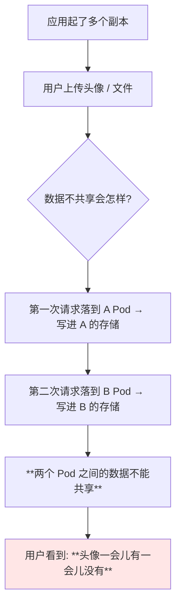

```text
不共享时:

用户请求 1 → Pod-A → 存储 A（头像在里面）
用户请求 2 → Pod-B → 存储 B（空的）

⇒ 用户刷新页面, 头像时有时无
```

> 课程原话：**「不共享的话，你可能第一次写到了 A Pod，第二次写到 B Pod，就造成了两个 Pod 之间的数据不能共享，就可能造成头像一会儿有一会儿没有，文件一会儿有一会儿没有」**。

## 三个兄弟：块存储 / 对象存储 / 共享文件系统

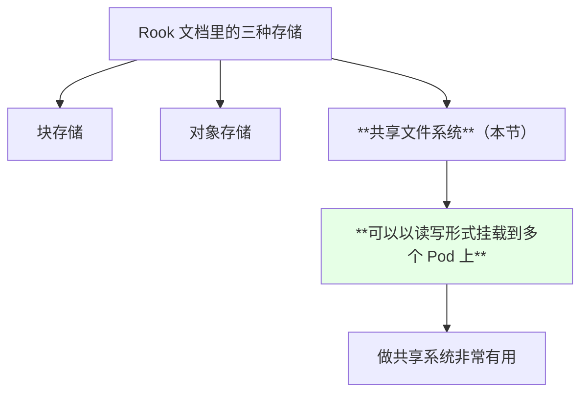

| 类型 | 挂载给几个 Pod | 典型用途 |
| --- | --- | --- |
| 块存储 | 一般一个（StatefulSet 的天下） | Redis / DB 各副本独立数据 |
| **共享文件系统** | **多个，且可同时读写** | **头像 / 上传文件 / 静态资源共享** |
| 对象存储 | 应用直连、写代码 | 本課不涉及 |

## 只建一个 filesystem：多个不被支持

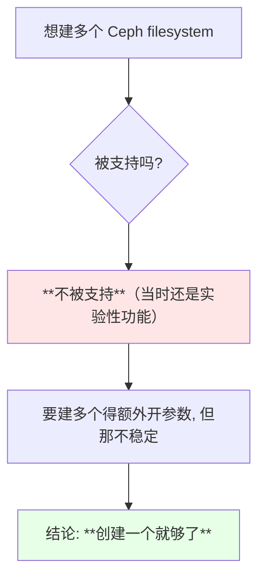

> 课程明确提醒：**「多个共享文件系统是不被支持的……它还是属于实验性，现在还不是很稳定，所以就不要创建多个了，还是创建一个就够了」**。

## 创建 CephFileSystem 的三层参数

```yaml
apiVersion: ceph.rook.io/v1
kind: CephFilesystem
metadata:
  name: myfs
  namespace: rook-ceph
spec:
  metadataPool:
    replicated:
      size: 1
  dataPools:
  - replicated:
      size: 1
  metadataServer:
    activeCount: 1
    activeStandby: true
```

```text
一个 filesystem 由三层参数构成:

CephFilesystem
├── metadataPool.replicated.size    ← **元数据**需要保存的副本数
├── dataPools[].replicated.size     ← **数据**需要保存的副本数
└── metadataServer
    ├── activeCount                 ← 起**多少个**元数据服务
    └── activeStandby               ← 是否起一个**备（从）节点**
```

| 参数 | 作用 | 演示取值 |
| --- | --- | --- |
| `metadataPool.replicated.size` | **元数据池**的副本数 | 1（只有一个存储节点时） |
| `dataPools[].replicated.size` | **数据池**的副本数 | 1 |
| `metadataServer.activeCount` | 元数据服务（MDS）数量 | 1 |
| `metadataServer.activeStandby` | 是否起备 MDS | **true** |

> 这些参数和 Ceph 本身是相关联的，有些跟 Ceph 上没有差别 —— **想深挖需要对 Ceph 有一定了解**。

## 主备 MDS：会多出两个 Pod

```bash
kubectl get cephfilesystem -n rook-ceph
kubectl get pods -n rook-ceph | grep mds
```

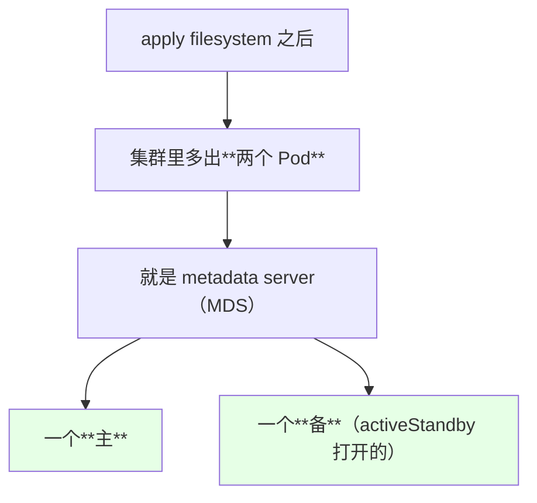

> 课程观察到：**「创建这个文件系统之后，它会创建两个 Pod，就是我们刚才创建的这个 metadata server，一个主一个备」**，而且起得挺快。

filesystem 的名字后面会用到 —— 演示里叫 **`myfs`**：

```bash
kubectl get cephfilesystem
# NAME   ACTIVEMDS   AGE
# myfs   1           ...
```

## toolbox 用来看状态

> 想看更细的 Ceph 状态可以**起一个 toolbox**，到里面执行 `ceph` 命令查看。作者当时没装，但也说明**非常好装 —— 就一个 yaml 文件**。

```bash
# 下面命令中的变量按你的集群环境赋值后再执行
kubectl exec -it -n rook-ceph $TOOLS -- ceph fs status
kubectl exec -it -n rook-ceph $TOOLS -- ceph fs ls
```

## 建对应的 StorageClass

```yaml
apiVersion: storage.k8s.io/v1
kind: StorageClass
metadata:
  name: rook-cephfs
provisioner: rook-ceph.cephfs.csi.ceph.com
reclaimPolicy: Delete
parameters:
  clusterID: rook-ceph
  fsName: myfs                 # ← **刚才那个文件系统的名字**
  pool: myfs-data0             # ← 会自动创建，一般不用管
  csi.storage.k8s.io/provisioner-secret-name: rook-csi-cephfs-provisioner
  csi.storage.k8s.io/provisioner-secret-namespace: rook-ceph
  csi.storage.k8s.io/node-stage-secret-name: rook-csi-cephfs-node
  csi.storage.k8s.io/node-stage-secret-namespace: rook-ceph
```

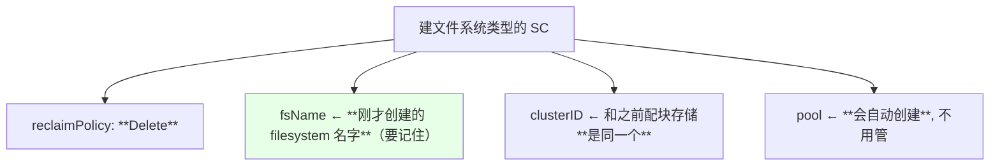

| 字段 | 取值要点 |
| --- | --- |
| `metadata.name` | 之后 PVC / PV 引用的名字 |
| `fsName` | **必须和 `kubectl get cephfilesystem` 看到的一致** |
| `clusterID` | 与块存储的 SC 一致（都是 rook-ceph） |
| `pool` | 自动创建；**也可以指定一个已存在的 volume** |
| `reclaimPolicy` | **Delete** |

## StorageClass 没有 namespace 限制

```bash
kubectl get sc
# NAME              PROVISIONER
# rook-ceph-block   rook-ceph.rbd.csi.ceph.com
# rook-cephfs       rook-ceph.cephfs.csi.ceph.com
```

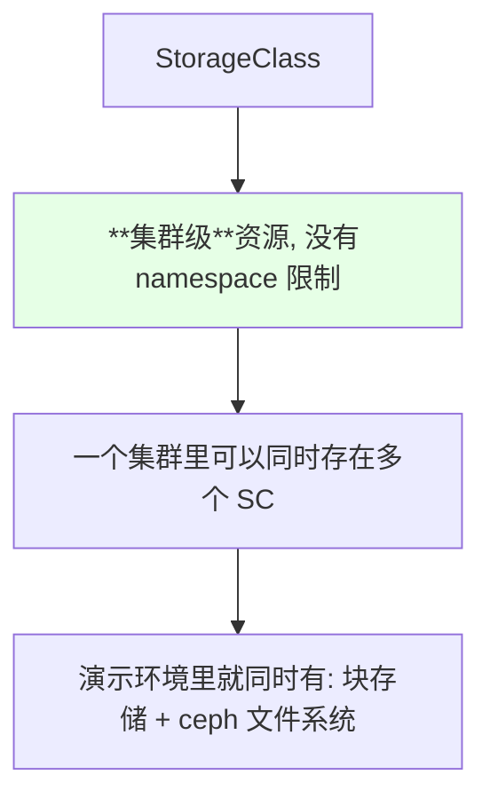

## 内核 4.17 的 quota 门槛

这是本节最容易被忽略的一条注意事项：

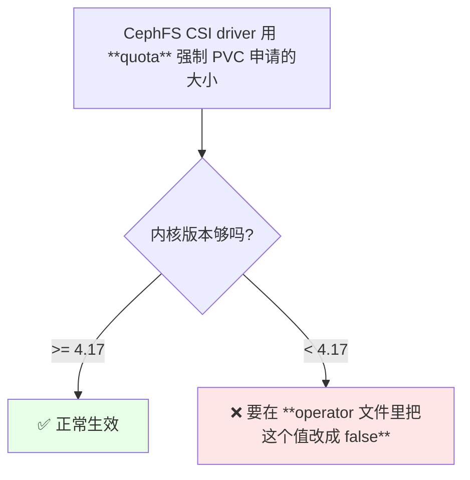

> 课程环境当时的默认内核是 **4.18**，满足要求；并且在安装 Kubernetes 的步骤里本身就有升级内核的环节，一般都会大于 4.17，所以通常不用担心 —— **但低于 4.17 就必须手动关掉这个 quota 开关**。

| 内核 | 处理 |
| --- | --- |
| **≥ 4.17** | 默认可用 |
| **< 4.17** | **修改 operator 里对应参数为 `false`** |

## 建 PVC：访问模式改 RWX

```yaml
kind: PersistentVolumeClaim
apiVersion: v1
metadata:
  name: cephfs-pvc
  namespace: default
spec:
  accessModes:
  - ReadWriteMany                # ← 多个节点同时读写
  resources:
    requests:
      storage: 1Gi
  storageClassName: rook-cephfs  # ← **别写错成块存储那个**
```

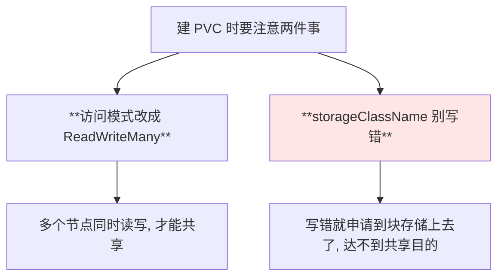

> 课程里作者自己差点选错：**「这个 storageClassName 不要写错了啊，我刚开始选的还是之前那个」**。

```bash
kubectl get pvc -n default
# 一开始 Pending, 稍后 Bound
kubectl get pv
# 对应的 PV 也正常绑定
```

## 起两个副本的 Deployment 做实测

在页面里创建 Deployment：

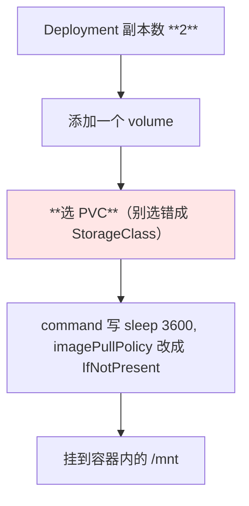

```yaml
      volumes:
      - name: cephfs-volume
        persistentVolumeClaim:
          claimName: cephfs-pvc
      containers:
      - name: nginx
        image: nginx:1.15.2
        imagePullPolicy: IfNotPresent
        command:
        - sh
        - -c
        - sleep 3600
        volumeMounts:
        - name: cephfs-volume
          mountPath: /mnt
```

## 挂载形态与块存储不一样

```bash
# 下面命令中的变量按你的集群环境赋值后再执行
kubectl exec -it $POD -- df -h
```

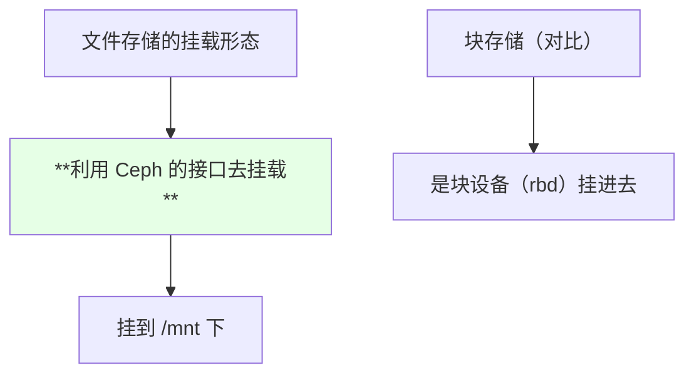

| 类型 | `df -h` 里看到的形态 |
| --- | --- |
| 块存储 | rbd 块设备 |
| **文件存储** | **通过 Ceph 接口挂载**（和块存储明显不同） |

## 实测：一个 Pod 写、另一个 Pod 读得到

```bash
# 进第一个 Pod 写个文件
kubectl exec -it $POD_A -- sh -c "touch /mnt/file1"

# 进第二个 Pod 看
kubectl exec -it $POD_B -- sh -c "ls /mnt"
# file1
```

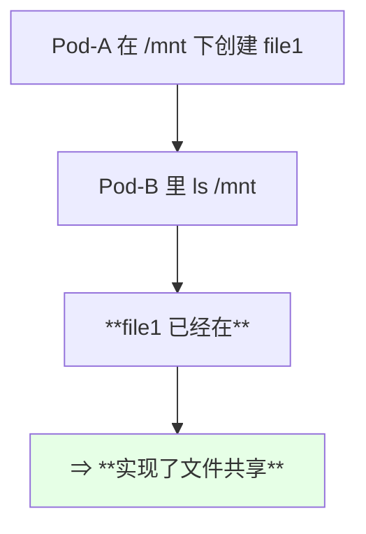

> 课程原话：**「可以看到这个文件已经在，所以说这个就是文件存储形式的用途」**。这正是块存储做不到的。

## 删之前的顺序：先删 Deployment

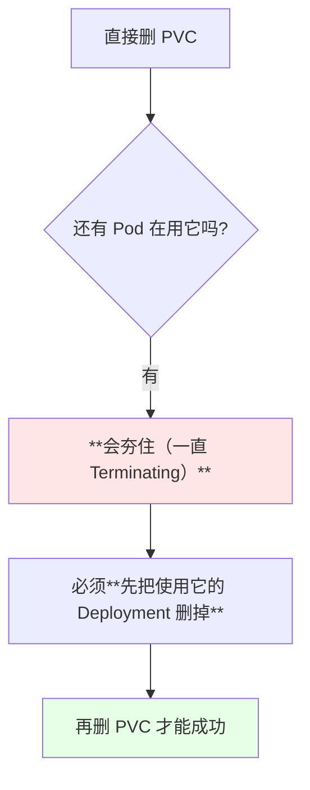

> 课程明确提醒：**「删 PVC 之前，一定要先把它的 Deployment 给删掉」** —— 当时作者就是因为还有旧资源在，PVC 一直卡着。

> 顺带一提：Ratel 平台当时**还没有实现 PV / PVC 的管理功能**，所以这些操作要用 kubectl 来做。

## 什么时候用块、什么时候用文件

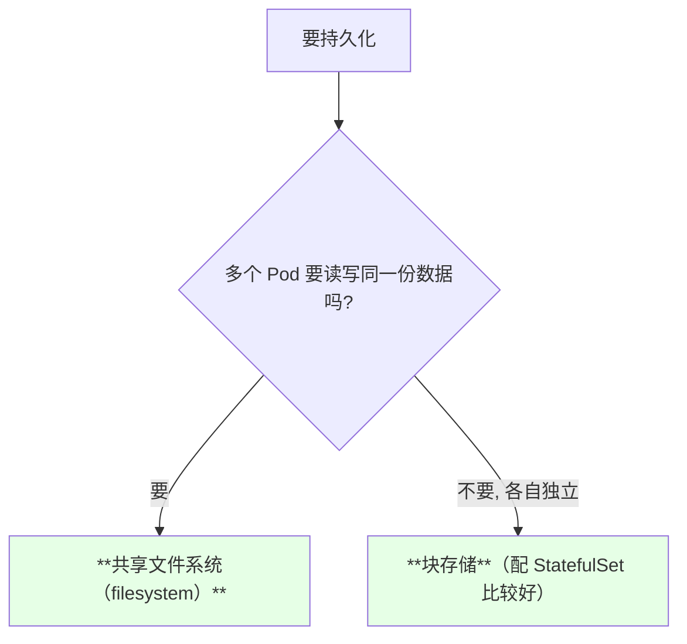

> 课程结论：**「块存储我们一般用在 StatefulSet 其实是比较好的；如果你现在做共享文件的话，还是用这种 filesystem 比较好」**。

## API 速览

| 能力 | 做法 | 关键点 |
| --- | --- | --- |
| 看文件系统 | `kubectl get cephfilesystem -n rook-ceph` | 名字就是 SC 里的 `fsName` |
| 看 MDS Pod | `kubectl get pods -n rook-ceph \| grep mds` | 一主一备两个 |
| 看 SC 列表 | `kubectl get sc` | 集群级，没有 ns 限制 |
| 建 PVC | 访问模式写 `ReadWriteMany` | **SC 名别写错** |
| 看 PVC 是否 Bound | `kubectl get pvc -n <NS>` | 一开始 Pending，稍后 Bound |
| 看挂载形态 | `kubectl exec -it <POD> -- df -h` | 与块存储不同 |
| 验证共享 | 一个 Pod 写文件、另一个 Pod 看 | 能看到即成功 |
| 删除顺序 | 先 `kubectl delete deploy` 再删 PVC | **反过来会夯住** |
| 看 Ceph 状态 | toolbox 里 `ceph fs status` | 可选 |

字段速查：

| 字段 | 作用 |
| --- | --- |
| `CephFilesystem.metadataPool.replicated.size` | 元数据池副本数 |
| `CephFilesystem.dataPools[].replicated.size` | 数据池副本数 |
| `CephFilesystem.metadataServer.activeCount` | MDS 数量 |
| `CephFilesystem.metadataServer.activeStandby` | 是否起备 MDS |
| `StorageClass.parameters.fsName` | **文件系统名** |
| `StorageClass.parameters.clusterID` | 与块存储一致 |
| PVC `accessModes: ReadWriteMany` | 多节点同时读写 |
| operator 里的 quota 开关 | **内核 < 4.17 要改成 false** |

## Demo 示例

```bash
# 1. 建文件系统（注意: 建议只建一个, 多个当时不被支持）
kubectl apply -f ceph-filesystem.yaml
kubectl get cephfilesystem -n rook-ceph

# 2. 确认主备 MDS 都起来了
kubectl get pods -n rook-ceph | grep mds

# 3. 建对应的 StorageClass
kubectl apply -f cephfs-sc.yaml
kubectl get sc

# 4. 建一个 RWX 的 PVC（注意 storageClassName 别写成块存储那个）
NS=default
kubectl apply -f cephfs-pvc.yaml -n "$NS"
kubectl get pvc -n "$NS"
kubectl get pv

# 5. 起两个副本的 Deployment 验证共享效果
kubectl apply -f cephfs-deploy.yaml
kubectl get pods -w

# 6. 一个 Pod 写, 另一个读
NS=default
PODS=$(kubectl get pods -n "$NS" -l app=cephfs-demo -o jsonpath='{.items[*].metadata.name}')
echo "$PODS"
POD_A=$(echo "$PODS" | awk '{print $1}')
POD_B=$(echo "$PODS" | awk '{print $2}')
kubectl exec -it "$POD_A" -n "$NS" -- sh -c "touch /mnt/file1"
kubectl exec -it "$POD_B" -n "$NS" -- ls /mnt

# 7. 看挂载形态（与块存储不同）
kubectl exec -it "$POD_A" -n "$NS" -- df -h | grep mnt

# 8. 清理: **先删 Deployment 再删 PVC**, 否则 PVC 会卡住
kubectl delete -f cephfs-deploy.yaml
kubectl delete pvc cephfs-pvc -n "$NS"
# 可选: toolbox 里看更细的状态
# kubectl exec -it -n rook-ceph <TOOLS> -- ceph fs status
```

```yaml
# ceph-filesystem.yaml —— 共享文件系统（建议只建一个）
apiVersion: ceph.rook.io/v1
kind: CephFilesystem
metadata:
  name: myfs
  namespace: rook-ceph
spec:
  metadataPool:
    replicated:
      size: 1                    # 元数据副本数
  dataPools:
  - replicated:
      size: 1                    # 数据副本数
  metadataServer:
    activeCount: 1               # MDS 数量
    activeStandby: true          # 起一个备 MDS
```

```yaml
# cephfs-sc.yaml —— 文件系统类型的 StorageClass
apiVersion: storage.k8s.io/v1
kind: StorageClass
metadata:
  name: rook-cephfs
provisioner: rook-ceph.cephfs.csi.ceph.com
reclaimPolicy: Delete
parameters:
  clusterID: rook-ceph
  fsName: myfs                   # ← 与上面的 filesystem 名字一致
  pool: myfs-data0               # 通常会自动创建
  csi.storage.k8s.io/provisioner-secret-name: rook-csi-cephfs-provisioner
  csi.storage.k8s.io/provisioner-secret-namespace: rook-ceph
  csi.storage.k8s.io/node-stage-secret-name: rook-csi-cephfs-node
  csi.storage.k8s.io/node-stage-secret-namespace: rook-ceph
```

```yaml
# cephfs-pvc.yaml —— 多节点同时读写的 PVC
kind: PersistentVolumeClaim
apiVersion: v1
metadata:
  name: cephfs-pvc
  namespace: default
spec:
  accessModes:
  - ReadWriteMany                # 关键: 多节点同时读写
  resources:
    requests:
      storage: 1Gi
  storageClassName: rook-cephfs  # 别写成块存储那个 SC
```

```yaml
# cephfs-deploy.yaml —— 两个副本共享同一份数据
apiVersion: apps/v1
kind: Deployment
metadata:
  name: cephfs-demo
  labels:
    app: cephfs-demo
spec:
  replicas: 2
  selector:
    matchLabels:
      app: cephfs-demo
  template:
    metadata:
      labels:
        app: cephfs-demo
    spec:
      volumes:
      - name: cephfs-volume
        persistentVolumeClaim:
          claimName: cephfs-pvc
      containers:
      - name: nginx
        image: nginx:1.15.2
        imagePullPolicy: IfNotPresent
        command:
        - sh
        - -c
        - sleep 3600
        volumeMounts:
        - name: cephfs-volume
          mountPath: /mnt
```

```text
块存储 vs 文件存储 —— 最终对照:

维度            块存储                      文件存储
────────────────────────────────────────────────────────
陪 Pod 共享      否（每实例独立）            **是（多 Pod 同时读写）**
访问模式        ReadWriteOnce               **ReadWriteMany**
挂载形态        rbd 块设备                   **通过 Ceph 接口挂载**
典型配合        StatefulSet                 Deployment 多副本
数据 pool       CephBlockPool               **CephFileSystem（主备 MDS）**
额外要求        —                           **内核 >= 4.17（quota 限制）**
```

### 总结

- **共享文件系统解决的是「多副本要读写同一份数据」**：不共享会让用户看到**头像一会儿有一会儿没有** —— 写进了 A Pod 的存储，下一次请求落到 B Pod 就读不到了；
- **多个共享文件系统当时是不被支持的**（实验性、不稳定），**建一个就够了**；
- **CephFilesystem 有三层参数**：元数据池副本数、数据池副本数、元数据服务 `activeCount` 与 `activeStandby`；建完之后**会多出两个 Pod（一个主 MDS、一个备 MDS）**；
- **对应的 StorageClass 里 `fsName` 必须写刚创建的文件系统名**，`clusterID` 与块存储那个保持一致，`reclaimPolicy` 用 `Delete`；
- **一个隐藏门槛：CephFS CSI driver 用 quota 强制 PVC 申请的容量，内核最少要 4.17** —— 低于这个版本要在 operator 里把该值改成 `false`；课程环境默认 4.18 所以没问题；
- **PVC 的访问模式要改成 `ReadWriteMany`、且 `storageClassName` 千万别写错成块存储**（作者自己就差点选错）；**实测两个副本挂载同一 PVC，一个里写的文件另一个里马上能看到**；
- **清理顺序很重要：先删还在用它的 Deployment，再删 PVC**，否则 PVC 会一直卡在 Terminating；整体选择上 —— **块存储配 StatefulSet 最好，做共享文件用 filesystem 最好**。

