# Kubernetes 集群部署: PVC 在线扩容与快照前的准备（为什么不能一次性申请太大，以及全组件打开 feature gates）

这一節是后面「PVC 在线扩容」和「PVC 快照 / 回滚」的前置准备。两个操作都不是开箱可用的 —— **快照当时还是 alpha 特性，要靠 feature gates 打开**；而扩容之所以重要，是因为动态存储**不能像 NFS 那样随便申请大小**。

结论先摆：

1. **动态存储下一次创建 PVC 就可能生成一个镜像 / 一个 pool**，所以**不能一次性申请太大** —— 应用只用 5G 却申请 500G 属于**过量申请**，别人也用不掉、只能你自己占着；
2. **正确姿势：按量申请，不够了再在线扩容**；
3. **Ceph 的 CSI 天生支持 PVC 的扩容、快照和回滚**；
4. **快照当时还是 alpha 特性** —— 要像之前开临时容器那样改 feature gates；
5. 作者的经验做法：**只要是 feature gates，就把所有控制面组件都加上** —— 有的 gate 只在 apiserver 打开就行，**有的在 apiserver 上打开是不够的**；
6. 需要改四处：**kube-apiserver / kube-controller-manager / kube-scheduler / kube-proxy + kubelet 的 KubeletConfiguration**，改完重启；
7. **多窗口编辑时每个会话的光标位置必须一致**，否则会把配置写得乱七八糟。

## 纲要

- 为什么 PVC 要按量申请
- 过量申请的代价
- 不够了怎么办：在线扩容
- CSI 天生支持的三件事
- 正视现状：这些能力当时还是 alpha
- 快照要开 feature gates
- 作者的经验：全组件都加
- 扩容也要单独开一个 gate
- 要改哪几个地方
- kubelet 侧用 KubeletConfiguration
- 多窗口编辑的光标陷阱
- 改完后重启并确认

## 为什么 PVC 要按量申请

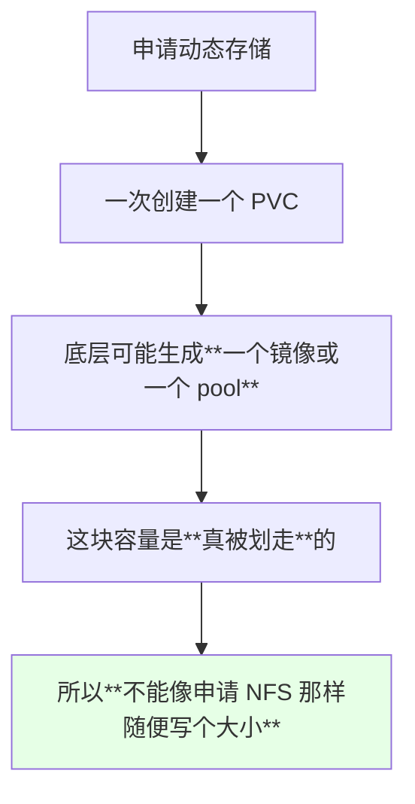

> 课程原话：**「使用 Ceph 这种，一申请、一创建一个 PVC 可能就是一个镜像，或者是一个 pool，这个大小我们肯定不能像申请 NFS 一样，想申请多大都可以」**。

NFS 那种共享目录，申请大一点也不影响别人（实际按用量走）；**块设备 / pool 这种不同，写多少就划多少**。

## 过量申请的代价

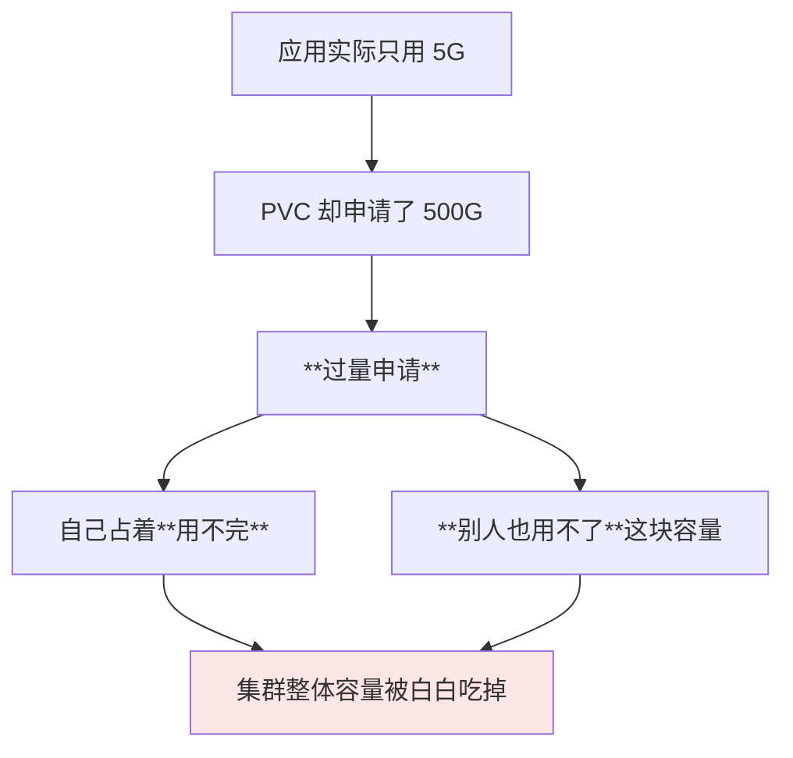

| 做法 | 评价 |
| --- | --- |
| 一次性申请很大 | ❌ **过量申请**，浪费且挤占他人 |
| **按实际用量申请** | ✅ 推荐 |
| 后面不够了再扩 | ✅ **在线扩容** |

## 不够了怎么办：在线扩容

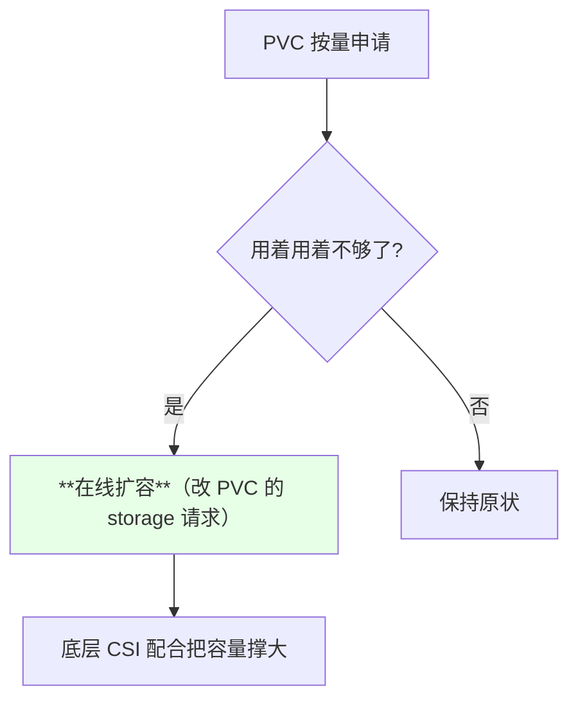

> **不用重建 PVC、不用重建 Pod** —— 这也是 CSI 时代和静态 PV 时代最大的体感差别之一。

## CSI 天生支持的三件事

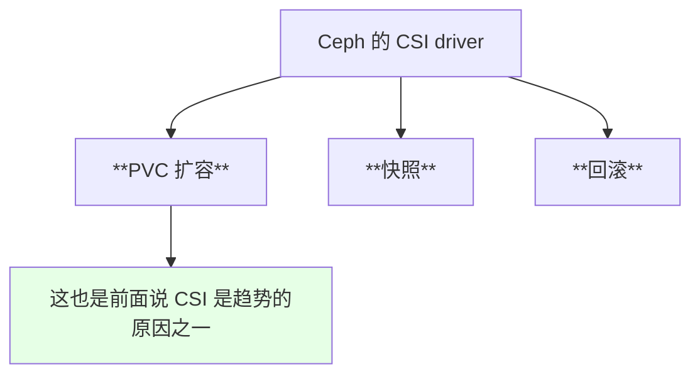

| 能力 | CSI 支持情况 |
| --- | --- |
| PVC 在线扩容 | **天生支持** |
| 快照 | **天生支持**（但当时 Kubernetes 侧还是 alpha） |
| 回滚 | **天生支持** |

## 正视现状：这些能力当时还是 alpha

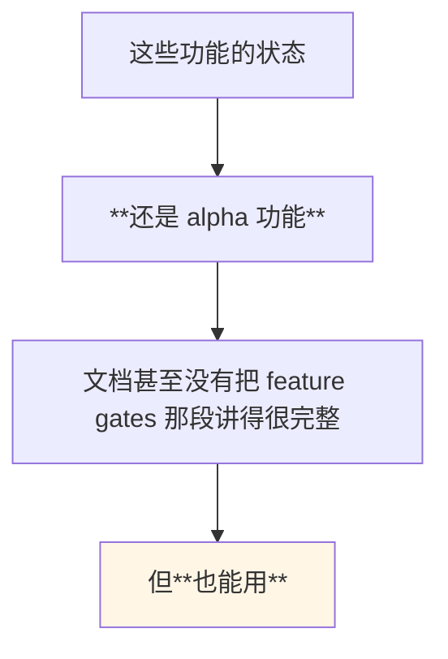

> 课程原话：**「这个功能还是 alpha 功能，但是也能用」**。官方文档里快照那一段写得比较靠前，作者也就照着文档的顺序来讲。

## 快照要开 feature gates

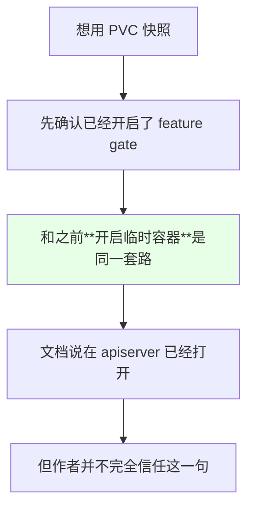

> 与之前那次一样：**文档说某处已经默认开启，实际自己再确认一遍更稳妥**。

## 作者的经验：全组件都加

这是本节最实用的一条经验：

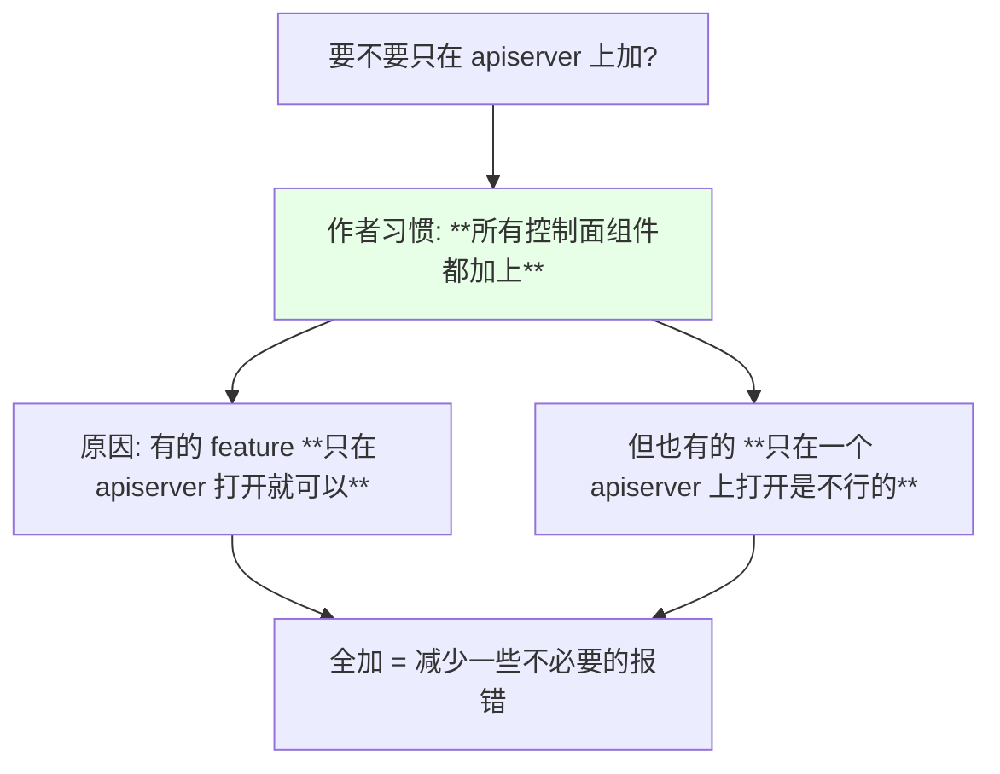

| 做法 | 风险 |
| --- | --- |
| 只在 apiserver 打开 | 某些 gate **不生效**，报错难查 |
| **所有组件都打开** | 稳妥，作者推荐 |

> 课程原话：**「我一般的习惯就是把所有的 controller 都给加上，因为有时候有的 feature 它在 apiserver 打开就可以，但是有的可能只在一个 apiserver 上打开是不行的……只要是 feature gates，我就把所有的那个控制器都给加上，这样可能会减少一些报错」**。

## 扩容也要单独开一个 gate

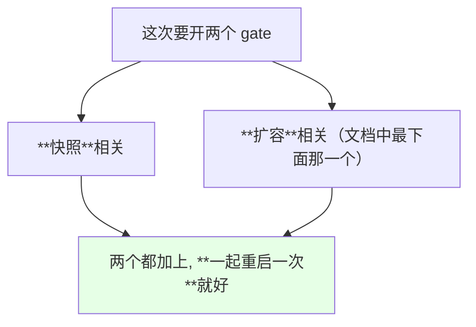

> 作者的做法：**「我们直接把这两个都给加上，然后我们就重启一次就可以」** —— 不用改一次重启一次。

## 要改哪几个地方

```text
二进制集群要改的位置:

控制面节点
├── kube-apiserver              ← 加 feature-gates
├── kube-controller-manager     ← 加 feature-gates
├── kube-scheduler              ← 加 feature-gates
└── kube-proxy                  ← 加 feature-gates

所有节点
└── kubelet
    ├── kubelet.service（命令行参数）
    └── KubeletConfiguration 配置文件
```

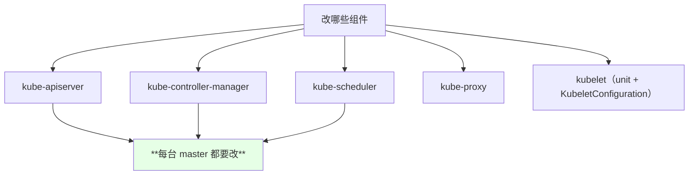

> 演示环境作者只保留了 **master01** 一台（其余为了省资源停掉了），所以只改这一台；**生产环境必须把所有的 master 都改一遍**，有条件的话用批量执行工具统一下发。

## kubelet 侧用 KubeletConfiguration

```yaml
apiVersion: kubelet.config.k8s.io/v1beta1
kind: KubeletConfiguration
featureGates:
  VolumeSnapshotDataSource: true
  ExpandCSIVolumes: true
  ExpandInUsePersistentVolumes: true
  CSINodeInfo: true
  CSIDriverRegistry: true
```

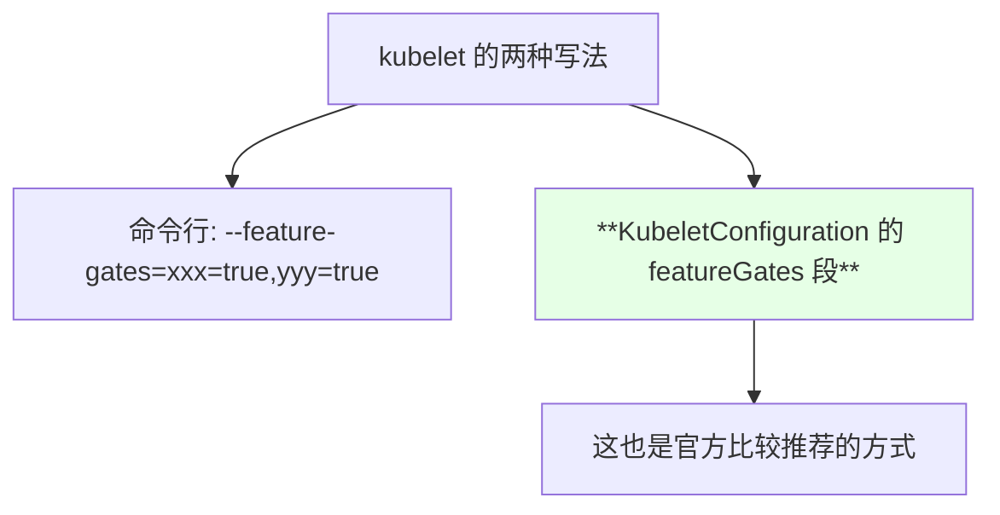

| 载体 | 写法 |
| --- | --- |
| systemd unit | `--feature-gates=A=true,B=true` |
| **KubeletConfiguration** | `featureGates: {A: true, B: true}` |

> 多个 gate 之间**用逗号隔开**（命令行形式），或写成 yaml 的 map（配置文件形式）。

## 多窗口编辑的光标陷阱

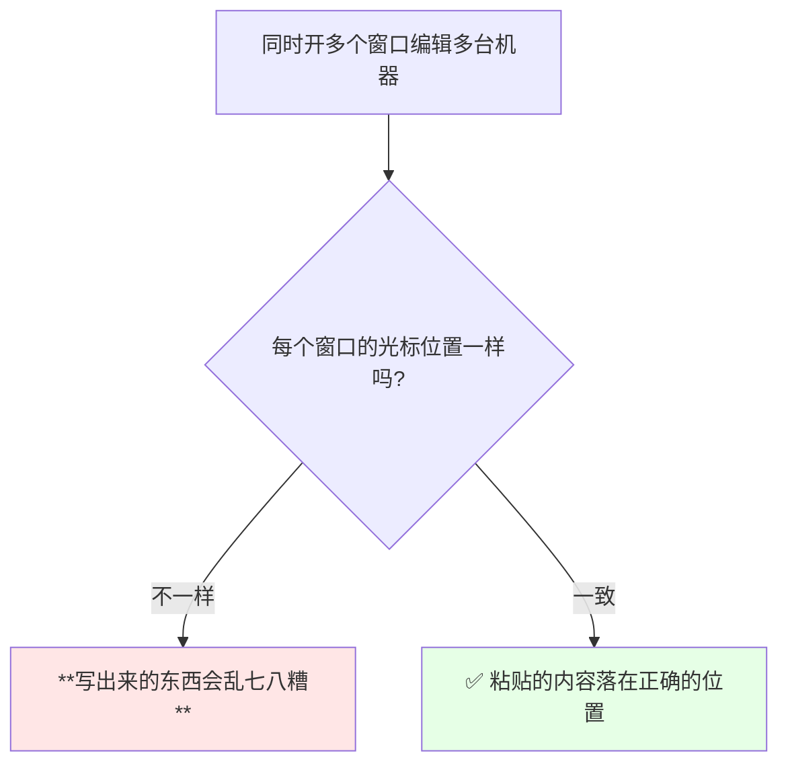

> 课程提醒：**「如果用的是那种可以往所有会话广播命令的终端，一定要注意光标的位置，这个光标位置一定要是一样的才可以，要不然写的会乱七八糟的」**。这和之前讲临时容器时踩的是同一个坑。

另外还有一条老经验：**新加的参数一律追加到末尾**，不要插到前面。

```text
多机编辑 checklist:

1. 每个窗口的光标位置必须一致
2. 新参数追加到末尾, 不要插队
3. 多个 gate 之间用逗号隔开, 别丢了换行符
4. 改完逐个确认每台机器都加上了
```

## 改完后重启并确认

```bash
systemctl daemon-reload
systemctl restart kube-apiserver
systemctl restart kube-controller-manager
systemctl restart kube-scheduler
systemctl restart kube-proxy
systemctl restart kubelet
```

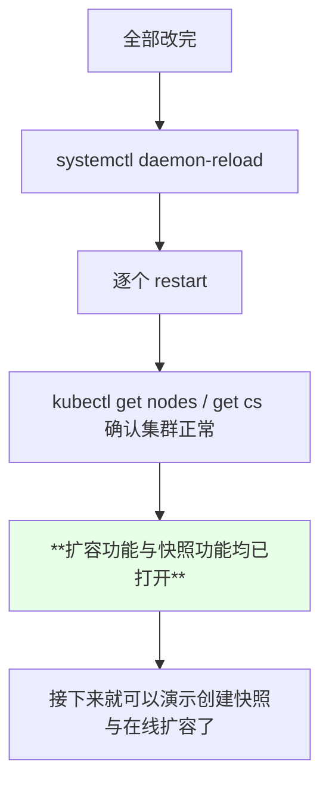

> 课程结尾：**「配置完成这些以后，这个扩容功能还有那个快照功能都已经打开了」**，下一节开始实际操作。

## API 速览

| 能力 | 做法 | 关键点 |
| --- | --- | --- |
| 确认 apiserver 的 gate | 看 unit 里的 `--feature-gates` | 建议全组件一致 |
| 改 kubelet 配置 | 编辑 KubeletConfiguration 的 `featureGates` | 改完要重启 kubelet |
| 多机批量修改 | 广播命令时**光标位置必须一致** | 否则配置写乱 |
| 重载配置 | `systemctl daemon-reload` | 改完必做 |
| 重启组件 | `systemctl restart <组件>` | 逐个重启 |
| 确认集群正常 | `kubectl get nodes` | 有异常立即回滚修改 |
| 多 gate 写法 | 命令行：逗号分隔 | 别丢换行符 |

字段速查：

| 配置 | 作用 |
| --- | --- |
| `--feature-gates=...` | 命令行形式开启 alpha / beta 特性 |
| `featureGates: {...}` | KubeletConfiguration 里的等价写法 |
| 快照相关 gate | 开启 VolumeSnapshot 能力（当时是 alpha） |
| 扩容相关 gate | 开启 PVC 在线扩容能力 |
| `ExpandCSIVolumes` | CSI 卷扩容 |
| `VolumeSnapshotDataSource` | 允许用快照作为数据源 |

## Demo 示例

```bash
# 1. 在控制面节点上给 apiserver 追加 feature-gates（追加到启动参数末尾）
vi /etc/systemd/system/kube-apiserver.service
# 在启动参数末尾追加:
#   --feature-gates=VolumeSnapshotDataSource=true,ExpandCSIVolumes=true

# 2. controller-manager / scheduler / proxy 同样处理
vi /etc/systemd/system/kube-controller-manager.service
vi /etc/systemd/system/kube-scheduler.service
vi /etc/systemd/system/kube-proxy.service

# 3. kubelet 除了 unit, 还要改 KubeletConfiguration（推荐方式）
vi /var/lib/kubelet/config.yaml
# featureGates:
#   VolumeSnapshotDataSource: true
#   ExpandCSIVolumes: true

# 4. 改完确认每台机器都真的加上了
grep -r "feature-gates" /etc/systemd/system/
grep -A5 featureGates /var/lib/kubelet/config.yaml

# 5. 重载并重启（可以把所有改动一次做完再执行一遍）
systemctl daemon-reload
systemctl restart kube-apiserver
systemctl restart kube-controller-manager
systemctl restart kube-scheduler
systemctl restart kube-proxy
systemctl restart kubelet

# 6. 确认集群恢复正常
kubectl get nodes
kubectl get pods -n kube-system

# 7. 确认之前部署的 PVC 还在, 后面就可以直接拿它做扩容与快照
NS=default
kubectl get pvc -n "$NS"
kubectl get sc
```

```yaml
# /var/lib/kubelet/config.yaml —— kubelet 侧推荐写法
apiVersion: kubelet.config.k8s.io/v1beta1
kind: KubeletConfiguration
featureGates:
  VolumeSnapshotDataSource: true
  ExpandCSIVolumes: true
```

```yaml
# 只做演示用的一份快照相关 CRD 清单（供后续章节使用）
---
apiVersion: snapshot.storage.k8s.io/v1alpha1
kind: VolumeSnapshotClass
metadata:
  name: csi-rbdplugin-snapclass
snapshotter: rook-ceph.rbd.csi.ceph.com
parameters:
  clusterID: rook-ceph
  csi.storage.k8s.io/snapshotter-secret-name: rook-csi-rbd-provisioner
  csi.storage.k8s.io/snapshotter-secret-namespace: rook-ceph
```

```text
本次要打开的两类 gate 与其作用:

gate 类别        作用                                 备注
────────────────────────────────────────────────────────────
快照类           允许用快照作为数据源、支持快照对象    当时仍是 **alpha**
扩容类           CSI 卷在线扩容 / 使用中的 PV 也能扩   当时仍是 **alpha**

覆盖范围建议:
   apiserver / controller-manager / scheduler / proxy / kubelet
   → **全部都加**（作者的经验：只加一处可能不生效）
```

### 总结

- **动态存储不像 NFS**：一次创建 PVC 就可能生成一个镜像或一个 pool，**容量是真被划走的**，所以**不能一次性申请太大**（应用只用 5G 却申请 500G 就是过量申请，自己用不完、别人也用不了）；
- **正确姿势是「按量申请 + 不够了在线扩容」**，不用重建 PVC 和 Pod；
- **Ceph 的 CSI 天生支持 PVC 扩容、快照和回滚** —— 这也是前面判断「CSI 是未来趋势」的原因；
- 但**当时这两个能力都还是 alpha 特性**，必须手工打开 feature gates；
- **作者的经验：只要是 feature gates，就把所有控制面组件（apiserver / controller-manager / scheduler / proxy / kubelet）全部加上** —— 有的 gate 只在 apiserver 打开就行，**有的则不行**，全加能减少排查成本；
- **两个 gate 一起加、只重启一次**即可；kubelet 侧推荐用 KubeletConfiguration 的 `featureGates` 段；
- **多窗口编辑时每个会话的光标位置必须一致**（不一致会把配置写得乱七八糟），**新参数一律追加到末尾**；改完 `daemon-reload` + 逐个重启，确认 `kubectl get nodes` 正常后，扩容与快照能力就都打开了。

