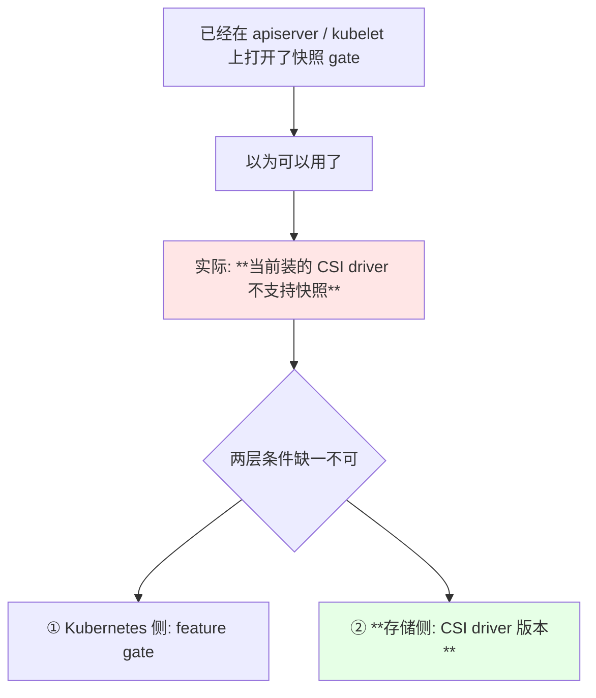
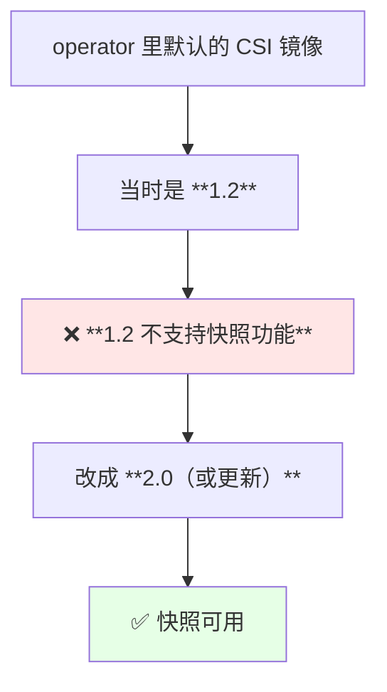
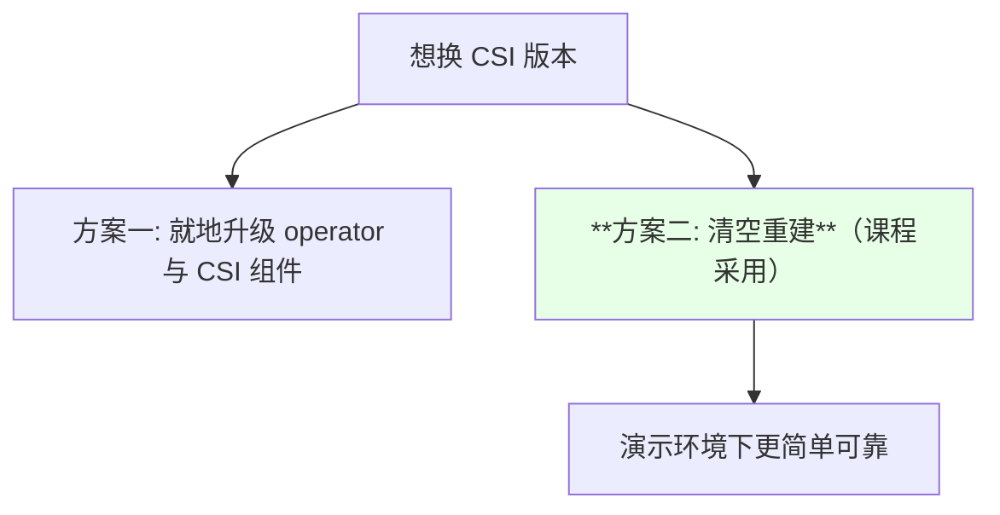
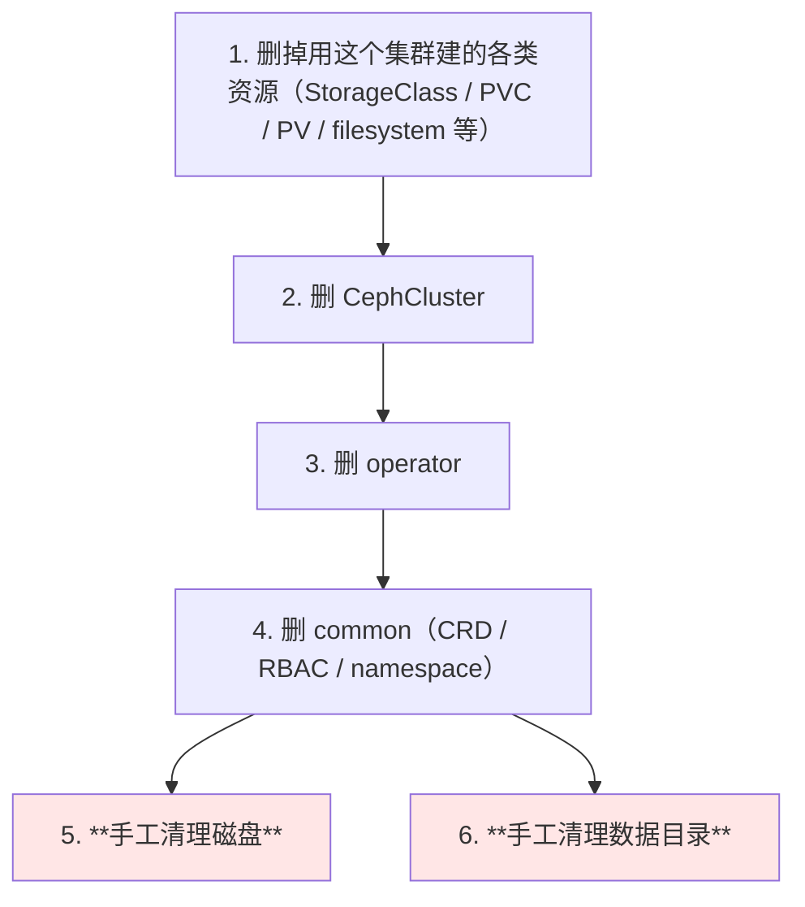
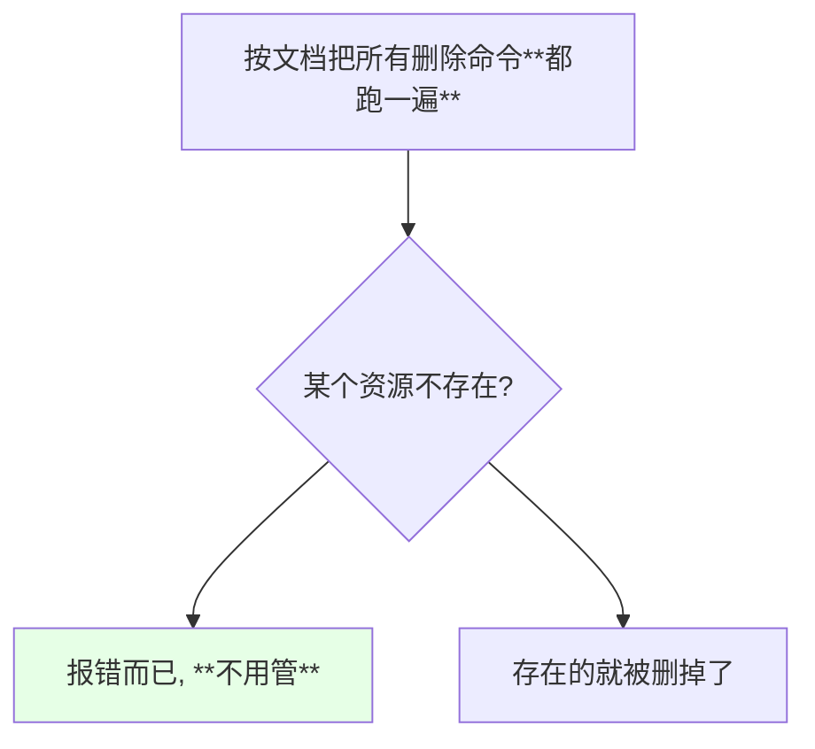
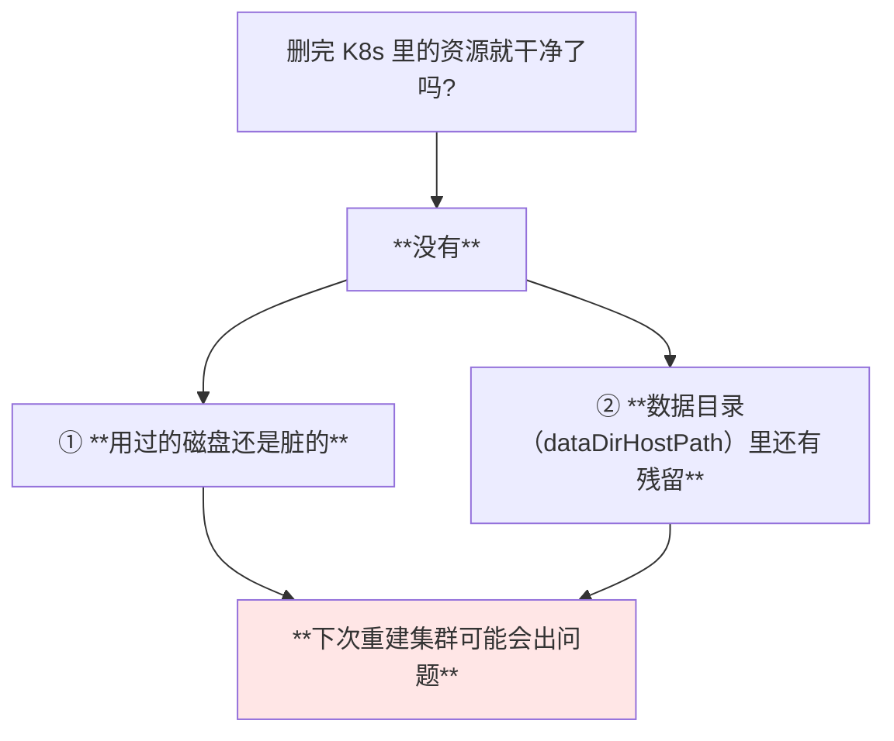
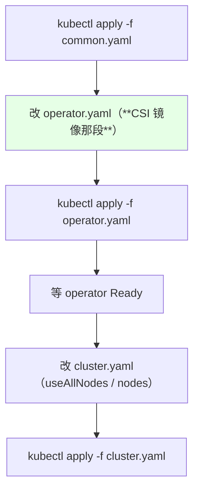
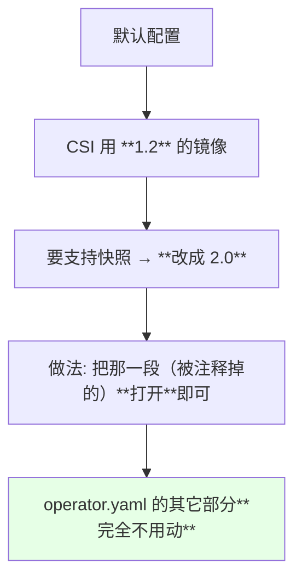
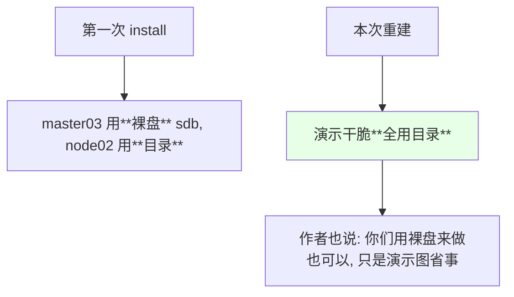
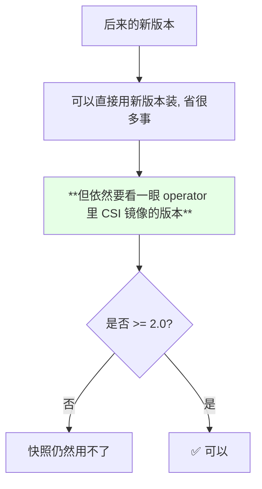

# Kubernetes 集群部署: Rook 集群清理和重建（为什么必须换 CSI 镜像、以及磁盘与数据目录要清干净）

上一節把快照和扩容的 feature gates 打开了，但马上撞到现实：**之前装的那个版本的 CSI 不支持快照功能**。最简单的出路是清空重建 —— 这一節记录的就是这个「推倒重来」的完整姿势。

结论先摆：

1. **光打开 feature gates 不够** —— 还要 **CSI driver 本身支持**；当时装的 CSI 版本不支持快照；
2. **判断标准很明确：operator 里的 CSI 镜像必须 ≥ 2.0** 才支持快照功能（默认那份用的是 1.2 的镜像）；
3. **清理有两处必须手工作**：**把用过的磁盘清掉**、**把数据目录清掉** —— **不清干净，下次重建集群可能出问题**；
4. 清理文档里的命令可以「没有的资源也执行一遍」，**报错不用管**；
5. **重装步骤和第一次几乎一样**，唯一的区别就是 **operator 里 CSI 镜像那段要打开 / 换成 2.0**；
6. 演示环境重建时改成了全用目录做存储节点（之前是裸盘），两种都可以。

## 纲要

- 为什么明明开了 gate 还是不能用快照
- CSI 镜像 ≥ 2.0 这条硬门槛
- 决定清空重建
- 清理步骤：按官方 clean 文档逐个删
- 没有的资源也执行一遍，报错不用管
- 删除 operator 与 common
- 必须手工做的两件事：清磁盘、清数据目录
- 重装：步骤与首次基本一致
- operator 的唯一改动：CSI 镜像换成 2.0
- 演示改用目录做存储节点
- 新版本出来后还要注意什么

## 为什么明明开了 gate 还是不能用快照



| 层级 | 要做什么 |
| --- | --- |
| Kubernetes 组件 | 打开 feature gates（上一節做的） |
| **CSI driver** | **版本要够新**（本节要换的） |

> 课程原话：**「虽然说我们打开了那个快照功能，但是它这个 CSI 目前的我们之前装的那个版本是不支持快照功能，我们需要更改一下之前的部署」**。

## CSI 镜像 ≥ 2.0 这条硬门槛



| CSI 镜像版本 | 快照支持 |
| --- | --- |
| 1.2 | **不支持** |
| **≥ 2.0** | **支持** |

> 课程强调：**「如果要支持快照功能的话，就必须按照这种方式来装；等你们看到这个视频的时候可能新版本都已经出来了，你们可以用新版本 —— 但也要注意 operator 的 CSI 镜像一定要是大于等于 2.0 才可以，它才支持快照功能」**。

## 决定清空重建



> 作者为了演示方便直接选择了清空重建：**「我为了演示方便，我就直接把它清空重建，直接清空重建，这样的话比较简单一些」**。

## 清理步骤：按官方 clean 文档逐个删



| 顺序 | 动作 |
| --- | --- |
| 1 | 先删除引用该集群的各种资源 |
| 2 | 删 CephCluster |
| 3 | 删 operator |
| 4 | 删 common（CRD / RBAC / namespace） |
| 5 | **清磁盘** |
| 6 | **清数据目录** |

## 没有的资源也执行一遍，报错不用管

> 课程做法：**「这两个我们没有创建过，没有创建过就不用删了，我们直接按照他这个命令进行删就可以……咱们不用管它的报错，然后我们把这个也给删掉」**。



好处是**不用挨个判断自己到底建了哪些**，演示/测试环境里这样最省事。

## 删除 operator 与 common

```bash
kubectl delete -f cluster.yaml
kubectl delete -f operator.yaml
kubectl delete -f common.yaml
kubectl get crd | grep ceph          # 确认 CRD 也删干净了
kubectl get ns | grep rook-ceph      # 确认 namespace 也没了
```

```text
确认清单:

CRD            → kubectl get crd | grep ceph     应为空
namespace      → kubectl get ns | grep rook-ceph 应为空
rook-ceph Pod  → 应全部消失
```

## 必须手工做的两件事：清磁盘、清数据目录

这是本节最关键的两步：



| 要清的东西 | 在哪 | 不清的后果 |
| --- | --- | --- |
| **磁盘** | 之前配的存储节点（演示里是 master03 上的那块盘） | **重建时可能失败或状态异常** |
| **数据目录** | `dataDirHostPath` 指向的目录（默认是 `/var/lib/rook`） | 同上 |

```text
演示环境里要处理的:

k8s-master03 上的 /dev/sdb          ← 之前用作 OSD 的裸盘, 要清掉
各节点上的 /var/lib/rook            ← 数据目录, 要清掉
```

> 课程原话：**「如果你是用到这个磁盘呢，我们需要清一下这个磁盘……如果不清理干净，可能会在下次重建集群的时候可能会出问题；还有一个非常重要的步骤，我们需要把它的数据目录给清掉」**。

## 重装：步骤与首次基本一致



| 步骤 | 与首次相比 |
| --- | --- |
| common.yaml | 完全一样 |
| **operator.yaml** | **唯一改动：CSI 镜像** |
| cluster.yaml | 配置思路一样 |

## operator 的唯一改动：CSI 镜像换成 2.0

```yaml
# operator.yaml 里，把 CSI 相关镜像的版本打开/改成 2.0
  ROOK_CSI_CEPH_IMAGE: "quay.io/cephcsi/cephcsi:v2.0.0"
  ROOK_CSI_REGISTRAR_IMAGE: "quay.io/k8scsi/csi-node-driver-registrar:v1.1.0"
  ROOK_CSI_PROVISIONER_IMAGE: "quay.io/k8scsi/csi-provisioner:v1.4.0"
  ROOK_CSI_ATTACHER_IMAGE: "quay.io/k8scsi/csi-attacher:v2.0.0"
  ROOK_CSI_SNAPSHOTTER_IMAGE: "quay.io/k8scsi/csi-snapshotter:v1.2.2"
```



> 课程说明：**「就把它给它打开就行，一直到这里，给它打开，就把这一段给打开就可以，其他的安装都是都是一样的」**。

## 演示改用目录做存储节点



| 方式 | 说明 |
| --- | --- |
| 裸盘 | 手动搭 Ceph 的标准做法，**推荐** |
| 目录 | 直接用宿主机目录，演示环境方便 |

## 新版本出来后还要注意什么



> 这条经验是通用的：**「版本够新」不等于「所有组件都够新」，要具体到某个镜像。**

## API 速览

| 能力 | 做法 | 关键点 |
| --- | --- | --- |
| 清理 K8s 资源 | 按官方 clean 文档逐个 delete | **不存在也执行，报错不管** |
| 确认 CRD 清理 | `kubectl get crd \| grep ceph` | 应为空 |
| 确认 namespace 清理 | `kubectl get ns \| grep rook-ceph` | 应为空 |
| **清磁盘** | 到存储节点上处理那块用过的盘 | **不做会导致重建失败** |
| **清数据目录** | 清 `dataDirHostPath`（默认 `/var/lib/rook`） | **非常重要的一步** |
| 重装 | common → operator → cluster | operator 必须先 Ready |
| **确认 CSI 版本** | 看 operator.yaml 里的 CSI 镜像 tag | **≥ 2.0 才支持快照** |
| 验证 | `kubectl get pods -n rook-ceph -w` | mon / mgr / osd 陆续起来 |

字段速查：

| 字段 | 作用 |
| --- | --- |
| operator 里的 CSI 镜像变量 | 决定 CSI driver 版本（**快照要 ≥ 2.0**） |
| `dataDirHostPath` | 数据保存目录，重建前必须清除 |
| `spec.storage.nodes[].devices` | 裸盘方式的存储节点配置 |
| `spec.storage.nodes[].directories` | 目录方式的存储节点配置 |

## Demo 示例

```bash
# 1. 先把引用该集群的资源删掉（没有的资源会报错, 忽略即可）
kubectl delete -f cephfs-deploy.yaml
kubectl delete -f ceph-block-sc.yaml
kubectl delete -f ceph-block-pool.yaml

# 2. 删集群本体
kubectl delete -f cluster.yaml
kubectl delete -f operator.yaml
kubectl delete -f common.yaml

# 3. 确认 CRD 与 namespace 都清干净了
kubectl get crd | grep ceph
kubectl get ns | grep rook-ceph

# 4. **到存储节点上** 清理磁盘（演示环境是 k8s-master03 上那块盘）
lsblk -f
# 把用作 OSD 的那块盘上的残留信息清掉

# 5. **每个相关节点上** 清理数据目录（重要！）
rm -rf /var/lib/rook

# 6. 重装: common → operator → cluster
cd rook/cluster/examples/kubernetes/ceph
kubectl apply -f common.yaml

# 7. operator.yaml 里把 CSI 镜像那段改成 2.0（支持快照的关键）
vi operator.yaml
kubectl apply -f operator.yaml
kubectl get pods -n rook-ceph -w        # 等 operator Ready

# 8. 改 cluster.yaml 后部署集群
vi cluster.yaml
kubectl apply -f cluster.yaml
kubectl get pods -n rook-ceph -w
```

```yaml
# cluster.yaml —— 本次重建时的配置形态（演示全用目录）
apiVersion: ceph.rook.io/v1
kind: CephCluster
metadata:
  name: rook-ceph
  namespace: rook-ceph
spec:
  dataDirHostPath: /var/lib/rook
  mon:
    count: 1
    allowMultiplePerNode: false
  dashboard:
    enabled: true
  storage:
    useAllNodes: false
    useAllDevices: false
    nodes:
    - name: "k8s-master03"
      directories:
      - path: "/data/cephdata"
```

```text
清理与重装的完整检查清单:

删除
├── 业务侧的资源（PVC / SC / filesystem / pool）   可以「不存在也删」
├── CephCluster
├── operator
└── common
手工清理
├── **磁盘**（曾经的 OSD 盘）                      不清 → 重建可能失败
└── **数据目录 /var/lib/rook**                    不清 → 重建可能失败
重装
├── common.yaml               同首次
├── operator.yaml             **CSI 镜像改成 >= 2.0**（唯一改动）
└── cluster.yaml              useAllNodes/nodes 那套
```

### 总结

- **以为「打开 feature gate 就能用快照」是不够的** —— 还要 **CSI driver 本身支持**；当时装的 CSI 版本不支持；
- **判断门槛很明确：operator 里的 CSI 镜像必须 ≥ 2.0**（默认那份用的是 1.2，**不支持快照**），做法是把那段配置打开 / 把版本改上去；
- 演示环境选择**清空重建**：按官方清理文档把命令都执行一遍，**资源不存在导致的报错不用管**；
- **清理有两件事必须手工做**：**把用过的磁盘清掉**、**把 `dataDirHostPath`（默认 `/var/lib/rook`）数据目录清掉** —— **不清理干净，下次重建集群可能会出问题**；
- **重装步骤与首次基本一致**，唯一区别是 operator 那段 CSI 镜像；cluster.yaml 还是那套 `useAllNodes: false` + 显式列出存储节点；
- 演示重建时干脆**全用目录**做存储节点（裸盘也可以，更贴近生产）；最后一条通用经验：**换成新版本后，仍然要回头确认 operator 里 CSI 镜像的版本是否达标**。

