# Kubernetes 集群部署: PVC 在线扩容实用（allowVolumeExpansion、edit PVC 与使用中的卷也能扩的实测）

重建之后的集群可以用了。这一節把「PVC 在线扩容」真正跑一遍：**改一行 storage 请求数，PVC 与 PV 都会跟着变大，而且挂载中的卷也能直接扩**。

结论先摆：

1. **扩容的前提是 StorageClass 上加了 `allowVolumeExpansion`** —— 这是比之前那份多出来的一个参数；
2. **操作方式极简**：`kubectl edit pvc <PVC>`，把 `resources.requests.storage` 从 1Gi 改成 2Gi 即可；
3. **PV 会先变成 2Gi**，**PVC 的 capacity 需要一小段时间同步** —— 这是正常的滞后，不是失败；
4. **挂载中的 PVC 也能在线扩容** —— 作者实测**不需要额外开那个 feature 参数，是默认支持的**；
5. 集群 `HEALTH_WARN` 在演示环境里很正常（节点少、副本少），**生产环境 mon 数量一定不能只起一个**；
6. **扩容能否成功取决于后端存储是否支持**（Ceph / GlusterFS 都支持，其它形态要看各自的 driver）；
7. 生产环境建议**后端存储不要搭在 K8s 内部**，用云厂商自己的存储服务更稳妥。

## 纲要

- 先看集群状态：HEALTH_WARN 要不要管
- 生产环境 mon 的两个建议
- 新 StorageClass 与之前的区别
- allowVolumeExpansion：允许扩容的开关
- 建 PVC 并确认绑定
- 扩容第一步：edit PVC 改 storage
- PV 先变、PVC 后同步
- 起一个测试 Pod 验证
- 挂载中再扩一次：在线扩容实测
- 在线扩容不需要额外开 gate
- 后端存储的支持决定了能不能扩
- 按需申请、慢慢扩容

## 先看集群状态：HEALTH_WARN 要不要管

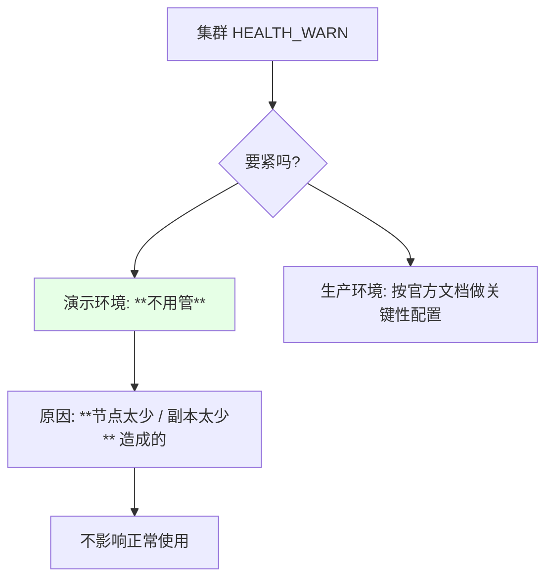

> 课程原话：**「我们通过 Pod 已经看到集群被创建成功了，但是 health 是警告，这个不用管，因为可能是我们节点太少，或者是副本太少造成的，不影响我们使用」**。

## 生产环境 mon 的两个建议

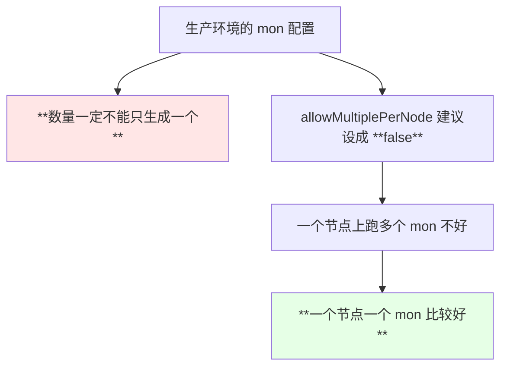

| 项 | 演示 | 生产建议 |
| --- | --- | --- |
| `mon.count` | 1 | **3（奇数），不能只有 1 个** |
| `mon.allowMultiplePerNode` | false | **false**（一节点一个 mon 更好） |

> 课程明确：**「特别这个 mon 这个数啊，一定不能生成一个」**。

## 新 StorageClass 与之前的区别

```yaml
apiVersion: storage.k8s.io/v1
kind: StorageClass
metadata:
  name: rook-ceph-block-test
provisioner: rook-ceph.rbd.csi.ceph.com
allowVolumeExpansion: true          # ← **允许对该 SC 生成的 PVC 做扩容**
reclaimPolicy: Delete
parameters:
  clusterID: rook-ceph
  pool: ceph-block-pool-test
  imageFormat: "2"
  imageFeatures: layering
  fstype: xfs
  csi.storage.k8s.io/provisioner-secret-name: rook-csi-rbd-provisioner
  csi.storage.k8s.io/provisioner-secret-namespace: rook-ceph
  csi.storage.k8s.io/node-stage-secret-name: rook-csi-rbd-node
  csi.storage.k8s.io/node-stage-secret-namespace: rook-ceph
```

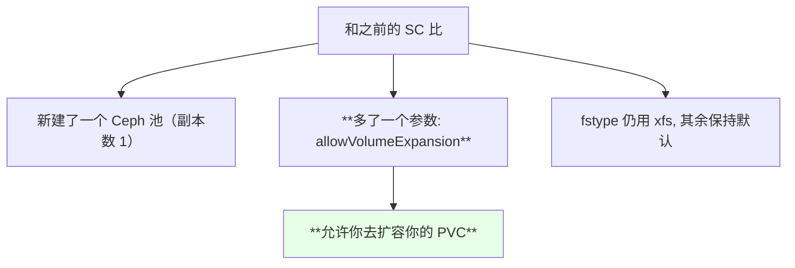

| 项 | 说明 |
| --- | --- |
| 池 | 新建的，**副本数 1**（测试环境） |
| **`allowVolumeExpansion`** | **本节的核心开关** |
| `fstype` | **xfs** |
| 其余 | 默认即可，不用改 |

## allowVolumeExpansion：允许扩容的开关

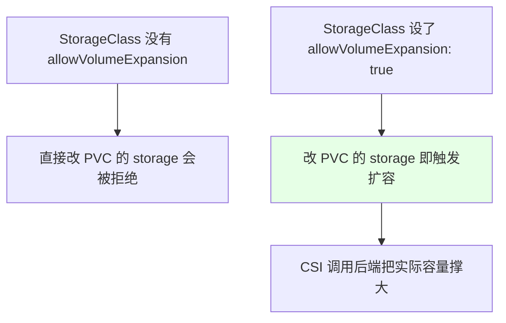

> 课程点明：**「这边加了一个什么参数呢？再来一个这个参数，这个参数呢就是允许你去扩容你的 PVC」**。

## 建 PVC 并确认绑定

```yaml
apiVersion: v1
kind: PersistentVolumeClaim
metadata:
  name: rbd-pvc-test
  namespace: default
spec:
  accessModes:
  - ReadWriteOnce
  resources:
    requests:
      storage: 1Gi
  storageClassName: rook-ceph-block-test
```

```bash
kubectl get pvc -n default
# NAME            STATUS   VOLUME    CAPACITY
# rbd-pvc-test    Bound    pvc-...   1Gi
kubectl get pv
```

> 注意点仍是老三样：**storageClassName 要和 SC 的名字一致**；演示在 `default` namespace 里创建，所以不用额外指定 `-n`。

## 扩容第一步：edit PVC 改 storage

```bash
kubectl edit pvc rbd-pvc-test
# 把 resources.requests.storage: 1Gi 改成 2Gi
```

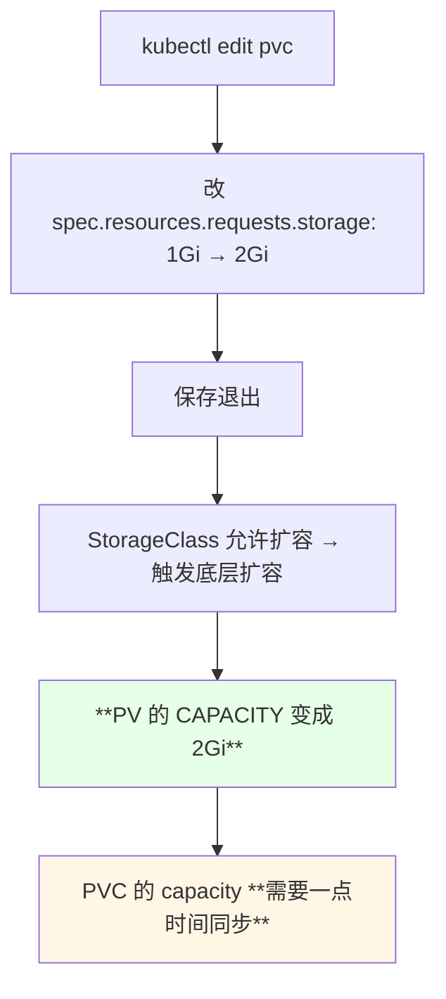

> 课程现场观察：**「现在应该还没有改成功，它是需要时间的……你看这个 PV 呢已经变成 2Gi 了，刚才是一 Gi；但是 PVC 的 capacity 这个东西它还是以前的，因为这个是需要时间的，可能过一段时间之后它才能变成 2Gi」**。

| 对象 | 变化速度 |
| --- | --- |
| **PV 的 CAPACITY** | 较快就变成新值 |
| **PVC 的 capacity** | **略滞后，需要同步时间** |

## PV 先变、PVC 后同步

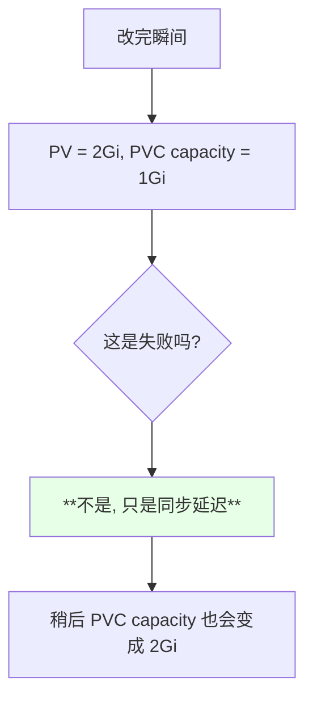

> 看到这个「不一致」不要慌，**等一会儿即可**；如果长时间没同步，再去 `describe pvc` 看 Events。

## 起一个测试 Pod 验证

```yaml
apiVersion: v1
kind: Pod
metadata:
  name: rbd-pod-test
spec:
  containers:
  - name: nginx
    image: nginx:1.15.2
    imagePullPolicy: IfNotPresent     # 避免拉不到镜像
    volumeMounts:
    - name: data
      mountPath: /mnt
  volumes:
  - name: data
    persistentVolumeClaim:
      claimName: rbd-pvc-test         # ← 换成自己的 PVC 名
```

```bash
kubectl exec -it rbd-pod-test -- df -h | grep mnt
# 已经是 2Gi 了
kubectl exec -it rbd-pod-test -- touch /mnt/testfile
```

```text
验证结果:

df -h 里看到挂载点容量 = **2Gi**   ← 扩容真的生效了
在 /mnt 下 touch 文件也能正常写
```

> 作者提醒：测试 Pod 的 yaml 里要改两处 —— **镜像拉取策略**（改成 `IfNotPresent`，否则演示环境拉不动）和 **PVC 名称**（换成自己创建的那一个）。

## 挂载中再扩一次：在线扩容实测

第一次扩容时 PVC 还没被挂载；现在它被 Pod 用着了，**再扩一次看看**：

```bash
kubectl edit pvc rbd-pvc-test
# storage: 2Gi → 3Gi
kubectl get pvc,pv -n default
kubectl exec -it rbd-pod-test -- df -h | grep mnt
```

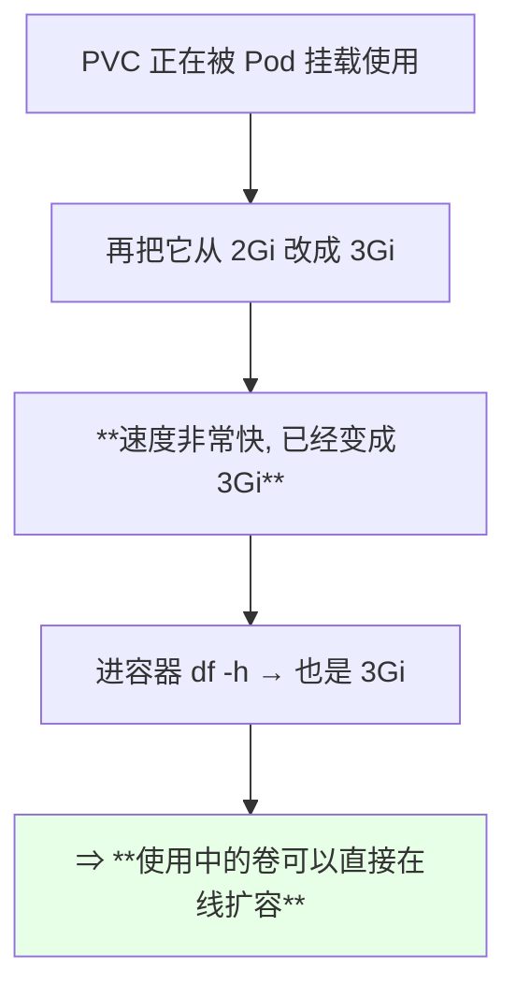

> 课程现场：**「我们现在试一下，就是在线扩 —— 这个 PVC 正在被使用，我们扩容下看能不能成功……可以看到这个速度还是非常快的，已经变成三个 G 了」**，进容器确认也确实生效。

## 在线扩容不需要额外开 gate

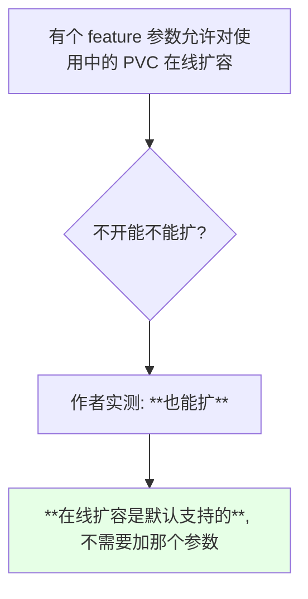

> 课程原话：**「我记得这个是能直接在线改的，不需要看那个参数……之前好像测试过，在我们那个集群里面测试过……所以说在线扩容是默认支持，你不需要加那个参数」**。

## 后端存储的支持决定了能不能扩

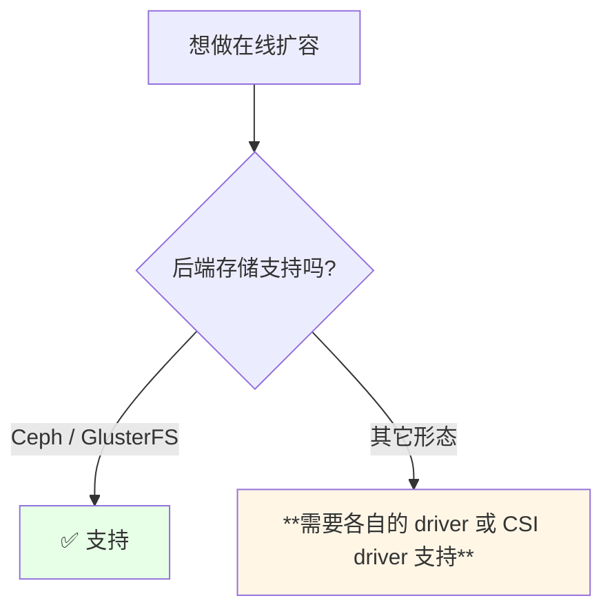

| 后端 | 支持情况 |
| --- | --- |
| **Ceph** | ✅ 支持 |
| **GlusterFS** | ✅ 支持 |
| 其它 | 看 driver / CSI 实现 |

生产选型的现实建议：

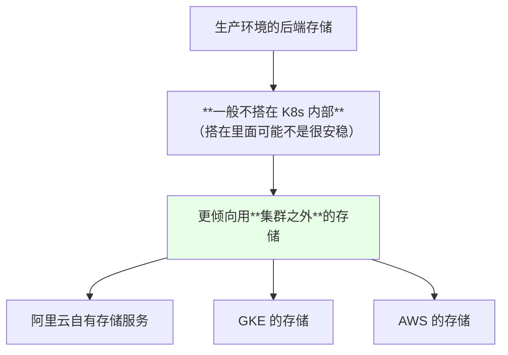

> 课程态度：**「生产环境这个稳定性还是要求比较高的，一般生产环境这个后端存储不需要不是搭在 K8s 里面的，搭在 K8s 内部的可能不是很安稳，一般是在集群之外的」**。

## 按需申请、慢慢扩容

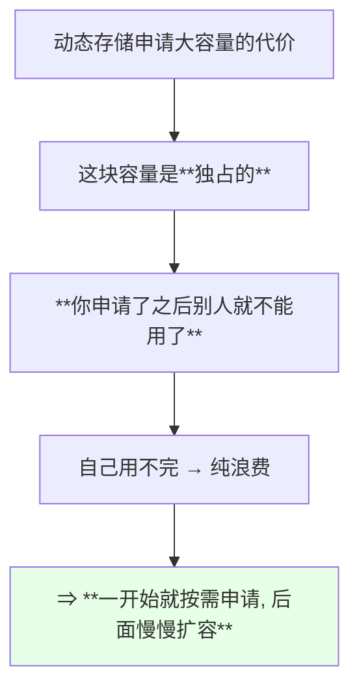

> 课程结语：**「你们申请动态存储的时候，不可能一下子就申请个几百个 G，因为你不用的话可能就浪费了，这个就相当于独占的；你申请了之后别人就不能用了。所以一开始就按需求去申请，然后后来慢慢去扩容」**。

## API 速览

| 能力 | 做法 | 关键点 |
| --- | --- | --- |
| 开扩容开关 | StorageClass 上加 `allowVolumeExpansion: true` | **没有它改 PVC 会被拒** |
| 扩容操作 | `kubectl edit pvc <PVC>` 改 `storage` | 无需重建 PVC / Pod |
| 观察 PV | `kubectl get pv` | PV 的 CAPACITY **先变** |
| 观察 PVC | `kubectl get pvc -n <NS>` | capacity **略有滞后** |
| 容器内验证 | `kubectl exec -it <POD> -- df -h \| grep <挂载点>` | 最终判据 |
| 挂使用中扩容 | 同样 `edit pvc` 改大 | **实测可行，默认支持** |
| 排障 | `kubectl describe pvc <PVC>` | 看 Events |
| 看集群健康 | toolbox 里 `ceph status` | HEALTH_WARN 在演示环境正常 |

字段速查：

| 字段 | 作用 |
| --- | --- |
| `StorageClass.allowVolumeExpansion` | **允许对该 SC 产生的 PVC 做扩容** |
| `PVC.spec.resources.requests.storage` | 期望容量，**改它即触发扩容** |
| `StorageClass.reclaimPolicy` | Delete（动态存储） |
| `CephCluster.mon.count` | **生产不能只设 1** |
| `CephCluster.mon.allowMultiplePerNode` | 建议 `false` |
| `parameters.fstype` | xfs |

## Demo 示例

```bash
# 1. 建一个带 allowVolumeExpansion 的 StorageClass
kubectl apply -f block-sc-expand.yaml
kubectl get sc

# 2. 建 PVC（注意 storageClassName 与 SC 名字一致）
NS=default
kubectl apply -f pvc-expand.yaml -n "$NS"
kubectl get pvc -n "$NS"
kubectl get pv

# 3. 第一次扩容: 1Gi → 2Gi（此时还没被挂载）
kubectl edit pvc rbd-pvc-test -n "$NS"
#   storage: 2Gi
kubectl get pvc,pv -n "$NS"
#   PV 的 CAPACITY 很快变 2Gi, PVC 的 capacity 稍后才同步

# 4. 起一个测试 Pod 挂载它并验证
kubectl apply -f pod-pvc-test.yaml
kubectl exec -it rbd-pod-test -- df -h | grep mnt
kubectl exec -it rbd-pod-test -- touch /mnt/testfile

# 5. 第二次扩容: 2Gi → 3Gi（**此时 PVC 正在被挂载使用**）
kubectl edit pvc rbd-pvc-test -n "$NS"
#   storage: 3Gi
kubectl get pvc,pv -n "$NS"
kubectl exec -it rbd-pod-test -- df -h | grep mnt
#   容器里也应看到 3Gi

# 6. 万一没同步, 看事件
kubectl describe pvc rbd-pvc-test -n "$NS" | tail -20

# 7. 清理: 先删 Pod 再删 PVC
kubectl delete pod rbd-pod-test
kubectl delete pvc rbd-pvc-test -n "$NS"
kubectl get pv
```

```yaml
# block-sc-expand.yaml —— 多了 allowVolumeExpansion 的那份 StorageClass
apiVersion: storage.k8s.io/v1
kind: StorageClass
metadata:
  name: rook-ceph-block-test
provisioner: rook-ceph.rbd.csi.ceph.com
allowVolumeExpansion: true        # ← 允许扩容的关键开关
reclaimPolicy: Delete
parameters:
  clusterID: rook-ceph
  pool: ceph-block-pool-test
  imageFormat: "2"
  imageFeatures: layering
  fstype: xfs
  csi.storage.k8s.io/provisioner-secret-name: rook-csi-rbd-provisioner
  csi.storage.k8s.io/provisioner-secret-namespace: rook-ceph
  csi.storage.k8s.io/node-stage-secret-name: rook-csi-rbd-node
  csi.storage.k8s.io/node-stage-secret-namespace: rook-ceph
```

```yaml
# pvc-expand.yaml —— 先按 1Gi 申请
apiVersion: v1
kind: PersistentVolumeClaim
metadata:
  name: rbd-pvc-test
  namespace: default
spec:
  accessModes:
  - ReadWriteOnce
  resources:
    requests:
      storage: 1Gi
  storageClassName: rook-ceph-block-test
```

```yaml
# pod-pvc-test.yaml —— 挂载后用来验证容量
apiVersion: v1
kind: Pod
metadata:
  name: rbd-pod-test
spec:
  containers:
  - name: nginx
    image: nginx:1.15.2
    imagePullPolicy: IfNotPresent
    volumeMounts:
    - name: data
      mountPath: /mnt
  volumes:
  - name: data
    persistentVolumeClaim:
      claimName: rbd-pvc-test
```

```text
扩容的三段时间:

时刻（按发生顺序）
├── 改之前              PV 1Gi   PVC 1Gi   容器 df 1Gi
├── 刚改成 2Gi          PV 2Gi（**先变**）  PVC 1Gi（**滞后**）  容器未挂载
├── 同步完成后          PV 2Gi   PVC 2Gi   容器 df 2Gi
└── 使用中改成 3Gi      PV 3Gi   PVC 3Gi（很快）  容器 df 3Gi
```

### 总结

- **演示环境的 `HEALTH_WARN` 不用紧张** —— 通常是**节点太少 / 副本太少**造成的；但**生产环境 `mon.count` 一定不能只设 1**，`allowMultiplePerNode` 也建议设成 `false`（一个节点一个 mon 更好）；
- **能扩容的前提是 StorageClass 上加了 `allowVolumeExpansion`** —— 这是本次配置比之前多出来的关键参数；
- **操作只有一条：`kubectl edit pvc <PVC>` 把 `resources.requests.storage` 改大**，不需要重建 PVC、不需要重建 Pod；
- **PV 的 CAPACITY 会先变，PVC 的 capacity 略有滞后** —— 这是同步延迟，**不是失败**，长时间不同步再去看 Events；
- **挂载中的 PVC 也能在线扩容**：作者实测把 2Gi 改成 3Gi 后容器里立刻看到 3Gi，**在线扩容是默认支持的，不需要额外开那个 feature 参数**；
- **能不能扩取决于后端存储**：Ceph / GlusterFS 都支持，其它形态要看各自的 driver；生产建议**后端存储不要搭在 K8s 内部**，用集群之外的云厂商存储更安稳；
- 最后回到容量观：**动态存储申请的容量是独占的，不用就浪费**，所以**按需申请 + 后续慢慢扩容**才是正确姿势。

