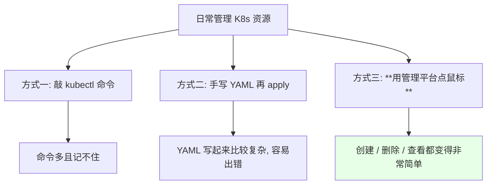
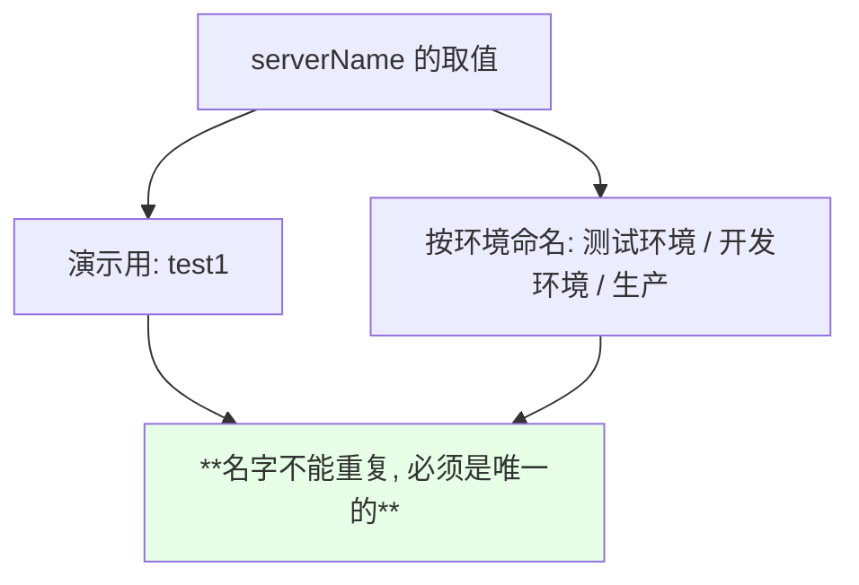
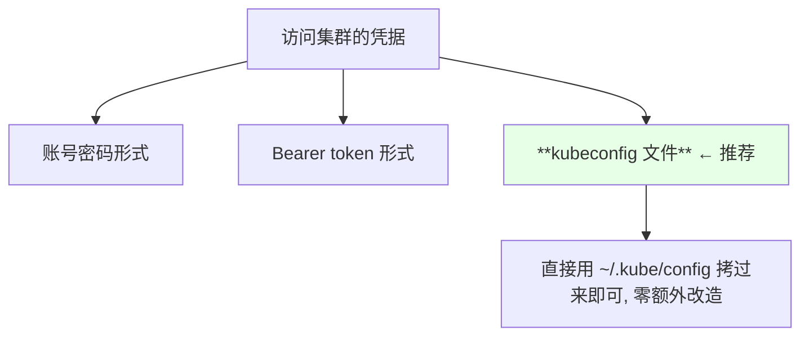
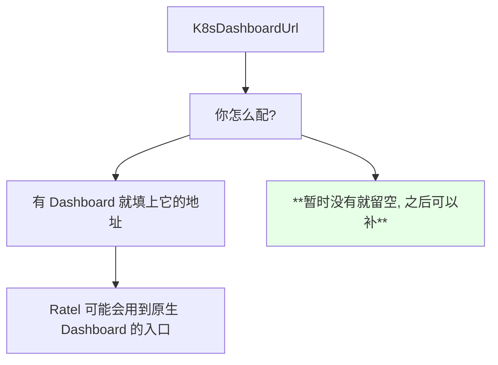
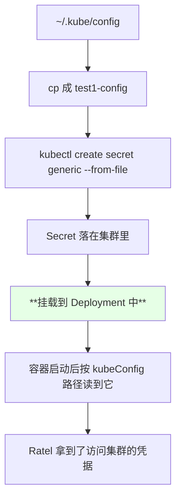
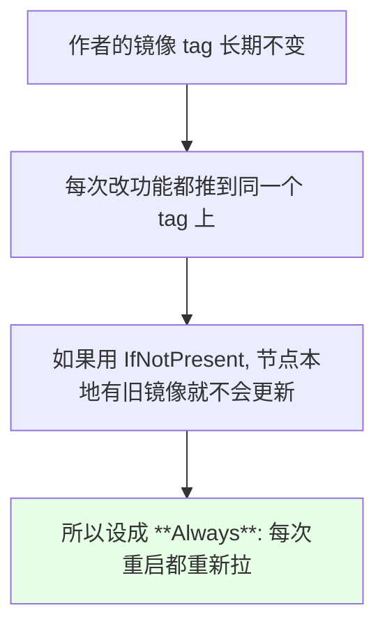
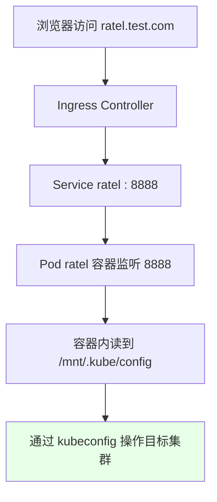
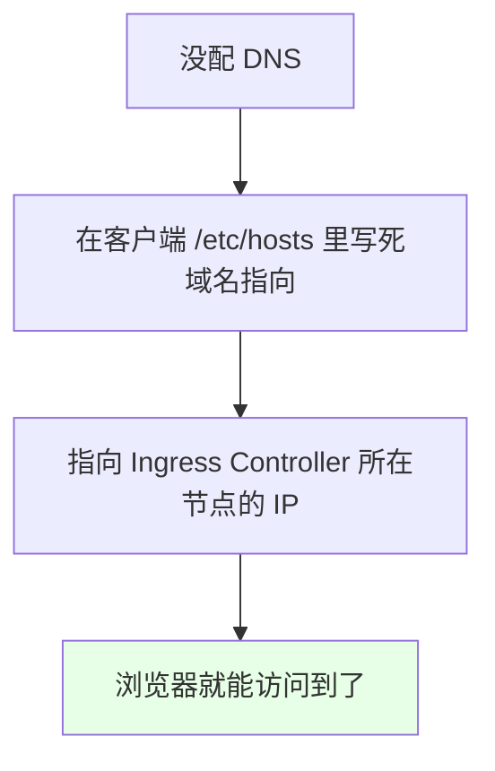
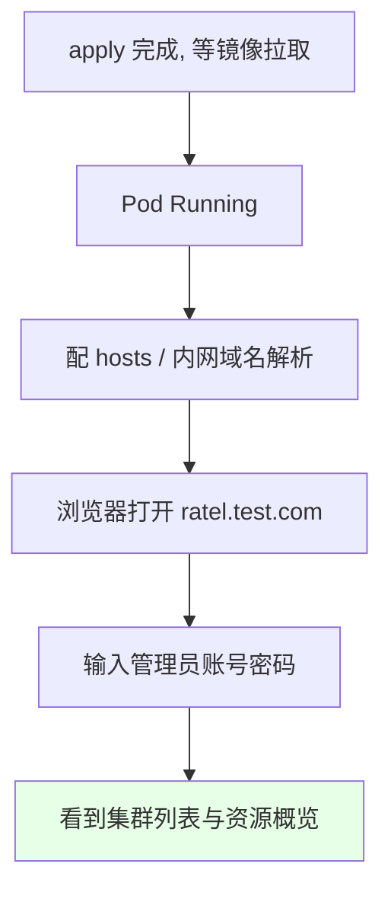

# Kubernetes 集群部署: 安装一键式 K8s 资源平台 Ratel 到集群（kubeconfig 挂 Secret、8888 端口与 Ingress 暴露）

概念篇讲完之后，这一章进入实战 —— **往集群里部署中间件**。开篇先装一个好用的东西：**作者自己开发的 Kubernetes 管理平台 Ratel**。有了它，创建 / 删除 / 管理资源基本点鼠标就能完成，不用敲一大堆 `kubectl`、也不用手写那复杂的 YAML。

结论先摆：

1. **安装就是一个 YAML 文件**，核心动作只有三步：**写集群配置 → 把 kubeconfig 存成 Secret → 起 Deployment + Service + Ingress**；
2. **集群名字必须唯一不可重复**，访问集群的凭据支持三种：**账号密码、Bearer token、kubeconfig 文件**（推荐 kubeconfig）；
3. **Secret 会被挂载到 Deployment 里**，容器启动后就能读到集群配置，这是整个安装的关键；
4. **服务端口是 8888**，对外用 Ingress 暴露（演示环境没有 DNS 就改 hosts，`ratel.test.com`）；
5. **多个资源写在同一份文件里，用 `---` 分隔**；
6. 作者的 `imagePullPolicy` 设成了 `Always`（每次更新功能都会推同一个镜像 tag），自建镜像时按需改成 `IfNotPresent`。

## 纲要

- 为什么要先装一个管理平台
- 这一章要部署的东西
- 安装前置：一个目录 + 一份集群配置
- 集群名：唯一不可重复
- 三种凭据方式该选哪个
- Dashboard 地址是预留参数
- 把 kubeconfig 存成 Secret
- Secret 挂进 Deployment 的原理
- imagePullPolicy 为什么要 Always
- 管理员账号与 8888 端口
- Service 与 Ingress
- 一个文件里放多个资源
- 没有 DNS 时用 hosts 兜底
- 装完能看到什么

## 为什么要先装一个管理平台



> Ratel 是课程作者自己开发、**当时还在开发中**的项目：有些功能没实现，但**一般的工作场景都能用**。这不影响我们理解它的安装套路 —— **「用 Secret 挂载集群凭据」这个思路是非常通用的**。

## 这一章要部署的东西

```text
本章实战清单（会随着课程推进继续补充）:

中间件类
├── Rook / Ceph        ← **云原生存储, 专门为 K8s 而设计**
├── Redis
├── RabbitMQ
└── Kafka / ZooKeeper

工具类
└── Ratel              ← K8s 资源管理平台（本篇）
```

> 作者原本打算讲 GlusterFS 或单独讲 Ceph，最后还是选了 **Rook 这种原生存储** —— 「这个东西其实也挺好用的」。Redis / RabbitMQ / Kafka / ZooKeeper 在 K8s 里同样用得比较多，后面也会讲怎么用。

## 安装前置：一个目录 + 一份集群配置

```bash
mkdir ratel
cd ratel
vi server.yaml
```

```text
安装动作分解:

1. mkdir ratel && cd ratel          建一个工作目录
2. vi server.yaml                   写集群配置
3. cp ~/.kube/config <name>         拷 kubeconfig
4. kubectl create secret ...        把 kubeconfig 存成 Secret
5. kubectl apply -f server-ratel.yaml  起 Deployment + Service + Ingress
```

集群配置文件的样子（示意）：

```yaml
# server.yaml —— 集群列表
  servers:
  - serverName: test1
    serverType: ""
    kubeConfig: /mnt/.kube/config
    K8sDashboardUrl: ""
```

```text
server.yaml
└── servers[]                 ← 集群列表, 可以配多个
    ├── serverName            ← **集群名称, 不能重复, 必须唯一**
    ├── kubeConfig            ← 挂载后进容器读到 kubeconfig 的路径
    └── K8sDashboardUrl       ← **预留参数, 暂时用不到**
```

## 集群名：唯一不可重复



| 字段 | 举例 | 约束 |
| --- | --- | --- |
| `serverName` | `test1` | **唯一、不可重复** |
| 可以配几个集群 | 多个 | 之后还能动态追加 |

## 三种凭据方式该选哪个



| 方式 | 状态 | 说明 |
| --- | --- | --- |
| kubeconfig 文件 | **推荐** | 把 `~/.kube/config` 拷进去就行 |
| Bearer token | **已支持**（文档曾标注不支持） | 后来补上的能力 |
| 账号密码 | 支持 | 看集群自身的认证配置 |

> 课程原话：**「这个 token 当时是不支持的，现在也支持了」** —— 文档滞后于实现，遇到这种情况以实际功能为准。

## Dashboard 地址是预留参数



> 课程说明：**「因为这个地址现在我们还没有，没有的话我们等下次再配也可以……这个参数现在还没有用到，只是预留的一个参数」**。

## 把 kubeconfig 存成 Secret

```bash
cp ~/.kube/config test1-config
kubectl create secret generic rats-config \
  --from-file=test1-config=./test1-config
```

```text
关键点:

1. 拷过来的文件名要和 server.yaml 里写的保持一致
   （文件名相同才能在容器里对应上）
2. 可以只放一个集群, 也可以一次放多个
3. 支持动态追加: 之后加集群不用重装, 再加一个即可
```



## Secret 挂进 Deployment 的原理

```yaml
    spec:
      volumes:
      - name: rats-config
        secret:
          secretName: rats-config
      containers:
      - name: ratel
        image: registry.cn-beijing.aliyuncs.com/dotbalo/ratel-client:latest
        volumeMounts:
        - name: rats-config
          mountPath: /mnt/.kube
          readOnly: true
        ports:
        - containerPort: 8888
```

```text
挂载关系:

Secret rats-config
   ↓ volumes[] 声明
Deployment 的 Pod template
   ↓ volumeMounts[] 挂到 /mnt/.kube
容器内 /mnt/.kube/config   ← server.yaml 里 kubeConfig 指向这里
```

> 这是「把敏感凭据送进容器」的标准姿势：**凭据不进镜像、不进环境变量，而是以 Secret 卷的形式挂载**。

| 环节 | 做法 |
| --- | --- |
| 凭据存放 | `kubectl create secret generic --from-file` |
| 声明卷 | Pod spec 的 `volumes[].secret.secretName` |
| 挂载点 | `volumeMounts[].mountPath: /mnt/.kube` |
| 配置里引用 | `server.yaml` 的 `kubeConfig` 字段指向该路径 |

## imagePullPolicy 为什么要 Always

```yaml
        imagePullPolicy: Always
```



> 这是**开发期的特殊用法**。生产环境一般推荐锁定具体版本 tag + `IfNotPresent`，避免镜像变动导致的不可预期。

## 管理员账号与 8888 端口

```yaml
        env:
        - name: AUTHOR
          value: "admin"
        - name: AUTHOR_PASSWORD
          value: "******"
```

```text
两个启动参数:

管理员账号     演示用的自定义账号
管理员密码     演示环境设得比较简单（图省事）
               **生产环境一定要设复杂密码**

服务监听端口: **8888**
```

## Service 与 Ingress

```yaml
---
apiVersion: v1
kind: Service
metadata:
  name: ratel
  labels:
    app: ratel
spec:
  ports:
  - name: ratel
    port: 8888
    targetPort: 8888
  selector:
    app: ratel
---
apiVersion: networking.k8s.io/v1
kind: Ingress
metadata:
  name: ratel-ingress
spec:
  rules:
  - host: ratel.test.com
    http:
      paths:
      - path: /
        pathType: Prefix
        backend:
          service:
            name: ratel
            port:
              number: 8888
```



## 一个文件里放多个资源

```text
单文件多资源的写法:

Secret / Deployment / Service / Ingress 全部写进同一份 YAML
   资源与资源之间用 **三个横线 --- 分隔**
   → kubectl apply -f ratel-all.yaml 一次搞定
```

| 资源 | 作用 |
| --- | --- |
| Secret | 存 kubeconfig |
| Deployment | 跑 Ratel 本体，挂 Secret，监听 8888 |
| Service | 暴露 8888 |
| Ingress | 用域名对外暴露 |

## 没有 DNS 时用 hosts 兜底

演示环境没有域名解析，配 hosts 即可：

```bash
sudo vi /etc/hosts
# <INGRESS节点IP>  ratel.test.com
```



> 生产环境自然是走**公司内网域名**；课程也提醒这种管理平台**不要放公网上**。

## 装完能看到什么

```text
登录后首页大致能看到的东西:

集群概览
├── Node 节点数量
├── Service 数量
├── Pod 数量
└── 各类资源数量

左侧 / 周边菜单
├── 集群列表              ← 点进去读到该集群的配置信息
├── 节点操作              ← 之前讲的「暂停调度 / 开启调试 / 去除」等
├── Namespace / Deployment / StatefulSet / DaemonSet / Ingress 的增删改查
└── RBAC 一键配置（后面单独一节讲）
```



> 页面模板是作者从网上找的，重点是功能而不是前端；**部分菜单当时还没实现** —— 那些空着的地方按「未实现」理解，别当成 bug。

## API 速览

| 能力 | 做法 | 关键点 |
| --- | --- | --- |
| 建 Secret | `kubectl create secret generic <NAME> --from-file=<KEY>=<FILE>` | key 是 config 文件的文件名 |
| 看 Secret | `kubectl get secret <NAME> -o yaml` | 内容是 base64 |
| 一个文件多资源 | 资源之间用 `---` 分隔 | apply 一次全建 |
| 看 Pod 起来没有 | `kubectl get pods -w` | 首次要拉镜像，稍慢 |
| 看拉取/报错原因 | `kubectl describe pod <POD>` | 镜像、挂载失败都在这里 |
| 看 Service | `kubectl get svc` | ClusterIP:8888 |
| 看 Ingress | `kubectl get ingress` | 关注 host 和后端端口 |
| 改镜像策略 | 改 Deployment 后 apply | 开发期 Always、生产 IfNotPresent |
| 本地解析兜底 | 编辑 `/etc/hosts` | 只用于演示环境 |

字段速查：

| 字段 | 作用 |
| --- | --- |
| `serverName` | 集群显示名，**唯一不可重复** |
| `kubeConfig` | 容器内 kubeconfig 的路径 |
| `K8sDashboardUrl` | **预留参数**，暂不用 |
| `spec.volumes[].secret.secretName` | 引用哪个 Secret |
| `spec.containers[].volumeMounts[].mountPath` | 挂到容器哪个目录 |
| `imagePullPolicy` | `Always` / `IfNotPresent` |
| Service `port` / `targetPort` | 都是 8888 |
| Ingress `rules[].host` | 对外域名 |

## Demo 示例

```bash
# 1. 准备目录
mkdir -p ratel && cd ratel

# 2. 拷 kubeconfig（文件名要和 server.yaml 里写的一致）
cp ~/.kube/config test1-config

# 3. 存成 Secret
kubectl create secret generic rats-config \
  --from-file=test1-config=./test1-config
kubectl get secret rats-config

# 4. 把 Secret / Deployment / Service / Ingress 写进同一份文件（见 ratel.yaml）
kubectl apply -f ratel.yaml

# 5. 等镜像拉取, 看状态
kubectl get pods -w
kubectl get svc ratel
kubectl get ingress ratel-ingress

# 6. 起不来就 describe
NS=default
POD=$(kubectl get pods -n "$NS" -l app=ratel -o jsonpath='{.items[0].metadata.name}')
kubectl describe pod "$POD" -n "$NS"

# 7. 没有 DNS 时配 hosts（把 IP 换成 Ingress Controller 所在节点）
#    <INGRESS_IP> ratel.test.com
INGRESS_IP=$(kubectl get pods -A -l app=ingress-nginx -o jsonpath='{.items[0].status.hostIP}')
echo "$INGRESS_IP ratel.test.com"
```

```yaml
# server.yaml —— Ratel 的集群配置（示意）
servers:
- serverName: test1
  serverType: ""
  kubeConfig: /mnt/.kube/config
  K8sDashboardUrl: ""
```

```yaml
# ratel.yaml —— Secret 挂载 + Deployment + Service + Ingress 一次搞定
apiVersion: apps/v1
kind: Deployment
metadata:
  name: ratel
  labels:
    app: ratel
spec:
  replicas: 1
  selector:
    matchLabels:
      app: ratel
  template:
    metadata:
      labels:
        app: ratel
    spec:
      volumes:
      - name: rats-config
        secret:
          secretName: rats-config
      containers:
      - name: ratel
        imagePullPolicy: Always
        image: registry.cn-beijing.aliyuncs.com/dotbalo/ratel-client:latest
        volumeMounts:
        - name: rats-config
          mountPath: /mnt/.kube
          readOnly: true
        ports:
        - containerPort: 8888
          name: ratel
        env:
        - name: AUTHOR
          value: admin
        - name: AUTHOR_PASSWORD
          value: change-me-in-prod
---
apiVersion: v1
kind: Service
metadata:
  name: ratel
  labels:
    app: ratel
spec:
  ports:
  - name: ratel
    port: 8888
    targetPort: 8888
  selector:
    app: ratel
---
apiVersion: networking.k8s.io/v1
kind: Ingress
metadata:
  name: ratel-ingress
spec:
  rules:
  - host: ratel.test.com
    http:
      paths:
      - path: /
        pathType: Prefix
        backend:
          service:
            name: ratel
            port:
              number: 8888
```

```text
凭据 -> 容器 的完整链路:

~/.kube/config
   │  cp
   ▼
test1-config
   │  kubectl create secret --from-file
   ▼
Secret rats-config
   │  volumes[].secret.secretName
   ▼
Pod
   │  volumeMounts[].mountPath = /mnt/.kube
   ▼
容器内 /mnt/.kube/test1-config
   ▲
   └── server.yaml 的 kubeConfig 字段指向这里
```

### 总结

- **Ratel 是课程作者自己开发的 K8s 资源管理平台**，把「敲 kubectl / 手写 YAML」换成了页面操作；当时仍在开发中，**没实现的功能就按未开发处理**，别当成 bug；
- **安装本质就是一个 YAML 文件**，核心三步：**写 `server.yaml`（集群列表）→ 把 kubeconfig 存成 Secret → 起 Deployment / Service / Ingress**；
- **`serverName` 必须唯一**（演示里用 `test1`），集群可以配多个、之后还能动态追加；`K8sDashboardUrl` 是**预留参数**，暂时没有也能跑；
- **凭据由 Secret 卷挂载进容器**（`volumes[].secret.secretName` + `volumeMounts[].mountPath`），容器按 `kubeConfig` 字段指向的路径读取 —— 这是把敏感凭据送进容器的标准做法；
- **访问集群支持账号密码 / Bearer token / kubeconfig 三种**，推荐 kubeconfig（token 支持是后来补上的，文档当时还没更新）；
- **服务监听 8888**，对外靠 Ingress 暴露、演示环境用 hosts 兜底（`ratel.test.com`）；作者的镜像用 `Always` 拉取策略是因为**每次改功能都推同一个 tag**，生产应该锁版本 + `IfNotPresent`。

