# Kubernetes 集群部署: PVC 快照和回滚（VolumeSnapshotClass 的用法、xfs 踩坑与换成 ext4 后的完整验证）

这一節把 CSI 的另一张王牌用起来：**PVC 快照 + 回滚**。流程本身不复杂（建 class → 对 PVC 打快照 → 从快照建 PVC），但在 xfs 上当场翻车，**换成 ext4 之后才成功** —— 这个坑值得完整记录。

结论先摆：

1. **`VolumeSnapshotClass` 之于快照，正如 `StorageClass` 之于 PVC** —— 两者是同一种设计思路，**也和 StorageClass 一样没有 namespace 限制**；
2. **1.18 又按这个套路出了 `IngressClass`**（此前是用 annotation 声明路由），更标准化；但当时**官方维护的 ingress 还不支持 ingressclass**；
3. **创建快照时指定 PVC 作为源**，而**快照本身是 namespace 隔离的** —— PVC 不在 default 就要显式带上 namespace；
4. **回滚的做法是：新建一个 PVC，把 `dataSource` 指向那个快照** —— 它会再去申请一个 PV；
5. **回滚出来的 PVC 容量不能小于快照时的容量**（课程里忘了改，但因为写大了所以成功了）；
6. **xfs 上恢复时报 fs repair 错误** —— 查下来是 **snapshot 相关组件版本要 ≥ 1.2.3 才支持 xfs**，退而求其次换成 **ext4** 就通了；
7. 整套流程强烈建议配合 **toolbox** 观察 Ceph 侧的真实快照对象。

## 纲要

- VolumeSnapshotClass 与 StorageClass 是一回事
- 顺带：1.18 的 IngressClass 也是这个套路
- 快照是 namespace 隔离的
- 第一步：创建 VolumeSnapshotClass
- 第二步：对 PVC 打快照
- 第三步：从快照恢复出一个 PVC
- 回滚的 PVC 容量不能小于快照
- 验证：删掉文件再恢复看看还在不在
- xfs 上的 fs repair 报错
- 根因：版本不够不支持 xfs
- 改用 ext4：再建一个池与 SC
- VolumeSnapshotClass 可以复用
- 换 ext4 后的完整验证
- 经验小结

## VolumeSnapshotClass 与 StorageClass 是一回事

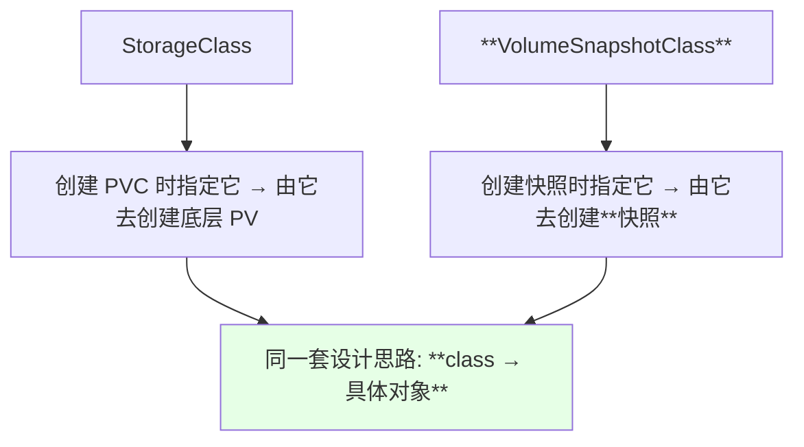

| 对比 | 作用的产出 | 有没有 namespace 限制 |
| --- | --- | --- |
| `StorageClass` | PV | **没有** |
| **`VolumeSnapshotClass`** | 快照 | **没有** |
| PVC | — | **有** |
| **VolumeSnapshot** | — | **有** |

> 课程原话：**「这个 snapshot 呢就是通过这个 snapshotClass 去创建一个快照，它这个功能它是和 storageClass 是一样的」**。

## 顺带：1.18 的 IngressClass 也是这个套路

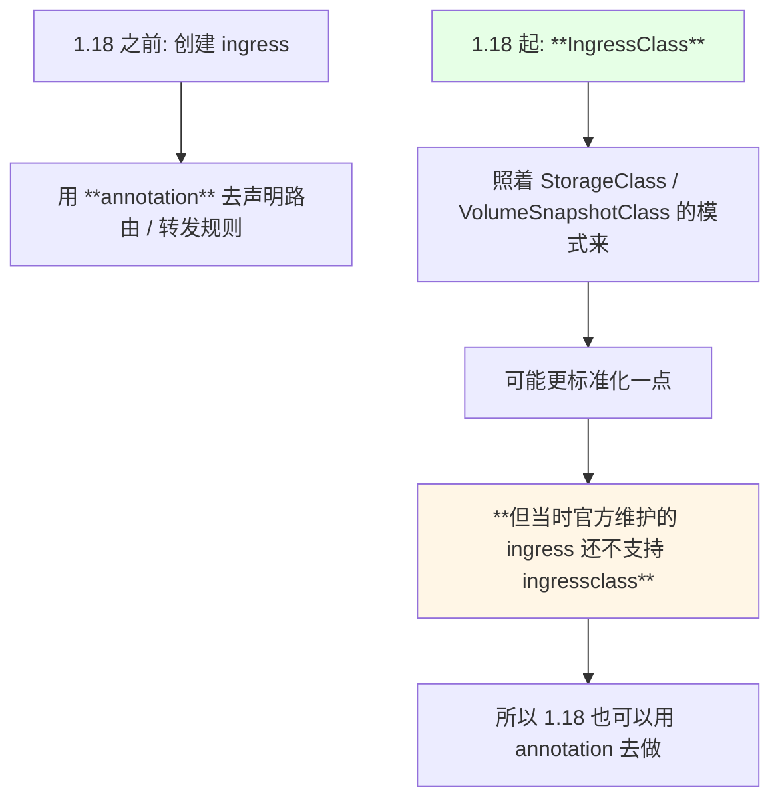

> 课程心态也很务实：**「各有各的好处……1.18 刚出来没几天，到目前为止 K8s 官方维护的 ingress 还不能支持 ingressclass；到后期看一下，如果支持了我们也演示一下，不支持就不演示」**。

## 快照是 namespace 隔离的

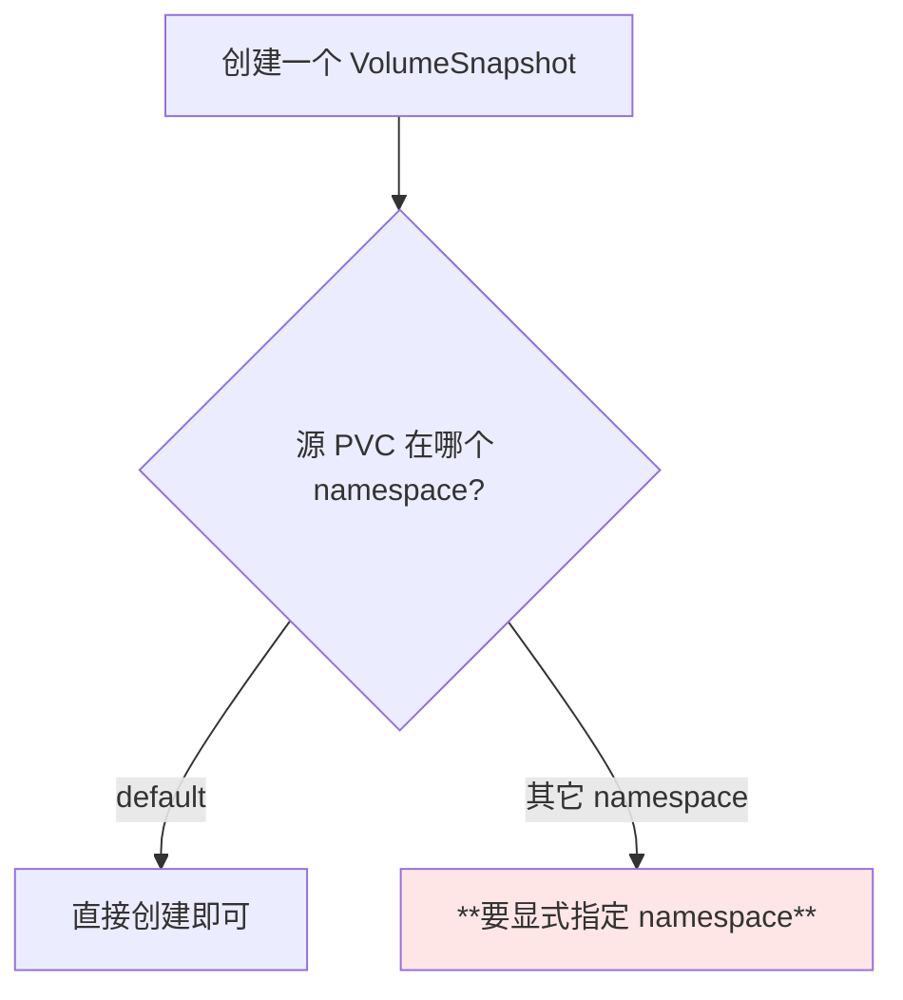

> 课程提醒：**「这个 snapshot 是由 namespace 隔离的，如果你的这 PVC 不在 default 的话，你需要把它加一个 namespace，或者是创建的时候指定一下就可以」**。

## 第一步：创建 VolumeSnapshotClass

```bash
kubectl apply -f volume-snapshot-class.yaml
kubectl get volumesnapshotclass
```

演示里创建出来的对象叫 **`csi-rbdplugin-snapclass`**。

| 项 | 说明 |
| --- | --- |
| 对象类型 | `VolumeSnapshotClass` |
| 集群级与否 | **集群级，没有 namespace 限制** |
| 作用 | 创建快照时被引用的「模板」 |

## 第二步：对 PVC 打快照

```yaml
apiVersion: snapshot.storage.k8s.io/v1alpha1
kind: VolumeSnapshot
metadata:
  name: rbd-pvc-snapshot
  namespace: default
spec:
  snapshotClassName: csi-rbdplugin-snapclass
  source:
    name: rbd-pvc
    kind: PersistentVolumeClaim
```

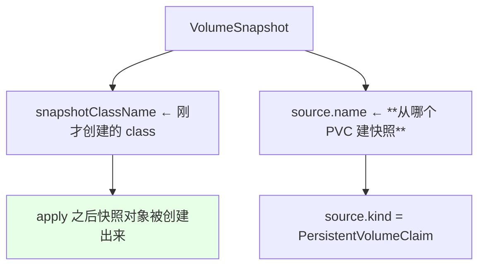

```bash
kubectl apply -f volume-snapshot.yaml
kubectl get volumesnapshot -n default
kubectl describe volumesnapshot rbd-pvc-snapshot -n default
```

> **describe 快照能看到它的详细信息**，其中就包含恢复时需要用到的那份「存储」信息。

## 第三步：从快照恢复出一个 PVC

```yaml
apiVersion: v1
kind: PersistentVolumeClaim
metadata:
  name: rbd-pvc-restore
  namespace: default
spec:
  storageClassName: rook-ceph-block-ext4
  dataSource:
    name: rbd-pvc-snapshot
    kind: VolumeSnapshot
    apiGroup: snapshot.storage.k8s.io
  accessModes:
  - ReadWriteOnce
  resources:
    requests:
      storage: 3Gi
```

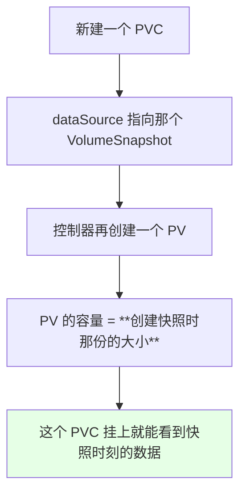

> 课程解释：**「如果要回滚的话，就是需要用到 RBD 的一个存储，就是它会再次创建一个 PVC，这个 PVC 再去申请一个 PV，然后这个 PV 的大小就是 3G，和我们创建快照的时候是一样的」**。

## 回滚的 PVC 容量不能小于快照

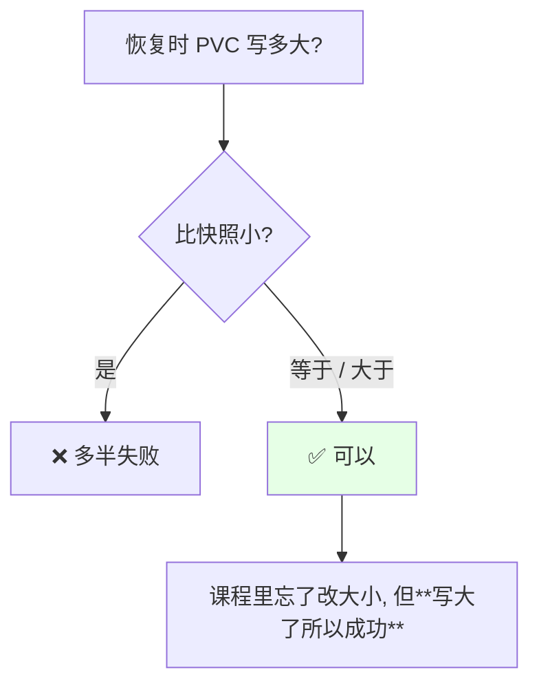

| 情况 | 结果 |
| --- | --- |
| restore 的 PVC < 快照容量 | **失败** |
| restore 的 PVC ≥ 快照容量 | **成功** |

> 作者原话：**「这个大小我们忘了改了，因为它比它大嘛，比它大是可以成功创建的，所以这个无所谓了」** —— 反过来说，**写小就一定会卡住**。

## 验证：删掉文件再恢复看看还在不在

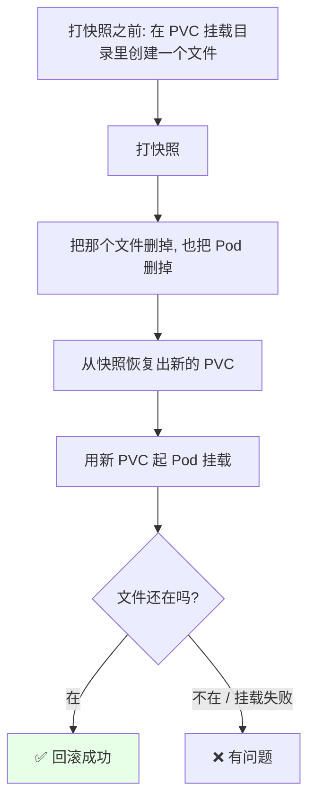

```bash
# 打快照前写在挂载目录里的文件
kubectl exec -it rbd-pod-test -- touch /mnt/before-snapshot

# 打快照之后故意删掉
kubectl exec -it rbd-pod-test -- rm -f /mnt/before-snapshot

# 从快照恢复出 PVC 后重新挂载验证
kubectl exec -it restore-pod -- ls /mnt
```

## xfs 上的 fs repair 报错

第一次挂载恢复出来的 PVC 时**报错了** —— 大意是文件系统需要 repair：

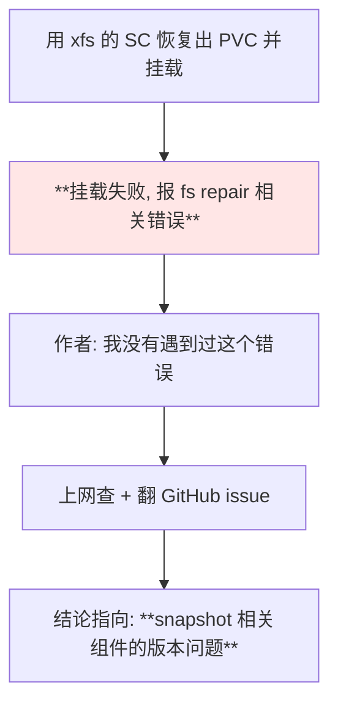

> 课程原话：**「we 从网上查一下，他好像让我重新 repair 一下，有可能是 xfs 的问题……GitHub 上面说好像是版本的问题吧，好像是因为这个 1.2.3 的 snapshot 才支持 xfs」**。

## 根因：版本不够不支持 xfs

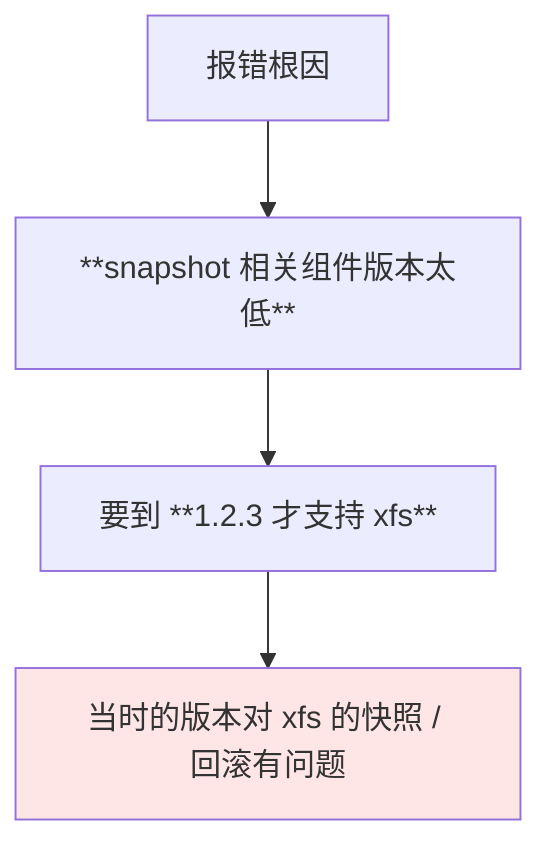

| fstype | 当时的支持情况 |
| --- | --- |
| **xfs** | **有问题**（需要组件 ≥ 1.2.3） |
| **ext4** | **可用** |

> 作者也很坦诚：**「我回头我再排查一下这个问题，后期我再补充一下」** —— 遇到组件版本带出的怪问题，最现实的办法是先换一条能走通的路。

## 改用 ext4：再建一个池与 SC

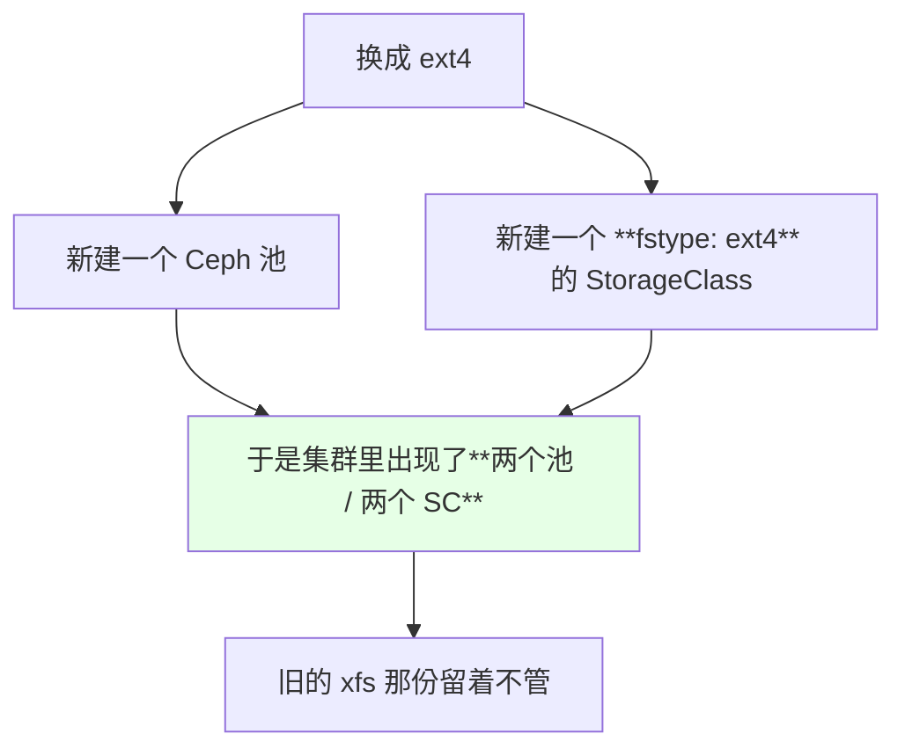

```yaml
apiVersion: storage.k8s.io/v1
kind: StorageClass
metadata:
  name: rook-ceph-block-ext4
provisioner: rook-ceph.rbd.csi.ceph.com
allowVolumeExpansion: true
reclaimPolicy: Delete
parameters:
  clusterID: rook-ceph
  pool: ceph-block-pool-ext4       # ← 新池
  imageFormat: "2"
  imageFeatures: layering
  fstype: ext4                     # ← 换成 ext4
  csi.storage.k8s.io/provisioner-secret-name: rook-csi-rbd-provisioner
  csi.storage.k8s.io/provisioner-secret-namespace: rook-ceph
  csi.storage.k8s.io/node-stage-secret-name: rook-csi-rbd-node
  csi.storage.k8s.io/node-stage-secret-namespace: rook-ceph
```

## VolumeSnapshotClass 可以复用

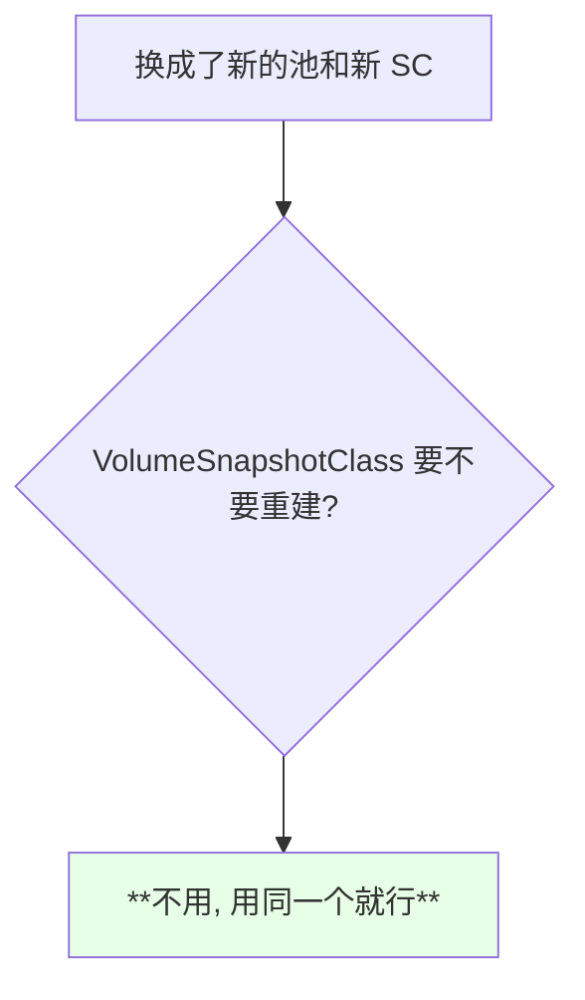

> 课程明确：**「这个 snapshotClass 这个是可以用同一个」** —— class 是描述「怎么打快照」的，与底层池的 fstype 无关。

## 换 ext4 后的完整验证

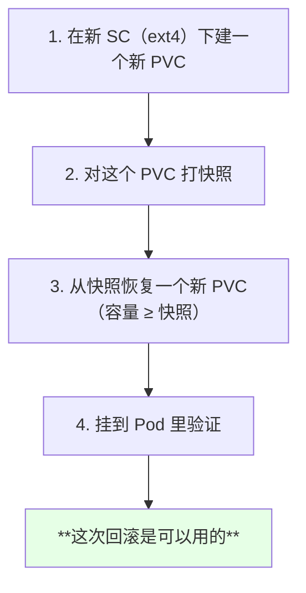

对比两次尝试：

| 尝试 | fstype | 结果 |
| --- | --- | --- |
| 第一次 | **xfs** | ❌ 挂载报 fs repair 错误 |
| 第二次 | **ext4** | ✅ **回滚可用** |

> 课程结论：**「这次我们可以看到，这个回滚是可以用的。刚才那个是因为 snapshot 这个地方版本太低了，应该改成 1.2.3 就可以了」**。

## 经验小结

```text
快照 / 回滚的标准链路:

1. VolumeSnapshotClass
   └── 集群级, 和 SC 同一套路, 可跨池复用
2. VolumeSnapshot
   ├── namespace 级
   └── source 指向 PVC
3. 新建 PVC
   └── dataSource → VolumeSnapshot
4. 挂到 Pod 验证数据

关键约束
├── 快照 namespace 与 PVC 一致
├── 恢复出来的 PVC 容量 **不能小于** 快照容量
├── fstype 要挑组件支持得好的（当时 xfs 需要 >= 1.2.3）
└── VolumeSnapshotClass **可以跨池复用**
```

## API 速览

| 能力 | 做法 | 关键点 |
| --- | --- | --- |
| 建快照 class | `kubectl apply -f snapshot-class.yaml` | 集群级，**无 namespace 限制** |
| 看快照 class | `kubectl get volumesnapshotclass` | — |
| 打快照 | `VolumeSnapshot`，`source` 指向 PVC | **namespace 要与 PVC 一致** |
| 看快照 | `kubectl get volumesnapshot -n <NS>` | — |
| 看快照详情 | `kubectl describe volumesnapshot <NAME> -n <NS>` | 能看到恢复所需的那份存储 |
| 恢复 | 新建 PVC，`dataSource` 指向快照 | **容量 ≥ 快照容量** |
| 建第二个池/SC | 改 `fstype` 即可 | 演示里换成 ext4 |
| Ceph 侧观察 | toolbox 里执行 ceph 命令看快照对象 | 作者建议装一个 |

字段速查：

| 字段 | 作用 |
| --- | --- |
| `VolumeSnapshotClass.snapshotter` | 指定由哪个 CSI 处理快照 |
| `VolumeSnapshot.spec.snapshotClassName` | 用哪个 class 打快照 |
| `VolumeSnapshot.spec.source.name` | **源 PVC 的名字** |
| `VolumeSnapshot.spec.source.kind` | `PersistentVolumeClaim` |
| `PVC.spec.dataSource.name` | 恢复时指向的快照名 |
| `PVC.spec.dataSource.kind` | `VolumeSnapshot` |
| `PVC.spec.dataSource.apiGroup` | `snapshot.storage.k8s.io` |
| `PVC.spec.resources.requests.storage` | **必须 ≥ 快照容量** |

## Demo 示例

```bash
# 1. 创建 VolumeSnapshotClass（集群级, 没有 namespace 限制）
kubectl apply -f volume-snapshot-class.yaml
kubectl get volumesnapshotclass

# 2. 确认源 PVC 存在并且里面有数据
NS=default
kubectl get pvc -n "$NS"
kubectl exec -it rbd-pod-test -- ls /mnt

# 3. 对这个 PVC 打快照
kubectl apply -f volume-snapshot.yaml -n "$NS"
kubectl get volumesnapshot -n "$NS"
kubectl describe volumesnapshot rbd-pvc-snapshot -n "$NS"

# 4. 故意制造「数据丢失」: 删掉文件、删掉 Pod
kubectl exec -it rbd-pod-test -- rm -f /mnt/before-snapshot
kubectl delete pod rbd-pod-test

# 5. 用 ext4 的 SC 新建一个池和一份 SC（xfs 当时要 >= 1.2.3 才支持）
kubectl apply -f ceph-block-pool-ext4.yaml
kubectl apply -f block-sc-ext4.yaml
kubectl get sc

# 6. 从快照恢复出一个 PVC（容量必须 >= 快照容量）
kubectl apply -f pvc-restore.yaml -n "$NS"
kubectl get pvc -n "$NS"
kubectl get pv

# 7. 挂到 Pod 验证文件回来了没有
kubectl apply -f pod-restore.yaml
kubectl exec -it restore-pod -- ls /mnt

# 8. Ceph 侧也可以观察（需要 toolbox）
TOOLS=$(kubectl get pods -n rook-ceph -l app=rook-ceph-tools -o jsonpath='{.items[0].metadata.name}')
kubectl exec -it -n rook-ceph "$TOOLS" -- ceph status
```

```yaml
# volume-snapshot-class.yaml —— 对应 StorageClass 的「快照模板」
apiVersion: snapshot.storage.k8s.io/v1alpha1
kind: VolumeSnapshotClass
metadata:
  name: csi-rbdplugin-snapclass
snapshotter: rook-ceph.rbd.csi.ceph.com
parameters:
  clusterID: rook-ceph
  csi.storage.k8s.io/snapshotter-secret-name: rook-csi-rbd-provisioner
  csi.storage.k8s.io/snapshotter-secret-namespace: rook-ceph
```

```yaml
# volume-snapshot.yaml —— 对指定 PVC 打快照
apiVersion: snapshot.storage.k8s.io/v1alpha1
kind: VolumeSnapshot
metadata:
  name: rbd-pvc-snapshot
  namespace: default
spec:
  snapshotClassName: csi-rbdplugin-snapclass
  source:
    name: rbd-pvc
    kind: PersistentVolumeClaim
```

```yaml
# pvc-restore.yaml —— 从快照恢复出一个 PVC
apiVersion: v1
kind: PersistentVolumeClaim
metadata:
  name: rbd-pvc-restore
  namespace: default
spec:
  storageClassName: rook-ceph-block-ext4
  dataSource:
    name: rbd-pvc-snapshot
    kind: VolumeSnapshot
    apiGroup: snapshot.storage.k8s.io
  accessModes:
  - ReadWriteOnce
  resources:
    requests:
      storage: 3Gi
```

```yaml
# pod-restore.yaml —— 挂载恢复出来的 PVC 验证数据
apiVersion: v1
kind: Pod
metadata:
  name: restore-pod
spec:
  containers:
  - name: nginx
    image: nginx:1.15.2
    imagePullPolicy: IfNotPresent
    volumeMounts:
    - name: restore-data
      mountPath: /mnt
  volumes:
  - name: restore-data
    persistentVolumeClaim:
      claimName: rbd-pvc-restore
```

```text
两次尝试的对照:

fstype   结果                        处理
──────────────────────────────────────────────────────
xfs      挂载报 fs repair 错误        需要 snapshot 组件 >= 1.2.3
ext4     **回滚可用**                 换池 + 换 SC 后重试成功

注意: VolumeSnapshotClass **不需要重建**, 可以直接复用
```

### 总结

- **`VolumeSnapshotClass` 与 `StorageClass` 是同一套设计思路**（class → 具体对象），**同样也是集群级资源、没有 namespace 限制**；1.18 的 `IngressClass` 也是照这个套路加出来的，只是当时官方 ingress 还不支持它；
- **打快照的 `VolumeSnapshot` 则是 namespace 隔离的**，源 PVC 不在 default 就要显式带上 namespace；
- **回滚的做法不是把原 PVC「还原」，而是新建一个 PVC 并把 `dataSource` 指向那个快照**，控制器会再申请一个 PV，**容量和创建快照时那份一致**；
- **恢复出来的 PVC 容量不能小于快照容量**（课程里忘了改大小，但因为写大了反而成功了）；
- **xfs 上第一次恢复直接报 fs repair 错误** —— 查下来是 **snapshot 相关组件需要 ≥ 1.2.3 才支持 xfs**；**换成 ext4（新池 + 新 SC）之后回滚就正常可用了**；
- **换池换 SC 时 `VolumeSnapshotClass` 不需要重建，可以复用**；整套流程建议配合 **toolbox** 在 Ceph 侧看一眼真实的快照对象，验证会更踏实。

