# Kubernetes 集群部署: Rook Ceph 的 xfs_repair 问题修复（复现现场、direct-mount 挂载 PV 与到底该选 xfs 还是 ext4）

上一節遇到「xfs 上从快照恢复出的 PVC 挂不上，报错让你跑 `xfs_repair`」。这一節把问题**完整复现一遍**，给出**四种处置方案**，并演示其中最有技术含量的一条：**用 Rook 官方的 direct-mount 工具把 PV 挂到宿主机上，再对磁盘执行 `xfs_repair`**。

结论先摆：

1. **复现路径很清晰**：xfs 的 StorageClass → 建 PVC → 写数据 → 打快照 → 从快照恢复 PVC → **起 Pod 挂载就报 xfs 错误**；
2. **这个报错不是 Ceph 的锅，是 Kubernetes 侧的**（作者原话）；网上能搜到对应的 issue；
3. **四种处置方案**：① 升级到 1.18（据说已解决，作者未验证）；② **`xfs_repair` 修磁盘**；③ 回滚 CSI 版本（**不推荐**）；④ **改用 ext4**（**推荐**）；
4. **回滚版本不推荐**：版本会持续升级，而且**快照当时还是 alpha，出 bug 很正常**；
5. **修复的关键前提是「不能先挂载」** —— 所以要靠 **direct-mount** 把 RBD 挂到宿主机上操作；
6. **PV 名对应的 RBD image 名格式固定**：`csi-vol-<ID>`，`describe pv` 里那个 ID 就是它；
7. **`xfs_repair` 有风险（可能丢数据），`xfs_repair -L` 风险更高**，且**修完必须 `rbd unmap` 卸载**；
8. **选型建议：快照还在 alpha 阶段时用 ext4 更稳**；不用快照的话 xfs 本身没什么问题。

## 纲要

- 先把问题复现出来
- 首次挂载是好的，问题出在恢复后的卷
- 报错长什么样
- 这是 K8s 的问题，不是 Ceph 的
- 四种处置方案
- 为什么不推荐回滚 CSI 版本
- xfs 与 ext4 的取舍
- 为什么不能直接在宿主机上修
- direct-mount 工具登场
- 怎么找到这个 PV 对应的 RBD image
- 用 dashboard 也能看（以及它的暴露方式）
- csi-vol 命名规则
- rbd map：把 PV 变成一块本地磁盘
- 先挂载验证磁盘本身是好的
- 执行 xfs_repair（以及 -L 的风险）
- 修完必须卸载
- 再回 Pod 里验证

## 先把问题复现出来

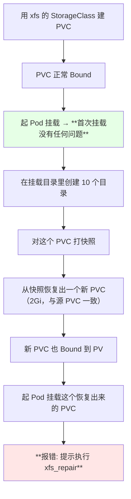

> 作者先把环境清了一遍再来复现，目的很明确：**确认这个现象是可稳定复现的，而不是偶发的环境问题**。

## 首次挂载是好的，问题出在恢复后的卷

```text
复现过程中的两次挂载对比:

第一次: 手动建的 PVC → Pod 挂载   ✅ 正常
第二次: 从快照恢复的 PVC → Pod 挂载  ❌ 报 xfs 错误
```

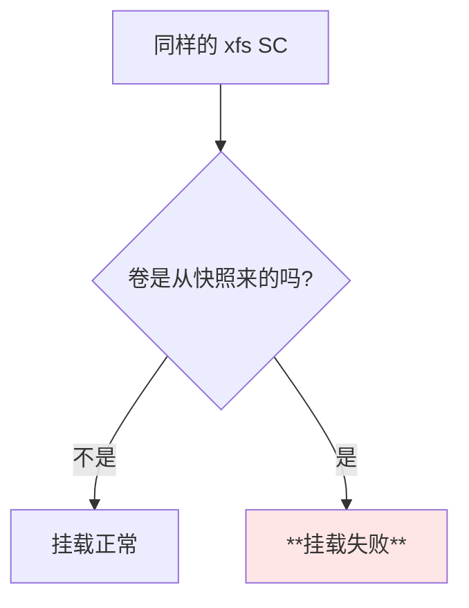

## 报错长什么样

```bash
NS=default
POD=$(kubectl get pods -n "$NS" -l app=restore -o jsonpath='{.items[0].metadata.name}')
kubectl describe pod "$POD" -n "$NS"
```

```text
Events:
  ... unable to mount the volume ...
  ... **XFS: please run xfs_repair** ...
  涉及的磁盘: /dev/rbd0
```

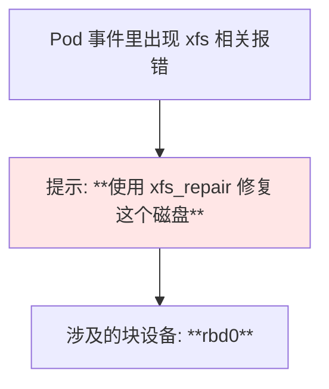

> 作者也坦言：**「如果说你能挂载成功，那说明你运气好，但还不一定是百分之百能挂载成功的」** —— 这类问题的表现经常是**间歇性**的。

## 这是 K8s 的问题，不是 Ceph 的

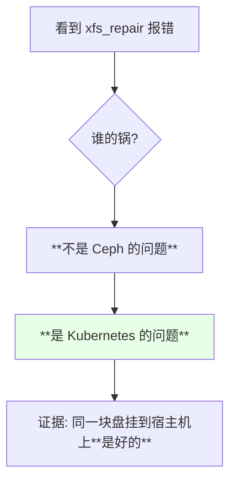

> 课程原话：**「他这个报错啊，并不是这个 Ceph 的问题，这个是 K8s 的问题」**。后面的实测也证实了这一点 —— 同一个 RBD 挂到服务器上一切正常。

## 四种处置方案

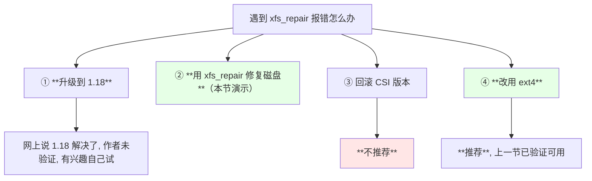

| 方案 | 说明 | 评价 |
| --- | --- | --- |
| 升级到 1.18 | 据说已修复 | 作者没试过 |
| **`xfs_repair` 修盘** | 本节演示 | 能救急，**有风险** |
| 回滚 CSI 版本 | 有人说 1.2.1 没问题、1.2.3 有问题 | **不推荐** |
| **改用 ext4** | 重建池 + SC | **推荐** |

## 为什么不推荐回滚 CSI 版本

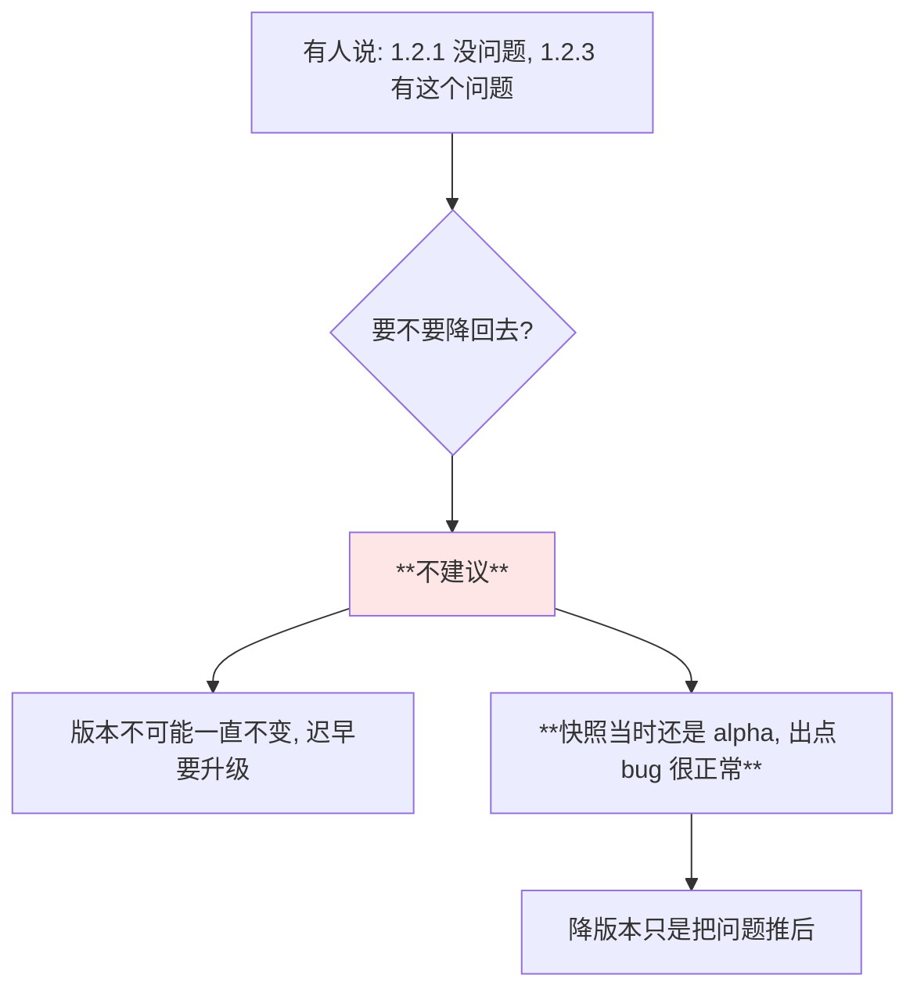

> 课程原话：**「这个版本我不建议你去回退……因为这个版本不可能是一直不变的，我们肯定会对它进行升级的；也有可能就是因为他现在这个快照这个功能还是属于 alpha，出点 bug 还是很正常的」**。

## xfs 与 ext4 的取舍

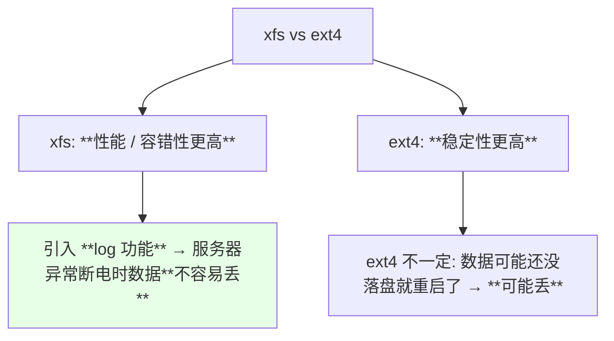

| 文件系统 | 性能 / 容错 | 稳定性 | 日志 |
| --- | --- | --- | --- |
| **xfs** | **更高** | 略低 | **有 log，断电不易丢数据** |
| **ext4** | 略低 | **更高** | 断电可能丢少量数据 |

> 课程作者的公司正是**直接建 StorageClass 没改配置，默认就是 ext4**，所以一直没踩到这个问题。**CentOS 7 默认也是 xfs**，所以对 xfs 本身并不陌生。

## 为什么不能直接在宿主机上修

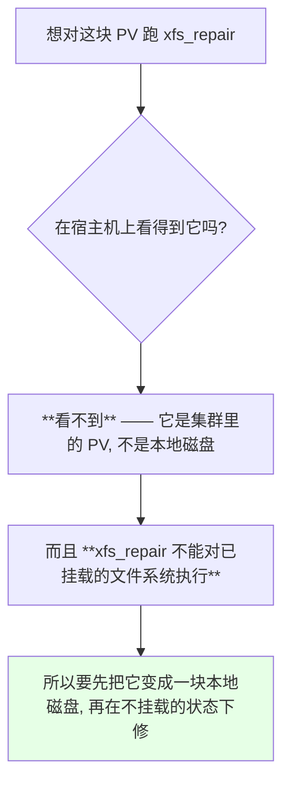

> 课程原话：**「这个东西在咱们这个服务器上是看不到的；然后咱们去挂载这个东西，它这个修复啊是不能先挂载的」**。

## direct-mount 工具登场

```bash
cd rook/cluster/examples/kubernetes/ceph
kubectl apply -f direct-mount.yaml
kubectl get pods -n rook-ceph | grep direct
```

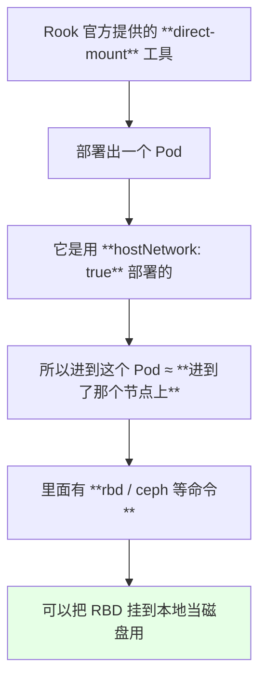

> 作者说明：**「官方是没有写如何使用 direct-mount 去修复这个东西，但是我昨天试了一下，还是可以的」** —— 这是一个未被官方写进文档的实战技巧。

## 怎么找到这个 PV 对应的 RBD image

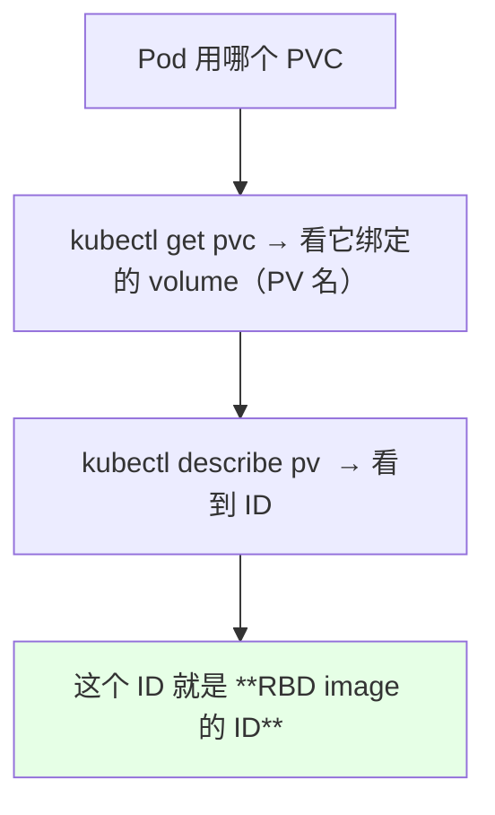

```bash
NS=default
PVC=rbd-pvc-restore
PV=$(kubectl get pvc "$PVC" -n "$NS" -o jsonpath='{.spec.volumeName}')
kubectl describe pv "$PV"
# 记录下那个 ID
```

## 用 dashboard 也能看（以及它的暴露方式）

作者把 ingress 卸载了，于是把 dashboard 的 Service 改成 **NodePort** 暴露：

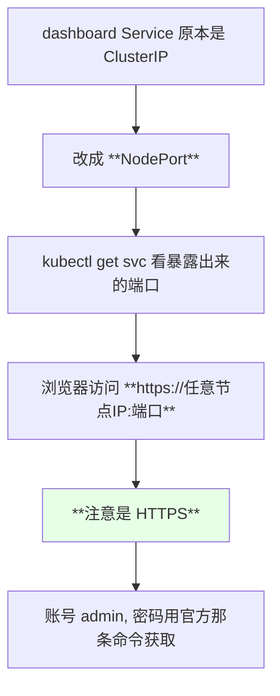

在 dashboard 里能看到：

```text
Ceph dashboard 里能查到的信息:

├── 集群整体状态
├── 各池（pool）的状态 / 性能 / 配置
│   ├── xfs 那个池
│   └── ext4 那个池
└── Block → Images
    ├── 每个 PV 对应一个 image
    ├── **有 parent 的通常就是快照产生的**
    └── 点开还能看到它的快照是谁
```

| 查询途径 | 适合场景 |
| --- | --- |
| dashboard 的 Block → Images | 直观，但**生产环境 PV 一大堆时不好定位** |
| **`describe pv` 拿 ID** | **最靠谱、最直接** |

## csi-vol 命名规则

```mermaid
flowchart TD
    A["RBD image 的名字"] --> B["格式固定: **csi-vol-<ID>**"]
    B --> C["`csi-vol-` 后面那串就是 PV 的 ID"]
    C --> D["也就是 RBD 的 ID"]
    style B fill:#e6ffe6
```

```text
csi-vol-0123456789abcdef
└─┬─┘ └───────┬───────┘
  固定前缀      PV / RBD 的 ID
```

## rbd map：把 PV 变成一块本地磁盘

```bash
# 进到 direct-mount 那个 Pod
DM_POD=rook-direct-mount-xxxx
kubectl exec -it -n rook-ceph "$DM_POD" -- bash

# 用 rbd map 把对应的 image 挂到本地
POOL=ceph-block-pool-xfs
ID=0123456789abcdef
rbd map "$POOL/csi-vol-$ID"
ls -l /dev/rbd0
```

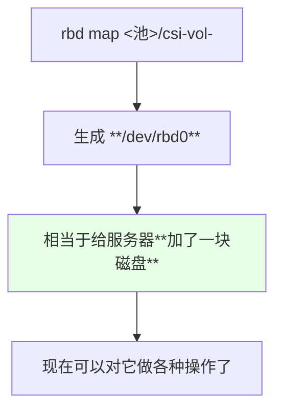

## 先挂载验证磁盘本身是好的

```bash
mount /dev/rbd0 /mnt
ls /mnt
# 之前创建的 10 个目录都还在
umount /mnt
```

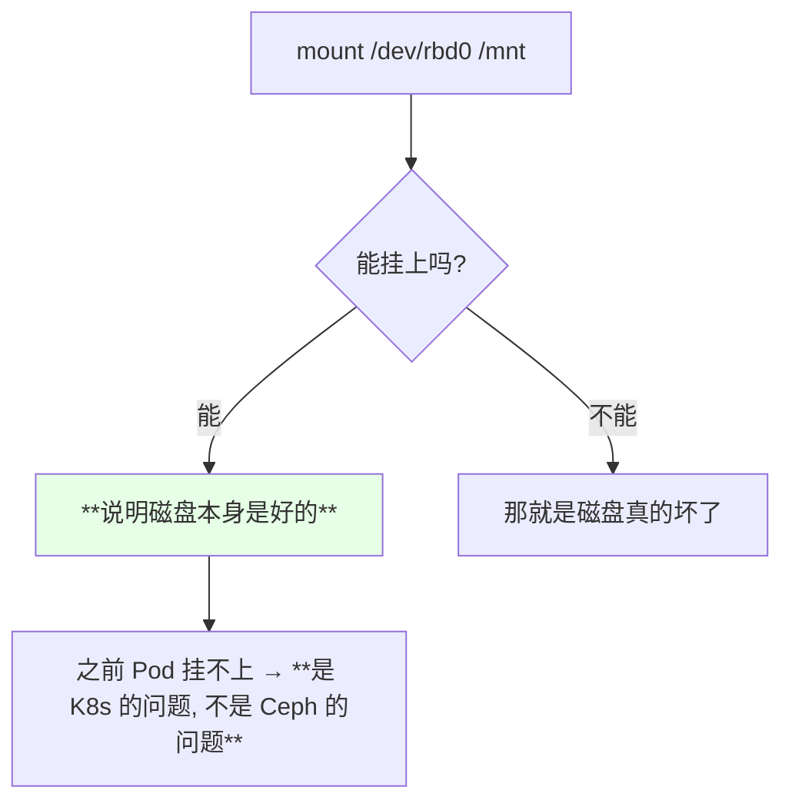

> 课程现场：**「所以说呢这个磁盘其实是能被挂载的，然后那个 K8s 里面不能挂载，因为是 K8s 的问题，不是 Ceph 的问题」**，而且**进到挂载目录里那 10 个目录都还在**。

**建议的验证顺序（很重要）**：

```text
1. 先 mount 到 /mnt 看能不能正常挂载
   └─ 能挂 → 磁盘没问题
2. 再执行 xfs_repair /dev/rbd0
3. 无论 repair 报不报错, 都**回到 Pod 上再试一次挂载**
   └─ 因为有时 repair 虽然执行报错, 却也能让 xfs 挂上
```

## 执行 xfs_repair（以及 -L 的风险）

```bash
# 常规修复（相当于 replay 一下日志）
xfs_repair /dev/rbd0

# 如果上面报错, 用 -L（**风险更高**）
xfs_repair -L /dev/rbd0
```

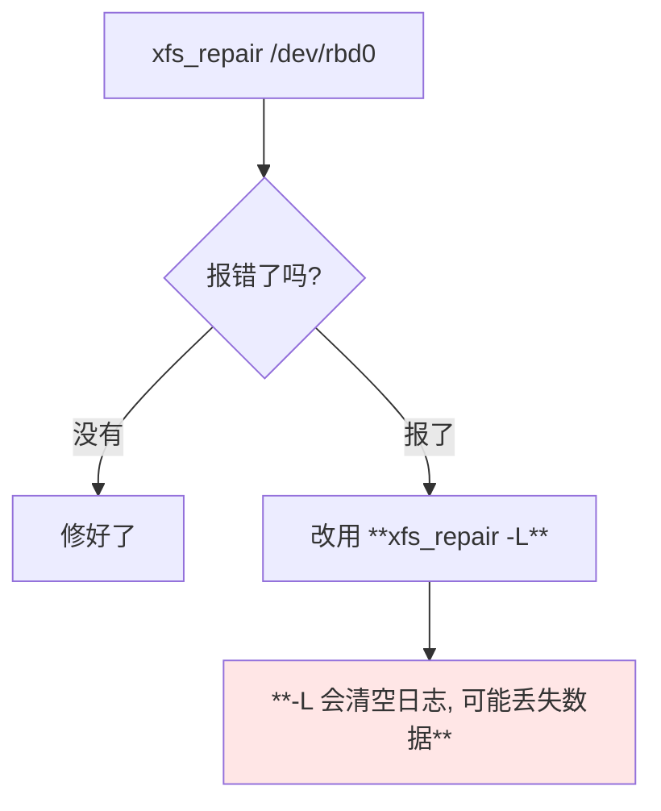

| 命令 | 风险 |
| --- | --- |
| `xfs_repair /dev/rbd0` | 较低，相当于重放日志 |
| **`xfs_repair -L /dev/rbd0`** | **高，可能丢数据** |

> 作者提醒：**「用 xfs_repair 修复这个 RBD 是可以的，但是其实是有一定风险的 —— 他去重新 replay 那个 log 的时候，有可能会丢失数据」**。

## 修完必须卸载

```bash
umount /mnt
rbd unmap /dev/rbd0
```

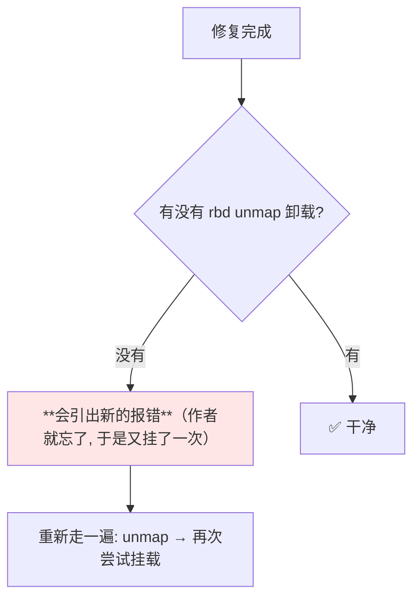

> 这是作者现场踩到的：**「修复完之后，需要把那个 RBD 给删掉（卸载），相当于把这块磁盘拔出来；刚才我们忘记卸载了」** —— 忘记卸载会引出下一轮莫名其妙的报错。

## 再回 Pod 里验证

```bash
kubectl delete pod restore-pod
kubectl apply -f pod-restore.yaml
kubectl get pods -w
kubectl exec -it restore-pod -- ls /mnt
```

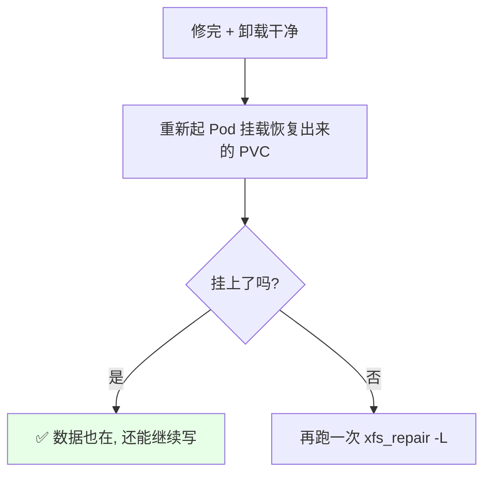

## API 速览

| 能力 | 做法 | 关键点 |
| --- | --- | --- |
| 找 PVC 绑定的 PV | `kubectl get pvc -o jsonpath='{.spec.volumeName}'` | — |
| 找 RBD image 的 ID | `kubectl describe pv <PV>` | 名字格式 `csi-vol-<ID>` |
| 部署 direct-mount | 示例目录下 apply 对应 yaml | **hostNetwork: true** |
| 进工具 Pod | `kubectl exec -it -n rook-ceph <POD> -- bash` | 里面有 rbd / ceph 命令 |
| 把 PV 变本地盘 | `rbd map <池>/csi-vol-<ID>` | 生成 `/dev/rbd0` |
| 验证磁盘 | `mount /dev/rbd0 /mnt` | 能挂 = 磁盘没问题 |
| 修复 | `xfs_repair /dev/rbd0` | **不能对已挂载的盘执行** |
| 高风险修复 | `xfs_repair -L /dev/rbd0` | **可能丢数据** |
| 卸载 | `umount /mnt` + `rbd unmap /dev/rbd0` | **必须做** |
| dashboard 暴露 | Service 改 NodePort | **https://节点IP:端口** |
| dashboard 密码 | 官方给的那条获取命令 | 账号 admin |

字段速查：

| 项 | 作用 |
| --- | --- |
| `hostNetwork: true` | direct-mount 能「进入」节点的关键 |
| `csi-vol-<ID>` | RBD image 的固定命名格式 |
| `rbd map` / `rbd unmap` | 挂载 / 卸载 RBD 到本地 |
| `xfs_repair` / `-L` | 修复 xfs 文件系统（`-L` 风险高） |
| `StorageClass.parameters.fstype` | **xfs / ext4 的开关** |

## Demo 示例

```bash
# 1. 复现: 用 xfs 的 SC 建 PVC → 等 Bound
NS=default
kubectl apply -f pvc-xfs.yaml -n "$NS"
kubectl get pvc -n "$NS"

# 2. 起 Pod 挂载（首次是好的）, 在里面造点数据
kubectl apply -f pod-xfs.yaml
kubectl exec -it pod-xfs -- sh -c "for i in 1 2 3 4 5 6 7 8 9 10; do mkdir -p /mnt/dir\$i; done"

# 3. 打快照, 再从快照恢复出一个 PVC（容量要 >= 源 PVC）
kubectl apply -f snapshot.yaml -n "$NS"
kubectl apply -f pvc-restore.yaml -n "$NS"
kubectl get pvc -n "$NS"

# 4. 起 Pod 挂载恢复出来的 PVC —— 复现 xfs 报错
kubectl apply -f pod-restore.yaml
kubectl describe pod restore-pod -n "$NS"

# 5. 找到这个 PV 对应的 RBD image ID
PVC=rbd-pvc-restore
PV=$(kubectl get pvc "$PVC" -n "$NS" -o jsonpath='{.spec.volumeName}')
kubectl describe pv "$PV"          # 记下那个 ID

# 6. 部署 direct-mount 工具并进去
cd rook/cluster/examples/kubernetes/ceph
kubectl apply -f direct-mount.yaml
DM=$(kubectl get pods -n rook-ceph -l app=rook-direct-mount -o jsonpath='{.items[0].metadata.name}')
kubectl exec -it -n rook-ceph "$DM" -- bash

# 7. 在工具 Pod 里: 挂到本地 → 验证 → 修复 → 卸载
POOL=ceph-block-pool-xfs
ID=0123456789abcdef
rbd map "$POOL/csi-vol-$ID"
ls -l /dev/rbd0
mount /dev/rbd0 /mnt && ls /mnt && umount /mnt
xfs_repair /dev/rbd0
# 若报错: xfs_repair -L /dev/rbd0（**可能丢数据**）
rbd unmap /dev/rbd0                # ← **一定别忘了**

# 8. 回到 K8s 里重新挂载验证
kubectl delete pod restore-pod -n "$NS"
kubectl apply -f pod-restore.yaml
kubectl exec -it restore-pod -n "$NS" -- ls /mnt
```

```yaml
# pvc-xfs.yaml —— 复现用的 xfs 卷（fstype 在 SC 里指定）
apiVersion: v1
kind: PersistentVolumeClaim
metadata:
  name: rbd-pvc-xfs
  namespace: default
spec:
  storageClassName: rook-ceph-block-xfs
  accessModes:
  - ReadWriteOnce
  resources:
    requests:
      storage: 2Gi
```

```yaml
# pvc-restore.yaml —— 从快照恢复（容量要 >= 快照时的容量）
apiVersion: v1
kind: PersistentVolumeClaim
metadata:
  name: rbd-pvc-restore
  namespace: default
spec:
  storageClassName: rook-ceph-block-xfs
  dataSource:
    name: rbd-pvc-snapshot
    kind: VolumeSnapshot
    apiGroup: snapshot.storage.k8s.io
  accessModes:
  - ReadWriteOnce
  resources:
    requests:
      storage: 2Gi
```

```text
修复流程的正确顺序（错一步就会引出新报错）:

Pod 挂载失败
   ↓
describe pv 拿到 ID（csi-vol-<ID>）
   ↓
direct-mount Pod（hostNetwork: true）
   ↓
rbd map → /dev/rbd0
   ↓
mount /mnt 验证磁盘是好的 → umount
   ↓
xfs_repair /dev/rbd0（失败再用 -L）
   ↓
**rbd unmap ← 千万别忘**
   ↓
回 K8s 重新挂载验证
```

### 总结

- **问题可稳定复现**：xfs 的 SC → PVC → 写数据 → 打快照 → **从快照恢复出的 PVC 起 Pod 挂载就报 xfs 错误**，而**首次直接建的 PVC 挂载是完全正常的**；
- **这不是 Ceph 的问题，是 Kubernetes 侧的问题** —— 证据是把同一块 RBD 挂到宿主机上一切正常、数据都在；
- **四种处置**：升级到 1.18（据说已解决、作者未验证）、**用 `xfs_repair` 修盘**、回滚 CSI 版本（**不推荐** —— 版本迟早要升，且快照当时还是 alpha，出 bug 正常）、**改用 ext4（推荐）**；
- **修复的前提是不能先挂载**，所以要用 Rook 的 **direct-mount** 工具（**`hostNetwork: true`，进去约等于进了那个节点**），用 `rbd map` 把 PV 变成一块本地磁盘；
- **定位 PV 的方法是 `describe pv` 拿 ID**，image 的命名**固定为 `csi-vol-<ID>`**；dashboard（改 NodePort 后用 **https** 访问）也能在 Block → Images 里看到，但 PV 多了就不好找；
- **`xfs_repair` 有丢数据风险，`xfs_repair -L` 风险更高，且修完必须 `rbd unmap` 卸载**（作者就因为忘了卸载又引出一轮报错）；
- **选型结论**：**不用快照的话 xfs 本身没问题**；**要用快照且还在 alpha 阶段时，用 ext4 更稳** —— ext4 稳定性更高，xfs 性能和容错更好（且有 log 机制，异常断电不易丢数据），按需取舍。

