# Kubernetes 集群部署: 存储回顾（静态与动态两条链路、快照的完整闭环，以及为什么 CSI 会成为主流）

存储这一块比较杂，这一節把它串成一条线：**静态存储与动态存储两条链路各自的走法**、**快照在整条链路上处在哪一环**，以及**为什么 CSI 会成为未来最主流的存储方式**。

结论先摆：

1. **存储分两类**：**静态存储** = 管理员手动建 PV、建 PVC，再挂到 Deployment / StatefulSet 上；**动态存储** = 靠 StorageClass 自动生成；
2. **生产环境建议后端存储放在集群之外**，不要放在 K8s 集群内部；
3. **Pod 的 volume 可以直连后端存储**（GFS / NFS 都行），但**灵活性不高、配置不简单，实际用得不多**；主流的写法是 **volume → PVC →（StorageClass）→ PV**；
4. **没有 StorageClass 就得手动建 PV** —— 这就是静态与动态的分水岭；
5. **快照的设计理念和 StorageClass 完全一样**：`VolumeSnapshotClass` 是模板、`VolumeSnapshot` 是请求，后端存储对 PVC 绑定的那个 PV 打备份；
6. **恢复时新建 PVC 并在 `dataSource` 里指定快照名**，后端根据快照重建一份 PV；
7. **CSI 会成为主流**：以前那种「PVC/PV 直连后端」是 **in-tree** 方式，K8s 开发者得为每一种存储都写一遍连接代码；**FlexVolume 要每台宿主机装插件，太复杂**；**CSI 由存储厂商自己维护**，K8s 只需对接 CSI。

## 纲要

- 两大类：静态存储与动态存储
- 后端存储该放哪：生产建议放集群之外
- 链路一：动态存储怎么走通
- 链路二：静态存储怎么走通
- volume 直连后端存储：能行但不好用
- 两者的分水岭：有没有 StorageClass
- 快照：设计理念与 StorageClass 一致
- 打快照这一步发生了什么
- 恢复：dataSource 指向快照
- CSI 为什么是趋势
- in-tree 方式的痛点
- FlexVolume 的痛点
- 一张完整的链路图

## 两大类：静态存储与动态存储

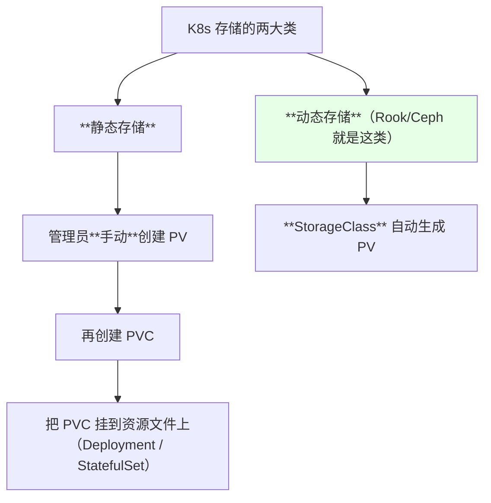

| 类别 | 谁来创建 PV | 典型后端 |
| --- | --- | --- |
| 静态存储 | **管理员手动** | NFS 等 |
| **动态存储** | **StorageClass + 底层驱动自动创建** | **Rook/Ceph（云原生存储）** |

> 作者对 Rook 的评价：**「Rook 这个东西，对我们管理员来讲，就是把存储封装得比较好，用起来也比较简单」**。

## 后端存储该放哪：生产建议放集群之外

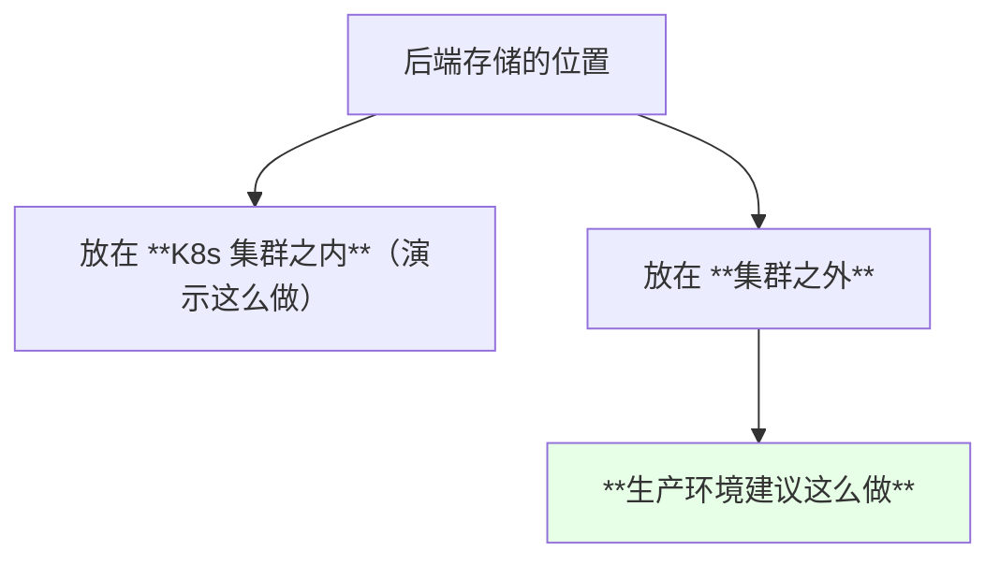

> 后端存储可以是 Ceph、GlusterFS、NFS，或者其它各种形态 —— 但**在生产环境，建议这个存储不要放在集群之内**。

## 链路一：动态存储怎么走通

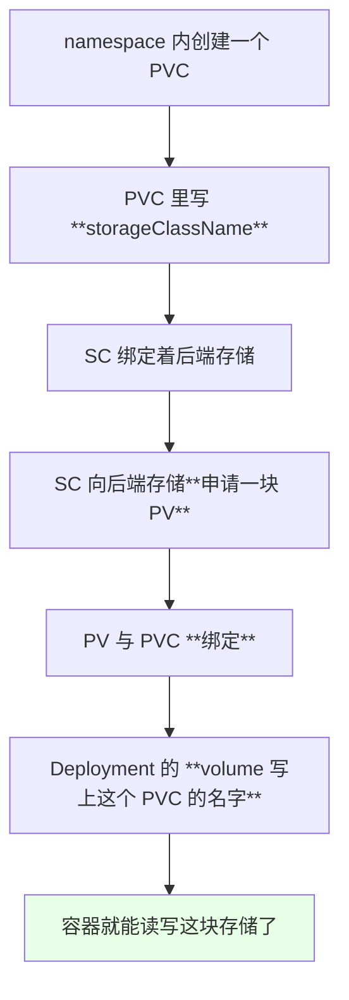

```text
动态存储链路:

Deployment.spec.template.spec.volumes
   └── persistentVolumeClaim.claimName: <PVC 名>
             │
             ▼
          PVC  ← storageClassName
             │
             ▼
       StorageClass  ← 绑定后端存储
             │
             ▼
          PV（**自动创建**）
```

## 链路二：静态存储怎么走通

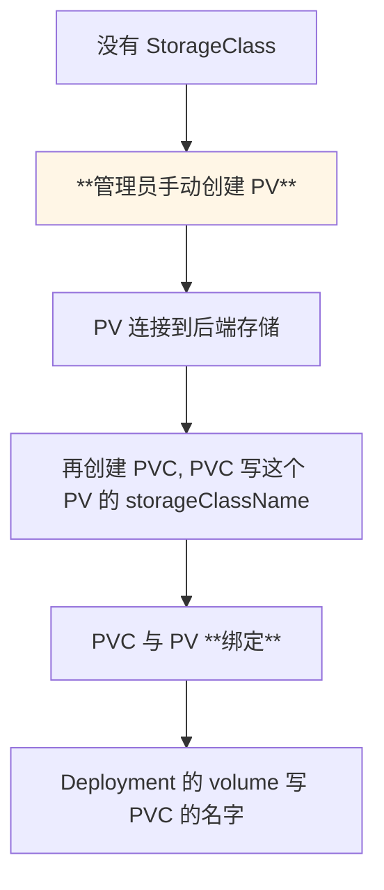

```text
静态存储链路:

管理员手动建 PV（连到后端存储）
        │
        ▼
      PVC（写 PV 对应的 storageClassName）
        │
        ▼
   两者绑定
        │
        ▼
Deployment volume 引用 PVC
```

## volume 直连后端存储：能行但不好用

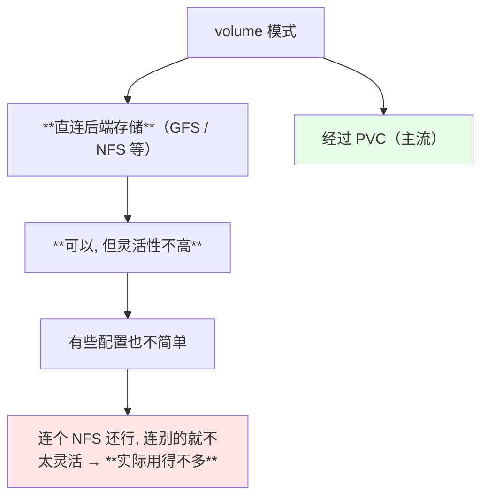

> 课程原话：**「这种其实用的不是很多，你连个 NFS 其实是可以的，但是你连其他的可能不是很灵活，我们一般都不是这么写」**。

## 两者的分水岭：有没有 StorageClass

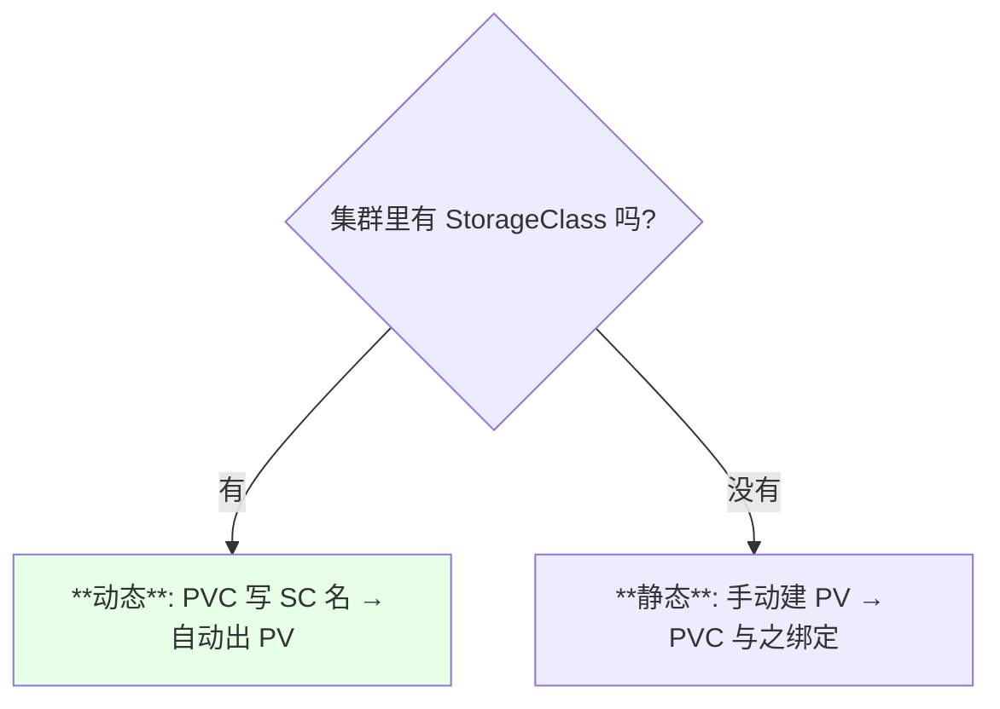

| 条件 | 结果 |
| --- | --- |
| **有 StorageClass** | PVC 通过它自动申请 PV（动态） |
| **没有 StorageClass** | 必须手动建 PV（静态） |

> 一句话总结两者的区别：**「如果没有 storageClass，就需要自己手动去创建一个 PV」**。

## 快照：设计理念与 StorageClass 一致

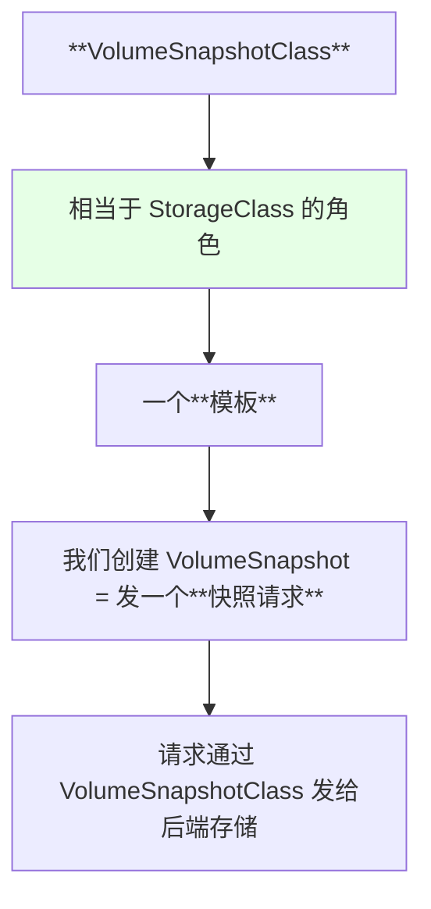

| 概念 | 类比 |
| --- | --- |
| `VolumeSnapshotClass` | 相当于 `StorageClass`（模板） |
| `VolumeSnapshot` | 相当于 `PVC`（请求） |
| 实际的快照数据 | 相当于 `PV`（底层实体） |

## 打快照这一步发生了什么

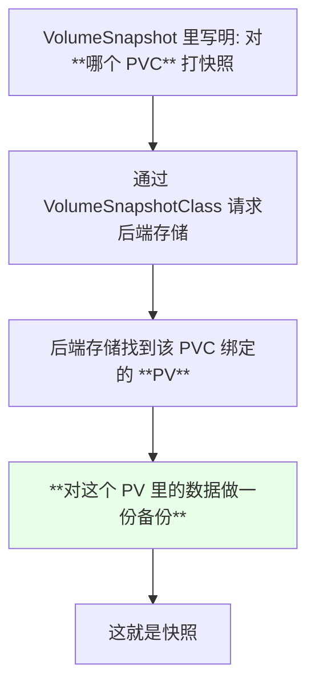

> 课程表述：**「他通过这个 snapshotClass 去对这个后端存储发了一个请求，告诉后端存储我要对某个 PVC 进行一次快照……也就是说他对这个 PV 里面的数据进行了一个备份」**。

在 **Ceph 的 dashboard** 里也能直接看到这些快照对象。

## 恢复：dataSource 指向快照

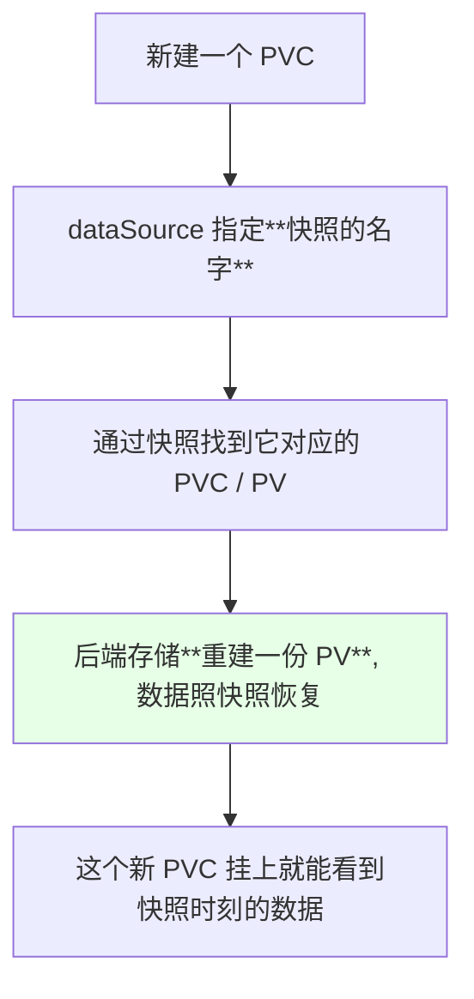

```text
恢复链路:

新 PVC（dataSource: VolumeSnapshot）
    │
    ▼
快照 → 找到当时的 PVC → 找到当时的 PV
    │
    ▼
重建一个 PV（数据是快照里那份）
```

## CSI 为什么是趋势

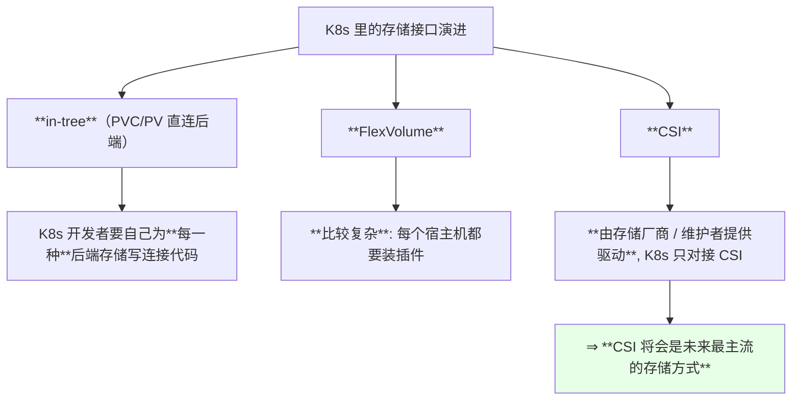

| 方式 | 谁写驱动 | 部署负担 | 评价 |
| --- | --- | --- | --- |
| **in-tree** | **K8s 开发者** | 随 K8s 走 | 每加一种存储就要改 K8s 本体 |
| FlexVolume | 第三方 | **每台宿主机都要装插件** | 复杂 |
| **CSI** | **存储官方 / 维护者** | 集群内部署即可 | **主流方向** |

> 课程原话：**「像这种 PVC 或者是 PV 直连的话，在 K8s 里面被称为一种 in-tree 的开发方式，就是 K8s 的管理者、K8s 开发者必须要自己去手动实现连接每一个后端存储的代码……为了减少 K8s 开发者的工作量，他们提出了很多概念，PVC 是一种，CSI 又是一种，还有一个 FlexVolume 也是一种，但是 FlexVolume 比较复杂，它需要安装插件，每个宿主机都要安装；CSI 是由存储的官方去提供一个 CSI，或者其他的维护者提供一个 CSI」**。

## in-tree 方式的痛点

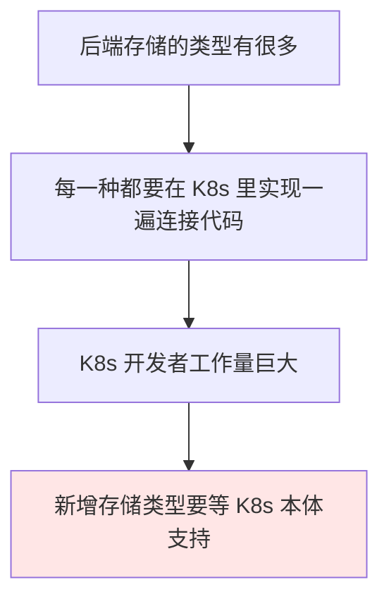

## FlexVolume 的痛点

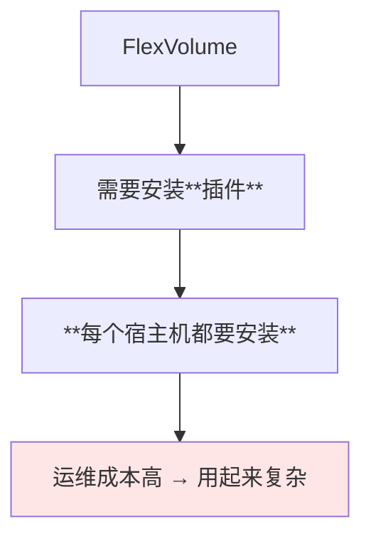

## 一张完整的链路图

```text
静态 vs 动态 vs 快照 —— 完整关系:

【动态存储】
Deployment volume
└── PVC（storageClassName: xxx）
    └── StorageClass
        └── 后端存储 → **自动生成 PV**

【静态存储】
Deployment volume
└── PVC
    └── **管理员手动创建的 PV** → 后端存储

【快照】
PVC ──打快照──> VolumeSnapshot（通过 VolumeSnapshotClass）
   │                  │
   │                  └── 后端存储对 PV 数据做备份
   │
新建 PVC（dataSource: 快照名）──> 重建 PV（数据来自快照）

【接口层】
PVC / PV ──> **CSI**（由存储厂商提供）──> 后端存储
```

## API 速览

| 能力 | 做法 | 关键点 |
| --- | --- | --- |
| 看有哪些 SC | `kubectl get sc` | 集群级，无 ns |
| 看 PVC 绑定了哪个 PV | `kubectl get pvc -o jsonpath='{.spec.volumeName}'` | — |
| 看 PV 属于哪个 SC | `kubectl get pv -o yaml` | 看 `storageClassName` |
| 看快照 class | `kubectl get volumesnapshotclass` | 与 SC 同设计 |
| 看快照 | `kubectl get volumesnapshot -n <NS>` | namespace 级 |
| 从快照恢复 | 新 PVC 写 `dataSource` | 容量 ≥ 快照 |
| 看 CSI 驱动 | `kubectl get csidrivers` / `kubectl get csinodes` | CSI 时代的排查入口 |
| Ceph 侧观察 | dashboard 或 toolbox | 看池 / image / 快照 |

字段速查：

| 字段 | 作用 |
| --- | --- |
| `PVC.spec.storageClassName` | 指向哪个 SC（**为空就是静态路线**） |
| `PV.spec.storageClassName` | 手动建的 PV 也要写，供 PVC 匹配 |
| `Pod.spec.volumes[].persistentVolumeClaim.claimName` | Pod 侧引用 PVC |
| `VolumeSnapshot.spec.source.name` | 对哪个 PVC 打快照 |
| `PVC.spec.dataSource` | 从哪个快照恢复 |
| `VolumeSnapshotClass.snapshotter` | 由哪个 CSI 处理快照 |

## Demo 示例

```bash
# 1. 看集群里有哪些 StorageClass（有没有它决定走动态还是静态）
kubectl get sc

# 2. 走动态路线: 建 PVC 并看它自动绑定了哪个 PV
NS=default
kubectl apply -f pvc-dynamic.yaml -n "$NS"
kubectl get pvc -n "$NS"
kubectl get pvc -n "$NS" -o jsonpath='{.items[0].spec.volumeName}'; echo
kubectl get pv

# 3. 走静态路线: 手动建 PV, 再让 PVC 与之绑定
kubectl apply -f pv-static.yaml
kubectl apply -f pvc-static.yaml -n "$NS"
kubectl get pvc -n "$NS"

# 4. 快照与恢复
kubectl get volumesnapshotclass
kubectl apply -f snapshot.yaml -n "$NS"
kubectl get volumesnapshot -n "$NS"
kubectl apply -f pvc-restore.yaml -n "$NS"
kubectl get pvc,pv -n "$NS"

# 5. 看 CSI 相关对象（CSI 时代的必备排查项）
kubectl get csidrivers
kubectl get csinodes

# 6. 在 Deployment 里引用 PVC
#    volumes[].persistentVolumeClaim.claimName
```

```yaml
# pvc-dynamic.yaml —— 动态路线：指定 SC，PV 自动来
apiVersion: v1
kind: PersistentVolumeClaim
metadata:
  name: pvc-dynamic
  namespace: default
spec:
  storageClassName: rook-ceph-block
  accessModes:
  - ReadWriteOnce
  resources:
    requests:
      storage: 1Gi
```

```yaml
# pv-static.yaml —— 静态路线：管理员手动建 PV
apiVersion: v1
kind: PersistentVolume
metadata:
  name: pv-static
spec:
  storageClassName: manual
  capacity:
    storage: 1Gi
  accessModes:
  - ReadWriteOnce
  persistentVolumeReclaimPolicy: Retain
  nfs:
    server: 192.168.1.100
    path: /data/nfs
---
apiVersion: v1
kind: PersistentVolumeClaim
metadata:
  name: pvc-static
  namespace: default
spec:
  storageClassName: manual        # ← 与 PV 的 storageClassName 对应
  accessModes:
  - ReadWriteOnce
  resources:
    requests:
      storage: 1Gi
```

```text
存储演进的一张表:

方式          驱动谁维护              部署负担          现状
──────────────────────────────────────────────────────────
in-tree       K8s 开发者              随 K8s 发布       逐渐被替代
FlexVolume    第三方                  **每台机器装插件**  复杂, 少用
**CSI**       **存储厂商/维护者**      集群内即可         **未来主流**
```

### 总结

- **存储分静态与动态两类**：静态是**管理员手动建 PV + PVC 再挂到 Deployment / StatefulSet**，动态是**靠 StorageClass 自动生成 PV**（Rook/Ceph 就是这套，作者评价它「封装得比较好、用起来简单」）；
- **生产环境建议后端存储放在集群之外**；**volume 虽然能直连后端存储（NFS 可以），但灵活性不高、配置不简单，实际用得不多**，主流写法是 **volume → PVC →（StorageClass）→ PV**；
- **两者的分水岭就是有没有 StorageClass** —— 有就走动态（PVC 写 `storageClassName` 自动出 PV），没有就只能手动建 PV 再让 PVC 与之绑定；
- **快照的设计理念和 StorageClass 如出一辙**：`VolumeSnapshotClass` 是模板、`VolumeSnapshot` 是请求，**后端存储会对该 PVC 绑定的 PV 里的数据做一份备份**（Ceph dashboard 里能直接看到）；
- **恢复的做法是新建一个 PVC 并在 `dataSource` 里指定快照名**，后端据此重建一份 PV，数据照快照恢复；
- **CSI 会成为未来最主流的存储方式**：in-tree 要求 K8s 开发者为每种后端存储都写一遍连接代码，**FlexVolume 要在每台宿主机上装插件太复杂**，而 **CSI 由存储厂商自己维护驱动**，K8s 只需对接 CSI —— 存储这一章也就此告一段落，接下来是中间件与工具。

