# Kubernetes 集群部署: 容器化中间件基本说明（本章路线、为什么 Redis/RabbitMQ/Kafka 要举一反三，以及 Helm、监控与日志的安排）

存储那一段落告一段落，从这里开始讲**在 Kubernetes 集群里装常用的中间件和第三方工具**。这一節是路线说明：**要讲哪些东西、以什么方式讲、以及想让你带走的核心能力是什么**。

结论先摆：

1. **重点是「如何正确地部署一个中间件到 K8s 集群」，而不是背下某个中间件的安装步骤** —— 目标是**举一反三**；
2. **要讲 Redis / RabbitMQ / Kafka / ZooKeeper**，而且**单机与集群两种形态都会讲**（先单实例、再集群）；
3. **安装方式会覆盖 operator 方式与 StatefulSet 方式**；
4. **会讲 Helm**：它是什么、怎么用、**甚至怎么编写自己的 chart**；
5. **监控部分会用 Prometheus**，因为 **Zabbix / Open-falcon 这类传统工具对容器和 K8s 的集成还不够好**，需要**专为容器设计的云原生监控系统**；
6. **Prometheus 不只监控集群内部，外部程序也能监控**，还会讲**接口类监控（黑盒监控）**和 **Java 应用的 JVM / GC 监控**；
7. **日志收集讲两个方面**：**容器控制台日志**、以及**打到容器内文件里的日志怎么收集**。

## 纲要

- 存储讲完了，接下来讲什么
- 要覆盖的中间件清单
- 真正的目标：学会部署流程本身
- 单机与集群两种形态
- operator 与 StatefulSet 两种安装方式
- Helm：会讲到能自己写 chart
- 监控：为什么传统工具不够用
- Prometheus 的能力边界
- 黑盒监控与 Java 应用监控
- 日志收集的两个方面
- 本章的第一站：Redis

## 存储讲完了，接下来讲什么

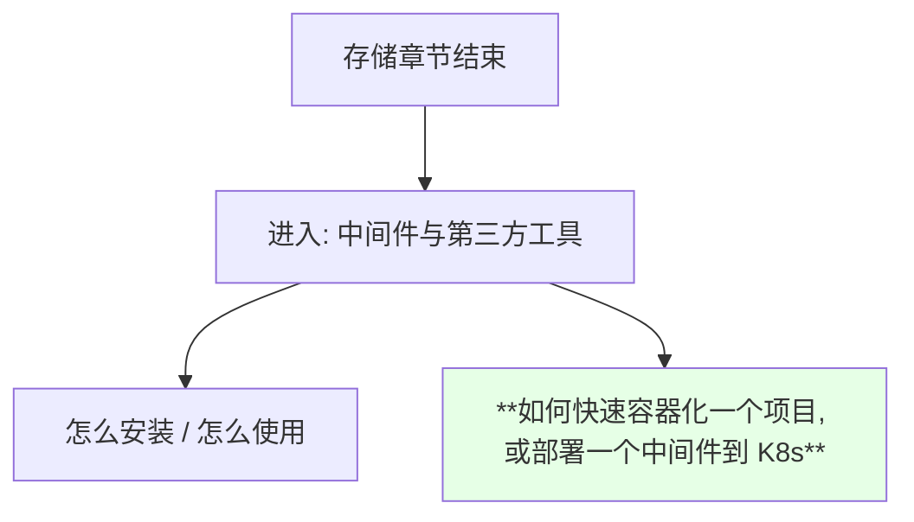

> 课程原话：**「我们的存储方面就已经告一个段落了，然后我们从这节课开始都讲一下，就是在我们 K8s 集群当中常用的一些中间件，或者是一些第三方的工具，怎么安装、怎么使用；然后也会讲一下如何快速地容器化一个项目，或者是部署一个中间件到我们的 K8s 集群当中」**。

## 要覆盖的中间件清单

```text
本章要讲的中间件:

├── Redis
├── RabbitMQ
├── Kafka
└── ZooKeeper
```

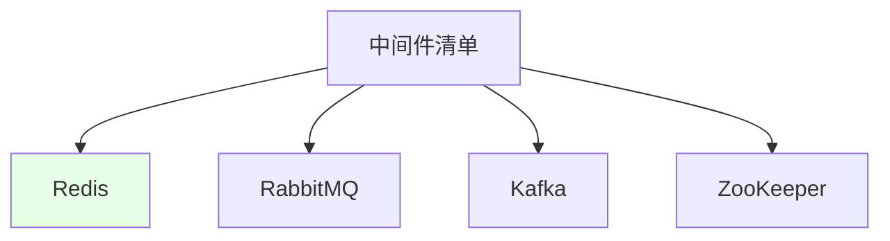

## 真正的目标：学会部署流程本身

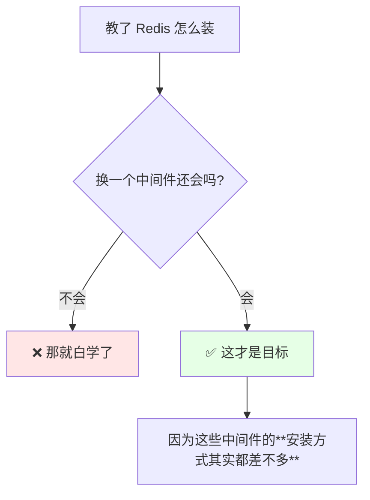

> 课程说得很直白：**「它的安装方式其实都差不多，主要讲的就是咱们要学会举一反三 —— 我不能说我教了你们 Redis 怎么安装、RabbitMQ 怎么安装，然后换了一个其他的你就不会安装了，这是不行的」**。

```text
真正要关注的是:

无论什么类型的中间件, 部署到 K8s 的**流程大概是什么样的**

  而不是: 「我会装 Redis 了, 但别的都不会」
```

## 单机与集群两种形态

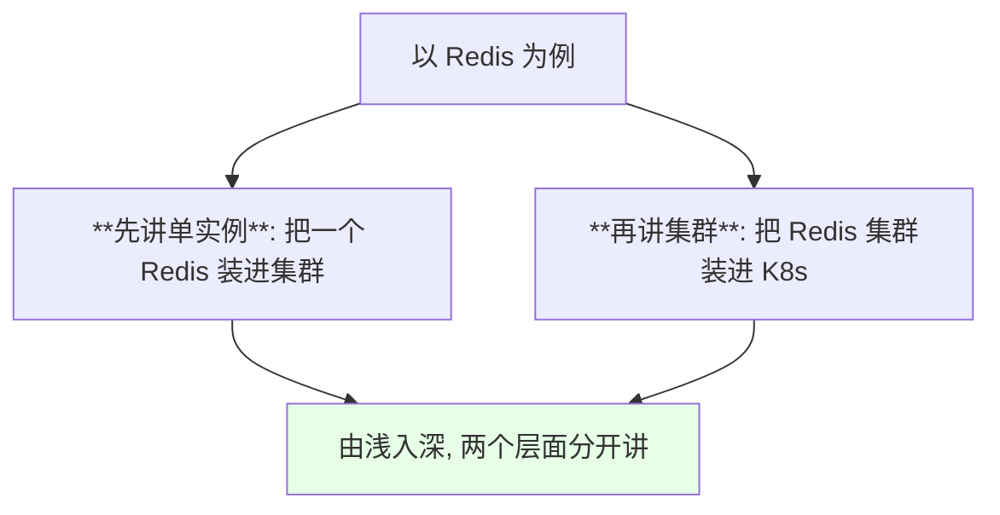

| 形态 | 复杂度 | 讲课顺序 |
| --- | --- | --- |
| 单实例 | 低 | **先讲** |
| 集群 | 高（涉及有状态、存储、主从） | 后讲 |

## operator 与 StatefulSet 两种安装方式

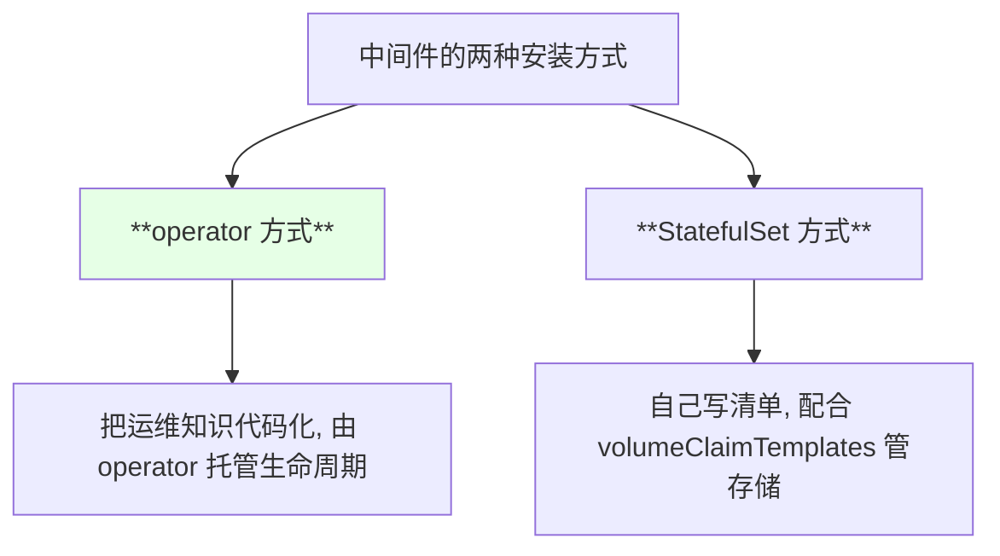

| 方式 | 特点 |
| --- | --- |
| **operator** | 封装度高，扩缩容 / 故障恢复由控制器代劳 |
| **StatefulSet** | 更可控，配合前面讲的动态存储使用 |

> 前面讲 Rook 时已经见过 operator 套路（`CephCluster` 是 CRD、由 operator 拉起 Pod），这一章会再见到它。

## Helm：会讲到能自己写 chart

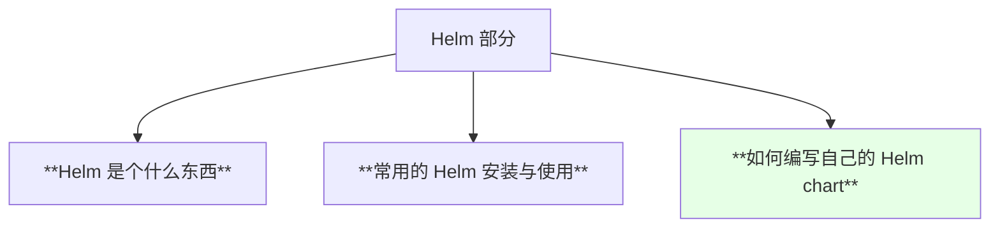

| 阶段 | 内容 |
| --- | --- |
| 认知 | Helm 是什么 |
| 使用 | 常用安装命令 |
| **进阶** | **自己写 chart** |

## 监控：为什么传统工具不够用

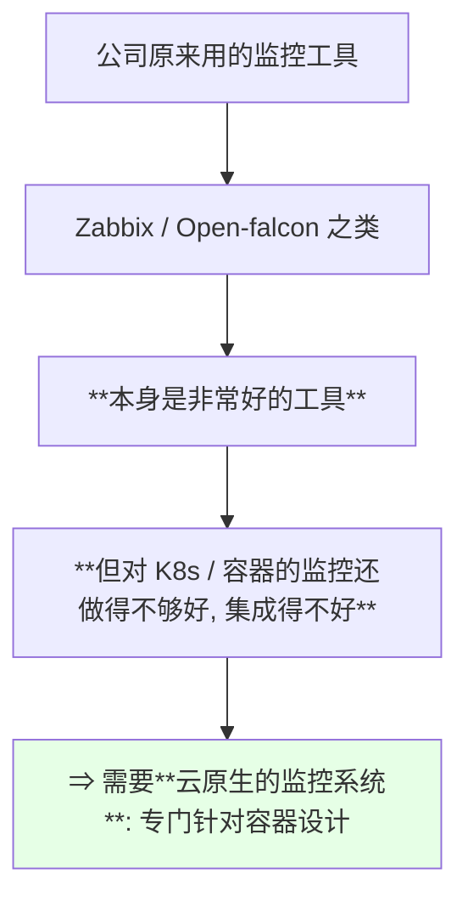

| 工具类型 | 对容器的支持 |
| --- | --- |
| Zabbix / Open-falcon 等传统工具 | 很好用，但**对容器集成不够** |
| **云原生监控系统** | **专为容器设计** |

## Prometheus 的能力边界

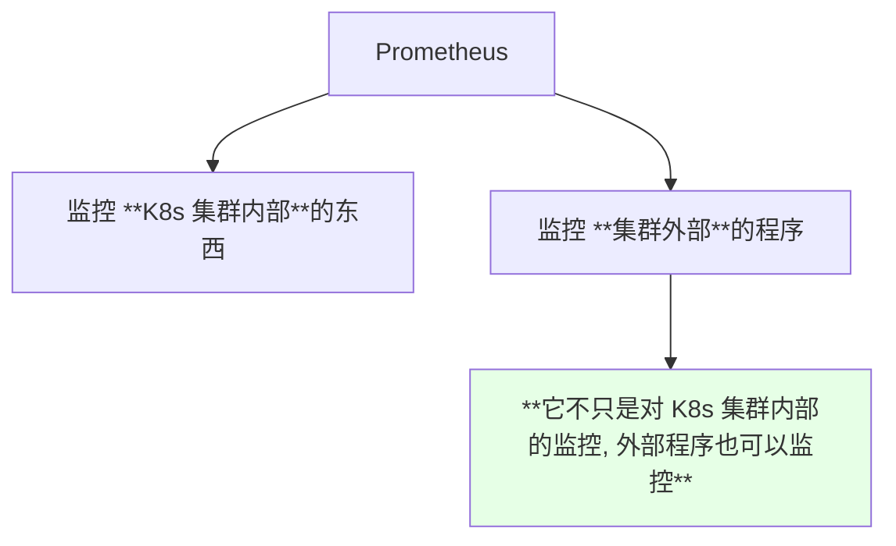

> 课程会讲**监控的安装和使用**，以及**它的监控方式和传统工具的对比**。

## 黑盒监控与 Java 应用监控

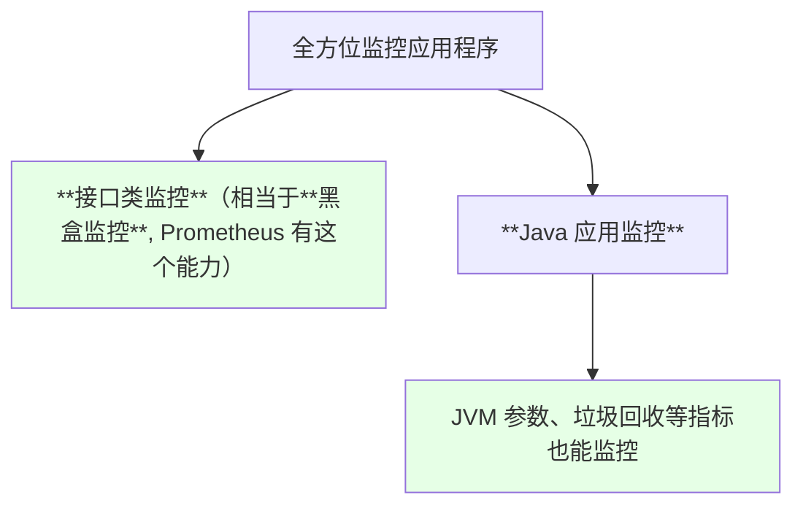

| 监控维度 | 说明 |
| --- | --- |
| 黑盒监控 | 从外部探测接口是否可用 |
| **Java 应用** | **JVM 参数、GC 等都在监控范围内** |

## 日志收集的两个方面

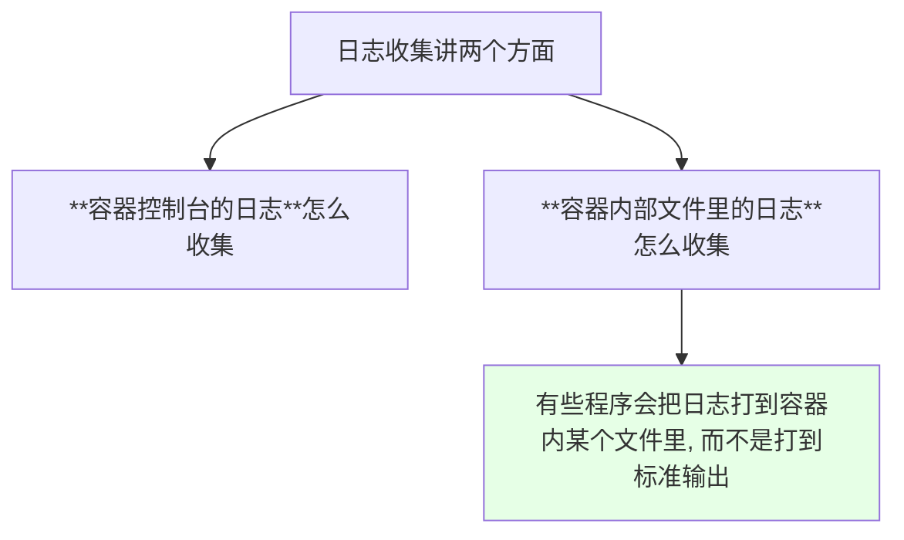

| 日志位置 | 收集思路 |
| --- | --- |
| **容器控制台输出** | 直接采集标准输出 / 标准错误 |
| **容器内的日志文件** | 需要额外规则去采集文件 |

> 课程说这里会**展示两个亮点**；另外注意，**日志收集与前面讲的文件共享存储是两回事** —— 这里关注的是采集，不是持久化。

## 本章的第一站：Redis

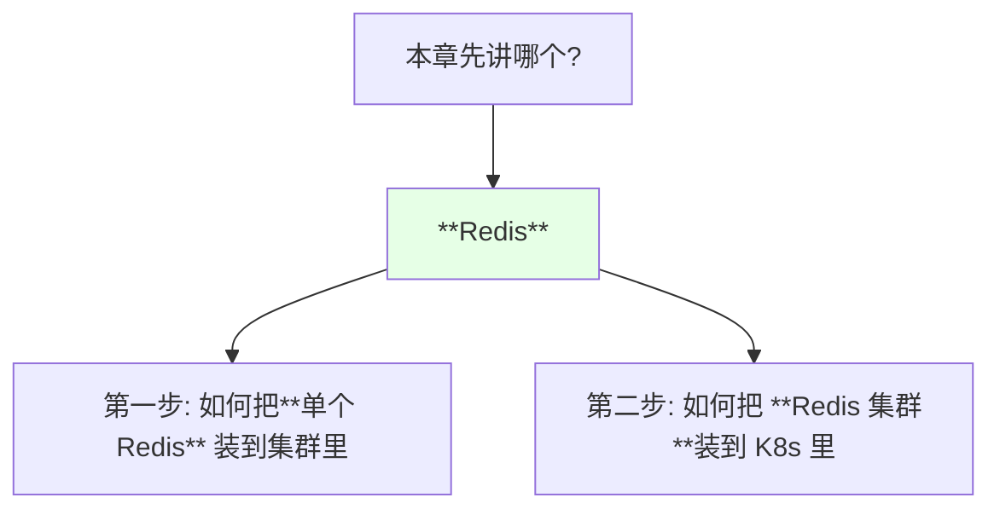

## API 速览

| 主题 | 后续会用到的能力 | 关键点 |
| --- | --- | --- |
| 中间件部署 | 单实例 → 集群，operator / StatefulSet | **流程是通用的** |
| Helm | `helm install` / 自己写 chart | 打包与参数化 |
| 监控 | Prometheus + 黑盒 + JVM | **集群内外都能监控** |
| 日志 | 控制台日志 / 容器内文件日志 | 两种采集方式 |
| 存储基础 | PVC / SC / 动态存储 | 有状态中间件必备 |

## Demo 示例

```bash
# 这一节是路线说明, 先把后面会频繁用到的检查命令备好

# 1. 看集群当前能装东西的命名空间
kubectl get ns

# 2. 看之前建好的 StorageClass（有状态中间件要用）
kubectl get sc

# 3. 看集群节点资源（中间件要考虑资源请求）
kubectl get nodes
kubectl describe nodes | head -40

# 4. 后面装中间件时, 最常见的观察动作
kubectl get pods -w
kubectl get svc
kubectl get pvc -A

# 5. 排障三件套
NS=default
POD=$(kubectl get pods -n "$NS" -o jsonpath='{.items[0].metadata.name}')
kubectl describe pod "$POD" -n "$NS"
kubectl logs "$POD" -n "$NS"
```

```text
本章的知识地图:

中间件容器化
├── 形态:      单实例  →  集群
├── 方式:      operator / StatefulSet
├── 打包:      Helm（用到能自己写 chart）
├── 监控:      Prometheus（内部 + 外部 + 黑盒 + JVM）
└── 日志:      控制台日志 / 容器内文件日志

第一站: Redis
   ├── 1) 安装单个 Redis 到 K8s
   └── 2) 安装 Redis 集群到 K8s
```

### 总结

- **存储章节结束，接下来讲在 K8s 集群里安装与使用常用中间件 / 第三方工具**，以及**如何把项目或中间件容器化并部署进集群**；
- **清单是 Redis / RabbitMQ / Kafka / ZooKeeper**，而且**单实例与集群两种形态都会讲**（以 Redis 为例：先单实例、再集群）；
- **真正的目标是举一反三** —— 这些中间件的**安装方式其实都差不多**，重点是掌握「把一个中间件正确部署到 K8s 的流程」，而不是只会装某一个；
- **安装方式会覆盖 operator 与 StatefulSet 两条路**；**Helm 会讲到能自己编写 chart**；
- **监控转向 Prometheus 这类云原生方案**：Zabbix / Open-falcon 本身很好，但**对容器与 K8s 的集成还不够好**；**Prometheus 不只监控集群内部，外部程序也能监控**，还会覆盖**接口类黑盒监控**和 **Java 应用的 JVM / GC 指标**；
- **日志收集讲两个方面**：**容器控制台日志**与**打到容器内文件中的日志**，各有各的采集方式；本章第一站是 **Redis**。

