# Kubernetes 集群部署: 如何把一个容器部署到 K8s（以单实例 Redis 为例：官方镜像、ConfigMap、Service 与接口级健康检查）

这一節名义上是「装单实例 Redis」，实质是讲**一套可复制的中间件容器化流程**。学会它，换 RabbitMQ、Kafka 也能自己推出来。

结论先摆：

1. **目标不是「会装 Redis」，而是掌握「把一个已容器化的中间件部署到 K8s」的流程** —— 要能**举一反三**；
2. **第一步永远是先到 Docker 官方镜像仓库找官方镜像**（带 official image 标记），**第三方镜像要非常小心**（存在被植入挖矿、肉机程序的风险）；
3. **做镜像时不要拿 CentOS 7 这类大镜像直接改**，推荐 **alpine**（基本功能都有、镜像极小）；实在要自己做就**照着官方的 Dockerfile 做**；
4. **很多中间件把配置做成了环境变量注入** —— 这是最好的方式，**不用去改它的配置文件**；没有抽成变量的（如 Redis）就用 **ConfigMap 挂配置文件**；
5. **所有中间件一律用 K8s 的 Service 调用**，不要用 Pod IP、也不要暴露 NodePort —— **Service 创建后名字固定不变**，能让多套环境共用同一份配置，实现**从测试环境无缝迁到生产**；
6. **健康检查最好用接口级** —— 端口级检测有「假死」盲区（端口活着但内部已经不工作）；
7. **Redis 这类有状态应用不能直接扩副本**（一个容器有这个 key、另一个没有），集群形态下一节再讲。

## 纲要

- 这一节真正要教的是什么
- 第一步：到官方镜像仓库找镜像
- official image 与第三方镜像的风险
- 自己做镜像时的两条建议
- 参考官方 Dockerfile
- 环境变量注入：最好的配置方式
- 用 ConfigMap 承载配置文件
- 组装 Deployment：关键几项
- 启动命令的坑：Redis 不用写 -c
- 用 Service 调用中间件，不要用 IP
- Service 让多环境共用一份配置
- 健康检查：接口级优于端口级
- 有状态应用不能直接扩副本
- 流程小结

## 这一节真正要教的是什么

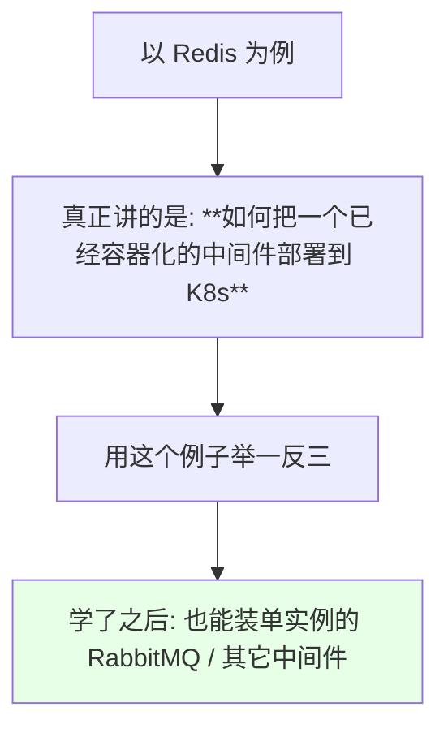

> 课程原话：**「这个例子不是单纯去讲如何安装一个 Redis 到我们集群当中，主要是想讲一下如何把一个已经容器化的中间件部署到我们的 K8s 里面……用它的例子让我们可以安装单个实例的 RabbitMQ，要学会这种举一反三的能力」**。

## 第一步：到官方镜像仓库找镜像

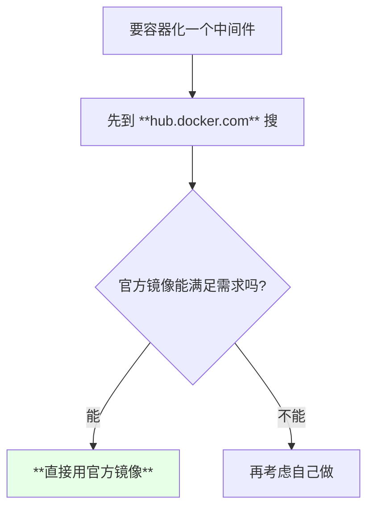

| 做法 | 建议 |
| --- | --- |
| 有官方镜像 | **直接用** |
| 官方镜像不合要求 | 自己做 |
| 自认为功底很强、能做得更小更稳 | 可以做，但要慎 |

> **一般情况下官方镜像就能满足常用需求** —— 除非你做的镜像比它更稳定或更小。

## official image 与第三方镜像的风险

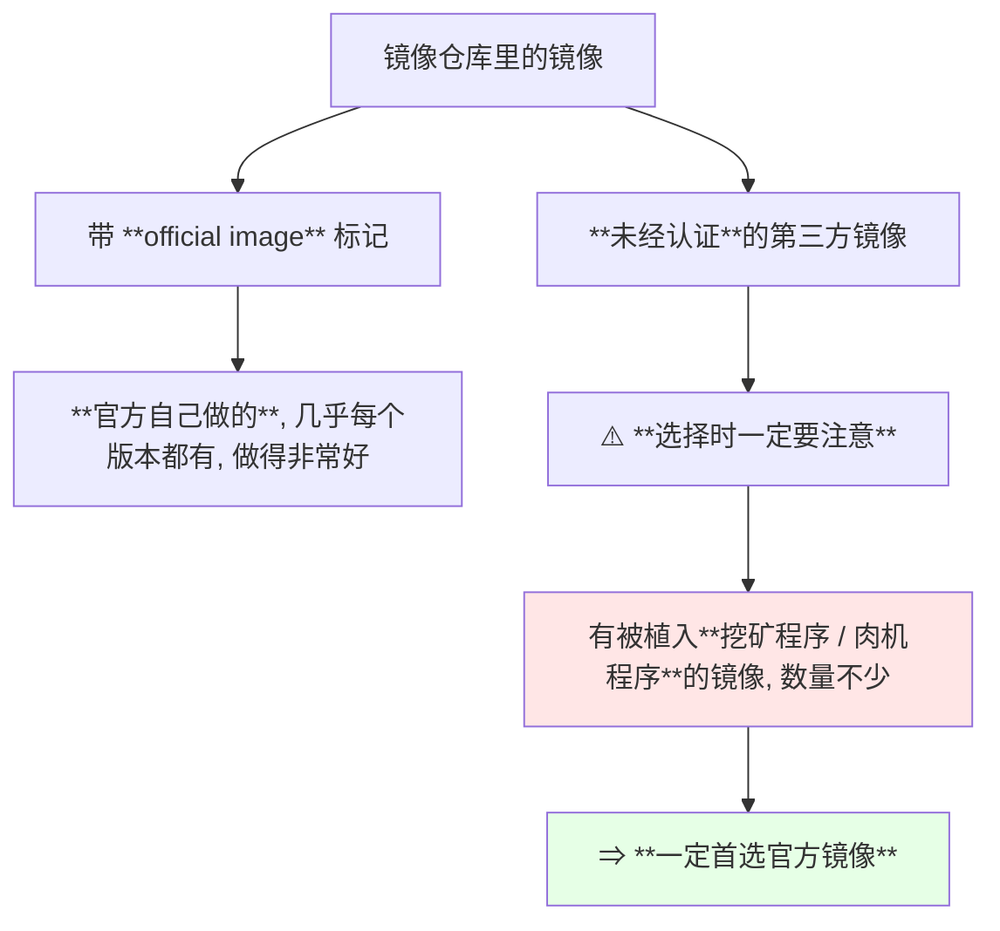

| 类型 | 风险 |
| --- | --- |
| **official image** | 低，官方维护、版本齐全 |
| 第三方镜像 | **可能被植入病毒 / 挖矿程序** |

> 课程原话：**「现在把 K8s 的机器当做肉机、当做挖矿工具的镜像有很多，就是已经装了病毒的镜像也是很多的，所以说一定要首先选这个官方的镜像」**。

## 自己做镜像时的两条建议

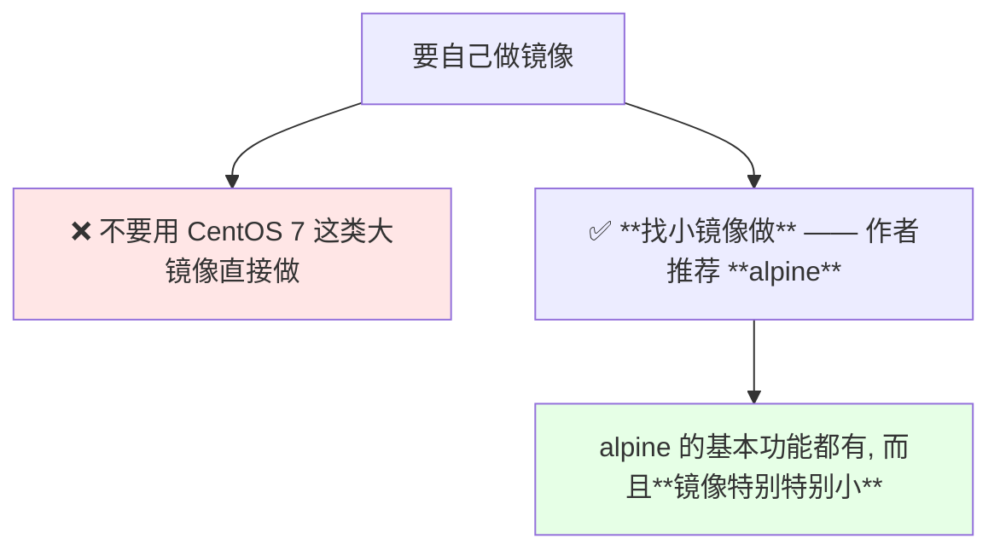

| 基础镜像 | 评价 |
| --- | --- |
| CentOS 7 等完整发行版 | 体积大，**不推荐** |
| **alpine** | **推荐**，基本功能齐全且极小 |

## 参考官方 Dockerfile

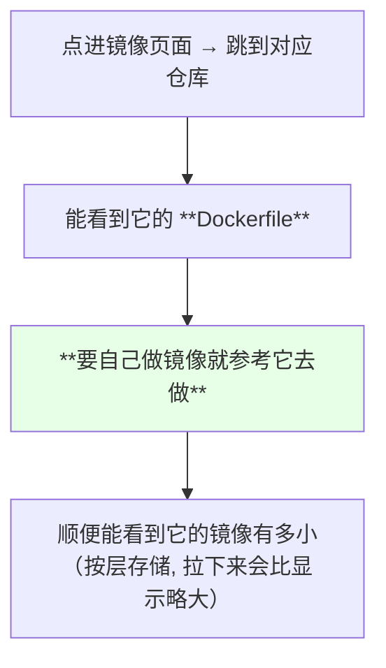

> 课程里的观察：**「容器化一个中间件的时候，一定要先看一下他们官方的镜像；如果说官方没有符合你要求的，你就按照他这个官方的 Dockerfile 去做一个属于自己的一个镜像」**。

## 环境变量注入：最好的配置方式

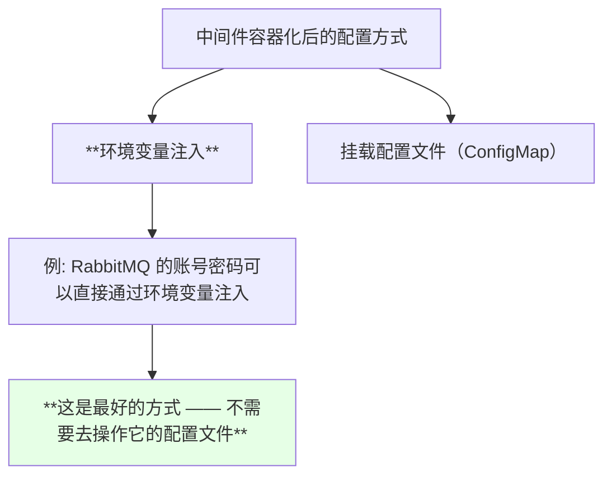

| 中间件 | 配置方式 |
| --- | --- |
| RabbitMQ | **很多配置都能通过环境变量注入** |
| Redis | 页面上没写这些变量（这次用配置文件挂载） |

> 以前部署中间件都是改配置文件，容器化之后**能通过环境变量注入是最好**的。

## 用 ConfigMap 承载配置文件

Redis 配置没有抽成环境变量，于是用之前讲过的 **ConfigMap**：

```bash
kubectl create configmap redis-single-conf \
  --from-file=redis.conf=./redis.conf
kubectl get configmap redis-single-conf -o yaml
```

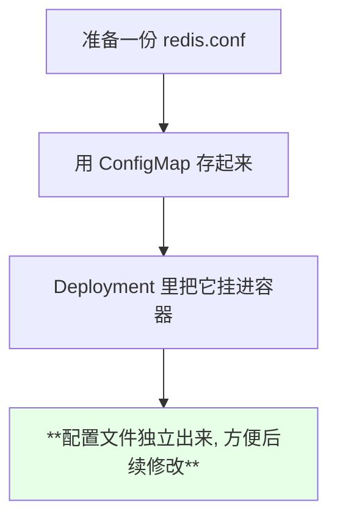

> 课程强调：**「它的配置文件我们肯定是要独立出来的，肯定是要独立出来，也方便我们修改」**。

## 组装 Deployment：关键几项

```text
Deployment 表单里需要动的几项:

├── 集群 / namespace
├── 名称: redis-single
├── 重启策略: Always
├── DNS 策略: 按需
├── **节点故障停留时间: 改成 30 秒**
├── 私有仓库的 Secret: 没有就用默认的
├── label / annotation / nodeSelector: 按需
├── **挂载 ConfigMap**（redis-single-conf）
├── 镜像地址（如 redis:5.0.4-alpine）
├── 启动命令
├── 内存 / CPU 限制: 按需
├── 健康检查: tcpSocket 6379（Redis 启动很快）
├── imagePullPolicy: **IfNotPresent**
└── 端口: 6379
```

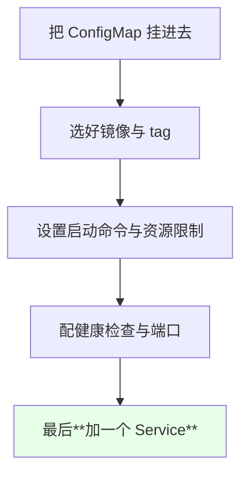

## 启动命令的坑：Redis 不用写 -c

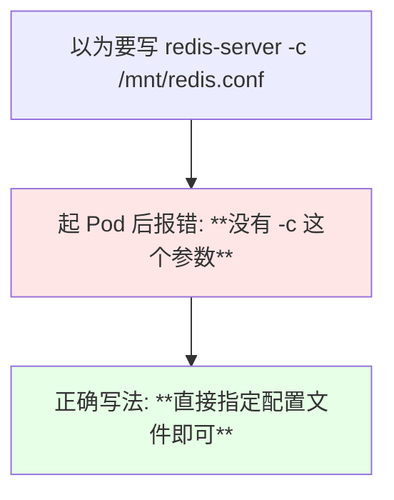

```bash
# 下面命令中的变量按你的集群环境赋值后再执行
kubectl logs $POD
# 报错: 没有 -c 这个参数
```

> 作者现场排了一下：**「Redis 启动的时候应该不用写 -c，直接应该就是直接指定它的配置文件就可以」**。这类小坑**看一眼容器日志就能定位**。

## 用 Service 调用中间件，不要用 IP

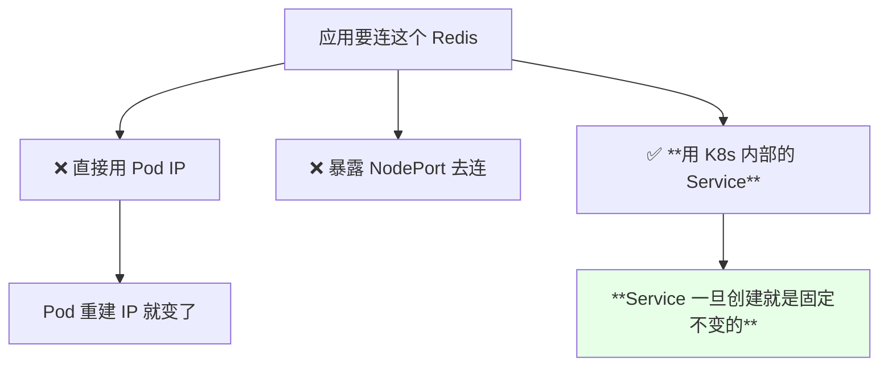

> 课程说得很明白：**「我们不能通过 Pod IP 直接去调；我们所有中间件的配置都应该用 K8s 的 Service 去调用，不要使用那个 IP 地址去调，或者是暴露那个 NodePort。最好的方式就是我们是用它的内部 Service」**。

## Service 让多环境共用一份配置

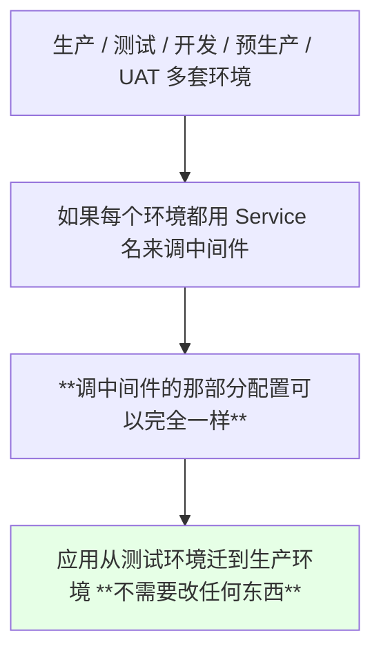

| 方式 | 迁环境时 |
| --- | --- |
| 用 IP / NodePort | 每个环境都要改配置 |
| **用 Service 名** | **配置统一，可无缝迁移** |

> 课程原话：**「你可以统一他们的配置文件……就比如说你 Java 在测试环境启动或者生产环境启动的配置文件是不一样的、配置参数是不一样的，但是我们用了 Service 之后它调中间件的这个配置可以是一样的；所以我们可以无缝地把一个应用从测试环境迁到我们生产环境，不需要改任何东西就可以直接应用」**。

## 健康检查：接口级优于端口级

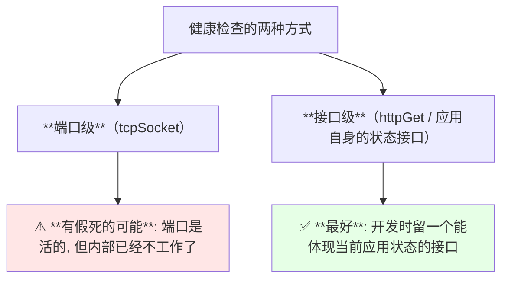

> 课程原话：**「最好的健康检查方式就是用那个接口级的相关检查，就是我们开发应用程序的时候，一定要留一个能体现当前这个应用状态的一个接口；你用这个端口去检测的话，其实它有这种假死的可能性，就是它的端口是活的，但它内部已经不工作了，所以说这个是不可靠的」**。

Redis 这类没有 http 接口的，常用做法就是 **tcpSocket 6379**（也可以用 ping/pong 那类命令去检查）。

## 有状态应用不能直接扩副本

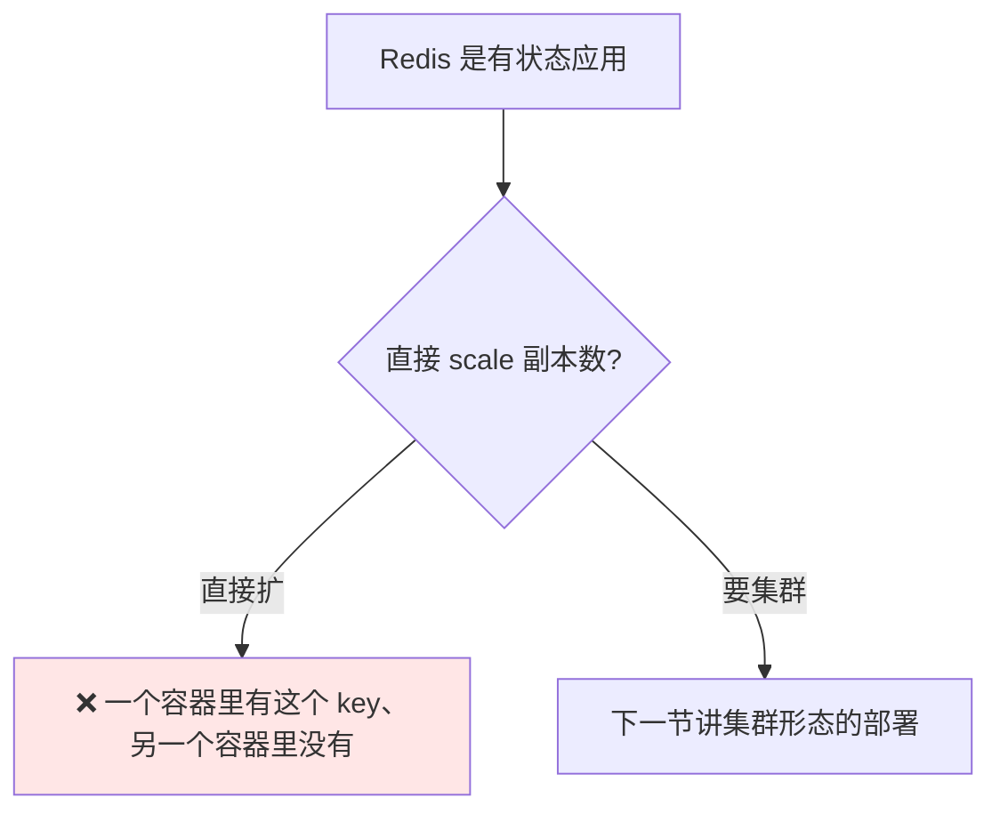

> 课程提醒：**「Redis 属于这种有状态的应用，你用这个直接扩是不行的，因为可能导致一个容器里面有这个 key、一个容器里面没有这个 key；如果要做集群的话，我们下节课会讲这个集群该怎么部署」**。

## 流程小结

```text
容器化一个中间件到 K8s 的标准流程:

1. 到官方镜像仓库搜索 → **优先选 official image**
2. 看它的页面: 支持哪些 tag、有哪些环境变量可用
   （需要自己做镜像就参考官方 Dockerfile, 用 alpine 这类小镜像）
3. 准备配置
   ├── 能环境变量注入 → 用环境变量（最好）
   └── 只能配置文件   → 用 **ConfigMap** 独立出来
4. 组装 Deployment
   ├── 镜像 + tag, imagePullPolicy: IfNotPresent
   ├── 挂载 ConfigMap
   ├── 启动命令 / 资源限制 / 端口
   └── 健康检查（**优先接口级**）
5. **加一个 Service**（ClusterIP）
   └── 应用一律通过 Service 名调用, 不用 IP / NodePort
6. 看日志验活, 有报错就 kubectl logs / describe

⇒ 就这几步, 换任何中间件都是同一套
```

## API 速览

| 能力 | 做法 | 关键点 |
| --- | --- | --- |
| 找官方镜像 | 官方镜像仓库搜，认 **official image** 标记 | 第三方镜像有被植入程序的风险 |
| 建 ConfigMap | `kubectl create configmap <NAME> --from-file=<KEY>=<FILE>` | key 就是文件名 |
| 看 ConfigMap | `kubectl get configmap <NAME> -o yaml` | — |
| 部署 | 写 Deployment 或直接在平台上生成 | 配置文件独立挂进去 |
| 看启动报错 | `kubectl logs <POD>` | 参数写错一眼就能看出来 |
| 加 Service | ClusterIP | **应用一律用 Service 名调用** |
| 看 Service | `kubectl get svc` | ClusterIP 固定不变 |
| 健康检查 | 优先接口级，Redis 可用 tcpSocket 6379 | 端口级有假死盲区 |

字段速查：

| 字段 | 作用 |
| --- | --- |
| `containers[].image` | 镜像地址与 tag |
| `containers[].imagePullPolicy` | 用 `IfNotPresent` |
| `containers[].env` | **环境变量注入（首选配置方式）** |
| `volumes[].configMap.name` | 挂载 ConfigMap |
| `containers[].volumeMounts[].readOnly` | 配置文件通常只读挂载 |
| `containers[].livenessProbe.tcpSocket.port` | 无 http 接口时的健康检查 |
| `tolerations[].tolerationSeconds` | 节点故障后多久迁走（演示设 30 秒） |
| `Service.spec.type: ClusterIP` | 内部 Service |

## Demo 示例

```bash
# 1. 准备配置文件（按自己需求改）
vi redis.conf
# bind 0.0.0.0
# protected-mode no
# port 6379
# appendonly yes
# dir /data

# 2. 建成 ConfigMap
NS=default
kubectl create configmap redis-single-conf \
  --from-file=redis.conf=./redis.conf -n "$NS"
kubectl get configmap redis-single-conf -n "$NS"

# 3. 部署 Deployment（挂载 ConfigMap + 用 ClusterIP Service）
kubectl apply -f redis-single.yaml -n "$NS"
kubectl get pods -w

# 4. 起不来就看日志（参数写错这一类问题都在这里）
POD=$(kubectl get pods -n "$NS" -l app=redis-single -o jsonpath='{.items[0].metadata.name}')
kubectl logs "$POD" -n "$NS"
kubectl describe pod "$POD" -n "$NS"

# 5. 用 Service 名在集群内验证
kubectl run redis-cli --rm -it --image=redis:5.0.4-alpine -n "$NS" -- \
  redis-cli -h redis-single -p 6379 ping
# PONG

# 6. 确认 Service 的 ClusterIP（重建 Pod 不会变）
kubectl get svc redis-single -n "$NS"
```

```yaml
# redis-single.yaml —— 单实例 Redis（ConfigMap + Deployment + Service）
apiVersion: v1
kind: ConfigMap
metadata:
  name: redis-single-conf
  namespace: default
data:
  redis.conf: |
    bind 0.0.0.0
    protected-mode no
    port 6379
    appendonly yes
    dir /data
---
apiVersion: apps/v1
kind: Deployment
metadata:
  name: redis-single
  namespace: default
  labels:
    app: redis-single
spec:
  replicas: 1
  selector:
    matchLabels:
      app: redis-single
  template:
    metadata:
      labels:
        app: redis-single
    spec:
      tolerations:
      - key: node.kubernetes.io/not-ready
        operator: Exists
        effect: NoExecute
        tolerationSeconds: 30
      containers:
      - name: redis
        image: redis:5.0.4-alpine
        imagePullPolicy: IfNotPresent
        command:
        - redis-server
        - /mnt/redis.conf
        ports:
        - containerPort: 6379
          name: redis
        livenessProbe:
          tcpSocket:
            port: 6379
          initialDelaySeconds: 10
          periodSeconds: 10
        readinessProbe:
          tcpSocket:
            port: 6379
          initialDelaySeconds: 5
          periodSeconds: 5
        resources:
          requests:
            memory: 128Mi
            cpu: 100m
          limits:
            memory: 512Mi
            cpu: 500m
        volumeMounts:
        - name: redis-conf
          mountPath: /mnt
          readOnly: true
      volumes:
      - name: redis-conf
        configMap:
          name: redis-single-conf
---
apiVersion: v1
kind: Service
metadata:
  name: redis-single
  namespace: default
spec:
  type: ClusterIP
  ports:
  - port: 6379
    targetPort: 6379
  selector:
    app: redis-single
```

```text
调用中间件的方式对比:

方式              稳定性                        迁环境时
──────────────────────────────────────────────────────────
Pod IP            重建即变, 不可靠              每环境都要改配置
NodePort          暴露到节点, 增加攻击面         同上
**Service 名**    **创建后固定不变**              **多环境配置可统一**
```

### 总结

- **这一節的重点不是「装 Redis」，而是掌握一套可复制的流程** —— 学完之后换成 RabbitMQ、Kafka 也能自己推出来，**必须会举一反三**；
- **第一步永远是到官方镜像仓库找带 official image 标记的镜像**；**第三方镜像风险很高**（有大量被植入挖矿 / 肉机程序的镜像）；
- **自己做镜像不要用 CentOS 7 这类大镜像**，推荐 **alpine**；真要做就**照着官方的 Dockerfile 改**；
- **配置优先用环境变量注入**（这是最好的方式，不用改配置文件）；没有抽成变量的（如 Redis）就用 **ConfigMap 把配置文件独立挂载**出来，方便后续修改；
- **访问中间件一律用 K8s 内部的 Service，不用 Pod IP、也不用 NodePort** —— **Service 创建后固定不变**，能让多套环境共用同一份配置，**实现从测试环境到生产环境的无缝迁移**；
- **健康检查优先用接口级**：端口级检测存在「假死」盲区（端口活着但内部不工作）；Redis 这类没有 http 接口的可以用 tcpSocket 6379；
- **Redis 是有状态应用，不能直接扩副本**（key 会不一致），集群形态在下一节讲；整套流程总结起来就三步：**找官方镜像 → 配置（环境变量 / ConfigMap）→ 加 Service**，出错时看 `kubectl logs` 基本就能定位（作者现场就是这么发现 Redis 不该写 `-c` 的）。

