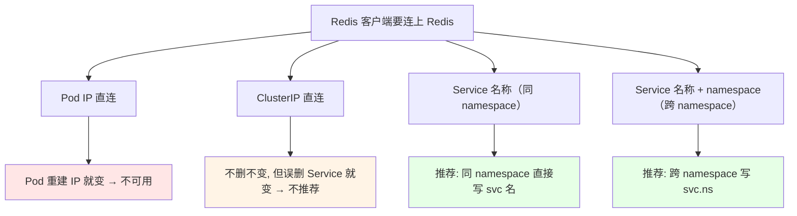
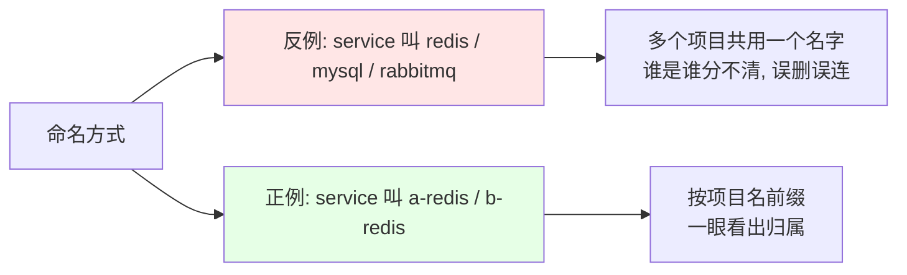
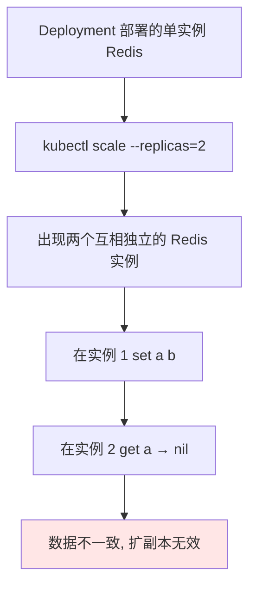
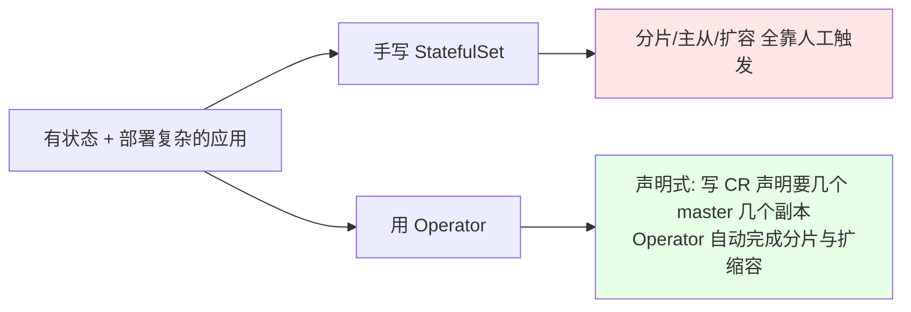
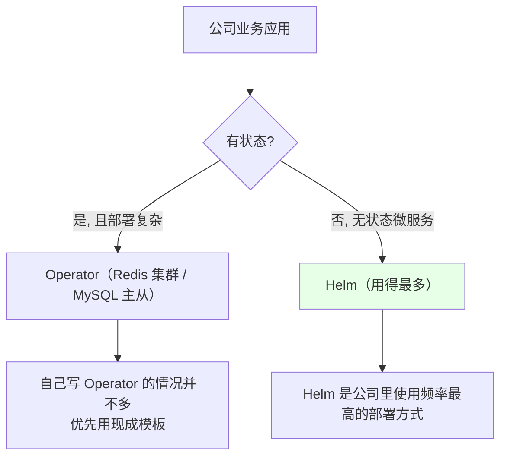

# Kubernetes 集群部署: 部署 Redis Operator（单实例 Redis 的连接方式、Service 命名与 Operator 选型）

上一节把单节点 Redis 用 Deployment 跑起来了，这一节解决两件事：**单实例 Redis 到底该怎么连**（Pod IP / ClusterIP / Service 名称三种写法哪个能用哪个是坑），以及**为什么集群版不能继续用 Deployment 扩副本，而要换成 Operator**。

结论先摆：

1. **连接中间件只用 Service 名称，别用 IP**：Pod IP 会漂、ClusterIP 一旦误删 Service 就变，只有 Service 名称（同 namespace 直接写 `<svc>`，跨 namespace 写 `<svc>.<ns>`）是稳定的；
2. **Service 名称不要和中间件同名**：不要单独叫 `redis`，按项目命名 `a-redis` / `b-redis`，MySQL、RabbitMQ 同理；
3. **单实例是「有状态应用」，扩副本不好使**：把 `replicas` 改成 2 会出现「在这个实例里写的数据，在那个实例里没有」，要做多份必须上集群或主从；
4. **集群版不要手写 StatefulSet**：手写要自己进容器手动创建分片、扩容还要重新分片，非常不灵活 → 交给 **Operator**；
5. **Operator 不必自己写**：`operatorhub.io` 上现成的模板直接拿来用，优先选官方维护的，没有官方就选 star 多的；本课程用的是 **ucloud 开源的 redis-cluster-operator**。

## 纲要

- 单实例 Redis 的连接方式：Pod IP / ClusterIP / Service 名称
- Service 命名规范：不要叫 redis，按项目命名
- 多个 Redis 怎么放：共用放公共 namespace，各自用按项目 namespace 隔离
- 为什么单实例不能靠扩副本变集群
- 手写 StatefulSet 部署集群的短板
- Operator 解决什么问题、适合什么应用
- operatorhub 上怎么挑 Operator
- 生产环境里 Operator 与 Helm 的分工

## 单实例 Redis 的三种连接方式

Redis 部署好后 Service 暴露 `6379` 指向容器的 `6379`，客户端有四种连法，但**只有最后一种该用在生产**。



| 连接方式 | 示例 | 稳定性 | 建议 |
| --- | --- | --- | --- |
| Pod IP | `10.244.1.23:6379` | 最差，Pod 重建即失效 | 只用于临时 `kubectl exec` 验证 |
| ClusterIP | `10.96.33.12:6379` | 不删 Service 就不变 | **不推荐**，误删就断 |
| Service 名称 | `redis-a:6379` | 稳定，kube-dns 自动解析 | **推荐**（同 namespace） |
| Service 名称 + namespace | `redis-a.public-service:6379` | 稳定 | **推荐**（跨 namespace） |

验证方式就是进容器用自带的 `redis-cli`：

```bash
# 1. 用 Service 名称连（同 namespace 最推荐的写法）
kubectl exec -it redis-client -- redis-cli -h redis-a -p 6379

# 2. 连上后读写验证
127.0.0.1:6379> set a b
OK
127.0.0.1:6379> get a
"b"

# 3. 客户端和 Redis 不在同一个 namespace 时, 名称后面补 namespace
kubectl exec -it redis-client -n app-a -- redis-cli -h redis-a.public-service -p 6379

# 4. ClusterIP 写法（能用但不推荐）
kubectl exec -it redis-client -- redis-cli -h 10.96.33.12 -p 6379
```

## Service 命名规范：不要叫 redis

这一条是实操里最容易埋雷的地方：**Service 名称不要和中间件类型同名**。



| 场景 | 错误命名 | 正确命名 |
| --- | --- | --- |
| A 项目的 Redis | `redis` | `a-redis` |
| B 项目的 Redis | `redis` | `b-redis` |
| A 项目的 MySQL | `mysql` | `a-mysql` |
| 订单服务 RabbitMQ | `rabbitmq` | `order-rabbitmq` |

多个 Redis 怎么放，按「是否共用」分两种：

```text
两种摆放方式（按业务是否共用来选）:

1. 多个项目共用同一个 Redis
   └── 单独放一个公共 namespace（如 public-service）
       ├── redis
       ├── rabbitmq
       └── 其它公共服务

2. 每个项目各自一个 Redis
   └── 按 namespace 隔离（一个 namespace 对应一个项目）
       ├── namespace app-a  →  a-redis
       ├── namespace app-b  →  b-redis
       └── namespace app-c  →  c-redis
```

现在大部分业务是容器化 / 微服务开发，Redis 这类中间件普遍**比较轻量**（单实例或小集群），所以按 namespace 隔离是更常见的做法。

## 为什么单实例不能靠扩副本变集群

Redis 是**有状态应用**，每个实例自己的数据互不共享。



```bash
# 错误示范：想靠扩副本做成「多份 Redis」
kubectl scale deployment redis-a --replicas=2
# 结果：两个实例各存各的, 客户端随机落到其中一个, 数据看运气

# 正确方向：要做多份就上集群或主从, 而不是加副本数
```

顺带一提，单实例改集群模式时**启动命令也会变**：不再是直接 `redis-server`，而是要带上集群配置文件；不同版本的 Redis 镜像部署方法一致，只改镜像 tag 即可。

健康检查也按中间件自己的端口来配：Redis 是 `6379`，RabbitMQ 是 `5672` / `15672`。内存 `limits` 课程里给得偏小，生产按需调。

## 手写 StatefulSet 部署集群的短板

用 StatefulSet 部署 Redis 集群是可行的，但不够灵活：

```text
手写 StatefulSet 部署 Redis 集群的工序:

1. 写 StatefulSet + Headless Service
2. Pod 全部 Ready
3. 进容器手动执行集群创建命令（meet / 分配槽位）
4. 手动完成分片
5. 以后每次扩容 → 再手动重新分片一遍
   └── 麻烦, 且容易出错
```



## Operator 解决什么问题

Operator 的定位就是**适合有状态、且部署配置比较复杂的应用**：

| 应用 | 复杂在哪 | 用 Operator 的收益 |
| --- | --- | --- |
| Redis 集群 | 要分片、扩容要重新分片 | 声明式创建 + 自动分片 |
| MySQL 主从 / MGR / 一主多从 | 主从关系、切换都要人工配 | 一键搭集群 |
| etcd 集群 | 成员关系、TLS 复杂 | 官方 Operator 直接托管 |
| Prometheus | 抓取配置繁琐 | 课程后续就用 Operator 部署 |
| MongoDB、Oracle DB、Percona | 集群编排复杂 | 官方模板可直接用 |

## operatorhub 上怎么挑 Operator

```bash
# 1. 打开 operatorhub.io, 搜索需要的中间件（如 redis）
# 2. 挑选原则：
#    有官方维护的 → 用官方
#    没有官方的   → 选 star 多的
# 3. 本次课程用的是中国人开源、ucloud 公司的 redis-cluster-operator
#    （文档风格对中文用户更友好）
```

```text
operatorhub 上常见的几类 Operator（课程里逐个点评过）:

operatorhub.io
├── Databases
│   ├── Redis        → 本次用的 ucloud redis-cluster-operator
│   ├── MongoDB      → 官方维护
│   ├── Percona      → 第三方, 质量也不错
│   └── Oracle DB    → 官方写的, 支持一键建集群与扩容
├── Messaging
│   └── RabbitMQ     → 课程没用（RabbitMQ 直接扩就行）
├── Monitoring
│   └── Prometheus   → 后续课程采用
└── Storage
    └── Rook         → 云原生存储, 也是 Operator 形态
```

| 组件 | 课程建议 |
| --- | --- |
| GitLab | **不建议放容器里**，可能影响性能，单独找虚机 |
| Jenkins | **不建议放容器里**，同上 |
| Grafana | 太简单，**没必要**用 Operator，大材小用 |
| RabbitMQ | 直接扩副本即可，用 StatefulSet 的服务发现就够了 |
| Prometheus | **建议用 Operator**，确实好用 |
| etcd / Rook / TiDB | 用 Operator |

## 生产环境里 Operator 与 Helm 的分工



自己手写 Operator 在生产环境里**并不多**：公司业务大多是无状态微服务，Helm 用得最多；Operator 主要用在自建开源框架 / 复杂中间件上。本课程不讲 Operator 的写法（写起来比 Helm 麻烦，用得也少），重点放在**如何用现成的 Operator**。

## API 速览

| 能力 | 做法 |
| --- | --- |
| 验证单实例 Redis | `kubectl exec -it <pod> -- redis-cli -h <svc> -p 6379` |
| 读写入门验证 | `set a b` → `get a` |
| 同 namespace 连接 | `redis-cli -h redis-a -p 6379` |
| 跨 namespace 连接 | `redis-cli -h redis-a.public-service -p 6379` |
| 查看 Service 暴露的端口映射 | `kubectl get svc` 看 `6379:6379` |
| 找现成 Operator | 在 `operatorhub.io` 搜关键字，官方优先、其次 star 多的 |
| 扩副本（对有状态应用无效） | `kubectl scale deployment <name> --replicas=N` |

## Demo 示例

```bash
# 1. 按项目名创建 Redis（Service 名称带项目前缀）
cat <<'EOF' | kubectl apply -f -
apiVersion: apps/v1
kind: Deployment
metadata:
  name: a-redis
  namespace: app-a
spec:
  replicas: 1
  selector:
    matchLabels:
      app: a-redis
  template:
    metadata:
      labels:
        app: a-redis
    spec:
      containers:
        - name: redis
          image: redis:5.0.4-alpine
          command: ["redis-server"]
          ports:
            - containerPort: 6379
          readinessProbe:
            tcpSocket:
              port: 6379
            initialDelaySeconds: 5
            periodSeconds: 10
          resources:
            requests:
              memory: 256Mi
            limits:
              memory: 512Mi
---
apiVersion: v1
kind: Service
metadata:
  name: a-redis
  namespace: app-a
spec:
  type: ClusterIP
  selector:
    app: a-redis
  ports:
    - port: 6379
      targetPort: 6379
EOF

# 2. 用 Service 名称连接并读写验证
kubectl run redis-client -n app-a --rm -it --image=redis:5.0.4-alpine \
  -- redis-cli -h a-redis -p 6379
# > set a b
# > get a

# 3. 跨 namespace 连接
kubectl run redis-client -n app-b --rm -it --image=redis:5.0.4-alpine \
  -- redis-cli -h a-redis.app-a -p 6379

# 4. 清理单实例（准备换成 Operator 部署集群版）
kubectl delete deployment a-redis -n app-a
kubectl delete svc a-redis -n app-a
```

### 总结

- **连接中间件一律用 Service 名称**，不用 Pod IP（会漂），也不用 ClusterIP（Service 误删就变）；同 namespace 写 `<svc>`，跨 namespace 写 `<svc>.<namespace>`；
- **Service 名称不要和中间件同名**，别起一个孤零零的 `redis`，按项目命名成 `a-redis` / `b-redis`，MySQL、RabbitMQ 同样处理；
- **多个 Redis 的摆放按共用与否决定**：共用放公共 namespace（如 `public-service`），各项目独立就按项目 namespace 隔离，一个 namespace 对应一个项目；
- **单实例 Redis 是有状态应用，扩副本做不成集群**，会出现「这个实例里有、那个实例里没有」的数据不一致，要做多份必须上集群或主从；
- **手写 StatefulSet 部署集群要手动创建分片、扩容还要再手动分片一次**，非常不灵活，这类「有状态 + 配置复杂」的场景正是 Operator 的用武之地；
- **Operator 不用自己造轮子**：`operatorhub.io` 上现成模板直接用，优先官方维护的，没有官方就选 star 多的；本课程用 ucloud 开源的 `redis-cluster-operator`，另外 GitLab / Jenkins 不建议容器化，Grafana 用 Operator 属于大材小用，生产里 Helm 的使用频率远高于 Operator。

