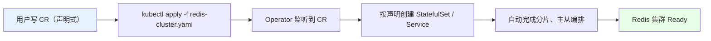
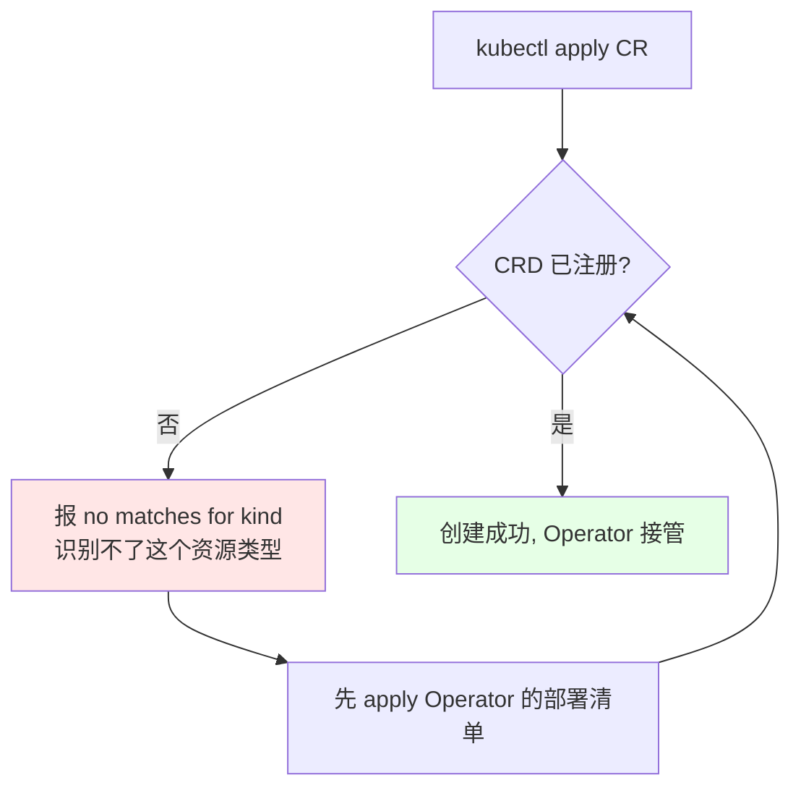

# Kubernetes 集群部署: 在 k8s 上部署 Redis 集群上（Operator 的 CR 声明、master 与副本计算、CRD 前置依赖）

这一节开始真正用 `redis-cluster-operator` 建集群。核心就两件事：**用声明式的 CR（Custom Resource）描述「我要什么样的 Redis 集群」**，以及**一个必踩的坑 —— 没装 Operator 就直接 apply CR，k8s 根本识别不了这个资源类型**。

结论先摆：

1. **CR 就是一份声明**：写清楚几个 master、每个 master 几个副本、用什么镜像，Operator 负责把分片这些脏活干完；
2. **容器总数 = master 数 ×（1 + 每 master 副本数）**，3 个 master 各 1 个副本就是 6 个 Redis 容器；
3. **CRD 必须先注册进集群**：`kubectl apply` CR 报「没有这个 kind / 没有发现这个资源」，说明 Operator 还没装，不是 yaml 写错了；
4. **Operator 的作用域有两种**：namespace 级（只管一个 namespace）和集群级（管所有 namespace 的 Redis 集群），要在多个 namespace 部署 Redis 就选集群级。

## 纲要

- Operator 目录与部署文档在哪
- CR 声明式创建 Redis 集群
- master 与副本数的计算方式
- CRD 未注册时的报错与处理顺序
- Operator 的 namespace 级与集群级作用域
- 创建 Operator 时指定 namespace

## CR 声明式创建 Redis 集群

Operator 下载解压后，文档里有 `deploy/redis-cluster-operator` 相关的模板文件，其中最简单的一份就是「创建一个简单集群」的 CR 示例。



这份 CR 里声明的集群规格：

| 字段 | 示例值 | 含义 |
| --- | --- | --- |
| master 数量 | `3` | 集群有 3 个 master 分片 |
| 每个 master 的副本数 | `1` | 每个 master 带 1 个从副本 |
| 镜像 | `redis:5.0.4-alpine` | 课程已提前下载好该镜像 |
| 创建出的容器数 | `6` | 3 个 master + 3 个副本 |

```yaml
# redis-cluster.yaml —— 声明式 CR
apiVersion: redis.kun/v1alpha1
kind: DistributedRedisCluster
metadata:
  name: example-distributedrediscluster
spec:
  masterSize: 3
  clusterReplicas: 1
  image: redis:5.0.4-alpine
```

```text
容器总数的算法（别凭感觉数）:

masterSize = 3, clusterReplicas = 1

├── master-0  →  1 个副本
├── master-1  →  1 个副本
└── master-2  →  1 个副本

总容器数 = masterSize × (1 + clusterReplicas)
        = 3 × (1 + 1)
        = 6
```

## CRD 没注册就 apply CR 会报什么

课程里实踩的顺序错误：**CR 先 apply 了，Operator 还没创建**。

```bash
# 错误顺序：直接 apply CR
kubectl apply -f redis-cluster.yaml
# error: unable to recognize "redis-cluster.yaml": no matches for kind "DistributedRedisCluster"
# 或者提示：the server doesn't have a resource type "distributedrediscluster"

# 正确顺序：先装 Operator（它会注册 CRD），再 apply CR
kubectl apply -f operator/            # ① 装 Operator，注册 CRD
kubectl get crd | grep redis          # ② 确认 CRD 已存在
kubectl apply -f redis-cluster.yaml   # ③ 这时 CR 才认得
```



## Operator 的两种作用域

Operator 的部署清单里通常同时提供两种绑定方式：

| 作用域 | 绑定对象 | 适用场景 |
| --- | --- | --- |
| **namespace 级** | `Role` + `RoleBinding` | 只在一个 namespace 里部署 Redis 集群 |
| **集群级** | `ClusterRole` + `ClusterRoleBinding` | 很多 namespace 都要部署 Redis 集群 |

```bash
# 集群级作用域的 Operator（课程里选的这种）
kubectl apply -f cluster/cluster-scoped/   # 内含 ClusterRole / ClusterRoleBinding

# 创建 Operator 时可以自己指定 namespace，课程演示用的是 default
kubectl apply -f operator.yaml -n $NS
kubectl get pod -n $NS | grep redis-cluster-operator
```

```text
Operator 部署清单的目录层级（ucloud redis-cluster-operator）:

redis-cluster-operator/
├── deploy/
│   ├── cluster/
│   │   ├── cluster-scoped/        ← 集群级（ClusterRole/ClusterRoleBinding）
│   │   └── namespace-scoped/      ← namespace 级（Role/RoleBinding）
│   ├── crds/                      ← CRD 定义，apply 后才有 DistributedRedisCluster 这个 kind
│   ├── operator.yaml              ← Operator 自身的 Deployment
│   └── examples/
│       └── simple-cluster.yaml    ← 本节用的「简单集群」CR 模板
└── README.md
```

> 课程备注：Operator 的镜像拉取较慢，CR 的创建演示放到下一节继续。

## API 速览

| 能力 | 做法 |
| --- | --- |
| 声明一个 Redis 集群 | `kubectl apply -f redis-cluster.yaml` |
| 确认 CRD 是否就绪 | `kubectl get crd \| grep redis` |
| 查看 Operator 是否Running | `kubectl get pod -n <ns> \| grep operator` |
| 指定 Operator 的 namespace | `kubectl apply -f operator.yaml -n <ns>` |
| 算容器总数 | `masterSize × (1 + clusterReplicas)` |
| 查 CR 创建出的集群 | `kubectl get distributedrediscluster` |

## Demo 示例

```bash
# 1. 解压 Operator 包，进入部署目录
tar -xzf redis-cluster-operator.tar.gz
cd redis-cluster-operator

# 2. 先注册 CRD + 部署 Operator（集群级作用域）
kubectl apply -f deploy/crds/
kubectl apply -f deploy/cluster/cluster-scoped/

# 3. 确认 CRD 已注册（这一步不做，第 5 步一定报错）
kubectl get crd | grep redis

# 4. 确认 Operator 的 Pod 起来了
kubectl get pod -n default | grep redis-cluster-operator

# 5. 创建名为 example 的简单集群（3 master + 每 master 1 副本 = 6 容器）
kubectl apply -f deploy/examples/simple-cluster.yaml -n app-a

# 6. 查看 Operator 编排出来的 Pod
kubectl get pod -n app-a
```

### 总结

- **Operator 部署 Redis 集群是声明式的**：写一份 CR 说清楚「几个 master、每个 master 几个副本、用什么镜像」，分片、主从编排这些复杂活由 Operator 自动完成，不用再进容器手动执行集群创建命令；
- **容器总数按 `masterSize × (1 + clusterReplicas)` 计算**，示例里 3 个 master、每个 1 个副本，一共创建 6 个 Redis 容器，镜像用 `redis:5.0.4-alpine`；
- **CRD 必须先于 CR 存在**：直接 `kubectl apply` CR 会报 `no matches for kind` / 找不到该资源类型，这种报错不是 yaml 写错，而是 Operator 还没装，按顺序先 apply Operator（含 CRD）再 apply CR 即可；
- **Operator 分 namespace 级和集群级两种作用域**，分别对应 `Role`/`RoleBinding` 和 `ClusterRole`/`ClusterRoleBinding`；要在多个 namespace 都部署 Redis 集群就选集群级；
- **创建 Operator 时可以自己指定 namespace**（课程演示用的是 `default`），生产环境建议单独起一个 namespace 放 Operator，和业务 namespace 分开。

