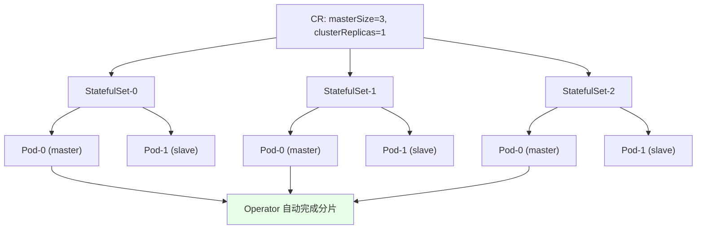
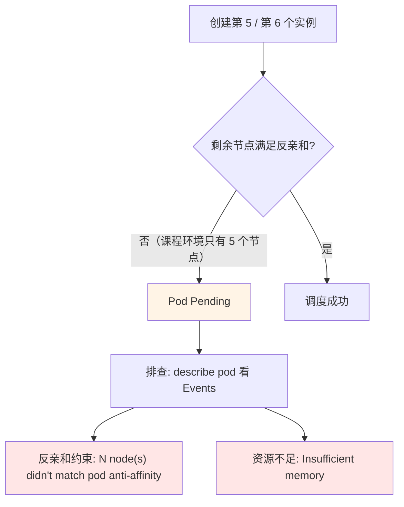
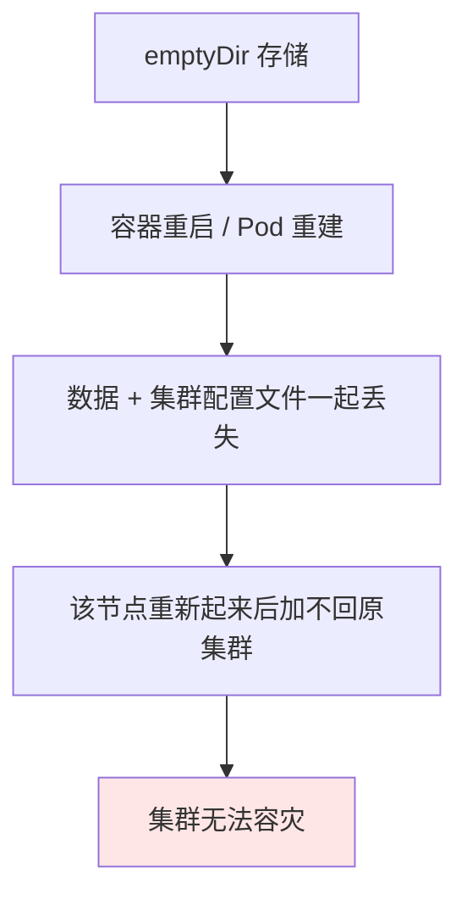
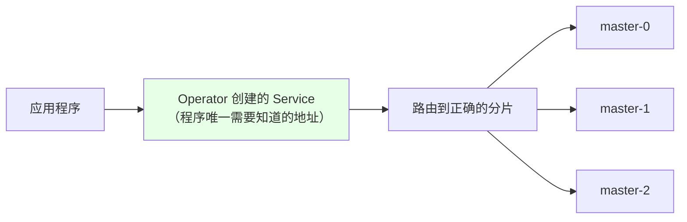

# Kubernetes 集群部署: 在 k8s 上部署 Redis 集群下（三主三从的 StatefulSet 结构、反亲和、持久化与分片路由）

上一节把 Operator 装上、CRD 注册好，这一节真正创建集群，并解决三个实战问题：**Operator 编排出来的结构长什么样**、**为什么默认配置下 Redis 挂一个节点就恢复不了**、**应用程序到底该连哪个地址、为什么要换集群版客户端**。

结论先摆：

1. **Operator 用的是「一个分片一个 StatefulSet」**：3 个 master 就是 3 个 StatefulSet，每个 StatefulSet 里 `-0` 是 master、`-1` 是 slave，主从不跨 StatefulSet；
2. **和手写方案的本质区别是自动分片**：手写那种 6 个实例共用一个 StatefulSet，还得进容器用工具手动分片；Operator 创建完就直接是分片好的集群；
3. **Operator 默认配了 Pod 反亲和（`podAntiAffinity`）**，保证 master 和 slave 不在同一台机器 —— 节点数不够就会有 Pod `Pending`，这是正常保护不是故障；
4. **默认存储是 `emptyDir`，容器重启数据就丢**，挂掉的节点没法重新加入集群，**生产必须做持久化**（写 `storageClassName`，实在没存储就用 hostPath + 节点标签固定）；
5. **应用连 Operator 创建的那个 Service 地址**，分片路由由它转发；但客户端必须用**集群版客户端**（Java 的智能客户端），单实例客户端会遇到重定向报错。

## 纲要

- Operator 日志与创建前的确认
- 三主三从的实际编排结构
- 手写 StatefulSet 与 Operator 的结构对比
- Pod 反亲和导致的 Pending 及处理
- Operator 资源的修改限制（有监听会被改回）
- 持久化：emptyDir 的坑与 storageClassName / hostPath 方案
- requests 与 limits 决定的 QoS 等级
- 应用连接地址与集群版客户端

## Operator 编排出来的结构



| 方案 | StatefulSet 数量 | 主从分布 | 分片 |
| --- | --- | --- | --- |
| **手写（课程早期 GitHub 版本）** | 1 个，跑 6 个实例 | 6 个实例挤在一起 | **必须手动进容器执行分片命令** |
| **redis-cluster-operator** | 3 个（= master 数） | 每个 StatefulSet 内 `-0` 为 master、`-1` 为 slave | **创建完成即自动分片** |

```text
Operator 编排出的资源结构:

namespace（业务命名空间）
├── StatefulSet  example-distributedrediscluster-0
│   ├── Pod …-0-0   ← master
│   └── Pod …-0-1   ← slave
├── StatefulSet  example-distributedrediscluster-1
│   ├── Pod …-1-0   ← master
│   └── Pod …-1-1   ← slave
├── StatefulSet  example-distributedrediscluster-2
│   ├── Pod …-2-0   ← master
│   └── Pod …-2-1   ← slave
└── Service（应用连接的入口, 负责把请求路由到正确的分片）
```

> 课程备注：三主三从（6 实例）是生产环境最常用的一组规模，当然可以按需调整 `masterSize` / `clusterReplicas`。

## Pod 反亲和导致的 Pending

Operator 默认给每个 StatefulSet 配了 **`podAntiAffinity`**，确保同一个分片的 master 和 slave 不会被调度到同一台机器上 —— 这个配置是**正确且必要**的。



课程环境里出现了两个 Pod 起不来，先怀疑是反亲和、后确认是**内存不足**：

```bash
# 看 Pending 的真正原因，一定先看 Events
kubectl describe pod $POD -n $NS
# 常见两类：
#   0/N nodes are available: N node(s) didn't match pod anti-affinity rules
#   0/N nodes are available: Insufficient memory

# 看 Pod 上的反亲和设置
kubectl get pod $POD -n $NS -o yaml | grep -A 10 affinity
```

> **别照抄课程里的「删掉 affinity」这个动作**：那是课程环境机器太少才做的临时处理。删反亲和会让一个分片的 master 和 slave 落到同一台机器，机器一挂整个分片就没了。生产上保持默认。

## Operator 资源的修改限制

有些 Operator 对你手工改它的资源文件是**有监听、会改回**的：

| Operator | 手工改 StatefulSet 的效果 |
| --- | --- |
| `redis-cluster-operator` | **可以改**（课程实测改完没被回滚） |
| Prometheus Operator | **不能改**，改完会被 Operator 改回去 |

想改 Operator 编排出来的东西，**正确做法是改 CR**（声明式入口），而不是直接改 StatefulSet：

```bash
kubectl edit distributedrediscluster $CLUSTER -n $NS
```

## 持久化：emptyDir 的坑

默认这份 CR **没有做持久化**，`/redis-data` 挂的是 `emptyDir`：



这个后果比「丢数据」更严重：**Redis 集群的配置文件丢了，节点就再也加不回原来的集群**，等于这个分片废了。

```text
持久化的两种方案（按有没有后端存储选）:

方案一：有后端存储（推荐）
└── CR 里写 storageClassName
    └── 用 PVC 模板, 每个 Pod 一块独立卷
        └── Pod 重建后卷还在, 配置文件也在 → 能加回集群

方案二：没有后端存储（权宜之计, 不算好方案）
└── 给 6 台宿主机打标签, 把 6 个实例各自固定到一台宿主机
    └── 每台机器上挂 hostPath
        └── 容器不会乱跑, 数据不会互相覆盖
```

```yaml
# 方案一：CR 里指定 storageClassName（推荐）
apiVersion: redis.kun/v1alpha1
kind: DistributedRedisCluster
metadata:
  name: example-distributedrediscluster
spec:
  masterSize: 3
  clusterReplicas: 1
  image: redis:5.0.4-alpine
  storage:
    type: persistent-claim
    size: 5Gi
    classNamespace: <存储类所在命名空间>
    persistentVolumeClaim:
      spec:
        storageClassName: <你的 StorageClass 名称>
        accessModes: ["ReadWriteOnce"]
        resources:
          requests:
            storage: 5Gi
```

```yaml
# 方案二：hostPath + 节点固定（没有存储时的兜底）
spec:
  template:
    spec:
      nodeSelector:
        redis-node: "true"      # 只调度到打了标签的固定 6 台机器
      volumes:
        - name: redis-data
          hostPath:
            path: /data/redis
            type: DirectoryOrCreate
```

```bash
# 方案二的配套动作：给 6 台机器打标签，防止 Pod 乱跑
kubectl label node node01 redis-node=true
kubectl label node node02 redis-node=true
# …… 共 6 台
kubectl get node -l redis-node=true
```

> `requests` 设置得偏高也容易把节点撑爆导致 Pending，按需调整。

## requests 与 limits 决定的 QoS 等级

CR 里可以写资源请求。这里是之前讲过的 QoS 判定规则：

| 配置 | QoS 等级 | 说明 |
| --- | --- | --- |
| `requests` == `limits` | **Guaranteed**（最高） | 资源有保障，最不容易被驱逐 |
| `requests` != `limits` | Burstable | 等级次一级 |
| 都不写 | BestEffort | 最低 |

```yaml
resources:
  requests:
    memory: 1Gi      # 课程里把值改成了 1000000（约 1Mi 级），机器才跑得动
    cpu: 500m
  limits:
    memory: 1Gi
    cpu: 500m
```

## 应用连接地址与分片路由

Operator 创建完成后会生成一个 **Service**，那就是**应用程序要连的地址**。



用自带客户端直连时会**遇到重定向**，这就是分片机制在起作用：

```bash
# 进容器用自带客户端连接
kubectl exec -it $POD -n $NS -- redis-cli -h $SVC -p 6379

# 单实例时：直接就写进去了
# 集群模式：会告诉你这个 key 的槽位不在这台机器上
127.0.0.1:6379> set a b
# (error) MOVED 15495 $SHARD_ADDR:6379
# → 需要退出，连到它指明的那个分片实例上再创建

127.0.0.1:6379> get a
# 同样会被路由提示到对应分片所在的节点
```

| 客户端 | 行为 |
| --- | --- |
| 单实例客户端（`redis-cli` 普通模式） | 遇到 `MOVED` 重定向就报错，要自己找分片 |
| 集群版 / 智能客户端（Java 的智能客户端等） | **自动路由**到正确节点，业务无感 |

各开发语言都有自己的集群版客户端。**运维要做的事是：把集群地址给开发，并明确要求用集群版客户端**（可以兼容单实例，但不能是纯单实例模式），否则分片找不到数据。

## API 速览

| 能力 | 做法 |
| --- | --- |
| 看 Operator 日志 | `kubectl logs -f $OPERATOR_POD` |
| 创建集群 | `kubectl apply -f <CR 文件> -n <ns>` |
| 查集群实例 | `kubectl get pod -n <ns>`（应为 6 个） |
| 查 Pending 原因 | `kubectl describe pod <pod>` 看 Events |
| 改集群规格 | `kubectl edit distributedrediscluster <名>`（改 CR，别改 StatefulSet） |
| 配持久化 | CR 里加 `storage` 段并写 `storageClassName` |
| 无存储兜底 | `hostPath` + `nodeSelector` 固定节点 |
| 拿连接地址 | `kubectl get svc -n <ns>` |

## Demo 示例

```bash
# 1. 确认 Operator 已 Running
kubectl get pod -n default | grep redis-cluster-operator
kubectl logs -f $OPERATOR_POD -n default

# 2. 创建三主三从集群（6 个实例，生产最常用规模）
kubectl apply -f deploy/examples/simple-cluster.yaml -n app-a

# 3. 观察创建过程，看是 StatefulSet 形态
kubectl get pod -n app-a -w
kubectl get statefulset -n app-a
# 预期：3 个 StatefulSet，每个 2 个 Pod（-0 master / -1 slave）

# 4. 有 Pod Pending 时先查原因，别急着删 affinity
kubectl describe pod $POD -n app-a | tail -20

# 5. 拿应用要连的 Service 地址
kubectl get svc -n app-a

# 6. 进容器用自带客户端验证分片（会看到 MOVED 重定向）
kubectl exec -it $POD -n app-a -- redis-cli -h $SVC -p 6379
# > set a b   →  (error) MOVED 15495 …   ← 分片机制生效

# 7. 检查持久化是否做了（默认 emptyDir，必须改）
kubectl get pod $POD -n app-a -o yaml | grep -A 5 volumes
# emptyDir: {}   ← 出现这个就是没做持久化
```

### 总结

- **Operator 按「一个分片一个 StatefulSet」编排**：3 个 master 就是 3 个 StatefulSet，`-0` 是 master、`-1` 是 slave；对比手写方案（6 个实例共用一个 StatefulSet、还要手动分片），Operator 创建完成即自动分片，工作量大幅减少；
- **Operator 默认配了 `podAntiAffinity`**，保证同一分片的 master 和 slave 不在同一台机器；节点不够会 `Pending`，这是保护机制，用 `describe pod` 看 Events 区分是「反亲和约束」还是「内存不足」，别照抄课程里的「删 affinity」（生产上要保留）；
- **有些 Operator 对资源有监听、手工改会被回滚**（如 Prometheus Operator），`redis-cluster-operator` 可以改，但正确姿势始终是**改 CR** 而不是改 StatefulSet；
- **默认 `emptyDir` 是致命坑**：容器重启后数据和集群配置文件一起丢，节点再也加不回原集群、谈不上容灾 —— 生产必须写 `storageClassName` 做持久化；没有后端存储时可用 `hostPath` + 给固定机器打标签把 Pod 钉住，但这只是权宜之计；
- **`requests` 与 `limits` 相等才是 Guaranteed（QoS 最高）**，不等则是次一级的 Burstable；值给得太高同样会把 Pod 挤成 Pending；
- **应用连 Operator 生成的那个 Service 地址即可**，分片由它路由；但客户端必须是集群版（Java 的智能客户端一类），用单实例客户端会撞上 `MOVED` 重定向报错 —— 交给开发的地址之外，还要明确要求「用集群客户端」。

