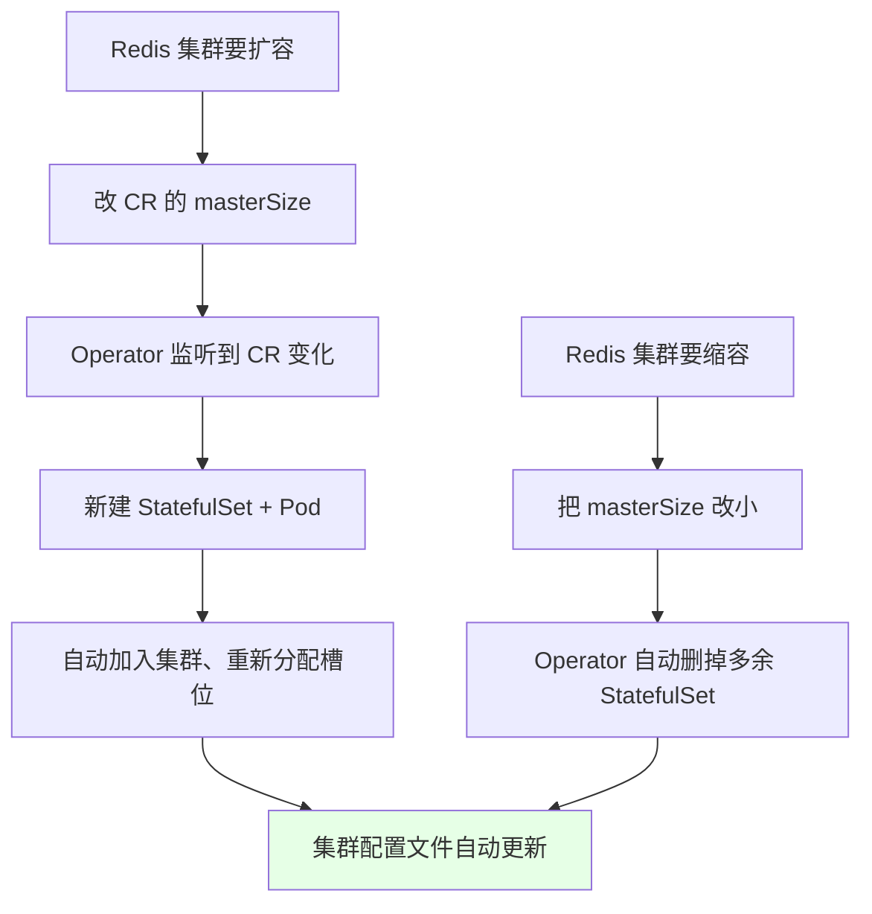
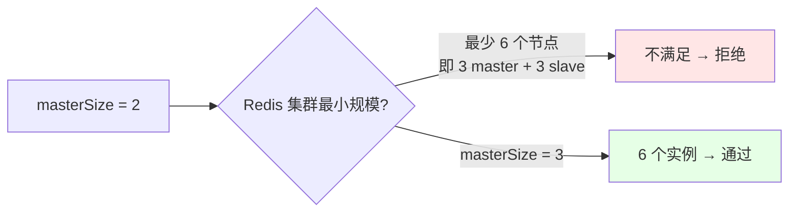
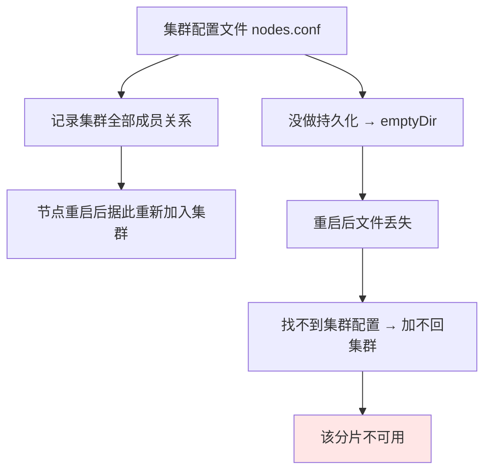
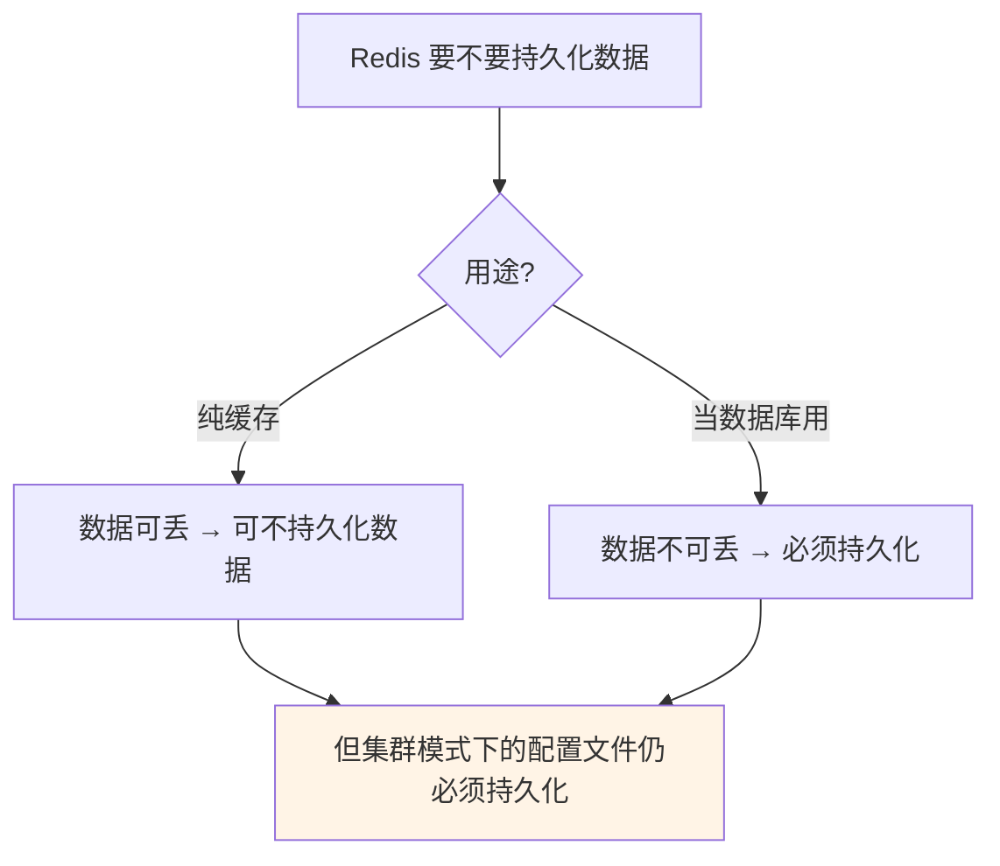
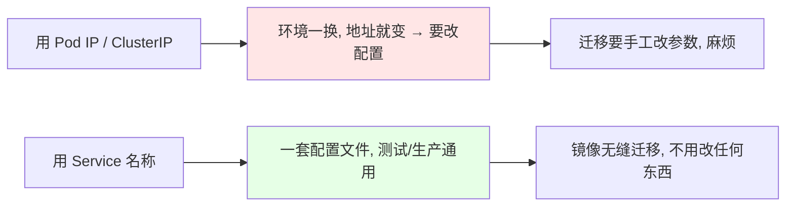

# Kubernetes 集群部署: Redis 集群扩容和缩容（改 CR 的 masterSize、最小规模限制与集群配置文件的持久化底线）

用 Operator 部署的集群，扩容缩容**不需要重新分片、不需要进容器敲命令 —— 改 CR 里的 `masterSize` 就行**。这一节把这个操作和它背后的两个硬约束讲清楚：**规模不能随便改小**，以及**那个记录集群成员关系的配置文件必须持久化**。

结论先摆：

1. **扩容缩容就是改 CR 的 `masterSize`**，Operator 自动增删 StatefulSet 并重新编排，实测从 3 扩到 4 会自动创建出 8 个实例（4 master + 4 slave）；
2. **Redis 集群最少 6 个节点（即 `masterSize` 最小 3）**，改成 2 会被拒绝，这是 Redis 集群自身的下限，不是 Operator 的限制；
3. **集群配置文件（`nodes.conf`）记录了全部成员关系**，扩容缩容后它会自动更新；这个文件丢了，节点重启后就加不回集群 —— **这个文件必须持久化**；
4. **持久化这个文件的存储后端不需要高性能**：Redis 是异步做 RDB 备份、配置文件也不常改，GFS 之类普通存储就够；
5. **数据本身要不要持久化，先找开发确认**：Redis 多用作缓存、数据可丢，但**集群模式下的配置文件不能不做**；
6. **应用连接必须用 Service 名称**，不用 Pod IP、也不用 ClusterIP —— 这样一套配置文件能在测试/生产之间无缝迁移。

## 纲要

- 扩容缩容的正确姿势：改 CR
- 最小规模限制：为什么改成 2 不行
- 扩容实测：3 → 4，实例数变 8
- 集群配置文件的作用与丢失后果
- 配置文件用什么存储、性能要求如何
- 无共享存储时的兜底：节点打标签 + 改 affinity
- ConfigMap 不能反写
- 数据可丢性要与开发确认
- 用 Service 名称统一配置文件
- Operator 文档里的其它能力（备份恢复 / 监控 / 自定义密码）

## 扩容缩容的正确姿势：改 CR



```bash
# 扩容：masterSize 3 → 4
kubectl edit distributedrediscluster example-distributedrediscluster -n app-a
# spec.masterSize: 4

# 缩容：再改回 3（Operator 会自动删掉多余的实例）
kubectl edit distributedrediscluster example-distributedrediscluster -n app-a
# spec.masterSize: 3

# 观察变化
kubectl get pod -n app-a -w
kubectl get statefulset -n app-a
```

| 操作 | 改法 | 结果 |
| --- | --- | --- |
| 扩容 | `masterSize: 3 → 4` | 8 个实例（4 master + 4 slave） |
| 缩容 | `masterSize: 4 → 3` | 回到 6 个实例，多余 StatefulSet 被删除 |
| 缩到 2 | `masterSize: 2` | **被拒绝** |

> 自己手写的集群做扩缩容要手动重新分片，非常麻烦，这正是 Operator 的价值所在。

## 最小规模限制：为什么改成 2 不行



课程里先把 `masterSize` 改成 2，直接报错「小于等于三不行」，于是改成 4 试 —— **Redis 集群本身最少需要 6 个节点**，这是 Redis 的约束。

## 扩容实测：3 → 4，实例数变 8

扩容完成后进到新创建的实例里看集群配置文件，能看到成员已经更新：

```text
集群配置文件内容示意（扩容后）:

节点总数: 8
├── master × 4
└── slave  × 4
    （当前所在的这个实例, 自己是一个 slave）

缩容回 3 之后再看:
└── 该文件已被自动更新为 6 个节点
```

```bash
# 进容器查看集群成员信息
# 下面命令中的变量按你的集群环境赋值后再执行
kubectl exec -it $POD -n app-a -- cat /redis-data/nodes.conf
# 或者（路径随镜像不同而有差异）
kubectl exec -it $POD -n app-a -- sh -c 'cat /data/nodes.conf'
```

## 集群配置文件的作用与丢失后果



关键点：**配置文件丢了，节点重启后就没法重新加入原来的集群**。所以即使数据可以丢，**这个文件也必须持久化**。

> Redis 集群目前**不支持用主机名的方式通信**（只记地址），所以这份文件不能省；如果哪天支持了主机名通信，这个文件就不需要保存了。

## 配置文件用什么存储、性能要求如何

```text
持久化方案选择（按有没有共享存储）:

有共享存储（推荐）
└── 只持久化这个配置文件即可
    └── 性能要求不高：Redis 异步做 RDB 备份, 配置文件也不常改
        └── GFS / 普通存储都能满足

没有共享存储（兜底）
└── 给 N 台宿主机打标签, 把 N 个实例固定分布到 N 台机器上
    └── 每台挂 hostPath（不推荐长期使用）
    └── 或者改 affinity, 让一个节点上只允许跑一个 Redis → 完全分布式
```

| 方案 | 适用 | 备注 |
| --- | --- | --- |
| 共享存储持久化配置文件 | **首选** | 性能要求低，GFS 之流即可 |
| `hostPath` + 节点标签 | 实在没有存储后端 | hostPath 本身不推荐 |
| 改 affinity 为「每节点一个 Redis」 | 完全没办法时 | 效果接近物理机部署 |
| ConfigMap 挂载 | **不行** | ConfigMap 不支持反写，容器改了写不回去 |

```yaml
# 只持久化配置文件：CR 里指定 storageClassName
spec:
  storage:
    type: persistent-claim
    size: 1Gi
    persistentVolumeClaim:
      spec:
        storageClassName: <你的 StorageClass>
        accessModes: ["ReadWriteOnce"]
        resources:
          requests:
            storage: 1Gi
```

```bash
# 无共享存储时：给 8 台宿主机打标签，把 8 个实例钉住
kubectl label node node01 redis-node=true
# …… 共 8 台
kubectl get node -l redis-node=true
```

## 数据可丢性要与开发确认



Redis 大部分场景是缓存，**数据可用性要求没有数据库那么高**。但要注意：如果某个分片的 master 和 slave **同时挂掉**，那一段槽位的数据就真丢了 —— 概率小但不是没有。所以**部署前先找开发确认「数据能不能丢」**，能丢就只做缓存、连数据都不用持久化，配置反而更简单。

## 用 Service 名称统一配置文件



| 连接方式 | 跨环境迁移 |
| --- | --- |
| Pod IP | 最差，Pod 重建就变 |
| ClusterIP | Service 误删或重建就变 |
| **Service 名称** | **推荐**，一套配置到处能用 |

这是容器化开发的核心收益之一：**统一配置 → 一套配置文件在任何环境都能直接起**，不用像物理机时代那样配系统、配环境、配兼容性。实在统一不出来，就尽量少改，用不同的启动参数指定对应环境的配置文件（后续讲 CI/CD 时会展开）。

手动创建的 Redis 集群也一样：**自己建一个 Service 指向这 6 个节点**，应用连这个 Service 即可。

## Operator 文档里的其它能力

```text
redis-cluster-operator 文档还提供（课程未逐一演示）:

├── 备份与恢复      → 课程跳过了, 生产一般有自己的备份方案
├── 监控            → 内置 Prometheus 支持, 填 Redis 地址即可监控
│                     （用的是同一个 Redis exporter 镜像, 后续课程会讲）
├── 自定义配置      → 可自定义 Redis 配置项, 按需使用
├── 自定义账号密码  → 密码是 base64 加密的, 改动时先加密再填
└── 持久化          → 即前文讲的 storageClassName
```

```yaml
# 自定义账号密码：Secret 里的密码是 base64 的
apiVersion: v1
kind: Secret
metadata:
  name: redis-secret
type: Opaque
data:
  password: cGFzc3dvcmQ=          # echo -n 'password' | base64

# 也可以用 stringData 直接写明文（之前讲过的写法）
# stringData:
#   password: password
```

> 这个 Operator 是国人开发的，功能还在持续迭代，可以关注它的更新。这类复杂中间件（Redis 集群、数据库集群）都有现成 Operator，测试环境可以直接用，生产环境同样可用，但要不要上要自己权衡 —— 也许你的业务用单实例 Redis 就够了。

## API 速览

| 能力 | 做法 |
| --- | --- |
| 扩容 | `kubectl edit distributedrediscluster <名>` → 调大 `masterSize` |
| 缩容 | 同上 → 调小 `masterSize` |
| 最小规模 | Redis 集群最少 6 个节点（`masterSize` ≥ 3） |
| 看集群成员 | 进容器 `cat nodes.conf` |
| 持久化 | CR 的 `spec.storage` 里写 `storageClassName` |
| 改密码 | `data.password` 填 base64，或用 `stringData` 写明文 |
| 固定节点 | `kubectl label node <node> redis-node=true` |
| 拿连接地址 | `kubectl get svc` → 用 Service 名称 |

## Demo 示例

```bash
# 1. 先看当前规模
kubectl get distributedrediscluster -n app-a
kubectl get pod -n app-a

# 2. 扩容：masterSize 3 → 4
kubectl patch distributedrediscluster example-distributedrediscluster -n app-a \
  --type merge -p '{"spec":{"masterSize":4}}'

# 3. 观察新实例创建（预期 8 个：4 master + 4 slave）
kubectl get pod -n app-a -w
kubectl get statefulset -n app-a

# 4. 进容器确认集群成员已更新为 8 个节点
# 下面命令中的变量按你的集群环境赋值后再执行
kubectl exec -it $POD -n app-a -- cat /redis-data/nodes.conf

# 5. 缩容回 3（Operator 自动删多余的 StatefulSet）
kubectl patch distributedrediscluster example-distributedrediscluster -n app-a \
  --type merge -p '{"spec":{"masterSize":3}}'

# 6. 确认配置文件也已回退更新
kubectl exec -it $POD -n app-a -- cat /redis-data/nodes.conf

# 7. 试一下缩到 2（会被拒绝，验证最小规模限制）
kubectl patch distributedrediscluster example-distributedrediscluster -n app-a \
  --type merge -p '{"spec":{"masterSize":2}}'
```

### 总结

- **Operator 部署的 Redis 集群扩缩容就是改 CR 的 `masterSize`**，Operator 自动增删 StatefulSet 并完成重新编排与槽位分配，不用再进容器手动分片；扩容 3→4 会创建出 8 个实例（4 master + 4 slave），缩容回 3 则自动删除多余实例；
- **`masterSize` 不能小于 3**，因为 Redis 集群最少需要 6 个节点，改成 2 会被拒绝，这是 Redis 自身的下限；
- **集群配置文件（`nodes.conf`）记录全部成员关系，扩缩容后会自动更新；它一旦丢失，节点重启后就加不回原集群**，所以即使数据可以丢，这个文件也必须持久化；
- **持久化这个文件的存储后端不需要高性能**（Redis 异步做 RDB 备份、配置文件也不常改），GFS 之类普通存储即可；没有共享存储时用「给宿主机打标签把实例钉住 + hostPath」兜底，或改 affinity 让一个节点只跑一个 Redis 做成完全分布式；**ConfigMap 不行 —— 它不支持反写**；
- **数据本身要不要持久化先找开发确认**：Redis 多用作缓存、数据可丢，但要警惕同一分片的 master 和 slave 同时挂掉导致那一段槽位数据真丢；
- **应用一律用 Service 名称连接**，不用 Pod IP 也不用 ClusterIP —— 这样才能做到「一套配置文件在测试和生产之间无缝迁移」，这是容器化开发的核心收益；手动搭的集群也建议自建一个 Service 指向全部节点。

