# Kubernetes 集群部署: Ratel 简单使用（一条表单建出 Deployment+Service+Ingress，以及 ResourceQuota 把第三个副本拒掉的实测）

Ratel 装起来了，这一节真正用它干活：**在页面上创建 namespace（顺带带上资源配额）、用一条表单把 Deployment + Service + Ingress 一次性建出来**，最后看一个非常直观的实验 —— **副本扩到 3 个时，ResourceQuota 直接把它拒掉**。

结论先摆：

1. **创建 namespace 时可以同时配置 ResourceQuota（资源限制）与 LimitRange（默认 request/limit）** —— 测试/开发环境强烈建议配，否则集群很快被申请满；
2. **ResourceQuota 是 Kubernetes 的准入控制**，限制的是「这个 namespace 下所有容器加起来的总量」：最大 requests 内存/CPU、最大 limits 内存/CPU、最大 Pod 数、ConfigMap 数量等；
3. **LimitRange 解决「大家忘了写 request/limit」的问题**：容器没声明就套用默认值；
4. **Deployment 表单几乎覆盖了 Pod spec 的全部常用字段**：重启策略、DNS 策略、节点故障停留时间、SA、副本数、反亲和、内核参数、hostAliases、toleration、nodeSelector、节点亲和、volume、容器命令、资源限制、健康检查、preStop/postStart、安全配置、端口、环境变量、TTY、工作目录、initContainers；
5. **`postStart` 不保证在 entrypoint 之前执行**（不是强一致），这一点多数人会误解；
6. **实测最有价值的一幕**：Pod 配额设 2、扩容到 3 → 第三个副本**不是 Pending，而是直接被 forbidden 拒绝**，ReplicaSet 上直接报错。

## 纲要

- 登录后先看到什么
- 一键式 RBAC 授权
- 创建 namespace：顺带把资源限制配了
- ResourceQuota 管什么
- LimitRange：忘了写 request/limit 的兜底
- 测试环境与生产环境的取舍
- Deployment 表单：集群与基础项
- 调度相关：节点故障停留、反亲和、容忍、nodeSelector、节点亲和
- hostAliases 与内核参数
- 容器配置：命令、资源、健康检查
- preStop 与 postStart 的时机
- 安全配置：runAsNonRoot 与 userid
- 环境变量的几种来源
- initContainers、TTY、工作目录
- Service 与 Ingress 一起生成
- 实测：ResourceQuota 拒绝第三个副本

## 登录后先看到什么

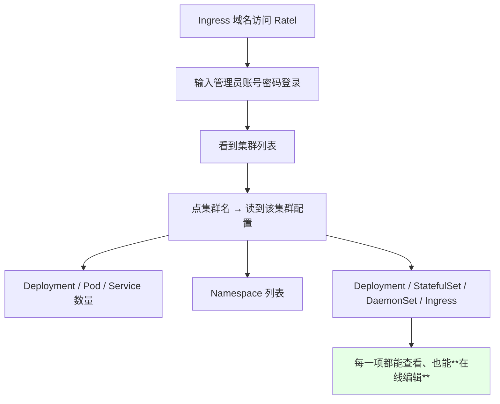

> 课程原话：**「常用资源的增删改查基本都开发完成了，一些不是很常用的参数还没开发」** —— 因为作者一个人在开发，进度有限。

## 一键式 RBAC 授权

平台里有一块专门的**用户权限配置**，把上一章讲的 RBAC 做成了表单：

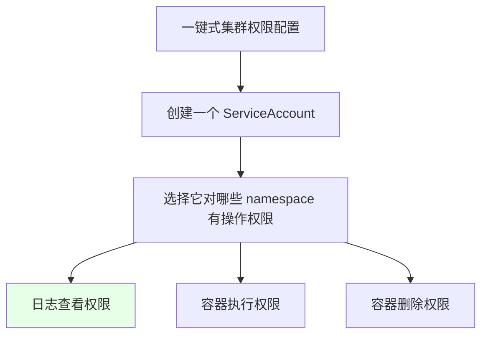

> 这就是上一节 RBAC 那套模型的产品化封装 —— **选 namespace + 勾权限 → 自动生成 SA 和绑定关系**。后面会单独再讲。

## 创建 namespace：顺带把资源限制配了

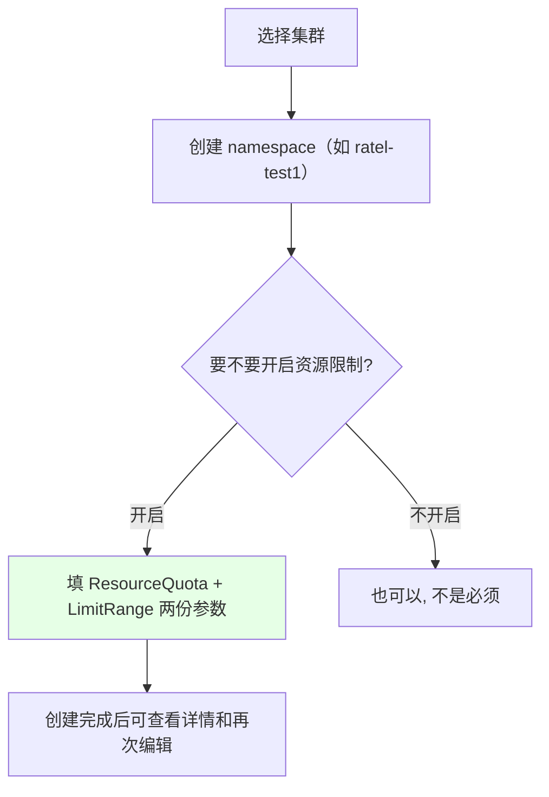

课程里填的一组典型值：

| 项目 | 取值 | 含义 |
| --- | --- | --- |
| requests 内存 | **1G** | 这个 ns 下所有容器**申请的内存总和**上限 |
| requests CPU | **1 核** | 同上，CPU 申请总和上限 |
| limits 内存 | **2G** | 内存上限总和 |
| limits CPU | **1500m** | CPU 上限总和（**1500m = 1.5 核**） |
| 最大 Pod 数 | **2 个** | 这个 ns 最多只能跑 2 个 Pod |
| ConfigMap 数量 | 可配 | 同理限制 |

> 注意 **1500m 就是 1.5 个 CPU**，别写成 1500 核。

## ResourceQuota 管什么

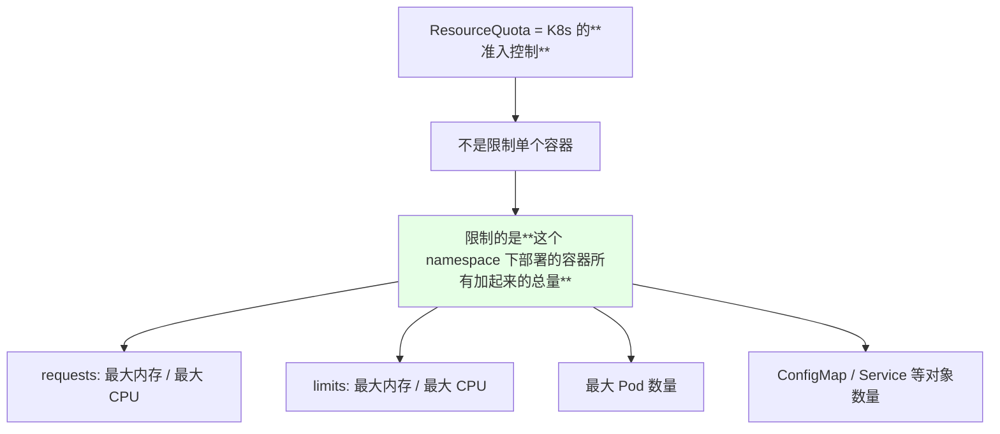

| 维度 | 作用 |
| --- | --- |
| `requests` 上限 | 限制「申请总量」，防止大家乱要资源把节点占满 |
| `limits` 上限 | 限制「能用到的上限总量」 |
| 对象数量上限 | Pod / ConfigMap / Service 等的数量天花板 |

创建完成后可以在页面左侧「查看详情」里回看这份限制，也能直接点编辑修改。

## LimitRange：忘了写 request/limit 的兜底

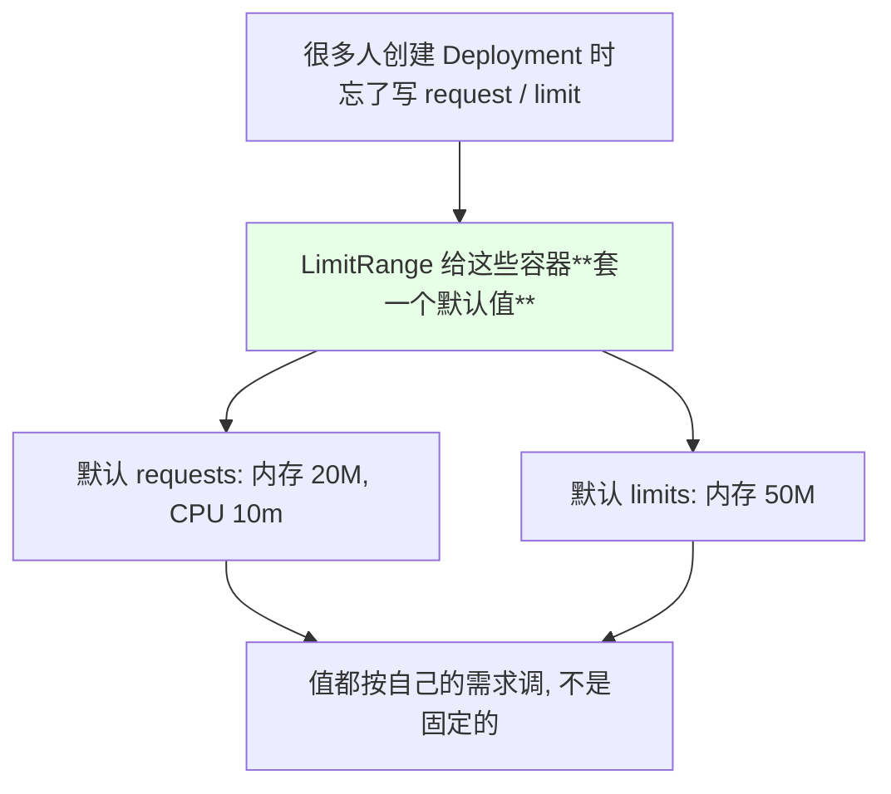

| 默认项 | 课程里填的值 |
| --- | --- |
| 默认 requests 内存 | **20M** |
| 默认 requests CPU | **10m** |
| 默认 limits 内存 | **50M** |

> 「容器没写 request / limit 就没有配额依据」这种情况，靠 LimitRange 就能自动补上；它可以自定义，**不创建也可以**。

## 测试环境与生产环境的取舍

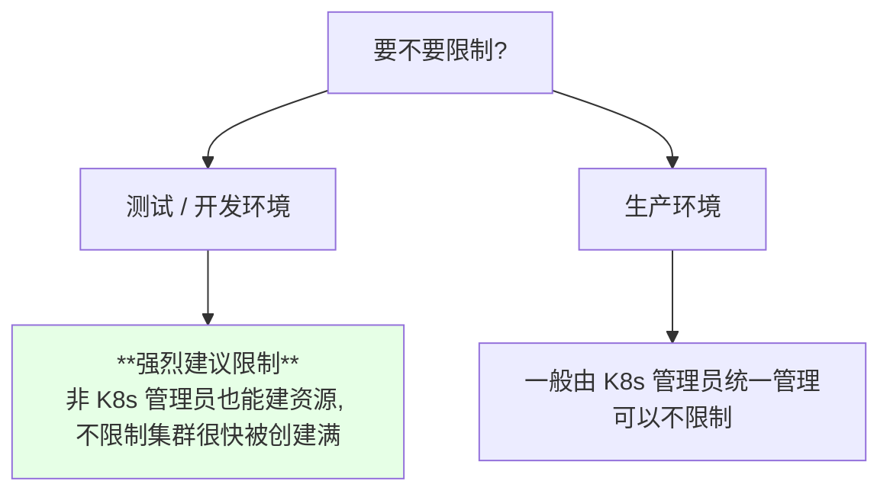

> 课程原话：**「在测试环境当中，因为可能不是 K8s 管理员也能看见资源，这样就可以限制一下他的资源请求量，要不然集群很快可能就被创建满了；生产的可能就是 K8s 管理员在管理，这个的话可以不用限制」**。

## Deployment 表单：集群与基础项

```text
Deployment 表单的基础区:

├── 集群              ← 选一个（可能有多个）
├── Namespace         ← 选刚创建的 ratel-test1
├── 名称              ← 例如 ratel-nginx-test
├── 重启策略          ← **Always**
├── DNS 策略          ← 之前讲过的 dnsPolicy
├── 节点故障停留时间   ← **默认 300 秒**
├── 私有仓库的 Secret ← 没配就查不到（需要自己先配）
├── ServiceAccount    ← **默认 default**
└── 副本数            ← 可拖动滑块或直接填数字
```

| 项 | 说明 |
| --- | --- |
| 节点故障停留时间 | 节点出问题后，**Pod 还能在那个 node 上停留多久**，默认 **300 秒**，演示时调成 30 秒让它快速调走 |
| 私有仓库 Secret | 集群里没有该 Secret 就查不出东西，需要先自己创建 |
| ServiceAccount | 刷新后默认就是 default，只有一个的话只能选它 |

## 调度相关：节点故障停留、反亲和、容忍、nodeSelector、节点亲和

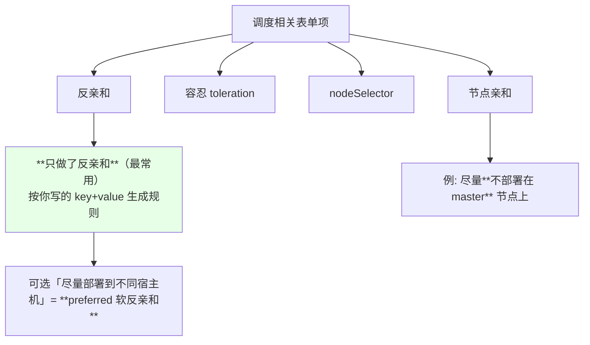

> 课程说明：**「我只做了一个反亲和力，因为我们最常用的是反亲和力，那个亲和力可能一直也用不到，所以我就没有开发那个功能」**。

## hostAliases 与内核参数

```text
两处容易忽略的配置:

hostAliases
└── 内网域名没解析时, 在这里配 IP → 域名
    例: 192.168.x.x  testaa.com
    等价于往容器的 /etc/hosts 里写一行

内核参数 (sysctls)
└── 需要**先在 kubelet 上开启对应的参数**
    课程作者当时因为集群恢复了快照、没保存状态, 所以先跳过
```

| 配置 | 生效前提 | 用途 |
| --- | --- | --- |
| `hostAliases` | 无特殊前提 | 容器内域名指向没有 DNS 的内网地址 |
| 内核参数 | **要先开 kubelet 的参数** | `sysctl` 调优 |

> 另外还有一个 `projected volume`（投射卷），作者坦言「这个东西其实用的挺少」，是后来配 gitlab runner 时才接触到的，日常基本用不上。

## 容器配置：命令、资源、健康检查

```text
容器配置区:

├── 镜像
├── command            ← 相当于 Dockerfile 里的 **ENTRYPOINT**，多个值用逗号分隔
├── 内存 / CPU 限制     ← 最小（requests）与最大（limits）
├── 健康检查            ← 三种检测方式都能选
│   ├── tcpSocket
│   ├── httpGet        ← 可配 host / path / port，host 不填默认 127.0.0.1
│   └── exec           ← 例如 echo 0 / exit 0
├── 准备时间            ← initialDelaySeconds，演示里设成 2 秒
└── 端口配置
```

| 检测方式 | 表单里要填的 |
| --- | --- |
| `tcpSocket` | 端口（如 80） |
| `httpGet` | 协议、host（不填即 127.0.0.1）、path、端口 |
| `exec` | 要执行的命令 |

## preStop 与 postStart 的时机

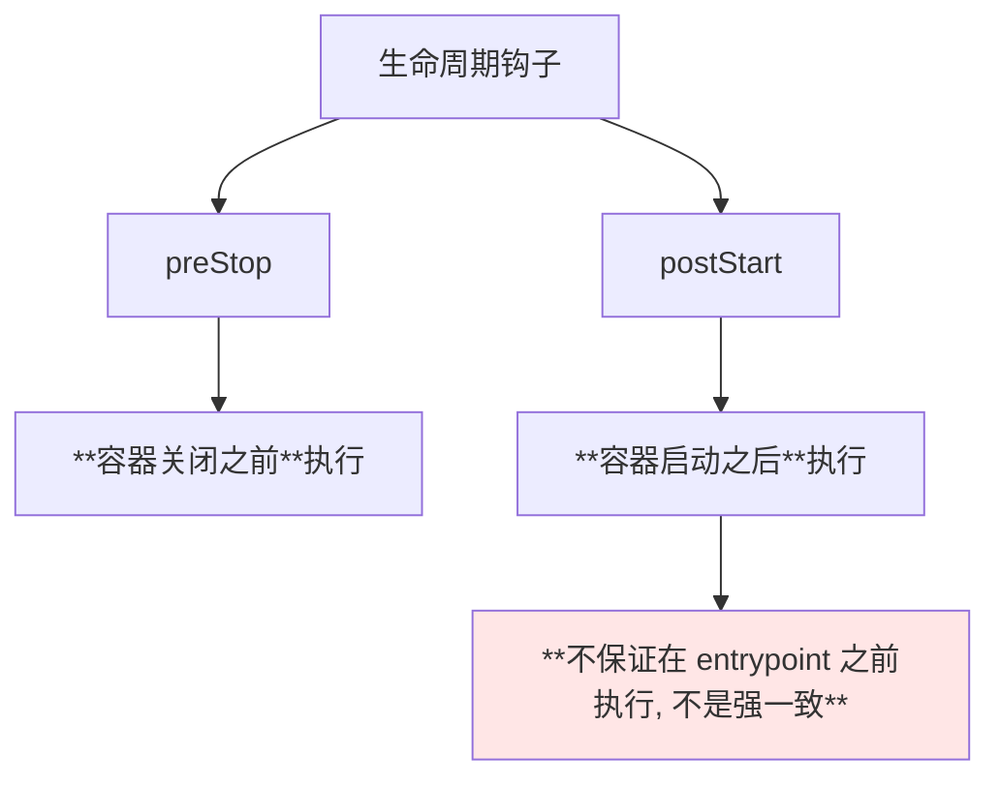

> 这一点非常关键：`postStart` 与容器的入口命令是**并发**的，不要指望它一定先跑完。

## 安全配置：runAsNonRoot 与 userid

```text
安全配置区:

├── 是否用**高权限**运行（privileged）
├── runAsNonRoot     ← **不要用 root 用户启动**
└── 运行的 userid    ← 指定容器以哪个 uid 运行
```

| 选项 | 作用 |
| --- | --- |
| 高权限运行 | 一般不开 |
| `runAsNonRoot` | 强制非 root 启动，安全基线常见要求 |
| `runAsUser` | 指定具体 uid |

## 环境变量的几种来源

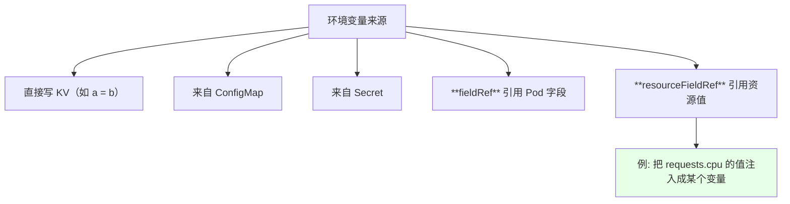

> 表单里可以直接选来源类型（fieldRef / configMapKeyRef / resourceFieldRef 等），这就是之前讲 Downward API 那一套的落地。

## initContainers、TTY、工作目录

```text
其余几项:

initContainers   ← 可以添加一个或多个, 也能删掉（演示里没添）
TTY              ← 是否保留终端, **默认 false**
工作目录         ← 容器的 workingDir, 可选
文件挂载         ← 选中已创建的 volume（如之前配的 test-nfs）
```

## Service 与 Ingress 一起生成

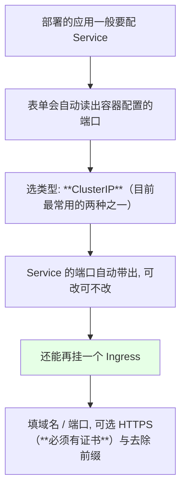

| 项 | 说明 |
| --- | --- |
| Service 类型 | 一般选 `ClusterIP`（最常用） |
| Service 端口 | 自动从容器端口带出来 |
| Ingress 域名 | 自己填，比如 `ratel-test.example.com` |
| HTTPS | 可以开，**但必须有证书**；演示环境没配证书就不开 |
| 去除前缀 | 之前 ingress 讲过的路径重写开关 |

> 除非你用服务注册（不需要 K8s Service），一般部署都要配 Service。

## 实测：ResourceQuota 拒绝第三个副本

这是本節最值得记住的一幕。部署成功后把镜像拉取策略改成 `IfNotPresent` 并 update，Pod 起来、**配好 hosts 后用 Ingress 域名就能访问到 nginx 页面**。接着把副本数从 2 扩到 3：

```bash
kubectl scale deploy ratel-nginx-test --replicas=3 -n ratel-test1
kubectl get pods -n ratel-test1
kubectl describe replicaset -n ratel-test1 | tail -20
```

```text
课程实测:

NAME                      READY   STATUS
ratel-nginx-test-aaa      1/1     Running
ratel-nginx-test-bbb      1/1     Running
（第三个副本**没有出现, 也没有 Pending**）

kubectl describe deployment 的 Conditions 里:
  ... is forbidden ...
  quota ... pods=2 已使用 2 ... limited to 2

kubectl describe replicaset:
  ... 直接报错, 说已经满了, 不再给你创建
```

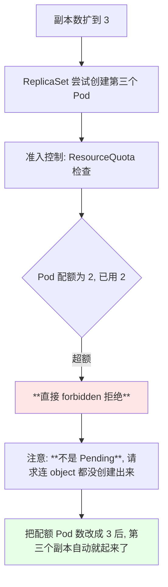

| 现象 | 与资源不足 Pending 的区别 |
| --- | --- |
| ResourceQuota 超额 | **直接 forbidden**，ReplicaSet 上直接报错，**没有 Pending 的 Pod** |
| 集群资源不足 | Pod 会出现并保持 `Pending` |

> 这是判断「为什么扩容失败」的关键线索：**看不到 Pending Pod 但副本数上不去，先去 `describe deploy` / `describe rs` 看 forbidden 信息，然后查 ResourceQuota。**

## API 速览

| 能力 | 做法 | 关键点 |
| --- | --- | --- |
| 看 namespace 的配额 | 页面「查看详情」或 `kubectl get resourcequota -n <NS>` | 限额是否到顶 |
| 看默认 request/limit | `kubectl get limitrange -n <NS>` | LimitRange 兜底值 |
| 扩副本验证配额 | `kubectl scale deploy <NAME> --replicas=3 -n <NS>` | 观察是否被拒 |
| 查被拒原因 | `kubectl describe deploy <NAME> -n <NS>` | 看 Conditions 的 forbidden |
| 查 RS 报错 | `kubectl describe rs -n <NS>` | 也会写明配额已满 |
| 改 Pod 配额 | 页面编辑或 `kubectl edit resourcequota -n <NS>` | 改完第三个会自动起来 |
| 访问部署的应用 | 配 hosts 指向 Ingress 节点后再访问域名 | 演示环境无 DNS |
| 改镜像拉取策略 | 页面 update 或改 Deployment 后 apply | 会触发滚动重建 |

字段速查：

| 字段 | 作用 |
| --- | --- |
| `ResourceQuota` 的 requests/limits | 限制 ns 内**所有容器加起来的**总量 |
| `ResourceQuota` 的 pods | 该 ns 允许的 **Pod 总数** |
| `LimitRange` 的 default / defaultRequest | 容器没写 request/limit 时的兜底值 |
| `spec.template.spec.hostAliases` | 容器内 hosts 映射 |
| `spec.template.spec.tolerations` | 容忍污点 |
| `spec.template.spec.dnsPolicy` | DNS 策略 |
| `tolerations` 的节点故障停留 | 默认 **300 秒** |
| `containers[].securityContext.runAsNonRoot` | 禁止 root 启动 |
| `containers[].lifecycle.postStart` / `preStop` | 启动后 / 关闭前钩子 |

## Demo 示例

```bash
# 1. 看这个 namespace 配了什么配额
NS=ratel-test1
kubectl get resourcequota -n "$NS"
kubectl describe resourcequota -n "$NS"
kubectl get limitrange -n "$NS"
kubectl describe limitrange -n "$NS"

# 2. 看目前跑起来的副本
kubectl get deploy,rs,pods -n "$NS"

# 3. 故意扩到超过配额, 观察被拒
kubectl scale deploy ratel-nginx-test --replicas=3 -n "$NS"
kubectl get pods -n "$NS"
# 第三个副本不会出现

# 4. 查为什么被拒
kubectl describe deploy ratel-nginx-test -n "$NS" | tail -20
kubectl describe rs -n "$NS" | tail -20

# 5. 放开配额后再扩
kubectl edit resourcequota -n "$NS"     # 把 pods 改成 3
kubectl scale deploy ratel-nginx-test --replicas=3 -n "$NS"
kubectl get pods -n "$NS"
# 第三个副本自动创建成功

# 6. 演示环境配 hosts 后访问 Ingress 域名
INGRESS_IP=$(kubectl get pods -A -l app=ingress-nginx -o jsonpath='{.items[0].status.hostIP}')
echo "$INGRESS_IP  ratel-test.example.com"
curl "http://ratel-test.example.com"
```

```yaml
# ratel-ns-quota.yaml —— 一个带配额与默认值的 namespace 配置
apiVersion: v1
kind: Namespace
metadata:
  name: ratel-test1
---
apiVersion: v1
kind: ResourceQuota
metadata:
  name: ratel-quota
  namespace: ratel-test1
spec:
  hard:
    requests.cpu: "1"
    requests.memory: 1Gi
    limits.cpu: "1500m"
    limits.memory: 2Gi
    pods: "2"
    configmaps: "10"
---
apiVersion: v1
kind: LimitRange
metadata:
  name: ratel-limit
  namespace: ratel-test1
spec:
  limits:
  - type: Container
    default:
      memory: 50Mi
      cpu: 100m
    defaultRequest:
      memory: 20Mi
      cpu: 10m
```

```yaml
# ratel-deploy-outline.yaml —— 对应表单选项的字段位置对照
spec:
  template:
    spec:
      restartPolicy: Always          # 重启策略
      dnsPolicy: ClusterFirst        # DNS 策略
      tolerations:                   # 节点故障停留（默认 300s）
      - key: node.kubernetes.io/not-ready
        operator: Exists
        effect: NoExecute
        tolerationSeconds: 30
      serviceAccountName: default    # ServiceAccount
      hostAliases:                   # 内网域名映射
      - ip: "192.168.x.x"
        hostnames:
        - testaa.com
      nodeSelector: {}               # 节点选择器
      affinity:                      # 反亲和（软）
        podAntiAffinity:
          preferredDuringSchedulingIgnoredDuringExecution:
          - weight: 100
            podAffinityTerm:
              labelSelector:
                matchLabels:
                  app: ratel-nginx-test
              topologyKey: kubernetes.io/hostname
      containers:
      - name: nginx
        image: nginx:1.15.2
        imagePullPolicy: IfNotPresent
        command: ["nginx", "-g", "daemon off;"]
        lifecycle:
          postStart: {}              # 启动后执行，**不保证早于 entrypoint**
          preStop: {}                # 关闭前执行
        securityContext:
          runAsNonRoot: true
        readinessProbe:
          httpGet:
            path: /
            port: 80
          initialDelaySeconds: 2
        resources:
          requests:
            memory: 20Mi
            cpu: 10m
          limits:
            memory: 100Mi
            cpu: 100m
```

```text
ResourceQuota 超额 vs 资源不足 —— 一眼区分:

情形                       现象                              排查入口
──────────────────────────────────────────────────────────────────
ResourceQuota 超额         第三个 Pod **不存在**, 不 Pending     describe deploy / rs → forbidden
集群资源/node 不足          第三个 Pod 存在且长期 **Pending**     describe pod → FailedScheduling
LimitRange 兜底生效        容器被自动补上默认 request/limit      describe pod → 看 resources
```

### 总结

- **Ratel 登录后点集群名即可读到该集群的资源概览**（Deployment / Pod / Service / Namespace / StatefulSet / DaemonSet / Ingress），**每一项都能查看并在线编辑**；还内置了**一键式 RBAC**（建 SA + 选 namespace + 勾日志/执行/删除权限）；
- **创建 namespace 时可以同时配 ResourceQuota 和 LimitRange**：前者是 **K8s 准入控制**，限制「该 ns 下所有容器加起来的总量」（requests/limits 的 CPU 与内存、Pod 数、ConfigMap 数等，注意 **1500m = 1.5 核**）；后者解决「忘写 request/limit」，给默认兜底（课程示例：request 20M / 10m、limit 50M）；
- **测试 / 开发环境强烈建议限制**（非管理员也能建资源，不限制集群很快被占满），生产环境由管理员统一管理时可以不限制；
- **Deployment 表单几乎覆盖 Pod spec 全部常用项**：Always 重启策略、DNS 策略、**节点故障停留时间默认 300 秒**（可压到 30 秒）、私有仓库 Secret、ServiceAccount、副本数、**只实现了反亲和**（可选 preferred 软反亲和）、hostAliases、toleration、nodeSelector、尽量不部署到 master、projected volume（很少用）、容器 command（等价 ENTRYPOINT）、资源限制、三种健康检查、安全配置、环境变量（KV / ConfigMap / Secret / fieldRef / resourceFieldRef）、TTY、工作目录、initContainers；
- **`postStart` 不保证在 entrypoint 之前执行，不是强一致** —— 别依赖它的先后顺序；`preStop` 则是容器关闭前执行；
- **实测最重要的一幕**：Pod 配额为 2 时扩到 3 副本，**第三个既不存在也不 Pending，而是被 ResourceQuota 直接 forbidden 拒绝**，ReplicaSet 上给出「已满」报错；把配额改成 3 后副本自动创建成功 —— 这是区分「配额超限」与「资源不足」的关键判据。

