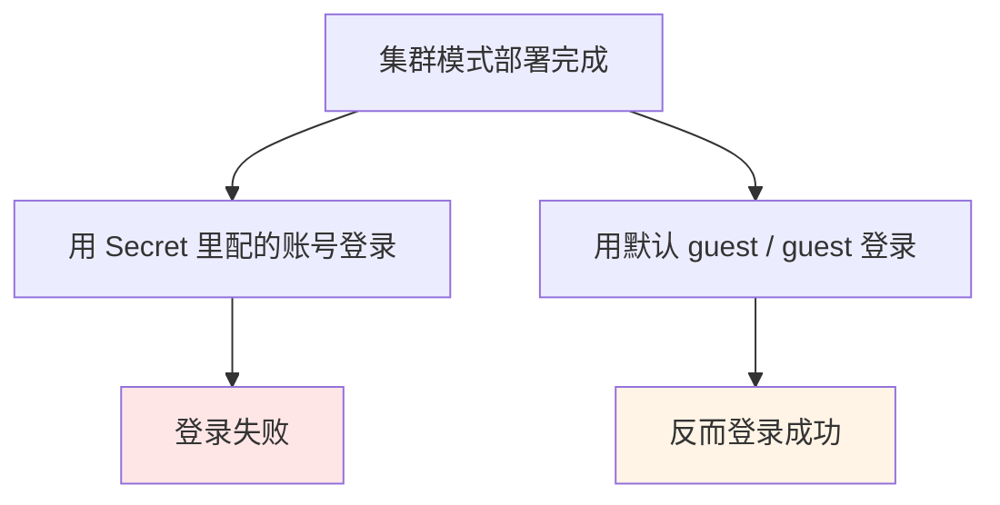
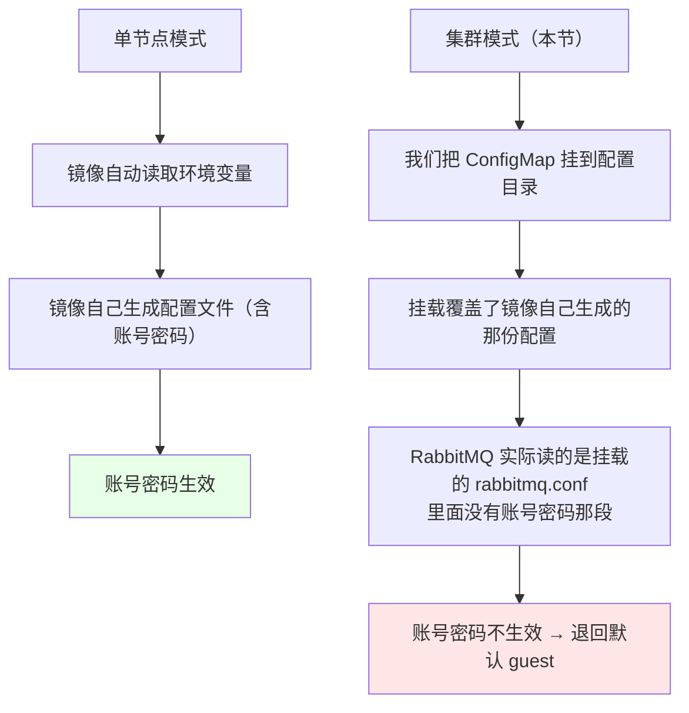
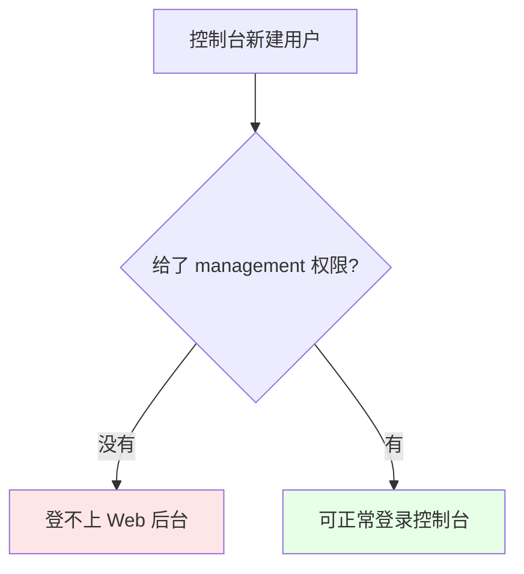

# Kubernetes 集群部署: 解决 RabbitMQ 密码不生效问题（ConfigMap 挂载覆盖了镜像生成的配置）

上一节用 StatefulSet 部署的 RabbitMQ 集群里出现一个怪现象：**Secret 里配的账号登不进去，默认的 `guest` / `guest` 反而能登**。这一节定位根因并给出最简单的一招解法。

结论先摆：

1. **根因是配置挂载覆盖**：单节点时镜像自动读环境变量、自己生成配置文件，账号密码生效；集群模式下我们**手动把 ConfigMap 挂到了配置目录**，覆盖掉镜像生成的那份，而挂载的这份里没有账号密码的配置；
2. **验证方法**：进容器看 `/etc/rabbitmq/rabbitmq.conf`，确认实际生效的配置里没有账号密码那段；
3. **最简单的解法**：把账号密码直接写进挂载的 `rabbitmq.conf`（改 ConfigMap），然后重建 StatefulSet；
4. **其它可选解法**：用 `postStart` 钩子做预处理，用 Helm 时用统一变量替换；
5. **单实例部署不会有这个问题** —— 配置文件全部由镜像自己生成，配环境变量即可生效。

## 纲要

- 现象：自定义账号登不上，guest 却能登
- 根因：单节点与集群模式的配置生成路径不同
- 进容器定位实际读取的配置文件
- 解法：把账号密码写进挂载的 rabbitmq.conf
- 重建 StatefulSet 使配置生效
- 验证：guest 失效、自定义账号可用
- 控制台创建用户需要 management 权限
- 单实例部署不受影响

## 现象



## 根因：单节点与集群模式的配置生成路径不同



| 模式 | 配置文件来源 | 环境变量里的账号密码 |
| --- | --- | --- |
| 单节点 | 镜像自动生成 | **生效** |
| 集群（挂载了自定义 ConfigMap） | 我们挂载的 ConfigMap | **被覆盖，不生效** |

## 进容器定位实际读取的配置文件

```bash
# 进到 RabbitMQ 容器里
kubectl exec -it rabbitmq-0 -n $NS -- bash

# 看配置目录
ls -l /etc/rabbitmq/
# 预期能看到挂载进来的 rabbitmq.conf

# 看实际生效的配置内容
cat /etc/rabbitmq/rabbitmq.conf
# 结论：里面只有集群发现相关的配置, 没有 default_user / default_pass
```

这就是证据：**镜像把环境变量生成的账号密码写到了它自己的那份配置里，而 RabbitMQ 运行时读的是我们挂载的 `rabbitmq.conf`**，两者不是同一份，所以自定义账号没生效。

## 解法：把账号密码写进挂载的 rabbitmq.conf

既然运行时读的就是挂载的这份配置，那就把账号密码**直接写进去**：

```yaml
apiVersion: v1
kind: ConfigMap
metadata:
  name: rabbitmq-config
  namespace: public-service
data:
  enabled_plugins: |
    [rabbitmq_management,rabbitmq_peer_discovery_k8s].
  rabbitmq.conf: |
    ## 集群自动发现（原有内容）
    cluster_formation.peer_discovery_backend = rabbit_peer_discovery_k8s
    cluster_formation.k8s.host = kubernetes.default.svc.cluster.local
    cluster_formation.k8s.service_name = rabbitmq-headless
    cluster_formation.k8s.address_type = hostname

    ## 本次新增：账号密码（原来看环境变量不生效，直接写进配置里）
    default_user = <你的账号>
    default_pass = <你的密码>
```

```bash
# 1. 改完 ConfigMap，用 replace 让它生效
kubectl replace -f rabbitmq-configmap.yaml -n $NS
kubectl get configmap rabbitmq-config -n $NS -o yaml   # 确认已加上

# 2. 重启 Pod：直接删掉 StatefulSet 再重建（配置挂载不会热更新到已运行的容器）
kubectl delete -f rabbitmq-statefulset.yaml -n $NS
kubectl apply  -f rabbitmq-statefulset.yaml -n $NS

# 3. 确认参数已进到容器里
kubectl exec -it rabbitmq-0 -n $NS -- cat /etc/rabbitmq/rabbitmq.conf
```

```text
排查与修复的完整链路:

现象：自定义账号登不上, guest 能登
  ↓
进容器 cat /etc/rabbitmq/rabbitmq.conf
  ↓
发现生效的配置里没有账号密码（被 ConfigMap 挂载覆盖）
  ↓
把 default_user / default_pass 写进 ConfigMap 的 rabbitmq.conf
  ↓
kubectl replace 更新 ConfigMap
  ↓
delete + apply 重建 StatefulSet
  ↓
验证：guest 登不上, 自定义账号登得上
```

> **其它解法**：也可以用 `postStart` 钩子做预处理，不一定非得写死在配置文件里；等后面用 Helm 部署时，把这些值抽成统一变量替换即可，不用每次手工改文件。

## 验证

```bash
# 浏览器打开控制台（课程环境是 NodePort 31479）
# 先用 guest / guest 试 → 已经登不上了
# 再用自定义账号密码试 → 登录成功
```

## 控制台创建用户需要 management 权限

登录成功后可以在控制台里添加用户，但要注意：



新用户创建出来后**没有权限是登不进 Web 后台的**，必须在创建时给它设置 `management` 权限。

## 单实例部署不受影响

```text
两种部署方式的账号密码配置:

单实例（测试/开发环境很常用）
├── 可以用 Deployment, 不一定要 StatefulSet
├── 配置文件全部由镜像自动生成
└── 配环境变量（RABBITMQ_DEFAULT_USER / PASS）即可生效

集群模式（本节）
├── 用了 StatefulSet + 自定义集群配置文件
├── 配置文件是我们自己导进来的
└── 环境变量配置账号密码会失效 → 要写进挂载的配置里
```

单实例的部署方式和前面 Redis 单实例是一个套路，举一反三即可。

## API 速览

| 能力 | 做法 |
| --- | --- |
| 进容器看生效配置 | `kubectl exec -it <pod> -- cat /etc/rabbitmq/rabbitmq.conf` |
| 更新 ConfigMap | `kubectl replace -f <文件> -n <ns>` |
| 让新配置生效 | 删除并重建 StatefulSet（挂载的配置不会热更新） |
| 配置账号密码 | 在 `rabbitmq.conf` 里写 `default_user` / `default_pass` |
| 另一种思路 | 用 `postStart` 做预处理 |
| 新建用户后登不上 | 检查是否给了 `management` 权限 |

## Demo 示例

```bash
# 1. 进容器确认根因：生效的配置里没有账号密码
kubectl exec -it rabbitmq-0 -n $NS -- cat /etc/rabbitmq/rabbitmq.conf

# 2. 把 default_user / default_pass 加进 ConfigMap 的 rabbitmq.conf
kubectl edit configmap rabbitmq-config -n $NS

# 3. 确认 ConfigMap 已更新
kubectl get configmap rabbitmq-config -n $NS -o yaml

# 4. 重建 StatefulSet（挂载的配置不会自动热更新）
kubectl delete statefulset rabbitmq -n $NS
kubectl apply -f rabbitmq-statefulset.yaml -n $NS
kubectl get pod -n $NS -w

# 5. 确认容器内配置已带上账号密码
kubectl exec -it rabbitmq-0 -n $NS -- grep default /etc/rabbitmq/rabbitmq.conf

# 6. 控制台验证：guest 失效，自定义账号可用
#    http://$NODE_IP:31479
```

### 总结

- **现象**：集群模式下 Secret 里配的账号登不进 RabbitMQ，默认的 `guest` / `guest` 反而能登；
- **根因是配置挂载覆盖**：单节点时镜像自动读环境变量并生成配置文件、账号密码生效；集群模式我们把 ConfigMap 挂到 `/etc/rabbitmq`，覆盖掉镜像生成的那份，RabbitMQ 实际读取的 `rabbitmq.conf` 里没有账号密码 → 失效并退回默认 `guest`；
- **定位方法就是进容器 `cat /etc/rabbitmq/rabbitmq.conf`**，看实际生效的配置里到底有没有那段；
- **最简单的解法是把 `default_user` / `default_pass` 直接写进挂载的 `rabbitmq.conf`**，`kubectl replace` 更新 ConfigMap 后**必须重建 StatefulSet**（挂载的配置不会热更新到已运行的容器）；
- **其它解法同样可行**：用 `postStart` 做预处理；等用 Helm 部署时把这些值抽成统一变量替换，就不用手工改文件了；
- **控制台新建的用户必须给 `management` 权限才能登录 Web 后台**；另外**单实例部署不受这个问题影响** —— 配置文件全由镜像生成，配环境变量即可生效。

