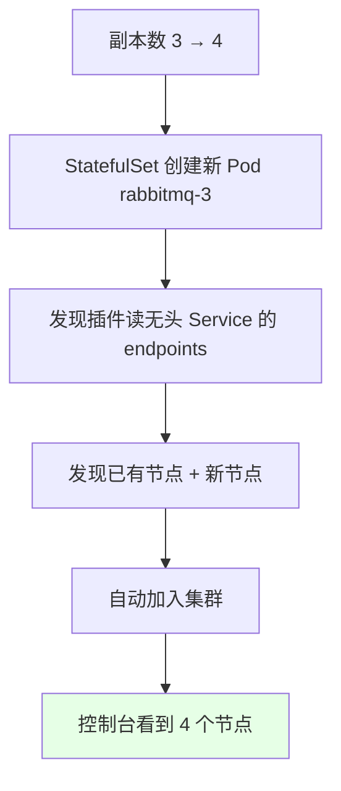
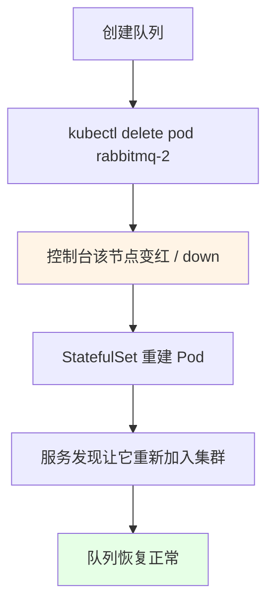
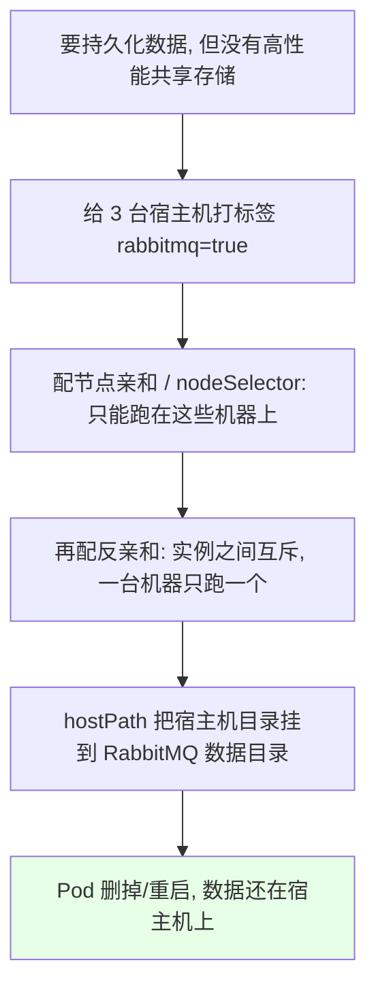
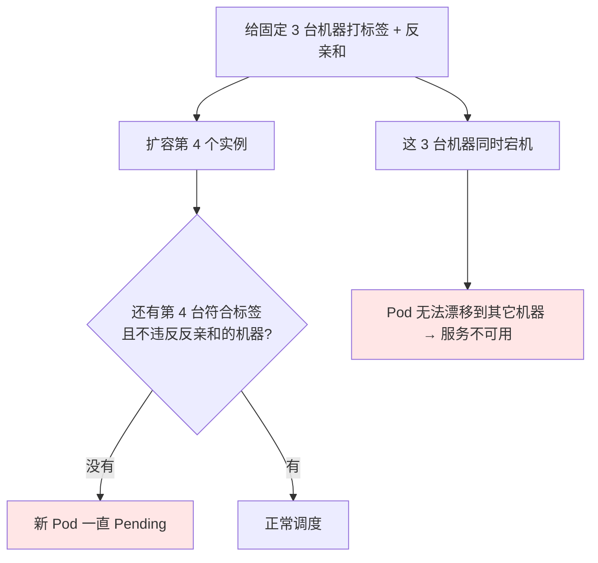
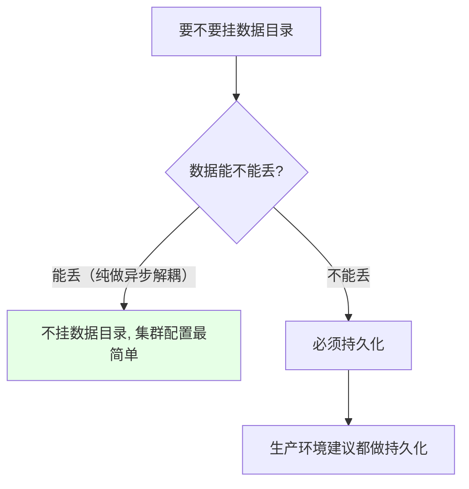

# Kubernetes 集群部署: RabbitMQ 扩容和缩容（服务发现自动入群、Pod 重建后队列恢复与固定节点的持久化方案）

RabbitMQ 的扩缩容比 Redis 简单得多：**改副本数就行，新节点自动通过 k8s 服务发现加入集群，不需要任何手动分片动作**。这一节除了扩容缩容本身，还验证「删掉一个 Pod 队列会不会丢」，并讲清楚**没有高性能存储时怎么持久化**。

结论先摆：

1. **扩容就是改 replicas**：3 → 4，新节点起来后自动加入集群，控制台能看到第 4 个节点；缩容改回 3 即可；
2. **Pod 被删掉后会自动重建并重新加入集群，队列不会丢**（重启期间队列会有波动，但不会丢失）；
3. **自动发现组建出来的节点全都是磁盘节点，没有内存节点**，需要内存节点要自己配置；
4. **没有高性能存储时的持久化方案**：给固定数量的宿主机打标签 + 节点亲和 + **反亲和互斥** + `hostPath` 挂宿主机目录；
5. **这个方案的代价是扩容节点会 `Pending`**（符合标签的机器就那么几台，还互斥），且这些机器全宕时 Pod 无法漂移；
6. **磁盘节点最少要有两个**，可以只对磁盘节点做持久化，内存节点不必。

## 纲要

- 扩容：改副本数即可
- 缩容：改回原值
- 删 Pod 验证队列不丢
- 自动发现建出来的都是磁盘节点
- 无高性能存储时的持久化方案
- 该方案导致扩容 Pending 的原因
- 磁盘节点最少两个
- 数据可丢就不必挂数据目录

## 扩容：改副本数即可



```bash
# 扩容
kubectl scale statefulset rabbitmq --replicas=4 -n $NS
# 或 kubectl edit statefulset rabbitmq 改 replicas

# 观察新节点
kubectl get pod -n $NS -w
```

对比 Redis：**Redis 扩容后要重新分片，所以必须靠 Operator**；RabbitMQ 用的是 k8s 服务发现，直接改副本数就完成了。

| 中间件 | 扩容后还要做什么 | 是否需要 Operator |
| --- | --- | --- |
| Redis 集群 | **重新分片** | 需要（Operator 代劳） |
| RabbitMQ | 无，自动发现自动入群 | **不必要**（也有现成 Operator 可用） |

## 缩容：改回原值

```bash
# 缩容回 3
kubectl scale statefulset rabbitmq --replicas=3 -n $NS
kubectl get pod -n $NS -w
# 被缩掉的那个节点在控制台先变红（不可用），随后消失
```

## 删 Pod 验证队列不丢

```text
验证步骤:

1. 在控制台创建一个队列（如 test-queue，落在第 3 个节点上）
2. 手动删掉承载它的那个 Pod
3. 观察：该节点状态先变成 down（红色）
4. 等待：Pod 被 StatefulSet 重建, 重新加入集群
5. 结论：队列恢复正常, 数据没丢（重启期间有波动, 但不会丢）
```



```bash
kubectl delete pod rabbitmq-2 -n $NS
kubectl get pod -n $NS -w
# 之后回控制台看：节点重新加入，队列仍在
```

## 自动发现建出来的都是磁盘节点

```text
自动发现组建的集群节点属性:

├── 全部是磁盘节点（disc node）
└── 没有内存节点（ram node）
    └── 需要内存节点的话, 要自己去配置
```

这一点和「节点数」一样是部署前要确认的：**磁盘节点最少要有两个，不能低于两个**。所以可以只针对磁盘节点做数据持久化，内存节点不持久化。

## 无高性能存储时的持久化方案

思路是「把实例钉死在固定的机器上，然后挂宿主机目录」：



```bash
# 1. 给 3 台宿主机打标签
kubectl label node node01 rabbitmq=true
kubectl label node node02 rabbitmq=true
kubectl label node node03 rabbitmq=true
kubectl get node -l rabbitmq=true
```

```yaml
spec:
  template:
    spec:
      nodeSelector:
        rabbitmq: "true"          # ① 只能调度到打了标签的机器
      affinity:
        podAntiAffinity:          # ② 实例之间互斥，一台机器只跑一个
          requiredDuringSchedulingIgnoredDuringExecution:
            - labelSelector:
                matchLabels:
                  app: rabbitmq
              topologyKey: kubernetes.io/hostname
      containers:
        - name: rabbitmq
          image: rabbitmq:3.8.3-management
          volumeMounts:
            - name: data
              mountPath: /var/lib/rabbitmq
      volumes:
        - name: data
          hostPath:                # ③ 挂宿主机目录到数据目录
            path: /data/rabbitmq
            type: DirectoryOrCreate
```

## 该方案的代价



| 做法 | 扩容 | 宕机 |
| --- | --- | --- |
| 只给 3 台打标签 + 反亲和 | 第 4 个实例**必 Pending** | 这 3 台全挂，Pod 不能漂移 → 不可用 |
| 给更多机器打标签 | 可扩容 | 宕机后能漂移到其它机器，并**从其它节点同步数据** |

```text
两种取向（自己度量）:

固定 3 台（≈ 物理机部署）
├── 优点：数据落在确定的机器上, 用 hostPath 就能持久化
└── 缺点：机器宕了就是宕了, Pod 不漂移

多打几台机器的标签
├── 优点：宕机可漂移, 并从其它节点同步数据
└── 缺点：hostPath 方案下数据位置不固定, 需要额外手段保证
```

> 这种固定节点的部署方式，效果和在物理机上直接部署 RabbitMQ 集群是一模一样的 —— 机器宕了就是宕了。

## 数据可丢就不必挂数据目录



现在云环境本身比较稳定、多节点同时宕机概率很低，但**生产环境还是建议保存数据** —— 万一出意外责任很大。

## API 速览

| 能力 | 做法 |
| --- | --- |
| 扩容 | `kubectl scale statefulset rabbitmq --replicas=N` |
| 缩容 | 同上，把 N 调小 |
| 看节点是否入群 | 控制台（15672）或 `kubectl get endpoints` |
| 给机器打标签 | `kubectl label node <node> rabbitmq=true` |
| 固定调度 | `nodeSelector` + `podAntiAffinity` |
| 无存储持久化 | `hostPath` 挂到 `/var/lib/rabbitmq` |
| 磁盘节点下限 | 至少 2 个 |

## Demo 示例

```bash
# 1. 扩容到 4
kubectl scale statefulset rabbitmq --replicas=4 -n $NS
kubectl get pod -n $NS -w

# 2. 控制台确认第 4 个节点已自动加入（http://$NODE_IP:31479）

# 3. 创建一个测试队列，验证落在某个节点上

# 4. 删掉承载该队列的 Pod，验证队列不丢
kubectl delete pod rabbitmq-2 -n $NS
kubectl get pod -n $NS -w
# 控制台：节点先 down → 重建后重新入群 → 队列恢复

# 5. 缩容回 3
kubectl scale statefulset rabbitmq --replicas=3 -n $NS

# 6. 要做持久化（无共享存储）时：打标签 + 改清单
kubectl label node node01 rabbitmq=true
kubectl label node node02 rabbitmq=true
kubectl label node node03 rabbitmq=true
kubectl get node -l rabbitmq=true
# 清单里加 nodeSelector / podAntiAffinity / hostPath，然后重建 StatefulSet
```

### 总结

- **RabbitMQ 扩缩容就是改 StatefulSet 的 `replicas`**，新节点靠 k8s 服务发现（读无头 Service 的 endpoints）自动加入集群，缩容时节点先变红再消失；对比 Redis 扩容后**必须重新分片**、需要 Operator 代劳，RabbitMQ 完全不需要 Operator；
- **删掉承载队列的 Pod 后，队列不会丢**：节点在控制台先显示 down，StatefulSet 重建 Pod 后通过服务发现重新加入集群，队列恢复正常（重启期间队列会有波动）；
- **自动发现组建出来的节点全是磁盘节点、没有内存节点**，需要内存节点要自己配；另外**磁盘节点最少要有两个**，可以只对磁盘节点做数据持久化；
- **没有高性能共享存储时的持久化方案**：给固定几台宿主机打标签 + `nodeSelector` 限制调度 + `podAntiAffinity` 让实例互斥（一台机器一个）+ `hostPath` 把宿主机目录挂到数据目录；
- **这个方案的代价是扩容节点会 `Pending`**（符合标签的机器就那么几台还互斥），且这几台机器同时宕机时 Pod 无法漂移、服务不可用；多打几台机器的标签可以让 Pod 漂走并从其它节点同步数据，代价是数据位置不固定 —— 固定节点部署本质上等同于物理机部署；
- **数据能丢就不必挂数据目录**，但生产环境建议还是做持久化；具体怎么选按自己公司的需求度量。

