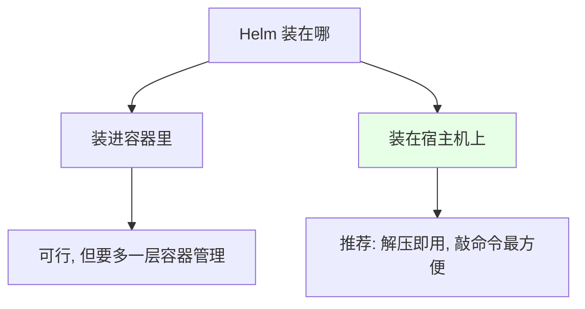
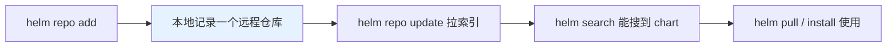
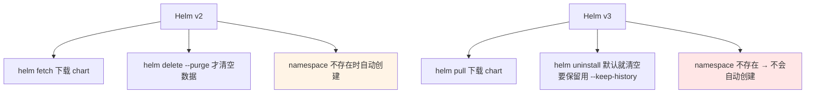
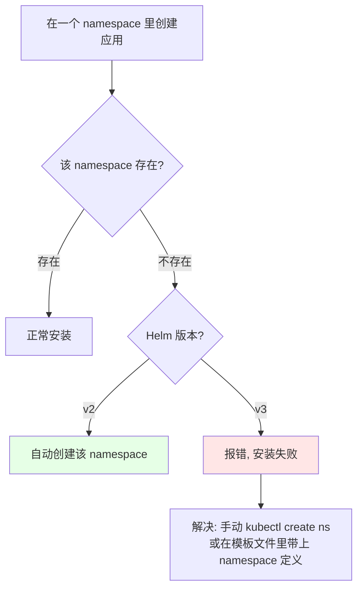
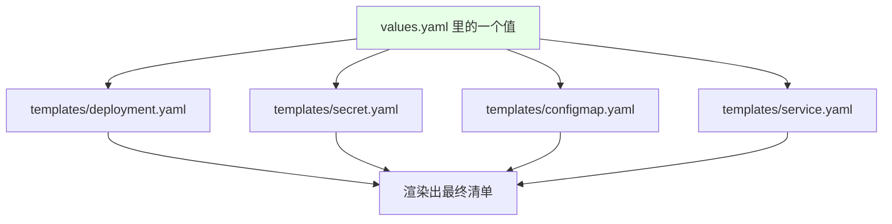

# Kubernetes 集群部署: Helm v3 安装使用（二进制安装、仓库管理与 v2 到 v3 的命令变化）

前面 Redis 用了 Operator、RabbitMQ 用了 StatefulSet，这一节开始讲 **Helm** —— 后续 Zookeeper / Kafka 就用它来装，这样 k8s 里常用的几种部署方式就覆盖齐了。

结论先摆：

1. **Helm 建议直接装在宿主机上**，不用装进容器 —— 解压二进制放到 `PATH` 目录里就能用，比容器方式简单；
2. **Helm 自身没有仓库，要自己 `helm repo add`**：课程里加了 bitnami（Zookeeper / Kafka 的 chart 由它提供）和阿里云的 stable 仓库；公司用得多可以自建私有仓库；
3. **v3 相对 v2 有三处最影响手感的改动**：`helm fetch` → `helm pull`、`helm delete --purge` → `helm uninstall`（v3 默认清空历史，要保留用 `--keep-history`）、**v2 会自动创建不存在的 namespace，v3 不会**；
4. **Chart 的价值是统一配置**：镜像地址、拉取策略、账号密码这些散落在多个文件里的值，全部收进 `values.yaml`，改一处即可。

## 纲要

- Helm 装在哪：宿主机还是容器
- 二进制安装步骤
- 仓库管理：list / add / update
- 常用命令速查
- v2 与 v3 的命令差异
- v3 不再自动创建 namespace
- Chart 目录结构
- values.yaml 统一配置的价值

## Helm 装在哪：宿主机还是容器



Helm 本身是个客户端工具，**装在宿主机上更方便**；装进容器也能用，但没必要多一层。

## 二进制安装步骤

```bash
# 1. 下载 Helm v3 的 Linux amd64 包（课程用的是 3.1.2）
wget https://get.helm.sh/helm-v3.1.2-linux-amd64.tar.gz

# 2. 解压
tar -zxvf helm-v3.1.2-linux-amd64.tar.gz

# 3. 把二进制放到 PATH 目录下即可用
mv linux-amd64/helm /usr/local/bin/helm

# 4. 验证
helm version
# version.BuildInfo{Version:"v3.1.2", ...}
```

```text
安装后的目录形态:

/usr/local/bin/
└── helm          ← 就一个二进制, 没有服务端组件（这是 v3 相对 v2 的架构变化）
```

## 仓库管理

Helm 初始**没有任何仓库**，要自己加：

```bash
# 查看当前仓库（刚装完是空的）
helm repo list
# Error: no repositories to show

# 添加 bitnami 仓库（Zookeeper / Kafka 的 chart 由它提供）
helm repo add bitnami https://charts.bitnami.com/bitnami

# 添加阿里云 stable 仓库
helm repo add stable https://kubernetes.oss-cn-hangzhou.aliyuncs.com/charts

# 更新仓库索引
helm repo update

# 再看仓库列表
helm repo list
```

| 命令 | 作用 |
| --- | --- |
| `helm repo list` | 查看当前已添加的仓库 |
| `helm repo add <名称> <地址>` | 添加仓库（相当于给 yum 加个源） |
| `helm repo update` | 更新仓库索引 |
| `helm search repo <关键字>` | 在已添加的仓库里搜 chart |



> 公司里 Helm 用得比较多的话，可以**自己搭一个私有 Helm 仓库**。

## 常用命令速查

| 命令 | 作用 |
| --- | --- |
| `helm repo list` | 查看仓库 |
| `helm list` | 查看当前用 helm 安装的 release（应用程序） |
| `helm search repo <关键字>` | 搜索 chart |
| `helm pull <chart>` | **下载**一个别人写好的 chart 到本地 |
| `helm install <release名> <chart>` | 安装 |
| `helm show chart <chart>` | 查看 chart 的版本信息 |
| `helm upgrade <release名> <chart>` | 升级 / 更新配置 |
| `helm create <名称>` | 创建一个自己的 chart 骨架 |
| `helm uninstall <release名>` | 卸载 |

```bash
# 下载一个 chart 到本地看看
helm pull bitnami/rabbitmq
tar -zxvf rabbitmq-*.tgz

# 不下载也能直接装（用仓库里的 chart 名即可）
helm install my-rabbitmq bitnami/rabbitmq
```

## v2 与 v3 的命令差异



| 能力 | v2 | v3 |
| --- | --- | --- |
| 下载 chart | `helm fetch` | **`helm pull`** |
| 卸载 | `helm delete`，不加 `--purge` 数据还在 | **`helm uninstall`**，默认一起清空 |
| 保留历史 | 加 `--purge` 才清空 | 加 **`--keep-history`** 才保留（服务停了但数据还在，可以恢复） |
| 自动建 namespace | **会** | **不会** |

```bash
# v3：卸载并保留历史（只是把服务停掉，数据还在，之后还能恢复）
# 下面命令中的变量按你的集群环境赋值后再执行
helm uninstall $RES_NAME --keep-history
```

## v3 不再自动创建 namespace

这是**最影响日常使用的一处变化**：



```bash
# v3 下的正确做法：先建 namespace
NS=demo
kubectl create namespace $NS

# 或者用 --create-namespace（较新版本支持）
helm install my-app bitnami/rabbitmq -n $NS --create-namespace
```

## Chart 目录结构

```text
一个 chart 解压后的目录结构:

rabbitmq/
├── Chart.yaml               ← chart 的元信息（名称、版本等）
├── values.yaml              ← 统一配置文件（重点）
├── charts/                  ← 依赖的子 chart
└── templates/               ← 模板文件目录
    ├── configmap.yaml
    ├── deployment.yaml
    ├── secret.yaml
    ├── service.yaml
    └── ...
```

`templates/` 里的每一份文件都是模板，Helm 用 `values.yaml` 里的值渲染它们，生成真正的 Deployment / Secret / Service 清单。

## values.yaml 统一配置的价值

前面部署 RabbitMQ 时遇到过一个痛点：**账号密码写在很多个文件里，改一次要全局替换**。用 Helm 之后，这类值全部收进 `values.yaml`：

```yaml
# values.yaml（示例片段）
image:
  registry: docker.io
  repository: bitnami/rabbitmq
  tag: 3.8.3
  pullPolicy: IfNotPresent

auth:
  username: <账号>
  password: <密码>
  erlangCookie: <cookie>
```



**改一处 `values.yaml`，所有用到它的模板一起变** —— 这就是 Helm 最实际的价值：用一套统一配置文件管理所有参数。

## API 速览

| 能力 | 做法 |
| --- | --- |
| 装 Helm | 下载 tar.gz → 解压 → 二进制放进 `/usr/local/bin` |
| 加仓库 | `helm repo add <名称> <地址>` |
| 更新索引 | `helm repo update` |
| 搜 chart | `helm search repo <关键字>` |
| 下载 chart | `helm pull <chart>` |
| 安装 | `helm install <release名> <chart> -n <ns>` |
| 升级 | `helm upgrade <release名> <chart>` |
| 卸载（保留历史） | `helm uninstall <release名> --keep-history` |
| 建 chart 骨架 | `helm create <名称>` |

## Demo 示例

```bash
# 1. 安装 Helm v3
HELM_VERSION=v3.1.2
wget https://get.helm.sh/helm-${HELM_VERSION}-linux-amd64.tar.gz
tar -zxvf helm-${HELM_VERSION}-linux-amd64.tar.gz
mv linux-amd64/helm /usr/local/bin/helm
helm version

# 2. 加仓库（bitnami + 阿里云 stable）
helm repo add bitnami https://charts.bitnami.com/bitnami
helm repo add stable https://kubernetes.oss-cn-hangzhou.aliyuncs.com/charts
helm repo update
helm repo list

# 3. 搜索需要的 chart
helm search repo rabbitmq
helm search repo kafka

# 4. 下载一个 chart 看结构
helm pull bitnami/rabbitmq
tar -zxvf rabbitmq-*.tgz
ls -R rabbitmq | head -30

# 5. v3 下先建 namespace 再安装
NS=demo
kubectl create namespace $NS
helm install my-rabbitmq bitnami/rabbitmq -n $NS

# 6. 查看已安装的 release
helm list -n $NS

# 7. 卸载（保留历史，之后还能恢复）
helm uninstall my-rabbitmq -n $NS --keep-history
```

### 总结

- **Helm 建议装在宿主机上**：下载 tar.gz、解压、把 `helm` 二进制放进 `/usr/local/bin` 即可，比装进容器里方便；
- **Helm 初始没有任何仓库，要自己 `helm repo add`**：课程加了 bitnami（Zookeeper / Kafka 的 chart 由它提供）和阿里云 stable 仓库；用得多可以自建私有仓库；
- **常用命令**：`repo list` / `repo add` / `repo update`、`list`（看 release）、`search repo`、`pull`（下载 chart）、`install`、`show chart`、`upgrade`、`create`、`uninstall`；
- **v2 → v3 三处关键变化**：`fetch` 变 `pull`、`delete --purge` 变 `uninstall`（v3 默认清空，要保留历史得加 `--keep-history`）、**v3 不再自动创建不存在的 namespace**；
- **「v3 不自动建 namespace」是最容易踩的一处**：要么先 `kubectl create namespace`，要么让模板文件里带上 namespace 定义，否则直接安装会失败；
- **Chart 的核心价值是 `values.yaml` 统一配置**：`templates/` 里放 configmap / deployment / secret / service 模板，镜像地址、拉取策略、账号密码这些散落各处的值全部收到 `values.yaml`，改一处即全局生效 —— 正好解决前面 RabbitMQ 密码要全局替换的痛点。

