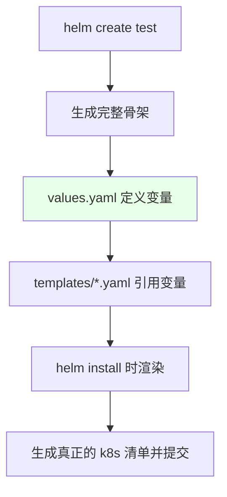
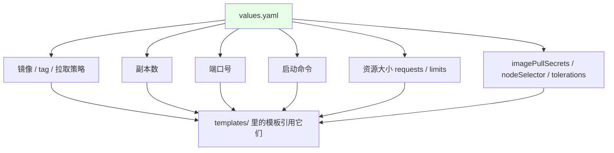
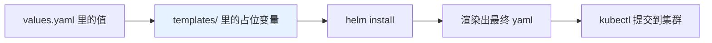
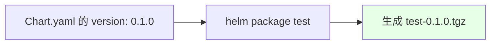
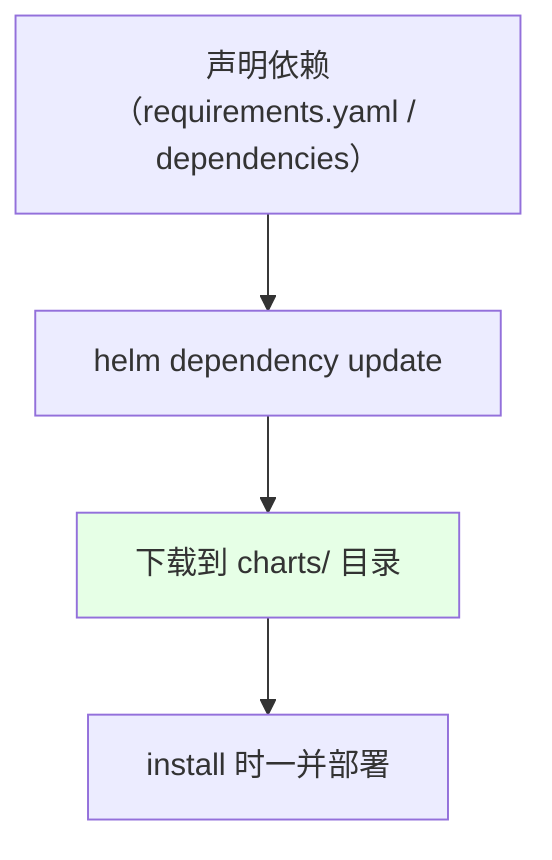
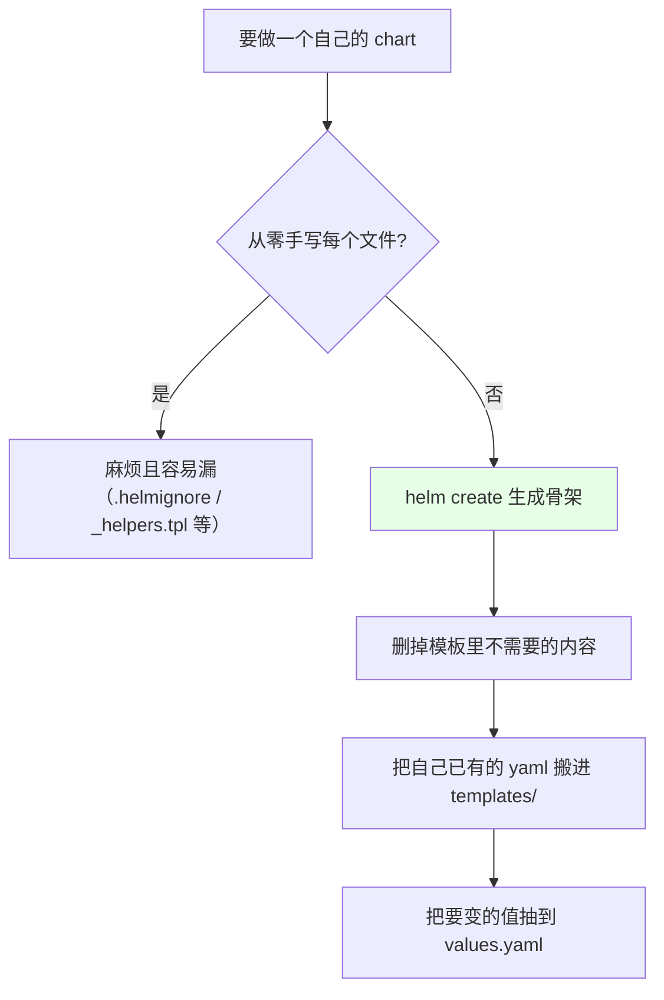

# Kubernetes 集群部署: Helm 目录层级（Chart.yaml、values.yaml 与 templates 的分工）

上一节把 Helm 装上、加了仓库、下载了 chart。直接啃 bitnami 那些现成 chart 太复杂，所以这一节**用 `helm create` 生成一个最简 chart，逐个目录讲清楚每份文件是干什么的**。

结论先摆：

1. **`values.yaml` 是核心**：放全局变量和参数 —— 镜像、副本数、端口、启动命令、资源大小、拉取密钥、`nodeSelector`、`tolerations` 全在这里；
2. **`templates/` 是模板目录**：`helm install` 时用 `values.yaml` 的值渲染这里的模板，生成真正的 Deployment / Service 等清单；**templates 下还能再套子目录，Helm 会递归处理**；
3. **`Chart.yaml` 放 chart 自身的元信息**（名称、版本），`helm package` 打包时按这里的 `version` 生成 `<名称>-<版本>.tgz`；
4. **`charts/` 放依赖的子 chart**，`requirements.yaml`（v2）/ `Chart.yaml` 的 `dependencies`（v3）声明依赖，`helm dependency update` 把它们下载到 `charts/` 里；
5. **不要从零手写这些文件**：用 `helm create` 生成骨架，删掉内容后把自己的 yaml 搬过来改，比一行行写快得多。

## 纲要

- 用 helm create 生成骨架
- values.yaml：统一配置中心
- templates/：模板目录与递归渲染
- NOTES.txt 与 _helpers.tpl
- Chart.yaml：元信息与打包版本
- charts/ 与依赖声明
- 建 chart 的正确姿势

## 用 helm create 生成骨架

```bash
# 生成一个名为 test 的 chart 骨架
helm create test

# 看目录结构
tree test
# 或
find test -type f | sort
```

```text
helm create 生成的目录结构:

test/
├── Chart.yaml                 ← chart 元信息（名称 / 版本 / 描述）
├── values.yaml                ← ★ 统一配置文件（全局变量与参数）
├── charts/                    ← 依赖的子 chart 放这里
├── .helmignore                ← 打包时忽略的文件规则
└── templates/                 ← 模板目录
    ├── NOTES.txt              ← 安装后在终端打印的说明信息
    ├── _helpers.tpl           ← 自定义模板 / 自定义函数与变量
    ├── deployment.yaml
    ├── service.yaml
    ├── ingress.yaml
    ├── serviceaccount.yaml
    ├── hpa.yaml
    └── tests/
        └── test-connection.yaml
```



## values.yaml：统一配置中心

**这是整个 chart 里最重要的文件**，所有的全局变量和参数都写在这里：

| 常见配置项 | 说明 |
| --- | --- |
| `image.repository` / `image.tag` | 镜像地址与版本 |
| `image.pullPolicy` | 镜像拉取策略 |
| `replicaCount` | 副本数 |
| `containerPort` / `service.port` | 端口号 |
| 启动命令 | 程序的启动命令 |
| `resources` | 资源大小（requests / limits） |
| `imagePullSecrets` | 拉取私有镜像的密钥 |
| `nodeSelector` | 节点选择 |
| `tolerations` | 污点容忍 |

```yaml
# values.yaml（helm create 生成的精简示例）
replicaCount: 1

image:
  repository: nginx
  pullPolicy: IfNotPresent
  tag: ""

imagePullSecrets: []
nameOverride: ""
fullnameOverride: ""

serviceAccount:
  create: true

podSecurityContext: {}

resources: {}

nodeSelector: {}

tolerations: []

affinity: {}
```



## templates/：模板目录与递归渲染

`templates/` 里的每一份文件都是模板 —— 打开 `deployment.yaml` 可以看到，**原本写死的值全都变成了参数**：

```yaml

# templates/deployment.yaml（节选）
spec:
  replicas: {{ .Values.replicaCount }}
  template:
    spec:
      containers:
        - name: {{ .Chart.Name }}
          image: "{{ .Values.image.repository }}:{{ .Values.image.tag | default .Chart.AppVersion }}"
          imagePullPolicy: {{ .Values.image.pullPolicy }}
          resources:
            {{- toYaml .Values.resources | nindent 12 }}

```



> **`templates/` 下面还可以再套一层目录**，Helm 会自动递归把里面的文件都当作模板渲染 —— 复杂 chart 可以按组件分子目录组织。

## NOTES.txt 与 _helpers.tpl

| 文件 | 作用 |
| --- | --- |
| `templates/NOTES.txt` | 执行 `helm install` 之后**在终端打印的信息**：介绍、注意事项、怎么访问服务等 |
| `templates/_helpers.tpl` | 放**自定义的模板、自定义函数和变量**，供其它模板复用 |

`NOTES.txt` 本身也是模板，里面同样可以引用变量：

```text

# templates/NOTES.txt（示例）
1. 通过以下命令拿到应用地址:
  export POD_NAME=$(kubectl get pods --namespace {{ .Release.Namespace }} -l "app={{ include "test.fullname" . }}" -o jsonpath="{.items[0].metadata.name}")
  echo "Visit http://127.0.0.1:8080 to use your application"

```

## Chart.yaml：元信息与打包版本

```yaml
# Chart.yaml
apiVersion: v2
name: test
description: A Helm chart for Kubernetes
type: application
version: 0.1.0        # ← chart 自己的版本
appVersion: 1.16.0    # ← 里面应用的版本
```



```bash
helm package test
# Successfully packaged chart and saved it to .../test-0.1.0.tgz
```

## charts/ 与依赖声明

一个 chart 可能依赖别的 chart，比如自己的应用依赖 Redis、PostgreSQL 的 chart：

```text
依赖的两种声明方式:

Helm v2
└── requirements.yaml
    └── dependencies:
          - name: redis
            version: x.y.z
            repository: <仓库地址>

Helm v3
└── Chart.yaml 里的 dependencies 段
    └── dependencies:
          - name: redis
            version: x.y.z
            repository: <仓库地址>
```

```bash
# 把 requirements.yaml / Chart.yaml 里声明的依赖下载到 charts/ 目录
helm dependency update test
ls charts/
# redis-xxx.tgz  postgresql-xxx.tgz
```



## 建 chart 的正确姿势



**不要一行一行手写**：用 `helm create` 生成骨架，把里面的东西删掉，再把自己写好的 yaml 搬过来改。

## API 速览

| 能力 | 做法 |
| --- | --- |
| 生成 chart 骨架 | `helm create <名称>` |
| 看目录结构 | `tree <chart目录>` / `find <chart目录> -type f` |
| 声明依赖 | v2 用 `requirements.yaml`；v3 写在 `Chart.yaml` 的 `dependencies` |
| 拉依赖 | `helm dependency update <chart目录>` |
| 打包 | `helm package <chart目录>` → 生成 `<名称>-<version>.tgz` |
| 看安装后的说明 | `templates/NOTES.txt` |
| 复用自定义函数 | `templates/_helpers.tpl` |
| 子目录模板 | `templates/` 下可再套目录，Helm 递归渲染 |

## Demo 示例

```bash
# 1. 生成骨架
helm create test
cd test

# 2. 看一眼目录层级
find . -type f | sort

# 3. 看 values.yaml（统一配置中心）
cat values.yaml

# 4. 看模板是怎么引用变量的
grep -n 'Values' templates/deployment.yaml

# 5. 本地渲染，检查生成结果对不对（不真正安装）
helm template test . | head -60

# 6. 渲染指定变量值
helm template test . --set replicaCount=3 | grep -A 2 replicas

# 7. 声明依赖并拉取（v3 写在 Chart.yaml 的 dependencies）
helm dependency update .
ls charts/

# 8. 打包
cd ..
helm package test
```

### 总结

- **学 Helm 目录结构别直接啃 bitnami 那些复杂 chart**，用 `helm create` 生成一份最简骨架来看，结构清爽得多；
- **`values.yaml` 是整个 chart 最重要的文件**：镜像与 tag、拉取策略、副本数、端口、启动命令、资源大小、`imagePullSecrets`、`nodeSelector`、`tolerations` 全部收在这里做统一配置；
- **`templates/` 里的 yaml 不再是写死的值，而是引用 `values.yaml` 的模板**，`helm install` 时渲染成真正的 k8s 清单；**templates 下还能再套子目录，Helm 会自动递归渲染**；
- **`NOTES.txt` 决定安装后在终端打印什么**（介绍、注意事项、访问方式），**`_helpers.tpl` 放自定义模板、函数与变量**供其它模板复用；
- **`Chart.yaml` 放 chart 自身的元信息**（`name` / `version` / `appVersion`），`helm package` 打包时按 `version` 生成 `<名称>-<版本>.tgz`；**`charts/` 放依赖的子 chart**，v2 用 `requirements.yaml`、v3 用 `Chart.yaml` 的 `dependencies` 声明，`helm dependency update` 下载进来；
- **建 chart 不要从零手写**：`helm create` 生成骨架 → 删掉不需要的内容 → 把自己已有的 yaml 搬进 `templates/` → 把要变的值抽到 `values.yaml`。

