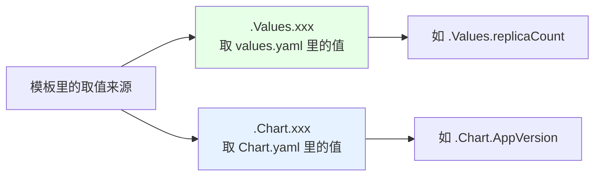
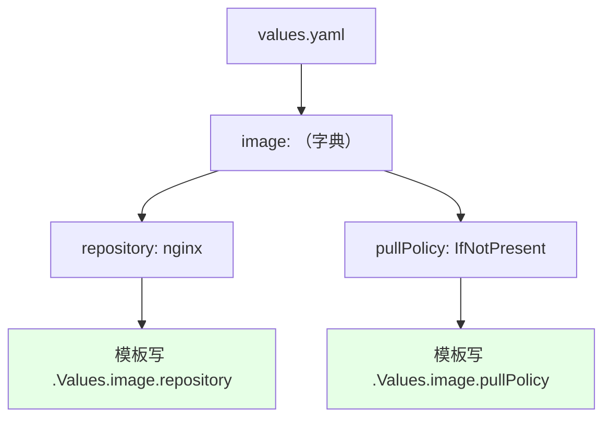
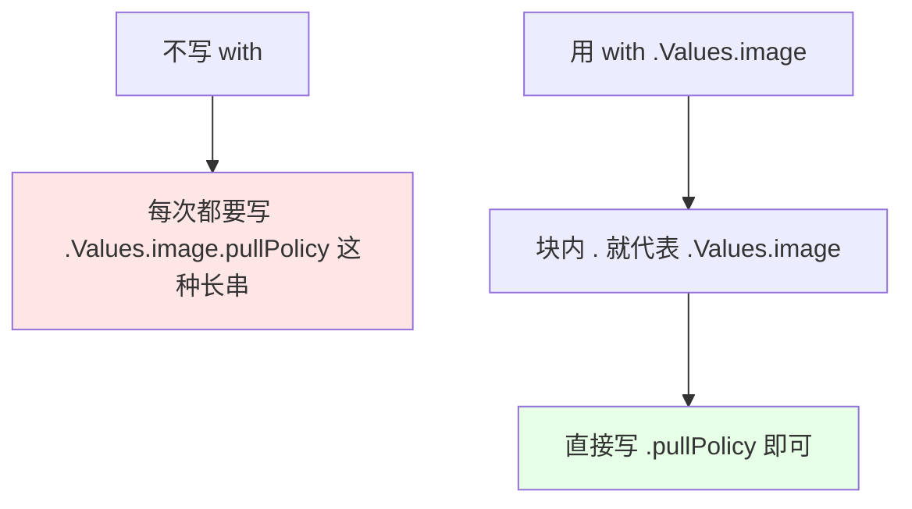
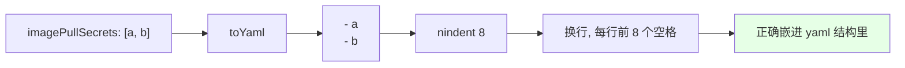
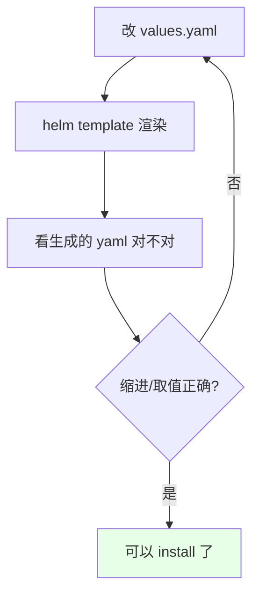

# Kubernetes 集群部署: Helm 语法上（Values 与 Chart 取值、with 作用域与 nindent 缩进）

这一节开始看模板的语法。**不自己写，先看现成 chart 是怎么写的**，等把语法过完再动手写自己的 Helm。

结论先摆：

1. **`values.yaml` 本身就是 yaml**：`replicaCount: 1` 就相当于定义了一个叫 `replicaCount` 的变量；
2. **模板里取值是固定写法**：`.Values.xxx` 取 `values.yaml` 里的值，`.Chart.xxx` 取 `Chart.yaml` 里的值；
3. **字典按层级往下点**：`.Values.image.repository`、`.Values.image.pullPolicy`；
4. **`with` 用来简化长前缀**：把当前作用域切到某个值，块内的 `.` 就代表那个值，不用每次都写一长串；
5. **`toYaml` + `nindent` 把值渲染成带缩进的 yaml 片段**：`nindent 8` 就是前面缩进 8 个空格，数组/字典这类结构全靠它输出。

## 纲要

- values.yaml 就是变量定义
- `.Values` 与 `.Chart` 两套取值来源
- 字典的层级取值
- 数组（切片）形式的值
- with 作用域：省掉重复前缀
- toYaml 与 nindent
- 改 values 看渲染结果

## values.yaml 就是变量定义

```yaml
# values.yaml
replicaCount: 1                 # ← 相当于定义了变量 replicaCount = 1

image:
  repository: nginx             # ← 镜像仓库地址
  pullPolicy: IfNotPresent      # ← 镜像下载策略

imagePullSecrets: []
```

> 全部是 yaml 格式，不熟悉 yaml 语法的话要先补一下 —— 缩进、字典、数组这三样必须搞清楚。

## `.Values` 与 `.Chart` 两套取值来源



| 写法 | 取值来源 | 示例 |
| --- | --- | --- |
| `.Values.xxx` | `values.yaml` | `.Values.replicaCount` → `1` |
| `.Chart.xxx` | `Chart.yaml` | `.Chart.AppVersion` → `1.16.0` |

```yaml

# templates/deployment.yaml（节选）
spec:
  replicas: {{ .Values.replicaCount }}          # ← 取 values.yaml 的 replicaCount

```

```yaml

# 取 Chart.yaml 里的 appVersion 作为镜像 tag 的默认值
image: "{{ .Values.image.repository }}:{{ .Values.image.tag | default .Chart.AppVersion }}"

```

上例中 `.Chart.AppVersion` 取的就是 `Chart.yaml` 里 `appVersion: 1.16.0` 这个值 —— **镜像 tag 没写时，默认用 chart 里声明的应用版本**。

## 字典的层级取值

`image` 是个字典，下面挂着 `repository` 和 `pullPolicy` 两个键，就按层级往下点：

```yaml

image: {{ .Values.image.repository }}
imagePullPolicy: {{ .Values.image.pullPolicy }}

```



## 数组（切片）形式的值

`imagePullSecrets` 是一个数组，里面可能有多个值。问题是：**取到它之后不能再继续往下点**（后面已经是具体值了）：

```yaml
# values.yaml
imagePullSecrets:
  - a
  - b
```

```yaml

# templates/ 里把整个数组渲染出来
{{- with .Values.imagePullSecrets }}
imagePullSecrets:
  {{- toYaml . | nindent 8 }}
{{- end }}

```

## with 作用域：省掉重复前缀

`with` 的作用是把**当前作用域切换**到某个值，块内的 `.` 就代表那个值：



```text

对比：

不用 with（前缀重复, 层级深时非常啰嗦）:
  {{ .Values.image.repository }}
  {{ .Values.image.pullPolicy }}
  {{ .Values.image.tag }}

用 with（把作用域切进 .Values.image）:
  {{- with .Values.image }}
  repository: {{ .repository }}
  pullPolicy: {{ .pullPolicy }}
  tag:        {{ .tag }}
  {{- end }}
  ↑ 块里的 . 就等于 .Values.image, 前面的长前缀全省了

```

层级越深越划算 —— 比如要写 `.Values.a.b.c.d.repository` 这一长串，用 `with .Values.a.b.c.d` 之后块内直接写 `.repository`。这是 Go template 里的标准写法。

## toYaml 与 nindent

| 函数 | 作用 |
| --- | --- |
| `toYaml` | 把当前值（数组 / 字典）转成 yaml 文本 |
| `nindent N` | 在前面换行并**缩进 N 个空格** |

```text

{{- toYaml . | nindent 8 }}

含义拆解:
  toYaml .      → 把当前作用域的值转成 yaml
  |             → 管道, 把结果传给下一个函数
  nindent 8     → 换行 + 在前面补 8 个空格

```



**缩进数字必须和它在目标 yaml 里的层级对齐**，否则渲染出来的 yaml 会缩进错乱、提交到集群直接报格式错。

## 语法速记（照着这张图套）

```text
Helm 模板语法的四种基本形态:

templates/deployment.yaml
├── 取值          .Values.replicaCount          ← 取 values.yaml 的标量
├── 层级取值      .Values.image.repository      ← 字典往下点
├── 切换作用域
│   └── with .Values.image                     ← 块内 . 即 .Values.image
│       ├── .pullPolicy
│       └── end
└── 结构化输出
    └── toYaml 管道 nindent 8                  ← 数组/字典渲染成 yaml 并缩进 8 格
```

## 改 values 看渲染结果

验证语法最直接的办法是改 `values.yaml` 再用 `helm template` 看渲染输出：

```bash
# 1. 给 imagePullSecrets 填上两个值
cat >> values.yaml <<'EOF'
imagePullSecrets:
  - a
  - b
EOF

# 2. 渲染看结果
helm template test . | grep -A 4 imagePullSecrets
# 预期输出：
#   imagePullSecrets:
#     - a
#     - b
```



## API 速览

| 能力 | 写法 |
| --- | --- |
| 取 values 里的值 | `{{ .Values.xxx }}` |
| 取 Chart.yaml 里的值 | `{{ .Chart.xxx }}` |
| 取字典子键 | `{{ .Values.image.repository }}` |
| 给个默认值 | `{{ .Values.image.tag \| default .Chart.AppVersion }}` |
| 简化长前缀 | `{{ with .Values.image }} … {{ end }}` |
| 数组/字典输出 | `{{ toYaml . \| nindent 8 }}` |
| 本地验证渲染 | `helm template <名> <chart目录>` |

## Demo 示例

```bash
# 1. 生成骨架并进入
helm create test
cd test

# 2. 看 values.yaml 里定义了哪些变量
cat values.yaml

# 3. 看 deployment.yaml 怎么取这些值
grep -n 'Values\|Chart' templates/deployment.yaml

# 4. 改一个值看渲染结果
helm template test . --set replicaCount=3 | grep -A 2 'replicas:'

# 5. 给数组填值，验证 toYaml + nindent 的输出
helm template test . --set imagePullSecrets[0]=a --set imagePullSecrets[1]=b \
  | grep -A 4 imagePullSecrets

# 6. 整份渲染出来检查缩进
helm template test . | head -80
```

### 总结

- **`values.yaml` 本身是 yaml，每行就是一个变量定义**：`replicaCount: 1` 就是一个叫 `replicaCount` 的变量，`image` 下面挂 `repository`（镜像仓库地址）和 `pullPolicy`（下载策略）两个子键；
- **模板取值是固定写法**：`.Values.xxx` 取 `values.yaml` 里的值，`.Chart.xxx` 取 `Chart.yaml` 里的值 —— 例如用 `.Chart.AppVersion` 作为镜像 tag 的默认值；
- **字典按层级往下点**（`.Values.image.repository`），**数组取到之后就不能再往下点了**，要用 `toYaml` 整体输出；
- **`with` 把当前作用域切进某个值，块内的 `.` 就代表它**，省掉一长串重复前缀，层级越深收益越大，这是 Go template 的标准写法；
- **`toYaml` 负责把数组/字典转成 yaml 文本，`nindent N` 负责换行并缩进 N 个空格**，缩进数字必须和目标 yaml 层级对齐，否则渲染出来的清单提交到集群会报格式错；
- **验证语法最快的方式是改 `values.yaml` 后跑 `helm template` 看渲染输出**，确认取值和缩进都对再 `install`。

