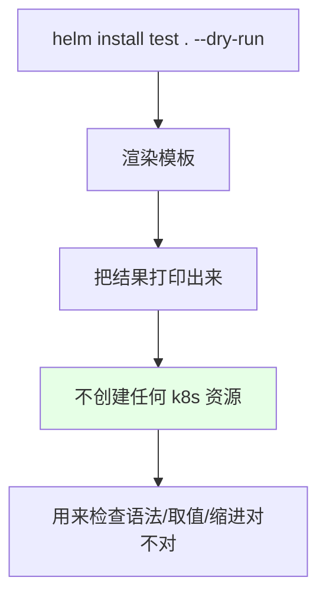
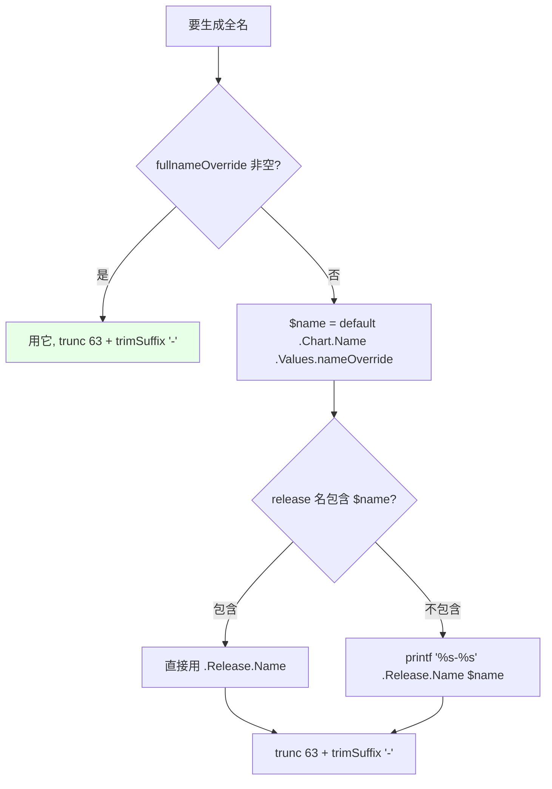
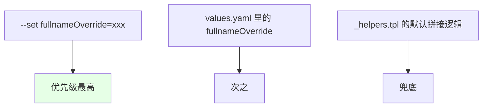
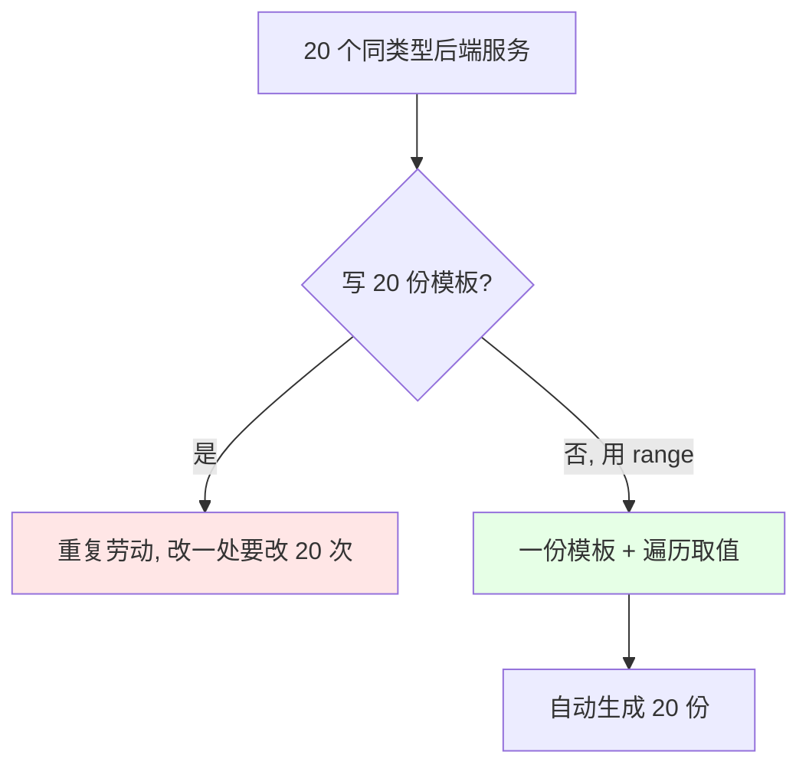

# Kubernetes 集群部署: Helm 语法下（dry-run 调试、_helpers.tpl 全名生成逻辑与 range 遍历）

上一节讲了取值和 `with`，这一节把剩下的语法补齐：**怎么用 `--dry-run` 只打印不部署来验语法**、**Deployment 的名字是怎么由 `_helpers.tpl` 生成的**、以及 **`range` 循环批量生成模板的用法**。

结论先摆：

1. **`helm install <名> . --dry-run` 只打印不部署**，不创建任何 k8s 资源，专门用来检查模板语法和渲染结果对不对；
2. **`imagePullSecrets` 期望的是「切片里装 map」**（`- name: a`），写成纯字符串会报 `expected a "." got string`；
3. **`include` 引用 `_helpers.tpl` 里 `define` 出来的模板**，生成的 Deployment 名称就来自 `helm-test.fullname` 这个模板；
4. **全名生成逻辑**：`fullnameOverride` 优先 → 否则看 release 名是否包含 chart 名（包含就用 release 名，不包含就拼 `<release>-<chart>`）→ 最后统一 `trunc 63` + `trimSuffix "-"`（超过 63 字符 DNS 认不了）；
5. **优先级：`--set` > `values.yaml` > 默认逻辑**；
6. **`{{- ` 去掉前面空格、`- }}` 去掉后面空格**；`range` 用来批量生成同类模板（比如 20 个参数相同的 Java 服务）。

## 纲要

- with 改变上下文后遍历出值
- 用 --dry-run 只打印不部署
- imagePullSecrets 的正确写法
- include 与 define：引用 _helpers.tpl
- 空格控制：横杠的作用
- 全名生成逻辑与 trunc / trimSuffix
- 变量定义与 default / contains / printf / replace
- 名称优先级：--set > values > 默认
- range 循环批量生成

## 用 --dry-run 只打印不部署



```bash
# 只打印不部署（注意最后那个 . 代表当前目录，别漏）
helm install test . --dry-run

# 想看渲染结果也可以用 helm template
helm template test .
```

> `with` 那里把当前上下文切成了 `values.imagePullSecrets` 这个切片，模板会把切片里的值遍历出来。

## imagePullSecrets 的正确写法

```text

错误写法（纯字符串）:
  imagePullSecrets:
    - a
    - b
  → 报错: expected a "." got string

正确写法（切片里装 map，带 name 字段）:
  imagePullSecrets:
    - name: a
    - name: b

```

```yaml
# values.yaml
imagePullSecrets:
  - name: a
  - name: b
```

```bash
# 渲染确认输出正确
helm install test . --dry-run | grep -A 4 imagePullSecrets
# imagePullSecrets:
#   - name: a
#   - name: b
```

它本质上是「**一个切片，里面包含了两个 map**」，不是两个字符串。

## include 与 define：引用 _helpers.tpl

```mermaid
flowchart LR
    A["templates/deployment.yaml"] --> B["include \"helm-test.fullname\" ."]
    B --> C["templates/_helpers.tpl 里 define 出来的模板"]
    C --> D["返回生成的全名字符串"]
    style C fill:#e6f2ff
```

| 关键字 | 含义 |
| --- | --- |
| `define` | **定义一个模板**（给模板起个名字） |
| `include` | **引用**一个函数或模板（位置在 `.tpl` 文件里） |

```yaml

# templates/deployment.yaml
metadata:
  name: {{ include "helm-test.fullname" . }}

```

```text

# templates/_helpers.tpl
{{- define "helm-test.fullname" -}}
{{- if .Values.fullnameOverride }}
{{- .Values.fullnameOverride | trunc 63 | trimSuffix "-" }}
{{- else }}
{{- $name := default .Chart.Name .Values.nameOverride }}
{{- if contains $name .Release.Name }}
{{- .Release.Name | trunc 63 | trimSuffix "-" }}
{{- else }}
{{- printf "%s-%s" .Release.Name $name | trunc 63 | trimSuffix "-" }}
{{- end }}
{{- end }}
{{- end }}

```

## 空格控制：横杠的作用

```text

{{- xxx }}   前面加横杠 → 去掉前面的空格
{{ xxx -}}   后面加横杠 → 去掉后面的空格

```

渲染出来多余的空行会让 yaml 变难看甚至出错，横杠就是用来吃掉这些空白的。

## 全名生成逻辑



| 函数 | 作用 |
| --- | --- |
| `trunc 63` | 取前 63 个字符；**正数从前往后取，负数从后往前取** |
| `trimSuffix "-"` | 去掉字符串**末尾**指定的字符（对应地 `prefix` 是去掉前面的） |
| `default` | 取默认值 |
| `contains` | 判断是否包含 |
| `printf "%s"` | 格式化打印，`%s` 是占位符 |
| `replace` | 替换（如把 `+` 替换成 `_`） |

> **为什么要 trunc 63**：名字超过 63/64 个字符 **DNS 就识别不了**（解析失败），所以必须截断并去掉末尾的横杠。

```text

$name := default .Chart.Name .Values.nameOverride
含义：定义一个变量 $name，默认取 .Chart.Name；
     如果 .Values.nameOverride 非空，就取 .Values.nameOverride

```

### 实测名称结果

| release 名 | chart 名 | 是否包含 | 生成结果 |
| --- | --- | --- | --- |
| `test` | `helm-test` | 否 | `test-helm-test` |
| 名字里包含 chart 名的 release | `helm-test` | 是 | **直接用 release 名** |

```bash
# 不包含时：两个名字拼一起
helm install test . --dry-run | grep 'name:'

# 包含时：直接用 release 名
helm install helm-test . --dry-run | grep 'name:'
```

> **别把 release 名和 chart 名搞混**：`Release.Name` 是 `helm install` 时你指定的那个名字；`.Chart.Name` 是 `Chart.yaml` 里 chart 自己的名字。

## _helpers.tpl 里的语法要素

```text
templates/_helpers.tpl 里的语法要素清单:

_helpers.tpl
├── define "helm-test.fullname"     ← 定义一个模板（供 include 引用）
│   ├── if .Values.fullnameOverride
│   │   └── trunc 63 → trimSuffix "-"        ← 直接用覆盖值
│   └── else
│       ├── $name := default .Chart.Name .Values.nameOverride   ← 定义变量 + 默认值
│       ├── if contains $name .Release.Name
│       │   └── .Release.Name                 ← release 名里已包含, 直接用
│       └── else
│           └── printf "%s-%s" .Release.Name $name   ← 否则拼起来
└── 横杠
    ├── 前横杠（左）→ 去掉前面的空格
    └── 后横杠（右）→ 去掉后面的空格
```

## 名称优先级



```bash
# --set 的优先级高于 values.yaml，values.yaml 又高于默认逻辑
helm install test . --dry-run --set fullnameOverride=iaa | grep 'name:'
# 名称直接变成 iaa
```

## range 循环批量生成

最实用的场景：**一堆同类型服务（比如 20 个 Java / Spring Boot 后端），启动命令和参数都一样** —— 没必要写 20 份模板，用 `range` 一份搞定：



```yaml

# 遍历切片
{{- range $v := .Values.services }}
---
apiVersion: apps/v1
kind: Deployment
metadata:
  name: {{ $v.name }}
spec:
  replicas: {{ $v.replicaCount }}
  template:
    spec:
      containers:
        - name: {{ $v.name }}
          image: "{{ $v.image }}"
{{- end }}

# 遍历 map（同时拿到 key 和 value）
{{- range $k, $v := .Values.services }}
{{ $k }}: {{ $v }}
{{- end }}

```

`range` 的写法和 Go 语言里的一样（`$k`、`$v` 分别是键和值），既能遍历切片也能遍历 map。

## 其它常用函数

```text

Go template 常用函数（写作时按需查文档）:

trunc       截断（正: 从前往后 / 负: 从后往前）
trimSuffix  去掉末尾指定字符
trimPrefix  去掉开头指定字符
upper       转大写
lower       转小写
repeat      重复多少遍
indent      缩进
quote       加引号
contains    包含判断
default     默认值
printf      格式化打印
replace     替换

```

Helm 是个非常成熟的工具，官方文档和网上资料都很全，不常用的函数查一下或者看字面意思就能明白。

## API 速览

| 能力 | 写法 |
| --- | --- |
| 只打印不部署 | `helm install <名> . --dry-run` |
| 本地渲染 | `helm template <名> .` |
| 引用模板 | `{{ include "模板名" . }}` |
| 定义模板 | `{{ define "模板名" }}…{{ end }}` |
| 去空格 | `{{- … }}` / `{{ … -}}` |
| 定义变量 | `{{ $name := default .Chart.Name .Values.nameOverride }}` |
| 截断 | `{{ .Release.Name \| trunc 63 \| trimSuffix "-" }}` |
| 遍历 | `{{ range $k, $v := .Values.xxx }}…{{ end }}` |
| 覆盖变量 | `--set fullnameOverride=xxx` |

## Demo 示例

```bash
# 1. 只打印不部署，检查语法
helm install test . --dry-run

# 2. 修正 imagePullSecrets 为「切片装 map」
helm install test . --dry-run | grep -A 4 imagePullSecrets

# 3. 看生成的 Deployment 名称（release 名不包含 chart 名时）
helm install test . --dry-run | grep 'name:'
# → test-helm-test

# 4. release 名包含 chart 名时，直接用 release 名
helm install helm-test . --dry-run | grep 'name:'

# 5. --set 覆盖 fullnameOverride，优先级最高
helm install test . --dry-run --set fullnameOverride=iaa | grep 'name:'
# → iaa

# 6. 看整个 _helpers.tpl 里的模板定义
cat templates/_helpers.tpl

# 7. 确认无误后再真正安装
helm install test .
```

### 总结

- **`helm install <名> . --dry-run` 只打印不部署**，不创建任何 k8s 资源，是检查模板语法、取值和缩进是否正确的标准手段（最后的 `.` 代表当前目录，别漏）；
- **`imagePullSecrets` 要写成「切片里装 map」（`- name: a`）**，写成纯字符串会报 `expected a "." got string`；
- **`include` 负责引用、 `define` 负责定义模板**，Deployment 的名称就来自 `_helpers.tpl` 里 `define` 出来的 `helm-test.fullname`；模板里 `{{- ` 去前面空格、`- }}` 去后面空格；
- **全名生成逻辑**：`fullnameOverride` 非空就直接用它；否则取 `$name = default .Chart.Name .Values.nameOverride`，再判断 release 名是否包含它 —— 包含就用 release 名，不包含就拼成 `<release>-<chart>`；最后统一 `trunc 63` + `trimSuffix "-"`（**名字超过 63 字符 DNS 就解析不了**）；
- **优先级是 `--set` > `values.yaml` > `_helpers.tpl` 默认逻辑**；另外别混淆 `Release.Name`（install 时指定的名字）和 `.Chart.Name`（chart 自己的名字）；
- **`range` 用来批量生成同类模板**：20 个启动参数相同的 Java 后端服务，一份模板加一个 `range` 就能全生成，写法和 Go 的 `for … range` 一致，既能遍历切片也能遍历 map。

