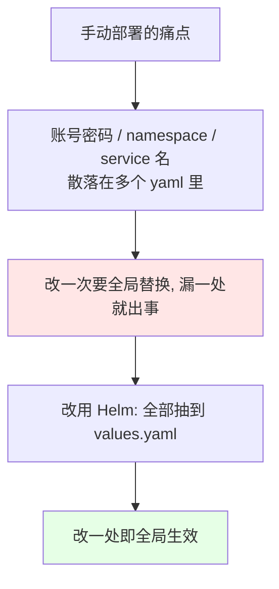
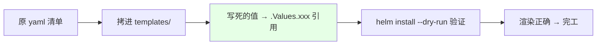
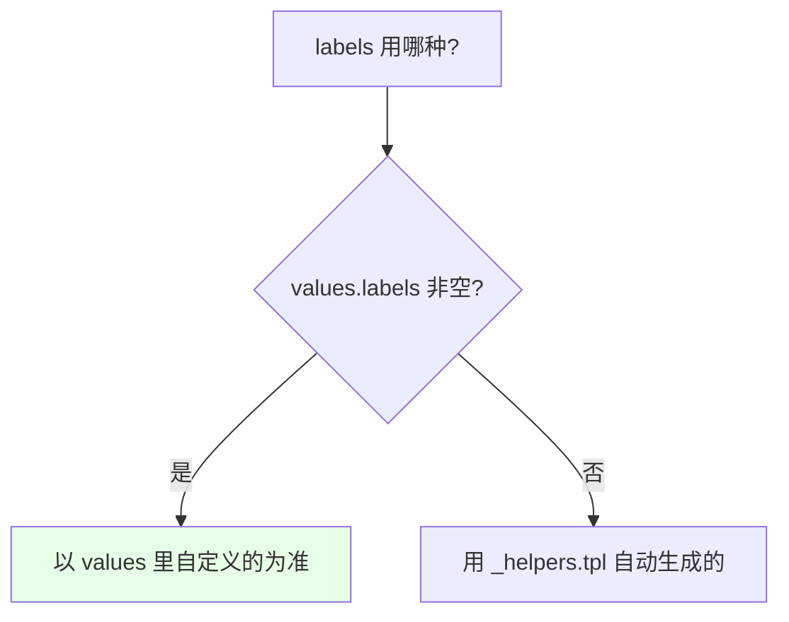
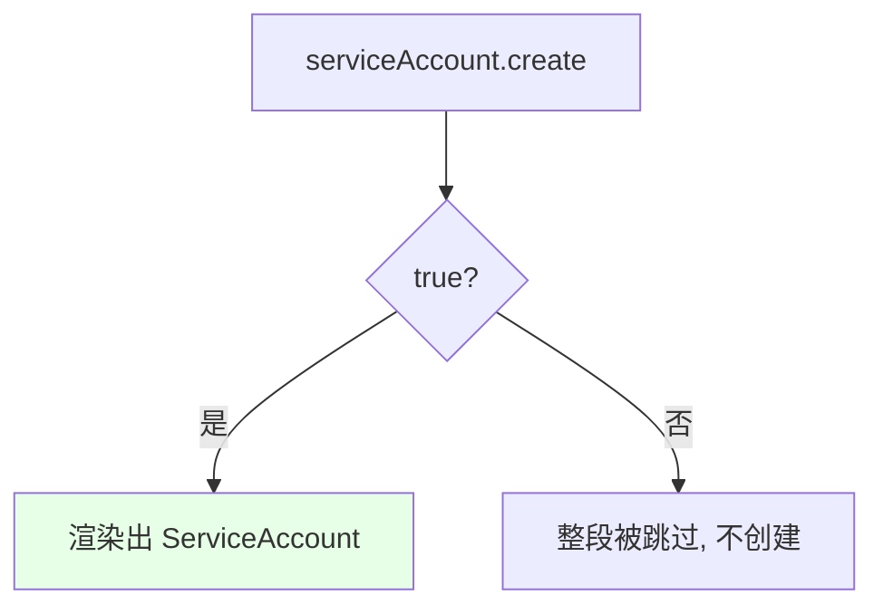
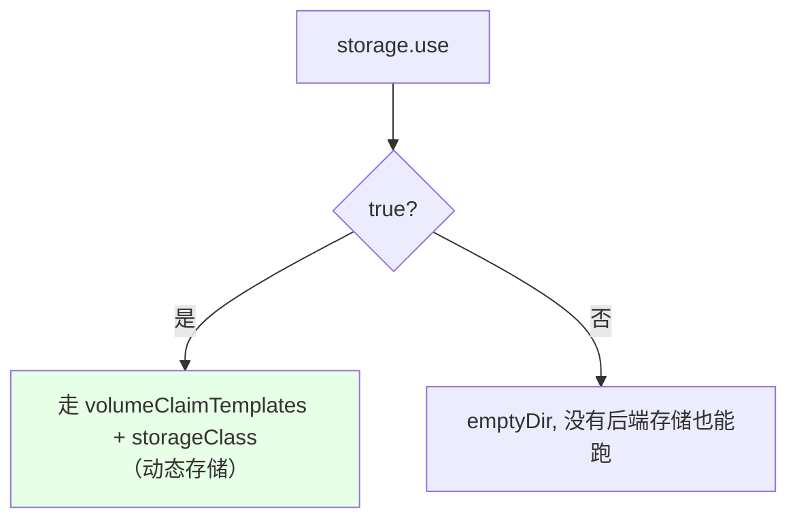

# Kubernetes 集群部署: 编写 Helm 部署 RabbitMQ 集群（把散落参数抽进 values.yaml 的改造实录）

前面手动部署 RabbitMQ 集群时踩过一个痛点：**账号密码、namespace、service 名称散落在好几个文件里，改一次要全局替换**。这一节就把它改造成 Helm chart —— 把**经常变动的参数抽到 `values.yaml`**，模板里全部改成引用。

结论先摆：

1. **改造流程固定四步**：`helm create` 生成骨架 → 删掉 `templates/` 里不需要的东西 → 把已有的 yaml 拷进 `templates/` → 把要变的值改成 `.Values.*` 引用；
2. **labels、名称、副本数、镜像这类都抽成变量**，用 `--dry-run` 边改边验；
3. **namespace 不要写进模板**，`helm install -n` 指定即可（也可以取 `.Release.Namespace`）；
4. **`matchLabels` 必须和 Pod 的 labels 一致**，否则 Service 匹配不到后端 Pod；
5. **values 里自己定义 `service` 段容易和模板里同名变量冲突**（课程实踩报错），检查好层级；
6. **存储用 `if` 做二选一**：有后端存储就走 `storageClass`（动态存储），没有就用 `emptyDir`。

## 纲要

- 为什么要把 RabbitMQ 改成 Helm 安装
- 第一步：helm create 生成骨架并清理
- 第二步：把已有清单拷进 templates
- 第三步：labels 的两种做法
- 名称、namespace、副本数的改造
- service 一分为二：无头与负载均衡
- 镜像与拉取策略
- serviceAccount 与 secret 的条件创建
- 存储：storageClass 与 emptyDir 二选一
- 边改边验：--dry-run

## 为什么要把 RabbitMQ 改成 Helm 安装



## 第一步：helm create 生成骨架并清理

```bash
# 生成骨架
helm create rabbitmq-cluster
cd rabbitmq-cluster

# 删掉 templates 里不需要的（保留 _helpers.tpl 和 NOTES.txt）
rm -f templates/deployment.yaml
rm -f templates/ingress.yaml
rm -f templates/serviceaccount.yaml
rm -f templates/hpa.yaml
rm -rf templates/tests
```

```text
改造后的 chart 目录:

rabbitmq-cluster/
├── Chart.yaml                 ← chart 元信息
├── values.yaml                ← ★ 所有要改的参数都放这里
├── charts/
└── templates/
    ├── _helpers.tpl           ← 保留（引用它的 fullname 模板）
    ├── NOTES.txt              ← 保留（按需改）
    ├── configmap.yaml         ← 从原部署拷进来
    ├── secret.yaml            ← 从原部署拷进来
    ├── rbac.yaml              ← 从原部署拷进来
    ├── service.yaml           ← 从原部署拷进来（无头 + 负载均衡两个）
    └── statefulset.yaml       ← 从原部署拷进来
```

> 不要一行行手写，`helm create` 生成骨架后删掉内容、把已有 yaml 搬过来改，效率最高。

## 第二步：把已有清单拷进 templates

把之前手动部署 RabbitMQ 集群用的 ConfigMap、Secret、RBAC、Service、StatefulSet 全部拷到 `templates/` 下，然后逐个把要变的值改成模板引用。



## 第三步：labels 的两种做法

### 做法一：直接用 _helpers.tpl 自动生成

```yaml

metadata:
  labels:
    {{- include "rabbitmq-cluster.labels" . | nindent 4 }}

```

> **缩进一定要数清楚**：yaml 靠空格分层级，`nindent 4` 就是缩进 4 个空格；多出来的空行用语法前后的**横杠**去掉。

### 做法二：在 values.yaml 里自定义 labels

```yaml
# values.yaml
labels:
  app: rabbitmq-cluster
  helm: true
```

```yaml

metadata:
  labels:
    {{- with .Values.labels }}
    {{- toYaml . | nindent 4 }}
    {{- end }}

```



两种做法不冲突：**自定义的非空就用自定义的，为空就回落到默认模板**。

## 名称、namespace、副本数的改造

| 原写法 | 改成 | 说明 |
| --- | --- | --- |
| 写死的名称 | `{{ .Release.Name }}` 或 `{{ include "…fullname" . }}` | `.Release.Name` 就是 `helm install` 时指定的名字 |
| 写死的 namespace | **不写**，或 `{{ .Release.Namespace }}` | 安装时用 `-n` 指定即可 |
| `replicas: 3` | `{{ .Values.replicaCount }}` | 副本数经常改，必须抽出来 |

```yaml

# statefulset.yaml（节选）
metadata:
  name: {{ .Release.Name }}
spec:
  replicas: {{ .Values.replicaCount }}
  selector:
    matchLabels:
      {{- include "rabbitmq-cluster.selectorLabels" . | nindent 6 }}

```

> **`matchLabels` 必须和 Pod 的 labels 完全一致**，否则 Service / StatefulSet 匹配不到后端 Pod，服务就不通了。

## service 一分为二

RabbitMQ 需要两个 Service，都在 `values.yaml` 里定义：

```yaml
# values.yaml
service:
  type: ClusterIP
  headless:
    name: rabbitmq-cluster-headless
  loadbalance:
    name: rabbitmq-cluster-lb
```

| Service | 用途 |
| --- | --- |
| **无头 Service**（`clusterIP: None`） | 集群内部通讯 + 服务发现 |
| **负载均衡 Service** | **开发程序连接用的地址** |

```yaml

# templates/service.yaml
apiVersion: v1
kind: Service
metadata:
  name: {{ .Values.service.headless.name }}
spec:
  clusterIP: None
  selector:
    {{- include "rabbitmq-cluster.selectorLabels" . | nindent 4 }}
  ports:
    - port: 5672
---
apiVersion: v1
kind: Service
metadata:
  name: {{ .Values.service.loadbalance.name }}
spec:
  type: {{ .Values.service.type }}
  selector:
    {{- include "rabbitmq-cluster.selectorLabels" . | nindent 4 }}
  ports:
    - port: 5672
    - port: 15672

```

> **课程实踩的坑**：`values.yaml` 里自己定义了 `service` 段之后，模板里再出现同名的 `service` 变量会**取到最内层那个**，导致 `headless` 取不到值报空指针。检查一下层级，**把冲突的那个注掉**即可；`NOTES.txt` 里如果也引用了它，先挪走或一起改掉。

## 镜像与拉取策略

```yaml
# values.yaml
image:
  repository: rabbitmq:3.8.3-management
  pullPolicy: IfNotPresent
```

```yaml

spec:
  containers:
    - name: rabbitmq
      image: {{ .Values.image.repository }}
      imagePullPolicy: {{ .Values.image.pullPolicy }}

```

## serviceAccount 与 secret 的条件创建

```yaml
# values.yaml
serviceAccount:
  create: true
  name: rabbitmq-cluster

secret:
  name: rabbitmq-cluster-secret

auth:
  username: <账号>
  password: <密码>
```

```yaml

# templates/rbac.yaml（用 if 控制是否创建 ServiceAccount）
{{- if .Values.serviceAccount.create }}
apiVersion: v1
kind: ServiceAccount
metadata:
  name: {{ .Values.serviceAccount.name }}
  namespace: {{ .Release.Namespace }}
{{- end }}

```



改成 `false` 再 `--dry-run`，渲染结果里 ServiceAccount 就消失了 —— 这就是 `if` 控制创建的好处。

账号密码同理，全部从 `.Values.auth.*` 引用，改密码只需要动 `values.yaml` 一处。

## 存储：storageClass 与 emptyDir 二选一

```yaml
# values.yaml
storage:
  use: false            # true 表示用后端存储
  name: my-sc          # storageClass 名称
  size: 5Gi
  accessMode: ReadWriteOnce
```

```yaml

# templates/statefulset.yaml（存储段）
{{- if .Values.storage.use }}
  volumeClaimTemplates:
    - metadata:
        name: data
      spec:
        storageClassName: {{ .Values.storage.name }}
        accessModes: ["{{ .Values.storage.accessMode }}"]
        resources:
          requests:
            storage: {{ .Values.storage.size }}
{{- else }}
      volumes:
        - name: data
          emptyDir: {}
{{- end }}

```



## 边改边验：--dry-run

**每改一处就跑一次 `--dry-run`**，别等全改完再看 —— 到那时输出一大片，根本找不到问题在哪。

```bash
# 只打印不部署，检查语法和渲染结果
helm install rabbitmq-cluster-test . --dry-run

# 只看某一项是否改对
helm install rabbitmq-cluster-test . --dry-run | grep -A 4 'image:'
helm install rabbitmq-cluster-test . --dry-run | grep -A 4 'labels:'

# 用 --set 临时改值验证优先级
helm install rabbitmq-cluster-test . --dry-run --set replicaCount=5
```

```text
改造完成后要逐项核对的清单:

helm install … --dry-run 输出里逐项确认
├── ConfigMap 名称 / 插件 / 账号密码   ← 是否取自 values
├── Secret 名称 / 账号密码             ← 是否引用正确
├── ServiceAccount 名称                ← 是否与 RBAC 里的一致
├── Service 的 selector                ← 是否与 Pod labels 一致
├── Service 名称（无头 + 负载均衡）     ← 是否取自 values
├── StatefulSet 的 replicas / image     ← 是否取自 values
└── 存储段                             ← storageClass / emptyDir 二选一是否生效
```

## API 速览

| 能力 | 做法 |
| --- | --- |
| 生成骨架 | `helm create <名称>` |
| 清理模板 | 删掉 `templates/` 里用不上的文件 |
| 自动 labels | `{{ include "<chart>.labels" . \| nindent N }}` |
| 自定义 labels | `{{ with .Values.labels }}{{ toYaml . \| nindent N }}{{ end }}` |
| 取 release 名 | `{{ .Release.Name }}` |
| 取 namespace | `{{ .Release.Namespace }}` |
| 条件创建 | `{{ if .Values.xxx.create }}…{{ end }}` |
| 存储二选一 | `{{ if .Values.storage.use }}…{{ else }}…{{ end }}` |
| 逐项验证 | `helm install <名> . --dry-run` |

## Demo 示例

```bash
# 1. 生成骨架并清理
helm create rabbitmq-cluster
cd rabbitmq-cluster
rm -f templates/deployment.yaml templates/ingress.yaml templates/serviceaccount.yaml
rm -rf templates/tests

# 2. 把手动部署时那套清单拷进 templates/
cp ../rabbitmq-yaml/*.yaml templates/

# 3. 逐处改成 .Values 引用，每改一处验一次
helm install rabbitmq-cluster-test . --dry-run

# 4. 核对 labels 是否与 selector 一致
helm install rabbitmq-cluster-test . --dry-run | grep -A 6 'selector:'

# 5. 核对镜像、副本数是否取自 values
helm install rabbitmq-cluster-test . --dry-run | grep -A 2 'image:'
helm install rabbitmq-cluster-test . --dry-run | grep 'replicas:'

# 6. 验证 serviceAccount 的条件创建
helm install rabbitmq-cluster-test . --dry-run --set serviceAccount.create=false \
  | grep -c 'kind: ServiceAccount'

# 7. 验证存储二选一
helm install rabbitmq-cluster-test . --dry-run --set storage.use=true \
  | grep -A 6 'volumeClaimTemplates'

# 8. 确认无误后真正安装
helm install rabbitmq-cluster . -n public-service
```

### 总结

- **把手动部署改造成 Helm 的核心动机是「改一次要全局替换」**：账号密码、namespace、service 名称散落在多个文件里，抽到 `values.yaml` 之后改一处即可；
- **改造流程四步**：`helm create` 生成骨架 → 删掉 `templates/` 里用不上的文件（保留 `_helpers.tpl` 和 `NOTES.txt`）→ 把已有清单拷进 `templates/` → 把要变的值改成 `.Values.*` 引用；
- **labels 有两条路**：直接用 `include` 引用 `_helpers.tpl` 自动生成，或者在 `values.yaml` 里自定义（用 `if` / `with` + `toYaml` + `nindent`，非空以自定义为准、为空回落默认）；**缩进的空格数必须数清楚**；
- **名称用 `.Release.Name`、namespace 不必写进模板**（安装时 `-n` 指定，或取 `.Release.Namespace`）、副本数用 `.Values.replicaCount`；**`matchLabels` 必须和 Pod labels 完全一致**，否则匹配不到后端 Pod；
- **两个 Service 都在 values 里定义**（无头 Service 供集群内部通讯与发现，负载均衡 Service 是程序连接入口）；**课程实踩过 values 里 `service` 段与模板内同名变量冲突导致取值取到最内层报空指针**，注意层级，必要时把冲突项注掉，`NOTES.txt` 里的引用也要一起处理；
- **存储用 `if` 做二选一**：`storage.use=true` 走 `volumeClaimTemplates` + `storageClass`（动态存储），否则用 `emptyDir`（没有后端存储也能跑）；`serviceAccount` 也用 `if` 控制是否创建；**每改一处就跑一次 `helm install … --dry-run`**，别攒到最后一次性看。

