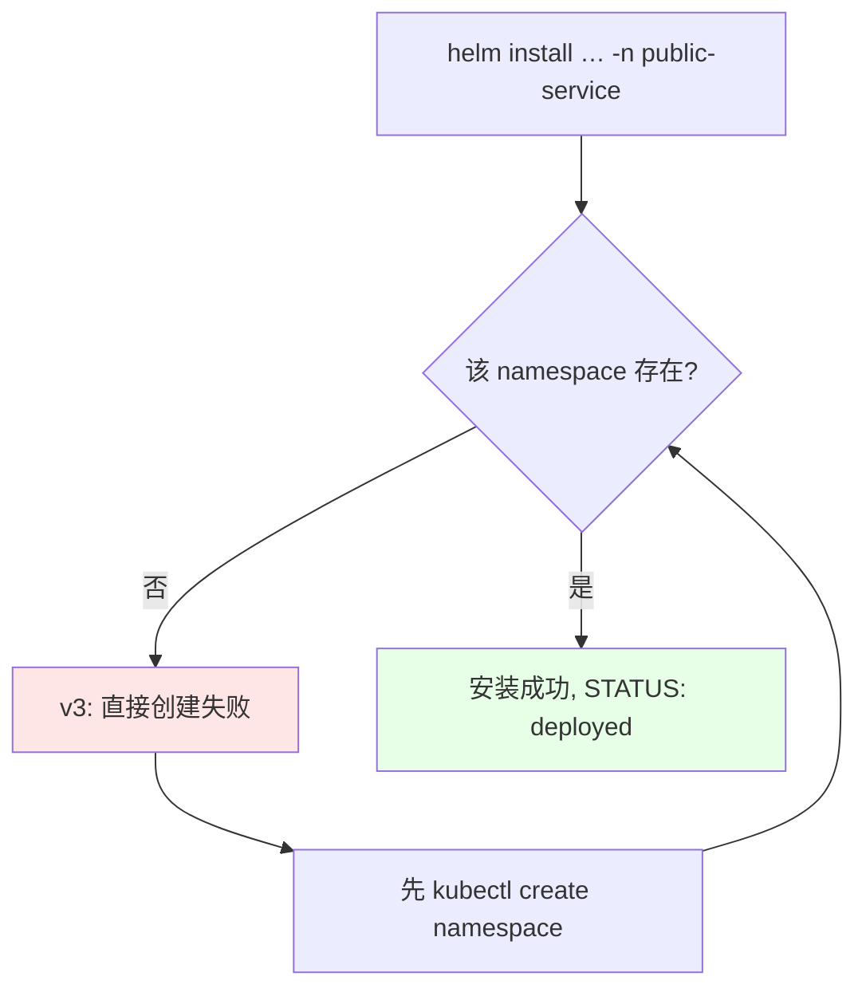
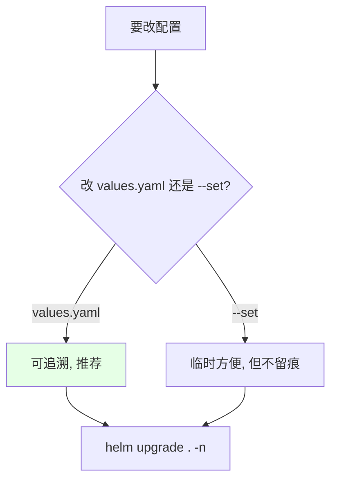
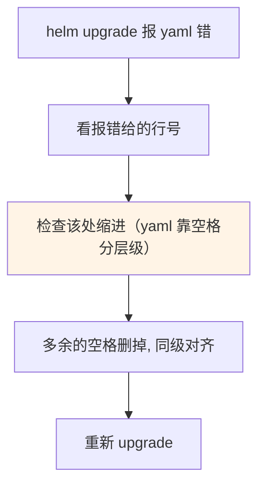
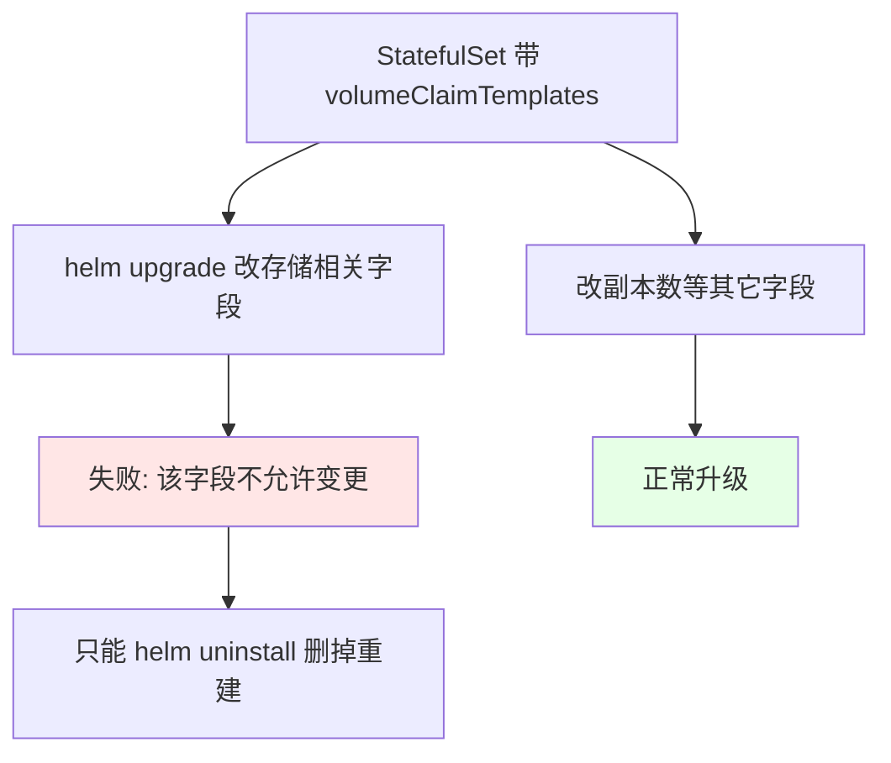
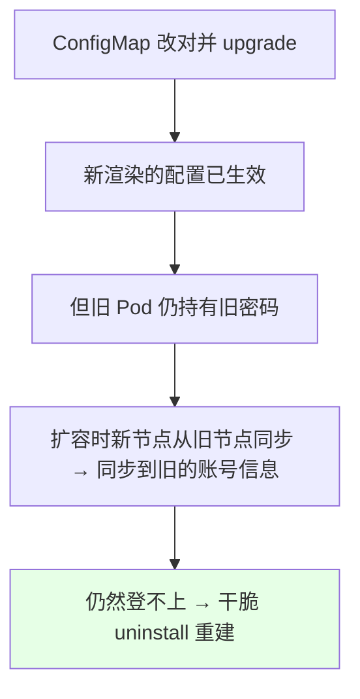

# Kubernetes 集群部署: 运行自己编写的 Helm（install / upgrade / uninstall 的实操踩坑）

上一节把 RabbitMQ 集群改造成了自己的 chart，这一节真正跑起来：**安装 → 改参数升级 → 删掉重来**。全程踩了四个坑，都记在下面。

结论先摆：

1. **v3 不会自动建 namespace**，必须提前 `kubectl create namespace` —— 这是为了符合 k8s 的标准（namespace 都不存在，资源不该创建成功）；
2. **安装时可以用 `--set` 覆盖参数**，但课程建议**直接改 `values.yaml` 再 `upgrade`**，因为下次升级时你记不清上次 `--set` 过什么；
3. **`StatefulSet 的 `volumeClaimTemplates` 一旦创建就不能改**，所以带动态存储的集群没法靠 upgrade 改存储，只能删掉重建（副本数这类还是能改的）；
4. **升级报 yaml 错先查缩进**：课程里 `volume` 段多了两个空格、`name` 没对齐，直接导致 upgrade 失败；
5. **删除在 v3 是 `helm uninstall`**（默认清空，加 `--keep-history` 保留记录）；v2 是 `helm delete --purge`。

## 纲要

- 安装：提前建 namespace
- 用 --set 覆盖参数
- 查看已安装的 release
- 升级：改 values 还是 --set
- 坑一：模板缩进不对导致 upgrade 失败
- 坑二：volumeClaimTemplates 不可变更
- 删除：v3 的 uninstall 与 keep-history
- 坑三：NOTES.txt 挪走后不再打印提示
- 坑四：ConfigMap 里账号密码写反

## 安装：提前建 namespace

```bash
# 1. Helm v3 不会自动创建 namespace，必须提前建好
kubectl create namespace public-service

# 2. 进到 chart 根目录，安装（末尾的 . 代表当前 chart 目录）
cd rabbitmq-cluster
helm install rabbitmq-cluster . -n public-service
```



> **v2 和 v3 在这里差别很大**：v2 发现 namespace 不存在会自动建一个；**v3 严格按 k8s 标准来 —— namespace 不存在就创建失败**。

安装成功的输出里能看到：`STATUS: deployed`、release 名称、namespace。

## 用 --set 覆盖参数

```bash
# 安装时把副本数改成 2
helm install rabbitmq-cluster . -n public-service --set replicaCount=2
```

| 方式 | 优点 | 缺点 |
| --- | --- | --- |
| `--set key=value` | 临时改一个值很方便 | **下次升级时你不知道上次 set 过什么** |
| 改 `values.yaml` | 配置可追溯、进版本库 | 要改文件 |

> 课程里的习惯是**直接改 `values.yaml` 再 `upgrade`**，很少用 `--set` —— 因为 `--set` 不留痕，隔一段时间再升级就不知道上次改了什么。当然这看个人喜好。

## 查看已安装的 release

```bash
# v3：有 namespace 概念，必须指定 -n
helm list -n public-service

# v2：直接 helm list 就能看到所有 release
helm list
```

```text
NAME                 NAMESPACE        REVISION  STATUS    CHART
rabbitmq-cluster     public-service    1         deployed  rabbitmq-cluster-0.1.0
```

## 升级：改 values 还是 --set

```bash
# 改完 values.yaml 之后升级
helm upgrade rabbitmq-cluster . -n public-service
```



## 坑一：模板缩进不对导致 upgrade 失败

课程里 upgrade 报错，定位到模板文件的第 107 行附近 —— **是 `volume` 段多了两个空格、`name` 没和同级对齐**：

```text

错误（volume 段多了两格, name 没对齐）:

    volumes:
        - name: data
          emptyDir: {}
        name: rabbitmq        ← 多了两个空格, 层级错了

正确（name 与 volumes 同级对齐）:

    volumes:
      - name: data
        emptyDir: {}
    name: rabbitmq

```



这类错**不会在 `helm create` 阶段暴露**，只有渲染时才会炸 —— 所以 `--dry-run` 要勤跑。

## 坑二：volumeClaimTemplates 不可变更



课程里先把动态存储（storage）关掉再升级就报错，根源就在这里：**StatefulSet 一旦加了动态存储就不能再改**，只能删掉重来；改副本数这类字段是没问题的。

## 删除：v3 的 uninstall 与 keep-history

```bash
# v3：卸载（默认就把记录也清了）
helm uninstall rabbitmq-cluster -n public-service

# v3：保留历史记录（资源删掉，但 helm 的记录留着，方便恢复）
helm uninstall rabbitmq-cluster -n public-service --keep-history

# v2 的写法对比
helm delete rabbitmq-cluster --purge
```

| 版本 | 删除命令 | 默认行为 |
| --- | --- | --- |
| v2 | `helm delete <名>` | 不加 `--purge` 记录还在 |
| **v3** | **`helm uninstall <名>`** | **默认就带 purge，什么都不留**；要保留加 `--keep-history` |

## 坑三：NOTES.txt 挪走后不再打印提示

`NOTES.txt` 只有放在 **`templates/` 目录下**才会在安装后打印提示信息。课程里把它挪到了 chart 根目录，所以安装完提示信息很少 —— 想看提示就把它放回 `templates/`。

## 坑四：ConfigMap 里账号密码写反

安装后用自定义账号登录失败，最后查出来是 **ConfigMap 模板里 `username` 和 `password` 取值写反了**：

```text

错误（两个值写反）:
    default_user = {{ .Values.auth.password }}
    default_pass = {{ .Values.auth.username }}

正确:
    default_user = {{ .Values.auth.username }}
    default_pass = {{ .Values.auth.password }}

```

改完 ConfigMap 再 `upgrade` 后，值确实更新了，但**旧 Pod 里还是旧的账号密码，要等 Pod 重建才生效**。

课程里还出现一个现象：**扩容出来的 rabbitmq-1 是从 rabbitmq-0 同步过来的**，把「写反的那份账号信息」也同步了过去，所以扩容后依然登不上 —— 最后干脆整个删掉重建才正常。



## 安装结果核对

```bash
# 确认该有的资源都创建了
kubectl get pod -n public-service
kubectl get svc -n public-service        # 无头 Service + 负载均衡 Service
kubectl get configmap -n public-service
kubectl get secret -n public-service

# 控制台端口 15672（课程环境是 NodePort 32575）
kubectl get svc -n public-service | grep 15672
```

```text
一次成功安装后应看到的资源:

namespace public-service
├── Pod       rabbitmq-0 / rabbitmq-1 …
├── Service   rabbitmq-cluster-headless（无头, 集群内部通讯）
├── Service   rabbitmq-cluster-lb（程序连接入口, 15672 控制台）
├── ConfigMap rabbitmq-cluster（插件 + 集群发现 + 账号密码）
├── Secret    rabbitmq-cluster-secret
└── ServiceAccount / Role / RoleBinding（endpoints 的 get 权限）
```

## API 速览

| 能力 | 做法 |
| --- | --- |
| 安装 | `helm install <release名> . -n <ns>` |
| 安装时改值 | `helm install … --set key=value` |
| 看 release | `helm list -n <ns>`（v3 必须带 `-n`） |
| 升级 | `helm upgrade <release名> . -n <ns>` |
| 删除（v3） | `helm uninstall <release名> -n <ns>` |
| 删除但保留记录 | 加 `--keep-history` |
| 删除（v2） | `helm delete <名> --purge` |
| 渲染验证 | `helm install <名> . --dry-run` |
| 提前建 namespace | `kubectl create namespace <ns>` |

## Demo 示例

```bash
NS=public-service

# 1. v3 必须提前建 namespace
kubectl create namespace $NS

# 2. 安装（--set 临时改副本数）
cd rabbitmq-cluster
helm install rabbitmq-cluster . -n $NS --set replicaCount=1

# 3. 查看安装结果
helm list -n $NS
kubectl get pod,svc,configmap,secret -n $NS

# 4. 改 values.yaml（推荐做法，可追溯）
vi values.yaml

# 5. 先 dry-run 确认模板没问题，再 upgrade
helm upgrade rabbitmq-cluster . -n $NS --dry-run
helm upgrade rabbitmq-cluster . -n $NS

# 6. 遇到 StatefulSet 存储字段不可变更 → 只能删掉重建
helm uninstall rabbitmq-cluster -n $NS
helm install rabbitmq-cluster . -n $NS

# 7. 保留历史地卸载（方便恢复）
helm uninstall rabbitmq-cluster -n $NS --keep-history

# 8. 确认控制台能访问
kubectl get svc -n $NS | grep 15672
```

### 总结

- **Helm v3 不会自动创建 namespace**，必须先 `kubectl create namespace`，这是为了符合 k8s「namespace 不存在则资源不该创建成功」的标准；v2 会自动建，这一点差别很大；
- **安装时用 `--set` 可以临时覆盖参数**，但课程建议**直接改 `values.yaml` 再 `upgrade`** —— `--set` 不留痕，下次升级时你根本记不清上次 set 过什么；
- **升级报 yaml 错优先查缩进**：课程实踩 `volume` 段多了两个空格、`name` 没与同级对齐，直接导致 upgrade 失败，所以 `--dry-run` 要勤跑；
- **`StatefulSet` 的 `volumeClaimTemplates`（动态存储）创建后不可变更**：带存储的集群没法靠 upgrade 改存储，只能 `uninstall` 后重建，副数这类字段则不受影响；
- **删除在 v3 是 `helm uninstall`，且默认就带 purge**（什么都不留），要保留记录方便恢复得加 `--keep-history`；v2 是 `helm delete --purge`；另外 `helm list` 在 v3 有 namespace 概念，必须带 `-n`；
- **两个小坑**：`NOTES.txt` 只有放在 `templates/` 下才会打印提示；ConfigMap 模板里 `username` / `password` 取值写反会导致登录失败，且**扩容出来的新节点会从旧节点同步账号信息**，把错误状态一起带过去 —— 这种时候干脆整个删掉重建最省事。

