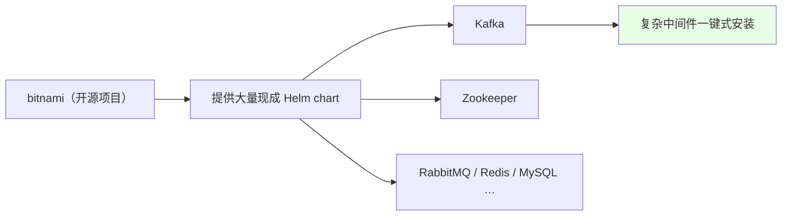
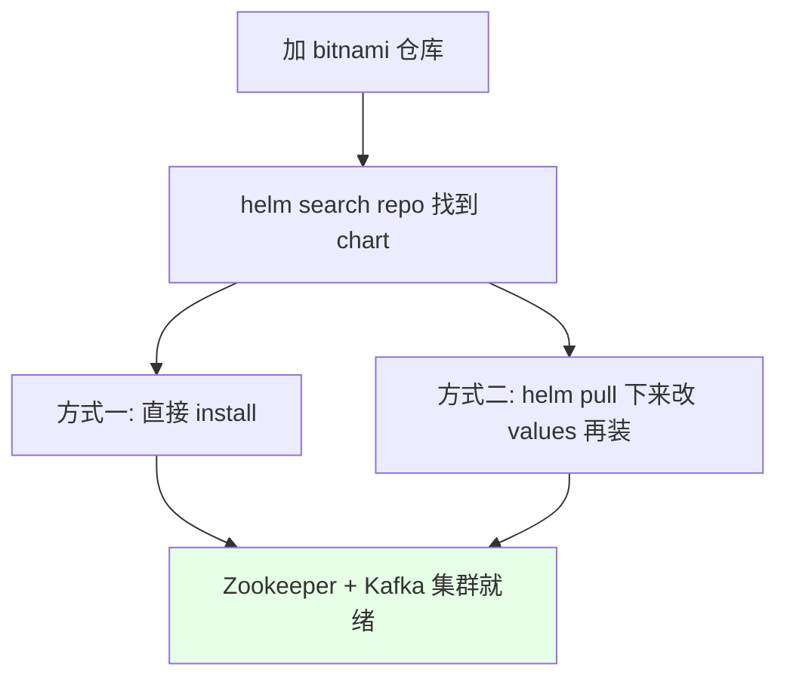
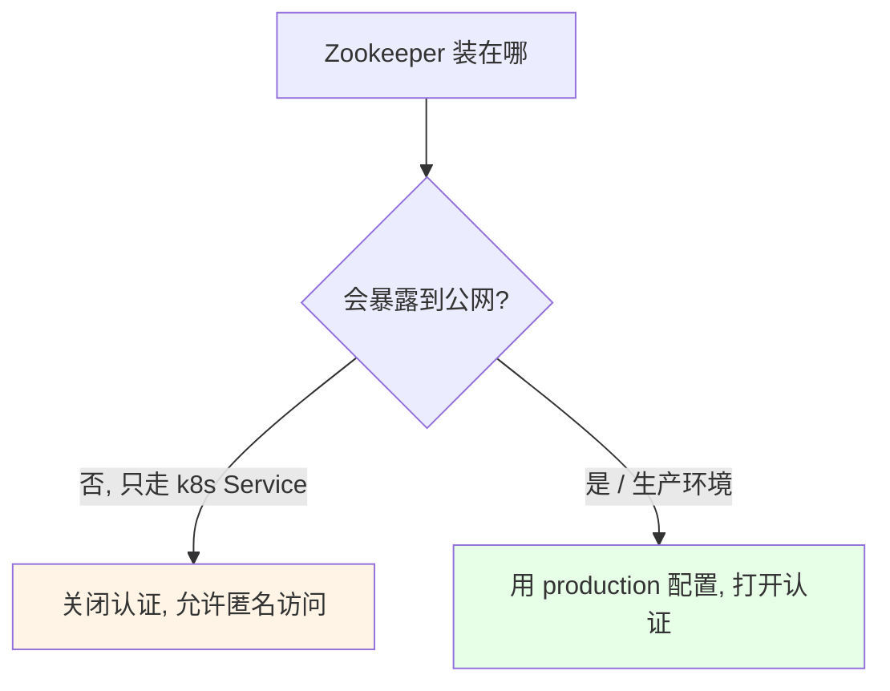
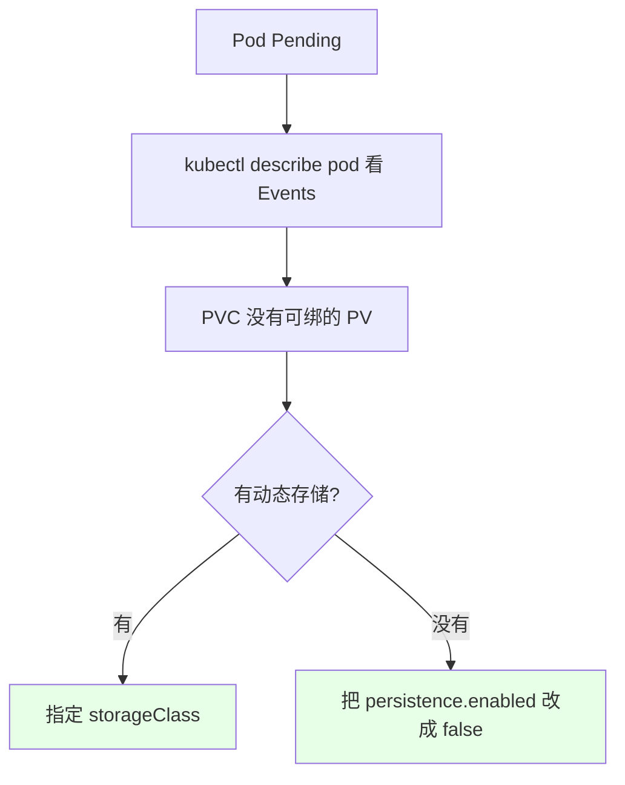
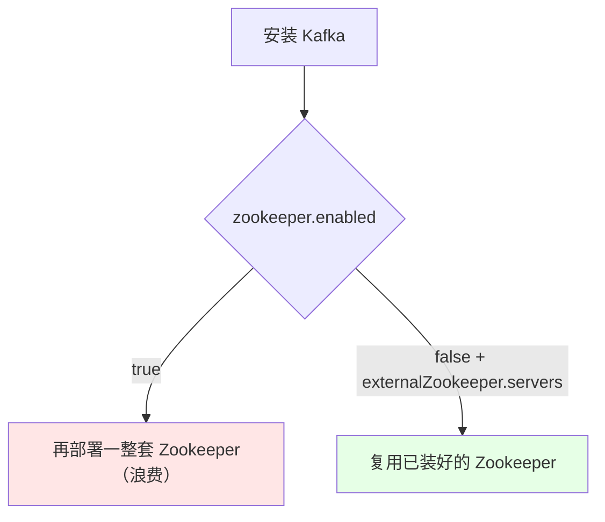
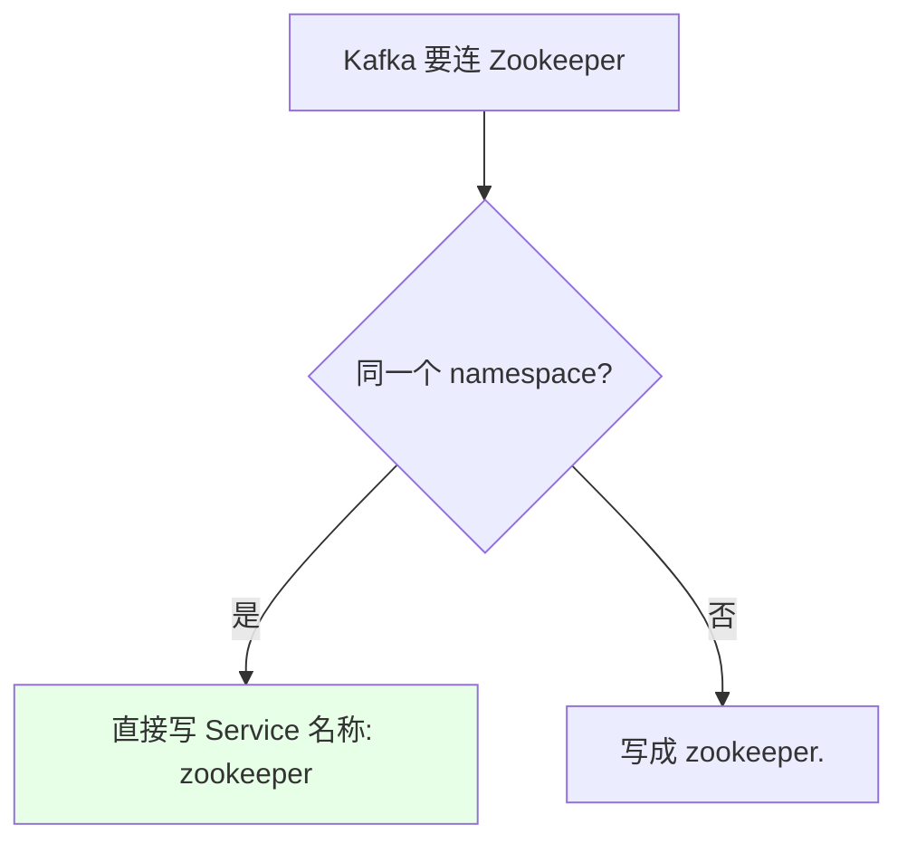
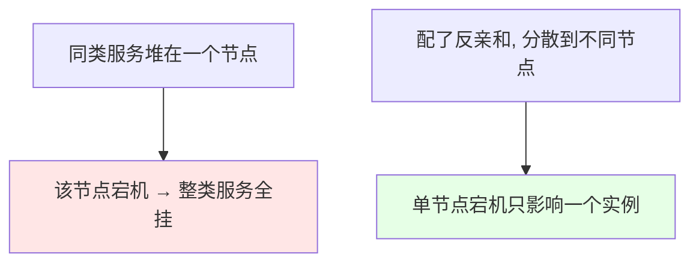

# Kubernetes 集群部署: 部署 Zookeeper 和 Kafka 集群（用 bitnami 的 Helm chart 一键搭建）

前面用 Helm 装过 RabbitMQ，这一节装 Zookeeper 和 Kafka —— 直接用 **bitnami 这个开源项目提供的 chart**，比我们自己写的功能全得多。整个安装就三步：**加仓库 → 装 Zookeeper → 装 Kafka**。

结论先摆：

1. **bitnami 是开源项目**，提供 Kafka、Zookeeper 这类复杂应用的一键式安装 chart，功能比自己写的全，值得关注；
2. **Zookeeper 与 Kafka 要共用一套 Zookeeper**：装 Kafka 时把内置的 `zookeeper.enabled` 关掉，用 `externalZookeeper.servers` 指向刚装好的 Zookeeper，否则会再部署一套；
3. **课程里关掉认证**（集群不暴露公网，没必要多此一举），**生产要改用 production 配置**；
4. **Pod 一直 `Pending` 是 PVC 造成的**：没配动态存储就把 `persistence.enabled` 关掉，否则要提前手工创建 PVC 或指定 `storageClass`；
5. **StatefulSet 的 `volumeClaimTemplates` 不允许变更**，存储相关改动只能 `uninstall` 后重装；
6. **生产必须配 affinity**，让同类型的服务不要落在同一个节点上，提高可用性。

## 纲要

- bitnami 是什么
- 三步安装流程
- Zookeeper 的安装参数
- 下载 chart 改 values 再装
- Pending 的根因：PVC
- Kafka 复用外部 Zookeeper
- 跨 namespace 的 Service 访问
- 生产环境的两条硬要求

## bitnami 是什么



它提供的 chart **功能比自己写的全得多**，写自己的 Helm 时可以拿它当参考。

## 三步安装流程

```bash
# ① 添加仓库（前面已经加过 bitnami）
helm repo add bitnami https://charts.bitnami.com/bitnami
helm repo update

# ② 搜索确认
helm search repo zookeeper
helm search repo kafka

# ③ 安装 Zookeeper 和 Kafka
helm install zookeeper bitnami/zookeeper -n public-service
helm install kafka bitnami/kafka -n public-service
```



| 方式 | 适用 |
| --- | --- |
| 直接 `helm install` | 参数不用动，最快 |
| `helm pull` 下来改 `values.yaml` 再装 | **要调参数时的做法（课程推荐）** |

```bash
# 下载 chart（v3 是 pull，v2 是 fetch）
helm pull bitnami/kafka
# 得到一个 tgz 文件
tar -zxvf kafka-10.2.1.tgz
```

## Zookeeper 的安装参数

| 参数 | 课程取值 | 说明 |
| --- | --- | --- |
| `replicaCount` | `1`（课程机器扛不住；生产改成 3） | 副本数 |
| 认证 | **关闭 / 允许匿名访问** | 集群不暴露公网，没必要开；**生产要用 production 配置** |
| `metrics` | **打开** | 让 Prometheus 采集它的告警信息 |



bitnami 的 chart 通常**提供两份 values**：一份默认的、一份 `values-production.yaml`（生产用），两者差别不算大 —— 测试用默认那份，生产以它为基础再改。

```bash
# 顺手指定 namespace，别让它落进 default
helm install zookeeper ./zookeeper -n public-service

# 安装后用它给的 Service 名称访问（2181 端口）
kubectl get svc -n public-service | grep zookeeper
```

> 课程里第一次装忘了加 `-n`，直接部署到了 `default` namespace —— **记得用 `-n` 指定**。

## Pending 的根因：PVC

装完发现 Pod 一直 `Pending`，`describe` 后确认是 **PVC 绑不上**：



```yaml
# values.yaml
persistence:
  enabled: false        # ← 没有后端存储时先关掉
  # storageClass: "my-sc"   # ← 有动态存储时指定这个
  # size: 8Gi
```

> chart 里的提示原文：`if defined, PVC must be created manually before volume will be bound` —— **打开持久化的话，要么提前手工建好 PVC，要么用动态存储并指定 `storageClass`**。

```bash
# 定位 Pending 原因
# 下面命令中的变量按你的集群环境赋值后再执行
kubectl describe pod $POD -n public-service | tail -20

# 改完 values 后，StatefulSet 的 volumeClaimTemplates 不可变更 → 只能卸载重装
helm uninstall zookeeper -n public-service
helm install zookeeper ./zookeeper -n public-service
```

## Kafka 复用外部 Zookeeper

**Kafka 依赖 Zookeeper**，而刚才已经装了一套 Zookeeper，所以装 Kafka 时要**关掉它内置的 Zookeeper**，改用外部的：

```yaml
# kafka 的 values.yaml
zookeeper:
  enabled: false          # ← 关掉内置的，否则会再部署一套 Zookeeper

externalZookeeper:
  servers: zookeeper      # ← 指向刚创建的 Zookeeper Service
```



```bash
helm install kafka ./kafka -n public-service
```

## 跨 namespace 的 Service 访问



Service 是 **namespace 隔离**的：同 namespace 直接写名字（如 `zookeeper`），跨 namespace 要在后面补上 `.namespace`。

> 另外注意：`helm install kafka .` 里最后的 `.` 代表**当前目录的本地 chart**；不写 `.` 的话它会去仓库里按名字找 chart。

## 生产环境的两条硬要求

```text
生产环境部署 Zookeeper / Kafka 的注意点:

1. 数据持久化
   └── 按需配置 persistence（storageClass 或提前建 PVC）
       └── 不要像测试环境那样关掉了事

2. 配置 affinity（必须）
   └── 让同类型的服务尽量落在不同节点上
       └── 同一个节点挂了不至于整类服务全没
       └── 提高可用率
```

```yaml
# values.yaml 里补 affinity（示意）
affinity:
  podAntiAffinity:
    requiredDuringSchedulingIgnoredDuringExecution:
      - labelSelector:
          matchLabels:
            app.kubernetes.io/name: zookeeper
        topologyKey: kubernetes.io/hostname
```



用 StatefulSet 部署这类中间件的注意点和前面讲的中间件是一致的：**按需做数据持久化 + 必须配 affinity**。

## API 速览

| 能力 | 做法 |
| --- | --- |
| 加仓库 | `helm repo add bitnami https://charts.bitnami.com/bitnami` |
| 搜 chart | `helm search repo zookeeper` / `kafka` |
| 下载 chart 本地改 | `helm pull bitnami/kafka` → `tar -zxvf kafka-*.tgz` |
| 装 Zookeeper | `helm install zookeeper ./zookeeper -n <ns>` |
| 装 Kafka | `helm install kafka ./kafka -n <ns>` |
| 关持久化 | `persistence.enabled: false` |
| 用动态存储 | `persistence.storageClass: <你的 storageClass>` |
| Kafka 复用 Zookeeper | `zookeeper.enabled=false` + `externalZookeeper.servers: zookeeper` |
| 查 Pending 原因 | `kubectl describe pod <pod>` |

## Demo 示例

```bash
NS=public-service
kubectl create namespace $NS

# 1. 下载 bitnami 的 chart 到本地改参数
helm pull bitnami/zookeeper
helm pull bitnami/kafka
tar -zxvf zookeeper-*.tgz
tar -zxvf kafka-*.tgz

# 2. 改 Zookeeper 的 values：副本数、关认证、关持久化
sed -i '' 's/^  enabled: true/  enabled: false/' zookeeper/values.yaml  # 以实际字段为准，按需改
vi zookeeper/values.yaml   # 确认 replicaCount / allowAnonymous / persistence

# 3. 安装 Zookeeper（记得 -n 指定 namespace）
helm install zookeeper ./zookeeper -n $NS
kubectl get pod,svc -n $NS | grep zookeeper

# 4. 改 Kafka 的 values：关掉内置 Zookeeper，指向外部的
vi kafka/values.yaml
#   zookeeper.enabled: false
#   externalZookeeper.servers: zookeeper

# 5. 安装 Kafka
helm install kafka ./kafka -n $NS

# 6. Pending 就查 PVC
kubectl describe pod -n $NS | tail -30

# 7. 存储字段不可变更 → 卸载重装
helm uninstall kafka -n $NS
helm install kafka ./kafka -n $NS

# 8. 看两个 release
helm list -n $NS
```

### 总结

- **bitnami 是个开源项目，提供 Kafka、Zookeeper 等复杂中间件的现成 Helm chart**，功能比自己写的全，装起来就三步：加仓库 → 装 Zookeeper → 装 Kafka；写自己的 Helm 时可以拿它当参考；
- **装 Kafka 必须复用已装的 Zookeeper**：把 `zookeeper.enabled` 设为 `false`，并用 `externalZookeeper.servers` 指向外部 Zookeeper 的 Service，否则它会自己再部署一整套；
- **课程里关掉认证是因为集群不暴露公网**（只用 k8s Service 解析），**生产环境要改用 bitnami 提供的 production 配置**；副本数课程用 1（机器扛不住），生产应改成 3；同时打开 `metrics` 让 Prometheus 采集告警信息；
- **Pod 一直 `Pending` 基本都是 PVC 造成的**：没有动态存储就把 `persistence.enabled` 关掉，有动态存储就指定 `storageClass`；chart 的提示是「打开持久化的话要么提前手工建 PVC，要么用动态存储」；
- **StatefulSet 的 `volumeClaimTemplates` 不允许变更**，存储相关的改动只能 `uninstall` 后重装；另外 `helm install kafka .` 里最后的 `.` 代表当前目录的本地 chart，不写会去仓库里找；
- **生产环境两条硬要求**：一是按需做数据持久化，二是**必须配 affinity 让同类服务分散到不同节点**，避免一个节点宕机导致整类服务全挂；另外跨 namespace 访问 Service 要在名称后补 `.namespace`。

