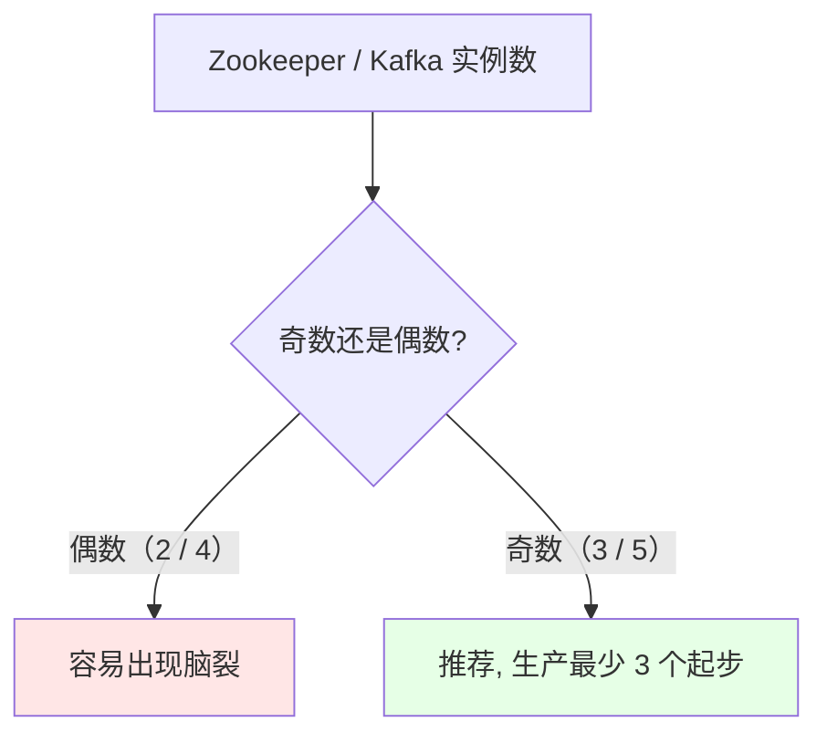
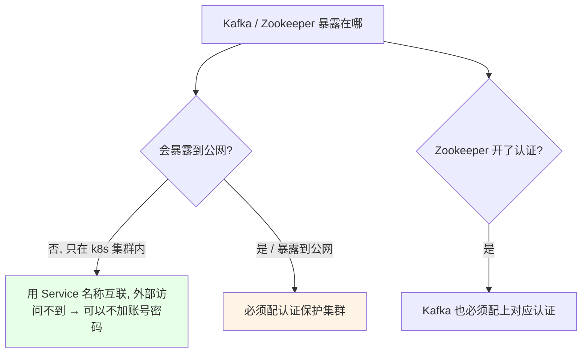
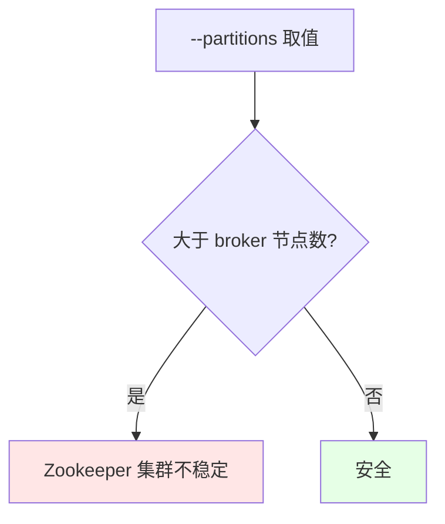
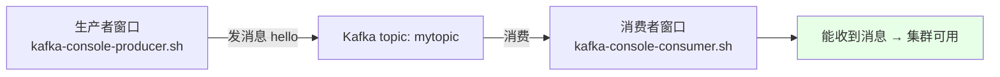

# Kubernetes 集群部署: 测试 Kafka 和 Zookeeper 集群（建 topic 与生产消费消息验证可用性）

上一节把 Zookeeper 和 Kafka 用 Helm 装上了，这一节**验证它到底能不能用**：确认 Kafka 连上了 Zookeeper、建一个 topic、起一对生产者和消费者，看消息能不能通。

结论先摆：

1. **生产环境最少 3 个实例起步，而且必须是奇数个**（别起 2 个、4 个），防止脑裂；
2. **Zookeeper 没开认证，Kafka 就不用加认证** —— 它们只在集群内部用 k8s Service 互联，外部访问不到，比较安全；反过来说 **Zookeeper 开了认证，Kafka 也必须配上**；
3. **验证 Kafka 是否连上 Zookeeper**：看它是否建立了到 Zookeeper 2181 端口的 socket 连接，且地址与 Zookeeper 的 Service 地址一致；
4. **建 topic 时 `--partitions` 不要大于 broker / Zookeeper 节点数**，否则会导致 Zookeeper 集群不稳定；
5. **新版 Kafka 用 `--bootstrap-server`，不再认 `--zookeeper` 参数**；
6. **验证方式**：一个窗口起消费者、另一个窗口起生产者，生产者发消息消费者能收到就说明集群可用。

## 纲要

- 生产环境的实例数要求（奇数）
- 认证：为什么可以不开
- 确认 Kafka 已连上 Zookeeper
- 建 topic（分区与副本数的取值）
- 起消费者与生产者
- 新版 Kafka 的参数变化
- bitnami 给的两个测试脚本坑
- 扩容

## 生产环境的实例数要求



课程演示只起了 1 个实例（机器扛不住），**生产最少 3 个，且一定用奇数个**。

## 认证：为什么可以不开



集群内部的程序是用 **k8s Service 名称**连 Kafka / Zookeeper 的，除了 k8s 集群内部，没人能访问到那个 IP 和端口，所以**不需要开账号密码**。想确认的话，直接拿 Service IP 测一下端口通不通：

```bash
# 用 nc 测一下端口是否可达（在集群内）
kubectl run net-test --rm -it --image=busybox -- nc -zv $ZOOKEEPER_SVC 2181
kubectl run net-test --rm -it --image=busybox -- nc -zv $KAFKA_SVC 9092
```

> 反过来：**如果 Zookeeper 开了认证，Kafka 连它时也必须把认证加上**。

## 确认 Kafka 已连上 Zookeeper

进到 Kafka 容器里看它的配置和连接情况 —— **如果它打开了一个到 2181 的 socket 连接，且地址就是 Zookeeper 的 Service 地址，说明已经连上了**：

```bash
# 看 Kafka 的配置（Zookeeper 地址在 values.yaml 里配的 externalZookeeper.servers）
kubectl exec -it $KAFKA_POD -n public-service -- cat /opt/bitnami/kafka/config/server.properties | grep zookeeper

# 确认连接建立
kubectl exec -it $KAFKA_POD -n public-service -- \
  sh -c 'netstat -anp | grep 2181'
```


## 建 topic

进到 Kafka 容器里执行（课程只起了 1 个 Kafka 实例，直接进即可）：

```bash
kubectl exec -it $KAFKA_POD -n public-service -- bash

# 建 topic：分区 1、副本 1，Zookeeper 同 namespace 直接写 Service 名
kafka-topics.sh --create \
  --topic mytopic \
  --zookeeper zookeeper \
  --replication-factor 1 \
  --partitions 1
```

| 参数 | 取值 | 说明 |
| --- | --- | --- |
| `--topic` | `mytopic` | topic 名称 |
| `--zookeeper` | `zookeeper`（同 namespace 直接写 Service 名） | Zookeeper 地址 |
| `--replication-factor` | `1` | 副本数 |
| `--partitions` | `1` | **分区数，不能大于 broker / Zookeeper 节点数** |



> **分区是一个物理概念**：一个 topic 的数据按分区保存到不同的目录上，相当于创建了几份。

## 起消费者与生产者

**开两个窗口**：一个跑消费者，一个跑生产者。

```bash
# 窗口一：启动消费者（9092 是 Kafka 的端口）
kubectl exec -it $KAFKA_POD -n public-service -- \
  kafka-console-consumer.sh --bootstrap-server kafka:9092 --topic mytopic

# 窗口二：启动生产者
kubectl exec -it $KAFKA_POD -n public-service -- \
  kafka-console-producer.sh --bootstrap-server kafka:9092 --topic mytopic
```



在生产者窗口敲 `hello`，消费者窗口立刻收到 —— **消息通了，集群就能用了**，可以交给开发使用。

## 新版 Kafka 的参数变化

```bash
# 老写法（新版已不认）
kafka-topics.sh --create --zookeeper zookeeper:2181 --topic mytopic
# 报错：zookeeper is not a recognized option

# 新写法：统一用 --bootstrap-server
kafka-topics.sh --create --bootstrap-server kafka:9092 --topic mytopic
```

| 参数 | 适用 |
| --- | --- |
| `--zookeeper` | **老版本**；新版报 `zookeeper is not a recognized option` |
| `--bootstrap-server` | **新版**，统一用它 |

## bitnami 给的两个测试脚本坑

课程里照着 chart 自带的测试步骤做，遇到两个问题：

```text
bitnami chart 自带测试步骤的两个坑:

1. 给的测试模板命令写的不对
   └── 不照抄, 自己拼命令即可

2. 镜像里没有它引用的那个配置文件
   └── 从网上找一个同版本的配置模板补进去, 或者直接不指定配置文件启动
       └── 实测不指定配置文件也能正常启动生产者/消费者
```

```bash
# 不指定配置文件也能跑（课程实测可行）
kafka-console-producer.sh --bootstrap-server kafka:9092 --topic mytopic
```

## 扩容

扩容就是前面讲过的方式，直接用 Helm 改副本数后再升级即可（Zookeeper / Kafka 这类要注意保持奇数个节点）。

## API 速览

| 能力 | 做法 |
| --- | --- |
| 测端口连通 | `nc -zv <service> <端口>` |
| 确认 Kafka 连上 Zookeeper | 看配置里的 zookeeper 地址 + `netstat \| grep 2181` |
| 建 topic | `kafka-topics.sh --create --bootstrap-server kafka:9092 --topic <名>` |
| 起消费者 | `kafka-console-consumer.sh --bootstrap-server kafka:9092 --topic <名>` |
| 起生产者 | `kafka-console-producer.sh --bootstrap-server kafka:9092 --topic <名>` |
| 分区数上限 | 不能大于 broker / Zookeeper 节点数 |
| 实例数 | 生产最少 3 个，且必须是奇数 |

## Demo 示例

```bash
NS=public-service
KAFKA_POD=$(kubectl get pod -n $NS -l app.kubernetes.io/name=kafka -o jsonpath='{.items[0].metadata.name}')

# 1. 确认 Kafka 已连上 Zookeeper
kubectl exec -it $KAFKA_POD -n $NS -- sh -c 'netstat -anp | grep 2181'

# 2. 建 topic（分区和副本都先设 1）
kubectl exec -it $KAFKA_POD -n $NS -- \
  kafka-topics.sh --create --bootstrap-server kafka:9092 \
  --topic mytopic --replication-factor 1 --partitions 1

# 3. 查看 topic 列表
kubectl exec -it $KAFKA_POD -n $NS -- \
  kafka-topics.sh --list --bootstrap-server kafka:9092

# 4. 窗口一：起消费者
kubectl exec -it $KAFKA_POD -n $NS -- \
  kafka-console-consumer.sh --bootstrap-server kafka:9092 --topic mytopic

# 5. 窗口二：起生产者，敲 hello
kubectl exec -it $KAFKA_POD -n $NS -- \
  kafka-console-producer.sh --bootstrap-server kafka:9092 --topic mytopic
# > hello
# 窗口一应立刻收到 hello

# 6. 集群内测端口连通性
kubectl run net-test --rm -it --image=busybox -- nc -zv kafka 9092
```

### 总结

- **生产环境 Zookeeper / Kafka 最少 3 个实例起步，且必须是奇数个**（不要 2 个、4 个），防止脑裂；课程演示只起 1 个是因为机器扛不住；
- **认证可以不开的前提是集群不暴露公网**：Kafka / Zookeeper 用 k8s Service 名称互联，集群外部访问不到那个 IP 和端口，比较安全；但**如果 Zookeeper 开了认证，Kafka 也必须配上对应认证**，暴露公网时更必须配；
- **验证 Kafka 是否连上 Zookeeper**：看它的配置里 Zookeeper 地址是否正确，以及是否建立了到 2181 端口的 socket 连接，地址与 Zookeeper 的 Service 地址一致即为成功；
- **建 topic 时 `--partitions` 不能大于 broker / Zookeeper 节点数**，否则会导致 Zookeeper 集群不稳定；分区是物理概念，数据按分区保存到不同目录；
- **新版 Kafka 统一用 `--bootstrap-server`，`--zookeeper` 已不被识别**（报 `zookeeper is not a recognized option`）；另外 bitnami chart 自带的测试步骤有两个坑 —— 模板命令不对、镜像里没有它引用的配置文件，**不指定配置文件直接启动生产者/消费者同样可用**；
- **最终验证就是「一个窗口发、一个窗口收」**：生产者敲 `hello`，消费者能收到，消息队列就确认可用，可以交付给开发使用；扩容按前面讲过的方式改副本数即可，注意保持奇数个节点。

